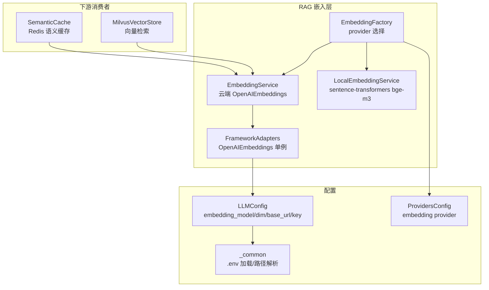
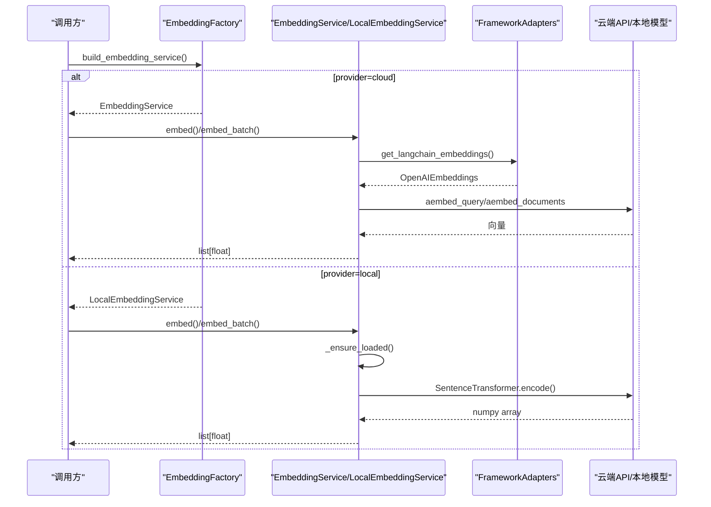
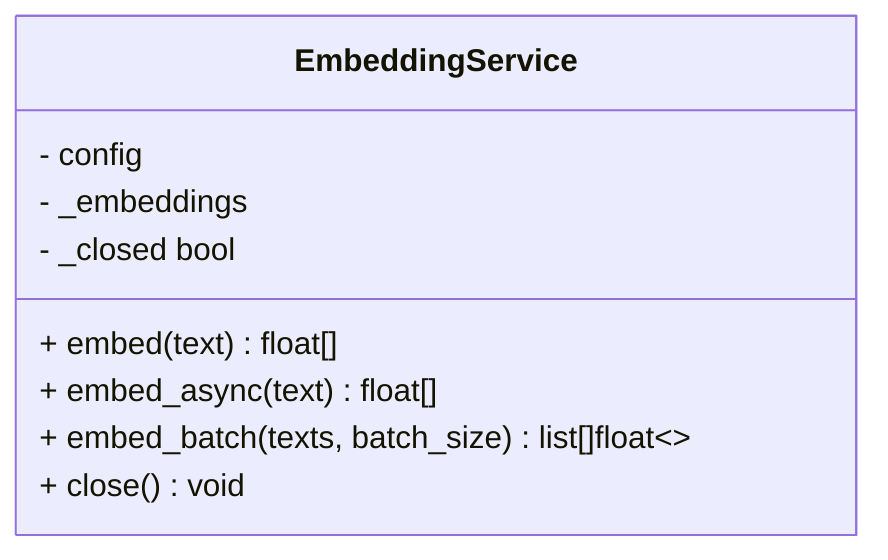
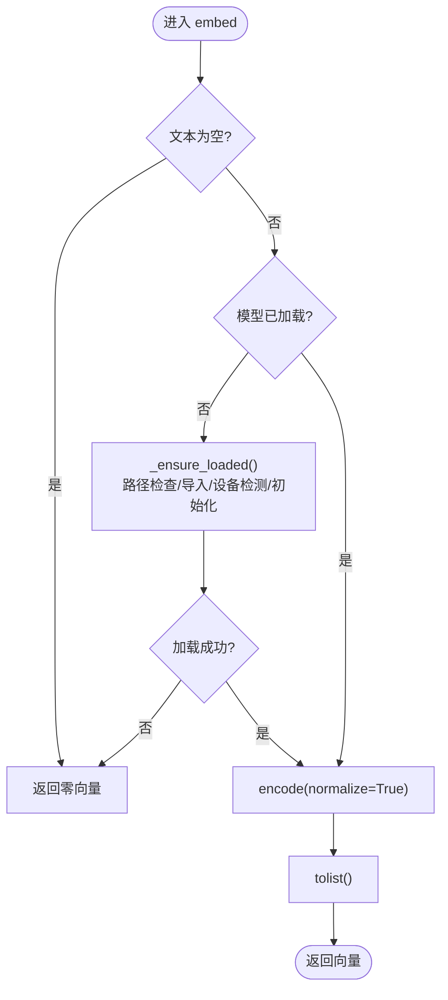
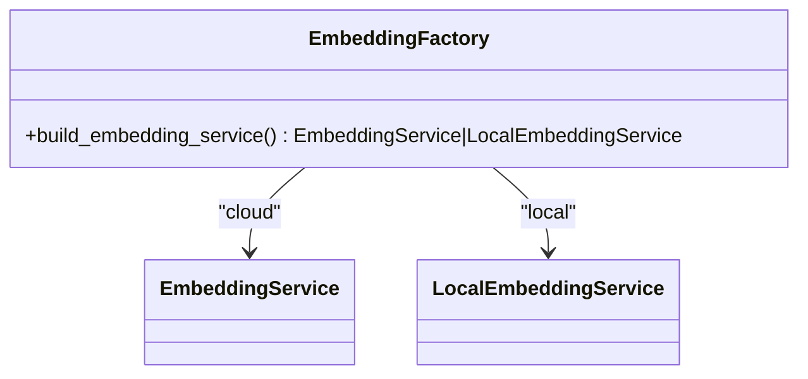
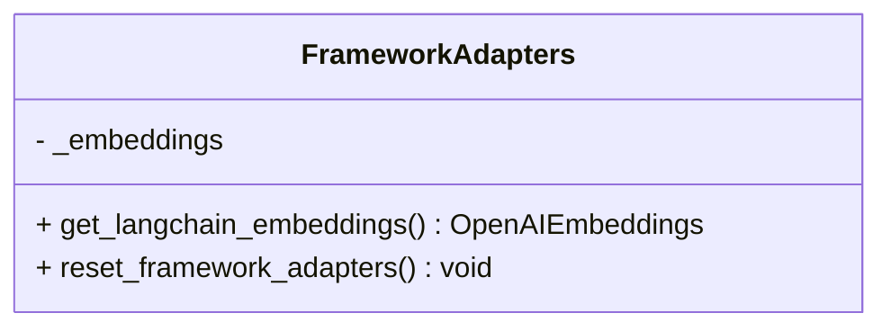
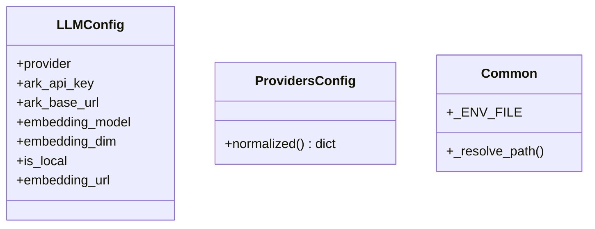
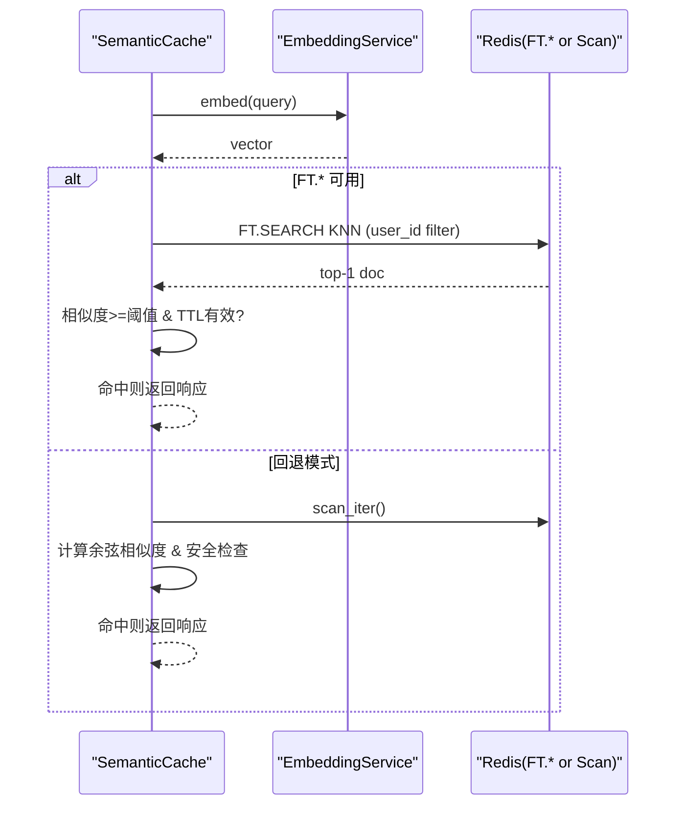
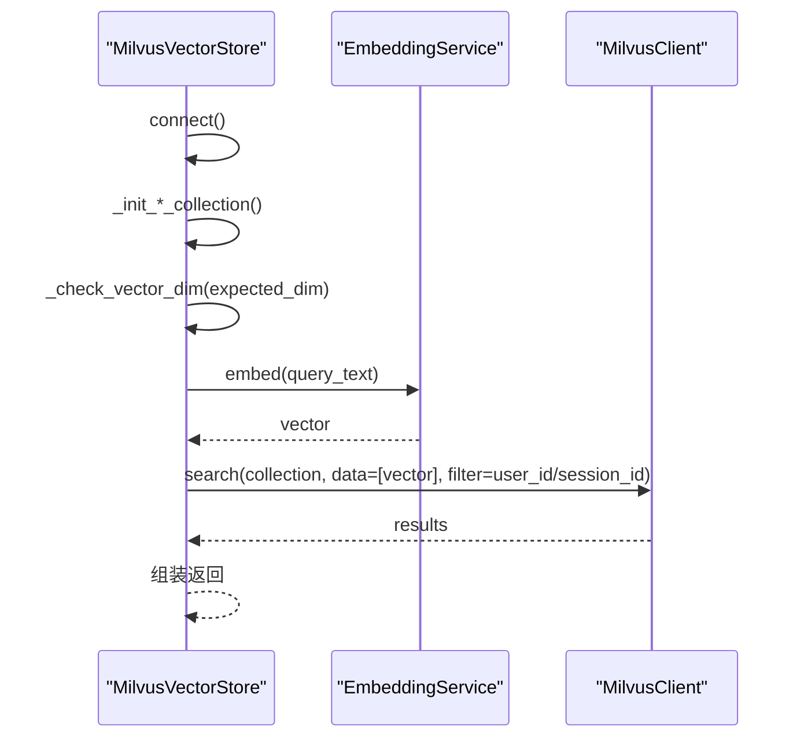
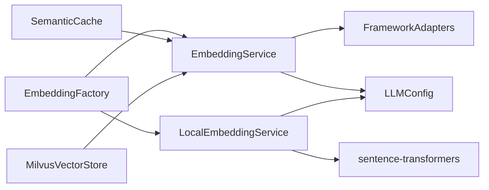

# 嵌入服务

<cite>
**本文引用的文件**   
- [embedding.py](file://backend_design/nexus/rag/embedding.py)
- [local_embedding.py](file://backend_design/nexus/rag/local_embedding.py)
- [embedding_factory.py](file://backend_design/nexus/rag/embedding_factory.py)
- [framework_adapters.py](file://backend_design/nexus/rag/framework_adapters.py)
- [llm.py](file://backend_design/nexus/config/llm.py)
- [providers.py](file://backend_design/nexus/config/providers.py)
- [_common.py](file://backend_design/nexus/config/_common.py)
- [redis_cache.py](file://backend_design/nexus/middleware/redis_cache.py)
- [vector_store.py](file://backend_design/nexus/rag/vector_store.py)
- [exceptions.py](file://backend_design/nexus/core/exceptions.py)
- [metrics.py](file://backend_design/nexus/observability/metrics.py)
</cite>

## 目录
1. [简介](#简介)
2. [项目结构](#项目结构)
3. [核心组件](#核心组件)
4. [架构总览](#架构总览)
5. [详细组件分析](#详细组件分析)
6. [依赖关系分析](#依赖关系分析)
7. [性能与调优](#性能与调优)
8. [故障排查指南](#故障排查指南)
9. [结论](#结论)
10. [附录：扩展与示例](#附录扩展与示例)

## 简介
本技术文档围绕“嵌入服务”展开，系统性阐述 EmbeddingService 的设计模式、多后端支持（云端 API 与本地模型）、bge-m3 本地模型的加载与推理优化、向量生成与批量处理、缓存机制、维度配置与精度权衡、性能调优最佳实践，以及云端 API 配置、本地部署与混合部署方案。同时给出如何扩展新的嵌入模型提供商与自定义嵌入函数的方法，并覆盖错误处理、重试机制与监控指标的实现细节。

## 项目结构
嵌入服务位于 RAG 子系统中，采用“工厂 + 适配器”的解耦设计：
- 统一服务接口：EmbeddingService（云端）与 LocalEmbeddingService（本地）提供一致的 embed / embed_batch / close 等接口
- 工厂选择：embedding_factory 根据配置选择 provider（cloud 或 local）
- 框架适配：framework_adapters 封装 langchain_openai.OpenAIEmbeddings，统一连接池、重试、异步与批量能力
- 配置中心：llm.py 管理 embedding_model、embedding_dim、API Key、Base URL 等；providers.py 提供 provider 开关；_common.py 提供路径与环境文件加载策略
- 集成点：Redis 语义缓存与 Milvus 向量存储均依赖 EmbeddingService 输出维度一致性

**图表来源** 
- [embedding_factory.py:27-39](file://backend_design/nexus/rag/embedding_factory.py#L27-L39)
- [embedding.py:23-63](file://backend_design/nexus/rag/embedding.py#L23-L63)
- [local_embedding.py:32-182](file://backend_design/nexus/rag/local_embedding.py#L32-L182)
- [framework_adapters.py:30-67](file://backend_design/nexus/rag/framework_adapters.py#L30-L67)
- [llm.py:15-72](file://backend_design/nexus/config/llm.py#L15-L72)
- [providers.py:15-47](file://backend_design/nexus/config/providers.py#L15-L47)
- [_common.py:15-75](file://backend_design/nexus/config/_common.py#L15-L75)
- [redis_cache.py:52-55](file://backend_design/nexus/middleware/redis_cache.py#L52-L55)
- [vector_store.py:36-417](file://backend_design/nexus/rag/vector_store.py#L36-L417)

**章节来源**
- [embedding_factory.py:27-39](file://backend_design/nexus/rag/embedding_factory.py#L27-L39)
- [embedding.py:23-63](file://backend_design/nexus/rag/embedding.py#L23-L63)
- [local_embedding.py:32-182](file://backend_design/nexus/rag/local_embedding.py#L32-L182)
- [framework_adapters.py:30-67](file://backend_design/nexus/rag/framework_adapters.py#L30-L67)
- [llm.py:15-72](file://backend_design/nexus/config/llm.py#L15-L72)
- [providers.py:15-47](file://backend_design/nexus/config/providers.py#L15-L47)
- [_common.py:15-75](file://backend_design/nexus/config/_common.py#L15-L75)
- [redis_cache.py:52-55](file://backend_design/nexus/middleware/redis_cache.py#L52-L55)
- [vector_store.py:36-417](file://backend_design/nexus/rag/vector_store.py#L36-L417)

## 核心组件
- EmbeddingService（云端）
  - 基于 langchain_openai.OpenAIEmbeddings，提供 aembed_query/aembed_documents 异步接口
  - 内置连接池、自动重试、超时控制、批量向量化
  - 异常统一转换为 LLMError，便于上层捕获与降级
- LocalEmbeddingService（本地）
  - 基于 sentence-transformers 加载 BAAI/bge-m3，默认 1024 维
  - 延迟加载、CPU/GPU/MPS 自动检测、run_in_executor 避免阻塞事件循环
  - 提供 embed / embed_batch / dimension / is_available / close
- EmbeddingFactory
  - 依据 providers.embedding 选择 cloud 或 local 后端
- FrameworkAdapters
  - 全局单例 OpenAIEmbeddings，集中配置 model、api_key、base_url、dimensions、timeout、max_retries

**章节来源**
- [embedding.py:23-63](file://backend_design/nexus/rag/embedding.py#L23-L63)
- [local_embedding.py:32-182](file://backend_design/nexus/rag/local_embedding.py#L32-L182)
- [embedding_factory.py:27-39](file://backend_design/nexus/rag/embedding_factory.py#L27-L39)
- [framework_adapters.py:30-67](file://backend_design/nexus/rag/framework_adapters.py#L30-L67)

## 架构总览
嵌入服务通过工厂模式动态选择后端，统一对外暴露异步嵌入接口。云端路径使用 LangChain 的 OpenAIEmbeddings，具备连接池与重试；本地路径使用 sentence-transformers 直接推理，确保数据不出服务器。下游 Redis 语义缓存与 Milvus 向量库均依赖统一的维度配置，保证索引与查询一致。

**图表来源** 
- [embedding_factory.py:27-39](file://backend_design/nexus/rag/embedding_factory.py#L27-L39)
- [embedding.py:30-58](file://backend_design/nexus/rag/embedding.py#L30-L58)
- [framework_adapters.py:30-67](file://backend_design/nexus/rag/framework_adapters.py#L30-L67)
- [local_embedding.py:51-134](file://backend_design/nexus/rag/local_embedding.py#L51-L134)

## 详细组件分析

### EmbeddingService（云端）
- 职责：封装 OpenAIEmbeddings，提供异步单条与批量嵌入，统一异常为 LLMError
- 关键行为：
  - embed(text): 空文本返回零向量；失败记录日志并抛出 LLMError
  - embed_batch(texts, batch_size): 批量调用 aembed_documents；失败返回零向量列表
  - close(): 标记关闭状态
- 依赖：config.llm（embedding_model、ark_base_url、ark_api_key、embedding_dim）

**图表来源** 
- [embedding.py:23-63](file://backend_design/nexus/rag/embedding.py#L23-L63)

**章节来源**
- [embedding.py:30-58](file://backend_design/nexus/rag/embedding.py#L30-L58)

### LocalEmbeddingService（本地 bge-m3）
- 职责：本地句子级嵌入，延迟加载模型，设备自动检测，线程池执行避免阻塞
- 关键行为：
  - _ensure_loaded(): 检查路径、导入依赖、创建 SentenceTransformer、记录维度
  - _detect_device(): 优先 CUDA，其次 MPS，最后 CPU
  - embed(text)/embed_batch(texts, batch_size): run_in_executor 包装同步 encode
  - dimension/is_available/close: 属性与资源释放
- 模型路径：默认 models/embedding/bge-m3，不触发联网下载

**图表来源** 
- [local_embedding.py:51-134](file://backend_design/nexus/rag/local_embedding.py#L51-L134)

**章节来源**
- [local_embedding.py:32-182](file://backend_design/nexus/rag/local_embedding.py#L32-L182)

### EmbeddingFactory（提供者选择）
- 职责：读取 providers.embedding 决定 cloud 或 local
- 行为：cloud → EmbeddingService；否则 → LocalEmbeddingService

**图表来源** 
- [embedding_factory.py:27-39](file://backend_design/nexus/rag/embedding_factory.py#L27-L39)

**章节来源**
- [embedding_factory.py:27-39](file://backend_design/nexus/rag/embedding_factory.py#L27-L39)

### FrameworkAdapters（LangChain 适配）
- 职责：全局单例 OpenAIEmbeddings，集中配置 model、api_key、base_url、dimensions、timeout、max_retries
- 行为：get_langchain_embeddings() 懒加载；reset_framework_adapters() 用于配置热更新

**图表来源** 
- [framework_adapters.py:30-67](file://backend_design/nexus/rag/framework_adapters.py#L30-L67)

**章节来源**
- [framework_adapters.py:30-67](file://backend_design/nexus/rag/framework_adapters.py#L30-L67)

### 配置体系（LLMConfig/ProvidersConfig/_common）
- LLMConfig：embedding_model、embedding_dim、ark_base_url、ark_api_key、is_local、embedding_url
- ProvidersConfig：normalized() 返回小写 provider 字典
- _common：.env.local/.env 优先级与路径解析

**图表来源** 
- [llm.py:15-72](file://backend_design/nexus/config/llm.py#L15-L72)
- [providers.py:15-47](file://backend_design/nexus/config/providers.py#L15-L47)
- [_common.py:15-75](file://backend_design/nexus/config/_common.py#L15-L75)

**章节来源**
- [llm.py:15-72](file://backend_design/nexus/config/llm.py#L15-L72)
- [providers.py:15-47](file://backend_design/nexus/config/providers.py#L15-L47)
- [_common.py:15-75](file://backend_design/nexus/config/_common.py#L15-L75)

### 与 Redis 语义缓存的集成
- 维度一致性：_get_vector_dim() 从 llm.embedding_dim 获取，确保索引与查询一致
- 查询流程：先 embed(query)，再 KNN 搜索或 scan 回退；安全检查 has_side_effect 禁止车控指令命中缓存
- 写入流程：has_side_effect=True 时跳过写入；embedding 字段在 RediSearch 模式下存 float32 bytes，兼容模式存 JSON

**图表来源** 
- [redis_cache.py:213-301](file://backend_design/nexus/middleware/redis_cache.py#L213-L301)
- [redis_cache.py:367-436](file://backend_design/nexus/middleware/redis_cache.py#L367-L436)
- [redis_cache.py:52-55](file://backend_design/nexus/middleware/redis_cache.py#L52-L55)

**章节来源**
- [redis_cache.py:213-301](file://backend_design/nexus/middleware/redis_cache.py#L213-L301)
- [redis_cache.py:367-436](file://backend_design/nexus/middleware/redis_cache.py#L367-L436)
- [redis_cache.py:52-55](file://backend_design/nexus/middleware/redis_cache.py#L52-L55)

### 与 Milvus 向量存储的集成
- 维度校验：初始化集合时检查 collection 的 dim 是否与 llm.embedding_dim 一致，不一致则重建
- 检索流程：search_memory/search_food 先 embed 再 search，支持 user_id/session_id 过滤
- LangChain 适配：as_langchain_store() 返回 Milvus 实例，注入 OpenAIEmbeddings

**图表来源** 
- [vector_store.py:45-84](file://backend_design/nexus/rag/vector_store.py#L45-L84)
- [vector_store.py:201-231](file://backend_design/nexus/rag/vector_store.py#L201-L231)
- [vector_store.py:360-390](file://backend_design/nexus/rag/vector_store.py#L360-L390)

**章节来源**
- [vector_store.py:45-84](file://backend_design/nexus/rag/vector_store.py#L45-L84)
- [vector_store.py:201-231](file://backend_design/nexus/rag/vector_store.py#L201-L231)
- [vector_store.py:360-390](file://backend_design/nexus/rag/vector_store.py#L360-L390)

## 依赖关系分析
- EmbeddingService 依赖 framework_adapters 提供的 OpenAIEmbeddings 单例
- LocalEmbeddingService 依赖 sentence-transformers 与 PyTorch（CUDA/MPS/CPU）
- 工厂依赖 providers.embedding 配置
- 下游消费者（Redis 缓存、Milvus 存储）依赖 llm.embedding_dim 保持一致性

**图表来源** 
- [embedding_factory.py:27-39](file://backend_design/nexus/rag/embedding_factory.py#L27-L39)
- [embedding.py:30-58](file://backend_design/nexus/rag/embedding.py#L30-L58)
- [local_embedding.py:51-134](file://backend_design/nexus/rag/local_embedding.py#L51-L134)
- [framework_adapters.py:30-67](file://backend_design/nexus/rag/framework_adapters.py#L30-L67)
- [llm.py:15-72](file://backend_design/nexus/config/llm.py#L15-L72)

**章节来源**
- [embedding_factory.py:27-39](file://backend_design/nexus/rag/embedding_factory.py#L27-L39)
- [embedding.py:30-58](file://backend_design/nexus/rag/embedding.py#L30-L58)
- [local_embedding.py:51-134](file://backend_design/nexus/rag/local_embedding.py#L51-L134)
- [framework_adapters.py:30-67](file://backend_design/nexus/rag/framework_adapters.py#L30-L67)
- [llm.py:15-72](file://backend_design/nexus/config/llm.py#L15-L72)

## 性能与调优
- 云端 API（OpenAIEmbeddings）
  - 连接池与重试：由框架内部维护，建议合理设置 timeout 与 max_retries
  - 批量向量化：优先使用 embed_batch 降低网络往返
  - 维度配置：embedding_dim 需与下游索引一致，避免重建成本
- 本地模型（bge-m3）
  - 设备选择：优先 CUDA，其次 MPS，最后 CPU；GPU 显存不足时可降批大小
  - 批处理：embed_batch 的 batch_size 按内存与吞吐平衡调整
  - 归一化：normalize_embeddings=True 提升相似度稳定性
  - 延迟加载：首次调用才加载模型，减少启动开销
- 缓存与检索
  - Redis 语义缓存：KNN 模式 O(log n)，scan 模式 O(n)；相似度阈值与 TTL 影响命中率
  - Milvus 索引：index_type/metric_type/params 影响召回与延迟；用户/会话维度字段可加速过滤

[本节为通用指导，不直接分析具体文件]

## 故障排查指南
- 常见错误类型
  - LLMError：云端嵌入失败（网络/鉴权/限流），记录日志并向上抛出
  - VectorStoreError：Milvus 连接/操作失败
  - CacheError：Redis 读写失败
  - CircuitBreakerError：熔断器拒绝请求（用于外部服务连续失败隔离）
- 定位步骤
  - 检查 providers.embedding 与 llm.embedding_dim 是否一致
  - 确认 .env.local/.env 中 ARK_API_KEY、ARK_BASE_URL、EMBEDDING_MODEL、EMBEDDING_DIM
  - 本地模型路径是否存在，PyTorch/CUDA/MPS 可用性
  - Redis 版本与 FT.* 命令可用性（Redis 8+ 或 redis-stack-server）
  - 观察 metrics 中的 LLM/RAG/CACHE 指标，定位瓶颈

**章节来源**
- [exceptions.py:42-128](file://backend_design/nexus/core/exceptions.py#L42-L128)
- [metrics.py:79-108](file://backend_design/nexus/observability/metrics.py#L79-L108)

## 结论
嵌入服务通过工厂与适配器实现云端与本地的无缝切换，统一接口与配置管理，保障下游组件的维度一致性与稳定性。bge-m3 本地模型提供完全本地推理能力，结合 Redis 语义缓存与 Milvus 向量存储，形成高可用、高性能的 RAG 基础设施。通过合理的批处理、设备选择与索引参数调优，可在精度与性能间取得良好平衡。

[本节为总结性内容，不直接分析具体文件]

## 附录：扩展与示例

### 云端 API 配置
- 环境变量（示例）
  - ARK_API_KEY：云端 API Key
  - ARK_BASE_URL：如 https://api.siliconflow.cn/v1
  - EMBEDDING_MODEL：如 BAAI/bge-m3
  - EMBEDDING_DIM：如 1024
- 行为说明
  - LLMConfig.is_local=false 时使用云端 base_url 与 key
  - FrameworkAdapters 构造 OpenAIEmbeddings 时传入 dimensions、timeout、max_retries

**章节来源**
- [llm.py:24-34](file://backend_design/nexus/config/llm.py#L24-L34)
- [framework_adapters.py:48-58](file://backend_design/nexus/rag/framework_adapters.py#L48-L58)

### 本地模型部署
- 模型路径：models/embedding/bge-m3
- 依赖：sentence-transformers、torch（可选 CUDA/MPS）
- 启动策略：延迟加载，首次调用初始化；设备自动检测

**章节来源**
- [local_embedding.py:24-30](file://backend_design/nexus/rag/local_embedding.py#L24-L30)
- [local_embedding.py:51-93](file://backend_design/nexus/rag/local_embedding.py#L51-L93)

### 混合部署方案
- 通过 providers.embedding 切换 cloud/local
- 建议在云侧作为主路径，本地作为降级路径；当云端不可用时快速切换到本地

**章节来源**
- [embedding_factory.py:27-39](file://backend_design/nexus/rag/embedding_factory.py#L27-L39)
- [providers.py:30-38](file://backend_design/nexus/config/providers.py#L30-L38)

### 扩展新提供商与自定义函数
- 新增 Provider
  - 在 embedding_factory 中增加分支判断，返回新实现类
  - 保持接口一致：embed()/embed_batch()/close()
- 自定义嵌入函数
  - 在 framework_adapters 中注册新的 embeddings 实例（如 Cohere/HuggingFace）
  - 或通过 LocalEmbeddingService 子类替换底层模型加载逻辑

[本节为概念性扩展指导，不直接分析具体文件]

### 错误处理与重试机制
- 云端路径：OpenAIEmbeddings 自带重试与连接池；EmbeddingService 将异常转为 LLMError
- 本地路径：导入缺失或模型加载失败会记录警告/错误并返回零向量
- 熔断与降级：CircuitBreakerError 可用于外部服务连续失败时的隔离与降级

**章节来源**
- [embedding.py:40-44](file://backend_design/nexus/rag/embedding.py#L40-L44)
- [local_embedding.py:85-92](file://backend_design/nexus/rag/local_embedding.py#L85-L92)
- [exceptions.py:119-128](file://backend_design/nexus/core/exceptions.py#L119-L128)

### 监控指标
- Prometheus 指标包括请求、Agent、技能、缓存、RAG、LLM 等
- 嵌入相关可关注 LLM_CALLS、LLM_LATENCY、CACHE_HITS、CACHE_MISSES、RAG_RETRIEVALS、RAG_LATENCY

**章节来源**
- [metrics.py:55-90](file://backend_design/nexus/observability/metrics.py#L55-L90)