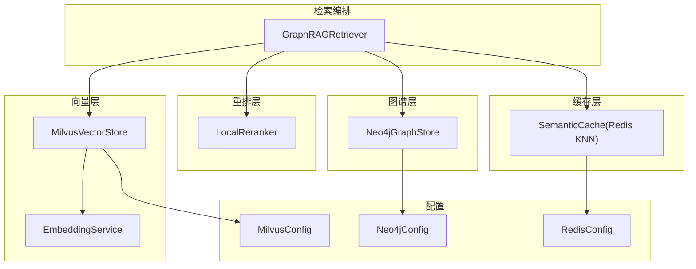
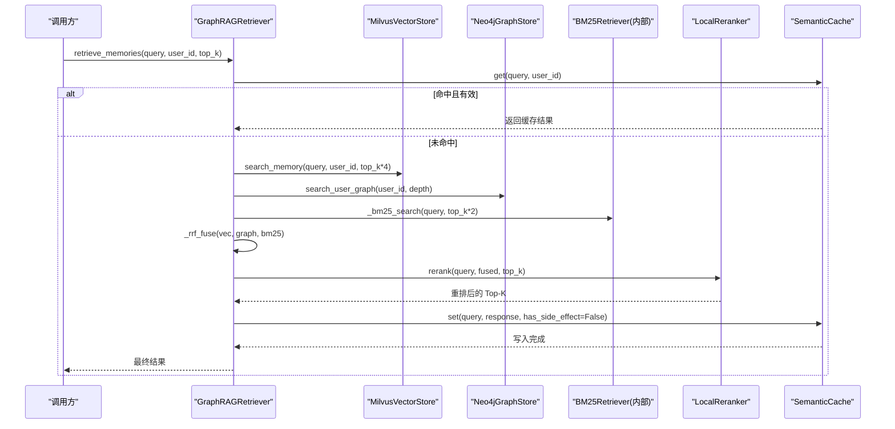
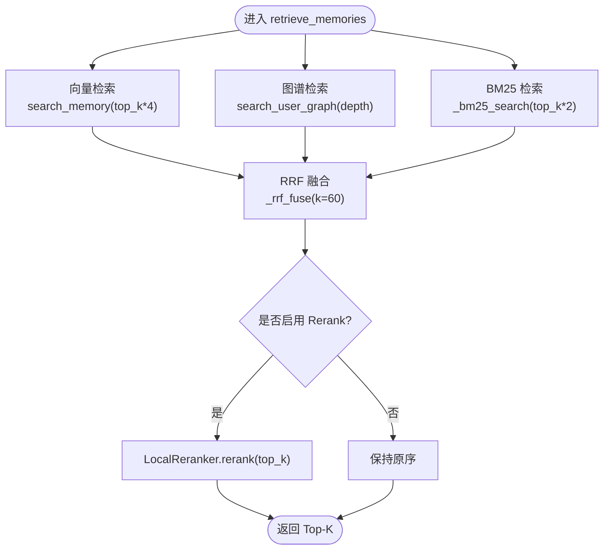
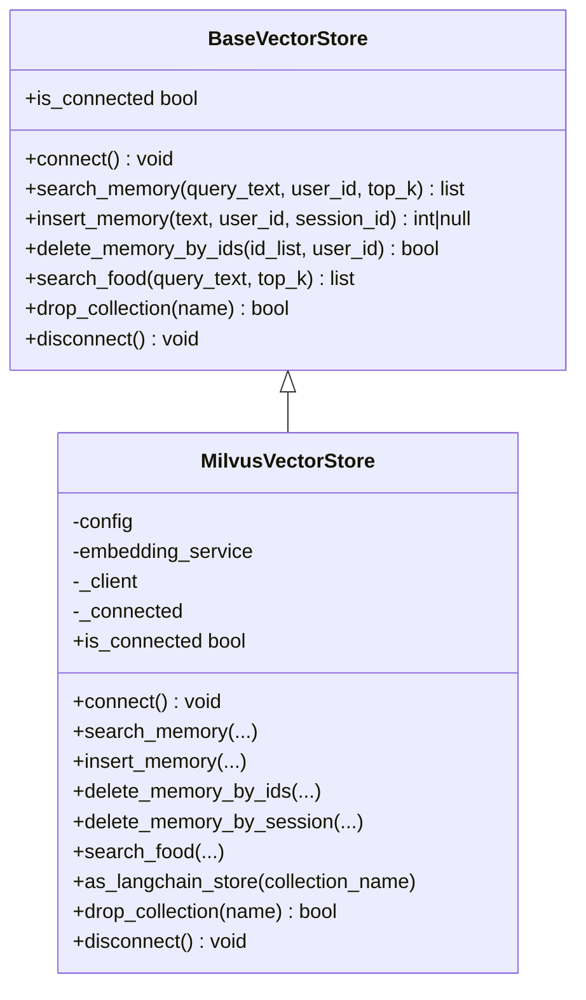
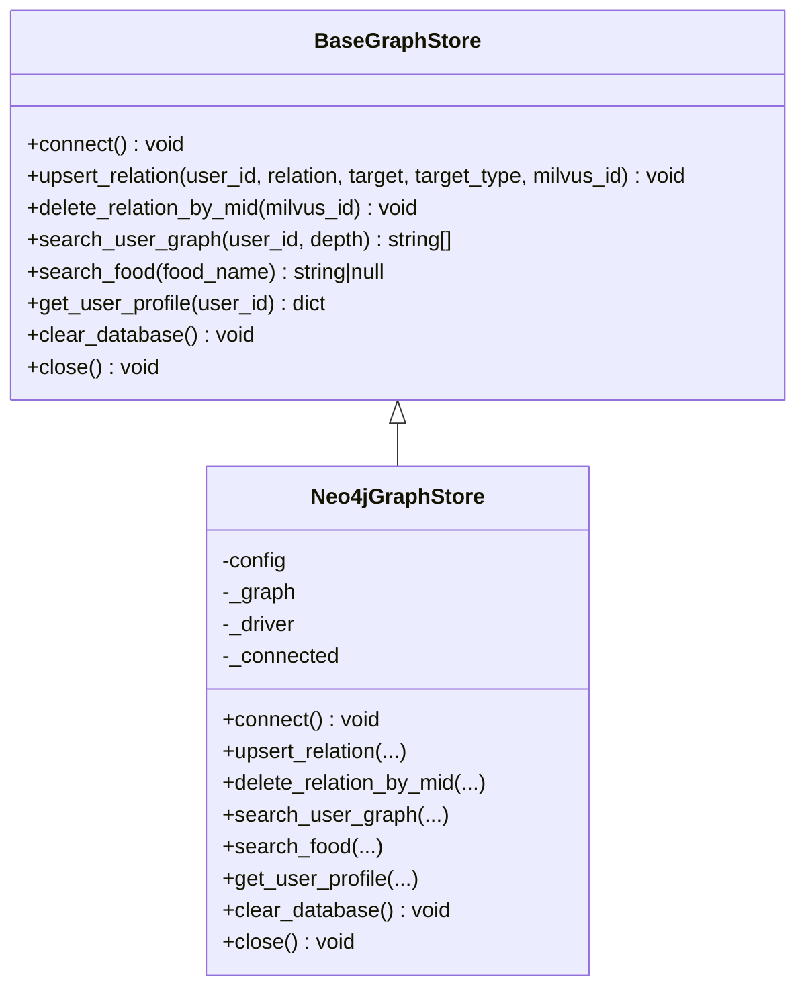
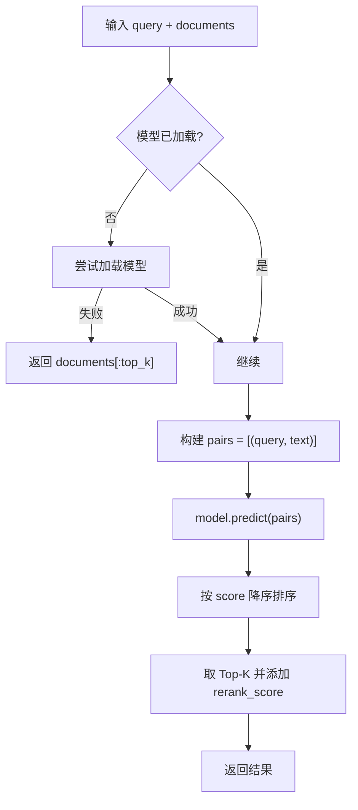
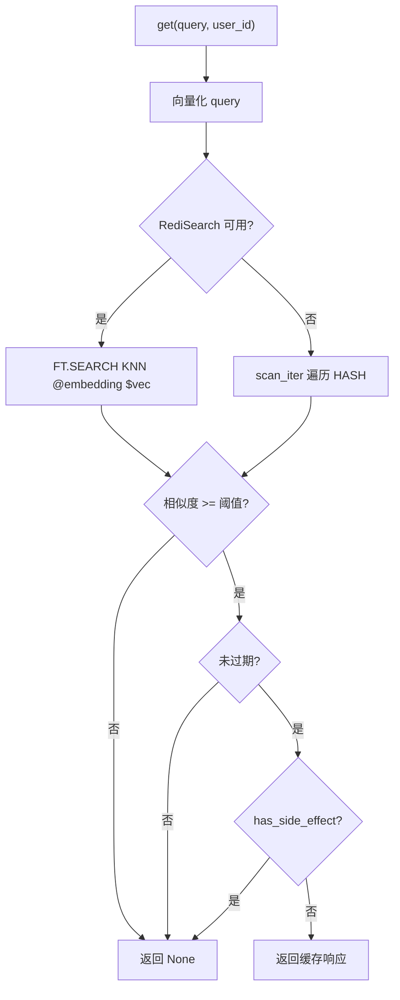
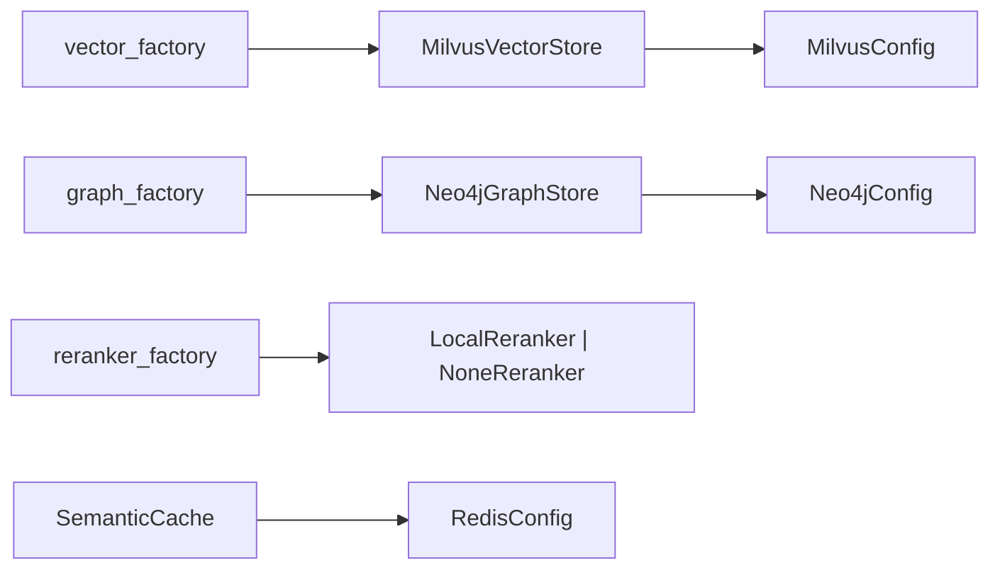

# 智能检索系统

<cite>
**本文引用的文件**   
- [retriever.py](file://backend_design/nexus/rag/retriever.py)
- [vector_store.py](file://backend_design/nexus/rag/vector_store.py)
- [graph_store.py](file://backend_design/nexus/rag/graph_store.py)
- [reranker.py](file://backend_design/nexus/rag/reranker.py)
- [embedding.py](file://backend_design/nexus/rag/embedding.py)
- [redis_cache.py](file://backend_design/nexus/middleware/redis_cache.py)
- [vector_factory.py](file://backend_design/nexus/rag/vector_factory.py)
- [graph_factory.py](file://backend_design/nexus/rag/graph_factory.py)
- [reranker_factory.py](file://backend_design/nexus/rag/reranker_factory.py)
- [cache.py](file://backend_design/nexus/config/cache.py)
- [database.py](file://backend_design/nexus/config/database.py)
</cite>

## 目录
1. [简介](#简介)
2. [项目结构](#项目结构)
3. [核心组件](#核心组件)
4. [架构总览](#架构总览)
5. [详细组件分析](#详细组件分析)
6. [依赖关系分析](#依赖关系分析)
7. [性能考量](#性能考量)
8. [故障排查指南](#故障排查指南)
9. [结论](#结论)
10. [附录](#附录)

## 简介
本技术文档面向 NexusCockpit GraphRAG 智能检索系统，系统性阐述“三路融合检索”（Milvus 向量搜索、Neo4j 图谱查询、BM25 全文检索）的协同工作机制与实现细节；深入解析 RRF（Reciprocal Rank Fusion）融合算法的实现与参数调优；详述 Rerank 重排模型（bge-reranker-v2-m3）的集成与效果优化；解释语义缓存机制与 Redis KNN 向量缓存的实现；并给出索引构建、增量更新、查询优化的最佳实践与扩展新存储后端的代码示例。文档同时覆盖向量维度选择、相似度算法和大规模数据处理策略，帮助读者在工程实践中高效落地与持续优化。

## 项目结构
本项目将检索相关能力集中在 backend_design/nexus/rag 模块中，并通过工厂类统一装配后端实现：
- 检索编排：GraphRAGRetriever 负责三路召回、RRF 融合与可选 Rerank
- 向量存储：MilvusVectorStore 管理 Milvus 集合与检索接口
- 图谱存储：Neo4jGraphStore 封装 Neo4j 图数据库操作
- 重排服务：LocalReranker 基于 bge-reranker-v2-m3 进行二次排序
- 嵌入服务：EmbeddingService 统一文本向量化
- 语义缓存：SemanticCache 基于 Redis 8 RediSearch KNN 向量索引
- 工厂装配：vector_factory / graph_factory / reranker_factory 固定本地后端

图表来源
- [retriever.py:48-189](file://backend_design/nexus/rag/retriever.py#L48-L189)
- [vector_store.py:36-417](file://backend_design/nexus/rag/vector_store.py#L36-L417)
- [graph_store.py:26-184](file://backend_design/nexus/rag/graph_store.py#L26-L184)
- [reranker.py:34-148](file://backend_design/nexus/rag/reranker.py#L34-L148)
- [embedding.py:23-63](file://backend_design/nexus/rag/embedding.py#L23-L63)
- [redis_cache.py:57-615](file://backend_design/nexus/middleware/redis_cache.py#L57-L615)
- [database.py:15-40](file://backend_design/nexus/config/database.py#L15-L40)
- [cache.py:15-41](file://backend_design/nexus/config/cache.py#L15-L41)

章节来源
- [retriever.py:48-189](file://backend_design/nexus/rag/retriever.py#L48-L189)
- [vector_store.py:36-417](file://backend_design/nexus/rag/vector_store.py#L36-L417)
- [graph_store.py:26-184](file://backend_design/nexus/rag/graph_store.py#L26-L184)
- [reranker.py:34-148](file://backend_design/nexus/rag/reranker.py#L34-L148)
- [embedding.py:23-63](file://backend_design/nexus/rag/embedding.py#L23-L63)
- [redis_cache.py:57-615](file://backend_design/nexus/middleware/redis_cache.py#L57-L615)
- [database.py:15-40](file://backend_design/nexus/config/database.py#L15-L40)
- [cache.py:15-41](file://backend_design/nexus/config/cache.py#L15-L41)

## 核心组件
- GraphRAGRetriever：三路召回（向量+图谱+BM25）、RRF 融合、可选 Rerank 重排
- MilvusVectorStore：Milvus 集合初始化、维度校验、用户记忆与食材库检索、会话级清理
- Neo4jGraphStore：用户图谱 N 阶关系查询、食材精确匹配、画像获取
- LocalReranker：bge-reranker-v2-m3 CrossEncoder 延迟加载与批量推理
- EmbeddingService：统一异步向量化接口（支持批量）
- SemanticCache：Redis 8 RediSearch VECTOR 索引 KNN 检索，TTL 分级与副作用隔离

章节来源
- [retriever.py:48-189](file://backend_design/nexus/rag/retriever.py#L48-L189)
- [vector_store.py:36-417](file://backend_design/nexus/rag/vector_store.py#L36-L417)
- [graph_store.py:26-184](file://backend_design/nexus/rag/graph_store.py#L26-L184)
- [reranker.py:34-148](file://backend_design/nexus/rag/reranker.py#L34-L148)
- [embedding.py:23-63](file://backend_design/nexus/rag/embedding.py#L23-L63)
- [redis_cache.py:57-615](file://backend_design/nexus/middleware/redis_cache.py#L57-L615)

## 架构总览
下图展示从请求到检索、融合、重排与缓存的全链路交互。

图表来源
- [retriever.py:128-141](file://backend_design/nexus/rag/retriever.py#L128-L141)
- [vector_store.py:201-231](file://backend_design/nexus/rag/vector_store.py#L201-L231)
- [graph_store.py:102-132](file://backend_design/nexus/rag/graph_store.py#L102-L132)
- [reranker.py:79-139](file://backend_design/nexus/rag/reranker.py#L79-L139)
- [redis_cache.py:213-297](file://backend_design/nexus/middleware/redis_cache.py#L213-L297)

## 详细组件分析

### 三路融合检索器（GraphRAGRetriever）
- 三路召回
  - 向量路：MilvusVectorStore.search_memory 按 user_id 过滤语义检索
  - 图谱路：Neo4jGraphStore.search_user_graph 返回用户 N 阶关系文本
  - BM25 路：langchain_community.BM25Retriever 使用自定义中文分词
- RRF 融合
  - 对三路结果的文本去重，按 rank 计算 1/(k+rank+1) 累加得分
  - 默认 k=60，可按需调整以平衡召回规模与排序稳定性
- Rerank 重排
  - 可选启用，调用 LocalReranker.rerank 对 Top-N 进行二次排序，提升精度
- 资源与连接
  - connect() 建立向量与图谱连接；close() 释放资源
  - BM25 延迟初始化，按需构建索引

图表来源
- [retriever.py:128-141](file://backend_design/nexus/rag/retriever.py#L128-L141)
- [retriever.py:150-182](file://backend_design/nexus/rag/retriever.py#L150-L182)
- [retriever.py:89-126](file://backend_design/nexus/rag/retriever.py#L89-L126)

章节来源
- [retriever.py:48-189](file://backend_design/nexus/rag/retriever.py#L48-L189)

### 向量存储（MilvusVectorStore）
- 集合初始化与维度校验
  - Food_List：item_name/category/cate_* 字段，HNSW 索引，IP 度量
  - User_Memory：user_id/session_id/vector/text/timestamp，Trie 索引 on user_id/session_id
  - 启动时检查 embedding_dim 一致性，不匹配则重建集合
- 检索与写入
  - search_memory：按 user_id 过滤，返回 text/score/timestamp
  - insert_memory：插入单条记忆，返回主键 ID
  - delete_memory_by_ids / delete_memory_by_session：安全删除（双重校验 user_id）
- 语言链适配
  - as_langchain_store：返回 langchain_milvus.Milvus 实例用于通用检索

图表来源
- [vector_base.py:22-76](file://backend_design/nexus/rag/vector_base.py#L22-L76)
- [vector_store.py:36-417](file://backend_design/nexus/rag/vector_store.py#L36-L417)

章节来源
- [vector_store.py:36-417](file://backend_design/nexus/rag/vector_store.py#L36-L417)

### 知识图谱存储（Neo4jGraphStore）
- 连接与约束
  - 使用 langchain_neo4j.Neo4jGraph 自动管理连接池与 schema
  - 创建唯一约束与索引（User.id 唯一，Entity.name 索引）
- 关系与查询
  - upsert_relation：MERGE 用户与目标实体，绑定 Milvus ID
  - delete_relation_by_mid：按 mid 联动删除关系
  - search_user_graph：1 阶或 N 阶路径展开
  - search_food：精确匹配 Food 节点
  - get_user_profile：返回用户画像（含 relation/target/type/mid）

图表来源
- [graph_base.py:17-61](file://backend_design/nexus/rag/graph_base.py#L17-L61)
- [graph_store.py:26-184](file://backend_design/nexus/rag/graph_store.py#L26-L184)

章节来源
- [graph_store.py:26-184](file://backend_design/nexus/rag/graph_store.py#L26-L184)

### 重排服务（LocalReranker）
- 模型加载
  - 延迟加载 bge-reranker-v2-m3（CrossEncoder），首次约 2s，后续 CPU 约 200ms/20 条
  - 不可用时降级为原序前 top_k
- 推理流程
  - 构建 (query, doc) 对，批量 predict，按分数降序取 Top-K
  - 输出新增 rerank_score 字段，便于下游评估与调试

图表来源
- [reranker.py:34-148](file://backend_design/nexus/rag/reranker.py#L34-L148)

章节来源
- [reranker.py:34-148](file://backend_design/nexus/rag/reranker.py#L34-L148)

### 嵌入服务（EmbeddingService）
- 统一接口：embed / embed_async / embed_batch / close
- 内部委托给 langchain_openai.OpenAIEmbeddings，具备连接池、重试、异步与批量能力
- 空文本或关闭状态返回零向量（维度由配置决定）

章节来源
- [embedding.py:23-63](file://backend_design/nexus/rag/embedding.py#L23-L63)

### 语义缓存（SemanticCache）
- 索引与检索
  - Redis 8 RediSearch VECTOR 索引（FLAT/HNSW + COSINE），O(log n) KNN 检索
  - 不支持 FT.* 命令时回退 O(n) scan 模式
- 安全设计
  - has_side_effect=True 的响应永不写入缓存，避免车控指令被缓存后不执行
- TTL 与阈值
  - cache_ttl 控制过期时间；cache_similarity_threshold 控制相似度阈值（默认 0.92）
- 统计与清理
  - hit_count/miss_count/stats；按 user_id 或 session_id 清理；全量 clear

图表来源
- [redis_cache.py:213-297](file://backend_design/nexus/middleware/redis_cache.py#L213-L297)
- [redis_cache.py:303-365](file://backend_design/nexus/middleware/redis_cache.py#L303-L365)
- [redis_cache.py:367-436](file://backend_design/nexus/middleware/redis_cache.py#L367-L436)

章节来源
- [redis_cache.py:57-615](file://backend_design/nexus/middleware/redis_cache.py#L57-L615)

## 依赖关系分析
- 工厂装配
  - vector_factory.build_vector_store → MilvusVectorStore（固定本地）
  - graph_factory.build_graph_store → Neo4jGraphStore（固定本地）
  - reranker_factory.build_reranker → LocalReranker（或 NoneReranker）
- 配置依赖
  - MilvusConfig：URI、集合名、索引类型、度量、参数
  - Neo4jConfig：URI、用户名、密码
  - RedisConfig：URL、缓存开关、相似度阈值、TTL

图表来源
- [vector_factory.py:21-34](file://backend_design/nexus/rag/vector_factory.py#L21-L34)
- [graph_factory.py:20-28](file://backend_design/nexus/rag/graph_factory.py#L20-L28)
- [reranker_factory.py:45-59](file://backend_design/nexus/rag/reranker_factory.py#L45-L59)
- [database.py:15-40](file://backend_design/nexus/config/database.py#L15-L40)
- [cache.py:15-41](file://backend_design/nexus/config/cache.py#L15-L41)

章节来源
- [vector_factory.py:21-34](file://backend_design/nexus/rag/vector_factory.py#L21-L34)
- [graph_factory.py:20-28](file://backend_design/nexus/rag/graph_factory.py#L20-L28)
- [reranker_factory.py:45-59](file://backend_design/nexus/rag/reranker_factory.py#L45-L59)
- [database.py:15-40](file://backend_design/nexus/config/database.py#L15-L40)
- [cache.py:15-41](file://backend_design/nexus/config/cache.py#L15-L41)

## 性能考量
- 向量维度与相似度算法
  - 维度：由 llm.embedding_dim 决定，Milvus 集合初始化时严格校验，不匹配自动重建
  - 相似度：Milvus 使用 IP（内积），Redis 使用 COSINE（距离→相似度=1-distance）
- 索引与检索参数
  - Milvus HNSW：M、efConstruction 影响构建质量与内存；ef 影响检索精度与延迟
  - Redis VECTOR：FLAT/HNSW 选择取决于数据规模与延迟要求
- 召回规模与融合参数
  - 向量路 top_k*4、BM25 路 top_k*2，RRF k=60 可调节以平衡召回与排序稳定性
- 重排开销
  - LocalReranker 批量推理，CPU 约 200ms/20 条；必要时可禁用 reranker 以提速
- 缓存命中率
  - 合理设置 cache_similarity_threshold 与 cache_ttl，结合业务场景动态调整
- 大规模数据处理
  - 批量嵌入（embed_batch）、批量写入 Milvus、分批扫描 Redis（count=100）
  - 会话级清理（session_id）降低内存占用

[本节为通用指导，无需引用具体文件]

## 故障排查指南
- 连接问题
  - Milvus 连接失败：检查 URI、网络连通性与集合是否存在
  - Neo4j 连接失败：核对 URI、用户名、密码与权限
  - Redis 连接失败：确认端口、密码与版本（8+ 或 redis-stack-server）
- 维度不一致
  - 若 embedding_dim 变化，Milvus 集合会被重建；确保历史数据迁移或重新入库
- BM25 不可用
  - 未安装 langchain-community 或初始化异常将导致 BM25 禁用，日志会提示
- Rerank 模型加载失败
  - 模型路径不存在或依赖缺失将触发降级（直接返回原序前 top_k）
- 缓存未命中或误命中
  - 检查相似度阈值、TTL 与 has_side_effect 标记；查看 stats 与 index_ready 状态

章节来源
- [vector_store.py:45-57](file://backend_design/nexus/rag/vector_store.py#L45-L57)
- [graph_store.py:40-58](file://backend_design/nexus/rag/graph_store.py#L40-L58)
- [redis_cache.py:90-127](file://backend_design/nexus/middleware/redis_cache.py#L90-L127)
- [retriever.py:89-108](file://backend_design/nexus/rag/retriever.py#L89-L108)
- [reranker.py:52-77](file://backend_design/nexus/rag/reranker.py#L52-L77)

## 结论
NexusCockpit GraphRAG 通过“向量+图谱+BM25”三路召回与 RRF 融合，结合 bge-reranker-v2-m3 重排与 Redis KNN 语义缓存，形成高召回、高精度、低延迟的智能检索体系。其模块化设计与工厂装配使得扩展新存储后端与替换重排模型变得简单可控。在生产环境中，建议根据数据规模与延迟目标精细调参（维度、索引、阈值、TTL），并结合会话级清理与副作用隔离保障系统稳定与安全。

[本节为总结性内容，无需引用具体文件]

## 附录

### RRF 融合算法与参数调优
- 公式：score(text) = Σ 1/(k + rank + 1)，k 为平滑常数（默认 60）
- 调优建议
  - 增大 k 可降低极端排名波动的影响，适合召回规模较大的场景
  - 减小 k 更强调头部排名，适合高质量召回但数量有限的情况
  - 三路权重可通过扩大某路 top_k 间接增强其贡献

章节来源
- [retriever.py:150-182](file://backend_design/nexus/rag/retriever.py#L150-L182)

### 索引构建与增量更新最佳实践
- Milvus
  - 首次建集合同时创建 HNSW/Trie 索引；后续增量 insert_memory 追加新记忆
  - 定期 rebuild 索引（如 M/efConstruction 变更）以提升检索质量
- Neo4j
  - 使用 MERGE 幂等 upsert_relation；按 mid 联动删除关系保证一致性
- Redis
  - 优先使用 RediSearch KNN；无 FT.* 命令时回退 scan 模式
  - 按 user_id/session_id 清理，避免内存膨胀

章节来源
- [vector_store.py:106-199](file://backend_design/nexus/rag/vector_store.py#L106-L199)
- [graph_store.py:73-101](file://backend_design/nexus/rag/graph_store.py#L73-L101)
- [redis_cache.py:164-211](file://backend_design/nexus/middleware/redis_cache.py#L164-L211)

### 查询优化与扩展新存储后端示例
- 扩展新的向量后端
  - 实现 BaseVectorStore 抽象类，提供 connect/search_memory/insert_memory/delete_memory_by_ids/search_food/drop_collection/disconnect/is_connected
  - 在 vector_factory.build_vector_store 中返回新实现
- 扩展新的图谱后端
  - 实现 BaseGraphStore 抽象类，提供 connect/upsert_relation/delete_relation_by_mid/search_user_graph/search_food/get_user_profile/clear_database/close
  - 在 graph_factory.build_graph_store 中返回新实现
- 扩展新的重排后端
  - 实现 BaseReranker 抽象类，提供 rerank/is_available
  - 在 reranker_factory.build_reranker 中根据配置返回新实现

章节来源
- [vector_base.py:22-76](file://backend_design/nexus/rag/vector_base.py#L22-L76)
- [graph_base.py:17-61](file://backend_design/nexus/rag/graph_base.py#L17-L61)
- [reranker_base.py:17-50](file://backend_design/nexus/rag/reranker_base.py#L17-L50)
- [vector_factory.py:21-34](file://backend_design/nexus/rag/vector_factory.py#L21-L34)
- [graph_factory.py:20-28](file://backend_design/nexus/rag/graph_factory.py#L20-L28)
- [reranker_factory.py:45-59](file://backend_design/nexus/rag/reranker_factory.py#L45-L59)