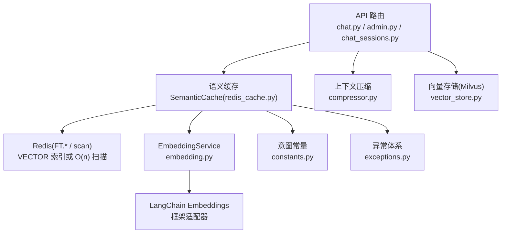
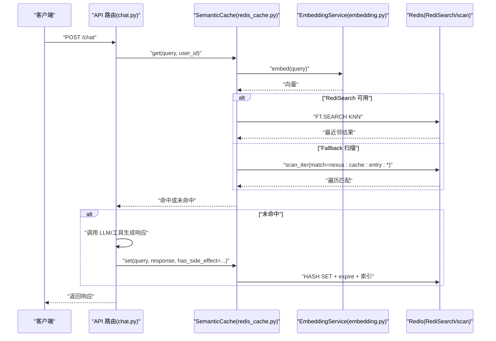
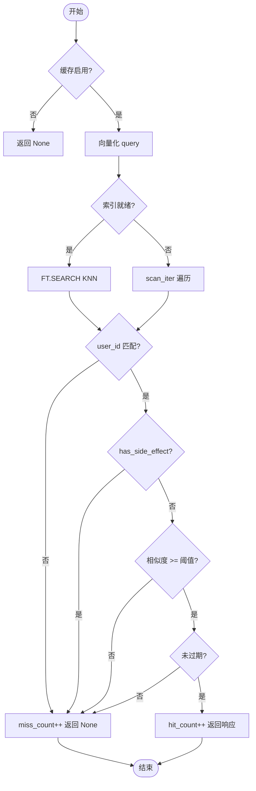
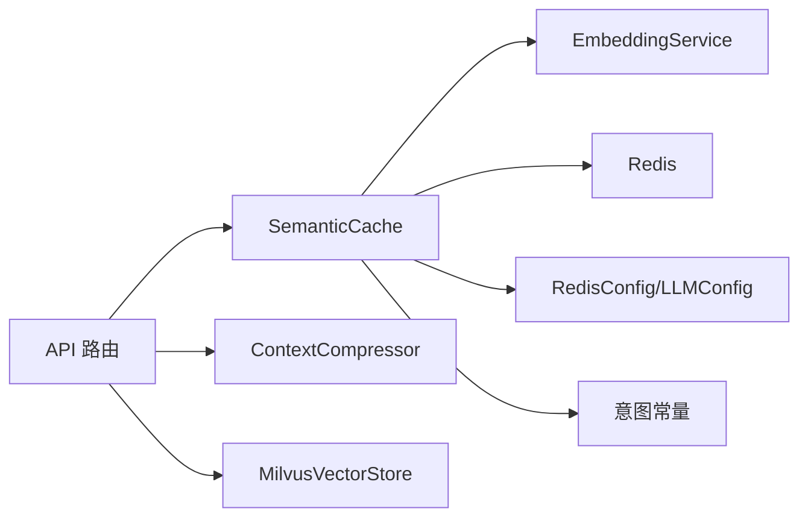

# 语义缓存

<cite>
**本文引用的文件**   
- [redis_cache.py](file://backend_design/nexus/middleware/redis_cache.py)
- [cache.py](file://backend_design/nexus/config/cache.py)
- [embedding.py](file://backend_design/nexus/rag/embedding.py)
- [_common.py](file://backend_design/nexus/config/_common.py)
- [__init__.py](file://backend_design/nexus/config/__init__.py)
- [vector_store.py](file://backend_design/nexus/rag/vector_store.py)
- [compressor.py](file://backend_design/nexus/memory/compressor.py)
- [constants.py](file://backend_design/nexus/intent/constants.py)
- [exceptions.py](file://backend_design/nexus/core/exceptions.py)
- [chat.py](file://backend_design/nexus/api/routes/chat.py)
- [admin.py](file://backend_design/nexus/api/routes/admin.py)
- [chat_sessions.py](file://backend_design/nexus/api/routes/chat_sessions.py)
- [health.py](file://backend_design/nexus/api/routes/health.py)
- [main.py](file://backend_design/nexus/main.py)
- [09-性能基准报告.md](file://docs/交付版文档包/09-性能基准报告.md)
</cite>

## 目录
1. [引言](#引言)
2. [项目结构](#项目结构)
3. [核心组件](#核心组件)
4. [架构总览](#架构总览)
5. [详细组件分析](#详细组件分析)
6. [依赖关系分析](#依赖关系分析)
7. [性能考量](#性能考量)
8. [故障排查指南](#故障排查指南)
9. [结论](#结论)
10. [附录](#附录)

## 引言
本技术文档面向“基于 Redis KNN 的语义缓存系统”，系统性阐述其实现原理、配置与优化策略。重点覆盖：
- 缓存键生成策略与数据结构设计
- 相似度阈值设置与 TTL 分级管理
- 压缩算法在上下文中的应用与内存优化
- 缓存命中率优化、预热策略与分布式一致性保证
- 配置参数调优、监控指标与故障恢复示例
- 扩展新缓存后端与自定义相似度算法的方法
- 性能基准测试与容量规划最佳实践

## 项目结构
语义缓存相关代码主要位于以下模块：
- 中间件层：Redis 语义缓存实现（KNN + RediSearch）
- 配置中心：Redis 连接与语义缓存行为参数
- 嵌入服务：统一文本向量化接口
- 向量存储：Milvus 向量库（用于记忆与知识库，非语义缓存主路径）
- 上下文压缩：对话历史压缩与滚动摘要
- API 路由：会话清理、健康检查、聊天流程中的缓存使用
- 常量与异常：车控关键词、错误类型定义

图表来源 
- [redis_cache.py:1-120](file://backend_design/nexus/middleware/redis_cache.py#L1-L120)
- [embedding.py:1-63](file://backend_design/nexus/rag/embedding.py#L1-L63)
- [vector_store.py:1-120](file://backend_design/nexus/rag/vector_store.py#L1-L120)
- [compressor.py:1-120](file://backend_design/nexus/memory/compressor.py#L1-L120)
- [constants.py:1-53](file://backend_design/nexus/intent/constants.py#L1-L53)
- [exceptions.py:1-128](file://backend_design/nexus/core/exceptions.py#L1-L128)

章节来源
- [redis_cache.py:1-120](file://backend_design/nexus/middleware/redis_cache.py#L1-L120)
- [cache.py:1-41](file://backend_design/nexus/config/cache.py#L1-L41)
- [embedding.py:1-63](file://backend_design/nexus/rag/embedding.py#L1-L63)
- [vector_store.py:1-120](file://backend_design/nexus/rag/vector_store.py#L1-L120)
- [compressor.py:1-120](file://backend_design/nexus/memory/compressor.py#L1-L120)
- [constants.py:1-53](file://backend_design/nexus/intent/constants.py#L1-L53)
- [exceptions.py:1-128](file://backend_design/nexus/core/exceptions.py#L1-L128)

## 核心组件
- SemanticCache（Redis 语义缓存）
  - 功能：基于 RediSearch VECTOR 索引进行 KNN 检索；支持 fallback 到 scan 模式；TTL 分级；副作用隔离（车控指令不缓存）
  - 关键方法：connect/get/set/delete_by_user/delete_by_session/clear/purge_vehicle_command_cache/stats
- EmbeddingService（统一向量化）
  - 功能：封装 OpenAIEmbeddings，提供 embed/embed_batch/embed_async/close
- RedisConfig（Redis 与语义缓存配置）
  - 字段：host/port/password/db、cache_enabled、cache_similarity_threshold、cache_ttl、url
- MilvusVectorStore（向量存储）
  - 功能：Food_List 与 User_Memory 集合管理、搜索与插入、会话级删除
- ContextCompressor（上下文压缩器）
  - 功能：trim_messages 裁剪、LLM 摘要、阈值压缩、滚动摘要持久化

章节来源
- [redis_cache.py:57-120](file://backend_design/nexus/middleware/redis_cache.py#L57-L120)
- [embedding.py:23-63](file://backend_design/nexus/rag/embedding.py#L23-L63)
- [cache.py:15-41](file://backend_design/nexus/config/cache.py#L15-L41)
- [vector_store.py:36-120](file://backend_design/nexus/rag/vector_store.py#L36-L120)
- [compressor.py:36-120](file://backend_design/nexus/memory/compressor.py#L36-L120)

## 架构总览
语义缓存整体流程：
- 请求进入 API 路由后，先尝试从语义缓存命中响应
- 若未命中，则走 LLM/工具链路生成响应，并写入缓存（排除有副作用的响应）
- 写入时生成唯一 key，存储 query/response/user_id/session_id/timestamp/has_side_effect/embedding
- 查询时通过 EmbeddingService 将 query 转为向量，执行 KNN 检索，校验相似度阈值与 TTL
- 若 Redis 不支持 FT.*，自动降级为 O(n) scan 模式

图表来源 
- [chat.py:114-160](file://backend_design/nexus/api/routes/chat.py#L114-L160)
- [redis_cache.py:213-302](file://backend_design/nexus/middleware/redis_cache.py#L213-L302)
- [embedding.py:36-48](file://backend_design/nexus/rag/embedding.py#L36-L48)

章节来源
- [chat.py:114-160](file://backend_design/nexus/api/routes/chat.py#L114-L160)
- [redis_cache.py:213-302](file://backend_design/nexus/middleware/redis_cache.py#L213-L302)
- [embedding.py:36-48](file://backend_design/nexus/rag/embedding.py#L36-L48)

## 详细组件分析

### 语义缓存（Redis KNN）
- 索引与数据模型
  - 索引名：nexus:cache:index
  - Key 前缀：nexus:cache:entry:
  - 字段：query、user_id、session_id、timestamp、embedding、response、has_side_effect
  - 向量维度：动态从配置获取（llm.embedding_dim），确保与 EmbeddingService 输出一致
- 查询流程
  - 优先使用 RediSearch FT.SEARCH KNN 进行 O(log n) 检索
  - 过滤 user_id，计算相似度（COSINE 距离 → 相似度 = 1 - distance）
  - 检查相似度阈值与 TTL，命中则返回响应并标记 _cache_hit/_cache_similarity
- 写入流程
  - 生成唯一 key，存储 JSON 响应与 embedding（索引模式存 bytes，fallback 存 JSON）
  - 设置 TTL（默认 3600s，可按场景调整）
  - 安全策略：has_side_effect=True 的响应禁止写入（避免车控指令被缓存后不执行）
- 兼容性与降级
  - 检测 Redis 是否支持 FT.*（MODULE LIST + FT._LIST 探测）
  - 不支持时回退到 scan 模式（O(n) 遍历）
- 统计与清理
  - 提供 stats()、size()、delete_by_user()、delete_by_session()、clear()、purge_vehicle_command_cache()

图表来源 
- [redis_cache.py:213-302](file://backend_design/nexus/middleware/redis_cache.py#L213-L302)
- [redis_cache.py:303-365](file://backend_design/nexus/middleware/redis_cache.py#L303-L365)

章节来源
- [redis_cache.py:57-120](file://backend_design/nexus/middleware/redis_cache.py#L57-L120)
- [redis_cache.py:213-302](file://backend_design/nexus/middleware/redis_cache.py#L213-L302)
- [redis_cache.py:303-365](file://backend_design/nexus/middleware/redis_cache.py#L303-L365)
- [redis_cache.py:367-436](file://backend_design/nexus/middleware/redis_cache.py#L367-L436)
- [redis_cache.py:437-514](file://backend_design/nexus/middleware/redis_cache.py#L437-L514)
- [redis_cache.py:516-561](file://backend_design/nexus/middleware/redis_cache.py#L516-L561)

### 配置与连接（RedisConfig）
- 连接 URL：根据 host/port/password/db 自动生成
- 语义缓存开关：cache_enabled
- 相似度阈值：cache_similarity_threshold（默认 0.92）
- TTL：cache_ttl（默认 3600s）
- 环境加载：_common.py 负责 .env.local/.env 优先级与路径解析

章节来源
- [cache.py:15-41](file://backend_design/nexus/config/cache.py#L15-L41)
- [_common.py:39-53](file://backend_design/nexus/config/_common.py#L39-L53)
- [_common.py:56-75](file://backend_design/nexus/config/_common.py#L56-L75)
- [__init__.py:84-132](file://backend_design/nexus/config/__init__.py#L84-L132)

### 嵌入服务（EmbeddingService）
- 统一接口：embed()/embed_batch()/embed_async()/close()
- 内部委托 LangChain OpenAIEmbeddings，具备连接池、重试、异步能力
- 失败处理：抛出 LLMError，便于上层捕获与降级

章节来源
- [embedding.py:23-63](file://backend_design/nexus/rag/embedding.py#L23-L63)
- [exceptions.py:42-47](file://backend_design/nexus/core/exceptions.py#L42-L47)

### 上下文压缩（ContextCompressor）
- trim_messages 裁剪：替代手写 tiktoken 计数
- LLM 摘要：ChatOpenAI 或 AsyncOpenAI 降级
- 阈值压缩：对话超阈值时自动摘要，滚动摘要持久化
- 关键信息提取：正则匹配位置/偏好，零 LLM 调用

章节来源
- [compressor.py:36-120](file://backend_design/nexus/memory/compressor.py#L36-L120)
- [compressor.py:155-179](file://backend_design/nexus/memory/compressor.py#L155-L179)
- [compressor.py:252-281](file://backend_design/nexus/memory/compressor.py#L252-L281)
- [compressor.py:316-395](file://backend_design/nexus/memory/compressor.py#L316-L395)

### 向量存储（MilvusVectorStore）
- 集合：Food_List（食材知识库）、User_Memory（用户长期记忆）
- 操作：search_memory/insert_memory/delete_memory_by_ids/delete_memory_by_session/search_food
- 会话级清理：支持按 session_id 精确删除，保障多会话隔离

章节来源
- [vector_store.py:36-120](file://backend_design/nexus/rag/vector_store.py#L36-L120)
- [vector_store.py:201-231](file://backend_design/nexus/rag/vector_store.py#L201-L231)
- [vector_store.py:279-324](file://backend_design/nexus/rag/vector_store.py#L279-L324)

### 意图常量与异常
- 车控关键词：VEHICLE_CACHE_KEYWORDS，用于旧缓存条目清理与安全拦截
- 异常体系：NexusError 基类及子类（LLMError、CacheError 等）

章节来源
- [constants.py:33-41](file://backend_design/nexus/intent/constants.py#L33-L41)
- [exceptions.py:19-128](file://backend_design/nexus/core/exceptions.py#L19-L128)

## 依赖关系分析
- SemanticCache 依赖：
  - EmbeddingService（向量化）
  - Redis（FT.* 命令或 scan 模式）
  - 配置中心（RedisConfig、LLMConfig.embedding_dim）
  - 意图常量（VEHICLE_CACHE_KEYWORDS）
- API 路由依赖：
  - SemanticCache（缓存读写）
  - ContextCompressor（上下文压缩）
  - MilvusVectorStore（记忆召回，非缓存主路径）

图表来源 
- [redis_cache.py:1-120](file://backend_design/nexus/middleware/redis_cache.py#L1-L120)
- [embedding.py:1-63](file://backend_design/nexus/rag/embedding.py#L1-L63)
- [vector_store.py:1-120](file://backend_design/nexus/rag/vector_store.py#L1-L120)
- [compressor.py:1-120](file://backend_design/nexus/memory/compressor.py#L1-L120)
- [cache.py:1-41](file://backend_design/nexus/config/cache.py#L1-L41)
- [constants.py:1-53](file://backend_design/nexus/intent/constants.py#L1-L53)

章节来源
- [redis_cache.py:1-120](file://backend_design/nexus/middleware/redis_cache.py#L1-L120)
- [embedding.py:1-63](file://backend_design/nexus/rag/embedding.py#L1-L63)
- [vector_store.py:1-120](file://backend_design/nexus/rag/vector_store.py#L1-L120)
- [compressor.py:1-120](file://backend_design/nexus/memory/compressor.py#L1-L120)
- [cache.py:1-41](file://backend_design/nexus/config/cache.py#L1-L41)
- [constants.py:1-53](file://backend_design/nexus/intent/constants.py#L1-L53)

## 性能考量
- 缓存命中率：稳态下 30-50%（取决于对话重复度）
- 查询延迟：~5ms（RediSearch KNN）
- 写入延迟：~10ms（SET + 向量索引）
- 副作用隔离：100%（车控指令不缓存）
- 瓶颈缓解：
  - 增大 TTL（如 7200s）提升命中率
  - 关闭非必要反思减少 LLM 调用
  - 本地 LLM 推理优化（GPU/KV Cache）

章节来源
- [09-性能基准报告.md:64-72](file://docs/交付版文档包/09-性能基准报告.md#L64-L72)
- [09-性能基准报告.md:159-178](file://docs/交付版文档包/09-性能基准报告.md#L159-L178)

## 故障排查指南
- Redis 连接失败
  - 现象：connect() 中捕获异常，禁用缓存
  - 排查：检查 URL、网络、权限
- FT.* 命令不可用
  - 现象：降级为 scan 模式，日志警告
  - 解决：升级 Redis 8+ 或使用 redis-stack-server
- 车控指令仍被缓存
  - 现象：旧条目 has_side_effect=False
  - 解决：运行 purge_vehicle_command_cache() 清理
- 会话清理失败
  - 现象：delete_by_session() 抛异常
  - 排查：确认 session_id 与 user_id 匹配

章节来源
- [redis_cache.py:90-128](file://backend_design/nexus/middleware/redis_cache.py#L90-L128)
- [redis_cache.py:129-163](file://backend_design/nexus/middleware/redis_cache.py#L129-L163)
- [redis_cache.py:516-561](file://backend_design/nexus/middleware/redis_cache.py#L516-L561)
- [chat_sessions.py:284-295](file://backend_design/nexus/api/routes/chat_sessions.py#L284-L295)

## 结论
本语义缓存系统以 Redis RediSearch KNN 为核心，结合 EmbeddingService 与上下文压缩，实现了高效、安全的向量相似度缓存。通过严格的副作用隔离、灵活的阈值与 TTL 管理、以及完善的降级与清理机制，系统在性能与可靠性之间取得良好平衡。建议在生产环境中结合监控指标与压测数据持续调优，并根据业务需求扩展新的缓存后端与相似度算法。

## 附录

### 缓存键生成策略
- Key 格式：nexus:cache:entry:{uuid}
- 字段映射：query/response/user_id/session_id/timestamp/has_side_effect/embedding
- 向量存储：索引模式存 float32 bytes，fallback 存 JSON

章节来源
- [redis_cache.py:398-436](file://backend_design/nexus/middleware/redis_cache.py#L398-L436)

### 相似度阈值与 TTL 管理
- 阈值：默认 0.92，可通过 cache_similarity_threshold 调整
- TTL：默认 3600s，可按场景（闲聊/知识库）分级设置

章节来源
- [cache.py:27-31](file://backend_design/nexus/config/cache.py#L27-L31)
- [redis_cache.py:275-284](file://backend_design/nexus/middleware/redis_cache.py#L275-L284)

### 压缩算法与内存优化
- trim_messages 裁剪：控制消息长度与 token 预算
- LLM 摘要：滚动摘要合并，避免无限膨胀
- 低质量记忆过滤：score < 0.3 的记忆丢弃

章节来源
- [compressor.py:316-395](file://backend_design/nexus/memory/compressor.py#L316-L395)

### 缓存命中率优化与预热策略
- 命中率优化：增大 TTL、降低阈值、热点查询缓存
- 预热策略：启动时批量嵌入高频 query 并写入缓存

章节来源
- [09-性能基准报告.md:159-178](file://docs/交付版文档包/09-性能基准报告.md#L159-L178)

### 分布式一致性保证
- 用户分片：user_id 过滤确保隔离
- 会话级清理：session_id 精确删除，避免跨会话污染
- 副作用隔离：has_side_effect 标记防止车控指令缓存

章节来源
- [redis_cache.py:248-267](file://backend_design/nexus/middleware/redis_cache.py#L248-L267)
- [chat_sessions.py:284-295](file://backend_design/nexus/api/routes/chat_sessions.py#L284-L295)

### 配置参数调优
- SEMANTIC_CACHE_ENABLED：开关
- SEMANTIC_CACHE_SIMILARITY_THRESHOLD：相似度阈值
- SEMANTIC_CACHE_TTL_SECONDS：TTL 秒数

章节来源
- [cache.py:27-31](file://backend_design/nexus/config/cache.py#L27-L31)

### 监控指标与故障恢复
- 指标：hits/misses/hit_rate/size/index_ready
- 健康检查：/health 中检查 semantic_cache 状态
- 故障恢复：自动降级 scan 模式，异常日志记录

章节来源
- [redis_cache.py:604-615](file://backend_design/nexus/middleware/redis_cache.py#L604-L615)
- [health.py:50-51](file://backend_design/nexus/api/routes/health.py#L50-L51)

### 扩展新缓存后端与自定义相似度算法
- 新后端：实现类似 SemanticCache 的 get/set/delete 接口，替换 Redis 客户端
- 自定义相似度：重写 _cosine_similarity 或替换 KNN 查询逻辑

章节来源
- [redis_cache.py:568-578](file://backend_design/nexus/middleware/redis_cache.py#L568-L578)

### 性能基准测试与容量规划
- 基准：P50/P95/P99、QPS、缓存命中率、延迟分解
- 容量规划：根据 QPS 与命中率估算 Redis 内存与索引大小

章节来源
- [09-性能基准报告.md:34-82](file://docs/交付版文档包/09-性能基准报告.md#L34-L82)