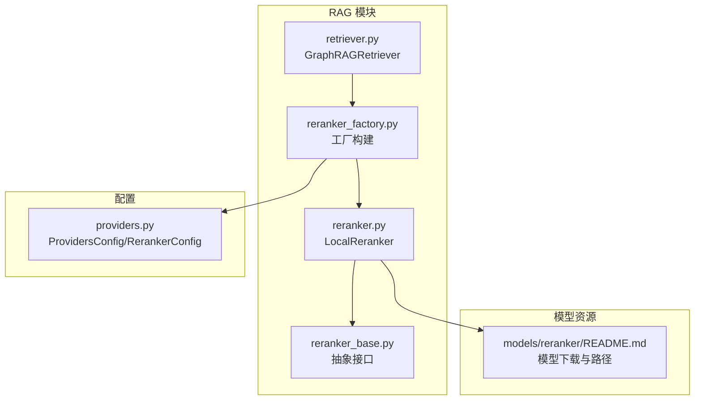
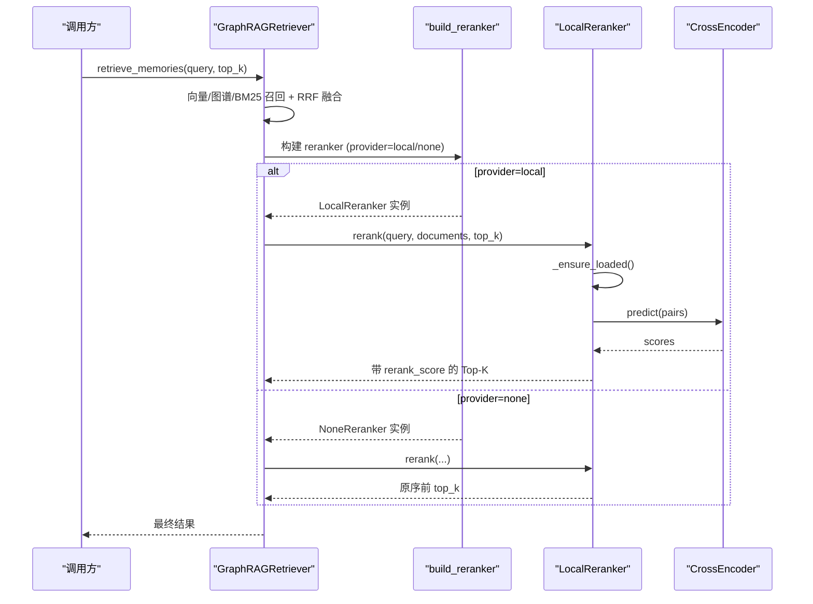
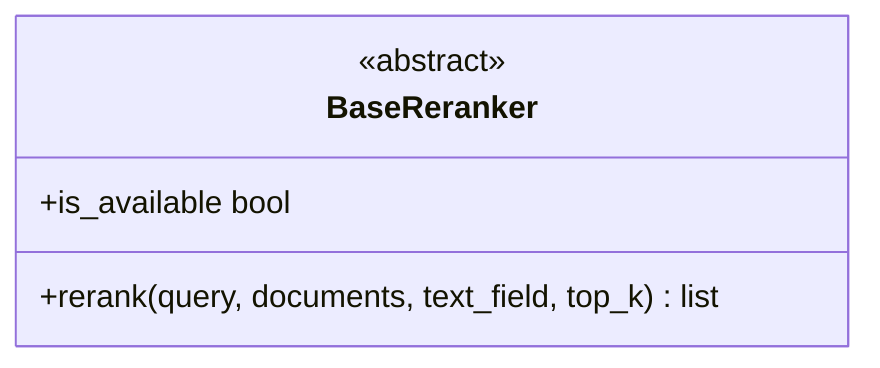
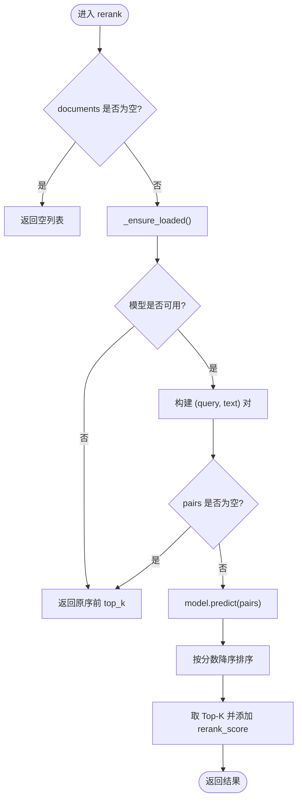
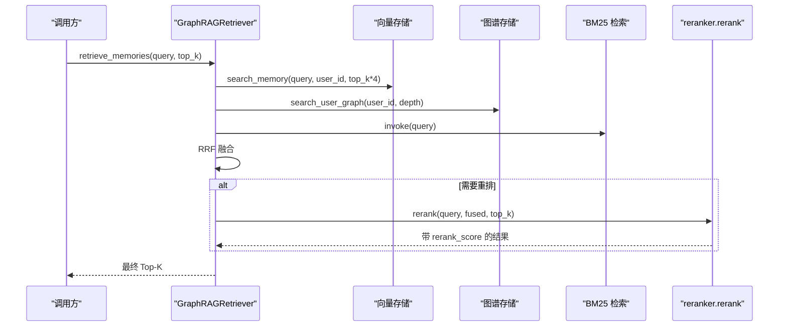
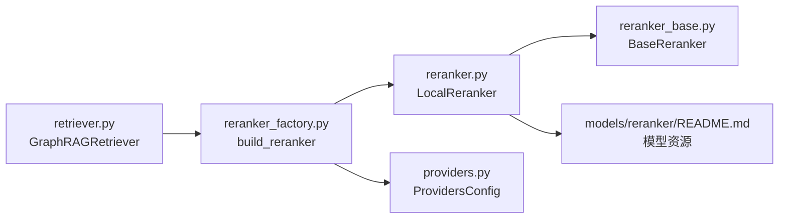

# 重排系统

<cite>
**本文引用的文件**   
- [reranker.py](file://backend_design/nexus/rag/reranker.py)
- [reranker_base.py](file://backend_design/nexus/rag/reranker_base.py)
- [reranker_factory.py](file://backend_design/nexus/rag/reranker_factory.py)
- [retriever.py](file://backend_design/nexus/rag/retriever.py)
- [providers.py](file://backend_design/nexus/config/providers.py)
- [README.md](file://models/reranker/README.md)
- [exceptions.py](file://backend_design/nexus/core/exceptions.py)
</cite>

## 目录
1. [简介](#简介)
2. [项目结构](#项目结构)
3. [核心组件](#核心组件)
4. [架构总览](#架构总览)
5. [详细组件分析](#详细组件分析)
6. [依赖关系分析](#依赖关系分析)
7. [性能与内存优化](#性能与内存优化)
8. [故障排查指南](#故障排查指南)
9. [结论](#结论)
10. [附录：配置与使用示例](#附录配置与使用示例)

## 简介
本技术文档聚焦于重排系统的实现与优化，围绕 BAAI/bge-reranker-v2-m3 模型的集成、BaseReranker 抽象接口设计、rerank 方法实现逻辑、重排算法（语义相关性评分与排序策略）、工厂模式配置与使用、模型加载优化、批处理推理与内存管理、效果评估与阈值调优、降级策略以及扩展新模型与自定义评分函数等主题进行系统化说明。

## 项目结构
重排系统位于 RAG 模块中，核心文件包括：
- reranker_base.py：定义 BaseReranker 抽象接口
- reranker.py：本地 LocalReranker 实现（基于 sentence-transformers CrossEncoder）
- reranker_factory.py：构建器工厂，支持 local 与 none 两种模式
- retriever.py：GraphRAGRetriever 在检索流程中调用 reranker
- providers.py：Provider 配置项（含 reranker provider）
- models/reranker/README.md：bge-reranker-v2-m3 模型下载与存放指引

**图表来源** 
- [reranker_base.py:1-50](file://backend_design/nexus/rag/reranker_base.py#L1-L50)
- [reranker.py:1-148](file://backend_design/nexus/rag/reranker.py#L1-L148)
- [reranker_factory.py:1-59](file://backend_design/nexus/rag/reranker_factory.py#L1-L59)
- [retriever.py:1-189](file://backend_design/nexus/rag/retriever.py#L1-L189)
- [providers.py:1-47](file://backend_design/nexus/config/providers.py#L1-L47)
- [README.md:1-38](file://models/reranker/README.md#L1-L38)

**章节来源**
- [reranker_base.py:1-50](file://backend_design/nexus/rag/reranker_base.py#L1-L50)
- [reranker.py:1-148](file://backend_design/nexus/rag/reranker.py#L1-L148)
- [reranker_factory.py:1-59](file://backend_design/nexus/rag/reranker_factory.py#L1-L59)
- [retriever.py:1-189](file://backend_design/nexus/rag/retriever.py#L1-L189)
- [providers.py:1-47](file://backend_design/nexus/config/providers.py#L1-L47)
- [README.md:1-38](file://models/reranker/README.md#L1-L38)

## 核心组件
- BaseReranker：统一的重排服务抽象接口，要求子类实现 rerank() 与 is_available 属性。输出约定为每项新增 rerank_score 字段，便于上层统一处理。
- LocalReranker：基于 sentence-transformers CrossEncoder 的本地重排实现，支持延迟加载、批量推理、Top-K 返回并附加 rerank_score。
- NoneReranker：空重排器，直接返回原始顺序的前 top_k 条，用于禁用重排场景。
- build_reranker：根据配置选择 local 或 none 模式，固定本地化降级改造后默认使用本地 BGE CrossEncoder。
- GraphRAGRetriever：在三路召回（向量+图谱+BM25）之后，可选地调用 reranker.rerank 进行二次排序。

**章节来源**
- [reranker_base.py:17-50](file://backend_design/nexus/rag/reranker_base.py#L17-L50)
- [reranker.py:34-148](file://backend_design/nexus/rag/reranker.py#L34-L148)
- [reranker_factory.py:25-59](file://backend_design/nexus/rag/reranker_factory.py#L25-L59)
- [retriever.py:48-189](file://backend_design/nexus/rag/retriever.py#L48-L189)

## 架构总览
下图展示从检索到重排的完整调用链：GraphRAGRetriever 发起三路召回与融合，随后通过工厂获取 reranker 实例执行 rerank；LocalReranker 内部延迟加载 CrossEncoder，批量预测并排序输出 Top-K。

**图表来源** 
- [retriever.py:128-140](file://backend_design/nexus/rag/retriever.py#L128-L140)
- [reranker_factory.py:45-59](file://backend_design/nexus/rag/reranker_factory.py#L45-L59)
- [reranker.py:79-139](file://backend_design/nexus/rag/reranker.py#L79-L139)

## 详细组件分析

### BaseReranker 抽象接口
- 职责：定义统一的 rerank 方法与可用性检查 is_available。
- 输入约定：query、documents（dict 列表）、text_field（文本字段名）、top_k。
- 输出约定：Top-K 列表，每项新增 rerank_score 字段。
- 扩展点：任何新的重排实现只需继承 BaseReranker 并实现上述两个成员。

**图表来源** 
- [reranker_base.py:17-50](file://backend_design/nexus/rag/reranker_base.py#L17-L50)

**章节来源**
- [reranker_base.py:17-50](file://backend_design/nexus/rag/reranker_base.py#L17-L50)

### LocalReranker 实现（BGE CrossEncoder）
- 模型加载：延迟加载，首次调用时检查路径并加载 CrossEncoder；失败记录错误信息并降级。
- 批处理推理：将 query 与文档文本组成 pairs，调用 model.predict 批量打分。
- 排序策略：按分数降序排序，取 Top-K 并添加 rerank_score。
- 可用性判断：is_available 不触发加载，仅检查模型路径与错误状态。

**图表来源** 
- [reranker.py:79-139](file://backend_design/nexus/rag/reranker.py#L79-L139)

**章节来源**
- [reranker.py:34-148](file://backend_design/nexus/rag/reranker.py#L34-L148)

### NoneReranker（禁用重排）
- 行为：直接返回 documents[:top_k]，不做任何计算。
- 适用场景：不想下载模型或节省资源的场景。

**章节来源**
- [reranker_factory.py:25-43](file://backend_design/nexus/rag/reranker_factory.py#L25-L43)

### 工厂模式（build_reranker）
- 配置来源：读取 ProvidersConfig.normalized()["reranker"]。
- 分支逻辑：
  - provider == "none"：返回 NoneReranker
  - 其他（默认 local）：返回 LocalReranker
- 日志：记录当前 provider 类型。

**章节来源**
- [reranker_factory.py:45-59](file://backend_design/nexus/rag/reranker_factory.py#L45-L59)
- [providers.py:15-38](file://backend_design/nexus/config/providers.py#L15-L38)

### 检索流程中的重排集成（GraphRAGRetriever）
- 三路召回：向量检索、图谱检索、BM25 全文检索。
- 融合排序：RRF（Reciprocal Rank Fusion）融合得分。
- 重排阶段：当 enable_rerank 为真且候选数大于 top_k 时，调用 reranker.rerank 进行二次排序。
- BM25 初始化：按需延迟初始化，失败则禁用 BM25。

**图表来源** 
- [retriever.py:128-140](file://backend_design/nexus/rag/retriever.py#L128-L140)
- [retriever.py:150-183](file://backend_design/nexus/rag/retriever.py#L150-L183)

**章节来源**
- [retriever.py:48-189](file://backend_design/nexus/rag/retriever.py#L48-L189)

## 依赖关系分析
- GraphRAGRetriever 依赖 reranker_factory 构建 reranker 实例，并在检索流程中调用 rerank。
- LocalReranker 依赖 sentence-transformers.CrossEncoder，需安装对应依赖。
- 配置层通过 ProvidersConfig 提供 reranker provider 的选择。
- 模型资源由 models/reranker/README.md 指导下载与存放路径。

**图表来源** 
- [retriever.py:128-140](file://backend_design/nexus/rag/retriever.py#L128-L140)
- [reranker_factory.py:45-59](file://backend_design/nexus/rag/reranker_factory.py#L45-L59)
- [reranker.py:34-148](file://backend_design/nexus/rag/reranker.py#L34-L148)
- [providers.py:15-38](file://backend_design/nexus/config/providers.py#L15-L38)
- [README.md:1-38](file://models/reranker/README.md#L1-L38)

**章节来源**
- [retriever.py:128-140](file://backend_design/nexus/rag/retriever.py#L128-L140)
- [reranker_factory.py:45-59](file://backend_design/nexus/rag/reranker_factory.py#L45-L59)
- [reranker.py:34-148](file://backend_design/nexus/rag/reranker.py#L34-L148)
- [providers.py:15-38](file://backend_design/nexus/config/providers.py#L15-L38)
- [README.md:1-38](file://models/reranker/README.md#L1-L38)

## 性能与内存优化
- 延迟加载：LocalReranker 仅在首次调用 rerank 时加载模型，避免启动开销。
- 批处理推理：使用 CrossEncoder.predict 批量打分，减少多次调用开销。
- 降级策略：模型不可用时直接返回原序前 top_k，保证可用性。
- 内存管理：
  - 控制 top_k 大小以减少排序与返回数据量。
  - 避免不必要的 EmbeddingService 实例化（retriever 中已有条件判断）。
  - 建议在生产环境启用 GPU 加速（若硬件允许），可显著降低延迟。
- 监控与日志：记录模型加载、重排完成与异常信息，便于定位问题。

[本节为通用性能建议，不直接分析具体文件]

## 故障排查指南
- 模型未找到：检查模型路径是否正确，确保 ./models/reranker/bge-reranker-v2-m3 存在。
- 依赖缺失：确认已安装 sentence-transformers。
- 重排失败：查看日志中的异常信息，必要时回退到原序结果。
- 配置错误：检查 .env 中 RERANKER_PROVIDER 的值是否为 local 或 none。
- 异常体系：项目中定义了 NexusError 及其子类（如 RAG_ERROR、VECTOR_STORE_ERROR 等），可用于统一捕获与前端提示。

**章节来源**
- [reranker.py:59-77](file://backend_design/nexus/rag/reranker.py#L59-L77)
- [providers.py:22-38](file://backend_design/nexus/config/providers.py#L22-L38)
- [exceptions.py:49-67](file://backend_design/nexus/core/exceptions.py#L49-L67)

## 结论
重排系统以 BaseReranker 抽象为核心，结合 LocalReranker 与 NoneReranker 实现了灵活的重排能力。通过工厂模式与 Provider 配置，可在本地模型与禁用重排之间切换。GraphRAGRetriever 在三路召回与 RRF 融合后引入 rerank，进一步提升结果质量。延迟加载、批处理推理与降级策略保障了系统的稳定性与性能。

[本节为总结性内容，不直接分析具体文件]

## 附录：配置与使用示例
- 配置 RERANKER_PROVIDER：
  - 设置为 "local"：启用本地 BGE CrossEncoder 重排（需下载模型）。
  - 设置为 "none"：禁用重排，直接返回原序前 top_k。
- 模型下载与存放：
  - 参考 models/reranker/README.md，将 bge-reranker-v2-m3 模型放置到 ./models/reranker/bge-reranker-v2-m3。
- 在检索中使用重排：
  - GraphRAGRetriever 构造时可传入 reranker 实例或依赖工厂自动构建。
  - 设置 enable_rerank=True 以启用重排阶段。
- 阈值调优与评估：
  - 调整 top_k 控制重排返回数量。
  - 观察 rerank_score 分布，结合业务指标（如命中率、平均排名）评估效果。
- 扩展新模型与自定义评分函数：
  - 继承 BaseReranker，实现 rerank 与 is_available。
  - 在 rerank 中实现自定义评分逻辑，并确保输出包含 rerank_score。
  - 如需新的 provider，可在 reranker_factory 中增加分支并读取配置。

**章节来源**
- [providers.py:22-38](file://backend_design/nexus/config/providers.py#L22-L38)
- [README.md:1-38](file://models/reranker/README.md#L1-L38)
- [retriever.py:59-80](file://backend_design/nexus/rag/retriever.py#L59-L80)
- [reranker_base.py:24-43](file://backend_design/nexus/rag/reranker_base.py#L24-L43)
- [reranker_factory.py:45-59](file://backend_design/nexus/rag/reranker_factory.py#L45-L59)