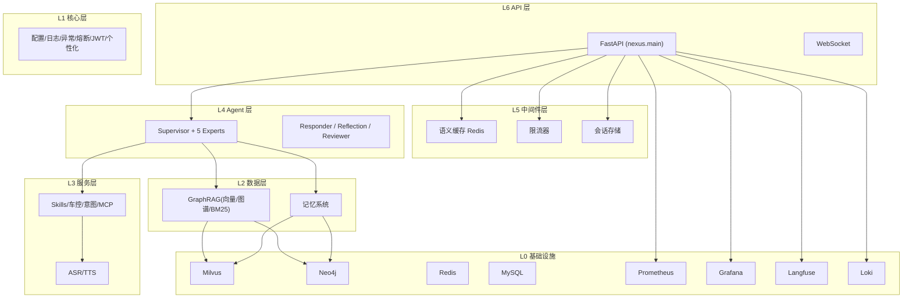
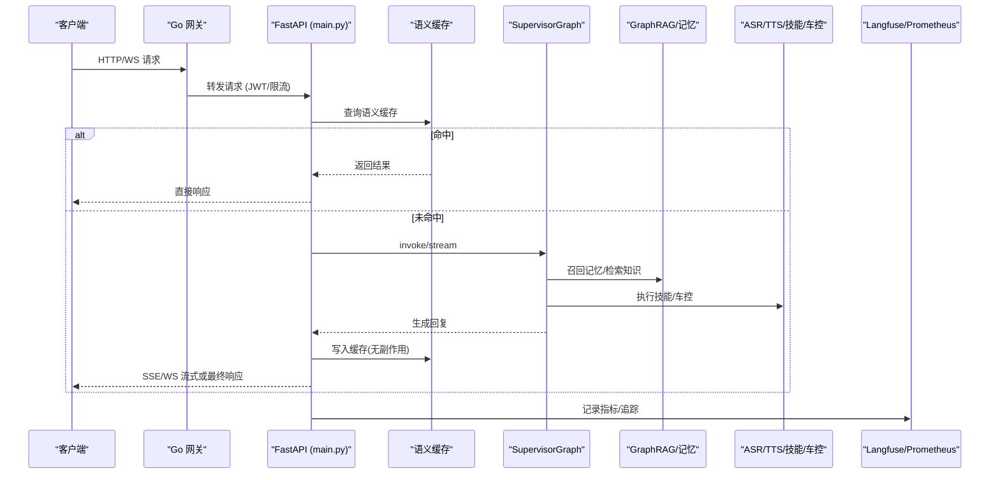
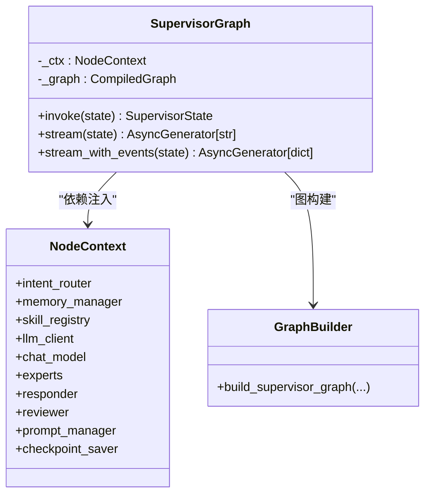
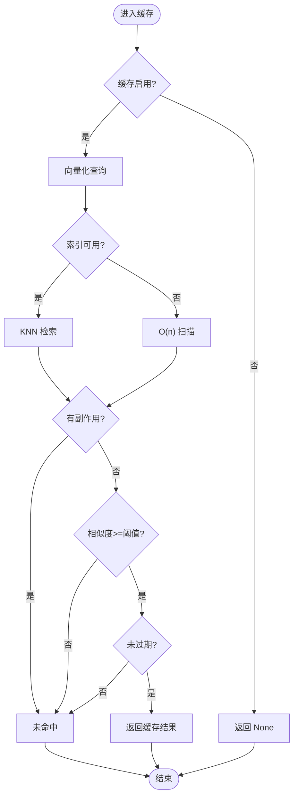
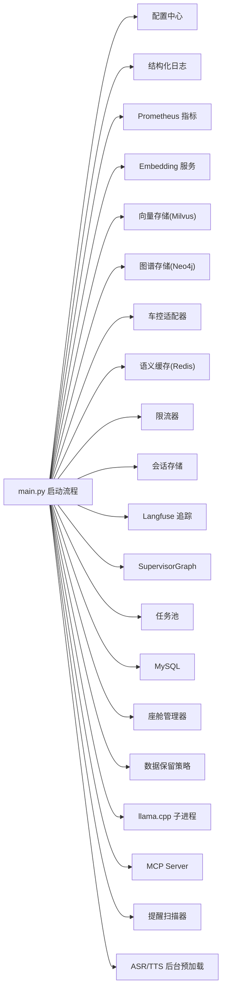

# 7层分层架构

<cite>
**本文引用的文件**   
- [docker-compose.yml](file://docker-compose.yml)
- [README.md](file://README.md)
- [backend_design/nexus/main.py](file://backend_design/nexus/main.py)
- [backend_design/nexus/agent/supervisor_graph.py](file://backend_design/nexus/agent/supervisor_graph.py)
- [backend_design/nexus/agent/graph_builder.py](file://backend_design/nexus/agent/graph_builder.py)
- [backend_design/nexus/middleware/redis_cache.py](file://backend_design/nexus/middleware/redis_cache.py)
- [backend_design/nexus/config/__init__.py](file://backend_design/nexus/config/__init__.py)
- [docs/内部开发存档文档/架构详细设计/L0-infrastructure.md](file://docs/内部开发存档文档/架构详细设计/L0-infrastructure.md)
- [docs/内部开发存档文档/架构详细设计/L1-core.md](file://docs/内部开发存档文档/架构详细设计/L1-core.md)
- [docs/内部开发存档文档/架构详细设计/L2-data.md](file://docs/内部开发存档文档/架构详细设计/L2-data.md)
- [docs/内部开发存档文档/架构详细设计/L3-service.md](file://docs/内部开发存档文档/架构详细设计/L3-service.md)
- [docs/内部开发存档文档/架构详细设计/L5-middleware.md](file://docs/内部开发存档文档/架构详细设计/L5-middleware.md)
- [docs/内部开发存档文档/架构详细设计/L6-api.md](file://docs/内部开发存档文档/架构详细设计/L6-api.md)
- [docs/内部开发存档文档/架构详细设计/L7-observability.md](file://docs/内部开发存档文档/架构详细设计/L7-observability.md)
</cite>

## 目录
1. [引言](#引言)
2. [项目结构](#项目结构)
3. [核心组件](#核心组件)
4. [架构总览](#架构总览)
5. [详细组件分析](#详细组件分析)
6. [依赖关系分析](#依赖关系分析)
7. [性能考量](#性能考量)
8. [故障排查指南](#故障排查指南)
9. [结论](#结论)
10. [附录](#附录)

## 引言
本文件为 NexusCockpit 的 7 层分层架构文档，围绕 L0-L7 各层的职责、技术栈、组件交互与数据流进行系统化说明。系统采用“Go 网关 + Python AI 服务”的双后端模式，结合 Multi-Agent（Supervisor + 5 Expert Agents）、GraphRAG（向量+图谱+BM25 三路融合）、Redis 语义缓存、SSE/WebSocket 实时通信以及 Langfuse/Prometheus/Grafana/Loki 可观测体系，提供企业级车载语音 Agent 能力。

## 项目结构
- 应用编排：通过 docker-compose.yml 统一编排 Go 网关、Python AI 服务、前端与中间件（Milvus/Neo4j/Redis/MySQL/Prometheus/Grafana/Langfuse/Loki）。
- 后端代码：Python 服务位于 backend_design/nexus，Go 网关位于 backend_design/nexus_gate；前端位于 frontend_design。
- 配置与模型：config 目录存放可观测性配置，models 目录存放 ASR/TTS/Embedding/Reranker 等本地模型。
- 文档与脚本：docs 包含 L0-L7 架构设计与部署测试文档；scripts 提供一键启动/停止脚本。

图表来源
- [docker-compose.yml](file://docker-compose.yml)
- [backend_design/nexus/main.py](file://backend_design/nexus/main.py)

章节来源
- [README.md](file://README.md)
- [docker-compose.yml](file://docker-compose.yml)

## 核心组件
- L0 基础设施：Docker Compose 编排 Milvus、Neo4j、Redis、MySQL、Prometheus、Grafana、Langfuse、Loki，提供健康检查与数据持久化卷。
- L1 核心层：Pydantic Settings 配置中心、结构化日志、统一异常体系、熔断器、JWT 认证、个性化服务（声纹+偏好匹配+Prompt 注入）。
- L2 数据层：GraphRAG 三路检索（向量 Milvus、图谱 Neo4j、BM25）+ RRF 融合 + Rerank；记忆管理器（短期/长期记忆、冲突检测、上下文压缩）。
- L3 服务层：ASR（SenseVoice）、TTS（CosyVoice）、技能系统（19 个技能，装饰器自动注册）、车控总线（Mock/HTTP/MCP 三适配）、意图路由（LLM/启发式/兜底）、MCP 网关。
- L4 Agent 层：SupervisorGraph 编排 Supervisor → Dispatch → Responder → Reflection → Reviewer 五层链路，支持同步与流式输出，内置 Output Gateway 安全校验。
- L5 中间件层：Redis 语义缓存（RediSearch KNN，副作用隔离）、滑动窗口限流（Lua 原子化）、会话存储（Redis 持久化，内存降级）、进程内异步任务（asyncio.create_task）。
- L6 API 层：FastAPI REST/SSE/WebSocket，统一错误响应格式，全局异常处理，Prometheus 指标挂载，静态资源挂载。
- L7 可观测层：Langfuse 追踪（LLM/Agent/RAG/技能/缓存），Prometheus 指标（请求/延迟/错误/车控命令等），Grafana 面板，structlog 结构化日志。

章节来源
- [docs/内部开发存档文档/架构详细设计/L0-infrastructure.md](file://docs/内部开发存档文档/架构详细设计/L0-infrastructure.md)
- [docs/内部开发存档文档/架构详细设计/L1-core.md](file://docs/内部开发存档文档/架构详细设计/L1-core.md)
- [docs/内部开发存档文档/架构详细设计/L2-data.md](file://docs/内部开发存档文档/架构详细设计/L2-data.md)
- [docs/内部开发存档文档/架构详细设计/L3-service.md](file://docs/内部开发存档文档/架构详细设计/L3-service.md)
- [docs/内部开发存档文档/架构详细设计/L5-middleware.md](file://docs/内部开发存档文档/架构详细设计/L5-middleware.md)
- [docs/内部开发存档文档/架构详细设计/L6-api.md](file://docs/内部开发存档文档/架构详细设计/L6-api.md)
- [docs/内部开发存档文档/架构详细设计/L7-observability.md](file://docs/内部开发存档文档/架构详细设计/L7-observability.md)

## 架构总览
NexusCockpit 以 FastAPI 作为对外 API 入口，Go 网关负责鉴权、限流与 WebSocket Hub；Python 服务承载 Agent、RAG、记忆、技能与车控总线；中间件层提供语义缓存、限流与会话；数据层实现 GraphRAG 三路检索与记忆管理；可观测层贯穿全链路。

图表来源
- [backend_design/nexus/main.py](file://backend_design/nexus/main.py)
- [backend_design/nexus/agent/supervisor_graph.py](file://backend_design/nexus/agent/supervisor_graph.py)
- [backend_design/nexus/middleware/redis_cache.py](file://backend_design/nexus/middleware/redis_cache.py)

## 详细组件分析

### L0 基础设施层（Docker Compose 编排）
- 服务清单：Milvus（向量）、Neo4j（图谱）、Redis 8（缓存/限流/PubSub）、MySQL（用户/审计）、Prometheus（指标）、Grafana（面板）、Langfuse（追踪）、Loki（日志）。
- 健康检查：各服务均定义健康检查，确保依赖就绪后再启动上层服务。
- 数据持久化：所有关键数据通过 Docker Volume 持久化，避免容器重启丢失。
- 端口映射：针对 Windows Hyper-V 保留范围进行避让（如 Redis 16379、Neo4j 17687、MySQL 13306）。

章节来源
- [docker-compose.yml](file://docker-compose.yml)
- [docs/内部开发存档文档/架构详细设计/L0-infrastructure.md](file://docs/内部开发存档文档/架构详细设计/L0-infrastructure.md)

### L1 核心层（配置/日志/异常/熔断/个性化）
- 配置中心：AppConfig 聚合 LLM/数据库/缓存/车控/ASR/可观测/服务器/JWT/第三方服务/Providers/Reranker/数据目录/记忆/多座舱等子配置，使用 Pydantic Settings 类型安全加载 .env。
- 结构化日志：setup_logging() 初始化 structlog JSON 日志，便于 Loki 采集。
- 异常体系：RateLimitError/AuthError/NexusError 统一错误码与消息，FastAPI 全局处理器返回一致格式。
- 熔断器：CircuitBreaker 保护云端 LLM API，失败阈值触发 OPEN/HALF_OPEN/CLOSE 状态机。
- JWT 认证：基于 python-jose 签发与验证，支持 HTTPBearer 自动提取 Authorization Header。
- 个性化服务：根据声纹识别的用户 ID 匹配偏好，读取 MySQL user_habits 表，构建画像文本注入 Prompt。

章节来源
- [backend_design/nexus/config/__init__.py](file://backend_design/nexus/config/__init__.py)
- [docs/内部开发存档文档/架构详细设计/L1-core.md](file://docs/内部开发存档文档/架构详细设计/L1-core.md)

### L2 数据层（GraphRAG 三路检索 + 记忆系统）
- Embedding 服务：支持 Ark API 与本地模型，批量嵌入与缓存。
- 向量存储：MilvusVectorStore（HNSW/IP），支持多 Collection（食物/记忆），工厂模式支持本地/云端切换。
- 图谱存储：Neo4jGraphStore（用户画像节点+关系），Cypher 查询，工厂模式支持本地/AuraDB。
- 三路检索：向量路（语义相似度）、图谱路（实体关系）、BM25 路（关键词精确匹配），RRF 融合排序，bge-reranker-v2-m3 重排 Top-N。
- 记忆系统：MemoryManager 提供 recall/store_from_text_async/store_conversation_async 非阻塞调用，渐进式披露与用户习惯注入。
- Cherry 知识库：基于 Milvus 的文档型知识库，支持分块/向量化/入库/分类检索。
- 统一检索路由：UnifiedRetriever 按 query_type 分发 memory/knowledge/hybrid。

章节来源
- [docs/内部开发存档文档/架构详细设计/L2-data.md](file://docs/内部开发存档文档/架构详细设计/L2-data.md)

### L3 服务层（ASR/TTS/技能系统/车控/意图路由/MCP）
- ASR：FunASR SenseVoice 多语言识别，SpeakerVerifier CAM++ 声纹验证。
- TTS：CosyVoice 高质量合成，支持预置音色与零样本克隆。
- 技能系统：BaseSkill + @register_skill 装饰器自动注册，SkillGroup 分组（VEHICLE/NAVIGATION/LIFESTYLE/HEALTH/CHAT），19 个技能覆盖车控与非车控。
- 车控总线：VehicleAdapter 抽象 Mock/HTTP/MCP 三适配器，factory 按环境变量选择。
- 意图路由：IntentRouterService 三级降级（LLM 路由→启发式→默认兜底）。
- MCP 网关：工具注册/发现/调用，安全白名单机制。

章节来源
- [docs/内部开发存档文档/架构详细设计/L3-service.md](file://docs/内部开发存档文档/架构详细设计/L3-service.md)

### L4 Agent 层（Supervisor + 5 Expert Agents 工作流）
- 编排入口：SupervisorGraph 初始化 NodeContext（intent_router/memory_manager/skill_registry/llm_client/chat_model/experts/responder/reviewer/prompt_manager/checkpoint_saver）。
- 图构建：build_supervisor_graph 注册 supervisor/dispatch/responder/reflection/reviewer 节点与专家节点，设置条件边与入口，编译 CompiledGraph。
- 工作流：Supervisor（记忆+路由+分派）→ Dispatch（并行专家）→ Responder（汇总+LLM流式）→ Reflection（事实性/一致性/幻觉检查）→ Reviewer（质量检查+记忆存储）→ Output Gateway（最终安全校验）。
- 流式接口：stream_with_events 输出 thinking/intent/experts/action/chunk/done 事件，支持 429 错误短路消除与澄清分支。
- 历史压缩：阈值压缩后替换原始历史，供 SessionStore 持久化。

图表来源
- [backend_design/nexus/agent/supervisor_graph.py](file://backend_design/nexus/agent/supervisor_graph.py)
- [backend_design/nexus/agent/graph_builder.py](file://backend_design/nexus/agent/graph_builder.py)

章节来源
- [backend_design/nexus/agent/supervisor_graph.py](file://backend_design/nexus/agent/supervisor_graph.py)
- [backend_design/nexus/agent/graph_builder.py](file://backend_design/nexus/agent/graph_builder.py)

### L5 中间件层（Redis 语义缓存/限流/会话/队列）
- 语义缓存：SemanticCache 基于 Redis 8 RediSearch KNN 向量检索 O(log n)，按 user_id 分片，TTL 分级（闲聊 1h/知识库 24h），has_side_effect=True 禁止写入（车控安全），FT.* 不可用时降级 O(n) scan。
- 限流器：RateLimiter 基于 Redis Lua 脚本原子化滑动窗口，每个 user_id 独立计数。
- 会话存储：SessionStore 持久化到 Redis（session:{user_id}），不可用时降级内存 dict。
- 任务队列：已移除 Celery/RabbitMQ，改为 asyncio.create_task 进程内异步执行。

图表来源
- [backend_design/nexus/middleware/redis_cache.py](file://backend_design/nexus/middleware/redis_cache.py)

章节来源
- [docs/内部开发存档文档/架构详细设计/L5-middleware.md](file://docs/内部开发存档文档/架构详细设计/L5-middleware.md)

### L6 API 层（REST/SSE/WebSocket）
- 路由清单：/health、/chat、/chat/stream、/vehicle/command、/auth/token、/ws/chat、/metrics、/audio/* 等，按功能模块分文件。
- 统一响应：成功 {success, data, trace_id}，错误 {error, message, details}。
- 中间件：CORS、Timing（X-Response-Time-ms）、Exception（全局异常捕获）、Metrics（Prometheus 指标）。
- WebSocket：通过 query 参数传递 JWT 令牌，支持心跳 ping/pong。
- 应用生命周期：lifespan 中初始化 Embedding/Vector/Graph/Vehicle/Cache/RateLimit/Session/Langfuse/Agent/TaskPool/MySQL/CockpitManager/DataRetention/LlamaCpp/MCP/ReminderScanner/ASR/TTS 后台预加载。

章节来源
- [docs/内部开发存档文档/架构详细设计/L6-api.md](file://docs/内部开发存档文档/架构详细设计/L6-api.md)
- [backend_design/nexus/main.py](file://backend_design/nexus/main.py)

### L7 可观测层（Langfuse + Prometheus + Grafana + Loki）
- 追踪：LangfuseMonitor 在 API 入口创建 trace，贯穿 Supervisor/Experts/Responder/Reflection/Reviewer/LLM/RAG/技能/缓存。
- 指标：Prometheus Counter/Histogram 暴露 nexus_requests_total、nexus_llm_latency_ms、nexus_agent_latency_ms、nexus_vehicle_commands_total 等。
- 面板：Grafana 预置 Overview/Agent Performance/Cache Performance/LLM Metrics/Vehicle Commands。
- 日志：structlog JSON 格式，字段包括 timestamp/level/event/user_id/intent/trace_id。

章节来源
- [docs/内部开发存档文档/架构详细设计/L7-observability.md](file://docs/内部开发存档文档/架构详细设计/L7-observability.md)

## 依赖关系分析
- 应用启动依赖顺序：配置→日志→指标→Embedding→Vector Store→Graph Store→Vehicle Adapter→Semantic Cache→Rate Limiter→Session Store→Langfuse→Agent Graph→Task Pool→MySQL→Cockpit Manager→Data Retention→LlamaCpp→MCP→Reminder Scanner→ASR/TTS 后台预加载。
- 数据流向：API 层接收请求→中间件层缓存/限流/会话→Agent 层编排→服务层执行技能/车控→数据层检索/记忆→可观测层记录→返回响应。
- 外部依赖：Milvus/Neo4j/Redis/MySQL/Prometheus/Grafana/Langfuse/Loki 通过 docker-compose 编排，健康检查确保依赖就绪。

图表来源
- [backend_design/nexus/main.py](file://backend_design/nexus/main.py)

章节来源
- [backend_design/nexus/main.py](file://backend_design/nexus/main.py)

## 性能考量
- 语义缓存：RediSearch KNN 向量检索 O(log n)，相似度阈值与 TTL 分级控制命中率与过期策略，副作用隔离避免车控指令缓存。
- 限流器：Redis Lua 原子化滑动窗口，避免并发超限污染计数。
- Agent 流式：stream_with_events 输出 thinking/intent/experts/action/chunk/done，提升用户体验与可观测性。
- 后台预加载：ASR/TTS 模型在后台线程池加载，不阻塞 FastAPI 启动。
- 记忆压缩：阈值压缩减少 Token 消耗，动态上下文窗口自适应截断。
- 降级策略：Milvus/Neo4j/Redis/Langfuse 不可用时自动降级，保证服务可用性。

## 故障排查指南
- 健康检查：/health 返回 services 状态（milvus/neo4j/redis/agent），docker compose ps/logs 查看中间件状态。
- 缓存问题：SemanticCache.stats() 查看命中率与大小，purge_vehicle_command_cache() 清理旧车控缓存条目。
- 限流问题：RateLimiter.check() 返回 False 时检查 Redis 连接与 Lua 脚本执行。
- Agent 问题：supervisor_graph.stream_with_events() 输出事件定位意图/专家/反思/审查阶段。
- 可观测性：Langfuse 追踪链、Prometheus 指标、Grafana 面板、Loki 日志集中查询。

章节来源
- [backend_design/nexus/middleware/redis_cache.py](file://backend_design/nexus/middleware/redis_cache.py)
- [docs/内部开发存档文档/架构详细设计/L5-middleware.md](file://docs/内部开发存档文档/架构详细设计/L5-middleware.md)
- [docs/内部开发存档文档/架构详细设计/L7-observability.md](file://docs/内部开发存档文档/架构详细设计/L7-observability.md)

## 结论
NexusCockpit 的 7 层分层架构清晰划分了基础设施、核心、数据、服务、Agent、中间件、API 与可观测性职责，通过 Go 网关与 Python 服务解耦、Multi-Agent 编排、GraphRAG 三路检索、Redis 语义缓存与完整可观测体系，实现了高可用、高性能、可扩展的车载语音 Agent 平台。各层之间依赖明确、通信机制稳定，具备完善的降级与故障恢复能力。

## 附录
- 快速开始：参考 README.md 的环境要求、Docker 启动、模型下载、环境变量配置、后端/网关/前端启动步骤。
- API 示例：文本对话（非流式/流式）、车控命令、JWT 令牌获取、WebSocket 连接。
- 架构图与流程图：详见 docs/architecture/ 下的 L0-L7 分层文档与架构图。

章节来源
- [README.md](file://README.md)