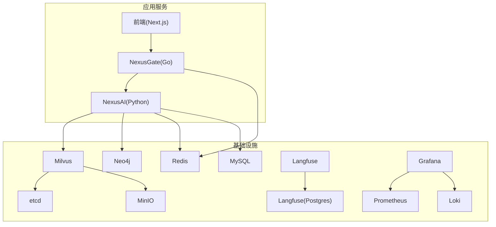
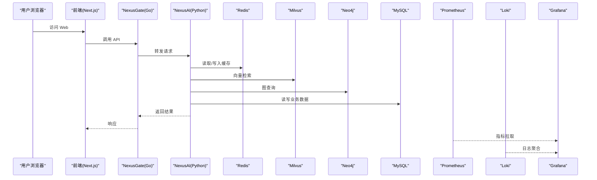
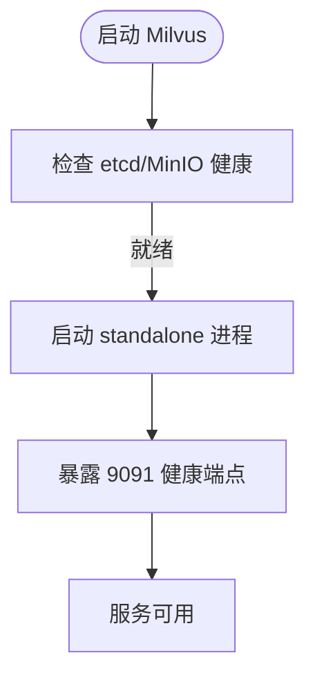
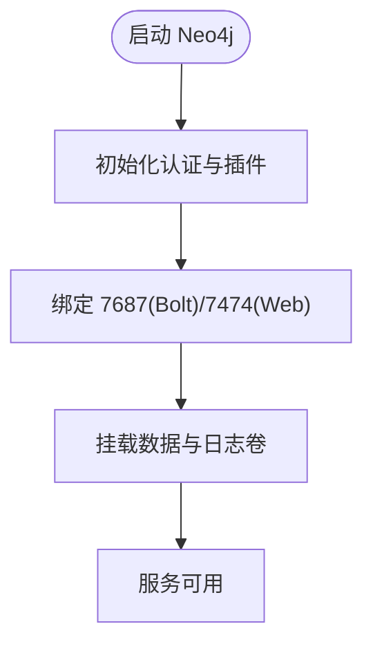
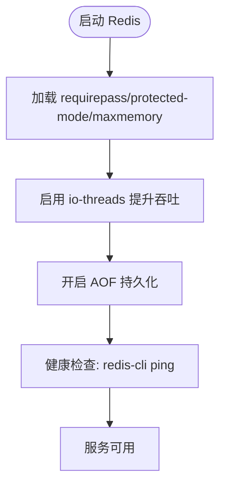
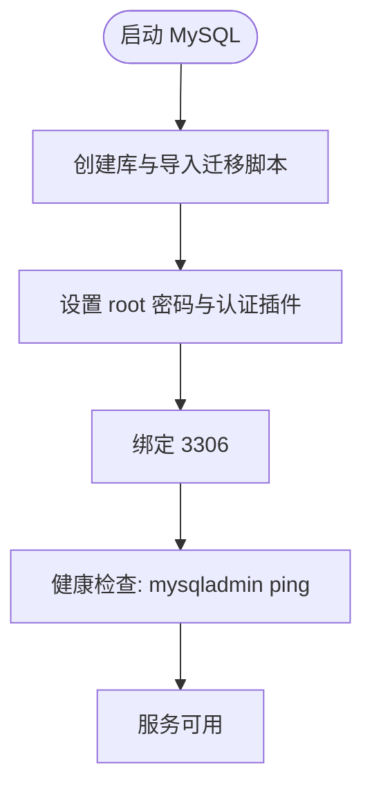
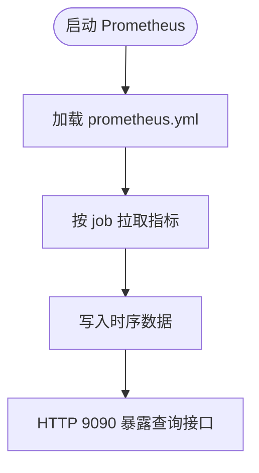
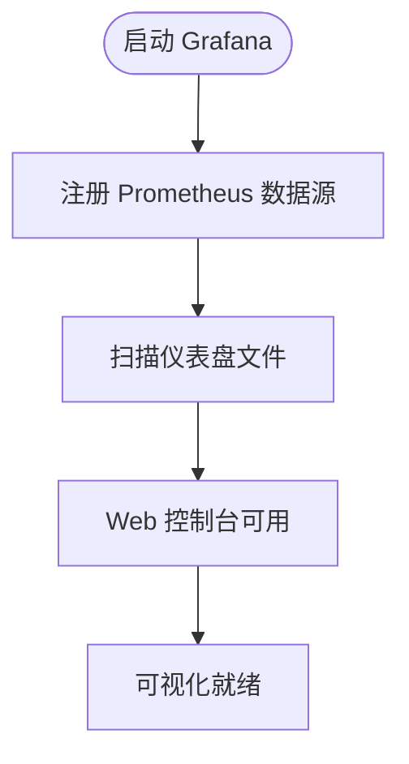
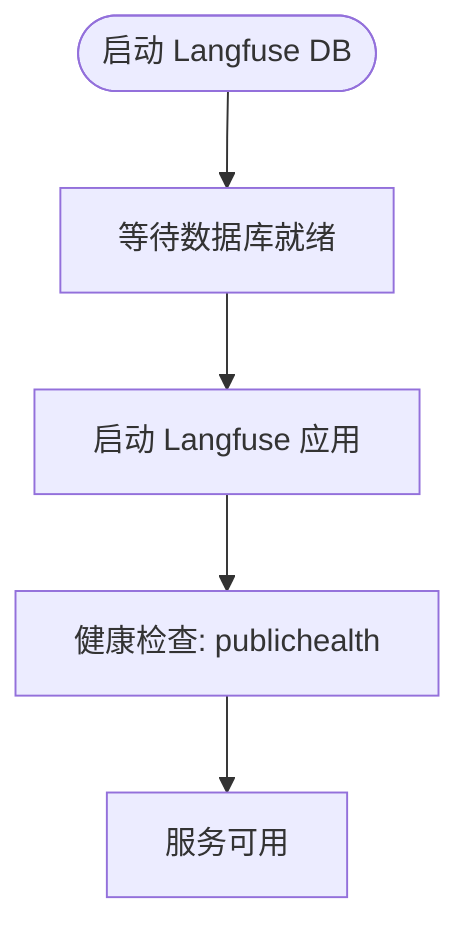
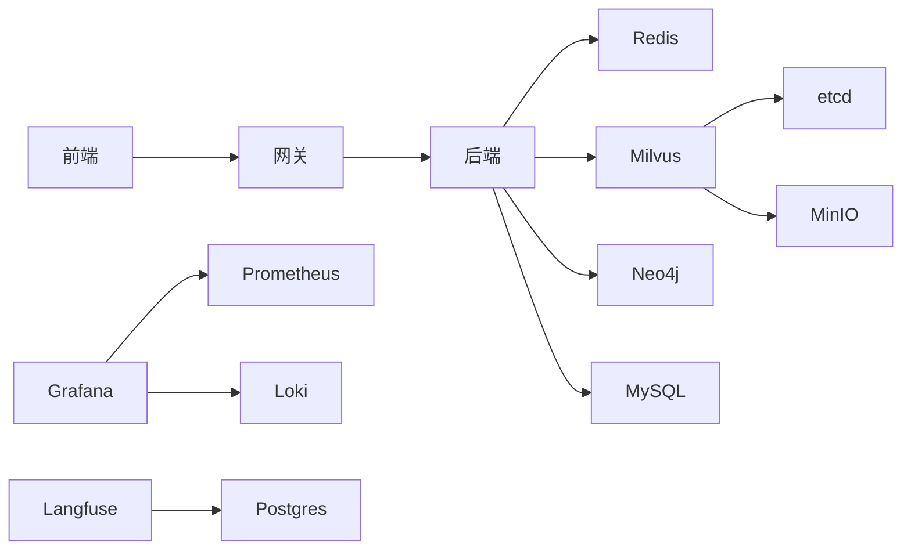

# L0 基础设施层

<cite>
**本文引用的文件**   
- [docker-compose.yml](file://docker-compose.yml)
- [docker-compose.dev.yml](file://docker-compose.dev.yml)
- [prometheus.yml](file://config/prometheus/prometheus.yml)
- [grafana-datasources.yml](file://config/grafana/provisioning/datasources/prometheus.yml)
- [grafana-dashboards.yml](file://config/grafana/provisioning/dashboards/dashboards.yml)
</cite>

## 目录
1. [简介](#简介)
2. [项目结构](#项目结构)
3. [核心组件](#核心组件)
4. [架构总览](#架构总览)
5. [详细组件分析](#详细组件分析)
6. [依赖关系分析](#依赖关系分析)
7. [性能与容量规划](#性能与容量规划)
8. [双模式部署（本地 vs 云端托管）](#双模式部署本地-vs-云端托管)
9. [启动与运维指南](#启动与运维指南)
10. [故障排查](#故障排查)
11. [结论](#结论)

## 简介
本章节面向 NexusCockpit 的 L0 基础设施层，聚焦 Docker Compose 编排与中间件栈。内容涵盖 Milvus 向量数据库、Neo4j 知识图谱、Redis 缓存、MySQL 关系型数据库、Prometheus 监控与 Grafana 可视化等组件的部署配置、端口映射、数据持久化策略、健康检查机制与故障恢复方案。同时说明双模式部署（本地 vs 云端托管）的实现思路与切换要点，并提供完整的启动命令、日志查看方法与运维操作指南。

## 项目结构
L0 基础设施由一组容器化服务组成，通过 docker-compose.yml 统一编排；开发调试时叠加 docker-compose.dev.yml 暴露更多调试端口与挂载目录。可观测性相关配置集中在 config/ 目录下（Prometheus、Grafana、Loki）。

图表来源
- [docker-compose.yml:16-88](file://docker-compose.yml#L16-L88)
- [docker-compose.yml:94-276](file://docker-compose.yml#L94-L276)

章节来源
- [docker-compose.yml:1-292](file://docker-compose.yml#L1-L292)
- [docker-compose.dev.yml:1-63](file://docker-compose.dev.yml#L1-L63)

## 核心组件
- 应用服务
  - NexusGate（Go 网关）：对外暴露 HTTP API，转发到后端并接入 Redis 做限流/会话等能力。
  - NexusAI（Python 后端）：业务逻辑与 RAG、Agent、ASR/TTS 等能力，依赖 Milvus、Neo4j、Redis、MySQL。
  - 前端（Next.js）：静态构建后由反向代理或网关提供访问。
- 基础设施服务
  - etcd：Milvus 元数据存储。
  - MinIO：对象存储，供 Milvus 持久化向量数据。
  - Milvus：向量检索引擎。
  - Neo4j：图数据库，承载知识图谱。
  - Redis：缓存、向量搜索（内置）、速率限制、Pub/Sub。
  - MySQL：用户数据、审计日志、座舱隔离。
  - Langfuse：LLM 追踪（本地化部署）。
  - Loki：日志聚合。
  - Prometheus：指标采集。
  - Grafana：可视化仪表盘。

章节来源
- [docker-compose.yml:16-88](file://docker-compose.yml#L16-L88)
- [docker-compose.yml:94-276](file://docker-compose.yml#L94-L276)

## 架构总览
下图展示请求从前端经网关进入后端，再访问各中间件的典型路径，以及可观测性链路。

图表来源
- [docker-compose.yml:16-88](file://docker-compose.yml#L16-L88)
- [docker-compose.yml:94-276](file://docker-compose.yml#L94-L276)
- [prometheus.yml:1-35](file://config/prometheus/prometheus.yml#L1-L35)

## 详细组件分析

### Milvus 向量数据库
- 镜像与运行方式：使用独立镜像以 standalone 模式运行，依赖 etcd 与 MinIO。
- 环境变量：ETCD_ENDPOINTS、MINIO_ADDRESS、MINIO_ACCESS_KEY_ID、MINIO_SECRET_ACCESS_KEY。
- 端口：19530（gRPC），健康检查通过 9091 端点。
- 数据持久化：milvus_data 卷挂载至 /var/lib/milvus。
- 依赖：etcd、minio。

图表来源
- [docker-compose.yml:126-145](file://docker-compose.yml#L126-L145)

章节来源
- [docker-compose.yml:94-145](file://docker-compose.yml#L94-L145)

### Neo4j 知识图谱
- 镜像与插件：neo4j:5.19.0，启用 apoc 插件。
- 认证：NEO4J_AUTH 支持密码注入。
- 端口：7687（Bolt），开发环境额外暴露 7474（Browser）。
- 数据持久化：neo4j_data 与 neo4j_logs 卷。
- 健康检查：未显式定义，建议通过 Bolt 连接探测。

图表来源
- [docker-compose.yml:147-159](file://docker-compose.yml#L147-L159)

章节来源
- [docker-compose.yml:147-159](file://docker-compose.yml#L147-L159)

### Redis 缓存与向量搜索
- 镜像：redis:8-alpine，内置 Query Engine（RediSearch + VECTOR）。
- 安全与内存：requirepass、protected-mode、maxmemory 与 allkeys-lru 策略。
- 端口：6379（默认），开发环境映射为 16379。
- 持久化：开启 appendonly。
- 健康检查：redis-cli ping 验证。

图表来源
- [docker-compose.yml:161-186](file://docker-compose.yml#L161-L186)

章节来源
- [docker-compose.yml:161-186](file://docker-compose.yml#L161-L186)

### MySQL 关系型数据库
- 镜像：mysql:8.0，字符集 utf8mb4，排序规则 utf8mb4_unicode_ci。
- 初始化：通过 entrypoint 自动执行 v2.1_migration.sql。
- 端口：3306（默认），开发环境映射为 13306。
- 健康检查：mysqladmin ping。
- 数据持久化：mysql_data 卷。

图表来源
- [docker-compose.yml:188-208](file://docker-compose.yml#L188-L208)

章节来源
- [docker-compose.yml:188-208](file://docker-compose.yml#L188-L208)

### Prometheus 监控
- 抓取间隔：15s。
- 目标：nexus-ai、nexus-gate、milvus、prometheus 自身。
- 指标路径：/metrics。
- 网络：通过 host.docker.internal 访问宿主机服务。

图表来源
- [prometheus.yml:1-35](file://config/prometheus/prometheus.yml#L1-L35)

章节来源
- [prometheus.yml:1-35](file://config/prometheus/prometheus.yml#L1-L35)

### Grafana 可视化
- 数据源：自动注册 Prometheus（proxy 模式，POST 方法）。
- 仪表盘：通过 provisioning 文件扫描 /etc/grafana/provisioning/dashboards。
- 安全：管理员密码与环境变量控制。
- 依赖：prometheus、loki。

图表来源
- [grafana-datasources.yml:1-14](file://config/grafana/provisioning/datasources/prometheus.yml#L1-L14)
- [grafana-dashboards.yml:1-14](file://config/grafana/provisioning/dashboards/dashboards.yml#L1-L14)

章节来源
- [grafana-datasources.yml:1-14](file://config/grafana/provisioning/datasources/prometheus.yml#L1-L14)
- [grafana-dashboards.yml:1-14](file://config/grafana/provisioning/dashboards/dashboards.yml#L1-L14)

### Langfuse（LLM 追踪）
- 依赖：Postgres 作为存储。
- 环境变量：DATABASE_URL、NEXTAUTH_URL、NEXTAUTH_SECRET、SALT 等。
- 健康检查：/api/publichealth。
- 端口：3000（开发环境映射 3101）。

图表来源
- [docker-compose.yml:210-246](file://docker-compose.yml#L210-L246)

章节来源
- [docker-compose.yml:210-246](file://docker-compose.yml#L210-L246)

### Loki（日志聚合）
- 镜像：grafana/loki:2.9.5。
- 配置：通过挂载 loki-config.yml 生效。
- 数据持久化：loki_data 卷。

章节来源
- [docker-compose.yml:248-254](file://docker-compose.yml#L248-L254)

### 应用服务（NexusGate、NexusAI、前端）
- NexusGate：依赖 Redis，健康检查 /health。
- NexusAI：依赖 Redis、Milvus、MySQL，健康检查 /health。
- 前端：依赖网关，暴露 3000。

章节来源
- [docker-compose.yml:16-88](file://docker-compose.yml#L16-L88)

## 依赖关系分析
- 应用层
  - 前端 → 网关 → 后端
  - 后端 → Redis、Milvus、Neo4j、MySQL
- 基础设施层
  - Milvus → etcd、MinIO
  - Grafana → Prometheus、Loki
  - Langfuse → Postgres

图表来源
- [docker-compose.yml:16-88](file://docker-compose.yml#L16-L88)
- [docker-compose.yml:94-276](file://docker-compose.yml#L94-L276)

章节来源
- [docker-compose.yml:16-88](file://docker-compose.yml#L16-L88)
- [docker-compose.yml:94-276](file://docker-compose.yml#L94-L276)

## 性能与容量规划
- Redis
  - maxmemory 1GB，allkeys-lru 策略，适合高并发读写的缓存场景。
  - 开启 AOF 保障数据一致性，注意磁盘 I/O 影响。
- Milvus
  - 依赖 etcd 与 MinIO，需保证元数据与对象存储稳定。
  - 向量索引与查询性能受内存与 CPU 影响，建议根据数据规模调整资源。
- Neo4j
  - 图规模较大时需关注 JVM 堆与磁盘 I/O，APC 插件可能带来额外开销。
- MySQL
  - 字符集 utf8mb4，适合多语言与表情符号存储。
  - 迁移脚本在首次启动自动执行，确保版本一致。
- Prometheus/Grafana
  - scrape_interval 15s，适合近实时监控；长期保留需评估磁盘容量。
- 资源预留
  - 建议在容器运行时限制 CPU/内存，避免争抢导致抖动。

[本节为通用指导，不直接分析具体文件]

## 双模式部署（本地 vs 云端托管）
- 本地模式（默认）
  - 所有中间件通过 docker-compose.yml 启动，端口映射见“端口映射”小节。
  - 开发调试叠加 docker-compose.dev.yml 暴露更多端口与挂载目录。
- 云端托管模式（示例）
  - Milvus：切换至 Zilliz Cloud，将 MILVUS_HOST/MILVUS_PORT/MILVUS_URI 指向云服务地址，移除本地 milvus/etcd/minio 依赖。
  - Neo4j：切换至 AuraDB，将 NEO4J_URI 指向云地址，移除本地 neo4j 依赖。
  - Redis：切换至云 Redis，更新 REDIS_HOST/REDIS_PORT/REDIS_PASSWORD，移除本地 redis 依赖。
  - MySQL：切换至云数据库，更新数据库连接参数，移除本地 mysql 依赖。
  - 可观测性：可选使用云监控/日志服务替代本地 Prometheus/Loki/Grafana。
- 切换要点
  - 通过环境变量集中管理连接信息，便于在不同环境间切换。
  - 使用 profiles 或覆盖文件区分本地与云端服务组合。
  - 健康检查与重试策略需适配云服务延迟与限流。

[本节为概念性说明，不直接分析具体文件]

## 启动与运维指南
- 启动全部中间件与应用
  - 仅中间件：docker compose up -d
  - 完整栈（含应用）：docker compose --profile app up -d
  - 开发模式（叠加 dev 配置）：docker compose -f docker-compose.yml -f docker-compose.dev.yml up -d
- 常用命令
  - 查看服务状态：docker compose ps
  - 查看日志：docker compose logs -f <service_name>
  - 停止服务：docker compose down
  - 重启特定服务：docker compose restart <service_name>
- 端口映射（开发/生产差异）
  - 网关：8080
  - 后端：8000
  - 前端：3000
  - Milvus：19530（开发额外 9091）
  - Neo4j：17687(Bolt)，开发额外 17474(Web)
  - MinIO：9000（开发额外 9001 Console）
  - Redis：16379
  - MySQL：13306
  - Langfuse：3101（开发映射 3000→3101）
  - Loki：3100（开发）
  - Prometheus：9200（开发）
  - Grafana：3001（开发）
- 健康检查与自愈
  - 网关/后端/Redis/MySQL/Milvus/MinIO/Langfuse 均定义了健康检查。
  - 服务重启策略：unless-stopped。
- 数据持久化
  - 关键卷：etcd_data、minio_data、milvus_data、neo4j_data、neo4j_logs、redis_data、mysql_data、prometheus_data、grafana_data、loki_data、langfuse_db_data。
- 可观测性
  - Prometheus 抓取 nexus-ai、nexus-gate、milvus 指标。
  - Grafana 自动注册 Prometheus 数据源并扫描仪表盘。
  - Loki 聚合日志，配合 Grafana 进行统一查询。

章节来源
- [docker-compose.yml:1-292](file://docker-compose.yml#L1-L292)
- [docker-compose.dev.yml:1-63](file://docker-compose.dev.yml#L1-L63)
- [prometheus.yml:1-35](file://config/prometheus/prometheus.yml#L1-L35)
- [grafana-datasources.yml:1-14](file://config/grafana/provisioning/datasources/prometheus.yml#L1-L14)
- [grafana-dashboards.yml:1-14](file://config/grafana/provisioning/dashboards/dashboards.yml#L1-L14)

## 故障排查
- 常见问题定位
  - 健康检查失败：检查对应服务的健康端点与依赖是否就绪。
  - 端口冲突：确认宿主机端口未被占用，必要时调整映射。
  - 权限问题：MinIO/Neo4j/MySQL 的凭据是否正确。
  - 数据卷损坏：清理或重建卷后重新初始化。
- 日志查看
  - 应用日志：docker compose logs -f nexus_ai / nexus_gate
  - 中间件日志：docker compose logs -f <service_name>
  - 可观测性：Grafana 查看指标与日志，Loki 进行日志聚合查询。
- 恢复步骤
  - 重启服务：docker compose restart <service_name>
  - 重建数据：删除卷后重新启动（谨慎操作，先备份数据）
  - 回滚迁移：准备回滚脚本并在 MySQL 初始化阶段执行

章节来源
- [docker-compose.yml:16-88](file://docker-compose.yml#L16-L88)
- [docker-compose.yml:94-276](file://docker-compose.yml#L94-L276)

## 结论
L0 基础设施层通过 Docker Compose 实现了高度内聚的中间件编排，覆盖向量检索、知识图谱、缓存、关系型数据库与可观测性全链路。通过环境变量与 profiles 的组合，可在本地与云端之间灵活切换。建议在生产环境中强化安全配置（凭据管理、网络隔离、资源限制），并结合云原生监控与日志体系提升稳定性与可维护性。