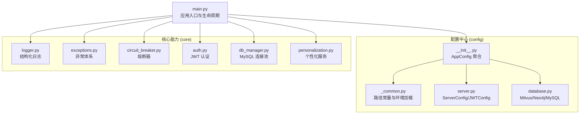
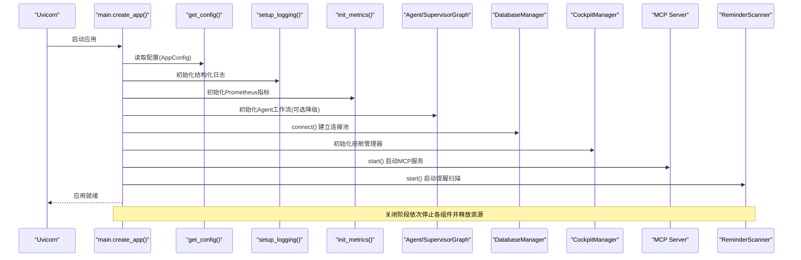
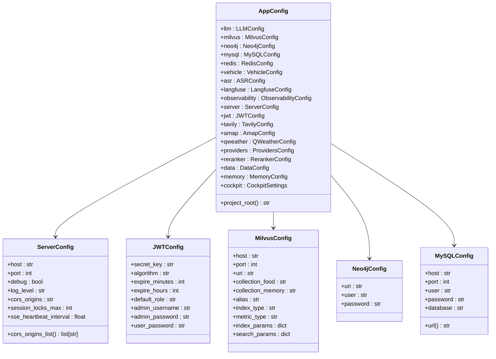
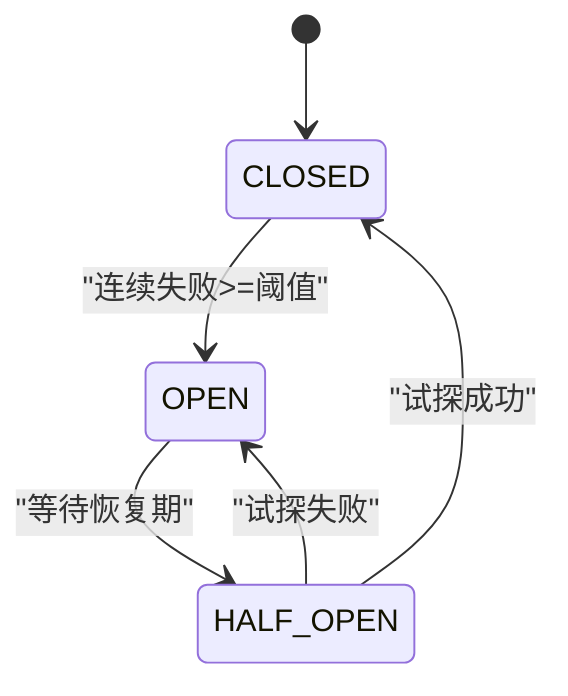
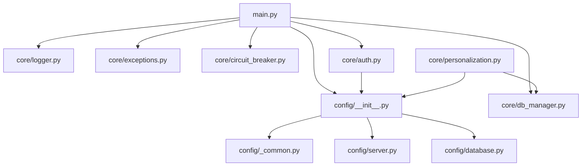

# L1 核心层

<cite>
**本文引用的文件**   
- [main.py](file://backend_design/nexus/main.py)
- [__init__.py（配置聚合）](file://backend_design/nexus/config/__init__.py)
- [_common.py（配置公共工具）](file://backend_design/nexus/config/_common.py)
- [server.py（服务器与JWT配置）](file://backend_design/nexus/config/server.py)
- [database.py（数据库配置）](file://backend_design/nexus/config/database.py)
- [logger.py（结构化日志）](file://backend_design/nexus/core/logger.py)
- [exceptions.py（异常体系）](file://backend_design/nexus/core/exceptions.py)
- [circuit_breaker.py（熔断器）](file://backend_design/nexus/core/circuit_breaker.py)
- [auth.py（认证授权）](file://backend_design/nexus/core/auth.py)
- [db_manager.py（MySQL连接管理）](file://backend_design/nexus/core/db_manager.py)
- [personalization.py（个性化服务）](file://backend_design/nexus/core/personalization.py)
- [L1-core.md（架构设计文档）](file://docs/内部开发存档文档/架构详细设计/L1-core.md)
</cite>

## 目录
1. [简介](#简介)
2. [项目结构](#项目结构)
3. [核心组件](#核心组件)
4. [架构总览](#架构总览)
5. [详细组件分析](#详细组件分析)
6. [依赖关系分析](#依赖关系分析)
7. [性能考量](#性能考量)
8. [故障排查指南](#故障排查指南)
9. [结论](#结论)
10. [附录](#附录)

## 简介
本文件面向 NexusCockpit 的 L1 核心层，系统性阐述基础设施能力与设计规范，包括：统一配置管理、结构化日志系统、全局异常处理、熔断器模式、个性化服务框架、认证授权机制与数据库连接管理等。内容覆盖各组件的设计模式、接口规范、扩展点，并提供配置示例、最佳实践与常见问题解决方案，帮助开发者快速理解并高效扩展核心能力。

## 项目结构
L1 核心层位于 backend_design/nexus/config 与 backend_design/nexus/core 两个主要目录：
- config：基于 Pydantic Settings 的统一配置中心，按子系统拆分配置类并通过 __init__.py 聚合导出。
- core：提供日志、异常、熔断器、认证、数据库连接、个性化等通用能力。

图表来源
- [__init__.py（配置聚合）:1-167](file://backend_design/nexus/config/__init__.py#L1-L167)
- [_common.py（配置公共工具）:1-75](file://backend_design/nexus/config/_common.py#L1-L75)
- [server.py（服务器与JWT配置）:1-61](file://backend_design/nexus/config/server.py#L1-L61)
- [database.py（数据库配置）:1-61](file://backend_design/nexus/config/database.py#L1-L61)
- [main.py:1-673](file://backend_design/nexus/main.py#L1-L673)

章节来源
- [L1-core.md（架构设计文档）:1-131](file://docs/内部开发存档文档/架构详细设计/L1-core.md#L1-L131)

## 核心组件
- 统一配置管理：通过 AppConfig 聚合所有子系统配置，支持 .env/.env.local 自动加载与路径解析。
- 结构化日志：基于 structlog 输出 JSON，支持敏感字段脱敏、上下文绑定与多格式输出。
- 全局异常处理：自定义异常体系 + FastAPI 全局处理器，统一错误响应格式。
- 熔断器模式：三状态机（CLOSED/OPEN/HALF_OPEN），保护外部服务调用。
- 个性化服务：声纹识别用户画像构建，偏好文件与 MySQL 习惯记录融合注入 Prompt。
- 认证授权：JWT 签发与验证，FastAPI 依赖注入实现强制或可选认证。
- 数据库连接管理：aiomysql 连接池、自动建表迁移、RBAC 用户管理与审计日志。

章节来源
- [__init__.py（配置聚合）:84-167](file://backend_design/nexus/config/__init__.py#L84-L167)
- [logger.py（结构化日志）:1-249](file://backend_design/nexus/core/logger.py#L1-L249)
- [exceptions.py（异常体系）:1-128](file://backend_design/nexus/core/exceptions.py#L1-L128)
- [circuit_breaker.py（熔断器）:1-177](file://backend_design/nexus/core/circuit_breaker.py#L1-L177)
- [personalization.py（个性化服务）:1-349](file://backend_design/nexus/core/personalization.py#L1-L349)
- [auth.py（认证授权）:1-140](file://backend_design/nexus/core/auth.py#L1-L140)
- [db_manager.py（MySQL连接管理）:1-800](file://backend_design/nexus/core/db_manager.py#L1-L800)

## 架构总览
应用启动时，main.py 负责初始化配置、日志、指标、向量/图谱存储、车控适配器、语义缓存、限流器、会话存储、Agent 工作流、MySQL 管理器、座舱管理器、数据保留策略、MCP Server、提醒扫描器等，并在关闭时清理资源。

图表来源
- [main.py:75-433](file://backend_design/nexus/main.py#L75-L433)

章节来源
- [main.py:436-658](file://backend_design/nexus/main.py#L436-L658)

## 详细组件分析

### 统一配置管理（环境变量与配置文件加载）
- 设计要点
  - AppConfig 聚合所有子系统配置，使用 lru_cache 保证单例。
  - _common.py 提供路径常量与 _resolve_path()，确保跨目录启动路径一致。
  - 环境文件加载策略：优先 .env.local，回退 .env；dotenv 加载并覆盖 os.environ。
  - 各子配置类独立管理环境变量前缀与默认值。

- 关键接口
  - get_config(): 获取全局 AppConfig 单例。
  - get_llm_config()/get_milvus_config()/get_redis_config(): 快捷访问。
  - _resolve_path(relative_path): 将相对路径解析为绝对路径。

- 扩展点
  - 新增子系统配置：在 config 下新建模块，定义 BaseSettings 子类，并在 AppConfig 中聚合。
  - 自定义路径解析：扩展 _resolve_path() 逻辑以支持更多路径约定。

图表来源
- [__init__.py（配置聚合）:84-167](file://backend_design/nexus/config/__init__.py#L84-L167)
- [server.py（服务器与JWT配置）:15-61](file://backend_design/nexus/config/server.py#L15-L61)
- [database.py（数据库配置）:15-61](file://backend_design/nexus/config/database.py#L15-L61)

章节来源
- [__init__.py（配置聚合）:1-167](file://backend_design/nexus/config/__init__.py#L1-L167)
- [_common.py（配置公共工具）:1-75](file://backend_design/nexus/config/_common.py#L1-L75)
- [server.py（服务器与JWT配置）:1-61](file://backend_design/nexus/config/server.py#L1-L61)
- [database.py（数据库配置）:1-61](file://backend_design/nexus/config/database.py#L1-L61)

### 结构化日志系统（多格式输出、分级控制）
- 设计要点
  - 基于 structlog 输出 JSON（生产）或彩色控制台（开发）。
  - 内置敏感字段脱敏处理器，过滤 API Key、Token、密码等。
  - 标准 logging 与 uvicorn logger 共享 FileHandler，确保访问日志写入文件。
  - 支持上下文绑定（如 request_id、user_id）用于链路追踪。

- 关键接口
  - setup_logging(): 初始化全局日志配置。
  - get_logger(name): 获取结构化日志器。
  - bind_context(**kwargs)/clear_context(): 绑定/清除上下文变量。
  - get_log_file_path(): 获取当前日志文件路径。

- 最佳实践
  - 在应用启动早期调用 setup_logging()。
  - 使用 get_logger(__name__) 获取模块级日志器。
  - 通过 bind_context() 绑定请求级上下文，避免泄露。

章节来源
- [logger.py（结构化日志）:1-249](file://backend_design/nexus/core/logger.py#L1-L249)

### 全局异常处理机制
- 设计要点
  - 自定义异常继承自 NexusError，包含 code/message/details 三元组。
  - FastAPI 全局异常处理器统一返回 {error, message, details} 格式。
  - 针对 RateLimitError/AuthError/NexusError/HTTPException/RequestValidationError 分别处理。

- 关键接口
  - 各类异常：AuthError、RateLimitError、LLMError、VectorStoreError 等。
  - main.py 中的 @app.exception_handler(...) 注册处理器。

- 最佳实践
  - 业务异常抛出自定义异常，由全局处理器统一转换。
  - 前端根据 error.code 做差异化处理。

章节来源
- [exceptions.py（异常体系）:1-128](file://backend_design/nexus/core/exceptions.py#L1-L128)
- [main.py:503-596](file://backend_design/nexus/main.py#L503-L596)

### 熔断器模式实现
- 设计要点
  - 三状态机：CLOSED（正常）、OPEN（拒绝）、HALF_OPEN（试探）。
  - 失败阈值触发 OPEN，恢复期后进入 HALF_OPEN，试探成功则 CLOSED。
  - 异步 call(func, *args, **kwargs) 包装被保护函数。

- 关键接口
  - CircuitBreaker(name, failure_threshold, recovery_period, half_open_max_calls)。
  - state 属性：动态检查 OPEN -> HALF_OPEN 转换。
  - call(func, ...)：执行受保护的异步调用。

- 使用场景
  - 云端 LLM API 连续失败 → 降级到本地模型。
  - Milvus/车控服务不可用 → 降级到无检索/Mock 模式。

图表来源
- [circuit_breaker.py（熔断器）:34-177](file://backend_design/nexus/core/circuit_breaker.py#L34-L177)

章节来源
- [circuit_breaker.py（熔断器）:1-177](file://backend_design/nexus/core/circuit_breaker.py#L1-L177)

### 个性化服务框架
- 设计要点
  - 读取 data/preferences/{user_id}.json 与 MySQL user_habits 表。
  - 构建用户画像文本，注入到 Prompt 的 {user_profile} 占位符。
  - 支持本地音乐库匹配（assets/audio/music/）。

- 关键接口
  - PersonalizationService.get_user_profile(user_id): 返回画像文本与偏好。
  - match_music(user_id): 根据偏好匹配本地音乐。
  - save_preferences(user_id, preferences): 保存偏好到 JSON。

- 扩展点
  - 新增偏好维度：扩展 _build_profile_text() 逻辑。
  - 接入其他习惯源：替换 _load_mysql_habits() 为其他数据源。

章节来源
- [personalization.py（个性化服务）:1-349](file://backend_design/nexus/core/personalization.py#L1-L349)

### 认证授权机制（JWT）
- 设计要点
  - 基于 python-jose 实现 JWT 签发与验证。
  - HTTPBearer 自动提取 Authorization Header。
  - get_current_user/get_optional_user 作为 FastAPI 依赖注入。

- 关键接口
  - create_access_token(user_id, expires_delta, extra_claims): 签发 Token。
  - decode_token(token): 解码并验证 Token。
  - get_current_user(credentials): 强制认证，返回 user_id。
  - get_optional_user(credentials): 可选认证，返回 user_id 或 None。

- 最佳实践
  - 敏感路由使用 Depends(get_current_user) 强制认证。
  - 非敏感路由可使用 Depends(get_optional_user) 增强上下文。

章节来源
- [auth.py（认证授权）:1-140](file://backend_design/nexus/core/auth.py#L1-L140)

### 数据库连接管理（MySQL）
- 设计要点
  - aiomysql 连接池管理，minsize/maxsize 控制并发。
  - 启动时自动建表与迁移，插入默认数据。
  - 提供 RBAC 用户管理、审计日志、LLM 成本追踪等 CRUD。

- 关键接口
  - DatabaseManager.connect()/close(): 连接池生命周期。
  - insert_*(): 各类日志与审计写入。
  - get_llm_cost_summary(cockpit_id, hours): 成本汇总。
  - list_users()/get_user()/create_user()/delete_user(): 用户管理。

- 最佳实践
  - 使用 with self._get_conn() 上下文管理器确保连接释放。
  - 异常捕获并记录，返回 None/False 表示失败。

章节来源
- [db_manager.py（MySQL连接管理）:1-800](file://backend_design/nexus/core/db_manager.py#L1-L800)

## 依赖关系分析
核心层组件之间的依赖关系如下：
- main.py 依赖配置中心、日志、异常、熔断器、认证、数据库、个性化等。
- 配置中心内部通过 _common.py 提供路径与环境加载工具。
- 个性化服务依赖数据库管理器与配置中心。
- 认证模块依赖配置中心的 JWTConfig。

图表来源
- [main.py:1-673](file://backend_design/nexus/main.py#L1-L673)
- [__init__.py（配置聚合）:1-167](file://backend_design/nexus/config/__init__.py#L1-L167)
- [_common.py（配置公共工具）:1-75](file://backend_design/nexus/config/_common.py#L1-L75)
- [server.py（服务器与JWT配置）:1-61](file://backend_design/nexus/config/server.py#L1-L61)
- [database.py（数据库配置）:1-61](file://backend_design/nexus/config/database.py#L1-L61)
- [logger.py（结构化日志）:1-249](file://backend_design/nexus/core/logger.py#L1-L249)
- [exceptions.py（异常体系）:1-128](file://backend_design/nexus/core/exceptions.py#L1-L128)
- [circuit_breaker.py（熔断器）:1-177](file://backend_design/nexus/core/circuit_breaker.py#L1-L177)
- [auth.py（认证授权）:1-140](file://backend_design/nexus/core/auth.py#L1-L140)
- [db_manager.py（MySQL连接管理）:1-800](file://backend_design/nexus/core/db_manager.py#L1-L800)
- [personalization.py（个性化服务）:1-349](file://backend_design/nexus/core/personalization.py#L1-L349)

章节来源
- [main.py:1-673](file://backend_design/nexus/main.py#L1-L673)

## 性能考量
- 配置加载：使用 lru_cache 缓存 AppConfig 实例，避免重复解析 .env。
- 日志输出：生产环境 JSON 输出，减少 I/O 开销；敏感字段脱敏在处理器中完成。
- 数据库连接：aiomysql 连接池复用连接，减少握手开销。
- 熔断器：快速失败，避免阻塞线程池与事件循环。
- 启动优化：ASR/TTS 模型后台预加载，不阻塞主流程。

[本节为通用指导，无需特定文件引用]

## 故障排查指南
- 配置问题
  - 现象：API Key 为空或路径解析错误。
  - 排查：检查 .env.local/.env 是否存在，确认 APP_ENV 设置；使用 get_config().project_root 验证路径。
  - 参考：[_common.py:39-53](file://backend_design/nexus/config/_common.py#L39-L53)、[__init__.py:134-138](file://backend_design/nexus/config/__init__.py#L134-L138)

- 日志问题
  - 现象：日志未写入文件或刷屏。
  - 排查：确认 setup_logging() 已调用；检查 uvicorn logger 是否添加 FileHandler；查看日志级别设置。
  - 参考：[logger.py:161-177](file://backend_design/nexus/core/logger.py#L161-L177)

- 认证问题
  - 现象：401 Unauthorized 或 Token 无效。
  - 排查：检查 Authorization 头格式；确认 JWT_SECRET_KEY 配置；验证 Token 过期时间。
  - 参考：[auth.py:64-83](file://backend_design/nexus/core/auth.py#L64-L83)

- 数据库问题
  - 现象：连接失败或表不存在。
  - 排查：检查 MYSQL_* 配置；查看自动迁移日志；确认连接池状态。
  - 参考：[db_manager.py:56-85](file://backend_design/nexus/core/db_manager.py#L56-L85)

- 熔断器问题
  - 现象：服务频繁降级。
  - 排查：检查外部服务健康状态；调整 failure_threshold/recovery_period；查看熔断器状态日志。
  - 参考：[circuit_breaker.py:147-163](file://backend_design/nexus/core/circuit_breaker.py#L147-L163)

章节来源
- [logger.py（结构化日志）:161-177](file://backend_design/nexus/core/logger.py#L161-L177)
- [auth.py（认证授权）:64-83](file://backend_design/nexus/core/auth.py#L64-L83)
- [db_manager.py（MySQL连接管理）:56-85](file://backend_design/nexus/core/db_manager.py#L56-L85)
- [circuit_breaker.py（熔断器）:147-163](file://backend_design/nexus/core/circuit_breaker.py#L147-L163)

## 结论
NexusCockpit 的 L1 核心层提供了稳定、可扩展的基础设施能力，涵盖配置、日志、异常、熔断、认证、数据库与个性化等关键领域。通过模块化设计与清晰接口规范，开发者可快速集成与扩展功能，同时保障系统的稳定性与可观测性。建议在生产环境中严格遵循配置与日志最佳实践，并结合熔断器与异常处理提升系统韧性。

[本节为总结性内容，无需特定文件引用]

## 附录
- 配置示例（节选）
  - 服务器配置：HOST=0.0.0.0, PORT=8000, DEBUG=True, LOG_LEVEL=INFO, CORS_ORIGINS=http://localhost:3000
  - JWT 配置：JWT_SECRET_KEY=<your_secret>, JWT_ALGORITHM=HS256, JWT_EXPIRE_MINUTES=1440
  - MySQL 配置：MYSQL_HOST=127.0.0.1, MYSQL_PORT=13306, MYSQL_USER=root, MYSQL_PASSWORD=nexuscockpit, MYSQL_DATABASE=nexus_cockpit
  - Milvus 配置：MILVUS_HOST=127.0.0.1, MILVUS_PORT=19530, MILVUS_URI=http://127.0.0.1:19530
  - Neo4j 配置：NEO4J_URI=bolt://127.0.0.1:17687, NEO4J_USER=neo4j, NEO4J_PASSWORD=nexuscockpit

- 最佳实践
  - 使用 .env.local 存放敏感信息，避免提交到版本库。
  - 在路由中使用 Depends(get_current_user) 强制认证，非敏感接口使用 get_optional_user。
  - 对外部调用包裹熔断器，合理设置阈值与恢复期。
  - 结构化日志中绑定 request_id/user_id，便于链路追踪。
  - 数据库操作使用上下文管理器，确保连接释放与异常捕获。

- 常见问题
  - 路径解析错误：确保使用 _resolve_path() 或 resolved_*() 方法。
  - 日志脱敏失效：检查敏感键名是否匹配正则模式。
  - 认证降级：开发模式下未配置 JWT_SECRET 可能直通认证。
  - 数据库迁移失败：检查权限与字符集设置，查看自动迁移日志。

[本节为补充信息，无需特定文件引用]