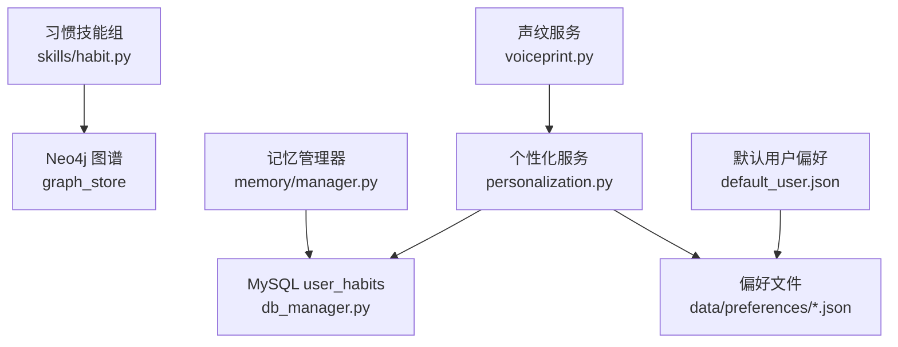
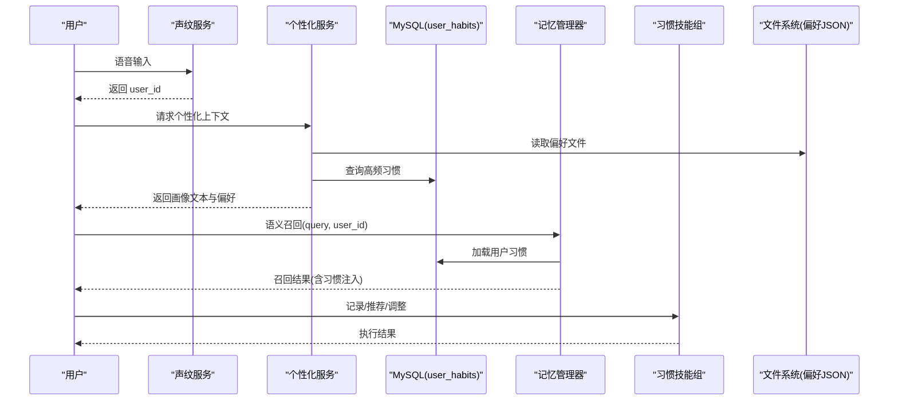
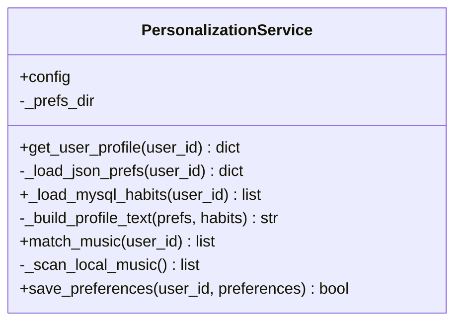
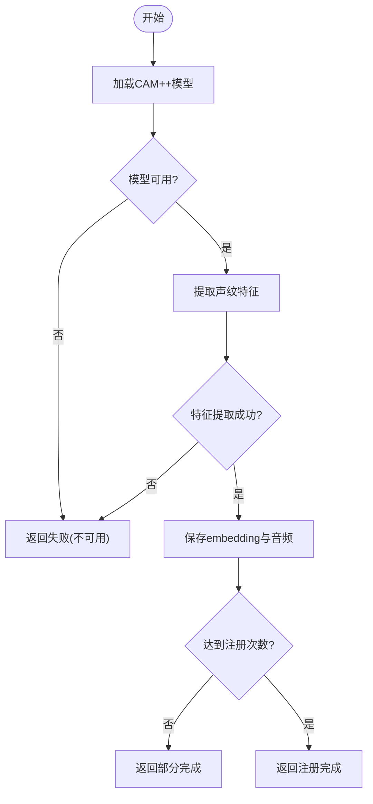
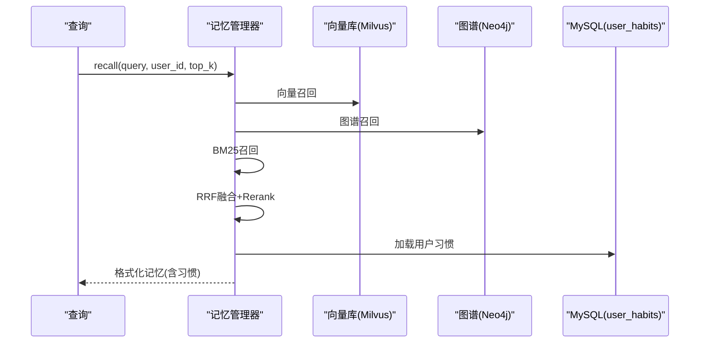
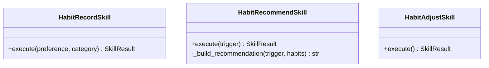
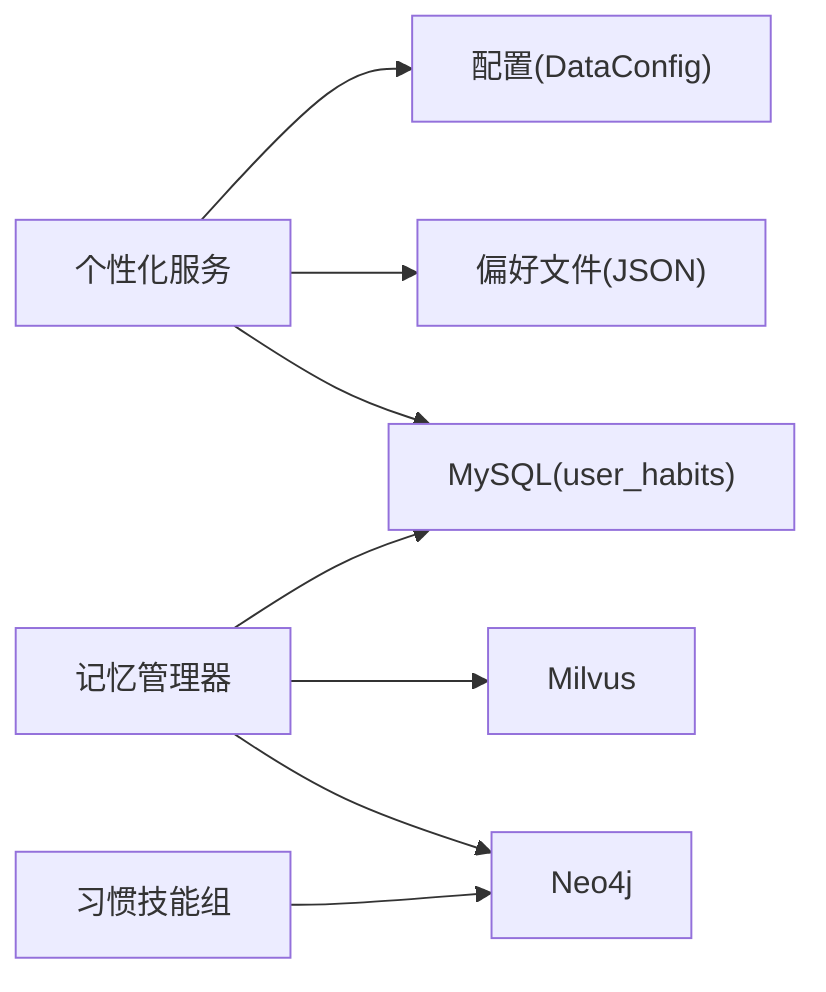

# 个性化服务

<cite>
**本文引用的文件**
- [personalization.py](file://backend_design/nexus/core/personalization.py)
- [voiceprint.py](file://backend_design/nexus/core/voiceprint.py)
- [data.py](file://backend_design/nexus/config/data.py)
- [db_manager.py](file://backend_design/nexus/core/db_manager.py)
- [habit.py](file://backend_design/nexus/skills/habit.py)
- [manager.py](file://backend_design/nexus/memory/manager.py)
- [default_user.json](file://data/preferences/default_user.json)
</cite>

## 目录
1. [简介](#简介)
2. [项目结构](#项目结构)
3. [核心组件](#核心组件)
4. [架构总览](#架构总览)
5. [详细组件分析](#详细组件分析)
6. [依赖关系分析](#依赖关系分析)
7. [性能考量](#性能考量)
8. [故障排查指南](#故障排查指南)
9. [结论](#结论)
10. [附录](#附录)

## 简介
本文件面向 NexusCockpit 的个性化服务框架，系统性阐述用户画像管理、偏好设置存储、个性化推荐算法与用户行为追踪机制。文档覆盖个性化数据的生命周期管理、隐私保护措施、数据同步策略与性能优化方案，并提供个性化规则配置、扩展点设计与集成示例，帮助开发者快速理解并扩展个性化能力。

## 项目结构
个性化服务由“声纹识别 → 偏好读取 → 习惯统计 → 画像构建 → 推荐匹配”组成，涉及以下关键位置：
- 个性化服务实现：core/personalization.py
- 声纹注册与验证：core/voiceprint.py
- 数据目录与偏好路径：config/data.py
- 数据库管理与 user_habits 表：core/db_manager.py
- 习惯技能组（Neo4j 图谱）：skills/habit.py
- 记忆管理器（召回与融合）：memory/manager.py
- 默认用户偏好样例：data/preferences/default_user.json

图表来源
- [personalization.py:32-70](file://backend_design/nexus/core/personalization.py#L32-L70)
- [voiceprint.py:43-106](file://backend_design/nexus/core/voiceprint.py#L43-L106)
- [data.py:15-44](file://backend_design/nexus/config/data.py#L15-L44)
- [db_manager.py:285-299](file://backend_design/nexus/core/db_manager.py#L285-L299)
- [habit.py:26-75](file://backend_design/nexus/skills/habit.py#L26-L75)
- [manager.py:98-150](file://backend_design/nexus/memory/manager.py#L98-L150)
- [default_user.json:1-46](file://data/preferences/default_user.json#L1-L46)

章节来源
- [personalization.py:32-70](file://backend_design/nexus/core/personalization.py#L32-L70)
- [voiceprint.py:43-106](file://backend_design/nexus/core/voiceprint.py#L43-L106)
- [data.py:15-44](file://backend_design/nexus/config/data.py#L15-L44)
- [db_manager.py:285-299](file://backend_design/nexus/core/db_manager.py#L285-L299)
- [habit.py:26-75](file://backend_design/nexus/skills/habit.py#L26-L75)
- [manager.py:98-150](file://backend_design/nexus/memory/manager.py#L98-L150)
- [default_user.json:1-46](file://data/preferences/default_user.json#L1-L46)

## 核心组件
- 个性化服务（PersonalizationService）
  - 职责：根据 user_id 合并 JSON 偏好与 MySQL 习惯记录，生成画像文本注入 Prompt；按偏好匹配本地音乐播放列表；持久化用户偏好。
  - 关键方法：get_user_profile、_load_json_prefs、_load_mysql_habits、_build_profile_text、match_music、save_preferences。
- 声纹服务（VoiceprintService）
  - 职责：基于 CAM++ 模型提取声纹特征，完成注册与验证，返回 user_id 供个性化服务使用。
  - 关键方法：enroll、verify、get_status、delete_voiceprint、_extract_embedding。
- 记忆管理器（MemoryManager）
  - 职责：三路召回（向量+图谱+BM25）+ Rerank，渐进式披露；从 MySQL 加载用户习惯注入记忆上下文；会话级清理。
  - 关键方法：recall、store_from_text、store_conversation、_load_user_habits、cleanup_expired_session_vectors。
- 习惯技能组（HabitRecord/HabitRecommend/HabitAdjust）
  - 职责：记录用户偏好到 Neo4j 图谱；按触发场景主动推荐；批量下发车控指令。
- 数据配置（DataConfig/MemoryConfig）
  - 职责：定义 preferences_dir、temp_dir 等路径解析；记忆压缩阈值、窗口大小等参数。
- 数据库管理（DatabaseManager）
  - 职责：连接池、自动建表、user_habits 读写、会话与日志管理等。

章节来源
- [personalization.py:32-70](file://backend_design/nexus/core/personalization.py#L32-L70)
- [voiceprint.py:43-106](file://backend_design/nexus/core/voiceprint.py#L43-L106)
- [manager.py:98-150](file://backend_design/nexus/memory/manager.py#L98-L150)
- [habit.py:26-75](file://backend_design/nexus/skills/habit.py#L26-L75)
- [data.py:15-44](file://backend_design/nexus/config/data.py#L15-L44)
- [db_manager.py:285-299](file://backend_design/nexus/core/db_manager.py#L285-L299)

## 架构总览
个性化服务整体流程如下：
- 声纹识别得到 user_id
- 读取 JSON 偏好与 MySQL 习惯记录
- 构建用户画像文本注入 Prompt
- 基于偏好进行本地音乐匹配或推荐
- 通过记忆管理器进行语义召回与习惯注入
- 通过习惯技能组写入/查询 Neo4j 图谱并驱动车控

图表来源
- [voiceprint.py:108-190](file://backend_design/nexus/core/voiceprint.py#L108-L190)
- [personalization.py:46-70](file://backend_design/nexus/core/personalization.py#L46-L70)
- [manager.py:98-150](file://backend_design/nexus/memory/manager.py#L98-L150)
- [habit.py:101-139](file://backend_design/nexus/skills/habit.py#L101-L139)

## 详细组件分析

### 个性化服务（PersonalizationService）
- 用户画像构建
  - 合并 JSON 偏好与 MySQL 习惯记录，生成结构化画像文本，用于注入 Prompt 的 {user_profile}。
  - 支持音乐、美食、位置、空调等多维度偏好字段。
- 音乐匹配
  - 扫描 assets/audio/music 目录，按用户偏好的歌曲名模糊匹配，返回播放列表。
- 偏好保存
  - 增量更新 created_at/updated_at，保证文件存在性与幂等性。

图表来源
- [personalization.py:32-70](file://backend_design/nexus/core/personalization.py#L32-L70)
- [personalization.py:144-197](file://backend_design/nexus/core/personalization.py#L144-L197)
- [personalization.py:199-236](file://backend_design/nexus/core/personalization.py#L199-L236)
- [personalization.py:297-336](file://backend_design/nexus/core/personalization.py#L297-L336)

章节来源
- [personalization.py:46-70](file://backend_design/nexus/core/personalization.py#L46-L70)
- [personalization.py:144-197](file://backend_design/nexus/core/personalization.py#L144-L197)
- [personalization.py:199-236](file://backend_design/nexus/core/personalization.py#L199-L236)
- [personalization.py:297-336](file://backend_design/nexus/core/personalization.py#L297-L336)

### 声纹服务（VoiceprintService）
- 注册流程
  - 延迟加载 CAM++ 模型，提取 embedding，按座舱与用户隔离存储 .npy 与原始音频。
- 验证流程
  - 计算相似度并与阈值比较，返回最佳匹配 user_id。
- 状态与删除
  - 查询座舱下已注册用户数与完成度；支持删除用户声纹数据。

图表来源
- [voiceprint.py:62-92](file://backend_design/nexus/core/voiceprint.py#L62-L92)
- [voiceprint.py:108-190](file://backend_design/nexus/core/voiceprint.py#L108-L190)
- [voiceprint.py:192-269](file://backend_design/nexus/core/voiceprint.py#L192-L269)

章节来源
- [voiceprint.py:108-190](file://backend_design/nexus/core/voiceprint.py#L108-L190)
- [voiceprint.py:192-269](file://backend_design/nexus/core/voiceprint.py#L192-L269)

### 记忆管理器（MemoryManager）
- 召回管道
  - GraphRAGRetriever 三路召回（向量+图谱+BM25），RRF 融合，Rerank 重排，渐进式披露。
- 习惯注入
  - 从 MySQL user_habits 加载高频习惯，追加为记忆字符串。
- 会话清理
  - 定时清理过期会话级对话向量，保留用户级记忆。

图表来源
- [manager.py:98-150](file://backend_design/nexus/memory/manager.py#L98-L150)
- [manager.py:183-210](file://backend_design/nexus/memory/manager.py#L183-L210)
- [manager.py:514-582](file://backend_design/nexus/memory/manager.py#L514-L582)

章节来源
- [manager.py:98-150](file://backend_design/nexus/memory/manager.py#L98-L150)
- [manager.py:183-210](file://backend_design/nexus/memory/manager.py#L183-L210)
- [manager.py:514-582](file://backend_design/nexus/memory/manager.py#L514-L582)

### 习惯技能组（HabitSkills）
- habit_record：记录用户偏好到 Neo4j 图谱（category 分类）。
- habit_recommend：按触发场景（morning_start/nav_start/evening_start）主动推荐。
- habit_adjust：读取画像批量下发车控指令（如空调、媒体）。

图表来源
- [habit.py:26-75](file://backend_design/nexus/skills/habit.py#L26-L75)
- [habit.py:78-139](file://backend_design/nexus/skills/habit.py#L78-L139)
- [habit.py:141-215](file://backend_design/nexus/skills/habit.py#L141-L215)

章节来源
- [habit.py:26-75](file://backend_design/nexus/skills/habit.py#L26-L75)
- [habit.py:78-139](file://backend_design/nexus/skills/habit.py#L78-L139)
- [habit.py:141-215](file://backend_design/nexus/skills/habit.py#L141-L215)

### 数据配置与路径解析
- DataConfig 提供 preferences_dir 等路径解析，确保绝对路径与跨平台兼容。
- MemoryConfig 控制记忆压缩阈值、窗口大小、Token 上限等。

章节来源
- [data.py:15-44](file://backend_design/nexus/config/data.py#L15-L44)
- [data.py:47-63](file://backend_design/nexus/config/data.py#L47-L63)

### 数据库管理与 user_habits
- DatabaseManager 自动创建 user_habits 表，包含 user_id、cockpit_id、habit_key、habit_value、hit_count、last_used_at 等字段。
- 个性化服务与记忆管理器均从该表读取高频习惯，用于画像与记忆注入。

章节来源
- [db_manager.py:285-299](file://backend_design/nexus/core/db_manager.py#L285-L299)

### 默认用户偏好
- default_user.json 提供音乐、美食、位置、空调、导航等维度的默认值，作为新用户或无偏好时的回退。

章节来源
- [default_user.json:1-46](file://data/preferences/default_user.json#L1-L46)

## 依赖关系分析
- 个性化服务依赖：
  - 配置文件（preferences_dir）
  - 文件系统（偏好 JSON）
  - 数据库（user_habits）
  - 可选：声纹服务（user_id）
- 记忆管理器依赖：
  - Milvus 向量库、Neo4j 图谱、Reranker、LLM 客户端
  - MySQL user_habits
- 习惯技能组依赖：
  - Neo4j graph_store、车辆适配器（可选）

图表来源
- [personalization.py:32-70](file://backend_design/nexus/core/personalization.py#L32-L70)
- [manager.py:98-150](file://backend_design/nexus/memory/manager.py#L98-L150)
- [habit.py:26-75](file://backend_design/nexus/skills/habit.py#L26-L75)
- [data.py:15-44](file://backend_design/nexus/config/data.py#L15-L44)

章节来源
- [personalization.py:32-70](file://backend_design/nexus/core/personalization.py#L32-L70)
- [manager.py:98-150](file://backend_design/nexus/memory/manager.py#L98-L150)
- [habit.py:26-75](file://backend_design/nexus/skills/habit.py#L26-L75)
- [data.py:15-44](file://backend_design/nexus/config/data.py#L15-L44)

## 性能考量
- 数据库访问
  - 使用连接池与异步查询，限制返回条数（如 LIMIT 10），避免大结果集。
- 文件 I/O
  - 偏好文件读取采用异常捕获与降级策略，缺失时回退默认值。
- 模型加载
  - 声纹模型延迟加载，不可用时降级为 mock 模式，不阻塞主流程。
- 记忆召回
  - 三路召回 + Rerank 提升相关性；渐进式披露减少简单查询的开销。
- 后台任务
  - 非阻塞存储（fire-and-forget）与定时清理任务，降低主线程压力。

[本节为通用指导，无需具体文件引用]

## 故障排查指南
- 声纹识别不可用
  - 现象：verify/enroll 返回不可用或空特征
  - 处理：检查 CAM++ 模型路径与依赖安装；确认 _ensure_model 是否成功加载
- 偏好文件读取失败
  - 现象：_load_json_prefs 抛出异常或返回空字典
  - 处理：检查 data/preferences 目录权限与文件格式；确认 default_user.json 存在
- MySQL 不可用
  - 现象：_load_mysql_habits 返回空列表
  - 处理：检查连接池初始化与 user_habits 表是否存在；确认网络与认证
- 记忆召回失败
  - 现象：GraphRAG 召回异常，回退至仅向量检索
  - 处理：检查 Milvus/Neo4j 连接；查看 reranker 配置与可用性
- 会话清理未生效
  - 现象：Milvus 中残留大量 session_id 向量
  - 处理：确认 cleanup_task 启动；检查 chat_sessions 有效列表与 Milvus 查询表达式

章节来源
- [voiceprint.py:192-269](file://backend_design/nexus/core/voiceprint.py#L192-L269)
- [personalization.py:72-101](file://backend_design/nexus/core/personalization.py#L72-L101)
- [personalization.py:103-142](file://backend_design/nexus/core/personalization.py#L103-L142)
- [manager.py:514-582](file://backend_design/nexus/memory/manager.py#L514-L582)

## 结论
NexusCockpit 的个性化服务以“声纹识别 + 偏好文件 + 习惯统计 + 记忆召回”为核心，形成端到端的用户画像与推荐链路。通过模块化设计（个性化服务、声纹服务、记忆管理器、习惯技能组）与稳健的降级策略，系统在可用性、可扩展性与性能之间取得平衡。建议在生产环境中结合监控与日志，持续优化阈值与召回策略，保障用户体验与系统稳定性。

[本节为总结性内容，无需具体文件引用]

## 附录

### 个性化数据生命周期管理
- 采集：声纹注册、用户输入、交互事件
- 存储：JSON 偏好文件、MySQL user_habits、Milvus 向量、Neo4j 图谱
- 使用：画像构建、Prompt 注入、推荐匹配、记忆召回
- 清理：会话级向量 TTL 清理、用户删除联动清理

### 隐私保护措施
- 数据隔离：按 cockpit_id 与 user_id 隔离存储
- 最小化原则：仅记录必要字段，限制返回条数
- 可删除性：支持删除用户声纹与偏好数据
- 安全传输：建议使用 HTTPS/TLS 保护接口

### 数据同步策略
- 多源一致性：Milvus 与 Neo4j 双向写入，失败补偿回滚
- 会话级清理：定期清理过期 session_id 向量，保持数据整洁
- 降级与容错：单后端失败不影响整体功能

### 性能优化方案
- 连接池与异步 I/O
- 延迟加载与缓存（lru_cache）
- 渐进式披露与 top_k 动态调整
- 非阻塞任务与重试机制

### 个性化规则配置
- 偏好字段：music、food、location、climate、navigation
- 阈值配置：声纹验证阈值、注册次数、记忆压缩阈值
- 路径配置：preferences_dir、temp_dir、上传目录

### 扩展点设计
- 新增偏好维度：在 _build_profile_text 中添加新字段拼接
- 自定义匹配器：扩展 match_music 的匹配逻辑
- 新技能组：遵循 BaseSkill 接口注册新能力
- 记忆抽取开关：MEMORY_EXTRACTION_ENABLED 控制 LLM 调用

### 集成示例
- 声纹识别后获取 user_id，调用 get_user_profile 注入画像
- 在聊天流程中调用 MemoryManager.recall 增强上下文
- 通过 HabitSkills 记录/推荐/调整用户习惯
- 使用 save_preferences 持久化用户偏好

章节来源
- [personalization.py:144-197](file://backend_design/nexus/core/personalization.py#L144-L197)
- [personalization.py:199-236](file://backend_design/nexus/core/personalization.py#L199-L236)
- [personalization.py:297-336](file://backend_design/nexus/core/personalization.py#L297-L336)
- [manager.py:98-150](file://backend_design/nexus/memory/manager.py#L98-L150)
- [habit.py:26-75](file://backend_design/nexus/skills/habit.py#L26-L75)
- [data.py:15-44](file://backend_design/nexus/config/data.py#L15-L44)