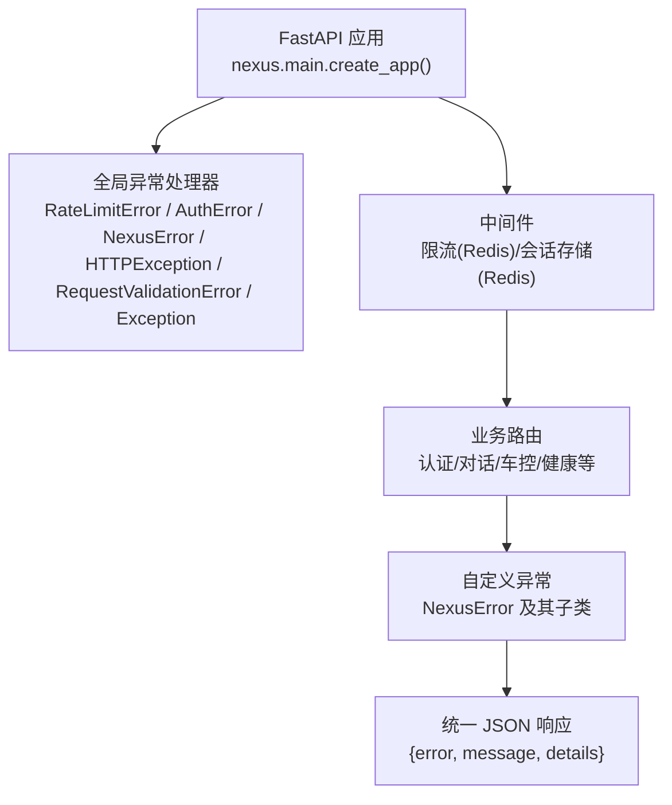
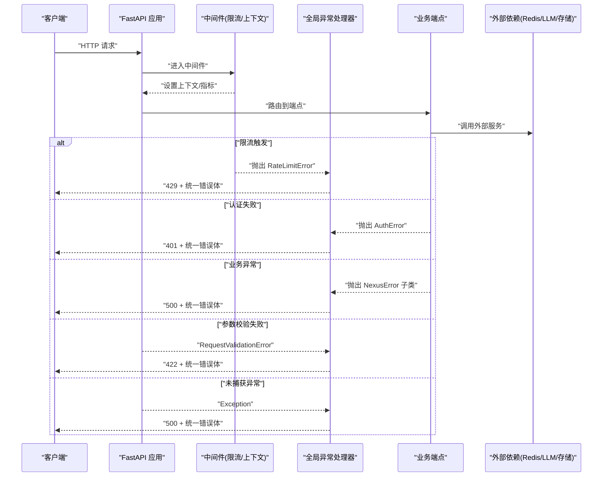
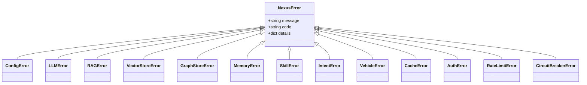
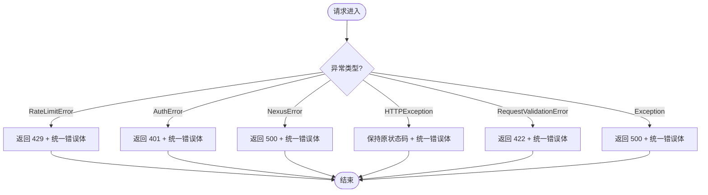
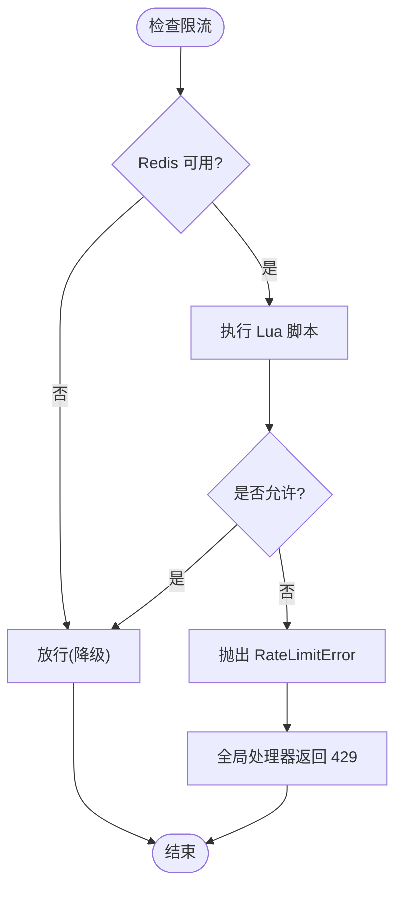
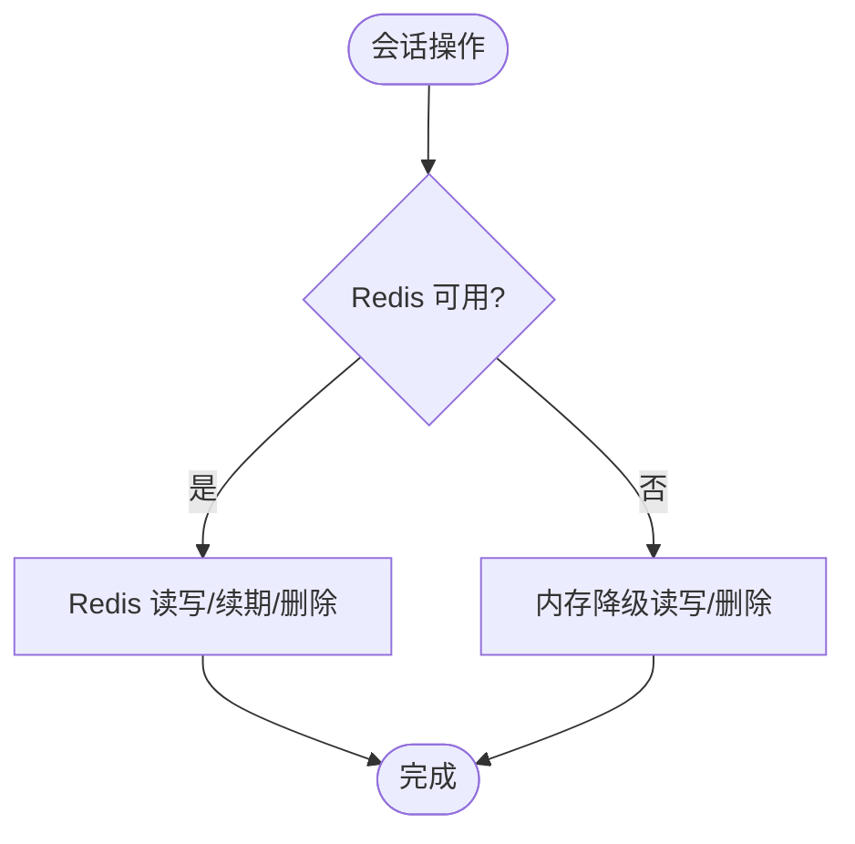
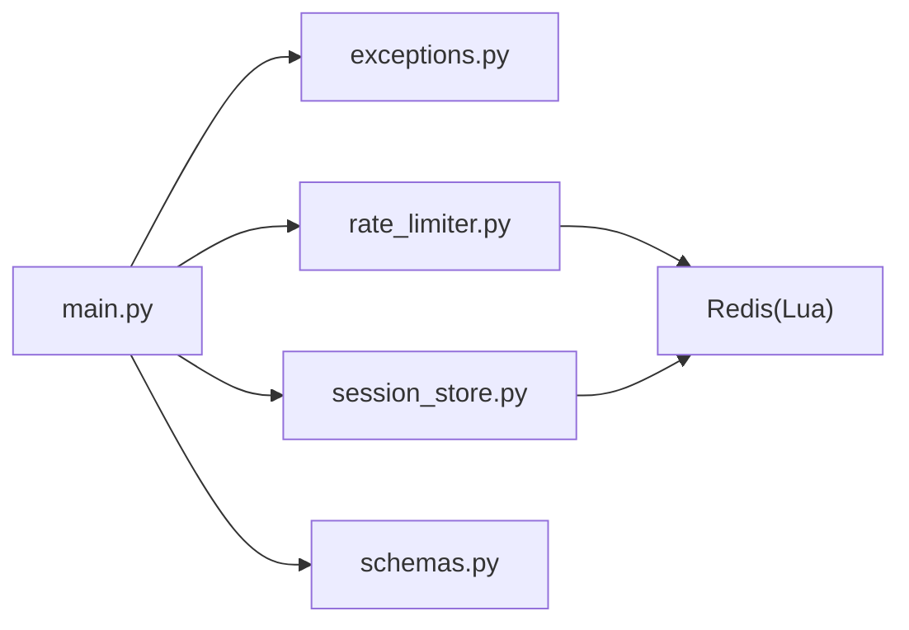

# 异常处理

<cite>
**本文引用的文件**
- [main.py](file://backend_design/nexus/main.py)
- [exceptions.py](file://backend_design/nexus/core/exceptions.py)
- [rate_limiter.py](file://backend_design/nexus/middleware/rate_limiter.py)
- [session_store.py](file://backend_design/nexus/middleware/session_store.py)
- [schemas.py](file://backend_design/nexus/models/schemas.py)
</cite>

## 目录
1. [简介](#简介)
2. [项目结构](#项目结构)
3. [核心组件](#核心组件)
4. [架构总览](#架构总览)
5. [详细组件分析](#详细组件分析)
6. [依赖关系分析](#依赖关系分析)
7. [性能考量](#性能考量)
8. [故障排查指南](#故障排查指南)
9. [结论](#结论)
10. [附录](#附录)

## 简介
本文件系统性梳理 NexusCockpit 的异常处理机制，覆盖全局异常处理器设计、自定义异常类型体系、错误码规范与响应格式标准化；并深入说明异常捕获策略、错误恢复机制、调试信息收集与用户友好的错误提示。文档同时给出异常分类原则、最佳实践与常见异常场景的解决方案，帮助开发者快速定位问题并提升系统健壮性。

## 项目结构
后端采用 FastAPI 作为 Web 框架，通过应用生命周期初始化各子系统，并在应用层集中注册全局异常处理器。自定义异常集中在 core/exceptions.py，限流等中间件在 middleware 下实现，统一响应模型定义于 models/schemas.py。

图表来源
- [main.py:503-596](file://backend_design/nexus/main.py#L503-L596)
- [exceptions.py:19-128](file://backend_design/nexus/core/exceptions.py#L19-L128)
- [rate_limiter.py:117-211](file://backend_design/nexus/middleware/rate_limiter.py#L117-L211)
- [session_store.py:43-114](file://backend_design/nexus/middleware/session_store.py#L43-L114)

章节来源
- [main.py:436-658](file://backend_design/nexus/main.py#L436-L658)
- [exceptions.py:1-128](file://backend_design/nexus/core/exceptions.py#L1-L128)

## 核心组件
- 自定义异常体系：以 NexusError 为基类，派生出配置、LLM、RAG、向量/图谱存储、记忆、技能、意图、车控、缓存、认证、限流、熔断器等专用异常，每个异常携带 code、message、details。
- 全局异常处理器：在 FastAPI 中按异常类型注册处理器，将不同异常映射为合适的 HTTP 状态码，并统一返回 {error, message, details} 的 JSON 结构。
- 中间件与错误恢复：限流器基于 Redis Lua 原子操作实现滑动窗口与令牌桶，超限抛出 RateLimitError；会话存储具备 Redis 不可用时的内存降级。
- 响应模型：Pydantic 模型用于请求/响应校验与文档生成，配合全局处理器保证错误响应一致。

章节来源
- [exceptions.py:19-128](file://backend_design/nexus/core/exceptions.py#L19-L128)
- [main.py:503-596](file://backend_design/nexus/main.py#L503-L596)
- [rate_limiter.py:117-211](file://backend_design/nexus/middleware/rate_limiter.py#L117-L211)
- [session_store.py:43-114](file://backend_design/nexus/middleware/session_store.py#L43-L114)
- [schemas.py:19-88](file://backend_design/nexus/models/schemas.py#L19-L88)

## 架构总览
下图展示从请求进入 FastAPI 到异常被捕获并返回统一响应的完整流程，包括限流、认证、业务异常与兜底异常的处理路径。

图表来源
- [main.py:503-596](file://backend_design/nexus/main.py#L503-L596)
- [rate_limiter.py:204-211](file://backend_design/nexus/middleware/rate_limiter.py#L204-L211)

## 详细组件分析

### 自定义异常类型体系
- 基类 NexusError：统一字段 error_code、message、details，便于前端按 code 分支处理。
- 领域异常：ConfigError、LLMError、RAGError、VectorStoreError、GraphStoreError、MemoryError、SkillError、IntentError、VehicleError、CacheError、AuthError、RateLimitError、CircuitBreakerError。
- 使用建议：在业务层抛出自定义异常，避免直接抛出通用 Exception；details 仅包含必要调试信息，不泄露敏感数据。

图表来源
- [exceptions.py:19-128](file://backend_design/nexus/core/exceptions.py#L19-L128)

章节来源
- [exceptions.py:19-128](file://backend_design/nexus/core/exceptions.py#L19-L128)

### 全局异常处理器与响应格式
- 处理器优先级：RateLimitError → AuthError → NexusError → HTTPException → RequestValidationError → Exception（兜底）。
- 响应格式：统一 JSON 结构 {error, message, details}，其中 error 为错误码，message 为用户可读描述，details 为可选详情。
- 状态码映射：429（限流）、401（认证）、422（参数校验）、500（其他异常），HTTPException 保持原状态码。
- 调试信息：日志记录异常堆栈与关键上下文，对外不暴露内部细节。

图表来源
- [main.py:503-596](file://backend_design/nexus/main.py#L503-L596)

章节来源
- [main.py:503-596](file://backend_design/nexus/main.py#L503-L596)

### 限流与错误恢复
- 滑动窗口与令牌桶：通过 Redis Lua 脚本原子执行，确保并发安全与无污染计数。
- 超限行为：check_or_raise 在超限时抛出 RateLimitError，由全局处理器返回 429。
- 降级策略：Redis 不可用时放行或回退内存模式，保障可用性。

图表来源
- [rate_limiter.py:156-211](file://backend_design/nexus/middleware/rate_limiter.py#L156-L211)

章节来源
- [rate_limiter.py:117-211](file://backend_design/nexus/middleware/rate_limiter.py#L117-L211)

### 会话存储与降级
- 持久化：会话历史与滚动摘要分别存储在 Redis，支持 TTL 自动过期与活跃续期。
- 降级：Redis 不可用时回退到内存 dict，保证服务可用。
- 删除：支持清理短期记忆与滚动摘要，释放资源。

图表来源
- [session_store.py:69-114](file://backend_design/nexus/middleware/session_store.py#L69-L114)
- [session_store.py:152-177](file://backend_design/nexus/middleware/session_store.py#L152-L177)
- [session_store.py:232-289](file://backend_design/nexus/middleware/session_store.py#L232-L289)

章节来源
- [session_store.py:43-114](file://backend_design/nexus/middleware/session_store.py#L43-L114)
- [session_store.py:152-177](file://backend_design/nexus/middleware/session_store.py#L152-L177)
- [session_store.py:232-289](file://backend_design/nexus/middleware/session_store.py#L232-L289)

### 响应模型与校验
- Pydantic 模型：ChatRequest、VoiceRequest、VehicleCommandRequest 等定义请求结构与约束。
- 校验失败：由 RequestValidationError 统一处理，返回 422 与结构化 errors 详情。

章节来源
- [schemas.py:19-88](file://backend_design/nexus/models/schemas.py#L19-L88)
- [main.py:564-579](file://backend_design/nexus/main.py#L564-L579)

## 依赖关系分析
- main.py 导入 exceptions.py 中的自定义异常，并在 create_app 中注册全局处理器。
- rate_limiter.py 与 session_store.py 依赖 Redis，必要时降级到内存。
- schemas.py 提供 Pydantic 模型，供路由与校验使用。

图表来源
- [main.py:503-596](file://backend_design/nexus/main.py#L503-L596)
- [rate_limiter.py:117-211](file://backend_design/nexus/middleware/rate_limiter.py#L117-L211)
- [session_store.py:43-114](file://backend_design/nexus/middleware/session_store.py#L43-L114)

章节来源
- [main.py:503-596](file://backend_design/nexus/main.py#L503-L596)
- [rate_limiter.py:117-211](file://backend_design/nexus/middleware/rate_limiter.py#L117-L211)
- [session_store.py:43-114](file://backend_design/nexus/middleware/session_store.py#L43-L114)

## 性能考量
- 限流算法：Lua 脚本原子执行，减少网络往返与竞态条件，提高吞吐与一致性。
- 降级策略：Redis 不可用时放行或内存降级，避免雪崩效应。
- 日志与指标：中间件注入响应时间与 Prometheus 指标，便于监控与容量规划。
- 启动优化：大模型与外部服务异步预加载，缩短冷启动时间。

[本节为通用指导，不直接分析具体文件]

## 故障排查指南
- 限流触发（429）：检查 Redis 连接与 Lua 脚本加载，确认限流阈值与窗口大小；查看限流日志定位用户与端点。
- 认证失败（401）：核对 Token 有效性、过期时间与鉴权逻辑；关注 WWW-Authenticate 头。
- 参数校验失败（422）：根据 errors 数组定位字段与规则，修正前端传参。
- 业务异常（500）：查看 NexusError 子类与 details，结合日志堆栈定位根因；优先检查外部依赖（LLM、Milvus、Neo4j、Redis）。
- 兜底异常：确认未被自定义异常覆盖的异常路径，补充异常捕获与日志。

章节来源
- [main.py:503-596](file://backend_design/nexus/main.py#L503-L596)
- [rate_limiter.py:193-211](file://backend_design/nexus/middleware/rate_limiter.py#L193-L211)
- [session_store.py:111-114](file://backend_design/nexus/middleware/session_store.py#L111-L114)

## 结论
NexusCockpit 的异常处理机制以统一的自定义异常体系与全局处理器为核心，结合中间件的降级与恢复策略，实现了高内聚、低耦合的错误处理架构。通过标准化的响应格式与清晰的错误码，既提升了可观测性与可维护性，也改善了用户体验。建议在实际开发中遵循异常分类原则与最佳实践，持续完善错误恢复与调试能力。

[本节为总结性内容，不直接分析具体文件]

## 附录

### 错误码与响应格式规范
- 错误码：来源于各自定义异常的 code 字段，如 CONFIG_ERROR、LLM_ERROR、RAG_ERROR、VECTOR_STORE_ERROR、GRAPH_STORE_ERROR、MEMORY_ERROR、SKILL_ERROR、INTENT_ERROR、VEHICLE_ERROR、CACHE_ERROR、AUTH_ERROR、RATE_LIMIT_ERROR、CIRCUIT_BREAKER_ERROR、VALIDATION_ERROR、INTERNAL_ERROR。
- 响应体：{error, message, details}，其中 details 可为空对象或包含结构化信息（如校验 errors）。
- 状态码：429（限流）、401（认证）、422（参数校验）、500（其他异常），HTTPException 保持原状态码。

章节来源
- [exceptions.py:19-128](file://backend_design/nexus/core/exceptions.py#L19-L128)
- [main.py:503-596](file://backend_design/nexus/main.py#L503-L596)

### 异常分类原则与最佳实践
- 分类原则：按领域划分异常类型（配置、LLM、RAG、存储、记忆、技能、意图、车控、缓存、认证、限流、熔断），便于前端与运维快速识别。
- 最佳实践：
  - 在业务层抛出自定义异常，避免裸抛 Exception。
  - details 仅包含必要调试信息，不泄露敏感数据。
  - 对第三方依赖调用增加 try/except 与降级逻辑。
  - 统一日志记录与指标采集，便于追踪与告警。
  - 前端按 error 码分支处理，提供友好提示与重试策略。

[本节为通用指导，不直接分析具体文件]

### 常见异常场景与解决方案
- LLM 调用失败：捕获 LLMError，启用熔断与降级（本地模型或备用 API），记录 trace_id 与耗时。
- 向量/图谱存储不可用：捕获 VectorStoreError/GraphStoreError，降级为内存或跳过检索，继续核心流程。
- 记忆压缩与持久化失败：捕获 MemoryError，回退内存模式，确保对话连续性。
- 车控指令失败：捕获 VehicleError，返回明确错误消息与重试建议。
- 缓存读写失败：捕获 CacheError，降级为直连或忽略缓存，保证功能可用。
- 认证失败：捕获 AuthError，提示重新登录或刷新 Token。
- 限流触发：捕获 RateLimitError，提示稍后重试或升级配额。

章节来源
- [exceptions.py:42-128](file://backend_design/nexus/core/exceptions.py#L42-L128)
- [main.py:503-596](file://backend_design/nexus/main.py#L503-L596)