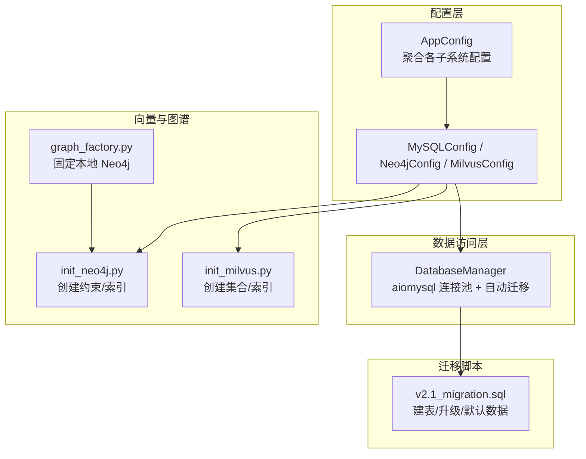
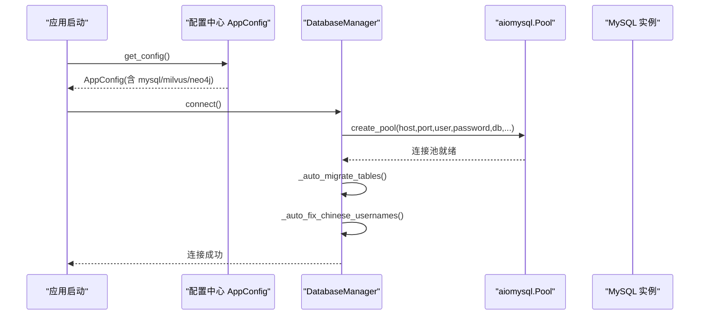
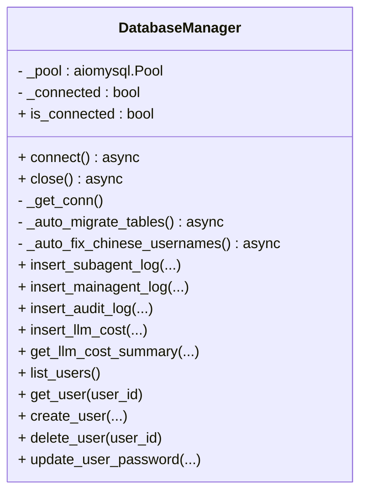
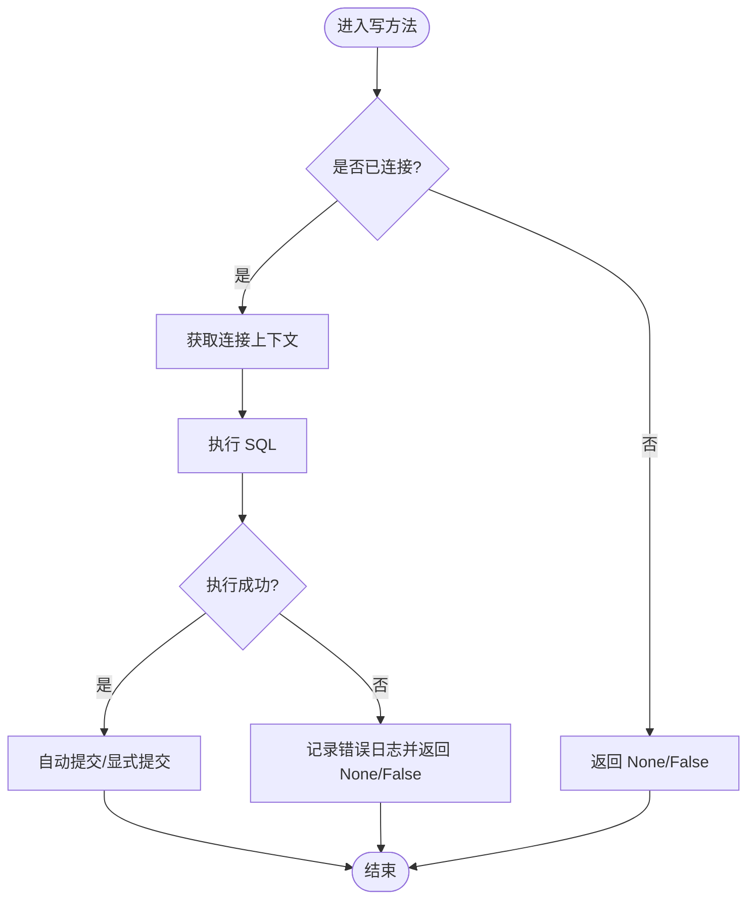
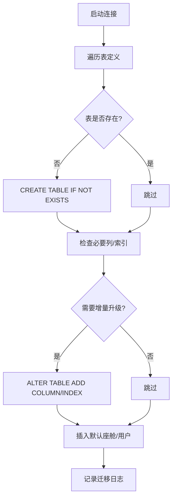
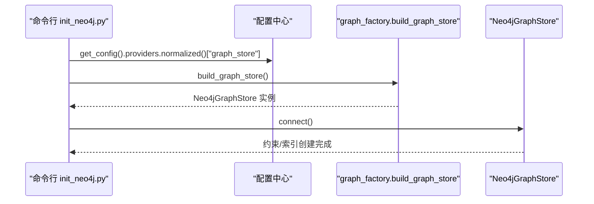
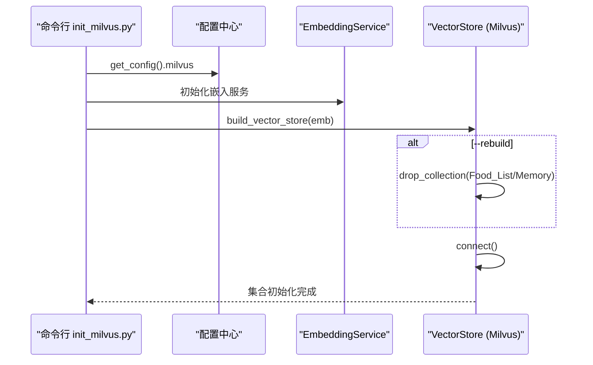
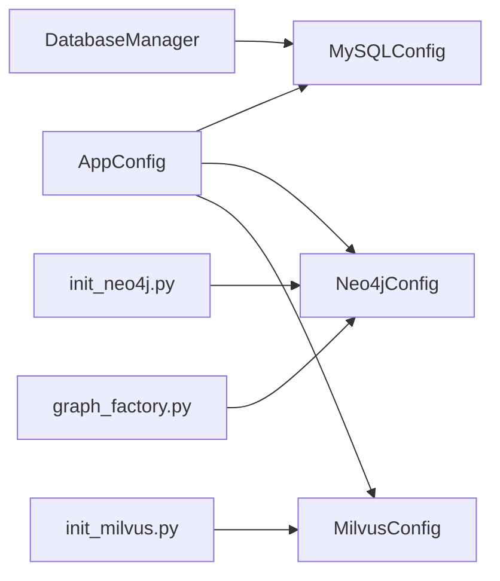

# 数据库管理

<cite>
**本文引用的文件**   
- [backend_design/nexus/config/database.py](file://backend_design/nexus/config/database.py)
- [backend_design/nexus/config/__init__.py](file://backend_design/nexus/config/__init__.py)
- [backend_design/nexus/core/db_manager.py](file://backend_design/nexus/core/db_manager.py)
- [backend_design/scripts/v2.1_migration.sql](file://backend_design/scripts/v2.1_migration.sql)
- [backend_design/scripts/init_milvus.py](file://backend_design/scripts/init_milvus.py)
- [backend_design/scripts/init_neo4j.py](file://backend_design/scripts/init_neo4j.py)
- [backend_design/nexus/rag/graph_factory.py](file://backend_design/nexus/rag/graph_factory.py)
</cite>

## 目录
1. [简介](#简介)
2. [项目结构](#项目结构)
3. [核心组件](#核心组件)
4. [架构总览](#架构总览)
5. [详细组件分析](#详细组件分析)
6. [依赖关系分析](#依赖关系分析)
7. [性能与调优](#性能与调优)
8. [故障排查指南](#故障排查指南)
9. [结论](#结论)
10. [附录：配置与迁移清单](#附录配置与迁移清单)

## 简介
本文件面向 NexusCockpit 的数据库连接管理器，系统性阐述多数据库（MySQL、Neo4j、Milvus）的连接配置、连接池管理、连接生命周期控制、事务与错误恢复机制，以及查询优化、慢查询监控和数据迁移工具的使用方法。文档兼顾技术深度与可读性，帮助开发者与运维人员快速掌握并高效使用。

## 项目结构
与数据库管理相关的代码主要分布在以下位置：
- 配置层：统一配置入口与各子系统配置类（MySQL、Neo4j、Milvus）
- 数据访问层：MySQL 异步连接池与表结构自动迁移、默认数据初始化
- 向量与图谱：Milvus 集合初始化脚本、Neo4j 约束与索引初始化脚本
- 迁移脚本：v2.1 MySQL 迁移脚本，包含建表、安全升级、默认数据插入

图表来源
- [backend_design/nexus/config/__init__.py:84-132](file://backend_design/nexus/config/__init__.py#L84-L132)
- [backend_design/nexus/config/database.py:15-61](file://backend_design/nexus/config/database.py#L15-L61)
- [backend_design/nexus/core/db_manager.py:40-85](file://backend_design/nexus/core/db_manager.py#L40-L85)
- [backend_design/scripts/init_milvus.py:21-49](file://backend_design/scripts/init_milvus.py#L21-L49)
- [backend_design/scripts/init_neo4j.py:18-34](file://backend_design/scripts/init_neo4j.py#L18-L34)
- [backend_design/nexus/rag/graph_factory.py:20-27](file://backend_design/nexus/rag/graph_factory.py#L20-L27)
- [backend_design/scripts/v2.1_migration.sql:10-16](file://backend_design/scripts/v2.1_migration.sql#L10-L16)

章节来源
- [backend_design/nexus/config/__init__.py:84-132](file://backend_design/nexus/config/__init__.py#L84-L132)
- [backend_design/nexus/config/database.py:15-61](file://backend_design/nexus/config/database.py#L15-L61)
- [backend_design/nexus/core/db_manager.py:40-85](file://backend_design/nexus/core/db_manager.py#L40-L85)
- [backend_design/scripts/init_milvus.py:21-49](file://backend_design/scripts/init_milvus.py#L21-L49)
- [backend_design/scripts/init_neo4j.py:18-34](file://backend_design/scripts/init_neo4j.py#L18-L34)
- [backend_design/nexus/rag/graph_factory.py:20-27](file://backend_design/nexus/rag/graph_factory.py#L20-L27)
- [backend_design/scripts/v2.1_migration.sql:10-16](file://backend_design/scripts/v2.1_migration.sql#L10-L16)

## 核心组件
- 配置中心 AppConfig：聚合所有子系统配置，提供全局单例 get_config() 与快捷访问函数
- 数据库配置类：
  - MySQLConfig：MySQL 连接参数与 URL 生成
  - Neo4jConfig：Neo4j 连接参数
  - MilvusConfig：Milvus 向量库连接与索引/搜索参数
- DatabaseManager：基于 aiomysql 的异步连接池封装，负责连接生命周期、自动迁移、默认数据注入、常用 CRUD 操作与日志记录

章节来源
- [backend_design/nexus/config/__init__.py:84-132](file://backend_design/nexus/config/__init__.py#L84-L132)
- [backend_design/nexus/config/database.py:15-61](file://backend_design/nexus/config/database.py#L15-L61)
- [backend_design/nexus/core/db_manager.py:40-85](file://backend_design/nexus/core/db_manager.py#L40-L85)

## 架构总览
NexusCockpit 的数据库访问采用“配置驱动 + 连接池 + 自动迁移”的分层设计：
- 配置层通过 pydantic-settings 从 .env/.env.local 加载环境变量，形成强类型配置对象
- 数据访问层以 DatabaseManager 为中心，使用 aiomysql.create_pool 构建连接池，并在首次连接时执行自动迁移与默认数据初始化
- 向量与图谱通过独立脚本完成集合/索引/约束的初始化，确保运行期稳定可用

图表来源
- [backend_design/nexus/config/__init__.py:144-151](file://backend_design/nexus/config/__init__.py#L144-L151)
- [backend_design/nexus/core/db_manager.py:56-85](file://backend_design/nexus/core/db_manager.py#L56-L85)

## 详细组件分析

### MySQL 连接池与生命周期
- 连接池创建：在 connect() 中调用 aiomysql.create_pool，设置最小/最大连接数、字符集、自动提交等参数
- 连接状态：维护 _connected 标志与 _pool 引用，is_connected 属性用于外部判断
- 生命周期：close() 关闭连接池并等待关闭完成；_get_conn() 作为上下文管理器获取连接
- 自动迁移：_auto_migrate_tables() 确保所有业务表存在，必要时添加列与索引，并插入默认座舱与用户数据
- 中文修复：_auto_fix_chinese_usernames() 将历史中文用户名与座舱名修正为英文，避免编码问题

图表来源
- [backend_design/nexus/core/db_manager.py:40-85](file://backend_design/nexus/core/db_manager.py#L40-L85)
- [backend_design/nexus/core/db_manager.py:86-104](file://backend_design/nexus/core/db_manager.py#L86-L104)
- [backend_design/nexus/core/db_manager.py:359-395](file://backend_design/nexus/core/db_manager.py#L359-L395)

章节来源
- [backend_design/nexus/core/db_manager.py:56-85](file://backend_design/nexus/core/db_manager.py#L56-L85)
- [backend_design/nexus/core/db_manager.py:86-104](file://backend_design/nexus/core/db_manager.py#L86-L104)
- [backend_design/nexus/core/db_manager.py:359-395](file://backend_design/nexus/core/db_manager.py#L359-L395)

### 事务管理与错误恢复
- 事务策略：当前实现采用 autocommit=True 的单语句自动提交模式，适合高并发写入场景；如需跨语句事务，可在 _get_conn() 上下文中手动开启事务并提交/回滚
- 异常处理：每个写操作均捕获异常并记录日志，失败返回 None/False，保证上层调用方不会因底层异常而崩溃
- 幂等与去重：创建用户等操作对重复键冲突进行特殊处理（如 IntegrityError 1062），返回 None 表示已存在或失败

图表来源
- [backend_design/nexus/core/db_manager.py:421-466](file://backend_design/nexus/core/db_manager.py#L421-L466)
- [backend_design/nexus/core/db_manager.py:472-523](file://backend_design/nexus/core/db_manager.py#L472-L523)
- [backend_design/nexus/core/db_manager.py:529-570](file://backend_design/nexus/core/db_manager.py#L529-L570)
- [backend_design/nexus/core/db_manager.py:576-620](file://backend_design/nexus/core/db_manager.py#L576-L620)
- [backend_design/nexus/core/db_manager.py:743-781](file://backend_design/nexus/core/db_manager.py#L743-L781)

章节来源
- [backend_design/nexus/core/db_manager.py:421-466](file://backend_design/nexus/core/db_manager.py#L421-L466)
- [backend_design/nexus/core/db_manager.py:472-523](file://backend_design/nexus/core/db_manager.py#L472-L523)
- [backend_design/nexus/core/db_manager.py:529-570](file://backend_design/nexus/core/db_manager.py#L529-L570)
- [backend_design/nexus/core/db_manager.py:576-620](file://backend_design/nexus/core/db_manager.py#L576-L620)
- [backend_design/nexus/core/db_manager.py:743-781](file://backend_design/nexus/core/db_manager.py#L743-L781)

### 自动迁移与默认数据
- 表结构保障：启动时检查并创建 cockpits、users、chat_history、cockpit_stats、subagent_logs、mainagent_logs、audit_logs、agent_feedback、llm_cost_tracking、voiceprint_enrollments、chat_sessions、user_habits、chat_logs 等表
- 增量升级：对 chat_logs 表动态检测并添加 session_id 列及索引
- 默认数据：插入三个默认座舱与四个默认用户，使用 ON DUPLICATE KEY UPDATE 保证幂等

图表来源
- [backend_design/nexus/core/db_manager.py:86-104](file://backend_design/nexus/core/db_manager.py#L86-L104)
- [backend_design/nexus/core/db_manager.py:301-336](file://backend_design/nexus/core/db_manager.py#L301-L336)
- [backend_design/nexus/core/db_manager.py:337-355](file://backend_design/nexus/core/db_manager.py#L337-L355)

章节来源
- [backend_design/nexus/core/db_manager.py:86-104](file://backend_design/nexus/core/db_manager.py#L86-L104)
- [backend_design/nexus/core/db_manager.py:301-336](file://backend_design/nexus/core/db_manager.py#L301-L336)
- [backend_design/nexus/core/db_manager.py:337-355](file://backend_design/nexus/core/db_manager.py#L337-L355)

### Neo4j 连接与初始化
- 配置：Neo4jConfig 提供 uri、user、password 等字段，支持环境变量覆盖
- 初始化：init_neo4j.py 通过 graph_store.connect() 建立连接，创建约束与索引（如 user_id_unique、entity_name_index）
- 工厂：graph_factory.py 固定返回本地 Neo4j 实例，简化部署与降级路径

图表来源
- [backend_design/nexus/config/database.py:32-39](file://backend_design/nexus/config/database.py#L32-L39)
- [backend_design/scripts/init_neo4j.py:18-34](file://backend_design/scripts/init_neo4j.py#L18-34)
- [backend_design/nexus/rag/graph_factory.py:20-27](file://backend_design/nexus/rag/graph_factory.py#L20-27)

章节来源
- [backend_design/nexus/config/database.py:32-39](file://backend_design/nexus/config/database.py#L32-L39)
- [backend_design/scripts/init_neo4j.py:18-34](file://backend_design/scripts/init_neo4j.py#L18-34)
- [backend_design/nexus/rag/graph_factory.py:20-27](file://backend_design/nexus/rag/graph_factory.py#L20-27)

### Milvus 向量库连接与初始化
- 配置：MilvusConfig 提供 host/port/uri、集合名、索引类型与搜索参数
- 初始化：init_milvus.py 根据配置创建集合（Food_List、User_Memory），支持 --rebuild 重建集合（切换 embedding 维度时）
- 嵌入服务：通过 EmbeddingService 获取维度信息，确保集合与模型一致

图表来源
- [backend_design/nexus/config/database.py:15-29](file://backend_design/nexus/config/database.py#L15-L29)
- [backend_design/scripts/init_milvus.py:21-49](file://backend_design/scripts/init_milvus.py#L21-49)

章节来源
- [backend_design/nexus/config/database.py:15-29](file://backend_design/nexus/config/database.py#L15-L29)
- [backend_design/scripts/init_milvus.py:21-49](file://backend_design/scripts/init_milvus.py#L21-49)

### 数据迁移工具使用方法
- MySQL 迁移脚本 v2.1_migration.sql：
  - 创建数据库与表（IF NOT EXISTS）
  - 安全升级遗留表（存储过程 safe_add_column/safe_add_index）
  - 插入默认数据（ON DUPLICATE KEY UPDATE）
  - 补充聊天日志与会话表，修复中文用户名与座舱名
- 执行方式：mysql -u root -p < v2.1_migration.sql

章节来源
- [backend_design/scripts/v2.1_migration.sql:10-16](file://backend_design/scripts/v2.1_migration.sql#L10-L16)
- [backend_design/scripts/v2.1_migration.sql:185-245](file://backend_design/scripts/v2.1_migration.sql#L185-L245)
- [backend_design/scripts/v2.1_migration.sql:248-267](file://backend_design/scripts/v2.1_migration.sql#L248-L267)
- [backend_design/scripts/v2.1_migration.sql:270-315](file://backend_design/scripts/v2.1_migration.sql#L270-L315)
- [backend_design/scripts/v2.1_migration.sql:317-386](file://backend_design/scripts/v2.1_migration.sql#L317-L386)

## 依赖关系分析
- 配置中心 AppConfig 聚合 MySQLConfig、Neo4jConfig、MilvusConfig，并通过 lru_cache 提供全局单例
- DatabaseManager 依赖 aiomysql 驱动与 AppConfig.mysql 配置
- 初始化脚本依赖各自 provider 的构建器（vector_factory、graph_factory）

图表来源
- [backend_design/nexus/config/__init__.py:84-132](file://backend_design/nexus/config/__init__.py#L84-L132)
- [backend_design/nexus/config/database.py:15-61](file://backend_design/nexus/config/database.py#L15-L61)
- [backend_design/nexus/core/db_manager.py:56-85](file://backend_design/nexus/core/db_manager.py#L56-L85)
- [backend_design/scripts/init_milvus.py:21-49](file://backend_design/scripts/init_milvus.py#L21-49)
- [backend_design/scripts/init_neo4j.py:18-34](file://backend_design/scripts/init_neo4j.py#L18-34)
- [backend_design/nexus/rag/graph_factory.py:20-27](file://backend_design/nexus/rag/graph_factory.py#L20-27)

章节来源
- [backend_design/nexus/config/__init__.py:84-132](file://backend_design/nexus/config/__init__.py#L84-L132)
- [backend_design/nexus/config/database.py:15-61](file://backend_design/nexus/config/database.py#L15-L61)
- [backend_design/nexus/core/db_manager.py:56-85](file://backend_design/nexus/core/db_manager.py#L56-L85)
- [backend_design/scripts/init_milvus.py:21-49](file://backend_design/scripts/init_milvus.py#L21-49)
- [backend_design/scripts/init_neo4j.py:18-34](file://backend_design/scripts/init_neo4j.py#L18-34)
- [backend_design/nexus/rag/graph_factory.py:20-27](file://backend_design/nexus/rag/graph_factory.py#L20-27)

## 性能与调优
- 连接池参数
  - minsize/maxsize：建议根据并发量与数据库资源调整，默认 minsize=2、maxsize=10
  - charset=utf8mb4：确保全量 Unicode 支持
  - autocommit=True：减少事务开销，提升写入吞吐
- 索引与查询优化
  - 按时间范围查询的复合索引（如 idx_cockpit_time、idx_user_time）
  - 会话相关索引（idx_session）提升关联查询效率
  - JSON 字段仅做条件过滤时注意成本，必要时拆分字段或引入冗余列
- 慢查询监控
  - 建议在 MySQL 侧开启 slow_query_log，结合 Prometheus/Grafana 采集指标
  - 对高频统计接口（如 LLM 成本汇总）增加缓存或物化视图
- 向量与图谱
  - Milvus：合理设置 HNSW 的 M、efConstruction、ef 参数，平衡召回率与延迟
  - Neo4j：确保唯一约束与名称索引，避免全图扫描

[本节为通用指导，不直接分析具体文件]

## 故障排查指南
- 连接失败
  - 检查 MySQL/Neo4j/Milvus 配置项（host/port/user/password）
  - 确认网络连通性与防火墙规则
  - 查看日志输出中的连接失败信息与堆栈
- 迁移失败
  - 检查 v2.1_migration.sql 的执行权限与字符集设置
  - 若表已存在但结构不一致，可先备份后重新执行脚本
- 中文乱码
  - 确认数据库与连接字符集均为 utf8mb4
  - 使用 _auto_fix_chinese_usernames() 或迁移脚本修复历史数据
- 重复键冲突
  - 创建用户等操作遇到 1062 错误属预期行为，返回 None 表示已存在

章节来源
- [backend_design/nexus/core/db_manager.py:82-84](file://backend_design/nexus/core/db_manager.py#L82-L84)
- [backend_design/nexus/core/db_manager.py:356-357](file://backend_design/nexus/core/db_manager.py#L356-L357)
- [backend_design/nexus/core/db_manager.py:394-395](file://backend_design/nexus/core/db_manager.py#L394-L395)
- [backend_design/nexus/core/db_manager.py:774-781](file://backend_design/nexus/core/db_manager.py#L774-L781)

## 结论
NexusCockpit 的数据库管理模块以配置驱动为核心，结合异步连接池与自动迁移机制，实现了 MySQL、Neo4j、Milvus 的统一接入与稳定运行。通过合理的连接池参数、索引设计与迁移脚本，系统在高并发与多租户场景下具备良好的可扩展性与可维护性。建议在生产环境完善慢查询监控与容量规划，持续优化查询与索引策略。

[本节为总结性内容，不直接分析具体文件]

## 附录：配置与迁移清单
- MySQL 配置项（示例）
  - MYSQL_HOST、MYSQL_PORT、MYSQL_USER、MYSQL_PASSWORD、MYSQL_DATABASE
- Neo4j 配置项（示例）
  - NEO4J_URI、NEO4J_USER、NEO4J_PASSWORD
- Milvus 配置项（示例）
  - MILVUS_HOST、MILVUS_PORT、MILVUS_URI、MILVUS_COLLECTION_FOOD、MILVUS_COLLECTION_MEMORY
- 初始化命令
  - 向量库：python -m scripts.init_milvus [--rebuild]
  - 图谱库：python -m scripts.init_neo4j
- MySQL 迁移
  - mysql -u root -p < backend_design/scripts/v2.1_migration.sql

章节来源
- [backend_design/nexus/config/database.py:15-61](file://backend_design/nexus/config/database.py#L15-L61)
- [backend_design/scripts/init_milvus.py:21-49](file://backend_design/scripts/init_milvus.py#L21-49)
- [backend_design/scripts/init_neo4j.py:18-34](file://backend_design/scripts/init_neo4j.py#L18-34)
- [backend_design/scripts/v2.1_migration.sql:10-16](file://backend_design/scripts/v2.1_migration.sql#L10-L16)