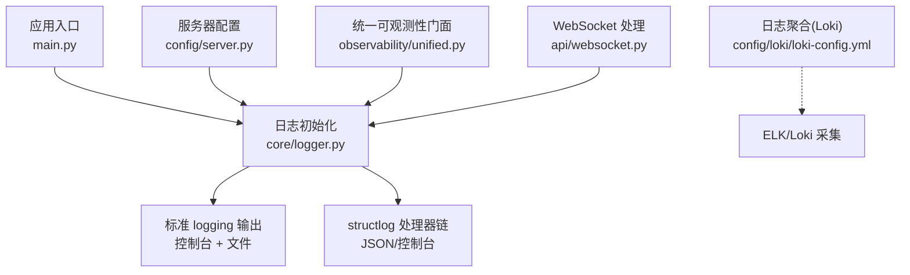
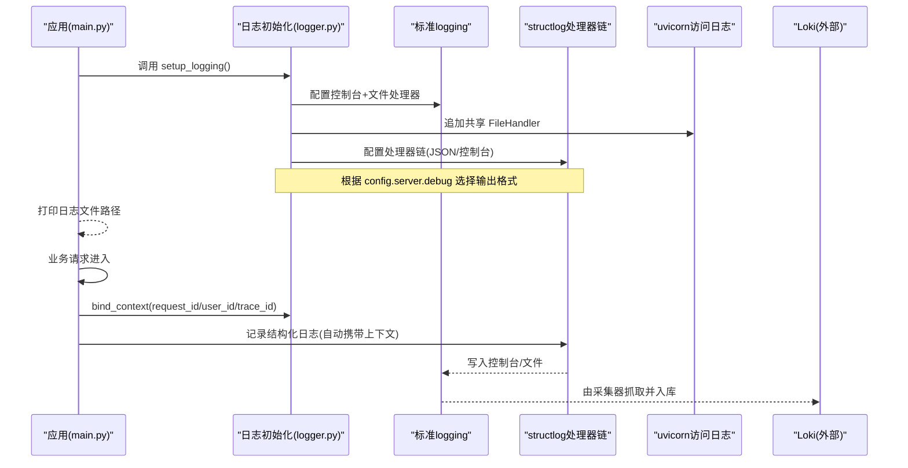
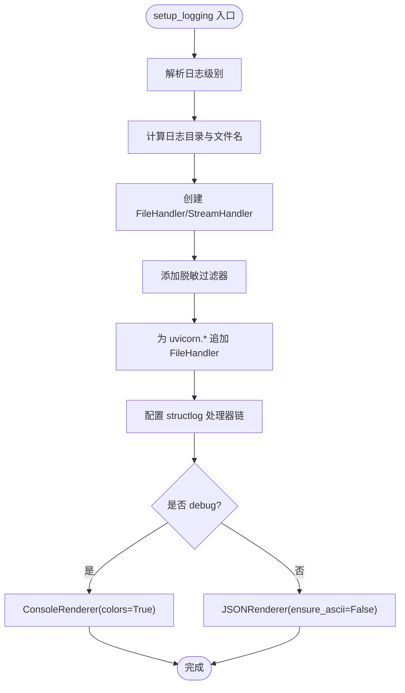
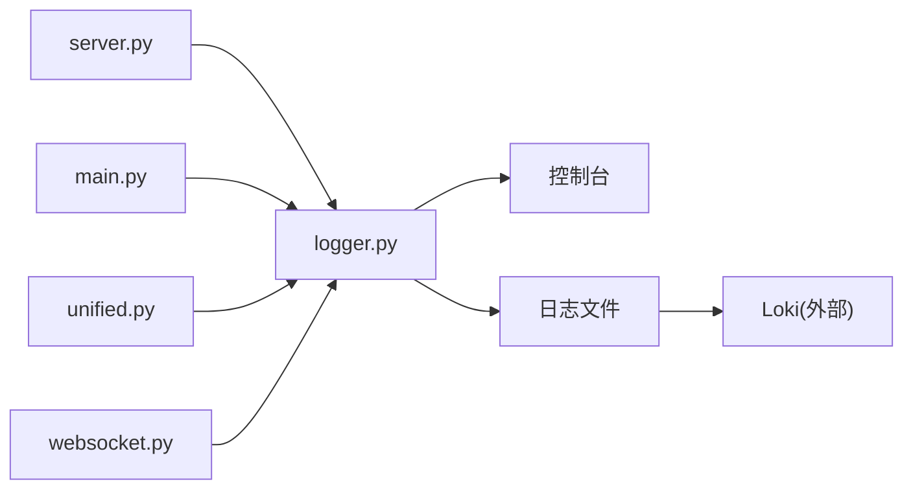

# 日志系统

<cite>
**本文引用的文件**   
- [backend_design/nexus/core/logger.py](file://backend_design/nexus/core/logger.py)
- [backend_design/nexus/main.py](file://backend_design/nexus/main.py)
- [backend_design/nexus/config/server.py](file://backend_design/nexus/config/server.py)
- [backend_design/nexus/config/_common.py](file://backend_design/nexus/config/_common.py)
- [backend_design/nexus/observability/unified.py](file://backend_design/nexus/observability/unified.py)
- [backend_design/nexus/api/websocket.py](file://backend_design/nexus/api/websocket.py)
- [config/loki/loki-config.yml](file://config/loki/loki-config.yml)
</cite>

## 目录
1. [简介](#简介)
2. [项目结构](#项目结构)
3. [核心组件](#核心组件)
4. [架构总览](#架构总览)
5. [详细组件分析](#详细组件分析)
6. [依赖关系分析](#依赖关系分析)
7. [性能考量](#性能考量)
8. [故障排查指南](#故障排查指南)
9. [结论](#结论)
10. [附录](#附录)

## 简介
本文件为 NexusCockpit 的日志系统提供系统化、可操作的文档。内容覆盖结构化日志框架的实现与使用，包括：
- 日志格式定义（开发彩色控制台 vs 生产 JSON）
- 分级控制机制（基于配置的全局级别与第三方库降噪）
- 多输出目标支持（控制台与文件；远程通过 Loki 采集）
- 上下文信息注入（request_id、user_id、trace_id 等）
- 敏感数据脱敏策略（API Key、JWT Token、密码等）
- 性能优化策略（处理器链、缓存、异步化建议）
- 日志配置选项、自定义格式化器、异步日志处理与轮转机制的建议
- 日志收集、分析与监控的最佳实践（Loki + Grafana/Prometheus）

## 项目结构
日志相关代码集中在后端 core 层与入口启动流程中，并通过统一可观测性门面与外部日志聚合服务对接。

图表来源
- [backend_design/nexus/main.py:75-100](file://backend_design/nexus/main.py#L75-L100)
- [backend_design/nexus/core/logger.py:83-202](file://backend_design/nexus/core/logger.py#L83-L202)
- [backend_design/nexus/config/server.py:15-34](file://backend_design/nexus/config/server.py#L15-L34)
- [backend_design/nexus/observability/unified.py:150-196](file://backend_design/nexus/observability/unified.py#L150-L196)
- [backend_design/nexus/api/websocket.py:90-120](file://backend_design/nexus/api/websocket.py#L90-L120)
- [config/loki/loki-config.yml:1-56](file://config/loki/loki-config.yml#L1-L56)

章节来源
- [backend_design/nexus/main.py:75-100](file://backend_design/nexus/main.py#L75-L100)
- [backend_design/nexus/core/logger.py:83-202](file://backend_design/nexus/core/logger.py#L83-L202)
- [backend_design/nexus/config/server.py:15-34](file://backend_design/nexus/config/server.py#L15-L34)
- [backend_design/nexus/config/_common.py:20-53](file://backend_design/nexus/config/_common.py#L20-L53)
- [backend_design/nexus/observability/unified.py:150-196](file://backend_design/nexus/observability/unified.py#L150-L196)
- [backend_design/nexus/api/websocket.py:90-120](file://backend_design/nexus/api/websocket.py#L90-L120)
- [config/loki/loki-config.yml:1-56](file://config/loki/loki-config.yml#L1-L56)

## 核心组件
- 结构化日志模块（core/logger.py）
  - 基于 structlog 构建 JSON 结构化日志，开发环境切换为彩色控制台输出
  - 内置敏感字段脱敏处理器与标准 logging 过滤器
  - 自动为 uvicorn 访问日志附加文件输出，避免被覆盖
  - 暴露 get_logger、bind_context、clear_context、get_log_file_path 等接口
- 应用入口（main.py）
  - 在 lifespan 阶段调用 setup_logging() 完成日志初始化
  - 打印当前日志文件路径，便于定位
- 服务器配置（config/server.py）
  - 提供 log_level、debug 等关键开关，驱动日志级别与输出格式
- 统一可观测性门面（observability/unified.py）
  - 封装 bind/clear 上下文操作，并桥接 Langfuse 追踪
- WebSocket 处理（api/websocket.py）
  - 在连接建立时绑定 client_id，断开时清理上下文，确保链路隔离
- Loki 配置（config/loki/loki-config.yml）
  - 定义本地 Loki 单实例配置，用于日志采集与保留策略

章节来源
- [backend_design/nexus/core/logger.py:83-202](file://backend_design/nexus/core/logger.py#L83-L202)
- [backend_design/nexus/main.py:85-100](file://backend_design/nexus/main.py#L85-L100)
- [backend_design/nexus/config/server.py:15-34](file://backend_design/nexus/config/server.py#L15-L34)
- [backend_design/nexus/observability/unified.py:150-196](file://backend_design/nexus/observability/unified.py#L150-L196)
- [backend_design/nexus/api/websocket.py:90-120](file://backend_design/nexus/api/websocket.py#L90-L120)
- [config/loki/loki-config.yml:1-56](file://config/loki/loki-config.yml#L1-L56)

## 架构总览
下图展示从应用启动到日志输出的整体流程，以及上下文注入与脱敏的关键环节。

图表来源
- [backend_design/nexus/main.py:85-100](file://backend_design/nexus/main.py#L85-L100)
- [backend_design/nexus/core/logger.py:83-202](file://backend_design/nexus/core/logger.py#L83-L202)
- [config/loki/loki-config.yml:1-56](file://config/loki/loki-config.yml#L1-L56)

## 详细组件分析

### 结构化日志模块（core/logger.py）
- 功能要点
  - 全局日志级别解析：将字符串级别映射为标准 logging 常量
  - 文件与控制台双输出：统一编码 UTF-8，时间戳与级别清晰
  - 第三方库降噪：对 redis、neo4j、aiosqlite、openai、httpcore、python_multipart 等设置更高等级，减少噪音
  - uvicorn 访问日志增强：显式追加 FileHandler，避免被 dictConfig 覆盖
  - structlog 处理器链：合并上下文、添加级别、时间戳、堆栈、异常、脱敏、最终渲染为 JSON 或彩色控制台
  - 敏感数据脱敏：键名匹配（api_key、secret、token、password 等）与值匹配（Bearer token、长密钥串）
  - 上下文管理：bind_context/clear_context 基于 contextvars，保证并发安全
  - 日志文件路径导出：供启动阶段打印与运维查看

- 关键实现要点（概念说明）
  - 处理器链顺序决定最终输出形态，JSON 渲染前必须完成脱敏
  - wrapper_class 使用过滤 BoundLogger，按全局级别裁剪日志
  - cache_logger_on_first_use 提升首次获取后的性能

图表来源
- [backend_design/nexus/core/logger.py:83-202](file://backend_design/nexus/core/logger.py#L83-L202)

章节来源
- [backend_design/nexus/core/logger.py:33-81](file://backend_design/nexus/core/logger.py#L33-L81)
- [backend_design/nexus/core/logger.py:83-202](file://backend_design/nexus/core/logger.py#L83-L202)
- [backend_design/nexus/core/logger.py:205-249](file://backend_design/nexus/core/logger.py#L205-L249)

### 应用入口与生命周期（main.py）
- 在 lifespan 阶段执行日志初始化与指标初始化
- 读取并打印当前日志文件路径，便于快速定位
- 其他组件初始化（向量存储、图谱、车控适配器、缓存、限流、会话、Langfuse 等）与日志无关，但会在运行期产生大量日志

章节来源
- [backend_design/nexus/main.py:75-100](file://backend_design/nexus/main.py#L75-L100)

### 服务器配置（config/server.py）
- 关键配置项
  - host/port：监听地址与端口
  - debug：控制日志输出格式（开发彩色控制台 vs 生产 JSON）
  - log_level：日志级别（如 INFO、DEBUG、WARNING、ERROR）
  - cors_origins/session_locks_max/sse_heartbeat_interval：与日志无直接关系，但影响运行时行为

章节来源
- [backend_design/nexus/config/server.py:15-34](file://backend_design/nexus/config/server.py#L15-L34)

### 统一可观测性门面（observability/unified.py）
- 提供统一的日志上下文绑定与清理接口（bind/clear），内部委托 logger 模块
- 集成 Langfuse 追踪，自动将 trace_id 注入日志上下文
- 提供多种指标记录方法（HTTP、Agent、Skill、LLM、RAG、Cache）

章节来源
- [backend_design/nexus/observability/unified.py:150-196](file://backend_design/nexus/observability/unified.py#L150-L196)
- [backend_design/nexus/observability/unified.py:213-248](file://backend_design/nexus/observability/unified.py#L213-L248)

### WebSocket 上下文注入示例（api/websocket.py）
- 连接建立后绑定 client_id，后续所有日志自动携带该标识
- 心跳任务与消息处理过程中记录关键事件
- 连接关闭或异常时清理上下文，防止泄漏

章节来源
- [backend_design/nexus/api/websocket.py:90-120](file://backend_design/nexus/api/websocket.py#L90-L120)
- [backend_design/nexus/api/websocket.py:190-209](file://backend_design/nexus/api/websocket.py#L190-L209)

### Loki 日志聚合（config/loki/loki-config.yml）
- 单机模式配置，HTTP/gRPC 端口、存储路径、索引周期、保留策略等
- 查询结果缓存启用，提升查询性能
- 关闭匿名统计上报

章节来源
- [config/loki/loki-config.yml:1-56](file://config/loki/loki-config.yml#L1-L56)

## 依赖关系分析
- logger.py 依赖 server 配置以决定输出格式与级别
- main.py 在启动时调用 logger.setup_logging()
- unified.py 通过 logger 提供的 bind/clear 进行上下文管理
- websocket.py 在连接生命周期内使用 bind/clear 维护上下文
- Loki 作为外部系统，负责日志采集与持久化

图表来源
- [backend_design/nexus/config/server.py:15-34](file://backend_design/nexus/config/server.py#L15-L34)
- [backend_design/nexus/core/logger.py:83-202](file://backend_design/nexus/core/logger.py#L83-L202)
- [backend_design/nexus/main.py:85-100](file://backend_design/nexus/main.py#L85-L100)
- [backend_design/nexus/observability/unified.py:150-196](file://backend_design/nexus/observability/unified.py#L150-L196)
- [backend_design/nexus/api/websocket.py:90-120](file://backend_design/nexus/api/websocket.py#L90-L120)
- [config/loki/loki-config.yml:1-56](file://config/loki/loki-config.yml#L1-L56)

章节来源
- [backend_design/nexus/config/server.py:15-34](file://backend_design/nexus/config/server.py#L15-L34)
- [backend_design/nexus/core/logger.py:83-202](file://backend_design/nexus/core/logger.py#L83-L202)
- [backend_design/nexus/main.py:85-100](file://backend_design/nexus/main.py#L85-L100)
- [backend_design/nexus/observability/unified.py:150-196](file://backend_design/nexus/observability/unified.py#L150-L196)
- [backend_design/nexus/api/websocket.py:90-120](file://backend_design/nexus/api/websocket.py#L90-L120)
- [config/loki/loki-config.yml:1-56](file://config/loki/loki-config.yml#L1-L56)

## 性能考量
- 处理器链优化
  - 使用 structlog.contextvars.merge_contextvars 合并上下文，避免重复拼接
  - 使用 TimeStamper 与 StackInfoRenderer 仅在需要时开启（默认已启用）
  - 使用 format_exc_info 仅在异常路径生效
  - JSONRenderer 在生产环境启用，确保下游采集高效解析
- 缓存与复用
  - cache_logger_on_first_use 加速首次之后的日志器获取
  - 共享 FileHandler 避免重复打开文件句柄
- 第三方库降噪
  - 降低 redis、neo4j、aiosqlite、openai、httpcore、python_multipart 的日志级别，显著减少 I/O 与 CPU 开销
- 异步与批量化建议
  - 当前实现为同步写入文件与 stdout，高吞吐场景建议引入异步队列（如 asyncio.Queue）+ 批量落盘
  - 可考虑使用 aiofiles 或专用异步日志库（如 aiologger）以降低阻塞
- 日志轮转建议
  - 当前按启动时间生成单一文件，未实现自动轮转
  - 推荐引入 RotatingFileHandler 或 TimedRotatingFileHandler，按大小/时间切分，配合压缩归档

[本节为通用指导，不直接分析具体文件]

## 故障排查指南
- 无法找到日志文件
  - 确认 setup_logging() 已在应用启动阶段调用
  - 检查日志目录是否存在且具备写权限
  - 通过 get_log_file_path() 获取实际路径
- 日志级别不符合预期
  - 检查 config.server.log_level 与 config.server.debug
  - 确认第三方库日志级别已被降级（redis、neo4j、openai 等）
- 敏感信息泄露
  - 确认 sanitize_log_processor 与 SensitiveDataFilter 已启用
  - 检查是否在业务代码中直接拼接了敏感字段到 msg
- 上下文泄漏
  - 确保在请求/连接结束时调用 clear_context()
  - WebSocket 场景中应在 finally 分支清理
- 访问日志未写入文件
  - 确认 uvicorn.* 日志器已追加共享 FileHandler
  - 避免在中间件或框架配置中覆盖 handlers

章节来源
- [backend_design/nexus/core/logger.py:83-202](file://backend_design/nexus/core/logger.py#L83-L202)
- [backend_design/nexus/core/logger.py:205-249](file://backend_design/nexus/core/logger.py#L205-L249)
- [backend_design/nexus/api/websocket.py:190-209](file://backend_design/nexus/api/websocket.py#L190-L209)

## 结论
NexusCockpit 的日志系统以 structlog 为核心，结合标准 logging 实现开发与生产环境的差异化输出，并通过上下文注入与敏感数据脱敏保障可观测性与安全性。配合 Loki 可实现集中采集与分析。建议在高性能场景下引入异步日志与轮转机制，进一步提升稳定性与可维护性。

[本节为总结性内容，不直接分析具体文件]

## 附录

### 日志配置选项速查
- 服务器配置（config/server.py）
  - host：监听地址
  - port：监听端口
  - debug：是否开发模式（影响日志输出格式）
  - log_level：日志级别（INFO/DEBUG/WARNING/ERROR）
  - cors_origins：CORS 允许来源
  - session_locks_max：会话锁上限
  - sse_heartbeat_interval：SSE 心跳间隔
- 环境变量加载（config/_common.py）
  - .env.local 优先于 .env，支持覆盖默认配置
  - 提供 _resolve_path 工具函数统一路径解析

章节来源
- [backend_design/nexus/config/server.py:15-34](file://backend_design/nexus/config/server.py#L15-L34)
- [backend_design/nexus/config/_common.py:20-53](file://backend_design/nexus/config/_common.py#L20-L53)

### 最佳实践清单
- 结构化日志
  - 始终使用结构化字段而非拼接字符串
  - 在关键路径记录必要上下文（request_id、user_id、session_id、trace_id）
- 安全合规
  - 禁止在日志中输出明文敏感信息
  - 使用内置脱敏处理器，必要时自定义规则
- 性能优化
  - 合理设置日志级别，避免 DEBUG 在生产环境开启
  - 使用异步与批量化写入，减少 I/O 阻塞
- 采集与监控
  - 使用 Loki 统一采集，Grafana 可视化
  - 结合 Prometheus 指标（请求量、延迟、命中率等）联动分析

[本节为通用指导，不直接分析具体文件]