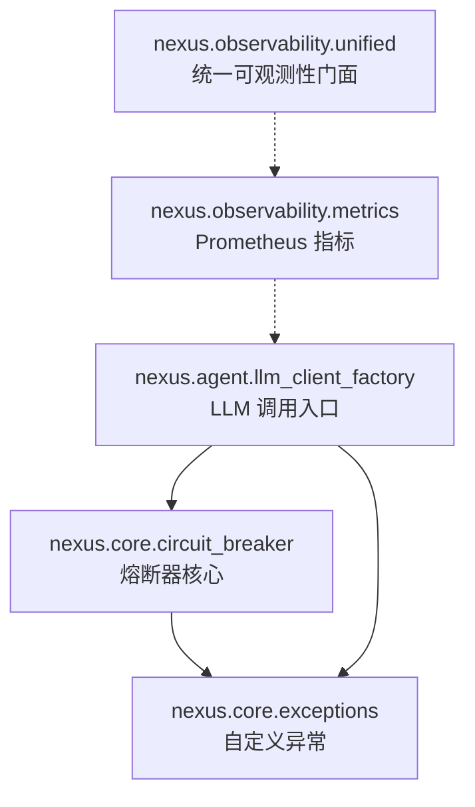
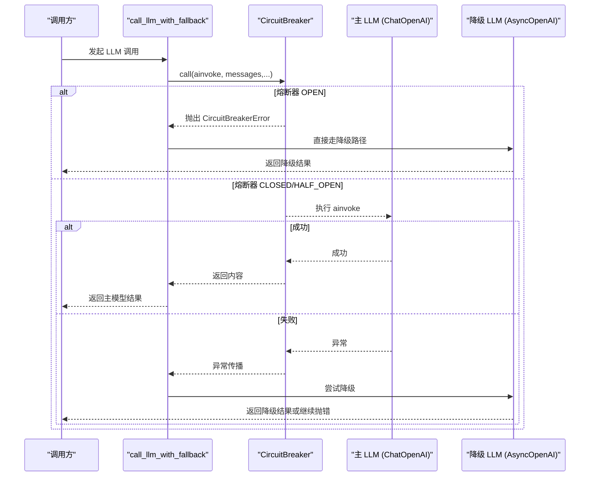
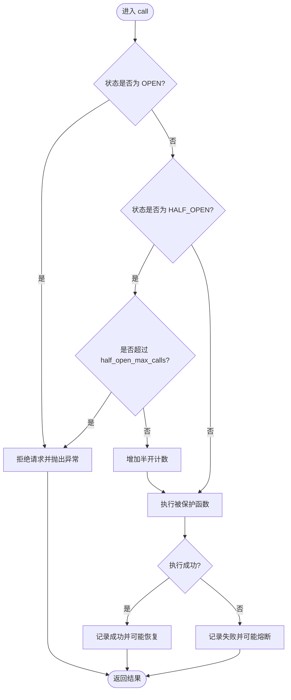
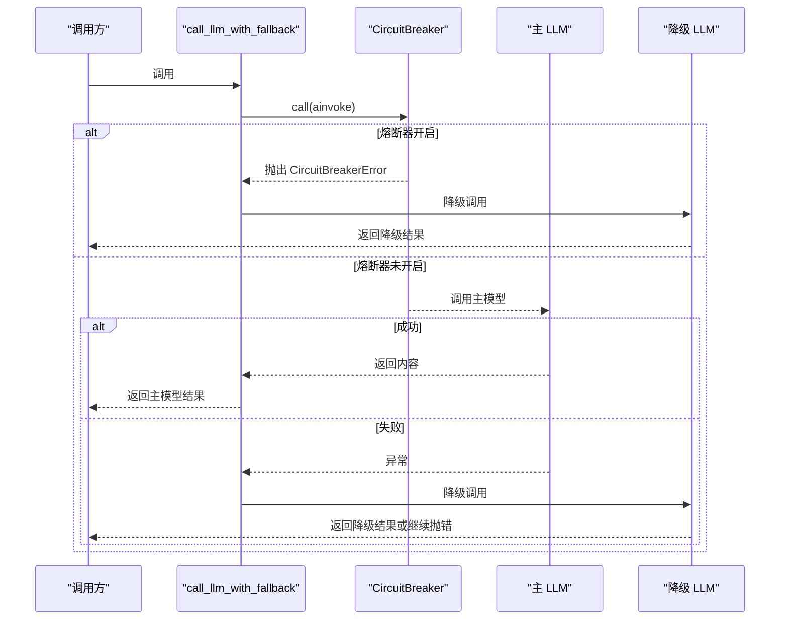
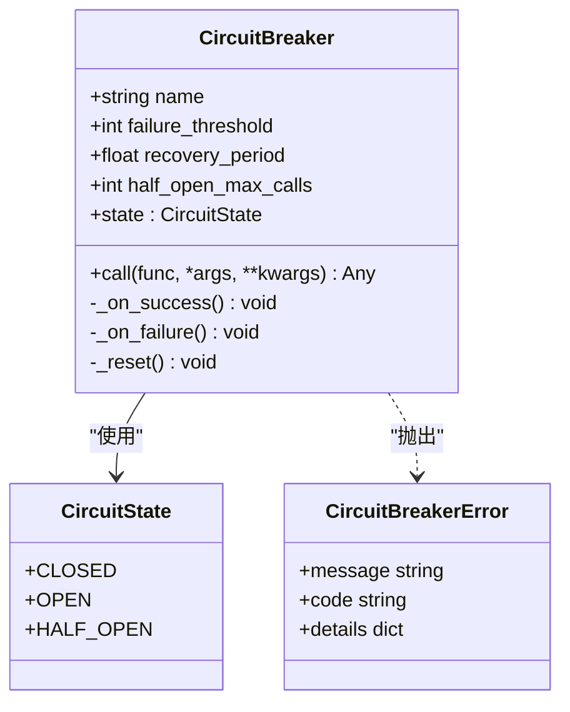

# 熔断器

<cite>
**本文引用的文件**
- [backend_design/nexus/core/circuit_breaker.py](file://backend_design/nexus/core/circuit_breaker.py)
- [backend_design/nexus/core/exceptions.py](file://backend_design/nexus/core/exceptions.py)
- [backend_design/nexus/agent/llm_client_factory.py](file://backend_design/nexus/agent/llm_client_factory.py)
- [backend_design/nexus/observability/metrics.py](file://backend_design/nexus/observability/metrics.py)
- [backend_design/nexus/observability/unified.py](file://backend_design/nexus/observability/unified.py)
</cite>

## 目录
1. [简介](#简介)
2. [项目结构](#项目结构)
3. [核心组件](#核心组件)
4. [架构总览](#架构总览)
5. [详细组件分析](#详细组件分析)
6. [依赖关系分析](#依赖关系分析)
7. [性能考量](#性能考量)
8. [故障排查指南](#故障排查指南)
9. [结论](#结论)
10. [附录](#附录)

## 简介
本文件为 NexusCockpit 的熔断器模式实现提供系统化文档。内容涵盖状态机设计（关闭、打开、半开）、故障检测机制、自动恢复策略与降级处理逻辑；同时给出配置参数说明、监控指标收集、统计信息维护与性能影响分析，并总结使用场景、最佳实践与故障排查方法。

## 项目结构
与熔断器相关的代码主要分布在以下模块：
- 核心实现：circuit_breaker.py
- 异常定义：exceptions.py
- 集成使用：llm_client_factory.py（LLM 调用入口）
- 可观测性：metrics.py、unified.py（指标与统一门面）

图表来源
- [backend_design/nexus/core/circuit_breaker.py:48-177](file://backend_design/nexus/core/circuit_breaker.py#L48-L177)
- [backend_design/nexus/core/exceptions.py:119-128](file://backend_design/nexus/core/exceptions.py#L119-L128)
- [backend_design/nexus/agent/llm_client_factory.py:39-56](file://backend_design/nexus/agent/llm_client_factory.py#L39-L56)
- [backend_design/nexus/observability/metrics.py:1-108](file://backend_design/nexus/observability/metrics.py#L1-L108)
- [backend_design/nexus/observability/unified.py:1-269](file://backend_design/nexus/observability/unified.py#L1-L269)

章节来源
- [backend_design/nexus/core/circuit_breaker.py:1-177](file://backend_design/nexus/core/circuit_breaker.py#L1-L177)
- [backend_design/nexus/core/exceptions.py:1-128](file://backend_design/nexus/core/exceptions.py#L1-L128)
- [backend_design/nexus/agent/llm_client_factory.py:1-207](file://backend_design/nexus/agent/llm_client_factory.py#L1-L207)
- [backend_design/nexus/observability/metrics.py:1-108](file://backend_design/nexus/observability/metrics.py#L1-L108)
- [backend_design/nexus/observability/unified.py:1-269](file://backend_design/nexus/observability/unified.py#L1-L269)

## 核心组件
- CircuitState：熔断器状态枚举（CLOSED、OPEN、HALF_OPEN）。
- CircuitBreaker：异步熔断器实现，包含状态转换、失败计数、恢复期控制、半开并发限制等。
- CircuitBreakerError：熔断器相关异常类型，用于在 OPEN/HALF_OPEN 状态下拒绝请求并触发上层降级。

关键职责
- CLOSED：正常放行请求，累计连续失败次数。
- OPEN：拒绝所有请求，等待 recovery_period 后进入 HALF_OPEN。
- HALF_OPEN：限制并发试探请求数，成功则恢复到 CLOSED，失败则回到 OPEN。

章节来源
- [backend_design/nexus/core/circuit_breaker.py:34-46](file://backend_design/nexus/core/circuit_breaker.py#L34-L46)
- [backend_design/nexus/core/circuit_breaker.py:48-177](file://backend_design/nexus/core/circuit_breaker.py#L48-L177)
- [backend_design/nexus/core/exceptions.py:119-128](file://backend_design/nexus/core/exceptions.py#L119-L128)

## 架构总览
熔断器在 LLM 调用链路中作为保护门控，结合降级策略形成高可用调用路径。

图表来源
- [backend_design/nexus/agent/llm_client_factory.py:149-207](file://backend_design/nexus/agent/llm_client_factory.py#L149-L207)
- [backend_design/nexus/core/circuit_breaker.py:97-134](file://backend_design/nexus/core/circuit_breaker.py#L97-L134)
- [backend_design/nexus/core/exceptions.py:119-128](file://backend_design/nexus/core/exceptions.py#L119-L128)

## 详细组件分析

### 熔断器状态机与算法流程
- 状态转换规则：
  - CLOSED → OPEN：连续失败次数达到 failure_threshold。
  - OPEN → HALF_OPEN：经过 recovery_period 后自动切换。
  - HALF_OPEN → CLOSED：试探请求成功即恢复。
  - HALF_OPEN → OPEN：试探请求失败则重新熔断。
- 半开并发限制：half_open_max_calls 控制试探请求数量，避免雪崩。
- 时间控制：使用单调时钟 time.monotonic() 计算恢复期。

图表来源
- [backend_design/nexus/core/circuit_breaker.py:97-177](file://backend_design/nexus/core/circuit_breaker.py#L97-L177)

章节来源
- [backend_design/nexus/core/circuit_breaker.py:83-96](file://backend_design/nexus/core/circuit_breaker.py#L83-L96)
- [backend_design/nexus/core/circuit_breaker.py:135-171](file://backend_design/nexus/core/circuit_breaker.py#L135-L171)

### 故障检测与自动恢复
- 故障检测：每次调用失败时递增 _failure_count，并更新 _last_failure_time。
- 自动恢复：OPEN 状态下，若当前时间与 _last_failure_time 差值大于 recovery_period，则切换到 HALF_OPEN。
- 试探恢复：HALF_OPEN 下允许最多 half_open_max_calls 个试探请求，任一成功即恢复到 CLOSED。

章节来源
- [backend_design/nexus/core/circuit_breaker.py:147-164](file://backend_design/nexus/core/circuit_breaker.py#L147-L164)
- [backend_design/nexus/core/circuit_breaker.py:83-96](file://backend_design/nexus/core/circuit_breaker.py#L83-L96)

### 降级处理逻辑
- 在 LLM 调用入口中，当捕获到 CircuitBreakerError 时，跳过主模型直接走降级路径。
- 降级客户端通过 get_fallback_client() 获取，仅在启用 fallback 且非本地模式时有效。
- 降级调用使用 AsyncOpenAI 的 chat.completions.create，确保在主客户端不可用时仍能提供基础能力。

图表来源
- [backend_design/nexus/agent/llm_client_factory.py:175-207](file://backend_design/nexus/agent/llm_client_factory.py#L175-L207)
- [backend_design/nexus/core/exceptions.py:119-128](file://backend_design/nexus/core/exceptions.py#L119-L128)

章节来源
- [backend_design/nexus/agent/llm_client_factory.py:149-207](file://backend_design/nexus/agent/llm_client_factory.py#L149-L207)

### 配置参数说明
- name：熔断器名称，用于日志标识。
- failure_threshold：连续失败阈值，默认 5。
- recovery_period：熔断后等待恢复的时间（秒），默认 30。
- half_open_max_calls：半开状态最大并发试探请求数，默认 1。

建议配置要点
- 对外部不稳定服务（如云端 LLM API、Milvus、车控服务）设置合理的 failure_threshold 与 recovery_period，避免误熔断或频繁抖动。
- 对高吞吐场景适当提高 half_open_max_calls，但需配合限流与超时控制，防止试探请求放大负载。

章节来源
- [backend_design/nexus/core/circuit_breaker.py:64-82](file://backend_design/nexus/core/circuit_breaker.py#L64-L82)
- [backend_design/nexus/agent/llm_client_factory.py:50-56](file://backend_design/nexus/agent/llm_client_factory.py#L50-L56)

### 监控指标与统计信息
- Prometheus 指标：
  - LLM_CALLS：LLM 调用总量，按 model 与 status 维度。
  - LLM_LATENCY：LLM 调用延迟分布。
  - REQUEST_COUNT / REQUEST_LATENCY：HTTP 请求量与延迟。
  - AGENT_INVOCATIONS / AGENT_LATENCY：Agent 节点调用与延迟。
  - RAG_RETRIEVALS / RAG_LATENCY：RAG 检索量与延迟。
  - CACHE_HITS / CACHE_MISSES：缓存命中与未命中。
- 统一可观测性门面 ObservabilityHub：
  - 提供 record_llm_call、record_request、record_agent_call 等方法，集中记录指标。
  - 支持 trace/span 上下文管理，便于链路追踪。

注意：当前熔断器内部未直接暴露专用指标计数器，可通过统一门面在调用点记录“熔断触发”“降级切换”等事件，以增强可观测性。

章节来源
- [backend_design/nexus/observability/metrics.py:1-108](file://backend_design/nexus/observability/metrics.py#L1-L108)
- [backend_design/nexus/observability/unified.py:213-247](file://backend_design/nexus/observability/unified.py#L213-L247)

### 类图（代码级）

图表来源
- [backend_design/nexus/core/circuit_breaker.py:34-46](file://backend_design/nexus/core/circuit_breaker.py#L34-L46)
- [backend_design/nexus/core/circuit_breaker.py:48-177](file://backend_design/nexus/core/circuit_breaker.py#L48-L177)
- [backend_design/nexus/core/exceptions.py:119-128](file://backend_design/nexus/core/exceptions.py#L119-L128)

## 依赖关系分析
- circuit_breaker.py 依赖 exceptions.py 中的 CircuitBreakerError。
- llm_client_factory.py 依赖 circuit_breaker.py 与 exceptions.py，并在调用入口实现降级逻辑。
- observability/metrics.py 与 unified.py 提供指标与统一门面，供上层记录调用与延迟。

图表来源
- [backend_design/nexus/core/circuit_breaker.py:26-28](file://backend_design/nexus/core/circuit_breaker.py#L26-L28)
- [backend_design/nexus/agent/llm_client_factory.py:39-41](file://backend_design/nexus/agent/llm_client_factory.py#L39-L41)
- [backend_design/nexus/observability/metrics.py:1-108](file://backend_design/nexus/observability/metrics.py#L1-L108)
- [backend_design/nexus/observability/unified.py:1-269](file://backend_design/nexus/observability/unified.py#L1-L269)

章节来源
- [backend_design/nexus/core/circuit_breaker.py:1-177](file://backend_design/nexus/core/circuit_breaker.py#L1-L177)
- [backend_design/nexus/core/exceptions.py:1-128](file://backend_design/nexus/core/exceptions.py#L1-L128)
- [backend_design/nexus/agent/llm_client_factory.py:1-207](file://backend_design/nexus/agent/llm_client_factory.py#L1-L207)
- [backend_design/nexus/observability/metrics.py:1-108](file://backend_design/nexus/observability/metrics.py#L1-L108)
- [backend_design/nexus/observability/unified.py:1-269](file://backend_design/nexus/observability/unified.py#L1-L269)

## 性能考量
- 熔断器开销极低：仅涉及状态判断与简单计数，适合高频调用场景。
- 半开并发限制：合理设置 half_open_max_calls 可平衡恢复速度与系统稳定性。
- 指标采集：建议在调用点记录 LLM 调用与延迟，以便评估熔断效果与性能影响。
- 超时与重试：与外部服务的 timeout 和 max_retries 协同，避免长尾延迟导致资源耗尽。

[本节为通用指导，不直接分析具体文件]

## 故障排查指南
常见问题与定位步骤
- 频繁熔断：检查 failure_threshold 是否过低、外部服务错误率是否偏高；查看日志中“熔断器开启”“试探失败”等提示。
- 无法恢复：确认 recovery_period 是否合理；观察 HALF_OPEN 状态下的试探请求是否成功。
- 降级未生效：检查 fallback 客户端是否启用（fallback_enabled）及配置是否正确。
- 指标缺失：确认统一可观测性门面已初始化，并在调用点记录相关指标。

定位依据
- 熔断器日志输出：状态转换与失败计数信息。
- 异常类型：CircuitBreakerError 表示熔断器拒绝请求。
- 指标面板：LLM_CALLS、LLM_LATENCY、REQUEST_COUNT 等反映调用情况。

章节来源
- [backend_design/nexus/core/circuit_breaker.py:147-164](file://backend_design/nexus/core/circuit_breaker.py#L147-L164)
- [backend_design/nexus/core/exceptions.py:119-128](file://backend_design/nexus/core/exceptions.py#L119-L128)
- [backend_design/nexus/observability/metrics.py:79-91](file://backend_design/nexus/observability/metrics.py#L79-L91)
- [backend_design/nexus/observability/unified.py:229-234](file://backend_design/nexus/observability/unified.py#L229-L234)

## 结论
NexusCockpit 的熔断器实现简洁可靠，具备清晰的状态机设计与完善的降级路径。通过合理配置与监控，可有效防止故障级联扩散，提升系统整体可用性。建议在关键外部调用处广泛接入熔断器，并结合统一可观测性进行持续优化。

[本节为总结性内容，不直接分析具体文件]

## 附录
- 使用场景建议：
  - 云端 LLM API 连续失败 → 自动降级到本地模型。
  - Milvus 连续不可用 → 降级到无向量检索模式。
  - 车控服务连续超时 → 降级到 Mock 模式。
- 最佳实践：
  - 为不同外部服务创建独立熔断器实例，避免相互干扰。
  - 结合限流与超时策略，降低雪崩风险。
  - 在调用点记录指标与日志，便于问题定位与容量规划。

[本节为概念性内容，不直接分析具体文件]