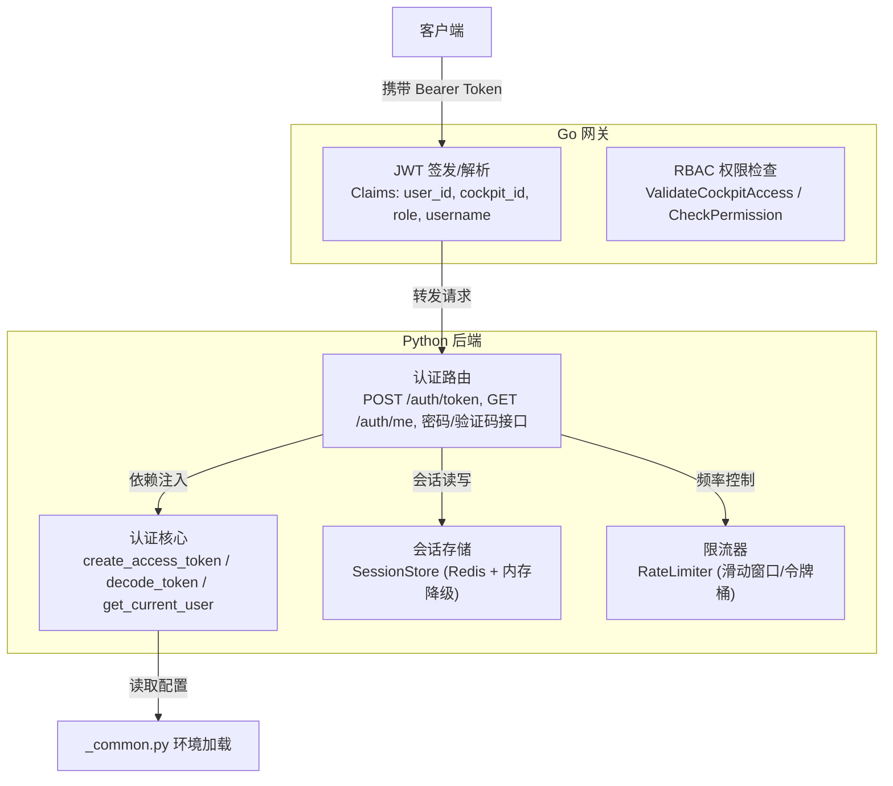
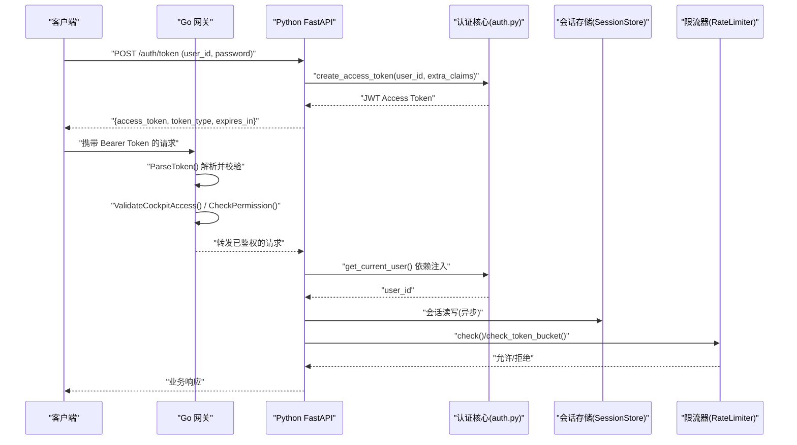
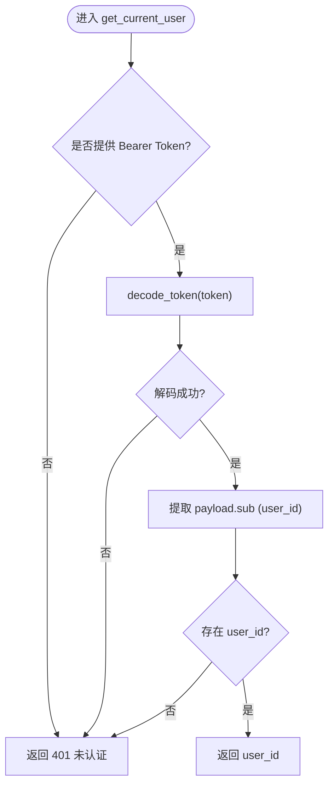
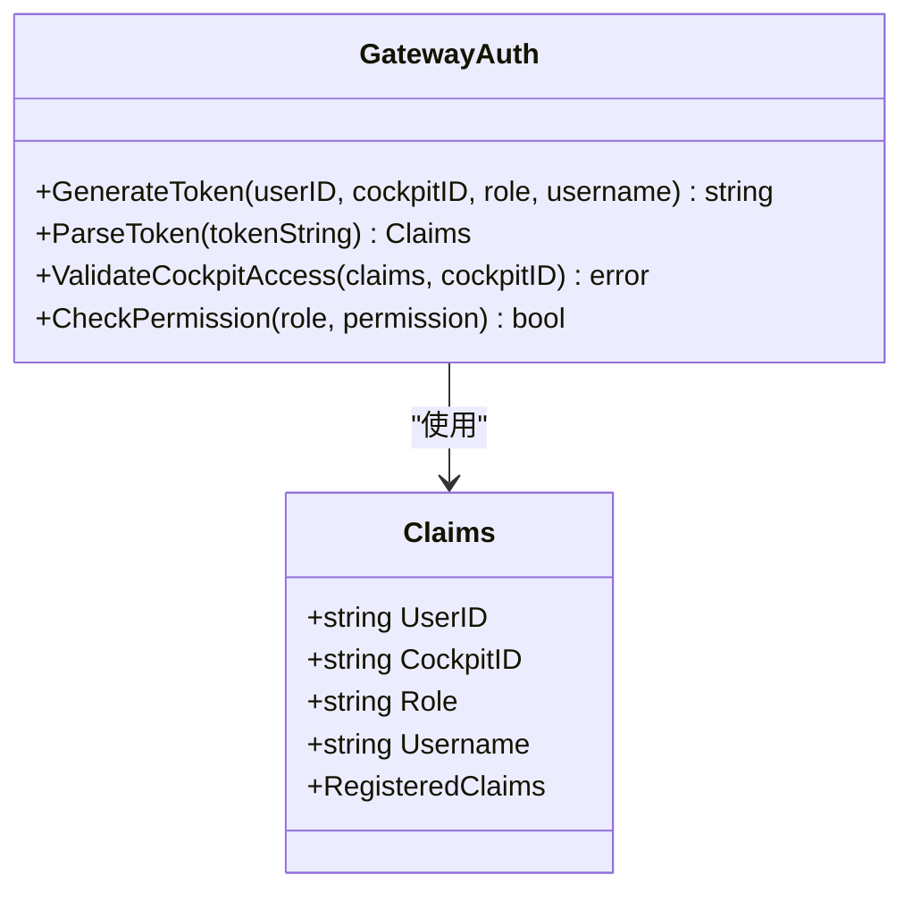
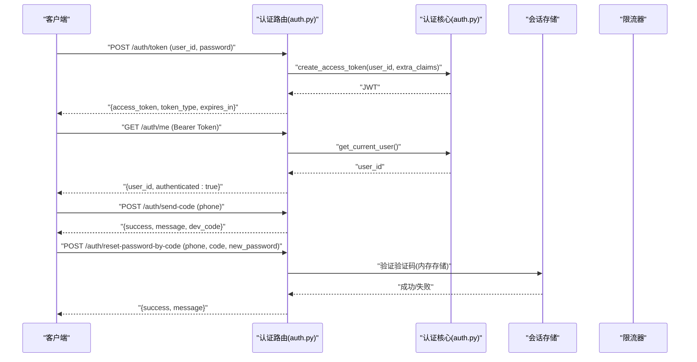
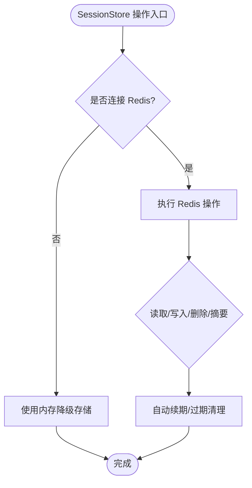
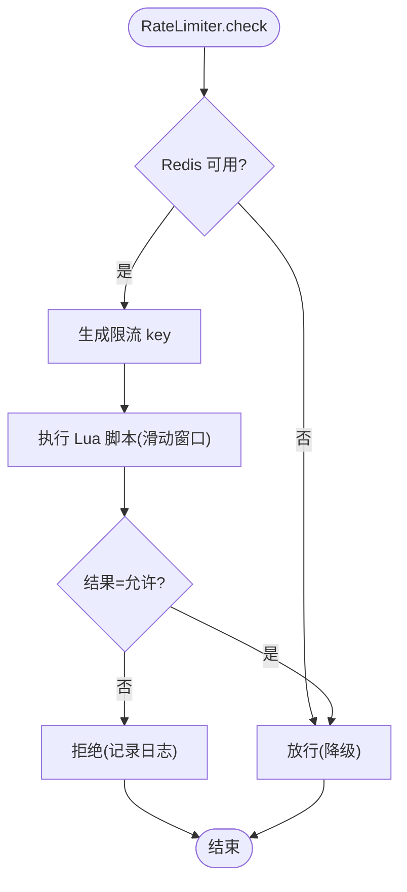
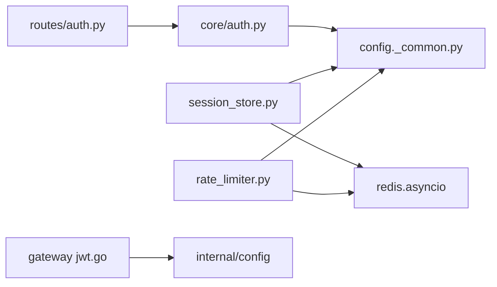

# 认证授权

<cite>
**本文引用的文件**   
- [backend_design/nexus/core/auth.py](file://backend_design/nexus/core/auth.py)
- [backend_design/nexus/api/routes/auth.py](file://backend_design/nexus/api/routes/auth.py)
- [backend_design/nexus_gate/internal/auth/jwt.go](file://backend_design/nexus_gate/internal/auth/jwt.go)
- [backend_design/nexus_gate/internal/auth/jwt_test.go](file://backend_design/nexus_gate/internal/auth/jwt_test.go)
- [backend_design/nexus/middleware/session_store.py](file://backend_design/nexus/middleware/session_store.py)
- [backend_design/nexus/middleware/rate_limiter.py](file://backend_design/nexus/middleware/rate_limiter.py)
- [backend_design/nexus/config/_common.py](file://backend_design/nexus/config/_common.py)
</cite>

## 目录
1. [简介](#简介)
2. [项目结构](#项目结构)
3. [核心组件](#核心组件)
4. [架构总览](#架构总览)
5. [详细组件分析](#详细组件分析)
6. [依赖关系分析](#依赖关系分析)
7. [性能考量](#性能考量)
8. [故障排查指南](#故障排查指南)
9. [结论](#结论)
10. [附录](#附录)

## 简介
本文件为 NexusCockpit 的认证与授权系统提供系统化文档，覆盖以下关键主题：
- JWT 令牌生成与验证（Python FastAPI 后端与 Go 网关）
- 用户身份管理与角色权限模型（RBAC）
- 会话管理机制（Redis 持久化与内存降级）
- 认证流程、安全策略、密码加密存储与多因素认证支持
- API 鉴权中间件、限流策略与安全最佳实践

该体系以“网关签发/校验 + 后端依赖注入”的双端协同模式实现统一鉴权，并通过 Redis 实现分布式会话与限流，保障高可用与可扩展性。

## 项目结构
与认证授权相关的核心代码分布在 Python 后端与 Go 网关两个子系统中：
- Python 后端（FastAPI）
  - 认证核心：JWT 签发与解析、当前用户依赖注入
  - 认证路由：登录、获取当前用户、修改密码、验证码重置
  - 会话存储：基于 Redis 的会话历史与滚动摘要持久化（含内存降级）
  - 限流中间件：基于 Redis Lua 的滑动窗口与令牌桶限流
- Go 网关（nexus_gate）
  - JWT 签发与解析、角色权限检查、座舱访问控制

图表来源
- [backend_design/nexus_gate/internal/auth/jwt.go:1-128](file://backend_design/nexus_gate/internal/auth/jwt.go#L1-L128)
- [backend_design/nexus/core/auth.py:1-140](file://backend_design/nexus/core/auth.py#L1-L140)
- [backend_design/nexus/api/routes/auth.py:1-194](file://backend_design/nexus/api/routes/auth.py#L1-L194)
- [backend_design/nexus/middleware/session_store.py:1-294](file://backend_design/nexus/middleware/session_store.py#L1-L294)
- [backend_design/nexus/middleware/rate_limiter.py:1-297](file://backend_design/nexus/middleware/rate_limiter.py#L1-L297)
- [backend_design/nexus/config/_common.py:1-75](file://backend_design/nexus/config/_common.py#L1-L75)

章节来源
- [backend_design/nexus/core/auth.py:1-140](file://backend_design/nexus/core/auth.py#L1-L140)
- [backend_design/nexus/api/routes/auth.py:1-194](file://backend_design/nexus/api/routes/auth.py#L1-L194)
- [backend_design/nexus_gate/internal/auth/jwt.go:1-128](file://backend_design/nexus_gate/internal/auth/jwt.go#L1-L128)
- [backend_design/nexus/middleware/session_store.py:1-294](file://backend_design/nexus/middleware/session_store.py#L1-L294)
- [backend_design/nexus/middleware/rate_limiter.py:1-297](file://backend_design/nexus/middleware/rate_limiter.py#L1-L297)
- [backend_design/nexus/config/_common.py:1-75](file://backend_design/nexus/config/_common.py#L1-L75)

## 核心组件
- JWT 签发与验证（Python）
  - create_access_token：根据用户 ID、过期时长与额外 claims 生成 JWT
  - decode_token：使用配置的密钥与算法解码并校验签名与有效期
  - get_current_user：FastAPI 依赖注入，从 Authorization 头提取 Bearer Token 并返回 user_id
  - get_optional_user：可选认证，失败时返回 None
- JWT 签发与验证（Go 网关）
  - GenerateToken：签发包含 user_id、cockpit_id、role、username 的 Claims
  - ParseToken：解析并校验 Token，自动处理 Bearer 前缀
  - ValidateCockpitAccess：按角色限制座舱访问
  - CheckPermission：基于角色的权限列表进行细粒度权限判断
- 认证路由（Python）
  - POST /auth/token：开发模式下直接签发 Token（默认赋予 super_admin 角色）
  - GET /auth/me：验证 Token 有效性并返回当前用户信息
  - POST /auth/change-password：修改密码（开发模式不校验旧密码）
  - POST /auth/send-code：发送手机验证码（开发模式返回验证码）
  - POST /auth/reset-password-by-code：通过验证码重置密码
- 会话存储（Python）
  - SessionStore：基于 Redis 的会话历史与滚动摘要持久化，具备内存降级能力
  - TTL 自动续期与过期清理，支持列出活跃会话
- 限流器（Python）
  - RateLimiter：基于 Redis Lua 的原子滑动窗口与令牌桶限流
  - check/check_or_raise：允许或抛出限流异常（429）
  - check_token_bucket：令牌桶模式，适合 LLM 调用场景

章节来源
- [backend_design/nexus/core/auth.py:1-140](file://backend_design/nexus/core/auth.py#L1-L140)
- [backend_design/nexus/api/routes/auth.py:1-194](file://backend_design/nexus/api/routes/auth.py#L1-L194)
- [backend_design/nexus_gate/internal/auth/jwt.go:1-128](file://backend_design/nexus_gate/internal/auth/jwt.go#L1-L128)
- [backend_design/nexus/middleware/session_store.py:1-294](file://backend_design/nexus/middleware/session_store.py#L1-L294)
- [backend_design/nexus/middleware/rate_limiter.py:1-297](file://backend_design/nexus/middleware/rate_limiter.py#L1-L297)

## 架构总览
下图展示了从客户端到网关再到后端的完整认证授权流程，包括 JWT 签发、解析、RBAC 权限校验与会话管理。

图表来源
- [backend_design/nexus/api/routes/auth.py:48-77](file://backend_design/nexus/api/routes/auth.py#L48-L77)
- [backend_design/nexus/core/auth.py:35-122](file://backend_design/nexus/core/auth.py#L35-L122)
- [backend_design/nexus_gate/internal/auth/jwt.go:28-76](file://backend_design/nexus_gate/internal/auth/jwt.go#L28-L76)
- [backend_design/nexus/middleware/session_store.py:91-177](file://backend_design/nexus/middleware/session_store.py#L91-L177)
- [backend_design/nexus/middleware/rate_limiter.py:156-210](file://backend_design/nexus/middleware/rate_limiter.py#L156-L210)

## 详细组件分析

### JWT 签发与验证（Python）
- create_access_token
  - 输入：user_id、可选过期时长、额外 claims（如 role、cockpit_id）
  - 输出：HS256 签名的 JWT 字符串
  - 配置来源：get_config().jwt（secret_key、algorithm、expire_minutes）
- decode_token
  - 校验签名与过期时间，失败抛出 AuthError
- get_current_user
  - 从 Authorization 头提取 Bearer Token
  - 解码后返回 user_id；缺失或无效返回 401
- get_optional_user
  - 可选认证，失败返回 None

图表来源
- [backend_design/nexus/core/auth.py:85-122](file://backend_design/nexus/core/auth.py#L85-L122)

章节来源
- [backend_design/nexus/core/auth.py:35-122](file://backend_design/nexus/core/auth.py#L35-L122)

### JWT 签发与验证（Go 网关）
- Claims 结构：包含 user_id、cockpit_id、role、username 及标准 RegisteredClaims
- GenerateToken：设置 Subject=user_id，确保 Python 侧能正确解析
- ParseToken：去除 Bearer 前缀，校验签名方法为 HS256，返回 Claims
- ValidateCockpitAccess：super_admin 可访问所有座舱，其他角色仅能访问绑定座舱
- CheckPermission：基于角色映射的权限列表进行细粒度判断

图表来源
- [backend_design/nexus_gate/internal/auth/jwt.go:19-76](file://backend_design/nexus_gate/internal/auth/jwt.go#L19-L76)

章节来源
- [backend_design/nexus_gate/internal/auth/jwt.go:1-128](file://backend_design/nexus_gate/internal/auth/jwt.go#L1-L128)
- [backend_design/nexus_gate/internal/auth/jwt_test.go:18-147](file://backend_design/nexus_gate/internal/auth/jwt_test.go#L18-L147)

### 认证路由与多因素认证
- POST /auth/token
  - 开发模式：直接签发 Token，默认赋予 super_admin 角色与 cockpit_id
  - 生产建议：接入用户数据库验证密码并查询角色
- GET /auth/me
  - 用于验证 Token 有效性
- POST /auth/change-password
  - 开发模式：直接返回成功
  - 生产建议：校验旧密码并更新数据库中的哈希密码
- POST /auth/send-code
  - 开发模式：生成 6 位随机验证码并返回 dev_code
  - 生产建议：接入短信网关（阿里云/腾讯云 SMS）
- POST /auth/reset-password-by-code
  - 验证手机号与验证码，通过后重置密码

图表来源
- [backend_design/nexus/api/routes/auth.py:48-194](file://backend_design/nexus/api/routes/auth.py#L48-L194)
- [backend_design/nexus/core/auth.py:35-122](file://backend_design/nexus/core/auth.py#L35-L122)

章节来源
- [backend_design/nexus/api/routes/auth.py:35-194](file://backend_design/nexus/api/routes/auth.py#L35-L194)

### 会话管理机制（Redis + 内存降级）
- SessionStore
  - 连接 Redis，失败则降级为内存 dict
  - async_get/async_set：会话历史读写，保留最近 N 条消息（max_history_len）
  - async_touch：活跃会话自动续期 TTL
  - async_delete：删除会话历史与滚动摘要
  - list_sessions：列出活跃会话（管理用途）
  - async_get_summary/async_set_summary：滚动摘要持久化，与会话共享 TTL
- TTL 与过期
  - 会话与摘要均受 SESSION_TTL_SECONDS 控制（默认 86400 秒）
  - 读操作自动续期，避免活跃会话丢失

图表来源
- [backend_design/nexus/middleware/session_store.py:69-177](file://backend_design/nexus/middleware/session_store.py#L69-L177)
- [backend_design/nexus/middleware/session_store.py:232-288](file://backend_design/nexus/middleware/session_store.py#L232-L288)

章节来源
- [backend_design/nexus/middleware/session_store.py:1-294](file://backend_design/nexus/middleware/session_store.py#L1-L294)

### 限流中间件（滑动窗口与令牌桶）
- 滑动窗口限流
  - 使用 Redis ZSET 记录请求时间戳，Lua 脚本保证原子性
  - 超限请求不会写入计数器，避免污染后续合法请求
- 令牌桶限流
  - 支持突发流量，平均速率由令牌生成速率控制
  - 适用于 LLM API 调用等场景
- check/check_or_raise
  - 允许或抛出 RateLimitError（全局处理器映射为 429）
- check_token_bucket
  - capacity、rate、cost 参数灵活配置

图表来源
- [backend_design/nexus/middleware/rate_limiter.py:156-210](file://backend_design/nexus/middleware/rate_limiter.py#L156-L210)
- [backend_design/nexus/middleware/rate_limiter.py:212-277](file://backend_design/nexus/middleware/rate_limiter.py#L212-L277)

章节来源
- [backend_design/nexus/middleware/rate_limiter.py:1-297](file://backend_design/nexus/middleware/rate_limiter.py#L1-L297)

### 配置与环境加载
- _common.py
  - 自动定位项目根目录
  - 环境文件加载策略：优先 .env.local，其次 .env
  - 提供 _resolve_path 工具函数，确保路径一致性

章节来源
- [backend_design/nexus/config/_common.py:1-75](file://backend_design/nexus/config/_common.py#L1-L75)

## 依赖关系分析
- Python 后端
  - auth.py 依赖 config.get_config() 获取 JWT 配置
  - routes/auth.py 依赖 core/auth.py 的 create_access_token 与 get_current_user
  - session_store.py 依赖 redis.asyncio 与 config.redis.url
  - rate_limiter.py 依赖 redis.asyncio 与 config.redis.url
- Go 网关
  - jwt.go 依赖 internal/config 获取 JWTSecret 与 JWTExpireHours
  - jwt_test.go 初始化配置并验证签发/解析与权限逻辑

图表来源
- [backend_design/nexus/api/routes/auth.py:27-31](file://backend_design/nexus/api/routes/auth.py#L27-L31)
- [backend_design/nexus/core/auth.py:25-28](file://backend_design/nexus/core/auth.py#L25-L28)
- [backend_design/nexus/middleware/session_store.py:24-27](file://backend_design/nexus/middleware/session_store.py#L24-L27)
- [backend_design/nexus/middleware/rate_limiter.py:20-24](file://backend_design/nexus/middleware/rate_limiter.py#L20-L24)
- [backend_design/nexus_gate/internal/auth/jwt.go:16-17](file://backend_design/nexus_gate/internal/auth/jwt.go#L16-L17)

章节来源
- [backend_design/nexus/api/routes/auth.py:1-194](file://backend_design/nexus/api/routes/auth.py#L1-L194)
- [backend_design/nexus/core/auth.py:1-140](file://backend_design/nexus/core/auth.py#L1-L140)
- [backend_design/nexus/middleware/session_store.py:1-294](file://backend_design/nexus/middleware/session_store.py#L1-L294)
- [backend_design/nexus/middleware/rate_limiter.py:1-297](file://backend_design/nexus/middleware/rate_limiter.py#L1-L297)
- [backend_design/nexus_gate/internal/auth/jwt.go:1-128](file://backend_design/nexus_gate/internal/auth/jwt.go#L1-L128)

## 性能考量
- JWT 解码与校验为轻量级 CPU 操作，建议在网关层集中处理以减少后端压力
- Redis 操作采用 Lua 脚本保证原子性，降低并发竞争与网络往返开销
- 会话存储与限流器在 Redis 不可用时自动降级为内存，保障服务可用性
- 合理设置 JWT 过期时间与会话 TTL，平衡安全性与用户体验
- 令牌桶限流适合突发流量场景，滑动窗口更适合严格计数场景

[本节为通用指导，不直接分析具体文件]

## 故障排查指南
- 401 未认证
  - 检查 Authorization 头是否正确携带 Bearer Token
  - 确认 Token 未过期且签名有效
  - 查看 Python 侧 decode_token 抛出的 AuthError
- 429 限流
  - 检查 RateLimiter.check/check_token_bucket 返回值
  - 确认 Redis 连接与 Lua 脚本加载状态
- 会话丢失
  - 确认 Redis 连接正常，TTL 续期是否生效
  - 查看 SessionStore 降级日志与内存存储状态
- 权限不足
  - 检查 Claims 中的 role 与 cockpit_id 是否正确
  - 使用 ValidateCockpitAccess 与 CheckPermission 进行断言

章节来源
- [backend_design/nexus/core/auth.py:98-122](file://backend_design/nexus/core/auth.py#L98-L122)
- [backend_design/nexus/middleware/rate_limiter.py:204-210](file://backend_design/nexus/middleware/rate_limiter.py#L204-L210)
- [backend_design/nexus/middleware/session_store.py:69-81](file://backend_design/nexus/middleware/session_store.py#L69-L81)
- [backend_design/nexus_gate/internal/auth/jwt.go:78-99](file://backend_design/nexus_gate/internal/auth/jwt.go#L78-L99)

## 结论
NexusCockpit 的认证授权体系通过“网关签发/校验 + 后端依赖注入”的双端协同模式，结合 Redis 实现的分布式会话与限流，提供了高可用、可扩展且安全的鉴权方案。在生产环境中，建议完善密码哈希存储、接入真实用户数据库与短信网关，并根据业务需求调整 JWT 过期策略与限流阈值。

[本节为总结性内容，不直接分析具体文件]

## 附录
- 安全最佳实践
  - 使用强密钥与合适的算法（HS256），定期轮换 secret_key
  - 最小化 JWT claims，避免敏感信息泄露
  - 生产环境启用 HTTPS 与严格的 CORS 策略
  - 对敏感操作实施二次验证（如短信验证码）
  - 监控与审计：记录认证失败、限流触发与会话异常

[本节为通用指导，不直接分析具体文件]