# 配置管理

<cite>
**本文引用的文件**   
- [backend_design/nexus/config/__init__.py](file://backend_design/nexus/config/__init__.py)
- [backend_design/nexus/config/_common.py](file://backend_design/nexus/config/_common.py)
- [backend_design/nexus/config/llm.py](file://backend_design/nexus/config/llm.py)
- [backend_design/nexus/config/database.py](file://backend_design/nexus/config/database.py)
- [backend_design/nexus/config/cache.py](file://backend_design/nexus/config/cache.py)
- [backend_design/nexus/config/server.py](file://backend_design/nexus/config/server.py)
- [backend_design/nexus/config/vehicle.py](file://backend_design/nexus/config/vehicle.py)
- [backend_design/nexus/config/asr.py](file://backend_design/nexus/config/asr.py)
- [backend_design/nexus/config/observability.py](file://backend_design/nexus/config/observability.py)
- [backend_design/nexus/config/providers.py](file://backend_design/nexus/config/providers.py)
- [backend_design/nexus/config/data.py](file://backend_design/nexus/config/data.py)
- [backend_design/nexus/config/cockpit.py](file://backend_design/nexus/config/cockpit.py)
- [backend_design/nexus/main.py](file://backend_design/nexus/main.py)
</cite>

## 目录
1. [简介](#简介)
2. [项目结构](#项目结构)
3. [核心组件](#核心组件)
4. [架构总览](#架构总览)
5. [详细组件分析](#详细组件分析)
6. [依赖关系分析](#依赖关系分析)
7. [性能考量](#性能考量)
8. [故障排查指南](#故障排查指南)
9. [结论](#结论)
10. [附录](#附录)

## 简介
本文件为 NexusCockpit 的配置管理系统提供系统化、可操作的文档。内容涵盖统一配置中心的设计与实现，包括 AppConfig 聚合类、Pydantic Settings 的使用方式、环境变量加载机制、配置文件组织结构与各子系统配置模块（LLM、数据库、缓存、车控、ASR/TTS、可观测性、服务器与认证、部署模式与重排器、数据目录与记忆、多座舱与第三方服务等）。同时说明配置项的层级结构、默认值设置、环境变量覆盖规则与路径解析机制，并提供完整示例、最佳实践与常见问题解决方案。

## 项目结构
NexusCockpit 将原单文件配置拆分为按子系统划分的多个配置模块，并通过统一的入口进行聚合导出。核心组织如下：
- 公共工具与路径常量：_common.py
- 各子系统配置：llm.py、database.py、cache.py、server.py、vehicle.py、asr.py、observability.py、providers.py、data.py、cockpit.py
- 统一入口与全局单例：config/__init__.py
- 应用启动时读取配置并初始化各组件：main.py

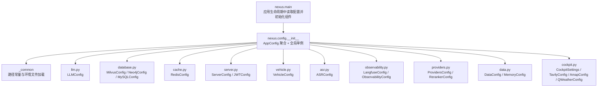

**图表来源** 
- [backend_design/nexus/config/__init__.py:84-132](file://backend_design/nexus/config/__init__.py#L84-L132)
- [backend_design/nexus/config/_common.py:20-53](file://backend_design/nexus/config/_common.py#L20-L53)
- [backend_design/nexus/main.py:85-96](file://backend_design/nexus/main.py#L85-L96)

**章节来源**
- [backend_design/nexus/config/__init__.py:1-82](file://backend_design/nexus/config/__init__.py#L1-L82)
- [backend_design/nexus/config/_common.py:1-75](file://backend_design/nexus/config/_common.py#L1-L75)
- [backend_design/nexus/main.py:75-100](file://backend_design/nexus/main.py#L75-L100)

## 核心组件
- 统一入口与聚合类
  - AppConfig：聚合所有子系统配置，使用 Pydantic BaseSettings 自动从环境变量加载，并通过 model_config 指定 .env 文件与忽略多余字段。
  - get_config()：线程安全的单例访问器（lru_cache），确保只创建一次 AppConfig。
  - 快捷函数：get_llm_config()、get_milvus_config()、get_redis_config() 等。
- 公共工具
  - _common.py：定义 _PROJECT_ROOT、_ENV_FILE，以及 _resolve_path() 用于相对路径到绝对路径的转换；优先加载 .env.local，否则回退到 .env。

关键要点
- 每个子配置类独立声明 env_file=_ENV_FILE，保证统一的环境文件策略。
- 通过 validation_alias 将环境变量名映射到字段名，便于集中管理与命名规范。
- 使用 computed_field 或 property 派生计算字段（如 URL、列表等）。

**章节来源**
- [backend_design/nexus/config/__init__.py:84-132](file://backend_design/nexus/config/__init__.py#L84-L132)
- [backend_design/nexus/config/__init__.py:144-167](file://backend_design/nexus/config/__init__.py#L144-L167)
- [backend_design/nexus/config/_common.py:20-53](file://backend_design/nexus/config/_common.py#L20-L53)
- [backend_design/nexus/config/_common.py:56-75](file://backend_design/nexus/config/_common.py#L56-L75)

## 架构总览
配置系统采用“聚合 + 模块化”的架构：
- 聚合层：AppConfig 作为唯一入口，暴露所有子系统配置。
- 模块层：每个子系统一个配置类，职责单一，便于维护与扩展。
- 环境层：_common.py 统一管理 .env 加载策略与路径解析。
- 应用层：main.py 在应用生命周期中读取配置，初始化各组件（向量库、图谱、缓存、限流、会话存储、Agent、指标等）。

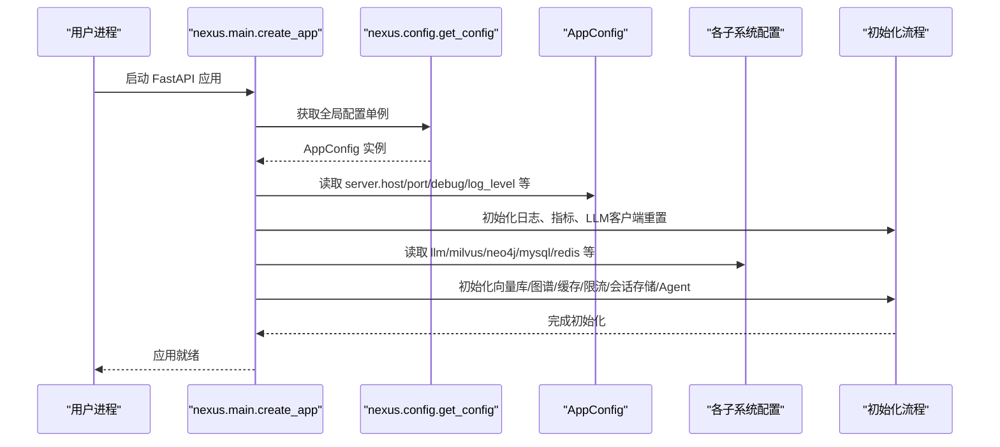

**图表来源** 
- [backend_design/nexus/main.py:85-96](file://backend_design/nexus/main.py#L85-L96)
- [backend_design/nexus/main.py:112-170](file://backend_design/nexus/main.py#L112-L170)
- [backend_design/nexus/config/__init__.py:144-167](file://backend_design/nexus/config/__init__.py#L144-L167)

**章节来源**
- [backend_design/nexus/main.py:75-100](file://backend_design/nexus/main.py#L75-L100)
- [backend_design/nexus/main.py:112-170](file://backend_design/nexus/main.py#L112-L170)

## 详细组件分析

### 统一入口与聚合类（AppConfig）
- 作用：聚合所有子系统配置，提供统一访问点与快捷方法。
- 设计要点：
  - 使用 Field(default_factory=...) 为每个子配置提供默认实例。
  - model_config 指定 env_file 与 extra="ignore"，避免未知环境变量报错。
  - project_root 属性暴露项目根目录，供其他模块拼接路径。

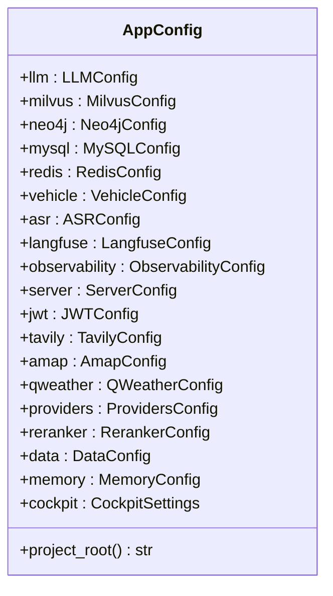

**图表来源** 
- [backend_design/nexus/config/__init__.py:84-132](file://backend_design/nexus/config/__init__.py#L84-L132)

**章节来源**
- [backend_design/nexus/config/__init__.py:84-132](file://backend_design/nexus/config/__init__.py#L84-L132)

### 公共工具与环境文件加载（_common.py）
- 路径常量：_PROJECT_ROOT 基于 __file__ 向上四级定位项目根目录。
- 环境文件加载策略：
  - 若存在 .env.local，则优先加载（覆盖 .env 默认值）。
  - 否则加载 .env（开箱即用默认配置）。
  - 使用 dotenv.load_dotenv(override=True) 显式加载，防止空值覆盖。
- 路径解析：_resolve_path() 将相对路径转换为基于项目根的绝对路径，兼容任意启动目录。

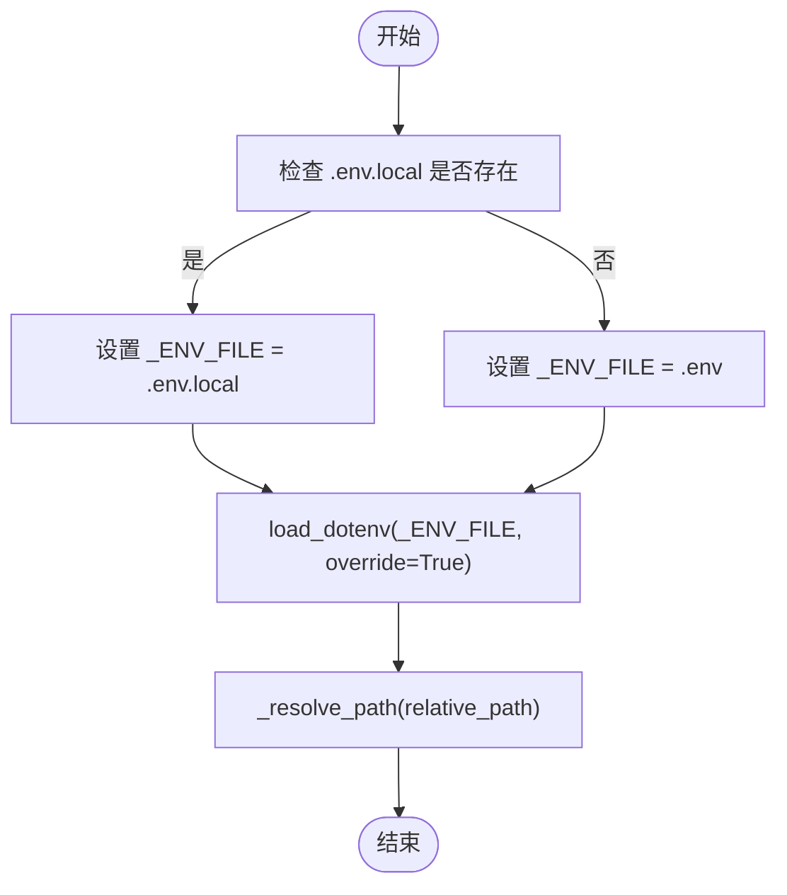

**图表来源** 
- [backend_design/nexus/config/_common.py:39-53](file://backend_design/nexus/config/_common.py#L39-L53)
- [backend_design/nexus/config/_common.py:56-75](file://backend_design/nexus/config/_common.py#L56-L75)

**章节来源**
- [backend_design/nexus/config/_common.py:20-53](file://backend_design/nexus/config/_common.py#L20-L53)
- [backend_design/nexus/config/_common.py:56-75](file://backend_design/nexus/config/_common.py#L56-L75)

### LLM 配置（LLMConfig）
- 功能：管理大模型连接参数，支持本地/云端一键切换。
- 关键点：
  - provider 控制模式（cloud/local），local 时自动切换到 llama.cpp 参数。
  - 计算字段 embedding_url、is_local 简化调用。
  - fallback_* 系列字段用于降级备份。

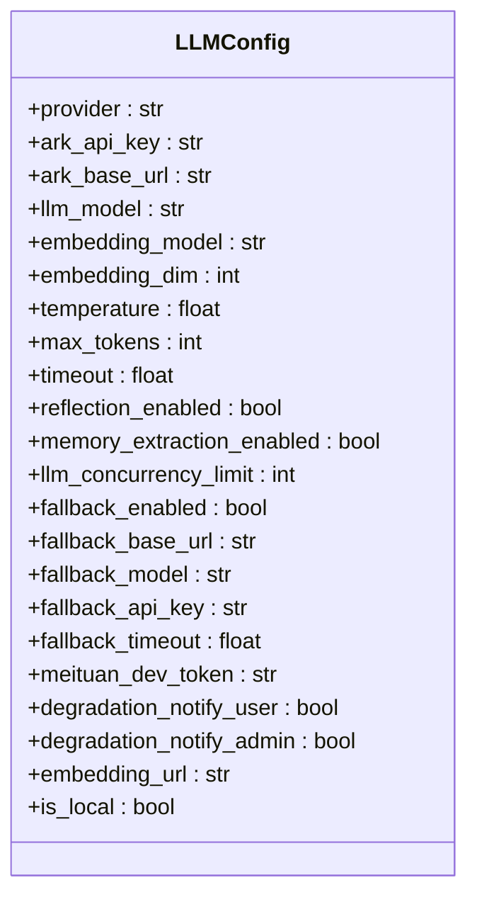

**图表来源** 
- [backend_design/nexus/config/llm.py:15-72](file://backend_design/nexus/config/llm.py#L15-L72)

**章节来源**
- [backend_design/nexus/config/llm.py:15-72](file://backend_design/nexus/config/llm.py#L15-L72)

### 数据库配置（MilvusConfig / Neo4jConfig / MySQLConfig）
- MilvusConfig：向量数据库连接参数、集合名、索引与搜索参数。
- Neo4jConfig：知识图谱连接 URI、用户名、密码。
- MySQLConfig：MySQL 连接参数，并提供 url 计算字段（aiomysql 驱动）。

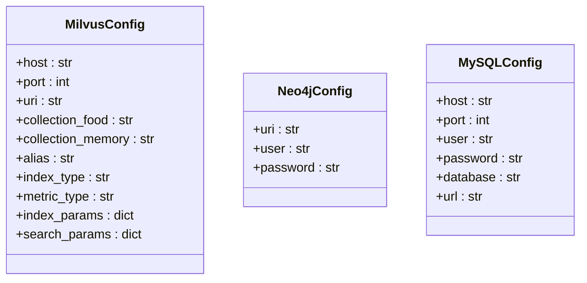

**图表来源** 
- [backend_design/nexus/config/database.py:15-61](file://backend_design/nexus/config/database.py#L15-L61)

**章节来源**
- [backend_design/nexus/config/database.py:15-61](file://backend_design/nexus/config/database.py#L15-L61)

### 缓存配置（RedisConfig）
- 功能：语义缓存、限流、会话存储的 Redis 连接与行为参数。
- 关键点：
  - cache_enabled、cache_similarity_threshold、cache_ttl 控制语义缓存。
  - url 计算字段生成完整的 Redis 连接字符串。

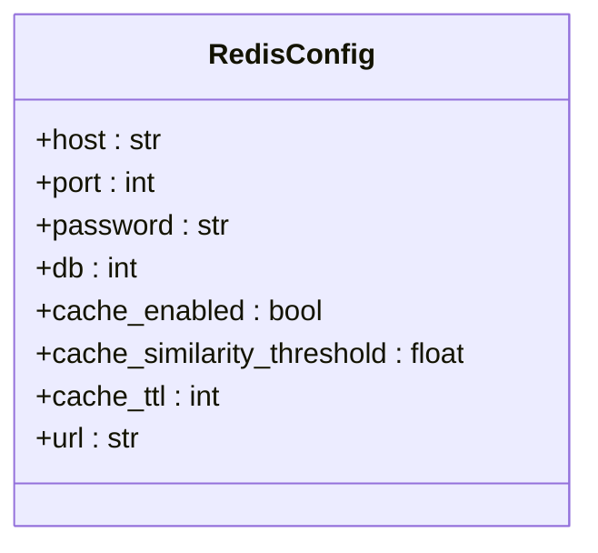

**图表来源** 
- [backend_design/nexus/config/cache.py:15-41](file://backend_design/nexus/config/cache.py#L15-L41)

**章节来源**
- [backend_design/nexus/config/cache.py:15-41](file://backend_design/nexus/config/cache.py#L15-L41)

### 服务器与认证配置（ServerConfig / JWTConfig）
- ServerConfig：监听地址、端口、调试模式、日志级别、CORS 来源、会话锁上限、SSE 心跳间隔。
- JWTConfig：密钥、算法、过期时间、RBAC 默认角色与管理员/用户密码。
- CORS 来源支持逗号分隔字符串，提供 cors_origins_list 属性转为列表。

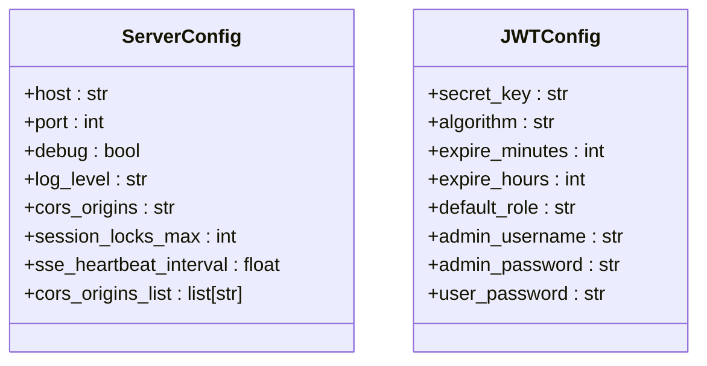

**图表来源** 
- [backend_design/nexus/config/server.py:15-61](file://backend_design/nexus/config/server.py#L15-L61)

**章节来源**
- [backend_design/nexus/config/server.py:15-61](file://backend_design/nexus/config/server.py#L15-L61)

### 车控总线适配器配置（VehicleConfig）
- 功能：控制车控指令发送方式（mock/http/mcp）。
- 关键点：
  - HTTP 模式：base_url、protocol、endpoint、timeout、token。
  - MCP 模式：启动命令、参数、工作目录、工具验证开关。

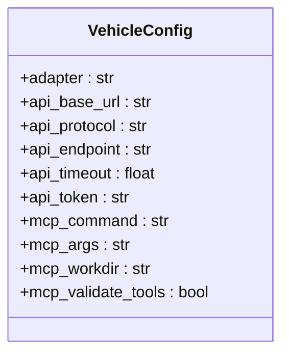

**图表来源** 
- [backend_design/nexus/config/vehicle.py:15-50](file://backend_design/nexus/config/vehicle.py#L15-L50)

**章节来源**
- [backend_design/nexus/config/vehicle.py:15-50](file://backend_design/nexus/config/vehicle.py#L15-L50)

### 语音处理模型配置（ASRConfig）
- 功能：管理离线语音模型路径（FunASR SenseVoice、CosyVoice、CAM++ 声纹）。
- 关键点：
  - model_post_init 中将相对路径解析为绝对路径。
  - 提供 resolved_* 方法返回已解析的绝对路径。

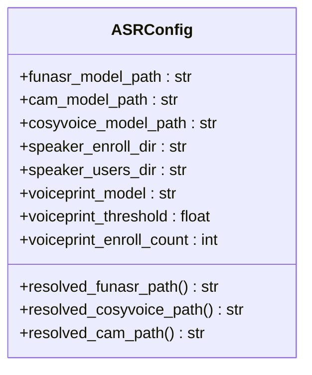

**图表来源** 
- [backend_design/nexus/config/asr.py:15-66](file://backend_design/nexus/config/asr.py#L15-L66)

**章节来源**
- [backend_design/nexus/config/asr.py:15-66](file://backend_design/nexus/config/asr.py#L15-L66)

### 可观测性配置（LangfuseConfig / ObservabilityConfig）
- LangfuseConfig：本地自托管追踪平台连接参数，is_enabled 判断是否启用。
- ObservabilityConfig：Prometheus 与 Grafana 地址（仅输出用途）。

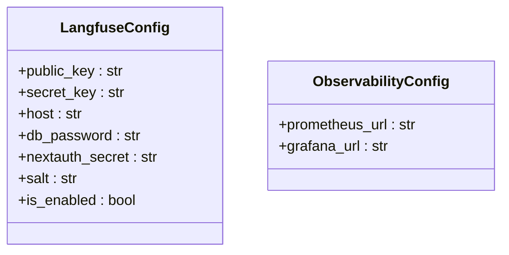

**图表来源** 
- [backend_design/nexus/config/observability.py:15-47](file://backend_design/nexus/config/observability.py#L15-L47)

**章节来源**
- [backend_design/nexus/config/observability.py:15-47](file://backend_design/nexus/config/observability.py#L15-L47)

### 部署模式与重排器配置（ProvidersConfig / RerankerConfig）
- ProvidersConfig：控制各组件 Provider 选择（向量库、图谱、缓存、重排器、检查点），normalized() 返回小写归一化字典。
- RerankerConfig：重排模型名称。

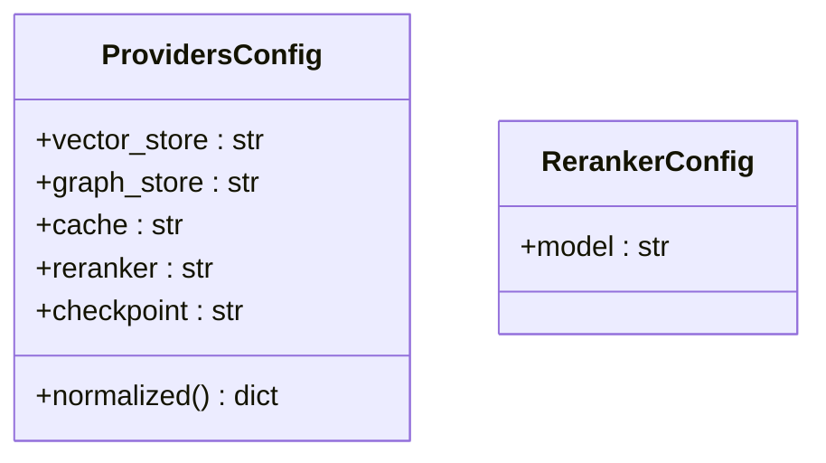

**图表来源** 
- [backend_design/nexus/config/providers.py:15-47](file://backend_design/nexus/config/providers.py#L15-L47)

**章节来源**
- [backend_design/nexus/config/providers.py:15-47](file://backend_design/nexus/config/providers.py#L15-L47)

### 数据目录与记忆配置（DataConfig / MemoryConfig）
- DataConfig：食物知识库、上传文件、临时文件、用户偏好目录，提供 resolved_* 方法返回绝对路径。
- MemoryConfig：对话历史压缩、摘要、窗口大小等行为参数。

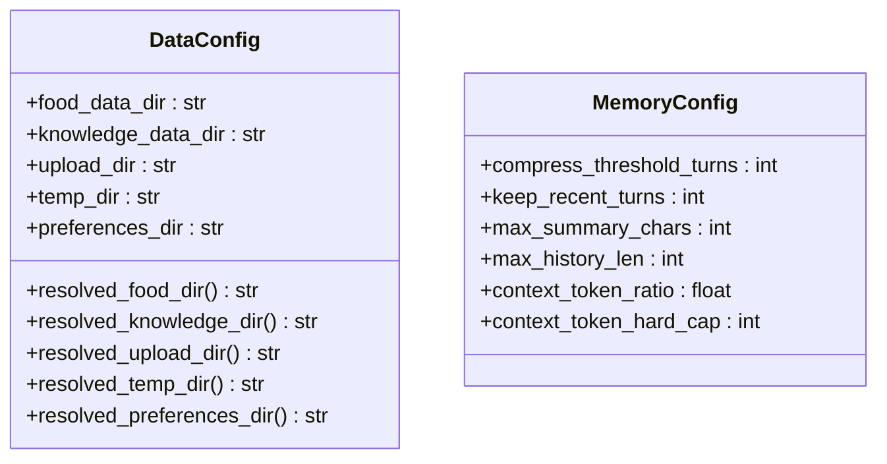

**图表来源** 
- [backend_design/nexus/config/data.py:15-63](file://backend_design/nexus/config/data.py#L15-L63)

**章节来源**
- [backend_design/nexus/config/data.py:15-63](file://backend_design/nexus/config/data.py#L15-L63)

### 多座舱与第三方服务配置（CockpitSettings / TavilyConfig / AmapConfig / QWeatherConfig）
- CockpitSettings：多座舱数量、Go 网关配置、RBAC 默认角色、声纹参数。
- TavilyConfig：AI 搜索引擎 API Key。
- AmapConfig：高德地图 API Key。
- QWeatherConfig：和风天气 API 认证参数，effective_key 返回有效 Key。

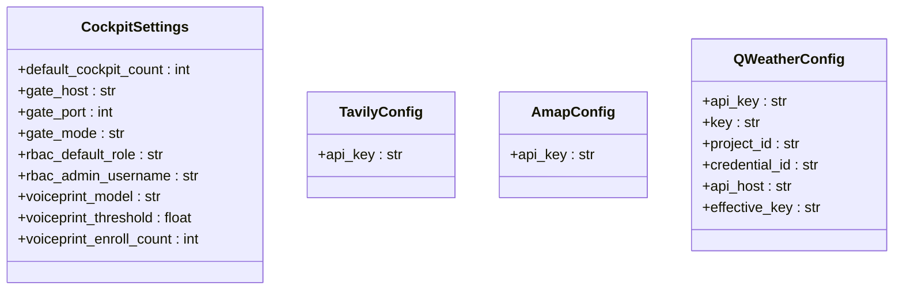

**图表来源** 
- [backend_design/nexus/config/cockpit.py:15-83](file://backend_design/nexus/config/cockpit.py#L15-L83)

**章节来源**
- [backend_design/nexus/config/cockpit.py:15-83](file://backend_design/nexus/config/cockpit.py#L15-L83)

## 依赖关系分析
配置模块之间的依赖关系清晰且低耦合：
- 所有子配置模块依赖 _common.py 中的 _ENV_FILE 与 _resolve_path()。
- AppConfig 聚合所有子配置，不反向依赖具体实现细节。
- main.py 在应用生命周期中读取配置并初始化组件，形成单向依赖。

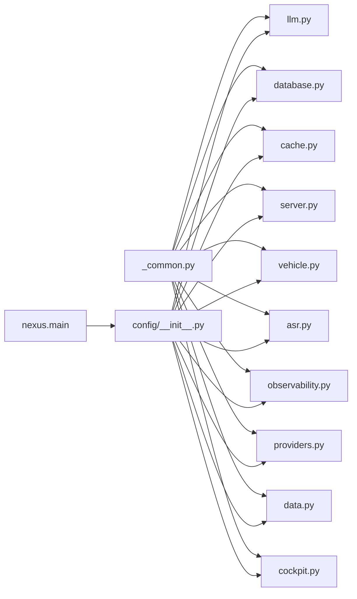

**图表来源** 
- [backend_design/nexus/config/_common.py:12-13](file://backend_design/nexus/config/_common.py#L12-L13)
- [backend_design/nexus/config/__init__.py:38-49](file://backend_design/nexus/config/__init__.py#L38-L49)
- [backend_design/nexus/main.py:56-66](file://backend_design/nexus/main.py#L56-L66)

**章节来源**
- [backend_design/nexus/config/_common.py:12-13](file://backend_design/nexus/config/_common.py#L12-L13)
- [backend_design/nexus/config/__init__.py:38-49](file://backend_design/nexus/config/__init__.py#L38-L49)
- [backend_design/nexus/main.py:56-66](file://backend_design/nexus/main.py#L56-L66)

## 性能考量
- 配置加载开销极低：BaseSettings 仅在首次访问时构建，配合 lru_cache 保证单例。
- 路径解析一次性完成：_resolve_path() 在 ASR/Data 等模块初始化时执行，避免重复计算。
- 环境变量覆盖策略明确：.env.local 优先，避免敏感信息泄露与覆盖问题。
- 启动阶段非阻塞：main.py 对大型模型预加载使用后台任务，减少启动延迟。

[本节为通用指导，不直接分析具体文件]

## 故障排查指南
常见问题与解决思路：
- 环境变量未生效
  - 确认 .env.local 或 .env 存在且被正确加载（_common.py 加载逻辑）。
  - 检查字段 validation_alias 是否与 .env 变量名一致。
- 路径解析错误
  - 使用 ASRConfig/DataConfig 提供的 resolved_* 方法获取绝对路径。
  - 确保相对路径以 ./ 开头或已是绝对路径。
- LLM 连接失败
  - 检查 provider 是否为 local/cloud，对应参数是否正确。
  - 查看 main.py 启动日志中 API Key 加载状态与 Base URL。
- Redis 连接失败
  - 核对 host/port/password/db 与 RedisConfig.url 生成的连接串。
- CORS 跨域问题
  - 调整 ServerConfig.cors_origins，确保包含前端域名。
- 启动后配置未更新
  - 调用 get_config.cache_clear() 清除缓存，重新读取 .env。

**章节来源**
- [backend_design/nexus/config/_common.py:39-53](file://backend_design/nexus/config/_common.py#L39-L53)
- [backend_design/nexus/config/asr.py:47-53](file://backend_design/nexus/config/asr.py#L47-L53)
- [backend_design/nexus/config/data.py:26-44](file://backend_design/nexus/config/data.py#L26-L44)
- [backend_design/nexus/config/llm.py:53-72](file://backend_design/nexus/config/llm.py#L53-L72)
- [backend_design/nexus/config/cache.py:35-41](file://backend_design/nexus/config/cache.py#L35-L41)
- [backend_design/nexus/config/server.py:36-41](file://backend_design/nexus/config/server.py#L36-L41)
- [backend_design/nexus/main.py:93-96](file://backend_design/nexus/main.py#L93-L96)

## 结论
NexusCockpit 的配置管理系统通过模块化拆分与统一聚合，实现了高内聚、低耦合的可维护架构。借助 Pydantic Settings 的强大能力，结合明确的环境变量覆盖策略与路径解析机制，既保证了开发体验，又满足了生产环境的灵活性与安全性。建议在部署时严格区分 .env 与 .env.local，合理设置各子系统默认值，并在启动日志中关注关键配置加载状态。

[本节为总结性内容，不直接分析具体文件]

## 附录

### 配置项层级结构与默认值
- 顶层：AppConfig
  - llm: LLMConfig
  - milvus: MilvusConfig
  - neo4j: Neo4jConfig
  - mysql: MySQLConfig
  - redis: RedisConfig
  - vehicle: VehicleConfig
  - asr: ASRConfig
  - langfuse: LangfuseConfig
  - observability: ObservabilityConfig
  - server: ServerConfig
  - jwt: JWTConfig
  - tavily: TavilyConfig
  - amap: AmapConfig
  - qweather: QWeatherConfig
  - providers: ProvidersConfig
  - reranker: RerankerConfig
  - data: DataConfig
  - memory: MemoryConfig
  - cockpit: CockpitSettings

**章节来源**
- [backend_design/nexus/config/__init__.py:84-132](file://backend_design/nexus/config/__init__.py#L84-L132)

### 环境变量覆盖规则
- 优先级：进程环境变量 > .env.local > .env
- 字段映射：通过 validation_alias 将环境变量名映射到字段名。
- 额外字段：extra="ignore" 忽略未声明的环境变量。

**章节来源**
- [backend_design/nexus/config/_common.py:39-53](file://backend_design/nexus/config/_common.py#L39-L53)
- [backend_design/nexus/config/__init__.py:132](file://backend_design/nexus/config/__init__.py#L132)

### 路径解析机制
- 相对路径：以 ./ 开头的路径会被清理前缀后拼接项目根目录。
- 绝对路径：直接返回，不做修改。
- 适用场景：ASRConfig、DataConfig 等模块的路径字段。

**章节来源**
- [backend_design/nexus/config/_common.py:56-75](file://backend_design/nexus/config/_common.py#L56-L75)
- [backend_design/nexus/config/asr.py:47-53](file://backend_design/nexus/config/asr.py#L47-L53)
- [backend_design/nexus/config/data.py:26-44](file://backend_design/nexus/config/data.py#L26-L44)

### 完整配置示例（建议）
- .env（默认配置，提交仓库）
  - HOST=0.0.0.0
  - PORT=8000
  - DEBUG=true
  - LOG_LEVEL=INFO
  - CORS_ORIGINS=http://localhost:3000
  - LLM_PROVIDER=cloud
  - ARK_API_KEY=your_api_key
  - ARK_BASE_URL=https://api.siliconflow.cn/v1
  - LLM_MODEL=deepseek-ai/DeepSeek-V3
  - EMBEDDING_MODEL=BAAI/bge-m3
  - EMBEDDING_DIM=1024
  - MILVUS_HOST=127.0.0.1
  - MILVUS_PORT=19530
  - MILVUS_URI=http://127.0.0.1:19530
  - NEO4J_URI=bolt://127.0.0.1:17687
  - NEO4J_USER=neo4j
  - NEO4J_PASSWORD=nexuscockpit
  - MYSQL_HOST=127.0.0.1
  - MYSQL_PORT=13306
  - MYSQL_USER=root
  - MYSQL_PASSWORD=nexuscockpit
  - MYSQL_DATABASE=nexus_cockpit
  - REDIS_HOST=127.0.0.1
  - REDIS_PORT=16379
  - REDIS_PASSWORD=
  - REDIS_DB=0
  - SEMANTIC_CACHE_ENABLED=true
  - SEMANTIC_CACHE_SIMILARITY_THRESHOLD=0.92
  - SEMANTIC_CACHE_TTL_SECONDS=3600
  - VEHICLE_ADAPTER=mock
  - FUNASR_MODEL_PATH=./models/asr/sensevoice
  - COSYVOICE_MODEL_PATH=./models/tts/cosyvoice
  - CAM_MODEL_PATH=./models/sv/cam_plus
  - LANGFUSE_PUBLIC_KEY=
  - LANGFUSE_SECRET_KEY=
  - LANGFUSE_HOST=http://127.0.0.1:3101
  - PROMETHEUS_URL=http://127.0.0.1:9200
  - GRAFANA_URL=http://127.0.0.1:3001
  - VECTOR_STORE_PROVIDER=local
  - GRAPH_STORE_PROVIDER=local
  - CACHE_PROVIDER=local
  - RERANKER_PROVIDER=local
  - CHECKPOINT_PROVIDER=sqlite
  - FOOD_DATA_DIR=./data/food
  - KNOWLEDGE_DATA_DIR=./data/knowledge
  - UPLOAD_DIR=./data/uploads
  - TEMP_DIR=./data/temp
  - PREFERENCES_DIR=./data/preferences
  - COCKPIT_COUNT=1
  - NEXUS_GATE_HOST=0.0.0.0
  - NEXUS_GATE_PORT=8080
  - NEXUS_GATE_MODE=proxy
  - RBAC_DEFAULT_ROLE=cockpit_user
  - RBAC_ADMIN_USERNAME=admin
  - TAVILY_API_KEY=
  - AMAP_KEY=
  - QWEATHER_APIKEY=
  - QWEATHER_KEY=
  - QWEATHER_PROJECT_ID=
  - QWEATHER_CREDENTIAL_ID=
  - QWEATHER_API_HOST=devapi.qweather.com

- .env.local（本机覆盖，不提交）
  - 复制 .env 中需要覆盖的键值，如 ARK_API_KEY、REDIS_PASSWORD、JWT_SECRET_KEY 等敏感信息。

[本节为示例性内容，不直接分析具体文件]

### 最佳实践
- 使用 .env.local 管理敏感信息，避免泄露。
- 通过 validation_alias 统一环境变量命名规范。
- 使用 computed_field/property 派生计算字段，减少重复逻辑。
- 在 main.py 启动日志中检查关键配置加载状态。
- 对于大型模型预加载，使用后台任务避免阻塞启动。

[本节为通用指导，不直接分析具体文件]

### 常见问题解决方案
- 环境变量未生效：检查 .env.local/.env 加载顺序与字段映射。
- 路径解析错误：使用 resolved_* 方法获取绝对路径。
- LLM 连接失败：确认 provider 与对应参数。
- Redis 连接失败：核对连接参数与 URL。
- CORS 跨域问题：调整 cors_origins。
- 启动后配置未更新：清除 get_config 缓存。

**章节来源**
- [backend_design/nexus/config/_common.py:39-53](file://backend_design/nexus/config/_common.py#L39-L53)
- [backend_design/nexus/config/asr.py:47-53](file://backend_design/nexus/config/asr.py#L47-L53)
- [backend_design/nexus/config/data.py:26-44](file://backend_design/nexus/config/data.py#L26-L44)
- [backend_design/nexus/config/llm.py:53-72](file://backend_design/nexus/config/llm.py#L53-L72)
- [backend_design/nexus/config/cache.py:35-41](file://backend_design/nexus/config/cache.py#L35-L41)
- [backend_design/nexus/config/server.py:36-41](file://backend_design/nexus/config/server.py#L36-L41)
- [backend_design/nexus/main.py:93-96](file://backend_design/nexus/main.py#L93-L96)