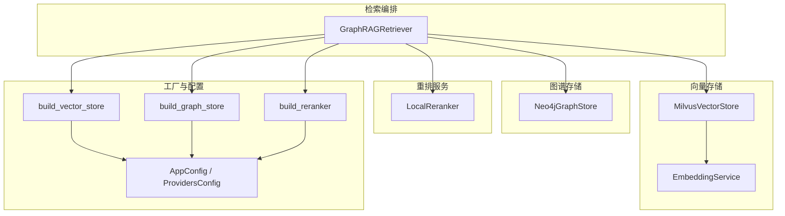
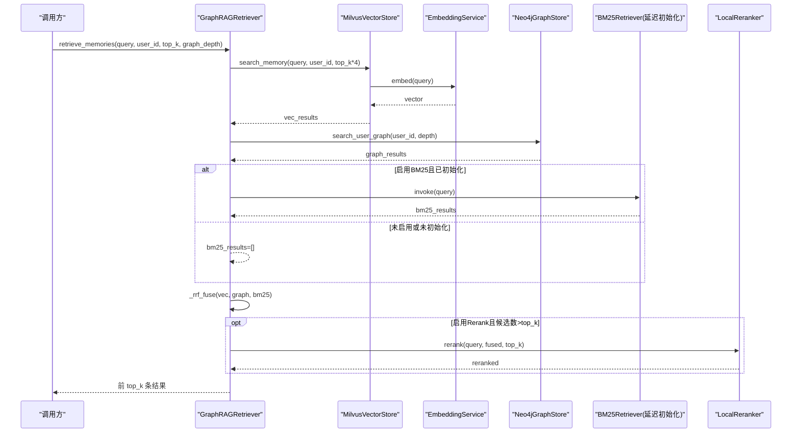
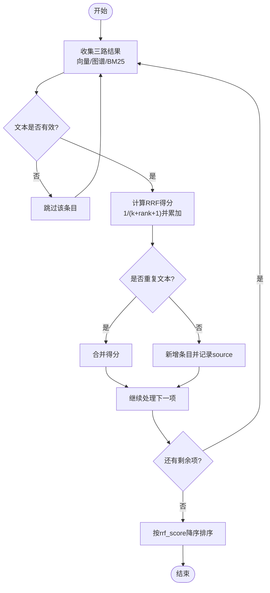
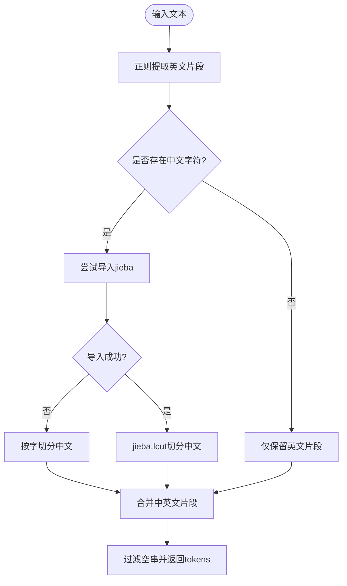
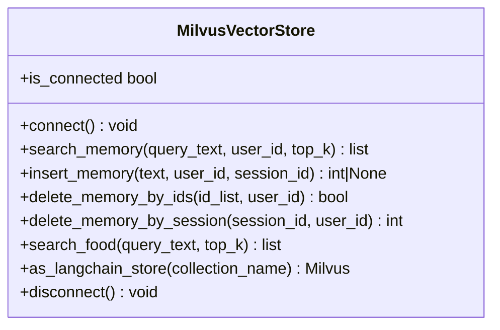
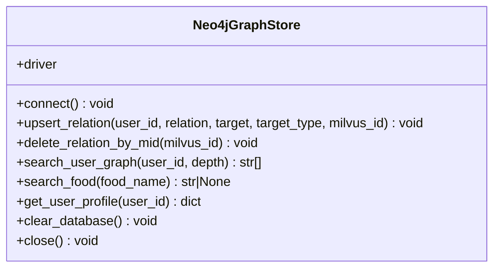
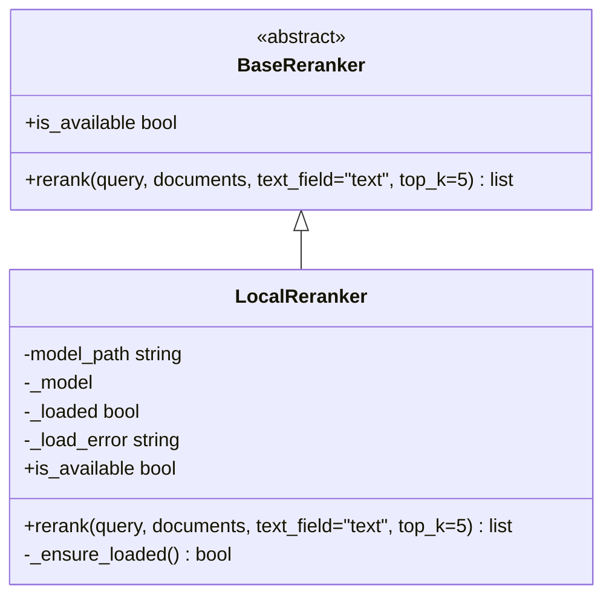
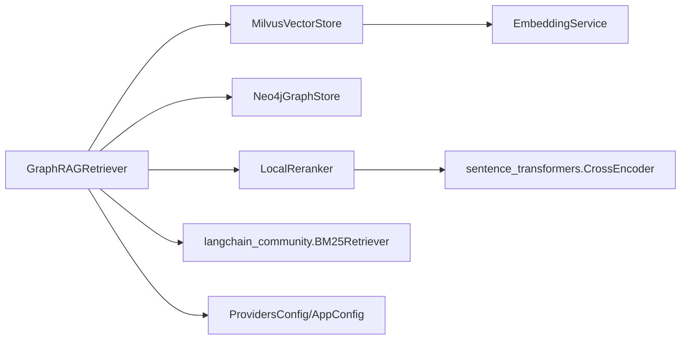

# GraphRAG 三路融合检索器

<cite>
**本文引用的文件**   
- [retriever.py](file://backend_design/nexus/rag/retriever.py)
- [vector_store.py](file://backend_design/nexus/rag/vector_store.py)
- [graph_store.py](file://backend_design/nexus/rag/graph_store.py)
- [reranker.py](file://backend_design/nexus/rag/reranker.py)
- [reranker_base.py](file://backend_design/nexus/rag/reranker_base.py)
- [embedding.py](file://backend_design/nexus/rag/embedding.py)
- [vector_factory.py](file://backend_design/nexus/rag/vector_factory.py)
- [graph_factory.py](file://backend_design/nexus/rag/graph_factory.py)
- [reranker_factory.py](file://backend_design/nexus/rag/reranker_factory.py)
- [database.py](file://backend_design/nexus/config/database.py)
- [providers.py](file://backend_design/nexus/config/providers.py)
- [__init__.py](file://backend_design/nexus/config/__init__.py)
</cite>

## 目录
1. [简介](#简介)
2. [项目结构](#项目结构)
3. [核心组件](#核心组件)
4. [架构总览](#架构总览)
5. [详细组件分析](#详细组件分析)
6. [依赖关系分析](#依赖关系分析)
7. [性能与调优](#性能与调优)
8. [故障排查指南](#故障排查指南)
9. [结论](#结论)
10. [附录：查询示例与配置清单](#附录：查询示例与配置清单)

## 简介
本文件面向 GraphRAG 三路融合检索器，系统性阐述向量搜索（Milvus）、知识图谱（Neo4j）与 BM25 全文检索的融合机制，重点解释 RRF（Reciprocal Rank Fusion）融合排序算法的实现原理、三路召回策略、权重分配、结果去重与重排优化。文档同时覆盖中文分词处理、BM25Retriever 集成方式、RRF 融合的具体实现细节，并提供查询示例、性能调优参数与故障排查建议，帮助读者快速理解并高效使用该系统。

## 项目结构
GraphRAG 检索相关代码集中在 backend_design/nexus/rag 目录下，采用“工厂 + 抽象基类 + 具体实现”的分层设计：
- 检索编排：GraphRAGRetriever 负责三路召回与 RRF 融合、可选 Rerank 后处理
- 向量存储：MilvusVectorStore 管理 Milvus 集合与语义检索
- 图谱存储：Neo4jGraphStore 封装 Neo4j 图查询与关系维护
- 重排服务：LocalReranker 基于 BGE CrossEncoder 对候选结果二次排序
- 嵌入服务：EmbeddingService 统一文本向量化接口
- 工厂模块：分别构建向量、图谱与重排实例，屏蔽 Provider 差异
- 配置中心：集中管理 Milvus、Neo4j、Provider 开关等关键参数

图表来源
- [retriever.py:48-189](file://backend_design/nexus/rag/retriever.py#L48-L189)
- [vector_store.py:36-417](file://backend_design/nexus/rag/vector_store.py#L36-L417)
- [graph_store.py:26-184](file://backend_design/nexus/rag/graph_store.py#L26-L184)
- [reranker.py:34-148](file://backend_design/nexus/rag/reranker.py#L34-L148)
- [embedding.py:23-63](file://backend_design/nexus/rag/embedding.py#L23-L63)
- [vector_factory.py:21-34](file://backend_design/nexus/rag/vector_factory.py#L21-L34)
- [graph_factory.py:20-28](file://backend_design/nexus/rag/graph_factory.py#L20-L28)
- [reranker_factory.py:45-59](file://backend_design/nexus/rag/reranker_factory.py#L45-L59)
- [__init__.py:84-167](file://backend_design/nexus/config/__init__.py#L84-L167)
- [providers.py:15-47](file://backend_design/nexus/config/providers.py#L15-L47)

章节来源
- [retriever.py:1-189](file://backend_design/nexus/rag/retriever.py#L1-L189)
- [vector_store.py:1-417](file://backend_design/nexus/rag/vector_store.py#L1-L417)
- [graph_store.py:1-184](file://backend_design/nexus/rag/graph_store.py#L1-L184)
- [reranker.py:1-148](file://backend_design/nexus/rag/reranker.py#L1-L148)
- [embedding.py:1-63](file://backend_design/nexus/rag/embedding.py#L1-L63)
- [vector_factory.py:1-34](file://backend_design/nexus/rag/vector_factory.py#L1-L34)
- [graph_factory.py:1-28](file://backend_design/nexus/rag/graph_factory.py#L1-L28)
- [reranker_factory.py:1-59](file://backend_design/nexus/rag/reranker_factory.py#L1-L59)
- [database.py:15-61](file://backend_design/nexus/config/database.py#L15-L61)
- [providers.py:15-47](file://backend_design/nexus/config/providers.py#L15-L47)
- [__init__.py:84-167](file://backend_design/nexus/config/__init__.py#L84-L167)

## 核心组件
- GraphRAGRetriever：协调三路召回（向量、图谱、BM25），执行 RRF 融合与可选 Rerank，返回 Top-K 结果
- MilvusVectorStore：封装 Milvus 集合初始化、维度校验、索引创建与语义检索（用户记忆、食材库）
- Neo4jGraphStore：封装 Neo4j 连接、约束与索引、关系 upsert、路径查询与食材匹配
- LocalReranker：加载本地 BGE CrossEncoder，对候选结果进行相关性打分并重排
- EmbeddingService：统一文本向量化接口，内部委托 LangChain Embeddings
- 工厂与配置：通过 build_* 函数与 AppConfig/ProvidersConfig 控制 Provider 选择与运行参数

章节来源
- [retriever.py:48-189](file://backend_design/nexus/rag/retriever.py#L48-L189)
- [vector_store.py:36-417](file://backend_design/nexus/rag/vector_store.py#L36-L417)
- [graph_store.py:26-184](file://backend_design/nexus/rag/graph_store.py#L26-L184)
- [reranker.py:34-148](file://backend_design/nexus/rag/reranker.py#L34-L148)
- [embedding.py:23-63](file://backend_design/nexus/rag/embedding.py#L23-L63)
- [vector_factory.py:21-34](file://backend_design/nexus/rag/vector_factory.py#L21-L34)
- [graph_factory.py:20-28](file://backend_design/nexus/rag/graph_factory.py#L20-L28)
- [reranker_factory.py:45-59](file://backend_design/nexus/rag/reranker_factory.py#L45-L59)
- [database.py:15-61](file://backend_design/nexus/config/database.py#L15-L61)
- [providers.py:15-47](file://backend_design/nexus/config/providers.py#L15-L47)

## 架构总览
GraphRAG 检索流程以 GraphRAGRetriever 为入口，并行或串行调用向量、图谱与 BM25 检索，随后通过 RRF 融合去重与排序，最后可经 Rerank 提升精度。

图表来源
- [retriever.py:128-140](file://backend_design/nexus/rag/retriever.py#L128-L140)
- [vector_store.py:201-231](file://backend_design/nexus/rag/vector_store.py#L201-L231)
- [embedding.py:36-48](file://backend_design/nexus/rag/embedding.py#L36-L48)
- [graph_store.py:102-132](file://backend_design/nexus/rag/graph_store.py#L102-L132)
- [reranker.py:79-139](file://backend_design/nexus/rag/reranker.py#L79-L139)

## 详细组件分析

### 三路召回与 RRF 融合
- 向量路：MilvusVectorStore.search_memory 基于用户 ID 过滤，按 IP 相似度检索，返回 text/score/timestamp 等字段
- 图谱路：Neo4jGraphStore.search_user_graph 支持 1 阶与多阶关系遍历，返回结构化路径字符串
- BM25 路：延迟初始化 langchain_community.BM25Retriever，使用自定义中文分词 preprocess_func；由于 BM25Retriever 不直接返回分数，代码以 rank 近似构造 score
- RRF 融合：_rrf_fuse 将三路结果按文本内容去重，累加 1/(k+rank+1) 得分，最终按 rrf_score 降序排列

图表来源
- [retriever.py:150-182](file://backend_design/nexus/rag/retriever.py#L150-L182)

章节来源
- [retriever.py:128-189](file://backend_design/nexus/rag/retriever.py#L128-L189)
- [vector_store.py:201-231](file://backend_design/nexus/rag/vector_store.py#L201-L231)
- [graph_store.py:102-132](file://backend_design/nexus/rag/graph_store.py#L102-L132)

### 中文分词与 BM25Retriever 集成
- 自定义分词函数优先使用 jieba 切分中文，英文按空格提取；若未安装 jieba，则降级为逐字切分
- BM25Retriever.from_documents 使用上述分词函数作为 preprocess_func，确保中文检索质量
- 初始化失败或缺失依赖时，自动禁用 BM25 并记录日志

图表来源
- [retriever.py:34-45](file://backend_design/nexus/rag/retriever.py#L34-L45)
- [retriever.py:89-108](file://backend_design/nexus/rag/retriever.py#L89-L108)

章节来源
- [retriever.py:34-45](file://backend_design/nexus/rag/retriever.py#L34-L45)
- [retriever.py:89-108](file://backend_design/nexus/rag/retriever.py#L89-L108)

### 向量检索（Milvus）
- 集合初始化：Food_List 与 User_Memory，包含向量维度检查与字段存在性检测，必要时重建集合
- 索引与搜索：HNSW 索引，IP 度量，search_params 控制 ef；User_Memory 额外建立 user_id/session_id 的 Trie 索引
- 领域接口：search_memory 支持 user_id 过滤；search_food 返回食材类别信息

图表来源
- [vector_store.py:36-417](file://backend_design/nexus/rag/vector_store.py#L36-L417)

章节来源
- [vector_store.py:106-200](file://backend_design/nexus/rag/vector_store.py#L106-L200)
- [vector_store.py:201-231](file://backend_design/nexus/rag/vector_store.py#L201-L231)
- [vector_store.py:326-358](file://backend_design/nexus/rag/vector_store.py#L326-L358)

### 图谱检索（Neo4j）
- 连接与约束：使用 langchain_neo4j.Neo4jGraph，自动管理连接池与 schema；初始化唯一性与名称索引
- 关系操作：upsert_relation 绑定 Milvus ID 以便跨库关联；支持按 mid 删除关系
- 查询能力：search_user_graph 支持 1 阶与多阶路径；search_food 精确匹配 Food 节点

图表来源
- [graph_store.py:26-184](file://backend_design/nexus/rag/graph_store.py#L26-L184)

章节来源
- [graph_store.py:60-68](file://backend_design/nexus/rag/graph_store.py#L60-L68)
- [graph_store.py:73-89](file://backend_design/nexus/rag/graph_store.py#L73-L89)
- [graph_store.py:102-132](file://backend_design/nexus/rag/graph_store.py#L102-L132)
- [graph_store.py:134-144](file://backend_design/nexus/rag/graph_store.py#L134-L144)

### 重排服务（LocalReranker）
- 模型加载：延迟加载 BAAI/bge-reranker-v2-m3，首次约 2 秒，后续 CPU 推理约 200ms/20 条
- 推理流程：构建 (query, doc) 对，批量 predict，按分数排序并添加 rerank_score
- 可用性判断：is_available 不触发加载，仅检查模型路径与错误状态

图表来源
- [reranker_base.py:17-50](file://backend_design/nexus/rag/reranker_base.py#L17-L50)
- [reranker.py:34-148](file://backend_design/nexus/rag/reranker.py#L34-L148)

章节来源
- [reranker.py:52-78](file://backend_design/nexus/rag/reranker.py#L52-L78)
- [reranker.py:79-139](file://backend_design/nexus/rag/reranker.py#L79-L139)

### 嵌入服务（EmbeddingService）
- 统一接口：embed、embed_async、embed_batch、close
- 内部实现：委托 LangChain OpenAIEmbeddings，具备连接池、重试与异步能力
- 异常处理：失败时抛出 LLMError 并记录日志

章节来源
- [embedding.py:23-63](file://backend_design/nexus/rag/embedding.py#L23-L63)

### 工厂与配置
- 向量工厂：固定返回 MilvusVectorStore
- 图谱工厂：固定返回 Neo4jGraphStore
- 重排工厂：根据 providers.reranker 选择 local 或 none（NoneReranker）
- 配置中心：AppConfig 聚合所有子配置；MilvusConfig/Neo4jConfig 提供连接与索引参数；ProvidersConfig 提供 provider 开关

章节来源
- [vector_factory.py:21-34](file://backend_design/nexus/rag/vector_factory.py#L21-L34)
- [graph_factory.py:20-28](file://backend_design/nexus/rag/graph_factory.py#L20-L28)
- [reranker_factory.py:45-59](file://backend_design/nexus/rag/reranker_factory.py#L45-L59)
- [__init__.py:84-167](file://backend_design/nexus/config/__init__.py#L84-L167)
- [database.py:15-61](file://backend_design/nexus/config/database.py#L15-L61)
- [providers.py:15-47](file://backend_design/nexus/config/providers.py#L15-L47)

## 依赖关系分析
- GraphRAGRetriever 依赖向量、图谱、重排与嵌入服务；BM25Retriever 按需延迟初始化
- MilvusVectorStore 依赖 EmbeddingService 与 MilvusClient；Neo4jGraphStore 依赖 langchain_neo4j.Neo4jGraph
- LocalReranker 依赖 sentence_transformers.CrossEncoder；工厂与配置决定运行时行为

图表来源
- [retriever.py:48-189](file://backend_design/nexus/rag/retriever.py#L48-L189)
- [vector_store.py:36-417](file://backend_design/nexus/rag/vector_store.py#L36-L417)
- [graph_store.py:26-184](file://backend_design/nexus/rag/graph_store.py#L26-L184)
- [reranker.py:34-148](file://backend_design/nexus/rag/reranker.py#L34-L148)
- [providers.py:15-47](file://backend_design/nexus/config/providers.py#L15-L47)

章节来源
- [retriever.py:48-189](file://backend_design/nexus/rag/retriever.py#L48-L189)
- [vector_store.py:36-417](file://backend_design/nexus/rag/vector_store.py#L36-L417)
- [graph_store.py:26-184](file://backend_design/nexus/rag/graph_store.py#L26-L184)
- [reranker.py:34-148](file://backend_design/nexus/rag/reranker.py#L34-L148)
- [providers.py:15-47](file://backend_design/nexus/config/providers.py#L15-L47)

## 性能与调优
- 向量检索
  - index_params：增大 M、efConstruction 可提升建索引质量与召回率，但增加内存与时间
  - search_params.ef：增大 ef 提高召回精度，代价是查询延迟上升
  - 维度一致性：启动时自动检查向量维度，不一致会重建集合，避免隐式错误
- 图谱检索
  - depth：1 阶查询更快，多阶路径适合深度推理但耗时增长
  - 索引：entity name 与 user id 唯一约束保障查询效率
- BM25 检索
  - 分词：jieba 优先，缺失时回退逐字切分；建议安装 jieba 以获得更好效果
  - 初始化失败：自动禁用 BM25，不影响其他两路
- 重排
  - 模型路径：确保 models/reranker/bge-reranker-v2-m3 存在；CPU 推理约 200ms/20 条
  - 可选 none：在资源紧张场景关闭重排以提升吞吐
- 总体策略
  - 适当放大 top_k（如向量路 top_k*4）再 RRF 融合，有助于提升最终 Top-K 质量
  - 仅在候选数大于 top_k 时触发 Rerank，减少不必要开销

章节来源
- [vector_store.py:106-200](file://backend_design/nexus/rag/vector_store.py#L106-L200)
- [vector_store.py:201-231](file://backend_design/nexus/rag/vector_store.py#L201-L231)
- [graph_store.py:102-132](file://backend_design/nexus/rag/graph_store.py#L102-L132)
- [reranker.py:52-78](file://backend_design/nexus/rag/reranker.py#L52-L78)
- [retriever.py:128-140](file://backend_design/nexus/rag/retriever.py#L128-L140)

## 故障排查指南
- 连接问题
  - Milvus：连接失败抛出 VectorStoreError，检查 uri、端口与网络连通性
  - Neo4j：连接失败抛出 GraphStoreError，检查 uri、用户名与密码
- 维度不匹配
  - 启动时检测集合维度，若不匹配将重建集合；确认 embedding_dim 与索引一致
- BM25 不可用
  - 缺少 langchain-community 或初始化异常会禁用 BM25；安装依赖或检查环境
- 重排模型缺失
  - 模型路径不存在或导入失败会记录警告并回退原顺序；确认模型路径与依赖
- 会话清理
  - delete_memory_by_session 支持按 session_id 与 user_id 双重校验删除，避免误删

章节来源
- [vector_store.py:45-57](file://backend_design/nexus/rag/vector_store.py#L45-L57)
- [vector_store.py:106-146](file://backend_design/nexus/rag/vector_store.py#L106-L146)
- [vector_store.py:279-324](file://backend_design/nexus/rag/vector_store.py#L279-L324)
- [graph_store.py:40-58](file://backend_design/nexus/rag/graph_store.py#L40-L58)
- [reranker.py:59-77](file://backend_design/nexus/rag/reranker.py#L59-L77)
- [retriever.py:89-108](file://backend_design/nexus/rag/retriever.py#L89-L108)

## 结论
GraphRAG 三路融合检索器通过向量、图谱与 BM25 的互补召回，结合 RRF 融合与可选 Rerank，兼顾召回广度与排序精度。系统采用工厂与抽象基类解耦 Provider，配置驱动灵活切换。通过合理调参与故障排查，可在不同部署环境下获得稳定高效的检索体验。

## 附录：查询示例与配置清单
- 查询示例
  - 检索用户记忆：调用 retrieve_memories(query, user_id, top_k=5, graph_depth=1)，返回融合后的 Top-K 文本
  - 检索食材：调用 retrieve_food(query, top_k=5)，优先返回向量结果并在无命中时插入图谱匹配
- 关键配置
  - Milvus：host/port/uri、集合名、index_type/metric_type/index_params/search_params
  - Neo4j：uri/user/password
  - Providers：reranker 可为 local 或 none
  - 模型路径：models/reranker/bge-reranker-v2-m3

章节来源
- [retriever.py:128-148](file://backend_design/nexus/rag/retriever.py#L128-L148)
- [database.py:15-61](file://backend_design/nexus/config/database.py#L15-L61)
- [providers.py:15-47](file://backend_design/nexus/config/providers.py#L15-L47)
- [reranker.py:27-31](file://backend_design/nexus/rag/reranker.py#L27-L31)