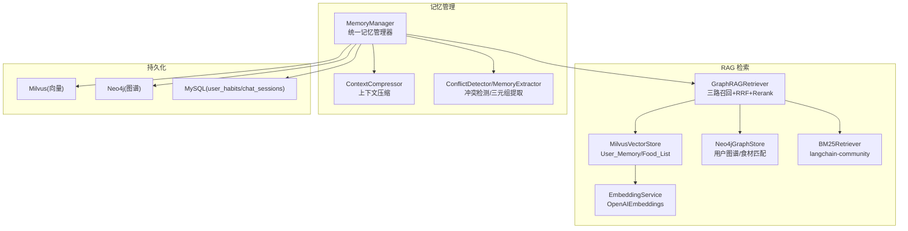
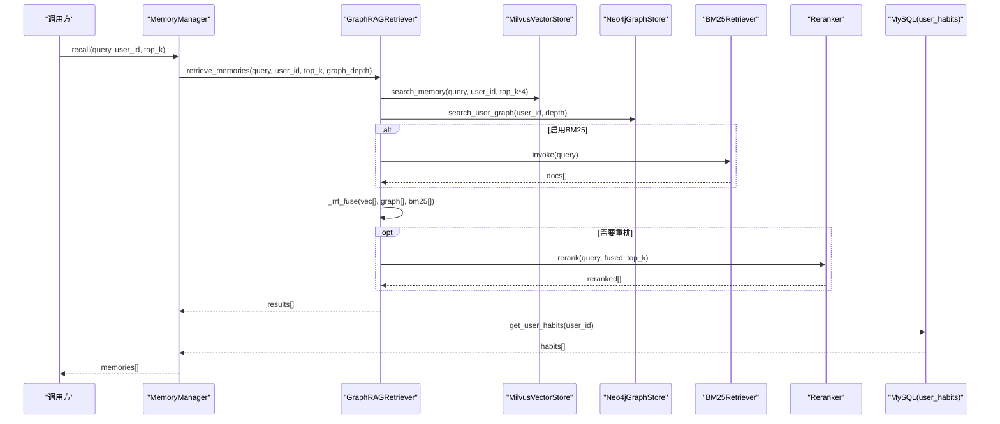
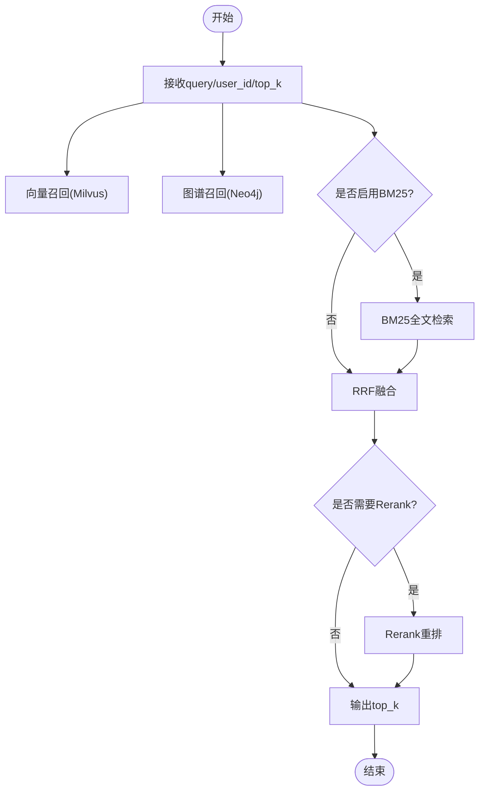
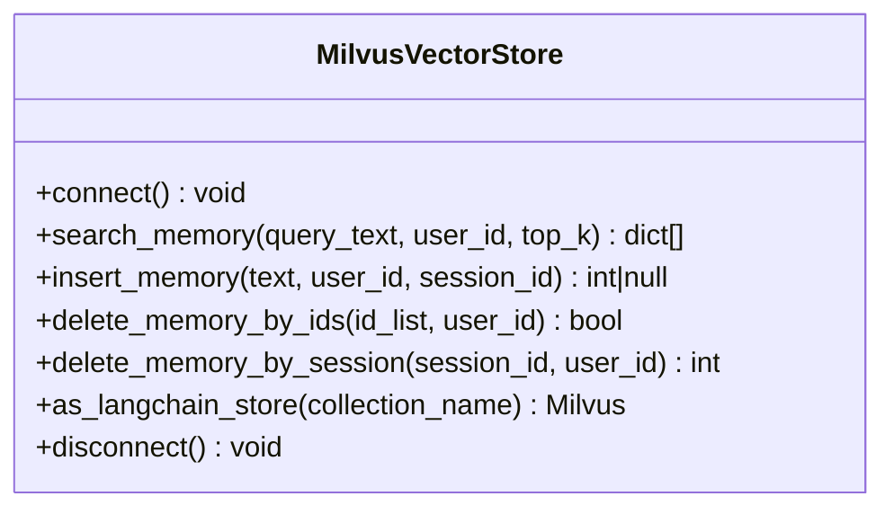
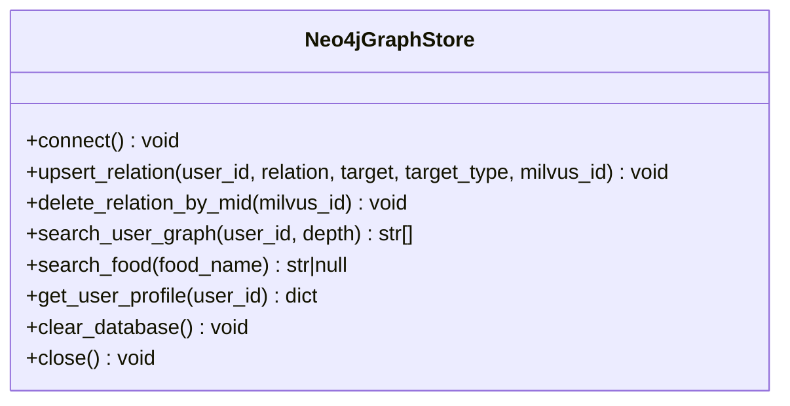
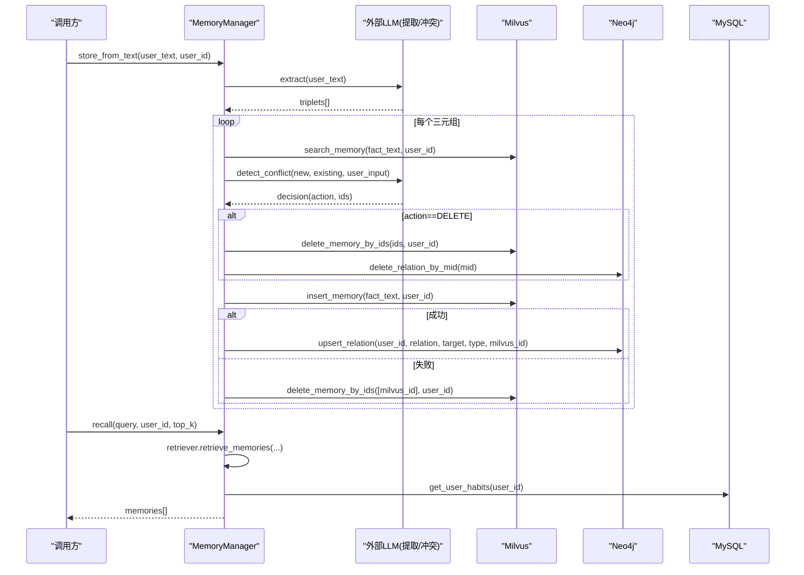
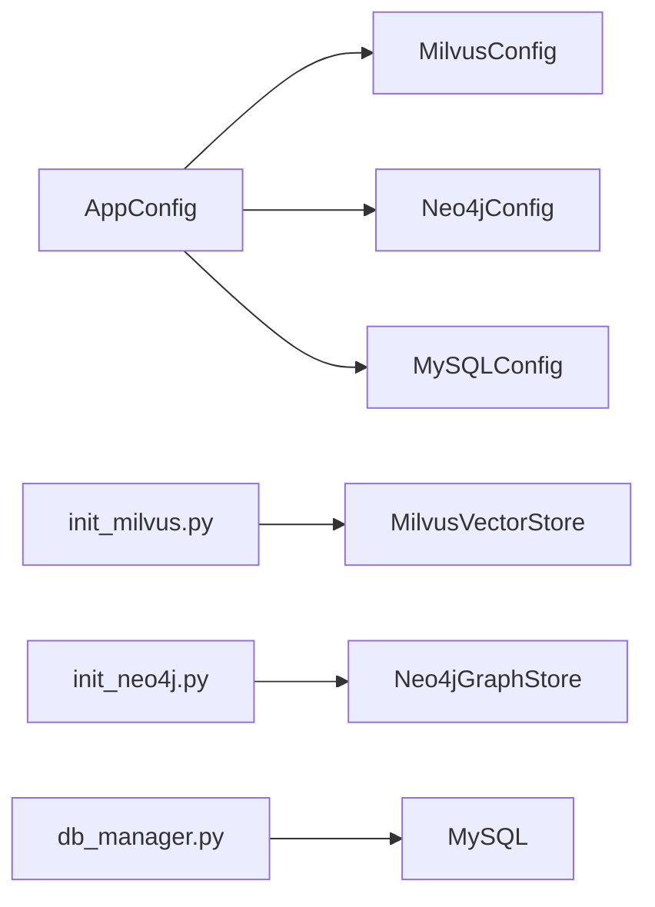

# L2 数据层

<cite>
**本文引用的文件**   
- [retriever.py](file://backend_design/nexus/rag/retriever.py)
- [vector_store.py](file://backend_design/nexus/rag/vector_store.py)
- [graph_store.py](file://backend_design/nexus/rag/graph_store.py)
- [embedding.py](file://backend_design/nexus/rag/embedding.py)
- [manager.py](file://backend_design/nexus/memory/manager.py)
- [compressor.py](file://backend_design/nexus/memory/compressor.py)
- [conflict.py](file://backend_design/nexus/memory/conflict.py)
- [__init__.py](file://backend_design/nexus/memory/__init__.py)
- [data.py](file://backend_design/nexus/config/data.py)
- [database.py](file://backend_design/nexus/config/database.py)
- [__init__.py](file://backend_design/nexus/config/__init__.py)
- [db_manager.py](file://backend_design/nexus/core/db_manager.py)
- [init_milvus.py](file://backend_design/scripts/init_milvus.py)
- [init_neo4j.py](file://backend_design/scripts/init_neo4j.py)
</cite>

## 目录
1. [引言](#引言)
2. [项目结构](#项目结构)
3. [核心组件](#核心组件)
4. [架构总览](#架构总览)
5. [详细组件分析](#详细组件分析)
6. [依赖关系分析](#依赖关系分析)
7. [性能考量与优化](#性能考量与优化)
8. [故障排查指南](#故障排查指南)
9. [结论](#结论)
10. [附录：查询示例与最佳实践](#附录：查询示例与最佳实践)

## 引言
本文件面向 NexusCockpit 的 L2 数据层，系统性阐述 GraphRAG 三路融合检索（向量搜索 + 知识图谱 + BM25 全文检索）的实现原理与集成方式，覆盖向量存储（Milvus）、图数据库（Neo4j）、全文检索（BM25）的接入、记忆系统的管理机制（压缩、冲突解决、生命周期管理、性能优化），以及数据访问模式、缓存策略、索引优化和数据一致性保证。文档同时提供可操作的查询示例、性能调优建议与故障排查指南，帮助读者快速理解并高效使用该系统。

## 项目结构
L2 数据层由 RAG 检索与记忆管理两大模块构成：
- RAG 检索模块：负责向量检索（Milvus）、图谱检索（Neo4j）、BM25 全文检索与融合排序（RRF）、重排（Rerank）。
- 记忆管理模块：负责用户记忆的提取、冲突检测、双向写入（Milvus + Neo4j）、会话级清理、上下文压缩与渐进式披露。

图表来源
- [retriever.py:48-189](file://backend_design/nexus/rag/retriever.py#L48-L189)
- [vector_store.py:36-200](file://backend_design/nexus/rag/vector_store.py#L36-L200)
- [graph_store.py:26-184](file://backend_design/nexus/rag/graph_store.py#L26-L184)
- [embedding.py:23-63](file://backend_design/nexus/rag/embedding.py#L23-L63)
- [manager.py:38-150](file://backend_design/nexus/memory/manager.py#L38-L150)
- [compressor.py:36-120](file://backend_design/nexus/memory/compressor.py#L36-L120)
- [conflict.py:23-85](file://backend_design/nexus/memory/conflict.py#L23-L85)

章节来源
- [retriever.py:1-189](file://backend_design/nexus/rag/retriever.py#L1-L189)
- [vector_store.py:1-417](file://backend_design/nexus/rag/vector_store.py#L1-L417)
- [graph_store.py:1-184](file://backend_design/nexus/rag/graph_store.py#L1-L184)
- [embedding.py:1-63](file://backend_design/nexus/rag/embedding.py#L1-L63)
- [manager.py:1-583](file://backend_design/nexus/memory/manager.py#L1-L583)
- [compressor.py:1-395](file://backend_design/nexus/memory/compressor.py#L1-L395)
- [conflict.py:1-159](file://backend_design/nexus/memory/conflict.py#L1-L159)
- [__init__.py:1-24](file://backend_design/nexus/memory/__init__.py#L1-L24)

## 核心组件
- GraphRAGRetriever：实现三路召回（向量、图谱、BM25），RRF 融合排序，可选 Rerank 重排。
- MilvusVectorStore：维护 User_Memory 与 Food_List 两个集合，支持按 user_id/session_id 过滤检索与删除。
- Neo4jGraphStore：维护用户图谱关系，支持 N 阶关系遍历与食物精确匹配。
- EmbeddingService：统一文本向量化服务，基于 OpenAIEmbeddings，提供单条/批量/异步接口。
- MemoryManager：统一记忆管理器，协调三路召回、渐进式披露、习惯注入、会话级清理与双向写入一致性。
- ContextCompressor：上下文动态压缩引擎，阈值压缩、滚动摘要、关键信息提取与查询增强。
- ConflictDetector/MemoryExtractor：记忆冲突检测与结构化三元组提取，保障长期记忆一致性。

章节来源
- [retriever.py:48-189](file://backend_design/nexus/rag/retriever.py#L48-L189)
- [vector_store.py:36-200](file://backend_design/nexus/rag/vector_store.py#L36-L200)
- [graph_store.py:26-184](file://backend_design/nexus/rag/graph_store.py#L26-L184)
- [embedding.py:23-63](file://backend_design/nexus/rag/embedding.py#L23-L63)
- [manager.py:38-150](file://backend_design/nexus/memory/manager.py#L38-L150)
- [compressor.py:36-120](file://backend_design/nexus/memory/compressor.py#L36-L120)
- [conflict.py:23-85](file://backend_design/nexus/memory/conflict.py#L23-L85)

## 架构总览
GraphRAG 三路融合检索流程如下：
- 输入 query 经 EmbeddingService 生成向量，进入 Milvus 语义检索；
- 同时通过 Neo4j 进行图谱关系召回；
- 若启用 BM25，则对文档库进行分词与全文匹配；
- 三路结果经 RRF 融合排序，再经 Rerank 重排输出最终候选集；
- MemoryManager 在此基础上进行渐进式披露、习惯注入与格式化处理。

图表来源
- [manager.py:98-150](file://backend_design/nexus/memory/manager.py#L98-L150)
- [retriever.py:128-189](file://backend_design/nexus/rag/retriever.py#L128-L189)
- [vector_store.py:201-231](file://backend_design/nexus/rag/vector_store.py#L201-L231)
- [graph_store.py:102-132](file://backend_design/nexus/rag/graph_store.py#L102-L132)
- [db_manager.py:285-299](file://backend_design/nexus/core/db_manager.py#L285-L299)

## 详细组件分析

### GraphRAGRetriever（三路融合检索器）
- 三路召回：
  - 向量路：Milvus 语义相似度召回，返回 text/score/source。
  - 图谱路：Neo4j 关系遍历召回，返回字符串列表。
  - BM25路：langchain_community.BM25Retriever 全文匹配，支持中文分词（jieba 优先，降级按字切分）。
- 融合策略：RRF（Reciprocal Rank Fusion）将三路结果合并为统一分数。
- 后处理：可选 bge-reranker-v2-m3 重排提升相关性。
- 容错：BM25 初始化失败自动禁用 BM25 路径。

图表来源
- [retriever.py:48-189](file://backend_design/nexus/rag/retriever.py#L48-L189)

章节来源
- [retriever.py:1-189](file://backend_design/nexus/rag/retriever.py#L1-L189)

### MilvusVectorStore（向量存储）
- 集合设计：
  - Food_List：食材知识库，字段包含 item_name/category/cate_1/2/3 等。
  - User_Memory：用户长期记忆，字段包含 user_id/session_id/vector/text/timestamp。
- 索引策略：
  - 向量索引：HNSW，metric_type=IP，参数 M/efConstruction。
  - 元数据索引：user_id/session_id 使用 Trie 索引加速过滤。
- 操作能力：
  - insert_memory：插入记忆并返回主键 ID。
  - search_memory：按 user_id 过滤的语义检索。
  - delete_memory_by_ids / delete_memory_by_session：安全删除（支持会话级清理）。
  - as_langchain_store：暴露 LangChain 标准接口用于通用检索。

图表来源
- [vector_store.py:36-200](file://backend_design/nexus/rag/vector_store.py#L36-L200)

章节来源
- [vector_store.py:1-417](file://backend_design/nexus/rag/vector_store.py#L1-L417)

### Neo4jGraphStore（知识图谱存储）
- 约束与索引：
  - User.id 唯一约束。
  - Entity.name 索引。
- 主要能力：
  - upsert_relation：MERGE 用户与实体关系，绑定 Milvus ID（mid）与时间戳。
  - search_user_graph：N 阶关系遍历，返回路径或一阶关系。
  - search_food：精确匹配食材名称。
  - get_user_profile：获取用户完整画像（含 mid 关联）。
  - clear_database：开发环境清空（谨慎使用）。

图表来源
- [graph_store.py:26-184](file://backend_design/nexus/rag/graph_store.py#L26-L184)

章节来源
- [graph_store.py:1-184](file://backend_design/nexus/rag/graph_store.py#L1-L184)

### EmbeddingService（统一向量化服务）
- 基于 langchain_openai.OpenAIEmbeddings，提供：
  - embed：单条文本向量化。
  - embed_batch：批量向量化。
  - embed_async：异步别名。
- 错误处理：异常抛出 LLMError，便于上层统一捕获。

章节来源
- [embedding.py:1-63](file://backend_design/nexus/rag/embedding.py#L1-L63)

### MemoryManager（统一记忆管理器）
- 职责：
  - 协调三路召回（GraphRAGRetriever）。
  - 渐进式披露：根据 query 复杂度调整 top_k（简单指令 3 条，复杂查询 8 条）。
  - 习惯注入：从 MySQL user_habits 加载高频偏好。
  - 双向写入：Milvus + Neo4j 一致性（失败回滚）。
  - 会话级清理：定时任务清理过期 session_id 向量。
- 关键方法：
  - recall：记忆召回（含 Rerank）。
  - store_from_text：三元组提取 → 冲突检测 → 双向写入。
  - store_conversation：对话向量化存储（过滤短指令）。
  - start_cleanup_task / cleanup_expired_session_vectors：后台清理。

图表来源
- [manager.py:212-300](file://backend_design/nexus/memory/manager.py#L212-L300)
- [manager.py:98-150](file://backend_design/nexus/memory/manager.py#L98-L150)
- [conflict.py:30-85](file://backend_design/nexus/memory/conflict.py#L30-L85)

章节来源
- [manager.py:1-583](file://backend_design/nexus/memory/manager.py#L1-L583)

### ContextCompressor（上下文压缩引擎）
- 功能：
  - 阈值压缩：当历史超过阈值时，旧对话压缩为滚动摘要。
  - 关键信息提取：正则匹配位置/偏好/身份，零 LLM 调用。
  - 查询增强：模糊查询自动补充位置/偏好。
  - 分级预算组装：Level 0-3 逐步压缩检索上下文、历史、记忆。
- 配置：
  - compress_threshold_turns、keep_recent_turns、max_summary_chars、context_token_ratio、context_token_hard_cap。

章节来源
- [compressor.py:1-395](file://backend_design/nexus/memory/compressor.py#L1-L395)
- [data.py:47-63](file://backend_design/nexus/config/data.py#L47-L63)

### ConflictDetector 与 MemoryExtractor（冲突检测与三元组提取）
- MemoryExtractor：从用户输入提取结构化三元组（LIKES/DISLIKES/ALLERGY/HABIT/IS_A/LIVES_IN/STATUS）。
- ConflictDetector：基于原始对话与新提取信息，判定 DELETE/IGNORE/NONE，并返回需删除的 ID 列表。

章节来源
- [conflict.py:87-159](file://backend_design/nexus/memory/conflict.py#L87-L159)
- [conflict.py:23-85](file://backend_design/nexus/memory/conflict.py#L23-L85)

## 依赖关系分析
- 配置中心：
  - AppConfig 聚合所有子系统配置（LLM/Milvus/Neo4j/MySQL/Redis 等）。
  - MilvusConfig/Neo4jConfig/MySQLConfig 定义连接参数与默认值。
- 初始化脚本：
  - init_milvus.py：创建/重建 Milvus 集合与索引。
  - init_neo4j.py：创建 Neo4j 约束与索引。
- 数据库管理：
  - db_manager.py：MySQL 连接池、表迁移、用户习惯读取等。

图表来源
- [__init__.py:84-132](file://backend_design/nexus/config/__init__.py#L84-L132)
- [database.py:15-61](file://backend_design/nexus/config/database.py#L15-L61)
- [init_milvus.py:21-47](file://backend_design/scripts/init_milvus.py#L21-L47)
- [init_neo4j.py:18-34](file://backend_design/scripts/init_neo4j.py#L18-L34)
- [db_manager.py:40-104](file://backend_design/nexus/core/db_manager.py#L40-L104)

章节来源
- [__init__.py:1-167](file://backend_design/nexus/config/__init__.py#L1-L167)
- [database.py:1-61](file://backend_design/nexus/config/database.py#L1-L61)
- [init_milvus.py:1-54](file://backend_design/scripts/init_milvus.py#L1-L54)
- [init_neo4j.py:1-39](file://backend_design/scripts/init_neo4j.py#L1-L39)
- [db_manager.py:1-120](file://backend_design/nexus/core/db_manager.py#L1-L120)

## 性能考量与优化
- 向量检索优化：
  - HNSW 索引参数 M/efConstruction 与搜索 ef 调优，平衡召回率与延迟。
  - 使用 user_id/session_id 的 Trie 索引加速过滤。
  - 批量 embedding 减少 API 调用次数。
- 图谱检索优化：
  - 限制 graph_depth（默认 1），避免深度遍历开销。
  - 使用 entity_name_index 加速精确匹配。
- BM25 优化：
  - 自定义中文分词（jieba 优先），提升召回质量。
  - 按需启用 BM25，降低初始化成本。
- 记忆管理优化：
  - 渐进式披露：简单指令 top_k=3，复杂查询 top_k=8。
  - 会话级清理：定期删除过期 session_id 向量，控制存储膨胀。
  - 阈值压缩：滚动摘要控制上下文长度，避免 LLM 超窗。
- 一致性保障：
  - 双向写入补偿回滚：Neo4j 失败时回滚 Milvus 记录。
  - 冲突检测：显式终止/状态变更/属性冲突自动删除旧记忆。

[本节为通用指导，不直接分析具体文件]

## 故障排查指南
- Milvus 连接/集合问题：
  - 检查 uri/host/port 配置是否正确。
  - 运行 init_milvus.py --rebuild 重建集合（切换 embedding 维度时必需）。
  - 查看日志中“Collection dim mismatch”提示，确认 embedding_dim 一致。
- Neo4j 连接/约束问题：
  - 检查 uri/user/password 配置。
  - 运行 init_neo4j.py 创建约束与索引。
  - 健康检查可通过 graph_store.driver 探测底层驱动状态。
- BM25 不可用：
  - 确认已安装 langchain-community。
  - 初始化失败会自动禁用 BM25，检查日志警告。
- 记忆写入不一致：
  - 检查 Neo4j 写入失败后的回滚日志。
  - 确认 conflict detection 返回的 action 与 ids 正确。
- 会话清理未生效：
  - 确认 start_cleanup_task 已在启动事件中调用。
  - 检查 MySQL chat_sessions 有效 session_id 列表。
  - 查看 Milvus 清理日志与 orphaned session vectors 数量。

章节来源
- [vector_store.py:45-57](file://backend_design/nexus/rag/vector_store.py#L45-L57)
- [init_milvus.py:21-47](file://backend_design/scripts/init_milvus.py#L21-L47)
- [graph_store.py:40-58](file://backend_design/nexus/rag/graph_store.py#L40-L58)
- [init_neo4j.py:18-34](file://backend_design/scripts/init_neo4j.py#L18-L34)
- [retriever.py:89-108](file://backend_design/nexus/rag/retriever.py#L89-L108)
- [manager.py:278-296](file://backend_design/nexus/memory/manager.py#L278-L296)
- [manager.py:473-583](file://backend_design/nexus/memory/manager.py#L473-L583)

## 结论
NexusCockpit 的 L2 数据层以 GraphRAG 三路融合检索为核心，结合 Milvus 向量检索、Neo4j 图谱检索与 BM25 全文检索，实现了高召回、高相关性的记忆检索体系。记忆管理系统通过冲突检测、双向写入一致性、会话级清理与上下文压缩，保障了长期记忆的质量与系统性能。通过合理的索引优化、渐进式披露与容错机制，系统在车载场景下具备高可用性与可扩展性。

[本节为总结性内容，不直接分析具体文件]

## 附录：查询示例与最佳实践
- 记忆召回示例：
  - 调用 MemoryManager.recall(query="我喜欢吃辣", user_id="user_01", top_k=5)，返回带标签的记忆字符串列表。
- 食材检索示例：
  - 调用 GraphRAGRetriever.retrieve_food(query="麻婆豆腐")，返回向量与图谱融合结果。
- 记忆存储示例：
  - 调用 MemoryManager.store_from_text(user_text="我不吃香菜，我对花生过敏", user_id="user_01")，自动提取三元组并写入 Milvus + Neo4j。
- 会话清理示例：
  - 调用 MemoryManager.delete_session_memories(session_id="session_123", user_id="user_01")，删除该会话的对话向量。
- 最佳实践：
  - 合理设置 top_k 与 graph_depth，平衡召回质量与延迟。
  - 在启动时调用 start_cleanup_task，定期清理过期会话向量。
  - 切换 embedding 模型后，务必运行 init_milvus.py --rebuild 重建集合。
  - 监控 LLM 调用成本与 token 使用，结合 context_token_ratio 与 hard cap 控制上下文长度。

[本节为概念性指导，不直接分析具体文件]