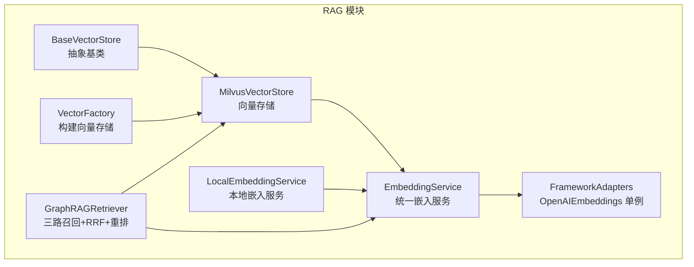
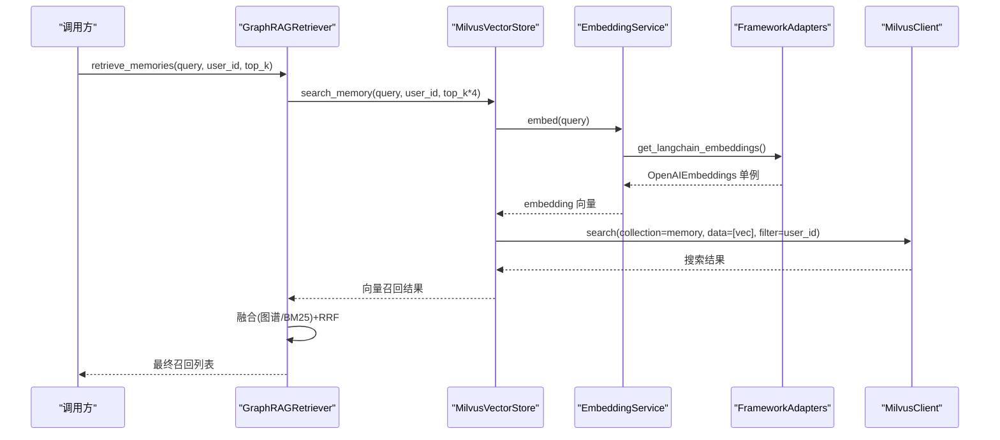
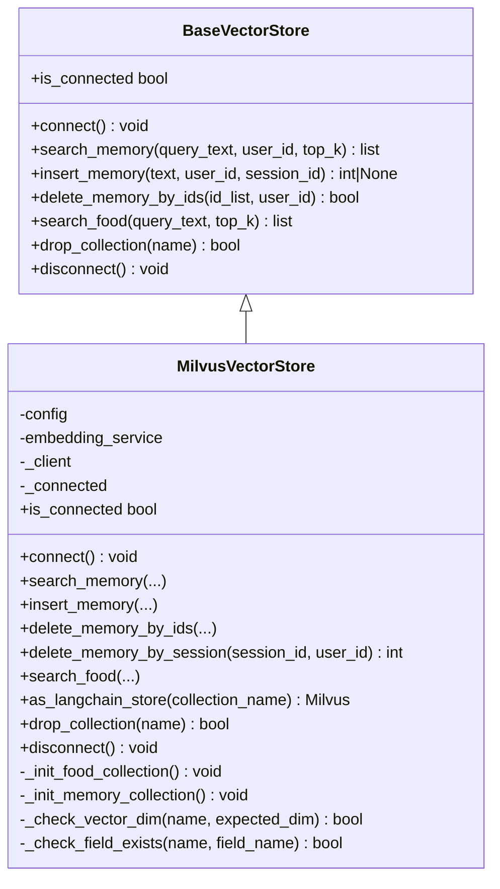
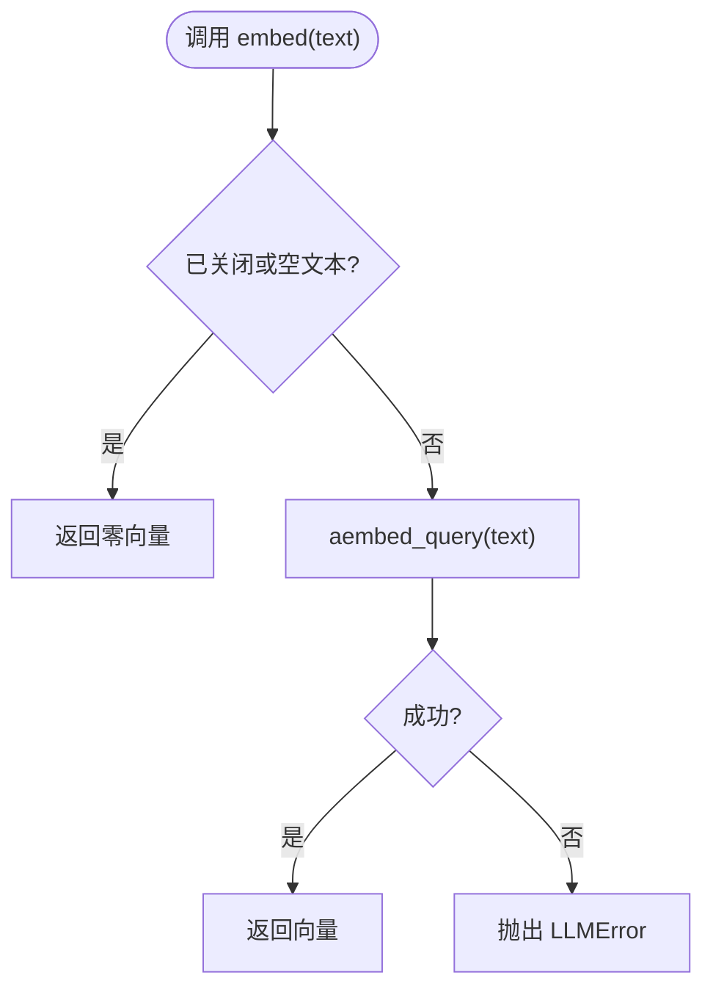
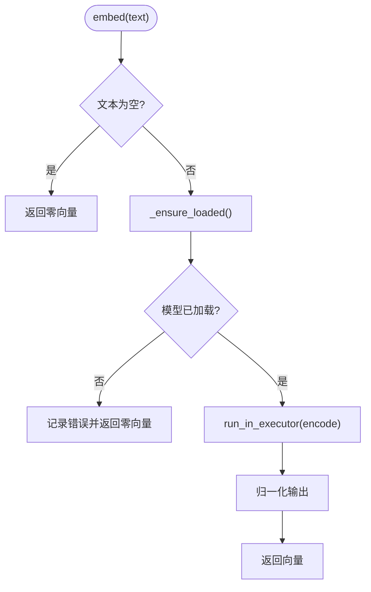
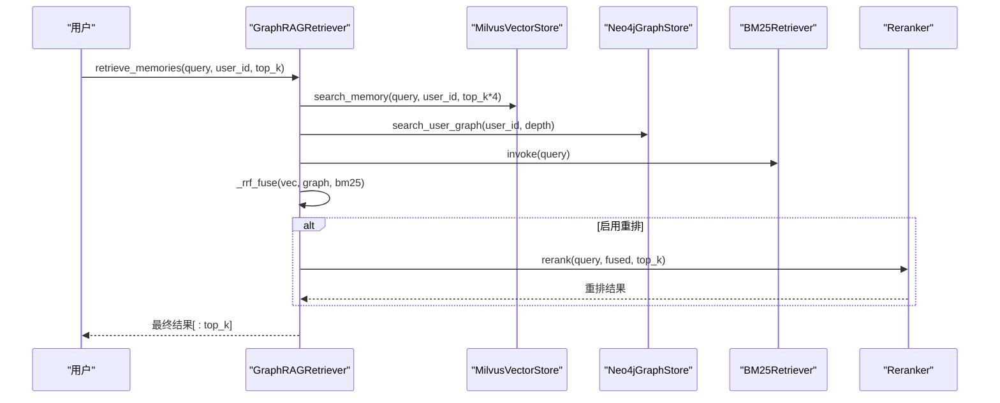
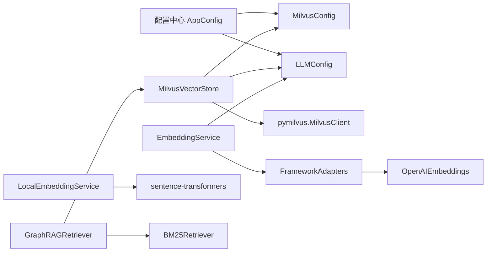
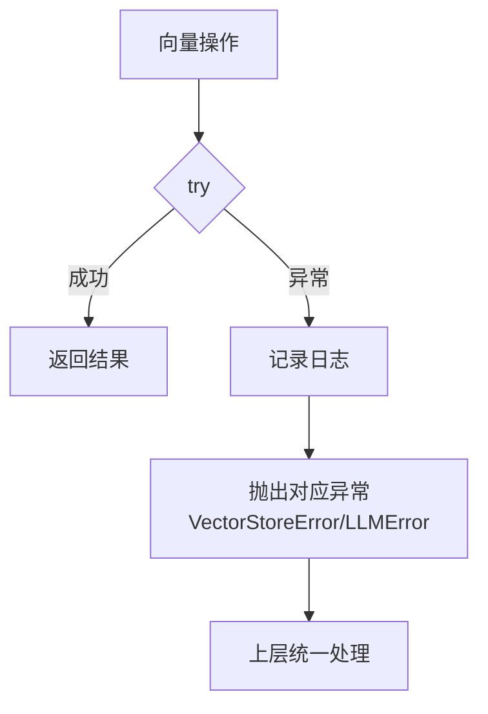

# 向量存储系统

<cite>
**本文引用的文件**   
- [vector_store.py](file://backend_design/nexus/rag/vector_store.py)
- [embedding.py](file://backend_design/nexus/rag/embedding.py)
- [local_embedding.py](file://backend_design/nexus/rag/local_embedding.py)
- [vector_base.py](file://backend_design/nexus/rag/vector_base.py)
- [vector_factory.py](file://backend_design/nexus/rag/vector_factory.py)
- [retriever.py](file://backend_design/nexus/rag/retriever.py)
- [framework_adapters.py](file://backend_design/nexus/rag/framework_adapters.py)
- [database.py](file://backend_design/nexus/config/database.py)
- [llm.py](file://backend_design/nexus/config/llm.py)
- [__init__.py](file://backend_design/nexus/config/__init__.py)
- [exceptions.py](file://backend_design/nexus/core/exceptions.py)
</cite>

## 目录
1. [简介](#简介)
2. [项目结构](#项目结构)
3. [核心组件](#核心组件)
4. [架构总览](#架构总览)
5. [详细组件分析](#详细组件分析)
6. [依赖关系分析](#依赖关系分析)
7. [性能与索引优化](#性能与索引优化)
8. [故障排查与错误处理](#故障排查与错误处理)
9. [结论](#结论)
10. [附录：API 使用示例与基准建议](#附录api-使用示例与基准建议)

## 简介
本文件面向向量存储系统的实现与使用，重点覆盖 Milvus 向量数据库集成、EmbeddingService 本地与云端嵌入服务、向量索引构建、相似度搜索、批量操作、连接管理、数据生命周期、索引优化、查询调优与错误处理。文档同时给出调用流程、类图与流程图，帮助读者快速理解并高效使用该系统。

## 项目结构
RAG 相关代码集中在 backend_design/nexus/rag 目录下，围绕“向量存储 + 检索器 + 嵌入服务”的三层解耦设计展开：
- 向量存储层：抽象接口 BaseVectorStore 与 MilvusVectorStore 实现，提供集合初始化、插入、删除、搜索、LangChain 适配等能力。
- 嵌入服务层：统一 EmbeddingService（云端 OpenAIEmbeddings）与 LocalEmbeddingService（本地 bge-m3），通过框架适配器 get_langchain_embeddings 获取实例。
- 检索层：GraphRAGRetriever 融合向量、图谱与 BM25 三路召回，并使用 RRF 融合与重排。

图表来源
- [vector_store.py:36-417](file://backend_design/nexus/rag/vector_store.py#L36-L417)
- [vector_base.py:22-76](file://backend_design/nexus/rag/vector_base.py#L22-L76)
- [embedding.py:23-63](file://backend_design/nexus/rag/embedding.py#L23-L63)
- [local_embedding.py:32-182](file://backend_design/nexus/rag/local_embedding.py#L32-L182)
- [framework_adapters.py:30-67](file://backend_design/nexus/rag/framework_adapters.py#L30-L67)
- [vector_factory.py:21-34](file://backend_design/nexus/rag/vector_factory.py#L21-L34)
- [retriever.py:48-189](file://backend_design/nexus/rag/retriever.py#L48-L189)

章节来源
- [vector_store.py:1-417](file://backend_design/nexus/rag/vector_store.py#L1-L417)
- [vector_base.py:1-76](file://backend_design/nexus/rag/vector_base.py#L1-L76)
- [embedding.py:1-63](file://backend_design/nexus/rag/embedding.py#L1-L63)
- [local_embedding.py:1-182](file://backend_design/nexus/rag/local_embedding.py#L1-L182)
- [vector_factory.py:1-34](file://backend_design/nexus/rag/vector_factory.py#L1-L34)
- [retriever.py:1-189](file://backend_design/nexus/rag/retriever.py#L1-L189)
- [framework_adapters.py:1-67](file://backend_design/nexus/rag/framework_adapters.py#L1-L67)

## 核心组件
- MilvusVectorStore：基于 pymilvus 3.x MilvusClient API，维护两个集合 Food_List（食材知识库）与 User_Memory（用户记忆）。负责连接、集合创建/加载、维度校验、字段迁移检测、索引参数化、搜索、插入、删除、LangChain 适配等。
- BaseVectorStore：定义统一的向量存储接口，屏蔽后端差异，便于替换或扩展。
- EmbeddingService：统一文本向量化服务，内部委托 langchain_openai.OpenAIEmbeddings，支持异步、批量、重试与连接池。
- LocalEmbeddingService：本地 sentence-transformers + bge-m3 模型，自动 CPU/GPU/MPS 设备选择，支持批量化与零向量兜底。
- VectorFactory：固定返回本地 Milvus 实例，简化上层构造。
- GraphRAGRetriever：三路召回（向量、图谱、BM25）+ RRF 融合 + 可选重排，封装检索入口。

章节来源
- [vector_store.py:36-417](file://backend_design/nexus/rag/vector_store.py#L36-L417)
- [vector_base.py:22-76](file://backend_design/nexus/rag/vector_base.py#L22-L76)
- [embedding.py:23-63](file://backend_design/nexus/rag/embedding.py#L23-L63)
- [local_embedding.py:32-182](file://backend_design/nexus/rag/local_embedding.py#L32-L182)
- [vector_factory.py:21-34](file://backend_design/nexus/rag/vector_factory.py#L21-L34)
- [retriever.py:48-189](file://backend_design/nexus/rag/retriever.py#L48-L189)

## 架构总览
下图展示从检索请求到向量库与嵌入服务的完整调用链，以及 LangChain 适配路径。

图表来源
- [retriever.py:128-149](file://backend_design/nexus/rag/retriever.py#L128-L149)
- [vector_store.py:201-231](file://backend_design/nexus/rag/vector_store.py#L201-L231)
- [embedding.py:36-48](file://backend_design/nexus/rag/embedding.py#L36-L48)
- [framework_adapters.py:30-59](file://backend_design/nexus/rag/framework_adapters.py#L30-L59)

## 详细组件分析

### MilvusVectorStore（向量存储实现）
- 连接与幂等初始化：connect() 检查已连接状态，避免重复连接；失败抛出 VectorStoreError。
- 集合初始化：_init_food_collection() 与 _init_memory_collection() 负责 schema 创建、索引参数配置、集合加载；当维度不匹配或缺少 session_id 字段时自动重建。
- 维度与字段校验：_check_vector_dim() 与 _check_field_exists() 保障 schema 一致性，防止误删。
- 搜索与写入：search_memory()/search_food() 使用 MilvusClient.search；insert_memory() 写入用户记忆并记录时间戳；delete_memory_by_ids()/delete_memory_by_session() 提供安全删除与会话级清理。
- LangChain 适配：as_langchain_store() 返回 langchain_milvus.Milvus 实例，用于通用 RAG 检索。
- 资源管理：disconnect()/is_connected 属性管理连接状态。

图表来源
- [vector_base.py:22-76](file://backend_design/nexus/rag/vector_base.py#L22-L76)
- [vector_store.py:36-417](file://backend_design/nexus/rag/vector_store.py#L36-L417)

章节来源
- [vector_store.py:45-200](file://backend_design/nexus/rag/vector_store.py#L45-L200)
- [vector_store.py:201-325](file://backend_design/nexus/rag/vector_store.py#L201-L325)
- [vector_store.py:360-417](file://backend_design/nexus/rag/vector_store.py#L360-L417)

### EmbeddingService（统一嵌入服务）
- 内部委托 langchain_openai.OpenAIEmbeddings，具备连接池、自动重试、异步与批量能力。
- 接口保持向后兼容：embed()/embed_batch()/embed_async()/close()。
- 异常处理：失败时记录日志并抛出 LLMError。

图表来源
- [embedding.py:36-58](file://backend_design/nexus/rag/embedding.py#L36-L58)

章节来源
- [embedding.py:23-63](file://backend_design/nexus/rag/embedding.py#L23-L63)

### LocalEmbeddingService（本地嵌入服务）
- 基于 sentence-transformers 与 bge-m3 模型，默认维度 1024。
- 延迟加载模型，自动检测 CPU/GPU/MPS 设备。
- 同步 encode 通过 run_in_executor 非阻塞执行，支持批量编码。
- 空输入或模型未加载时返回零向量，保证稳定性。

图表来源
- [local_embedding.py:108-134](file://backend_design/nexus/rag/local_embedding.py#L108-L134)
- [local_embedding.py:136-164](file://backend_design/nexus/rag/local_embedding.py#L136-L164)

章节来源
- [local_embedding.py:32-182](file://backend_design/nexus/rag/local_embedding.py#L32-L182)

### GraphRAGRetriever（检索器）
- 三路召回：向量（Milvus）、图谱（Neo4j）、BM25（langchain_community.BM25Retriever）。
- 融合策略：RRF（Reciprocal Rank Fusion），对多路结果按排名倒数求和排序。
- 重排：可选 bge-reranker-v2-m3 重排提升相关性。
- 连接与关闭：connect() 初始化向量与图谱存储；close() 释放资源。

图表来源
- [retriever.py:128-189](file://backend_design/nexus/rag/retriever.py#L128-L189)

章节来源
- [retriever.py:48-189](file://backend_design/nexus/rag/retriever.py#L48-L189)

### FrameworkAdapters（框架适配层）
- 提供 get_langchain_embeddings() 全局单例，封装 OpenAIEmbeddings 配置（模型、API Key、base_url、dimensions、超时、重试）。
- 支持重置单例以热更新配置。

章节来源
- [framework_adapters.py:30-67](file://backend_design/nexus/rag/framework_adapters.py#L30-L67)

### VectorFactory（向量存储工厂）
- 固定返回 MilvusVectorStore 实例，简化上层构造逻辑。

章节来源
- [vector_factory.py:21-34](file://backend_design/nexus/rag/vector_factory.py#L21-L34)

## 依赖关系分析
- 配置依赖：MilvusConfig（host/port/uri/collection/index/search_params）、LLMConfig（embedding_model/dim/base_url/api_key/provider）。
- 运行时依赖：pymilvus（MilvusClient）、langchain_openai（OpenAIEmbeddings）、sentence-transformers（本地模型）、langchain-community（BM25Retriever）。
- 异常体系：VectorStoreError、LLMError、NexusError 基类等。

图表来源
- [database.py:15-29](file://backend_design/nexus/config/database.py#L15-L29)
- [llm.py:15-72](file://backend_design/nexus/config/llm.py#L15-L72)
- [vector_store.py:36-58](file://backend_design/nexus/rag/vector_store.py#L36-L58)
- [embedding.py:30-35](file://backend_design/nexus/rag/embedding.py#L30-L35)
- [framework_adapters.py:46-59](file://backend_design/nexus/rag/framework_adapters.py#L46-L59)
- [local_embedding.py:68-83](file://backend_design/nexus/rag/local_embedding.py#L68-L83)
- [retriever.py:94-108](file://backend_design/nexus/rag/retriever.py#L94-L108)

章节来源
- [database.py:15-29](file://backend_design/nexus/config/database.py#L15-L29)
- [llm.py:15-72](file://backend_design/nexus/config/llm.py#L15-L72)
- [__init__.py:84-167](file://backend_design/nexus/config/__init__.py#L84-L167)
- [exceptions.py:56-61](file://backend_design/nexus/core/exceptions.py#L56-L61)

## 性能与索引优化
- 索引类型与参数：
  - 向量索引：HNSW，index_params={"M": 16, "efConstruction": 200}，search_params={"ef": 64}。
  - 记忆集合额外为 user_id、session_id 建立 Trie 索引，加速过滤与范围查询。
- 维度一致性：启动时校验集合向量维度与配置 embedding_dim 一致，不一致则重建集合，避免检索失败。
- 批量操作：
  - EmbeddingService.embed_batch() 支持批量向量化，减少网络往返。
  - LocalEmbeddingService.encode(batch_size=...) 支持批量编码，降低 CPU 开销。
- 连接复用：
  - MilvusVectorStore.connect() 幂等连接，避免频繁重连。
  - OpenAIEmbeddings 内置连接池与重试机制。
- 检索优化：
  - GraphRAGRetriever 三路召回后 RRF 融合，减少单一通道偏差。
  - 可选重排提升 Top-K 质量。

章节来源
- [vector_store.py:106-199](file://backend_design/nexus/rag/vector_store.py#L106-L199)
- [embedding.py:50-58](file://backend_design/nexus/rag/embedding.py#L50-L58)
- [local_embedding.py:136-164](file://backend_design/nexus/rag/local_embedding.py#L136-L164)
- [retriever.py:150-182](file://backend_design/nexus/rag/retriever.py#L150-L182)

## 故障排查与错误处理
- 连接失败：MilvusVectorStore.connect() 捕获异常并抛出 VectorStoreError，记录 URI 与错误信息。
- 嵌入失败：EmbeddingService.embed() 捕获异常并抛出 LLMError，记录失败原因。
- 搜索失败：search_memory()/search_food() 捕获异常并记录日志，返回空结果以保证调用方稳定。
- 删除失败：delete_memory_by_ids()/delete_memory_by_session() 捕获异常并记录日志，返回 False/0。
- 异常体系：所有自定义异常继承 NexusError，包含 code 与 details，便于前端与监控统一处理。

图表来源
- [vector_store.py:45-57](file://backend_design/nexus/rag/vector_store.py#L45-L57)
- [embedding.py:36-48](file://backend_design/nexus/rag/embedding.py#L36-L48)
- [exceptions.py:56-61](file://backend_design/nexus/core/exceptions.py#L56-L61)

章节来源
- [vector_store.py:45-57](file://backend_design/nexus/rag/vector_store.py#L45-L57)
- [embedding.py:36-48](file://backend_design/nexus/rag/embedding.py#L36-L48)
- [exceptions.py:19-61](file://backend_design/nexus/core/exceptions.py#L19-L61)

## 结论
本向量存储系统以清晰的抽象与模块化设计，实现了 Milvus 向量库的高效集成与可扩展的嵌入服务。通过维度校验、会话级索引、批量操作与 RRF 融合，系统在准确性与性能之间取得平衡。统一的异常体系与幂等连接管理提升了鲁棒性。建议在生产环境结合业务规模调整 HNSW 参数与 batch size，并持续监控检索延迟与召回质量。

## 附录：API 使用示例与基准建议
- 初始化与连接
  - 通过 VectorFactory.build_vector_store(embedding_service) 获取 MilvusVectorStore 实例。
  - 调用 connect() 完成幂等连接与集合初始化。
- 插入与检索
  - insert_memory(text, user_id, session_id) 插入用户记忆。
  - search_memory(query_text, user_id, top_k) 检索语义记忆。
  - search_food(query_text, top_k) 检索食材库。
- 删除与清理
  - delete_memory_by_ids(id_list, user_id) 按 ID 安全删除。
  - delete_memory_by_session(session_id, user_id) 会话级清理。
- 批量与异步
  - EmbeddingService.embed_batch(texts, batch_size) 批量向量化。
  - LocalEmbeddingService.embed_batch(texts, batch_size) 本地批量编码。
- 基准测试建议
  - 指标：QPS、P95/P99 延迟、召回率（Top-K）、内存占用。
  - 场景：不同 top_k、不同 batch_size、不同 HNSW 参数对比。
  - 工具：locust 或自定义压测脚本，统计 Milvus 服务端指标与 Python 进程资源。
- 故障恢复方案
  - 连接失败：重试 connect()，检查 Milvus 服务状态与网络连通性。
  - 嵌入失败：降级到 LocalEmbeddingService（若可用），或返回零向量并告警。
  - 集合维度不匹配：自动重建集合，确保 embedding_dim 一致。

章节来源
- [vector_factory.py:21-34](file://backend_design/nexus/rag/vector_factory.py#L21-L34)
- [vector_store.py:233-325](file://backend_design/nexus/rag/vector_store.py#L233-L325)
- [embedding.py:50-58](file://backend_design/nexus/rag/embedding.py#L50-L58)
- [local_embedding.py:136-164](file://backend_design/nexus/rag/local_embedding.py#L136-L164)