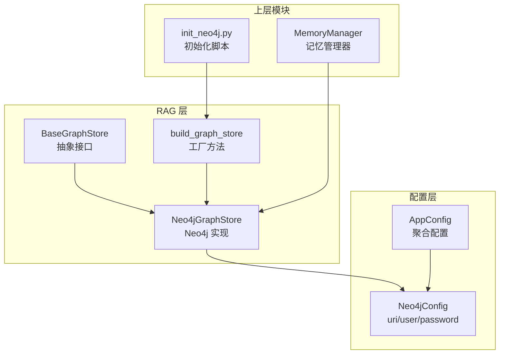
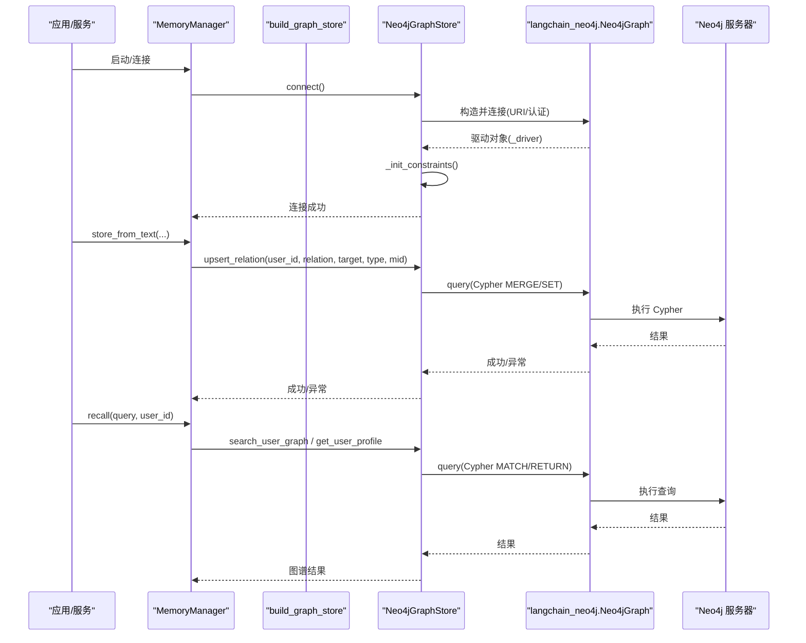
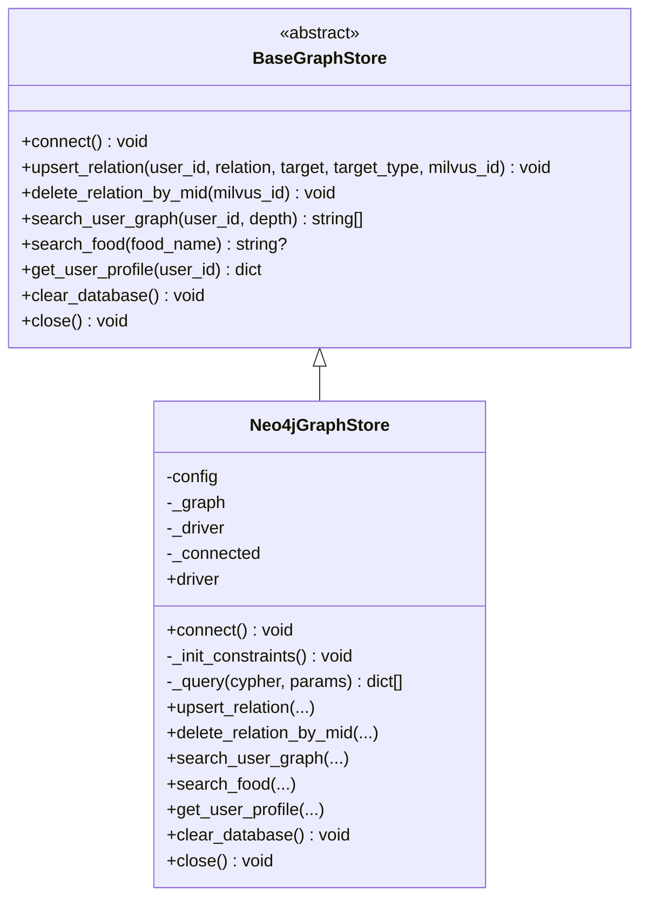
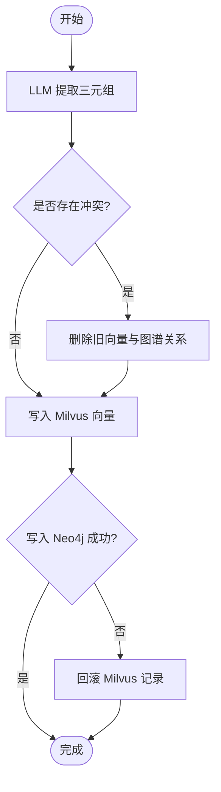
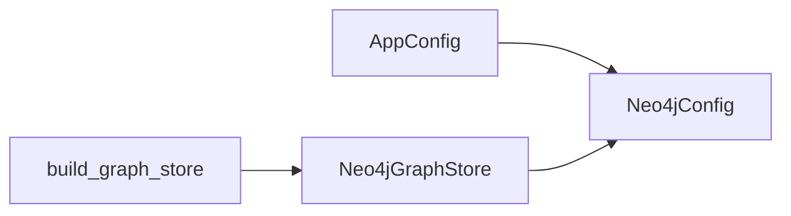
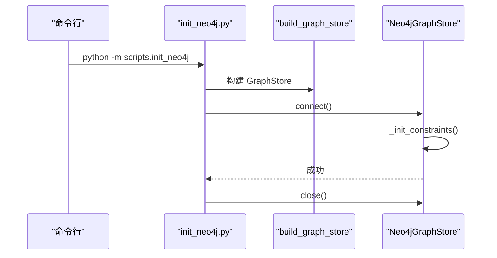
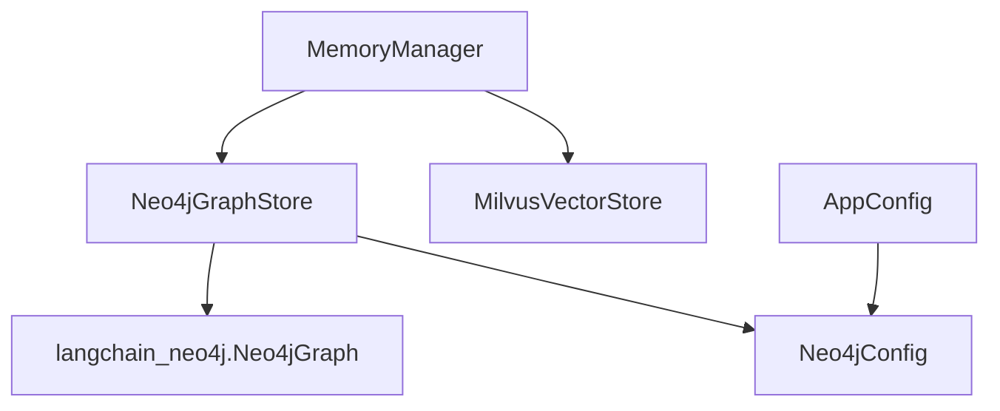

# 图数据库存储

<cite>
**本文引用的文件**   
- [graph_store.py](file://backend_design/nexus/rag/graph_store.py)
- [graph_base.py](file://backend_design/nexus/rag/graph_base.py)
- [graph_factory.py](file://backend_design/nexus/rag/graph_factory.py)
- [database.py](file://backend_design/nexus/config/database.py)
- [__init__.py](file://backend_design/nexus/config/__init__.py)
- [manager.py](file://backend_design/nexus/memory/manager.py)
- [init_neo4j.py](file://backend_design/scripts/init_neo4j.py)
</cite>

## 目录
1. [简介](#简介)
2. [项目结构](#项目结构)
3. [核心组件](#核心组件)
4. [架构总览](#架构总览)
5. [详细组件分析](#详细组件分析)
6. [依赖关系分析](#依赖关系分析)
7. [性能与一致性](#性能与一致性)
8. [故障排查指南](#故障排查指南)
9. [结论](#结论)
10. [附录：查询示例与索引策略](#附录：查询示例与索引策略)

## 简介
本文件面向 NexusCockpit 的图数据库存储子系统，聚焦 Neo4j 集成实现。内容涵盖节点与关系建模、Cypher 查询封装、事务与连接池（通过框架委托）、用户图谱构建、关系遍历、路径搜索、子图提取、增删改查操作、索引策略、查询性能调优与一致性保证，并提供可操作的查询示例、优化建议与故障排查指引。

## 项目结构
图存储相关代码集中在 RAG 层与配置层：
- 抽象接口：BaseGraphStore
- 具体实现：Neo4jGraphStore（基于 langchain_neo4j.Neo4jGraph）
- 工厂：build_graph_store（固定本地 Neo4j）
- 配置：Neo4jConfig（URI/用户名/密码）
- 初始化脚本：创建约束与索引
- 上层调用：MemoryManager 将向量与图谱联动写入与召回

**图表来源** 
- [graph_base.py:17-61](file://backend_design/nexus/rag/graph_base.py#L17-L61)
- [graph_store.py:26-184](file://backend_design/nexus/rag/graph_store.py#L26-L184)
- [graph_factory.py:20-28](file://backend_design/nexus/rag/graph_factory.py#L20-L28)
- [database.py:32-39](file://backend_design/nexus/config/database.py#L32-L39)
- [__init__.py:84-132](file://backend_design/nexus/config/__init__.py#L84-L132)
- [manager.py:66-96](file://backend_design/nexus/memory/manager.py#L66-L96)
- [init_neo4j.py:18-34](file://backend_design/scripts/init_neo4j.py#L18-L34)

**章节来源**
- [graph_base.py:17-61](file://backend_design/nexus/rag/graph_base.py#L17-L61)
- [graph_store.py:26-184](file://backend_design/nexus/rag/graph_store.py#L26-L184)
- [graph_factory.py:20-28](file://backend_design/nexus/rag/graph_factory.py#L20-L28)
- [database.py:32-39](file://backend_design/nexus/config/database.py#L32-L39)
- [__init__.py:84-132](file://backend_design/nexus/config/__init__.py#L84-L132)
- [manager.py:66-96](file://backend_design/nexus/memory/manager.py#L66-L96)
- [init_neo4j.py:18-34](file://backend_design/scripts/init_neo4j.py#L18-L34)

## 核心组件
- 抽象接口 BaseGraphStore：定义 connect、upsert_relation、delete_relation_by_mid、search_user_graph、search_food、get_user_profile、clear_database、close 等统一方法。
- Neo4jGraphStore：基于 langchain_neo4j.Neo4jGraph 封装连接、约束/索引初始化、Cypher 执行、用户图谱检索、画像获取、清库与关闭。
- 工厂 build_graph_store：固定返回本地 Neo4j 实例，简化提供者切换。
- 配置 Neo4jConfig：提供 uri、user、password，默认值便于本地开发。
- MemoryManager：在记忆写入时进行“向量 + 图谱”双向写入与补偿回滚，保障一致性；在召回阶段使用 GraphRAGRetriever 三路融合（向量+图谱+BM25）。

**章节来源**
- [graph_base.py:17-61](file://backend_design/nexus/rag/graph_base.py#L17-L61)
- [graph_store.py:26-184](file://backend_design/nexus/rag/graph_store.py#L26-L184)
- [graph_factory.py:20-28](file://backend_design/nexus/rag/graph_factory.py#L20-L28)
- [database.py:32-39](file://backend_design/nexus/config/database.py#L32-L39)
- [manager.py:66-96](file://backend_design/nexus/memory/manager.py#L66-L96)

## 架构总览
下图展示从应用层到 Neo4j 的数据流与控制流，包括连接建立、约束初始化、读写路径与清理流程。

**图表来源** 
- [graph_store.py:40-68](file://backend_design/nexus/rag/graph_store.py#L40-L68)
- [graph_store.py:73-132](file://backend_design/nexus/rag/graph_store.py#L73-L132)
- [graph_store.py:146-166](file://backend_design/nexus/rag/graph_store.py#L146-L166)
- [manager.py:212-300](file://backend_design/nexus/memory/manager.py#L212-L300)
- [manager.py:98-150](file://backend_design/nexus/memory/manager.py#L98-L150)

## 详细组件分析

### Neo4jGraphStore 类分析
- 连接管理：懒加载连接，幂等；暴露底层 driver 供健康检查。
- 约束与索引：首次连接时创建 User.id 唯一约束与 Entity.name 索引。
- 关系写入：MERGE 用户与目标实体，建立关系并绑定 Milvus ID 与时间戳。
- 关系删除：按 Milvus ID 删除对应关系边。
- 图谱检索：支持 1 阶与 N 阶路径展开，返回关系类型、目标名称与标签。
- 食材检索：按名称匹配 Food 节点。
- 用户画像：拉取用户出边关系集合，包含关系名、目标名、类型与 mid。
- 清库与关闭：仅用于开发环境；关闭释放底层驱动。

**图表来源** 
- [graph_base.py:17-61](file://backend_design/nexus/rag/graph_base.py#L17-L61)
- [graph_store.py:26-184](file://backend_design/nexus/rag/graph_store.py#L26-L184)

**章节来源**
- [graph_store.py:26-184](file://backend_design/nexus/rag/graph_store.py#L26-L184)

### MemoryManager 与 Neo4j 的协作
- 写入路径：先写 Milvus 向量，再写 Neo4j 关系；若 Neo4j 失败则回滚 Milvus 记录，确保一致性。
- 冲突处理：对喜好类额外检测过敏记忆，必要时删除旧记录后再写入新记录。
- 召回路径：GraphRAGRetriever 三路召回（向量+图谱+BM25），Rerank 重排后渐进式披露 top_k。
- 会话清理：后台任务定期清理过期会话级向量（Milvus），不影响用户级图谱记忆。

**图表来源** 
- [manager.py:212-300](file://backend_design/nexus/memory/manager.py#L212-L300)

**章节来源**
- [manager.py:212-300](file://backend_design/nexus/memory/manager.py#L212-L300)

### 工厂与配置
- 工厂：固定返回本地 Neo4j 实例，避免运行时选择分支。
- 配置：Neo4jConfig 提供 URI、用户名、密码；AppConfig 聚合所有子系统配置。

**图表来源** 
- [graph_factory.py:20-28](file://backend_design/nexus/rag/graph_factory.py#L20-L28)
- [database.py:32-39](file://backend_design/nexus/config/database.py#L32-L39)
- [__init__.py:84-132](file://backend_design/nexus/config/__init__.py#L84-L132)

**章节来源**
- [graph_factory.py:20-28](file://backend_design/nexus/rag/graph_factory.py#L20-L28)
- [database.py:32-39](file://backend_design/nexus/config/database.py#L32-L39)
- [__init__.py:84-132](file://backend_design/nexus/config/__init__.py#L84-L132)

### 初始化脚本
- 用途：运行一次以创建约束与索引，确保后续写入与查询性能。
- 流程：读取配置 → 构建 GraphStore → 连接 → 初始化约束/索引 → 关闭。

**图表来源** 
- [init_neo4j.py:18-34](file://backend_design/scripts/init_neo4j.py#L18-L34)
- [graph_store.py:60-68](file://backend_design/nexus/rag/graph_store.py#L60-L68)

**章节来源**
- [init_neo4j.py:18-34](file://backend_design/scripts/init_neo4j.py#L18-L34)

## 依赖关系分析
- Neo4jGraphStore 依赖 langchain_neo4j.Neo4jGraph 作为驱动与连接池管理。
- MemoryManager 依赖 Neo4jGraphStore 与 MilvusVectorStore，形成“向量 + 图谱”双后端。
- 配置层通过 AppConfig 聚合 Neo4jConfig，供各模块统一读取。

**图表来源** 
- [manager.py:66-96](file://backend_design/nexus/memory/manager.py#L66-L96)
- [graph_store.py:40-55](file://backend_design/nexus/rag/graph_store.py#L40-L55)
- [database.py:32-39](file://backend_design/nexus/config/database.py#L32-L39)
- [__init__.py:84-132](file://backend_design/nexus/config/__init__.py#L84-L132)

**章节来源**
- [manager.py:66-96](file://backend_design/nexus/memory/manager.py#L66-L96)
- [graph_store.py:40-55](file://backend_design/nexus/rag/graph_store.py#L40-L55)
- [database.py:32-39](file://backend_design/nexus/config/database.py#L32-L39)
- [__init__.py:84-132](file://backend_design/nexus/config/__init__.py#L84-L132)

## 性能与一致性
- 连接池与事务
  - 连接池：由 langchain_neo4j.Neo4jGraph 内部维护，自动复用连接，减少握手开销。
  - 事务：通过框架委托的 session/query 机制执行 Cypher；复杂写入建议在业务层控制事务边界（如批量 MERGE/DELETE）。
- 索引与约束
  - 唯一约束：User.id 唯一约束，保障用户标识一致性。
  - 普通索引：Entity.name 索引，加速按名称查找。
  - 建议：对高频查询字段（如 Food.name、Entity.name）建立索引；对多条件组合查询考虑复合索引或规范化模型。
- 查询优化
  - 限制深度：search_user_graph 的 depth 参数需合理设置，避免全图遍历。
  - 选择性过滤：在 MATCH 中尽早加入 WHERE 条件，减少中间结果集。
  - 分页与限流：对大结果集采用 LIMIT 与分批读取。
- 一致性保证
  - 双向写入补偿：先写向量，再写图谱；若图谱失败则回滚向量，避免脏数据。
  - 冲突裁决：对喜好/过敏等敏感领域进行冲突检测与合并策略。
- 资源与监控
  - 日志：连接失败、写入失败、清库等操作均有日志输出，便于定位问题。
  - 健康检查：通过暴露的 driver 属性检查连接状态。

[本节为通用指导，不直接分析具体文件]

## 故障排查指南
- 连接失败
  - 现象：connect() 抛出异常，日志显示连接失败。
  - 排查：检查 NEO4J_URI/NEO4J_USER/NEO4J_PASSWORD 是否正确；确认 Neo4j 服务可达与端口开放。
  - 参考：连接逻辑与错误日志位置。
- 约束/索引缺失
  - 现象：写入时报唯一性冲突或查询慢。
  - 排查：运行 init_neo4j.py 初始化约束与索引；确认 _init_constraints 已执行。
- 写入不一致
  - 现象：Milvus 有记录但 Neo4j 无关系。
  - 排查：查看 MemoryManager 的回滚日志；确认 Neo4j 写入是否抛错；必要时手动补写或删除孤儿向量。
- 图谱检索为空
  - 现象：search_user_graph/get_user_profile 返回空。
  - 排查：确认用户节点存在且关系已建立；检查 depth 参数与 Cypher 条件；验证标签与属性名大小写。
- 清库误用
  - 现象：生产环境数据丢失。
  - 排查：clear_database 仅用于开发环境；严禁在生产调用。

**章节来源**
- [graph_store.py:40-58](file://backend_design/nexus/rag/graph_store.py#L40-L58)
- [graph_store.py:60-68](file://backend_design/nexus/rag/graph_store.py#L60-L68)
- [graph_store.py:168-177](file://backend_design/nexus/rag/graph_store.py#L168-L177)
- [manager.py:272-296](file://backend_design/nexus/memory/manager.py#L272-L296)

## 结论
NexusCockpit 的图数据库存储子系统以抽象接口 + 具体实现的解耦设计，结合 langchain_neo4j 的连接池与查询能力，实现了稳定高效的 Neo4j 集成。通过 MemoryManager 的双向写入与补偿回滚，保障了向量与图谱的一致性；配合合理的索引与查询策略，满足图谱检索与路径探索的性能需求。建议在部署前执行初始化脚本，并在生产环境严格限制清库操作。

[本节为总结，不直接分析具体文件]

## 附录：查询示例与索引策略

### 常用 Cypher 查询示例（概念性）
- 插入/更新关系（含 Milvus ID）
  - 模式：MERGE (u:User {id}) MERGE (t:Type {name}) MERGE (u)-[r:RELATION]->(t) SET r.mid, r.timestamp
  - 说明：幂等写入，避免重复边；绑定 mid 以便联动删除。
- 按用户 N 阶关系展开
  - 模式：MATCH path = (u:User {id})-[r*1..depth]->(t) RETURN ...
  - 说明：depth 越大开销越高，建议按需限制。
- 按名称查找实体
  - 模式：MATCH (e:Entity {name}) RETURN e
  - 说明：依赖 Entity.name 索引。
- 获取用户画像
  - 模式：MATCH (u:User {id})-[r]->(t) RETURN type(r), t.name, labels(t), coalesce(r.mid,-1)
  - 说明：返回关系集合，便于前端渲染。
- 删除关系（按 mid）
  - 模式：MATCH (u:User)-[r]->(t) WHERE r.mid = $mid DELETE r
  - 说明：与向量库删除保持一致。

[本节为概念性示例，不直接分析具体文件]

### 索引与约束策略
- 唯一约束：User.id
- 普通索引：Entity.name
- 建议扩展：Food.name、常见关系类型的目标节点属性（如 location、category）根据查询热点建立索引。
- 注意事项：过多索引会影响写入性能，应基于查询计划与热点评估。

[本节为概念性建议，不直接分析具体文件]