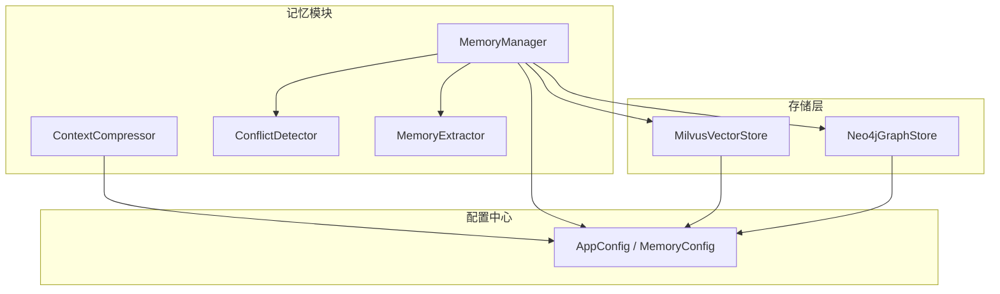
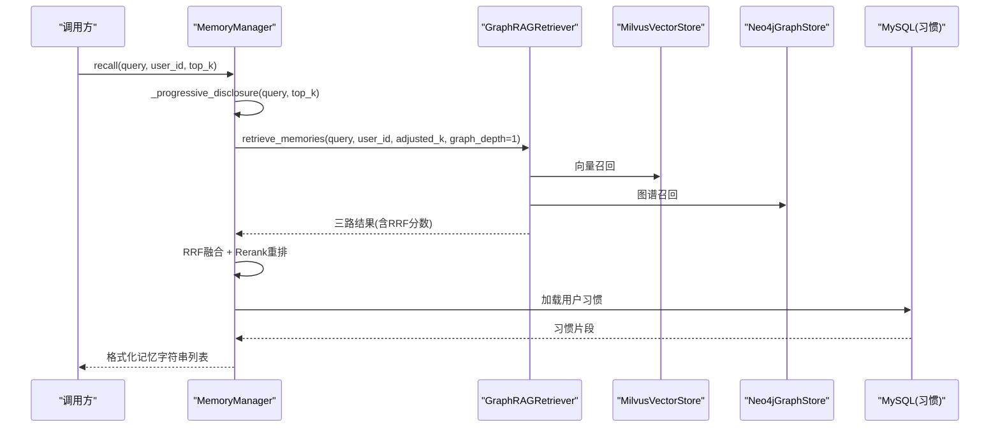
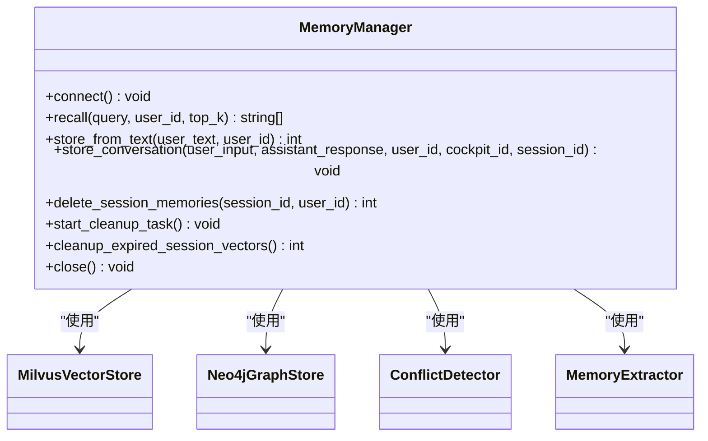
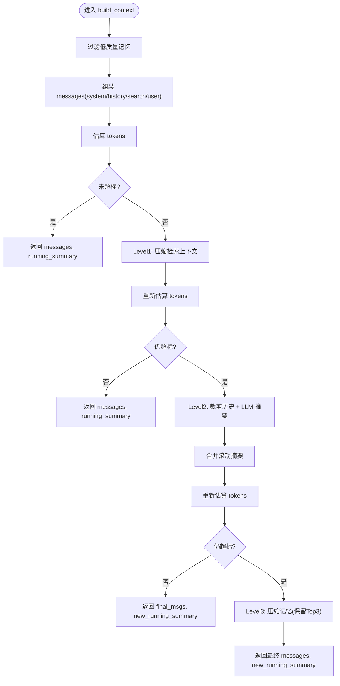
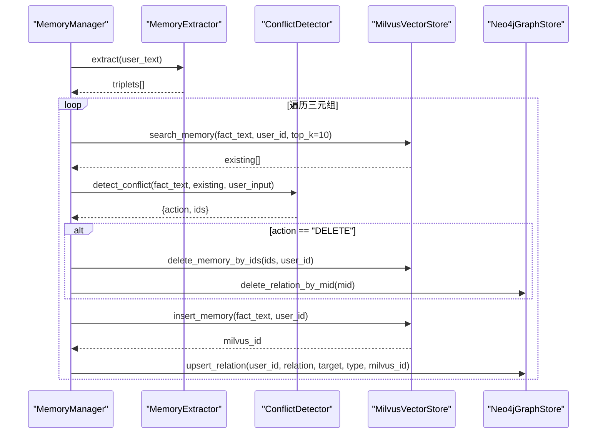
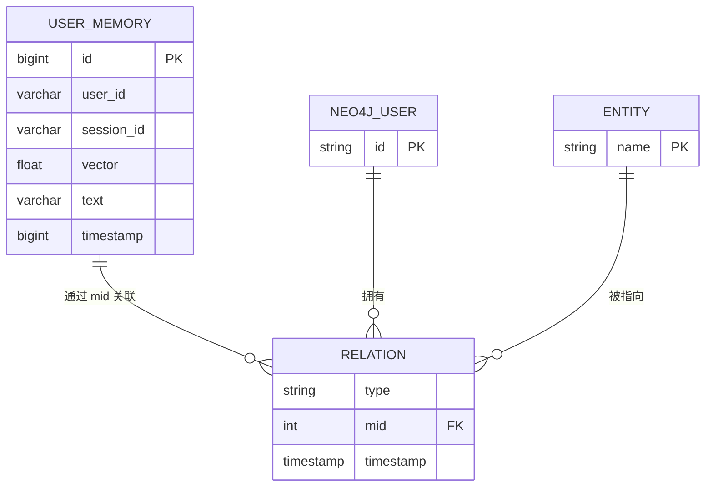
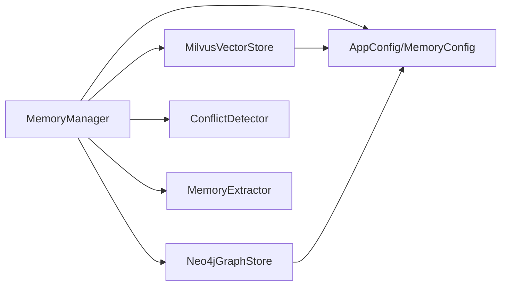

# 记忆管理系统

<cite>
**本文引用的文件**   
- [backend_design/nexus/memory/__init__.py](file://backend_design/nexus/memory/__init__.py)
- [backend_design/nexus/memory/manager.py](file://backend_design/nexus/memory/manager.py)
- [backend_design/nexus/memory/compressor.py](file://backend_design/nexus/memory/compressor.py)
- [backend_design/nexus/memory/conflict.py](file://backend_design/nexus/memory/conflict.py)
- [backend_design/nexus/config/__init__.py](file://backend_design/nexus/config/__init__.py)
- [backend_design/nexus/config/data.py](file://backend_design/nexus/config/data.py)
- [backend_design/nexus/rag/vector_store.py](file://backend_design/nexus/rag/vector_store.py)
- [backend_design/nexus/rag/graph_store.py](file://backend_design/nexus/rag/graph_store.py)
</cite>

## 目录
1. [简介](#简介)
2. [项目结构](#项目结构)
3. [核心组件](#核心组件)
4. [架构总览](#架构总览)
5. [详细组件分析](#详细组件分析)
6. [依赖关系分析](#依赖关系分析)
7. [性能考量](#性能考量)
8. [故障排查指南](#故障排查指南)
9. [结论](#结论)
10. [附录](#附录)

## 简介
本文件为 NexusCockpit 记忆管理系统的权威技术文档，覆盖记忆的存储结构、生命周期管理、压缩与去重、冲突检测与解决、优先级排序、过期清理与持久化机制。同时给出 API 接口说明、配置参数、监控指标建议与故障恢复方案，并提供最佳实践与性能调优建议，帮助开发者快速理解并高效使用记忆子系统。

## 项目结构
记忆模块位于 backend_design/nexus/memory，围绕统一管理器 MemoryManager 组织短期/长期/习惯三层记忆；压缩器 ContextCompressor 负责上下文动态压缩与阈值摘要；冲突检测 ConflictDetector 与提取器 MemoryExtractor 负责结构化抽取与一致性裁决。向量与图谱分别由 MilvusVectorStore 与 Neo4jGraphStore 提供持久化能力。

图表来源
- [backend_design/nexus/memory/manager.py:38-96](file://backend_design/nexus/memory/manager.py#L38-L96)
- [backend_design/nexus/memory/compressor.py:36-98](file://backend_design/nexus/memory/compressor.py#L36-L98)
- [backend_design/nexus/memory/conflict.py:23-84](file://backend_design/nexus/memory/conflict.py#L23-L84)
- [backend_design/nexus/config/__init__.py:84-132](file://backend_design/nexus/config/__init__.py#L84-L132)
- [backend_design/nexus/config/data.py:47-63](file://backend_design/nexus/config/data.py#L47-L63)
- [backend_design/nexus/rag/vector_store.py:36-57](file://backend_design/nexus/rag/vector_store.py#L36-L57)
- [backend_design/nexus/rag/graph_store.py:26-58](file://backend_design/nexus/rag/graph_store.py#L26-L58)

章节来源
- [backend_design/nexus/memory/__init__.py:5-23](file://backend_design/nexus/memory/__init__.py#L5-L23)
- [backend_design/nexus/memory/manager.py:38-96](file://backend_design/nexus/memory/manager.py#L38-L96)
- [backend_design/nexus/config/__init__.py:84-132](file://backend_design/nexus/config/__init__.py#L84-L132)
- [backend_design/nexus/config/data.py:47-63](file://backend_design/nexus/config/data.py#L47-L63)

## 核心组件
- MemoryManager：统一协调短期（Redis）、长期（Milvus + Neo4j）与习惯（MySQL user_habits）记忆；实现三路召回（向量+图谱+BM25）、RRF融合、Rerank重排与渐进式披露策略；提供会话级清理与后台定时任务。
- ContextCompressor：基于框架的 trim_messages 进行 token 计数与消息裁剪，ChatOpenAI 生成滚动摘要；支持关键信息正则提取、查询增强与阈值压缩。
- ConflictDetector：基于 LLM 的一致性裁决，输出 DELETE/IGNORE/NONE 及需删除的 ID 列表。
- MemoryExtractor：从用户输入抽取结构化三元组（关系-目标-类型），用于知识图谱构建。
- MilvusVectorStore：用户记忆集合（含 session_id/user_id/text/vector/timestamp），支持插入、检索、按会话/ID 删除。
- Neo4jGraphStore：用户画像与实体关系图谱，维护 User-Entity 关系并绑定 Milvus ID，支持 N 阶路径查询与画像导出。

章节来源
- [backend_design/nexus/memory/manager.py:38-96](file://backend_design/nexus/memory/manager.py#L38-L96)
- [backend_design/nexus/memory/compressor.py:36-98](file://backend_design/nexus/memory/compressor.py#L36-L98)
- [backend_design/nexus/memory/conflict.py:23-84](file://backend_design/nexus/memory/conflict.py#L23-L84)
- [backend_design/nexus/rag/vector_store.py:148-199](file://backend_design/nexus/rag/vector_store.py#L148-L199)
- [backend_design/nexus/rag/graph_store.py:73-89](file://backend_design/nexus/rag/graph_store.py#L73-L89)

## 架构总览
记忆系统采用“短-长-习惯”三层结构与“检索-重排-披露”流水线，结合向量与图谱双通道，保证语义召回与关系推理能力。

图表来源
- [backend_design/nexus/memory/manager.py:98-150](file://backend_design/nexus/memory/manager.py#L98-L150)
- [backend_design/nexus/memory/manager.py:152-181](file://backend_design/nexus/memory/manager.py#L152-L181)
- [backend_design/nexus/memory/manager.py:183-210](file://backend_design/nexus/memory/manager.py#L183-L210)

## 详细组件分析

### MemoryManager 统一记忆管理器
- 职责
  - 连接各后端（容错独立）
  - 召回管道：三路召回 → RRF 融合 → Rerank → 渐进式披露
  - 记忆写入：LLM 提取三元组 → 冲突检测 → 双向写入（Milvus + Neo4j）带补偿回滚
  - 对话存储：将完整对话向量化入库，支持会话级清理
  - 异步写入：fire-and-forget 任务，带重试与异常回调
  - 定时清理：会话级向量 TTL 清理
- 关键方法
  - connect()：连接存储后端
  - recall()：记忆召回
  - store_from_text()：文本到记忆的结构化写入
  - store_conversation()：对话向量化存储
  - delete_session_memories()：会话级清理
  - start_cleanup_task()/cleanup_expired_session_vectors()：后台清理

图表来源
- [backend_design/nexus/memory/manager.py:38-96](file://backend_design/nexus/memory/manager.py#L38-L96)
- [backend_design/nexus/rag/vector_store.py:36-57](file://backend_design/nexus/rag/vector_store.py#L36-L57)
- [backend_design/nexus/rag/graph_store.py:26-58](file://backend_design/nexus/rag/graph_store.py#L26-L58)
- [backend_design/nexus/memory/conflict.py:23-84](file://backend_design/nexus/memory/conflict.py#L23-L84)

章节来源
- [backend_design/nexus/memory/manager.py:85-150](file://backend_design/nexus/memory/manager.py#L85-L150)
- [backend_design/nexus/memory/manager.py:212-300](file://backend_design/nexus/memory/manager.py#L212-L300)
- [backend_design/nexus/memory/manager.py:302-335](file://backend_design/nexus/memory/manager.py#L302-L335)
- [backend_design/nexus/memory/manager.py:336-428](file://backend_design/nexus/memory/manager.py#L336-L428)
- [backend_design/nexus/memory/manager.py:463-583](file://backend_design/nexus/memory/manager.py#L463-L583)

### ContextCompressor 上下文压缩器
- 职责
  - 分级预算组装上下文（trim_messages 裁剪历史 + LLM 摘要）
  - 阈值压缩：旧对话自动摘要，滚动合并
  - 关键信息提取：位置/偏好/身份的正则匹配（零 LLM）
  - 查询增强：模糊查询自动补充位置/偏好
- 关键方法
  - compress_text() / compress_messages()：文本/对话压缩
  - extract_key_context()：关键上下文提取
  - augment_recall_query()：召回查询增强
  - should_compress() / compress_history_with_threshold()：阈值判断与滚动摘要
  - build_context()：分级预算上下文组装

图表来源
- [backend_design/nexus/memory/compressor.py:316-394](file://backend_design/nexus/memory/compressor.py#L316-L394)
- [backend_design/nexus/memory/compressor.py:252-293](file://backend_design/nexus/memory/compressor.py#L252-L293)
- [backend_design/nexus/memory/compressor.py:181-244](file://backend_design/nexus/memory/compressor.py#L181-L244)

章节来源
- [backend_design/nexus/memory/compressor.py:36-98](file://backend_design/nexus/memory/compressor.py#L36-L98)
- [backend_design/nexus/memory/compressor.py:129-179](file://backend_design/nexus/memory/compressor.py#L129-L179)
- [backend_design/nexus/memory/compressor.py:181-244](file://backend_design/nexus/memory/compressor.py#L181-L244)
- [backend_design/nexus/memory/compressor.py:246-293](file://backend_design/nexus/memory/compressor.py#L246-L293)
- [backend_design/nexus/memory/compressor.py:316-394](file://backend_design/nexus/memory/compressor.py#L316-L394)

### ConflictDetector 与 MemoryExtractor 冲突检测与提取
- ConflictDetector：根据原始对话与新记忆对比现有记忆，输出 DELETE/IGNORE/NONE 及需删除的 ID 列表。
- MemoryExtractor：从用户输入抽取结构化三元组（relation/target/type），用于知识图谱构建。

图表来源
- [backend_design/nexus/memory/manager.py:212-300](file://backend_design/nexus/memory/manager.py#L212-L300)
- [backend_design/nexus/memory/conflict.py:30-84](file://backend_design/nexus/memory/conflict.py#L30-L84)
- [backend_design/nexus/rag/vector_store.py:201-262](file://backend_design/nexus/rag/vector_store.py#L201-L262)
- [backend_design/nexus/rag/graph_store.py:73-89](file://backend_design/nexus/rag/graph_store.py#L73-L89)

章节来源
- [backend_design/nexus/memory/conflict.py:23-84](file://backend_design/nexus/memory/conflict.py#L23-L84)
- [backend_design/nexus/memory/conflict.py:87-159](file://backend_design/nexus/memory/conflict.py#L87-L159)
- [backend_design/nexus/memory/manager.py:212-300](file://backend_design/nexus/memory/manager.py#L212-L300)

### 存储层：Milvus 向量与 Neo4j 图谱
- MilvusVectorStore
  - 集合：User_Memory（user_id/session_id/text/vector/timestamp）
  - 能力：插入、语义检索、按 ID/会话删除、LangChain 适配
- Neo4jGraphStore
  - 约束与索引：User.id 唯一、Entity.name 索引
  - 能力：关系 upsert（绑定 mid）、N 阶路径查询、用户画像导出

图表来源
- [backend_design/nexus/rag/vector_store.py:174-199](file://backend_design/nexus/rag/vector_store.py#L174-L199)
- [backend_design/nexus/rag/graph_store.py:60-89](file://backend_design/nexus/rag/graph_store.py#L60-L89)

章节来源
- [backend_design/nexus/rag/vector_store.py:148-199](file://backend_design/nexus/rag/vector_store.py#L148-L199)
- [backend_design/nexus/rag/vector_store.py:201-324](file://backend_design/nexus/rag/vector_store.py#L201-L324)
- [backend_design/nexus/rag/graph_store.py:60-89](file://backend_design/nexus/rag/graph_store.py#L60-L89)
- [backend_design/nexus/rag/graph_store.py:102-166](file://backend_design/nexus/rag/graph_store.py#L102-L166)

## 依赖关系分析
- MemoryManager 依赖：
  - MilvusVectorStore（向量检索/写入）
  - Neo4jGraphStore（图谱关系/画像）
  - ConflictDetector/MemoryExtractor（LLM 驱动的一致性与抽取）
  - GraphRAGRetriever（三路召回+RRF+Rerank）
- 配置依赖：
  - AppConfig/MemoryConfig 控制上下文窗口、阈值、摘要长度等
- 存储依赖：
  - MilvusCollection 维度/字段校验与重建
  - Neo4j 约束与索引初始化

图表来源
- [backend_design/nexus/memory/manager.py:38-96](file://backend_design/nexus/memory/manager.py#L38-L96)
- [backend_design/nexus/config/__init__.py:84-132](file://backend_design/nexus/config/__init__.py#L84-L132)
- [backend_design/nexus/config/data.py:47-63](file://backend_design/nexus/config/data.py#L47-L63)

章节来源
- [backend_design/nexus/memory/manager.py:38-96](file://backend_design/nexus/memory/manager.py#L38-L96)
- [backend_design/nexus/config/__init__.py:84-132](file://backend_design/nexus/config/__init__.py#L84-L132)
- [backend_design/nexus/config/data.py:47-63](file://backend_design/nexus/config/data.py#L47-L63)

## 性能考量
- 渐进式披露：简单指令 top_k=3，复杂查询 top_k=8，减少不必要召回延迟。
- 三路召回+RRF+Rerank：提升召回质量与排序精度，降低无关上下文对 LLM 的影响。
- 阈值压缩与滚动摘要：避免历史膨胀，保持最近对话与稳定事实。
- 异步写入与重试：非阻塞存储，失败重试与异常回调保障可靠性。
- 会话级清理：定期清理过期 session_id 向量，释放存储空间。
- 存储层优化：Milvus 索引参数与维度校验，Neo4j 约束与索引预建。

[本节为通用性能指导，不直接分析具体文件]

## 故障排查指南
- 连接失败降级
  - 向量库或图谱连接失败不影响其他服务，记录警告日志并降级召回。
- 写入一致性
  - Neo4j 写入失败时回滚 Milvus 记录，确保数据一致性。
- 会话清理
  - 清理任务捕获异常并记录日志，避免中断主流程。
- 压缩失败
  - LLM 压缩失败回退至原文截取，保证可用性。
- 常见错误定位
  - 检查 Milvus 集合维度与字段是否匹配（必要时重建）。
  - 检查 Neo4j 约束与索引是否创建成功。
  - 确认 MySQL 连接状态以加载用户习惯。

章节来源
- [backend_design/nexus/memory/manager.py:85-96](file://backend_design/nexus/memory/manager.py#L85-L96)
- [backend_design/nexus/memory/manager.py:278-296](file://backend_design/nexus/memory/manager.py#L278-L296)
- [backend_design/nexus/memory/manager.py:463-583](file://backend_design/nexus/memory/manager.py#L463-L583)
- [backend_design/nexus/memory/compressor.py:129-153](file://backend_design/nexus/memory/compressor.py#L129-L153)
- [backend_design/nexus/rag/vector_store.py:59-104](file://backend_design/nexus/rag/vector_store.py#L59-L104)
- [backend_design/nexus/rag/graph_store.py:60-68](file://backend_design/nexus/rag/graph_store.py#L60-L68)

## 结论
记忆管理系统通过三层记忆与双通道检索，实现了高可用、可扩展且可观测的记忆能力。借助渐进式披露、阈值压缩、冲突检测与一致性回滚，系统在准确性与性能之间取得平衡。配合会话级清理与异步写入，满足车载场景下的实时性与稳定性要求。

[本节为总结性内容，不直接分析具体文件]

## 附录

### API 接口概览（记忆操作）
- 记忆召回
  - 方法：MemoryManager.recall(query, user_id, top_k)
  - 行为：三路召回 → RRF 融合 → Rerank → 渐进式披露 → 追加习惯
- 记忆写入
  - 方法：MemoryManager.store_from_text(user_text, user_id)
  - 行为：LLM 抽取三元组 → 冲突检测 → 双向写入（Milvus + Neo4j）
- 对话存储
  - 方法：MemoryManager.store_conversation(user_input, assistant_response, user_id, cockpit_id, session_id)
  - 行为：过滤短指令 → 拼接对话文本 → 向量化入库
- 会话清理
  - 方法：MemoryManager.delete_session_memories(session_id, user_id)
  - 行为：仅删除该会话产生的对话向量
- 异步写入
  - 方法：store_from_text_async / store_conversation_async
  - 行为：在当前事件循环中 fire-and-forget，带重试与异常回调
- 后台清理
  - 方法：start_cleanup_task / cleanup_expired_session_vectors
  - 行为：定期清理过期 session_id 向量

章节来源
- [backend_design/nexus/memory/manager.py:98-150](file://backend_design/nexus/memory/manager.py#L98-L150)
- [backend_design/nexus/memory/manager.py:212-300](file://backend_design/nexus/memory/manager.py#L212-L300)
- [backend_design/nexus/memory/manager.py:302-335](file://backend_design/nexus/memory/manager.py#L302-L335)
- [backend_design/nexus/memory/manager.py:336-428](file://backend_design/nexus/memory/manager.py#L336-L428)
- [backend_design/nexus/memory/manager.py:463-583](file://backend_design/nexus/memory/manager.py#L463-L583)

### 配置参数（记忆相关）
- MEMORY_COMPRESS_THRESHOLD_TURNS：触发阈值压缩的历史轮数阈值
- MEMORY_KEEP_RECENT_TURNS：保留最近对话轮数
- MEMORY_MAX_SUMMARY_CHARS：滚动摘要最大字符数
- MEMORY_MAX_HISTORY_LEN：最大历史长度
- MEMORY_CONTEXT_TOKEN_RATIO：上下文 token 比例
- MEMORY_CONTEXT_TOKEN_HARD_CAP：上下文 token 硬上限

章节来源
- [backend_design/nexus/config/data.py:47-63](file://backend_design/nexus/config/data.py#L47-L63)

### 监控指标建议
- 召回与重排
  - 召回条数、Rerank 平均分数、三路召回命中率
- 写入与一致性
  - 写入成功率、Neo4j 回滚次数、Milvus 插入耗时
- 压缩与摘要
  - 压缩触发率、摘要长度分布、LLM 压缩失败率
- 清理与维护
  - 清理任务执行间隔、清理条目数、清理失败次数
- 资源与性能
  - 向量库连接池、Neo4j 查询耗时、内存占用峰值

[本节为通用监控建议，不直接分析具体文件]

### 最佳实践与调优建议
- 合理设置 top_k 与 graph_depth，平衡召回质量与延迟
- 调整 context_token_ratio 与 hard_cap，避免上下文溢出
- 针对高频场景启用记忆提取开关，降低 LLM 调用成本
- 定期评估 Milvus 索引参数与 Neo4j 索引，优化查询性能
- 在业务高峰时段关闭非必要异步任务，降低抖动

[本节为通用实践建议，不直接分析具体文件]