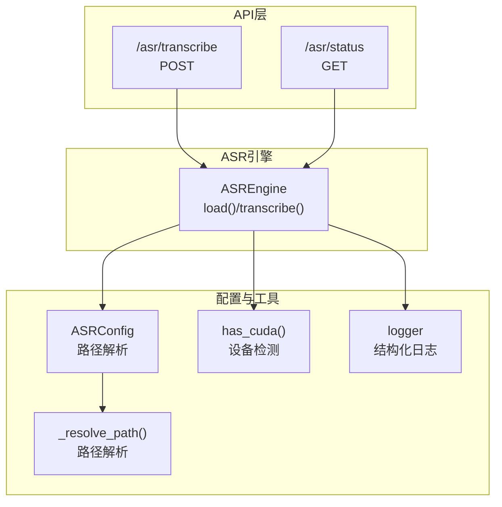
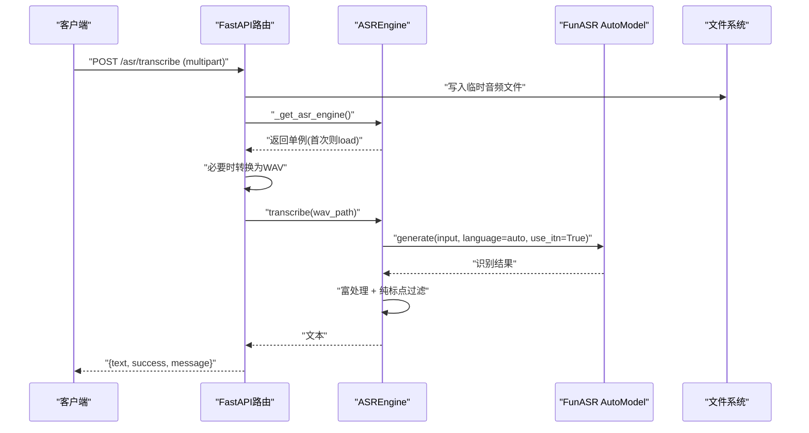
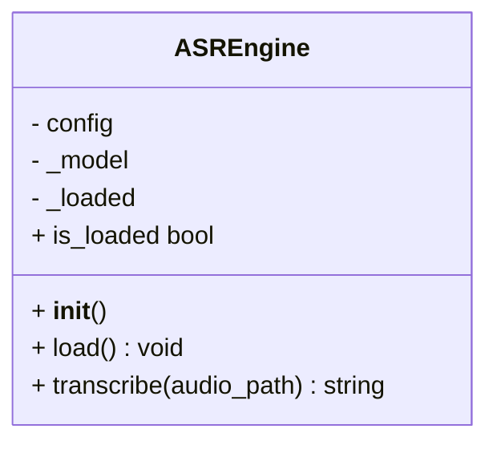
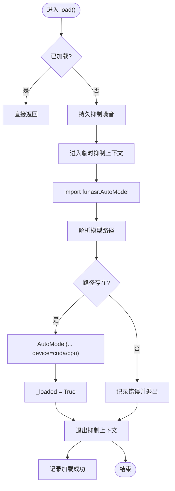
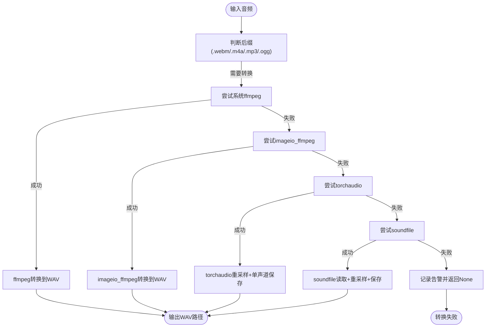
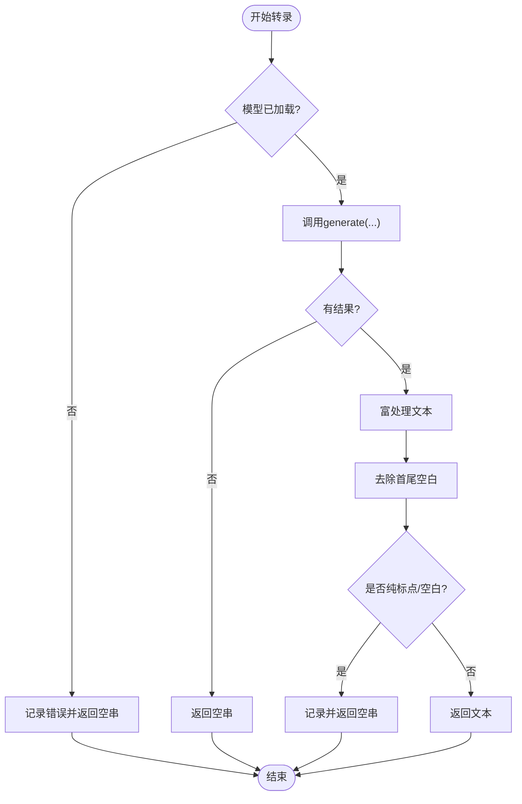
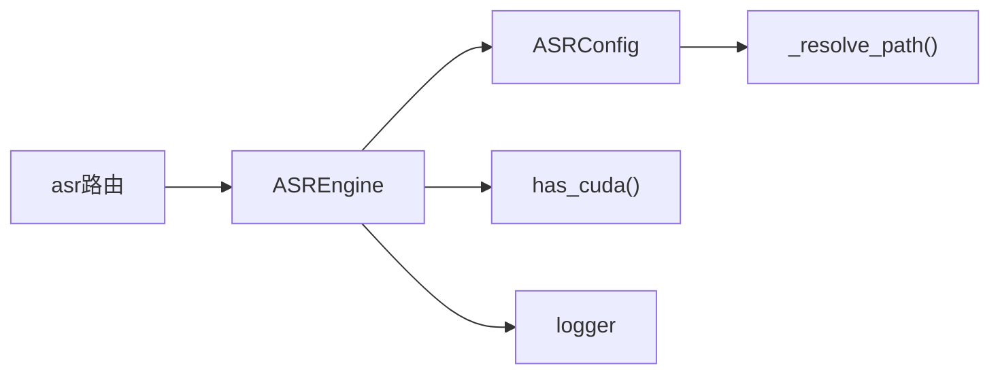

# ASR语音识别服务

<cite>
**本文引用的文件**   
- [backend_design/nexus/asr/engine.py](file://backend_design/nexus/asr/engine.py)
- [backend_design/nexus/api/routes/asr.py](file://backend_design/nexus/api/routes/asr.py)
- [backend_design/nexus/config/asr.py](file://backend_design/nexus/config/asr.py)
- [backend_design/nexus/core/device.py](file://backend_design/nexus/core/device.py)
- [backend_design/nexus/core/logger.py](file://backend_design/nexus/core/logger.py)
- [backend_design/nexus/config/_common.py](file://backend_design/nexus/config/_common.py)
- [docs/内部开发存档文档/语音技术文档/asr-guide.md](file://docs/内部开发存档文档/语音技术文档/asr-guide.md)
</cite>

## 目录
1. [简介](#简介)
2. [项目结构](#项目结构)
3. [核心组件](#核心组件)
4. [架构总览](#架构总览)
5. [详细组件分析](#详细组件分析)
6. [依赖关系分析](#依赖关系分析)
7. [性能考量与优化](#性能考量与优化)
8. [故障排查指南](#故障排查指南)
9. [结论](#结论)
10. [附录：接口规范与使用示例](#附录接口规范与使用示例)

## 简介
本章节面向 NexusCockpit 的 ASR 语音识别服务，基于 FunASR SenseVoice 实现本地端侧语音转文本。文档覆盖模型懒加载、GPU/CPU 设备选择、日志抑制技术、纯标点过滤算法、ASREngine 类接口与参数配置、音频格式转换流程、错误处理策略以及扩展开发建议，帮助开发者快速理解并高效集成该能力。

## 项目结构
ASR 相关代码主要分布在以下模块：
- ASR 引擎封装：backend_design/nexus/asr/engine.py
- REST API 路由：backend_design/nexus/api/routes/asr.py
- 配置管理：backend_design/nexus/config/asr.py、backend_design/nexus/config/_common.py
- 设备检测：backend_design/nexus/core/device.py
- 结构化日志：backend_design/nexus/core/logger.py
- 技术说明文档：docs/内部开发存档文档/语音技术文档/asr-guide.md

图表来源
- [backend_design/nexus/api/routes/asr.py:48-139](file://backend_design/nexus/api/routes/asr.py#L48-L139)
- [backend_design/nexus/asr/engine.py:78-178](file://backend_design/nexus/asr/engine.py#L78-L178)
- [backend_design/nexus/config/asr.py:15-66](file://backend_design/nexus/config/asr.py#L15-L66)
- [backend_design/nexus/core/device.py:10-21](file://backend_design/nexus/core/device.py#L10-L21)
- [backend_design/nexus/config/_common.py:56-75](file://backend_design/nexus/config/_common.py#L56-L75)

章节来源
- [backend_design/nexus/asr/engine.py:1-178](file://backend_design/nexus/asr/engine.py#L1-L178)
- [backend_design/nexus/api/routes/asr.py:1-248](file://backend_design/nexus/api/routes/asr.py#L1-L248)
- [backend_design/nexus/config/asr.py:1-66](file://backend_design/nexus/config/asr.py#L1-L66)
- [backend_design/nexus/core/device.py:1-21](file://backend_design/nexus/core/device.py#L1-L21)
- [backend_design/nexus/config/_common.py:1-75](file://backend_design/nexus/config/_common.py#L1-L75)
- [backend_design/nexus/core/logger.py:1-249](file://backend_design/nexus/core/logger.py#L1-L249)
- [docs/内部开发存档文档/语音技术文档/asr-guide.md:1-64](file://docs/内部开发存档文档/语音技术文档/asr-guide.md#L1-L64)

## 核心组件
- ASREngine：封装 FunASR SenseVoice 模型的懒加载、设备选择、转录与结果后处理（含纯标点过滤）。
- ASRConfig：集中管理 ASR/TTS/声纹模型路径与环境变量映射，提供绝对路径解析。
- has_cuda：检测 CUDA/MPS 可用设备，用于自动选择 GPU 或 CPU。
- asr 路由：暴露 /asr/transcribe 和 /asr/status 接口，负责上传音频、格式转换、调用引擎与返回结果。
- logger：结构化日志输出，支持敏感信息脱敏与多后端输出。

章节来源
- [backend_design/nexus/asr/engine.py:78-178](file://backend_design/nexus/asr/engine.py#L78-L178)
- [backend_design/nexus/config/asr.py:15-66](file://backend_design/nexus/config/asr.py#L15-L66)
- [backend_design/nexus/core/device.py:10-21](file://backend_design/nexus/core/device.py#L10-L21)
- [backend_design/nexus/api/routes/asr.py:25-139](file://backend_design/nexus/api/routes/asr.py#L25-L139)
- [backend_design/nexus/core/logger.py:83-202](file://backend_design/nexus/core/logger.py#L83-L202)

## 架构总览
ASR 服务采用“API 路由 + 单例引擎”的轻量架构。首次请求时懒加载模型，避免启动开销；音频通过临时文件写入磁盘，必要时转换为 16kHz 单声道 WAV；识别结果经富处理后进行纯标点过滤，最终返回文本。

图表来源
- [backend_design/nexus/api/routes/asr.py:48-121](file://backend_design/nexus/api/routes/asr.py#L48-L121)
- [backend_design/nexus/asr/engine.py:138-173](file://backend_design/nexus/asr/engine.py#L138-L173)

章节来源
- [backend_design/nexus/api/routes/asr.py:48-121](file://backend_design/nexus/api/routes/asr.py#L48-L121)
- [backend_design/nexus/asr/engine.py:138-173](file://backend_design/nexus/asr/engine.py#L138-L173)

## 详细组件分析

### ASREngine 类
职责与特性：
- 懒加载：首次 load() 才初始化模型，避免冷启动耗时。
- 设备选择：根据 has_cuda() 自动选择 cuda:0 或 cpu。
- 日志抑制：在 import funasr 前持久抑制警告与噪音日志；加载期间临时抑制 logging.info 与 print 输出。
- 转录流程：调用 FunASR generate，使用 rich_transcription_postprocess 富处理，再执行纯标点过滤。
- 错误处理：捕获 ImportError 与通用异常，记录日志并返回空字符串。

图表来源
- [backend_design/nexus/asr/engine.py:78-178](file://backend_design/nexus/asr/engine.py#L78-L178)

章节来源
- [backend_design/nexus/asr/engine.py:78-178](file://backend_design/nexus/asr/engine.py#L78-L178)

### 懒加载与日志抑制
- 懒加载模式：_get_asr_engine() 在第一次请求时创建 ASREngine 并调用 load()，后续复用单例。
- 日志抑制：
  - 持久抑制：warnings.filterwarnings 与降低 funasr/torchaudio/markdown_it 的日志级别。
  - 临时抑制：logging.disable(INFO) 与 redirect_stdout 丢弃 print 输出，确保加载过程不刷屏。

图表来源
- [backend_design/nexus/asr/engine.py:89-137](file://backend_design/nexus/asr/engine.py#L89-L137)
- [backend_design/nexus/asr/engine.py:30-76](file://backend_design/nexus/asr/engine.py#L30-L76)

章节来源
- [backend_design/nexus/api/routes/asr.py:31-37](file://backend_design/nexus/api/routes/asr.py#L31-L37)
- [backend_design/nexus/asr/engine.py:30-76](file://backend_design/nexus/asr/engine.py#L30-L76)
- [backend_design/nexus/asr/engine.py:89-137](file://backend_design/nexus/asr/engine.py#L89-L137)

### 音频文件处理与格式转换
- 上传与临时文件：接收 multipart/form-data，写入临时文件，后缀由原始文件名决定。
- 格式转换优先级：
  1) 系统 ffmpeg（功能最全）
  2) imageio_ffmpeg（pip 包内置）
  3) torchaudio（不支持 webm，但支持 wav/flac）
  4) soundfile/libsndfile（支持 ogg/flac/wav）
- 统一目标：16kHz、单声道、PCM 16-bit WAV。

图表来源
- [backend_design/nexus/api/routes/asr.py:142-247](file://backend_design/nexus/api/routes/asr.py#L142-L247)

章节来源
- [backend_design/nexus/api/routes/asr.py:64-121](file://backend_design/nexus/api/routes/asr.py#L64-L121)
- [backend_design/nexus/api/routes/asr.py:142-247](file://backend_design/nexus/api/routes/asr.py#L142-L247)

### 文本转录流程与纯标点过滤
- 转录调用：engine.transcribe(audio_path) → FunASR generate(language="auto", use_itn=True)。
- 富处理：rich_transcription_postprocess(text) 规范化文本。
- 纯标点过滤：正则匹配仅包含空白/标点字符的结果，将其视为无意义并返回空串。

图表来源
- [backend_design/nexus/asr/engine.py:138-173](file://backend_design/nexus/asr/engine.py#L138-L173)

章节来源
- [backend_design/nexus/asr/engine.py:138-173](file://backend_design/nexus/asr/engine.py#L138-L173)

### 错误处理策略
- 导入缺失：funasr 未安装时记录 warning 并禁用 ASR。
- 模型路径不存在：记录 warning 并提示检查配置。
- 加载异常：记录 error 并返回空串。
- 转录异常：记录 error 并返回空串。
- API 层异常：捕获并返回 success=False 与错误消息。

章节来源
- [backend_design/nexus/asr/engine.py:124-136](file://backend_design/nexus/asr/engine.py#L124-L136)
- [backend_design/nexus/asr/engine.py:147-173](file://backend_design/nexus/asr/engine.py#L147-L173)
- [backend_design/nexus/api/routes/asr.py:117-121](file://backend_design/nexus/api/routes/asr.py#L117-L121)

### 配置与路径解析
- ASRConfig：
  - funasr_model_path：默认 ./models/asr/sensevoice，环境变量 FUNASR_MODEL_PATH 覆盖。
  - resolved_funasr_path()：返回绝对路径。
- _resolve_path：将相对路径解析为基于项目根目录的绝对路径，避免工作目录差异导致的路径失效。

章节来源
- [backend_design/nexus/config/asr.py:15-66](file://backend_design/nexus/config/asr.py#L15-L66)
- [backend_design/nexus/config/_common.py:56-75](file://backend_design/nexus/config/_common.py#L56-L75)

### 设备选择（GPU/CPU）
- has_cuda()：检测 torch.cuda.is_available() 或 Apple MPS 可用性，返回布尔值。
- ASREngine.load()：device="cuda:0" if has_cuda() else "cpu"。

章节来源
- [backend_design/nexus/core/device.py:10-21](file://backend_design/nexus/core/device.py#L10-L21)
- [backend_design/nexus/asr/engine.py:115-122](file://backend_design/nexus/asr/engine.py#L115-L122)

## 依赖关系分析
- API 路由依赖 ASREngine 单例与配置。
- ASREngine 依赖 ASRConfig、设备检测、结构化日志与 FunASR。
- 配置模块依赖路径解析工具。

图表来源
- [backend_design/nexus/api/routes/asr.py:20-37](file://backend_design/nexus/api/routes/asr.py#L20-L37)
- [backend_design/nexus/asr/engine.py:20-24](file://backend_design/nexus/asr/engine.py#L20-L24)
- [backend_design/nexus/config/asr.py:12-13](file://backend_design/nexus/config/asr.py#L12-L13)

章节来源
- [backend_design/nexus/api/routes/asr.py:20-37](file://backend_design/nexus/api/routes/asr.py#L20-L37)
- [backend_design/nexus/asr/engine.py:20-24](file://backend_design/nexus/asr/engine.py#L20-L24)
- [backend_design/nexus/config/asr.py:12-13](file://backend_design/nexus/config/asr.py#L12-L13)

## 性能考量与优化
- 懒加载：仅在首次请求时加载模型，减少启动时间。
- 设备选择：自动选择 CUDA/MPS 或 CPU，充分利用硬件加速。
- 日志抑制：避免 FunASR/PyTorch 噪音影响控制台与日志系统。
- 音频转换：优先使用系统 ffmpeg，其次 imageio_ffmpeg、torchaudio、soundfile，提高兼容性。
- 富处理与纯标点过滤：减少无效结果对下游的影响。
- 模型更新检查关闭：disable_update=True 提升加载速度。

[本节为通用指导，无需引用具体文件]

## 故障排查指南
常见问题与定位要点：
- 模型路径不存在：检查 .env 中 FUNASR_MODEL_PATH 与实际 models/asr/sensevoice 目录。
- funasr 未安装：确认依赖安装，或降级/升级版本以兼容当前环境。
- 音频转换失败：确认系统 ffmpeg 或 imageio_ffmpeg 可用；否则回退至 torchaudio/soundfile。
- 识别结果为空：可能为静音/极短录音被纯标点过滤；检查输入音频质量与时长。
- 日志过多：确认日志抑制生效；查看结构化日志文件定位问题。

章节来源
- [backend_design/nexus/asr/engine.py:124-136](file://backend_design/nexus/asr/engine.py#L124-L136)
- [backend_design/nexus/api/routes/asr.py:142-247](file://backend_design/nexus/api/routes/asr.py#L142-L247)
- [backend_design/nexus/core/logger.py:83-202](file://backend_design/nexus/core/logger.py#L83-L202)

## 结论
NexusCockpit 的 ASR 服务以 ASREngine 为核心，结合 FunASR SenseVoice 实现了本地化、低延迟的语音识别能力。通过懒加载、设备自适应、日志抑制与纯标点过滤等机制，在保证稳定性的同时提升了用户体验与可维护性。API 路由提供了简洁易用的接口，便于前端集成与扩展。

[本节为总结性内容，无需引用具体文件]

## 附录：接口规范与使用示例

### API 定义
- POST /asr/transcribe
  - 请求体：multipart/form-data，字段 file（音频文件）
  - 响应：TranscribeResponse{text, success, engine, message}
- GET /asr/status
  - 响应：{loaded, engine, model_path}

章节来源
- [backend_design/nexus/api/routes/asr.py:40-46](file://backend_design/nexus/api/routes/asr.py#L40-L46)
- [backend_design/nexus/api/routes/asr.py:48-139](file://backend_design/nexus/api/routes/asr.py#L48-L139)

### 使用示例
- 上传 WebM/WAV/MP3/M4A 音频，后端自动转换为 16kHz 单声道 WAV 并识别。
- 若转换失败，尝试直接识别原格式；仍失败则返回 success=False 与错误消息。
- 可通过 /asr/status 检查引擎状态与模型路径。

章节来源
- [backend_design/nexus/api/routes/asr.py:64-121](file://backend_design/nexus/api/routes/asr.py#L64-L121)
- [backend_design/nexus/api/routes/asr.py:124-139](file://backend_design/nexus/api/routes/asr.py#L124-L139)

### 扩展开发指南
- 新增音频格式支持：在 _convert_to_wav 中添加新的解码器或转换策略。
- 替换识别模型：修改 ASREngine.load() 中的 AutoModel 参数与模型路径。
- 自定义后处理：在 transcribe() 中扩展富处理逻辑或增加更多过滤规则。
- 监控与观测：利用结构化日志与中间件状态接口收集指标。

章节来源
- [backend_design/nexus/api/routes/asr.py:142-247](file://backend_design/nexus/api/routes/asr.py#L142-L247)
- [backend_design/nexus/asr/engine.py:115-122](file://backend_design/nexus/asr/engine.py#L115-L122)
- [backend_design/nexus/asr/engine.py:152-173](file://backend_design/nexus/asr/engine.py#L152-L173)