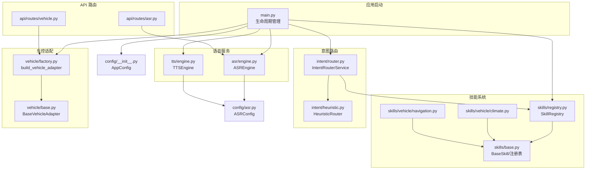
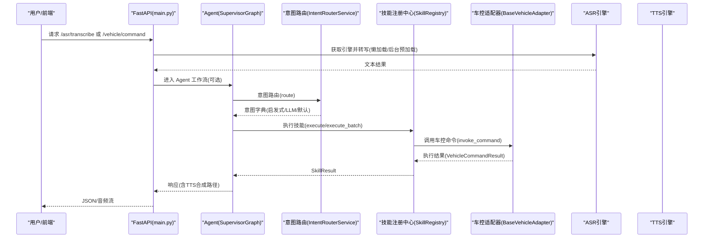
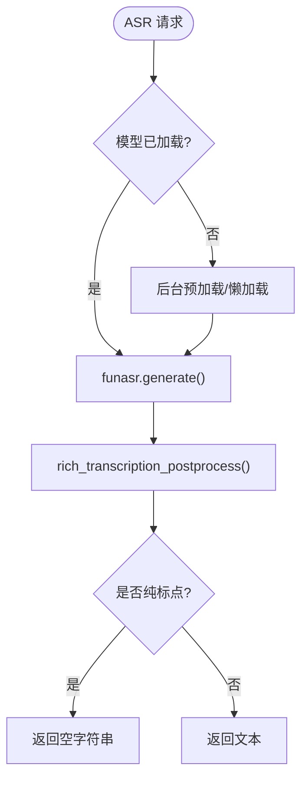
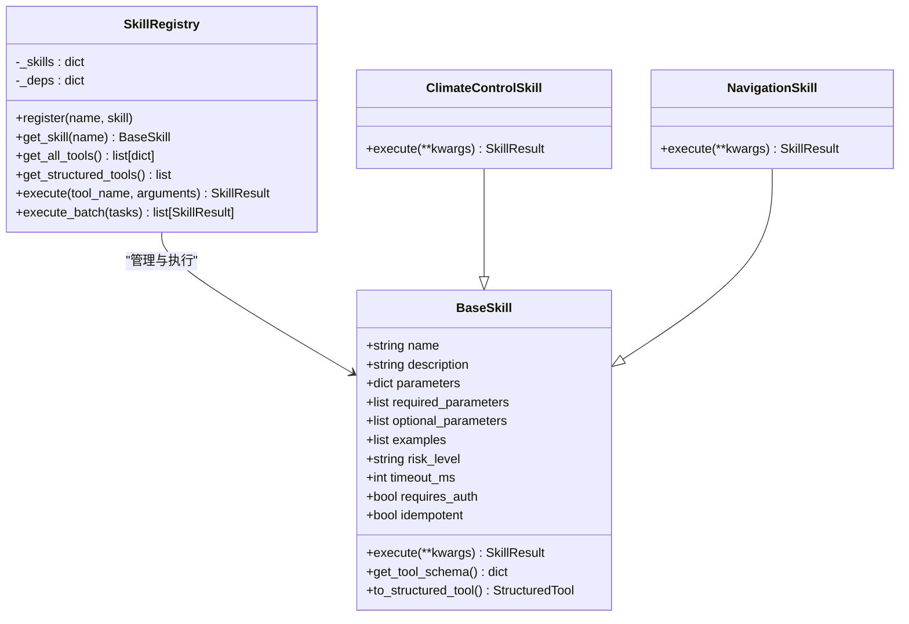
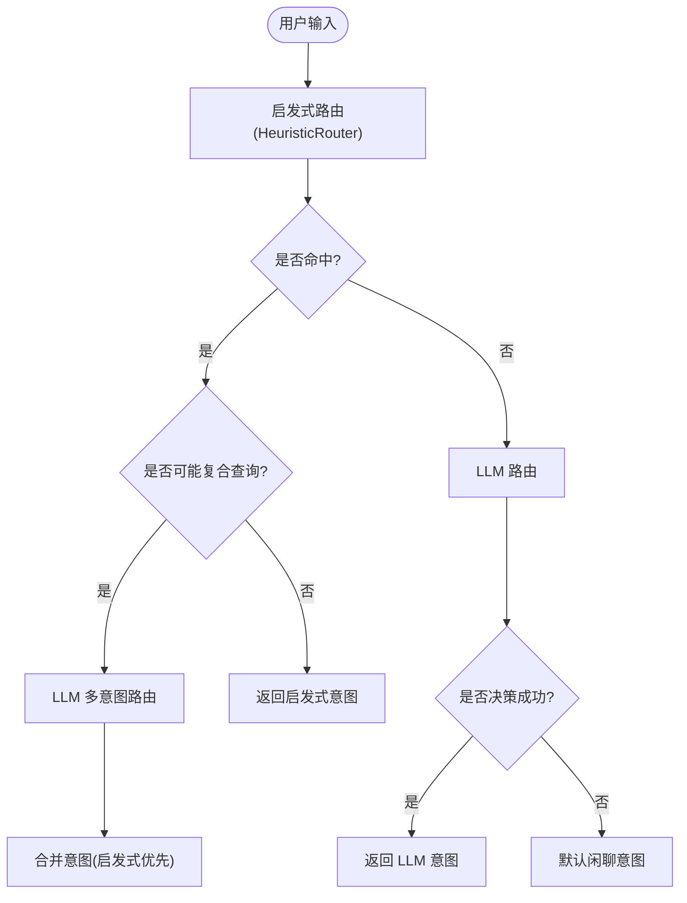
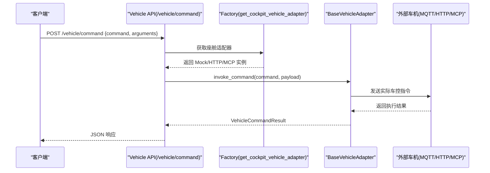
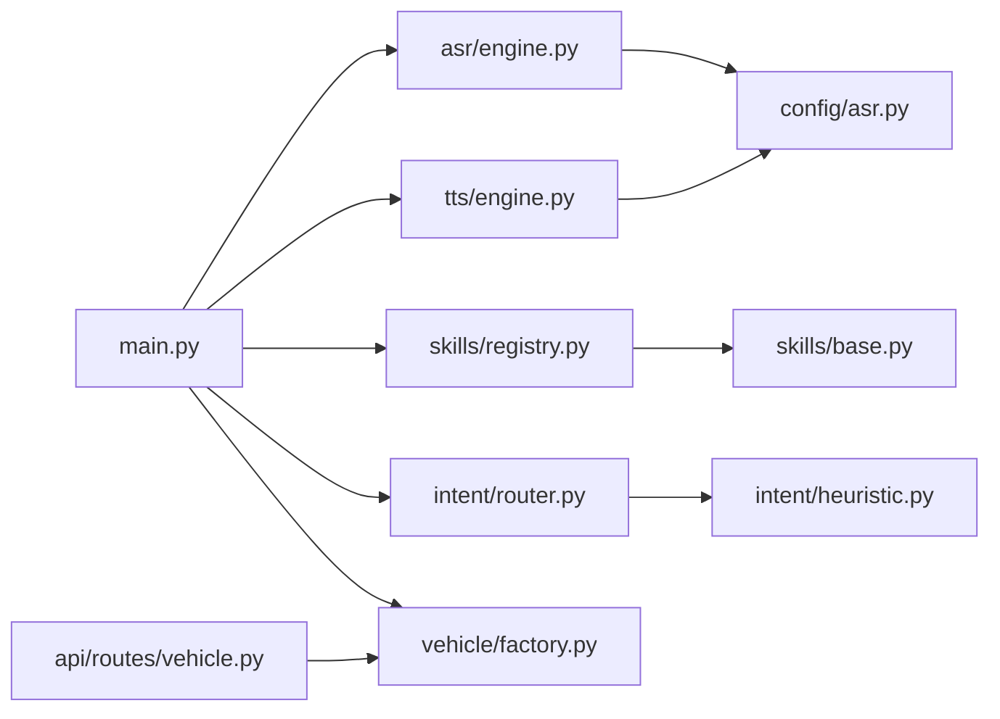

# L3 服务层

<cite>
**本文引用的文件**   
- [backend_design/nexus/main.py](file://backend_design/nexus/main.py)
- [backend_design/nexus/asr/engine.py](file://backend_design/nexus/asr/engine.py)
- [backend_design/nexus/tts/engine.py](file://backend_design/nexus/tts/engine.py)
- [backend_design/nexus/skills/registry.py](file://backend_design/nexus/skills/registry.py)
- [backend_design/nexus/skills/base.py](file://backend_design/nexus/skills/base.py)
- [backend_design/nexus/intent/router.py](file://backend_design/nexus/intent/router.py)
- [backend_design/nexus/intent/heuristic.py](file://backend_design/nexus/intent/heuristic.py)
- [backend_design/nexus/vehicle/factory.py](file://backend_design/nexus/vehicle/factory.py)
- [backend_design/nexus/vehicle/base.py](file://backend_design/nexus/vehicle/base.py)
- [backend_design/nexus/api/routes/asr.py](file://backend_design/nexus/api/routes/asr.py)
- [backend_design/nexus/api/routes/vehicle.py](file://backend_design/nexus/api/routes/vehicle.py)
- [backend_design/nexus/config/__init__.py](file://backend_design/nexus/config/__init__.py)
- [backend_design/nexus/config/asr.py](file://backend_design/nexus/config/asr.py)
- [backend_design/nexus/skills/vehicle/climate.py](file://backend_design/nexus/skills/vehicle/climate.py)
- [backend_design/nexus/skills/vehicle/navigation.py](file://backend_design/nexus/skills/vehicle/navigation.py)
</cite>

## 目录
1. [简介](#简介)
2. [项目结构](#项目结构)
3. [核心组件](#核心组件)
4. [架构总览](#架构总览)
5. [详细组件分析](#详细组件分析)
6. [依赖关系分析](#依赖关系分析)
7. [性能考量](#性能考量)
8. [故障排查指南](#故障排查指南)
9. [结论](#结论)
10. [附录](#附录)

## 简介
本文件面向 NexusCockpit 的 L3 服务层，聚焦以下能力：
- 语音交互服务（ASR/TTS 引擎）：本地模型懒加载、格式转换与结果后处理。
- 技能系统（插件化架构）：装饰器自动注册、结构化工具生成、超时重试与批量执行。
- 意图路由机制：启发式规则 + LLM 多意图识别 + 默认闲聊兜底，支持复合查询增强。
- 车控适配器：Mock/HTTP/MCP 三种后端，多座舱隔离与统一抽象接口。

文档涵盖接口规范、参数校验、错误处理、性能优化策略，并给出调用示例、配置选项与扩展开发指南。

## 项目结构
L3 服务层位于 backend_design/nexus 下，关键目录与职责：
- asr/tts：语音识别与合成引擎封装
- skills：技能基类与注册中心，以及车载/生活/健康等具体技能实现
- intent：意图路由（启发式与 LLM）
- vehicle：车控适配层抽象与工厂（Mock/HTTP/MCP）
- api/routes：对外 HTTP 接口（ASR、车控等）
- config：统一配置入口与各子系统配置

**图表来源** 
- [backend_design/nexus/main.py:75-359](file://backend_design/nexus/main.py#L75-L359)
- [backend_design/nexus/asr/engine.py:78-178](file://backend_design/nexus/asr/engine.py#L78-L178)
- [backend_design/nexus/tts/engine.py:21-116](file://backend_design/nexus/tts/engine.py#L21-L116)
- [backend_design/nexus/skills/base.py:44-264](file://backend_design/nexus/skills/base.py#L44-L264)
- [backend_design/nexus/skills/registry.py:36-321](file://backend_design/nexus/skills/registry.py#L36-L321)
- [backend_design/nexus/intent/router.py:32-217](file://backend_design/nexus/intent/router.py#L32-L217)
- [backend_design/nexus/intent/heuristic.py:27-89](file://backend_design/nexus/intent/heuristic.py#L27-L89)
- [backend_design/nexus/vehicle/base.py:35-92](file://backend_design/nexus/vehicle/base.py#L35-L92)
- [backend_design/nexus/vehicle/factory.py:38-147](file://backend_design/nexus/vehicle/factory.py#L38-L147)
- [backend_design/nexus/api/routes/asr.py:25-140](file://backend_design/nexus/api/routes/asr.py#L25-L140)
- [backend_design/nexus/api/routes/vehicle.py:32-152](file://backend_design/nexus/api/routes/vehicle.py#L32-L152)
- [backend_design/nexus/config/__init__.py:84-167](file://backend_design/nexus/config/__init__.py#L84-L167)
- [backend_design/nexus/config/asr.py:15-66](file://backend_design/nexus/config/asr.py#L15-L66)

**章节来源**
- [backend_design/nexus/main.py:75-359](file://backend_design/nexus/main.py#L75-L359)

## 核心组件
- ASR 引擎：基于 FunASR SenseVoice，支持音频格式转换、纯标点过滤、后台预加载与设备检测。
- TTS 引擎：基于 CosyVoice，支持说话人选择、零样本推理与音频保存。
- 技能注册中心：装饰器自动发现 + 手动依赖注入，提供 Tool Schema、StructuredTool 转换、超时重试与批量并行执行。
- 意图路由：三级策略（启发式 → LLM 多意图 → 默认闲聊），复合查询检测与合并。
- 车控适配器：统一抽象接口，Mock/HTTP/MCP 三种实现，按座舱隔离状态。

**章节来源**
- [backend_design/nexus/asr/engine.py:78-178](file://backend_design/nexus/asr/engine.py#L78-L178)
- [backend_design/nexus/tts/engine.py:21-116](file://backend_design/nexus/tts/engine.py#L21-L116)
- [backend_design/nexus/skills/registry.py:36-321](file://backend_design/nexus/skills/registry.py#L36-L321)
- [backend_design/nexus/intent/router.py:32-217](file://backend_design/nexus/intent/router.py#L32-L217)
- [backend_design/nexus/vehicle/base.py:35-92](file://backend_design/nexus/vehicle/base.py#L35-L92)
- [backend_design/nexus/vehicle/factory.py:38-147](file://backend_design/nexus/vehicle/factory.py#L38-L147)

## 架构总览
应用启动时通过 FastAPI lifespan 初始化各子系统，包括 Embedding/向量库/图谱库/车控适配器/语义缓存/限流/会话存储/Langfuse/Agent 工作流/数据保留策略/llama.cpp 子进程/MCP Server/提醒扫描器，并在后台异步预加载 ASR 模型。

**图表来源** 
- [backend_design/nexus/main.py:75-359](file://backend_design/nexus/main.py#L75-L359)
- [backend_design/nexus/asr/engine.py:78-178](file://backend_design/nexus/asr/engine.py#L78-L178)
- [backend_design/nexus/tts/engine.py:21-116](file://backend_design/nexus/tts/engine.py#L21-L116)
- [backend_design/nexus/intent/router.py:103-217](file://backend_design/nexus/intent/router.py#L103-L217)
- [backend_design/nexus/skills/registry.py:222-321](file://backend_design/nexus/skills/registry.py#L222-L321)
- [backend_design/nexus/vehicle/base.py:35-92](file://backend_design/nexus/vehicle/base.py#L35-L92)

## 详细组件分析

### 语音交互服务（ASR/TTS）
- ASR 引擎
  - 懒加载与后台预加载：首次请求或启动后台任务加载模型，避免阻塞启动。
  - 输入格式兼容：WebM/MP3/M4A/OGG 等多格式自动转换为 16kHz 单声道 WAV。
  - 结果后处理：富文本后处理 + 纯标点过滤，避免无意义输出。
  - 日志降噪：抑制第三方库噪音，保证日志可读性。
- TTS 引擎
  - 模型加载：CosyVoice，支持 JIT 加速与 fp16 加速（GPU）。
  - 说话人选择：优先使用首个可用说话人，否则走零样本推理。
  - 音频输出：分段保存为 WAV，便于流式播放。

**图表来源** 
- [backend_design/nexus/asr/engine.py:78-178](file://backend_design/nexus/asr/engine.py#L78-L178)
- [backend_design/nexus/asr/engine.py:138-173](file://backend_design/nexus/asr/engine.py#L138-L173)

**章节来源**
- [backend_design/nexus/asr/engine.py:78-178](file://backend_design/nexus/asr/engine.py#L78-L178)
- [backend_design/nexus/tts/engine.py:21-116](file://backend_design/nexus/tts/engine.py#L21-L116)
- [backend_design/nexus/api/routes/asr.py:48-121](file://backend_design/nexus/api/routes/asr.py#L48-L121)

### 技能系统（插件化架构）
- 基类与装饰器
  - BaseSkill：定义 name/description/parameters/required_parameters/optional_parameters/examples/risk_level/timeout_ms/requires_auth/idempotent 等元信息。
  - register_skill：将类标记写入全局 _SKILL_REGISTRY，供注册中心自动发现。
  - to_structured_tool：动态生成 Pydantic args_schema 并包装为 StructuredTool，支持 async/sync 调用。
- 注册中心
  - 自动发现：扫描 _SKILL_REGISTRY 实例化所有装饰器标记的技能。
  - 手动注册：对需要依赖注入的车载/点餐等技能进行集中注册。
  - 执行保护：超时保护（默认 3s~10s）、瞬时故障重试（最多 2 次）、幂等控制（idempotent）。
  - 批量执行：并发执行多个无冲突技能（如“打开车窗+调空调”）。

**图表来源** 
- [backend_design/nexus/skills/base.py:116-264](file://backend_design/nexus/skills/base.py#L116-L264)
- [backend_design/nexus/skills/registry.py:36-321](file://backend_design/nexus/skills/registry.py#L36-L321)
- [backend_design/nexus/skills/vehicle/climate.py:15-37](file://backend_design/nexus/skills/vehicle/climate.py#L15-L37)
- [backend_design/nexus/skills/vehicle/navigation.py:15-39](file://backend_design/nexus/skills/vehicle/navigation.py#L15-L39)

**章节来源**
- [backend_design/nexus/skills/base.py:44-264](file://backend_design/nexus/skills/base.py#L44-L264)
- [backend_design/nexus/skills/registry.py:36-321](file://backend_design/nexus/skills/registry.py#L36-L321)
- [backend_design/nexus/skills/vehicle/climate.py:15-37](file://backend_design/nexus/skills/vehicle/climate.py#L15-L37)
- [backend_design/nexus/skills/vehicle/navigation.py:15-39](file://backend_design/nexus/skills/vehicle/navigation.py#L15-L39)

### 意图路由机制
- 三级策略
  - Level 1 启发式：关键词匹配，毫秒级，覆盖常见车控指令，支持复合指令分段解析。
  - Level 1.5 复合查询增强：当仅部分命中时，调用 LLM 多意图路由补充未识别需求。
  - Level 2 LLM 路由：语义理解，1-3s，处理复杂/模糊意图，支持置信度阈值与澄清提示。
  - Level 3 默认闲聊：安全兜底。
- 结构化输出：统一的意图字典模板，包含各技能动作字段与路由源/置信度。

**图表来源** 
- [backend_design/nexus/intent/router.py:103-217](file://backend_design/nexus/intent/router.py#L103-L217)
- [backend_design/nexus/intent/heuristic.py:46-89](file://backend_design/nexus/intent/heuristic.py#L46-L89)

**章节来源**
- [backend_design/nexus/intent/router.py:32-217](file://backend_design/nexus/intent/router.py#L32-L217)
- [backend_design/nexus/intent/heuristic.py:27-89](file://backend_design/nexus/intent/heuristic.py#L27-L89)

### 车控适配器与执行流程
- 抽象接口：BaseVehicleAdapter 定义空调/车窗/座椅/导航/媒体/状态查询/通用命令调用。
- 工厂模式：根据配置选择 Mock/HTTP/MCP 实现；Mock 模式下按座舱隔离状态。
- API 路由：/vehicle/command 直接执行命令（绕过 Agent），/vehicle/status 查询状态，/location 更新 GPS。

**图表来源** 
- [backend_design/nexus/api/routes/vehicle.py:48-85](file://backend_design/nexus/api/routes/vehicle.py#L48-L85)
- [backend_design/nexus/vehicle/factory.py:55-84](file://backend_design/nexus/vehicle/factory.py#L55-L84)
- [backend_design/nexus/vehicle/base.py:35-92](file://backend_design/nexus/vehicle/base.py#L35-L92)

**章节来源**
- [backend_design/nexus/vehicle/base.py:35-92](file://backend_design/nexus/vehicle/base.py#L35-L92)
- [backend_design/nexus/vehicle/factory.py:38-147](file://backend_design/nexus/vehicle/factory.py#L38-L147)
- [backend_design/nexus/api/routes/vehicle.py:32-152](file://backend_design/nexus/api/routes/vehicle.py#L32-L152)

## 依赖关系分析
- main.py 在应用生命周期中初始化：Embedding/向量库/图谱库/车控适配器/语义缓存/限流/会话存储/Langfuse/Agent 工作流/数据保留策略/llama.cpp/MCP Server/提醒扫描器，并后台预加载 ASR。
- IntentRouterService 依赖 HeuristicRouter 与 LLM 客户端，SkillRegistry 依赖 graph_store 与 vehicle_adapter。
- ASR/TTS 依赖 ASRConfig 提供的模型路径。
- Vehicle API 依赖 get_cockpit_vehicle_adapter 获取座舱隔离适配器。

**图表来源** 
- [backend_design/nexus/main.py:75-359](file://backend_design/nexus/main.py#L75-L359)
- [backend_design/nexus/asr/engine.py:78-178](file://backend_design/nexus/asr/engine.py#L78-L178)
- [backend_design/nexus/tts/engine.py:21-116](file://backend_design/nexus/tts/engine.py#L21-L116)
- [backend_design/nexus/skills/registry.py:36-321](file://backend_design/nexus/skills/registry.py#L36-L321)
- [backend_design/nexus/intent/router.py:32-217](file://backend_design/nexus/intent/router.py#L32-L217)
- [backend_design/nexus/intent/heuristic.py:27-89](file://backend_design/nexus/intent/heuristic.py#L27-L89)
- [backend_design/nexus/vehicle/factory.py:38-147](file://backend_design/nexus/vehicle/factory.py#L38-L147)
- [backend_design/nexus/api/routes/vehicle.py:32-152](file://backend_design/nexus/api/routes/vehicle.py#L32-L152)
- [backend_design/nexus/config/asr.py:15-66](file://backend_design/nexus/config/asr.py#L15-L66)

**章节来源**
- [backend_design/nexus/main.py:75-359](file://backend_design/nexus/main.py#L75-L359)

## 性能考量
- ASR/TTS 模型懒加载与后台预加载：避免启动阻塞，首请求按需加载。
- 启发式路由毫秒级命中：减少 LLM 调用开销，提升响应速度。
- 技能执行超时与重试：防止慢响应阻塞，提高稳定性。
- 批量并行执行：多动作组合指令并发执行，降低端到端延迟。
- Prometheus 指标采集：请求计数与延迟监控，便于性能分析与告警。

[本节为通用指导，不直接分析具体文件]

## 故障排查指南
- ASR 无法识别
  - 检查模型路径是否正确（ASRConfig.funasr_model_path）。
  - 确认上传音频格式是否被转换（WebM/MP3/M4A/OGG 需转为 16kHz 单声道 WAV）。
  - 查看日志中的噪音抑制与加载错误信息。
- TTS 合成失败
  - 检查 CosyVoice 模型路径与 GPU 可用性。
  - 确认说话人列表是否为空（不可用则回退零样本推理）。
- 技能执行失败
  - 检查 SkillRegistry.execute 的重试与超时设置。
  - 确认 idempotent 标志（非幂等技能不会重试）。
- 车控命令无效
  - 确认 VEHICLE_ADAPTER 配置（mock/http/mcp）。
  - 检查座舱隔离（X-Cockpit-Id）是否正确传递。
- 意图路由异常
  - 观察启发式命中日志与 LLM 路由日志，定位误判原因。
  - 调整 min_confidence 阈值或补充关键词规则。

**章节来源**
- [backend_design/nexus/asr/engine.py:138-173](file://backend_design/nexus/asr/engine.py#L138-L173)
- [backend_design/nexus/tts/engine.py:63-111](file://backend_design/nexus/tts/engine.py#L63-L111)
- [backend_design/nexus/skills/registry.py:222-321](file://backend_design/nexus/skills/registry.py#L222-L321)
- [backend_design/nexus/api/routes/vehicle.py:48-85](file://backend_design/nexus/api/routes/vehicle.py#L48-L85)
- [backend_design/nexus/intent/router.py:103-217](file://backend_design/nexus/intent/router.py#L103-L217)

## 结论
NexusCockpit L3 服务层以插件化技能系统与多级意图路由为核心，结合本地化 ASR/TTS 与多后端车控适配器，实现了高可用、可扩展、可观测的车载语音交互平台。通过严格的参数校验、错误处理与性能优化策略，确保在复杂场景下的稳定与高效。

[本节为总结，不直接分析具体文件]

## 附录

### 接口规范与调用示例
- ASR 转写
  - 端点：POST /asr/transcribe
  - 请求体：multipart/form-data 上传音频文件（webm/wav/mp3/m4a）
  - 响应：{text, success, engine, message}
  - 示例：上传 webm 录音，返回识别文本
- 车控命令
  - 端点：POST /vehicle/command
  - 请求体：{command, arguments}
  - 响应：{success, message, data, error}
  - 示例：{"command":"vehicle_climate","arguments":{"op":"temp_up","delta":1}}
- 车控状态
  - 端点：GET /vehicle/status
  - 响应：扁平化的车辆状态对象（空调/车窗/座椅/媒体/导航/车况）

**章节来源**
- [backend_design/nexus/api/routes/asr.py:48-121](file://backend_design/nexus/api/routes/asr.py#L48-L121)
- [backend_design/nexus/api/routes/vehicle.py:48-108](file://backend_design/nexus/api/routes/vehicle.py#L48-L108)

### 配置选项
- ASR/TTS 模型路径
  - FUNASR_MODEL_PATH：FunASR SenseVoice 模型路径
  - COSYVOICE_MODEL_PATH：CosyVoice 模型路径
  - CAM_MODEL_PATH：CAM++ 声纹模型路径
  - SPEAKER_ENROLL_DIR/SPEAKER_USERS_DIR：声纹注册与用户目录
- 车控适配器
  - VEHICLE_ADAPTER：mock/http/mcp-stdio
  - VEHICLE_API_BASE_URL：HTTP 后端地址
  - VEHICLE_MCP_COMMAND：MCP stdio 启动命令
- 其他
  - LLM_PROVIDER/LLM_MODEL：LLM 提供商与模型
  - REDIS_*：Redis 连接配置
  - MILVUS_* / NEO4J_*：向量/图谱存储配置

**章节来源**
- [backend_design/nexus/config/asr.py:15-66](file://backend_design/nexus/config/asr.py#L15-L66)
- [backend_design/nexus/config/__init__.py:84-167](file://backend_design/nexus/config/__init__.py#L84-L167)

### 扩展开发指南
- 新增技能
  - 继承 BaseSkill，实现 execute(**kwargs) -> SkillResult
  - 定义 name/description/parameters/required_parameters/optional_parameters/examples
  - 使用 @register_skill 装饰器自动注册，或通过 SkillRegistry 手动注册
  - 如需副作用（如车控），设置 has_side_effect=True 与 cache_ttl=0
- 自定义车控适配器
  - 继承 BaseVehicleAdapter，实现 vehicle_climate/window/seat/navigation/media/status/invoke_command
  - 在 vehicle/factory._create_adapter 中添加新适配器分支
- 意图路由增强
  - 在 heuristic.py 中新增 extractor，遵循分段解析与优先级规则
  - 在 router.py 的 _tool_to_intent 中映射 LLM 决策到标准意图

**章节来源**
- [backend_design/nexus/skills/base.py:116-264](file://backend_design/nexus/skills/base.py#L116-L264)
- [backend_design/nexus/skills/registry.py:93-168](file://backend_design/nexus/skills/registry.py#L93-L168)
- [backend_design/nexus/vehicle/base.py:35-92](file://backend_design/nexus/vehicle/base.py#L35-L92)
- [backend_design/nexus/vehicle/factory.py:86-123](file://backend_design/nexus/vehicle/factory.py#L86-L123)
- [backend_design/nexus/intent/heuristic.py:46-89](file://backend_design/nexus/intent/heuristic.py#L46-L89)
- [backend_design/nexus/intent/router.py:354-577](file://backend_design/nexus/intent/router.py#L354-L577)