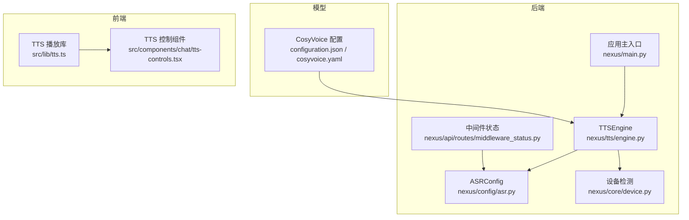
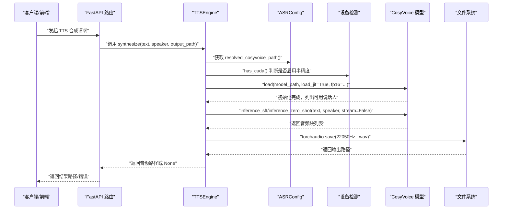
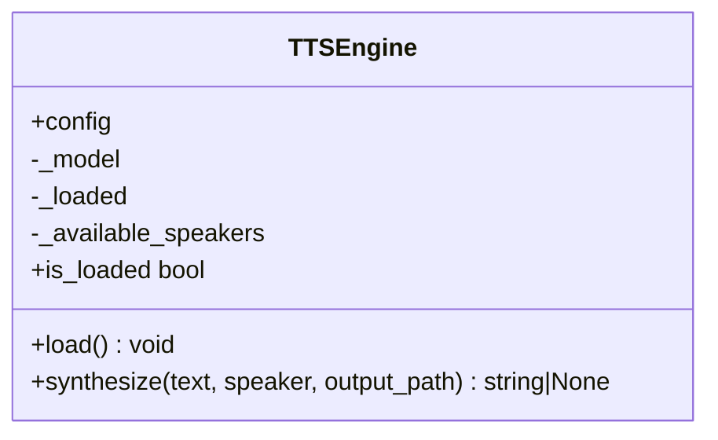
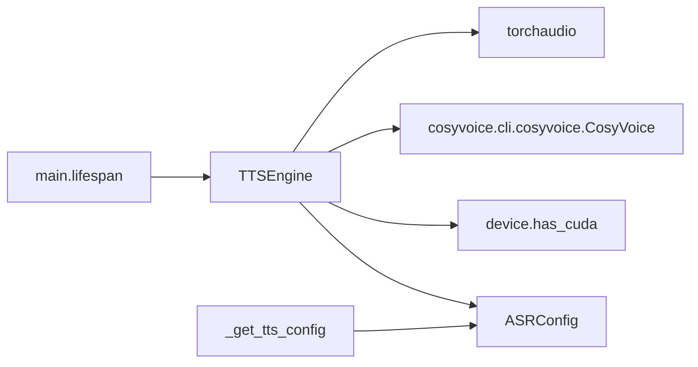

# TTS语音合成服务

<cite>
**本文引用的文件**   
- [backend_design/nexus/tts/engine.py](file://backend_design/nexus/tts/engine.py)
- [backend_design/nexus/config/asr.py](file://backend_design/nexus/config/asr.py)
- [backend_design/nexus/core/device.py](file://backend_design/nexus/core/device.py)
- [backend_design/nexus/api/routes/middleware_status.py](file://backend_design/nexus/api/routes/middleware_status.py)
- [backend_design/nexus/main.py](file://backend_design/nexus/main.py)
- [models/tts/cosyvoice/configuration.json](file://models/tts/cosyvoice/configuration.json)
- [models/tts/cosyvoice/cosyvoice.yaml](file://models/tts/cosyvoice/cosyvoice.yaml)
- [frontend_design/src/lib/tts.ts](file://frontend_design/src/lib/tts.ts)
- [frontend_design/src/components/chat/tts-controls.tsx](file://frontend_design/src/components/chat/tts-controls.tsx)
</cite>

## 目录
1. [简介](#简介)
2. [项目结构](#项目结构)
3. [核心组件](#核心组件)
4. [架构总览](#架构总览)
5. [详细组件分析](#详细组件分析)
6. [依赖关系分析](#依赖关系分析)
7. [性能考虑](#性能考虑)
8. [故障排除指南](#故障排除指南)
9. [结论](#结论)
10. [附录](#附录)

## 简介
本文件为 NexusCockpit 的 TTS 语音合成服务提供完整技术文档。TTS 引擎基于 CosyVoice，实现文本到语音转换、音频流处理、音色控制与音质优化；同时给出配置项说明、并发与内存管理策略、API 接口规范、参数校验与错误处理机制，并提供使用示例、性能调优建议与故障排查指引。

## 项目结构
TTS 相关代码主要分布在后端 Python 模块与前端播放库中：
- 后端引擎封装：nexus/tts/engine.py
- 模型路径与运行配置：nexus/config/asr.py（包含 CosyVoice 路径解析）
- 设备能力检测：nexus/core/device.py（CUDA/MPS）
- 中间件状态查询：nexus/api/routes/middleware_status.py（暴露 TTS 配置与健康信息）
- 应用启动与后台预加载：nexus/main.py（ASR/TTS 模型后台加载策略）
- CosyVoice 模型配置：models/tts/cosyvoice/configuration.json 与 cosyvoice.yaml
- 前端 TTS 播放库：frontend_design/src/lib/tts.ts（分句播放、状态机、保活机制）
- 前端 UI 控制组件：frontend_design/src/components/chat/tts-controls.tsx

图表来源 
- [backend_design/nexus/tts/engine.py:21-116](file://backend_design/nexus/tts/engine.py#L21-L116)
- [backend_design/nexus/config/asr.py:15-66](file://backend_design/nexus/config/asr.py#L15-L66)
- [backend_design/nexus/core/device.py:10-21](file://backend_design/nexus/core/device.py#L10-L21)
- [backend_design/nexus/api/routes/middleware_status.py:220-231](file://backend_design/nexus/api/routes/middleware_status.py#L220-L231)
- [backend_design/nexus/main.py:361-383](file://backend_design/nexus/main.py#L361-L383)
- [models/tts/cosyvoice/configuration.json:1-1](file://models/tts/cosyvoice/configuration.json#L1-L1)
- [models/tts/cosyvoice/cosyvoice.yaml:1-202](file://models/tts/cosyvoice/cosyvoice.yaml#L1-L202)
- [frontend_design/src/lib/tts.ts:1-443](file://frontend_design/src/lib/tts.ts#L1-L443)
- [frontend_design/src/components/chat/tts-controls.tsx:1-178](file://frontend_design/src/components/chat/tts-controls.tsx#L1-L178)

章节来源
- [backend_design/nexus/tts/engine.py:21-116](file://backend_design/nexus/tts/engine.py#L21-L116)
- [backend_design/nexus/config/asr.py:15-66](file://backend_design/nexus/config/asr.py#L15-L66)
- [backend_design/nexus/core/device.py:10-21](file://backend_design/nexus/core/device.py#L10-L21)
- [backend_design/nexus/api/routes/middleware_status.py:220-231](file://backend_design/nexus/api/routes/middleware_status.py#L220-L231)
- [backend_design/nexus/main.py:361-383](file://backend_design/nexus/main.py#L361-L383)
- [models/tts/cosyvoice/configuration.json:1-1](file://models/tts/cosyvoice/configuration.json#L1-L1)
- [models/tts/cosyvoice/cosyvoice.yaml:1-202](file://models/tts/cosyvoice/cosyvoice.yaml#L1-L202)
- [frontend_design/src/lib/tts.ts:1-443](file://frontend_design/src/lib/tts.ts#L1-L443)
- [frontend_design/src/components/chat/tts-controls.tsx:1-178](file://frontend_design/src/components/chat/tts-controls.tsx#L1-L178)

## 核心组件
- TTSEngine：封装 CosyVoice 推理流程，支持 SFT/Zero-shot 模式、说话人选择、音频保存与日志记录。
- ASRConfig：集中管理 ASR/TTS/声纹模型路径与环境变量覆盖，提供绝对路径解析方法。
- Device 检测：统一检测 CUDA/MPS 可用性，驱动 TTS 半精度加载。
- Middleware Status：对外暴露 TTS 引擎名称、模型路径、采样率与可用状态。
- 应用启动：后台异步预加载 ASR/TTS 模型，避免阻塞 FastAPI 启动。
- 前端 TTS 库：分句播放、全局状态机、Chrome speechSynthesis 保活、音乐联动。

章节来源
- [backend_design/nexus/tts/engine.py:21-116](file://backend_design/nexus/tts/engine.py#L21-L116)
- [backend_design/nexus/config/asr.py:15-66](file://backend_design/nexus/config/asr.py#L15-L66)
- [backend_design/nexus/core/device.py:10-21](file://backend_design/nexus/core/device.py#L10-L21)
- [backend_design/nexus/api/routes/middleware_status.py:220-231](file://backend_design/nexus/api/routes/middleware_status.py#L220-L231)
- [backend_design/nexus/main.py:361-383](file://backend_design/nexus/main.py#L361-L383)
- [frontend_design/src/lib/tts.ts:1-443](file://frontend_design/src/lib/tts.ts#L1-L443)

## 架构总览
下图展示从请求到音频输出的端到端流程，包括后端引擎加载、推理与保存，以及前端的分句播放与状态管理。

图表来源 
- [backend_design/nexus/tts/engine.py:33-111](file://backend_design/nexus/tts/engine.py#L33-L111)
- [backend_design/nexus/config/asr.py:55-61](file://backend_design/nexus/config/asr.py#L55-L61)
- [backend_design/nexus/core/device.py:10-21](file://backend_design/nexus/core/device.py#L10-L21)

章节来源
- [backend_design/nexus/tts/engine.py:33-111](file://backend_design/nexus/tts/engine.py#L33-L111)
- [backend_design/nexus/config/asr.py:55-61](file://backend_design/nexus/config/asr.py#L55-L61)
- [backend_design/nexus/core/device.py:10-21](file://backend_design/nexus/core/device.py#L10-L21)

## 详细组件分析

### TTSEngine（语音合成引擎）
- 功能要点
  - 懒加载：首次调用 load() 时根据配置路径加载 CosyVoice，支持 JIT 加速与可选半精度。
  - 说话人管理：自动列举可用说话人，未指定时使用第一个。
  - 推理模式：SFT 模式（指定说话人）与 Zero-shot 模式（无参考）。
  - 音频保存：默认 22050Hz，WAV 格式，按块保存并生成多段文件。
  - 错误处理：导入失败、模型路径不存在、推理异常均记录日志并返回 None。
- 关键方法与行为
  - load(): 初始化模型、列举说话人、设置 _loaded 标志。
  - synthesize(): 参数校验、选择推理模式、保存音频、返回路径。
  - is_loaded: 属性用于外部检查模型是否已加载。

图表来源 
- [backend_design/nexus/tts/engine.py:21-116](file://backend_design/nexus/tts/engine.py#L21-L116)

章节来源
- [backend_design/nexus/tts/engine.py:21-116](file://backend_design/nexus/tts/engine.py#L21-L116)

### 配置与路径解析（ASRConfig）
- 作用：统一管理 ASR/TTS/声纹模型路径，支持环境变量覆盖与相对路径解析为绝对路径。
- 关键字段
  - cosyvoice_model_path：CosyVoice 模型目录，默认 ./models/tts/cosyvoice。
  - resolved_cosyvoice_path()：返回已解析的绝对路径。
- 环境变量
  - COSYVOICE_MODEL_PATH：覆盖默认模型路径。

章节来源
- [backend_design/nexus/config/asr.py:15-66](file://backend_design/nexus/config/asr.py#L15-L66)

### 设备能力检测（device.has_cuda）
- 作用：检测 CUDA 或 Apple MPS 可用性，决定 TTS 是否以半精度加载以提升性能。
- 返回值：布尔值，True 表示可用 GPU/MPS 后端。

章节来源
- [backend_design/nexus/core/device.py:10-21](file://backend_design/nexus/core/device.py#L10-L21)

### 中间件状态接口（_get_tts_config）
- 作用：对外暴露 TTS 引擎名称、模型路径、采样率与可用状态。
- 字段说明
  - name：固定为“TTS 语音合成”。
  - status：若模型路径存在则为 available，否则 model_not_found。
  - engine：固定为“CosyVoice”。
  - model_path：已解析的绝对路径。
  - sample_rate：固定为 22050。

章节来源
- [backend_design/nexus/api/routes/middleware_status.py:220-231](file://backend_design/nexus/api/routes/middleware_status.py#L220-L231)

### 应用启动与后台预加载（main.lifespan）
- 背景：ASR/TTS 模型体积大，同步加载会阻塞 FastAPI 启动。
- 策略：使用 asyncio.create_task 在后台线程池执行模型加载，不阻塞服务就绪。
- 影响：首次请求到达时若模型已加载则直接使用，否则按需加载。

章节来源
- [backend_design/nexus/main.py:361-383](file://backend_design/nexus/main.py#L361-L383)

### 前端 TTS 播放库（lib/tts.ts）
- 特性
  - 分句播放：按中文/英文标点智能切分，逐句播报。
  - 全局状态机：idle/playing/paused/stopped，支持暂停、断点续播、单句重放、整条重放、终止播放。
  - Chrome 保活：周期性 pause→resume 防止长时间播放事件冻结。
  - 音乐联动：朗读开始前暂停座舱音乐，结束后恢复。
- 关键函数
  - speakSentences(text, messageId?)：开始分句播放。
  - pausePlayback()/resumePlayback()：暂停/恢复。
  - replayCurrentSentence()/replayPlayback()：单句/整条重放。
  - stopPlayback()：终止播放并重置状态。
  - jumpToSentence(index)：跳转到指定句子播放。
  - getPlaybackState()/getPlaybackProgress()/getPlaybackMessageId()：查询状态与进度。

章节来源
- [frontend_design/src/lib/tts.ts:1-443](file://frontend_design/src/lib/tts.ts#L1-L443)

### 前端 TTS 控制组件（tts-controls.tsx）
- 功能：挂载在每条 AI 消息下方，提供播放/暂停、重放、终止按钮，显示当前播放进度与活跃消息高亮。
- 交互：订阅全局状态变更，确保同一时间只有一条消息在播放。

章节来源
- [frontend_design/src/components/chat/tts-controls.tsx:1-178](file://frontend_design/src/components/chat/tts-controls.tsx#L1-L178)

## 依赖关系分析
- TTSEngine 依赖
  - 配置：ASRConfig.resolved_cosyvoice_path() 提供模型路径。
  - 设备：device.has_cuda() 决定是否启用半精度。
  - 第三方：cosyvoice.cli.cosyvoice.CosyVoice（推理）、torchaudio（音频保存）。
- 中间件状态依赖
  - 读取 ASRConfig 中的 CosyVoice 路径，判断模型是否存在。
- 应用启动依赖
  - 通过 asyncio 后台任务预加载 ASR/TTS 模型，避免阻塞。

图表来源 
- [backend_design/nexus/tts/engine.py:21-116](file://backend_design/nexus/tts/engine.py#L21-L116)
- [backend_design/nexus/config/asr.py:15-66](file://backend_design/nexus/config/asr.py#L15-L66)
- [backend_design/nexus/core/device.py:10-21](file://backend_design/nexus/core/device.py#L10-L21)
- [backend_design/nexus/api/routes/middleware_status.py:220-231](file://backend_design/nexus/api/routes/middleware_status.py#L220-L231)
- [backend_design/nexus/main.py:361-383](file://backend_design/nexus/main.py#L361-L383)

章节来源
- [backend_design/nexus/tts/engine.py:21-116](file://backend_design/nexus/tts/engine.py#L21-L116)
- [backend_design/nexus/config/asr.py:15-66](file://backend_design/nexus/config/asr.py#L15-L66)
- [backend_design/nexus/core/device.py:10-21](file://backend_design/nexus/core/device.py#L10-L21)
- [backend_design/nexus/api/routes/middleware_status.py:220-231](file://backend_design/nexus/api/routes/middleware_status.py#L220-L231)
- [backend_design/nexus/main.py:361-383](file://backend_design/nexus/main.py#L361-L383)

## 性能考虑
- 模型加载与预热
  - 使用 JIT 加载提升推理速度；在 GPU/MPS 可用时启用半精度减少显存占用与计算量。
  - 后台预加载避免阻塞服务启动，首次请求延迟更可控。
- 音频处理
  - 固定采样率 22050Hz，WAV 格式便于兼容与调试；分块保存降低单次 I/O 压力。
- 并发与资源
  - 模型加载在线程池中执行，避免阻塞事件循环。
  - 前端分句播放与状态机减少浏览器端卡顿风险。
- 可观测性
  - 通过中间件状态接口暴露引擎名称、模型路径、采样率与可用状态，便于监控与诊断。

[本节为通用指导，不直接分析具体文件]

## 故障排除指南
- 模型路径不存在
  - 现象：日志提示模型路径未找到，TTS 不可用。
  - 处理：检查 ASRConfig 中 cosyvoice_model_path 是否正确，确认环境变量 COSYVOICE_MODEL_PATH 覆盖有效。
- CosyVoice 未安装
  - 现象：导入失败，TTS 被禁用。
  - 处理：安装 cosyvoice 依赖并确保版本兼容。
- 推理失败
  - 现象：synthesize 返回 None，日志记录异常。
  - 处理：检查输入文本与说话人有效性，确认模型加载成功。
- 前端播放异常
  - 现象：Chrome 长时间播放后事件不触发。
  - 处理：前端已内置保活机制；如仍异常，检查浏览器兼容性与时钟频率。

章节来源
- [backend_design/nexus/tts/engine.py:33-111](file://backend_design/nexus/tts/engine.py#L33-L111)
- [backend_design/nexus/config/asr.py:55-61](file://backend_design/nexus/config/asr.py#L55-L61)
- [frontend_design/src/lib/tts.ts:160-183](file://frontend_design/src/lib/tts.ts#L160-L183)

## 结论
NexusCockpit 的 TTS 服务以 CosyVoice 为核心，结合灵活的配置管理与健壮的错误处理，提供稳定高效的文本到语音转换能力。前后端协同实现了分句播放、状态管理与用户体验优化。通过后台预加载与设备能力检测，系统在性能与资源利用上达到良好平衡。建议在生产环境持续监控模型可用性与推理耗时，并根据硬件条件调整半精度与缓存策略。

[本节为总结，不直接分析具体文件]

## 附录

### API 接口定义（TTS 中间件状态）
- 端点：/middleware（由 middleware_router 注册）
- 子接口：_get_tts_config()
- 返回字段
  - name：字符串，“TTS 语音合成”
  - status：枚举，“available” 或 “model_not_found”
  - engine：字符串，“CosyVoice”
  - model_path：字符串，已解析的绝对路径
  - sample_rate：整数，22050

章节来源
- [backend_design/nexus/api/routes/middleware_status.py:220-231](file://backend_design/nexus/api/routes/middleware_status.py#L220-L231)

### 模型配置概览（CosyVoice）
- configuration.json：框架与任务类型声明（Pytorch，text-to-speech）
- cosyvoice.yaml：模型结构与超参（采样率、编码器、Flow、HiFi-GAN、训练配置等）

章节来源
- [models/tts/cosyvoice/configuration.json:1-1](file://models/tts/cosyvoice/configuration.json#L1-L1)
- [models/tts/cosyvoice/cosyvoice.yaml:1-202](file://models/tts/cosyvoice/cosyvoice.yaml#L1-L202)

### 使用示例（后端）
- 初始化与加载
  - 创建 TTSEngine 实例，调用 load() 加载模型。
- 合成语音
  - 调用 synthesize(text="你好", speaker="speaker_id", output_path="/tmp/out.wav")
  - 返回生成的 WAV 文件路径；失败返回 None。

章节来源
- [backend_design/nexus/tts/engine.py:33-111](file://backend_design/nexus/tts/engine.py#L33-L111)

### 使用示例（前端）
- 分句播放
  - 调用 speakSentences("这是一段测试文本", messageId="msg_001")
- 控制播放
  - pausePlayback()/resumePlayback()/replayPlayback()/stopPlayback()
- 查询状态
  - getPlaybackState()/getPlaybackProgress()/getPlaybackMessageId()

章节来源
- [frontend_design/src/lib/tts.ts:282-420](file://frontend_design/src/lib/tts.ts#L282-L420)
- [frontend_design/src/components/chat/tts-controls.tsx:59-112](file://frontend_design/src/components/chat/tts-controls.tsx#L59-L112)