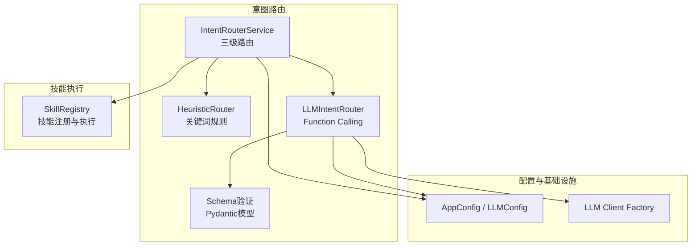
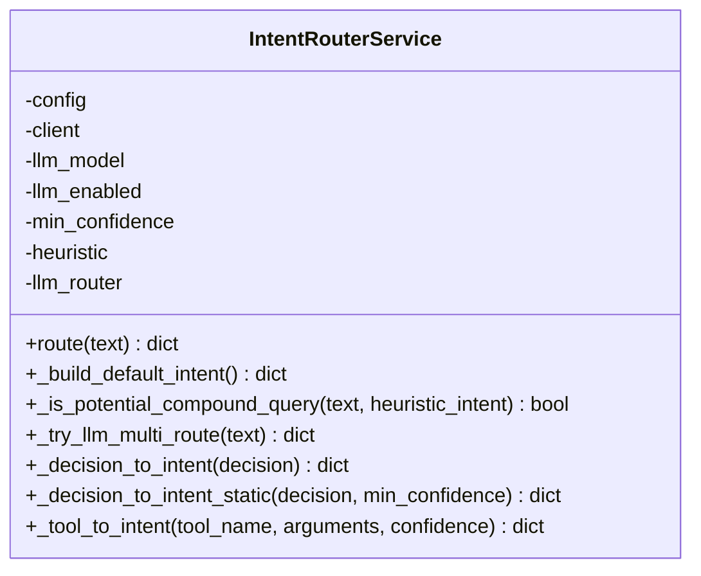
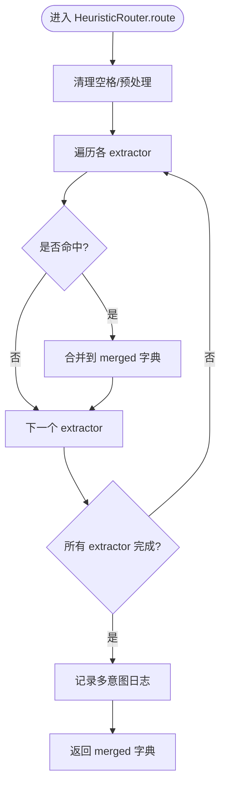
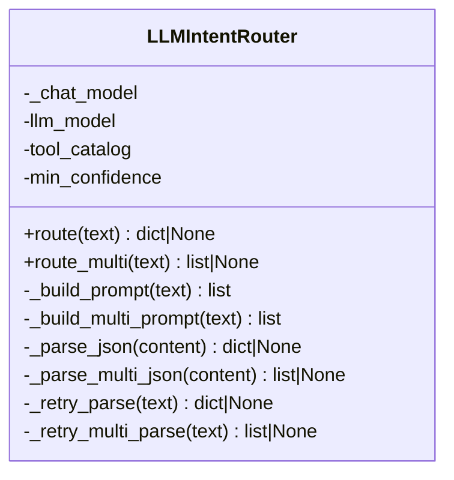
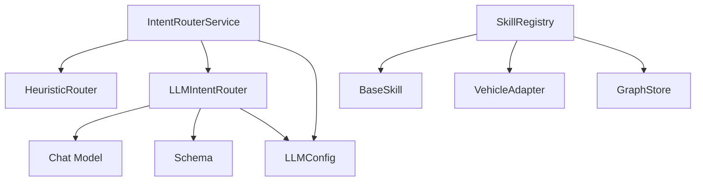

# 意图路由系统

<cite>
**本文引用的文件**   
- [router.py](file://backend_design/nexus/intent/router.py)
- [heuristic.py](file://backend_design/nexus/intent/heuristic.py)
- [llm_router.py](file://backend_design/nexus/intent/llm_router.py)
- [schema.py](file://backend_design/nexus/intent/schema.py)
- [constants.py](file://backend_design/nexus/intent/constants.py)
- [registry.py](file://backend_design/nexus/skills/registry.py)
- [__init__.py](file://backend_design/nexus/config/__init__.py)
- [llm.py](file://backend_design/nexus/config/llm.py)
- [test_agent.py](file://backend_design/tests/test_agent.py)
</cite>

## 目录
1. [简介](#简介)
2. [项目结构](#项目结构)
3. [核心组件](#核心组件)
4. [架构总览](#架构总览)
5. [详细组件分析](#详细组件分析)
6. [依赖关系分析](#依赖关系分析)
7. [性能考量](#性能考量)
8. [故障排查指南](#故障排查指南)
9. [结论](#结论)
10. [附录](#附录)

## 简介
本文件为 NexusCockpit 的“意图路由系统”提供系统化、可操作的文档。内容覆盖：
- 自然语言意图识别机制：启发式规则匹配、LLM 智能路由与混合决策策略
- 意图分类算法、上下文感知与多轮对话状态管理要点
- 路由器配置项、路由规则与扩展点设计
- 意图定义规范、测试方法与调试工具使用指南

该系统的目标是：在车载语音交互场景中，快速、准确地将用户输入路由到合适的技能（车控、搜索、天气、导航、媒体、健康诊断、习惯画像、提醒等），并支持复合查询与降级兜底。

## 项目结构
意图路由相关代码集中在 backend_design/nexus/intent 包内，并与 skills 注册中心、LLM 客户端工厂、配置模块紧密协作。



图表来源
- [router.py:32-101](file://backend_design/nexus/intent/router.py#L32-L101)
- [heuristic.py:27-89](file://backend_design/nexus/intent/heuristic.py#L27-L89)
- [llm_router.py:22-36](file://backend_design/nexus/intent/llm_router.py#L22-L36)
- [schema.py:35-60](file://backend_design/nexus/intent/schema.py#L35-L60)
- [registry.py:36-57](file://backend_design/nexus/skills/registry.py#L36-L57)
- [__init__.py:84-131](file://backend_design/nexus/config/__init__.py#L84-L131)
- [llm.py:15-51](file://backend_design/nexus/config/llm.py#L15-L51)

章节来源
- [router.py:1-117](file://backend_design/nexus/intent/router.py#L1-L117)
- [heuristic.py:1-90](file://backend_design/nexus/intent/heuristic.py#L1-L90)
- [llm_router.py:1-40](file://backend_design/nexus/intent/llm_router.py#L1-L40)
- [schema.py:1-60](file://backend_design/nexus/intent/schema.py#L1-L60)
- [registry.py:1-60](file://backend_design/nexus/skills/registry.py#L1-L60)
- [__init__.py:84-131](file://backend_design/nexus/config/__init__.py#L84-L131)
- [llm.py:1-51](file://backend_design/nexus/config/llm.py#L1-L51)

## 核心组件
- IntentRouterService：统一入口，实现三级路由（启发式 → LLM → 默认闲聊），内置复合查询增强与结构化日志。
- HeuristicRouter：基于关键词与正则的快速规则引擎，支持分段解析以处理复合指令。
- LLMIntentRouter：通过 Function Calling 调用 LLM 进行语义理解与参数提取，具备 JSON 解析重试与多意图输出能力。
- Schema：Pydantic 模型校验 LLM 输出，确保格式稳定。
- SkillRegistry：技能注册与执行中心，提供 Tool Schema 生成与批量并行执行。
- 配置模块：集中管理 LLM、第三方服务与运行时开关。

章节来源
- [router.py:32-117](file://backend_design/nexus/intent/router.py#L32-L117)
- [heuristic.py:27-89](file://backend_design/nexus/intent/heuristic.py#L27-L89)
- [llm_router.py:22-40](file://backend_design/nexus/intent/llm_router.py#L22-L40)
- [schema.py:35-60](file://backend_design/nexus/intent/schema.py#L35-L60)
- [registry.py:36-57](file://backend_design/nexus/skills/registry.py#L36-L57)
- [__init__.py:84-131](file://backend_design/nexus/config/__init__.py#L84-L131)

## 架构总览
意图路由采用“快速路径 + 慢速路径 + 安全兜底”的分层架构：
- Level 1 启发式：毫秒级命中常见车控指令，避免不必要的 LLM 调用。
- Level 1.5 复合查询增强：当启发式仅部分命中时，触发 LLM 多意图路由补充未识别需求。
- Level 2 LLM：语义理解与参数抽取，适用于复杂/模糊意图。
- Level 3 默认闲聊：无匹配时的安全兜底。

```mermaid
sequenceDiagram
participant U as "用户"
participant IR as "IntentRouterService"
participant HR as "HeuristicRouter"
participant LR as "LLMIntentRouter"
participant SR as "SkillRegistry"
U->>IR : 输入文本
IR->>HR : route(text)
alt 启发式命中
HR-->>IR : 意图字典(可能部分命中)
IR->>IR : 检测复合查询
opt 需要LLM补充
IR->>LR : route_multi(text)
LR-->>IR : 多意图决策列表
IR-->>U : 合并后的意图
else 无需补充
IR-->>U : 返回启发式意图
end
else 启发式未命中
IR->>LR : route(text)
alt LLM成功
LR-->>IR : 单意图决策
IR-->>U : 转换为标准意图
else LLM失败或低置信度
IR-->>U : 默认闲聊意图
end
end
```

图表来源
- [router.py:103-217](file://backend_design/nexus/intent/router.py#L103-L217)
- [heuristic.py:46-89](file://backend_design/nexus/intent/heuristic.py#L46-L89)
- [llm_router.py:38-100](file://backend_design/nexus/intent/llm_router.py#L38-L100)
- [llm_router.py:102-168](file://backend_design/nexus/intent/llm_router.py#L102-L168)

## 详细组件分析

### IntentRouterService（统一路由服务）
- 职责：编排三级路由、复合查询增强、意图标准化、结构化日志与异常降级。
- 关键流程：
  - 构建默认意图模板（深拷贝避免共享引用）。
  - 先走启发式；若部分命中且疑似复合查询，则调用 LLM 多意图路由补充。
  - 启发式未命中时走 LLM 单意图路由；失败或低置信度时回退默认闲聊。
  - 将 LLM 决策映射为标准意图字段，设置 Route_Source 与 Route_Confidence。
- 扩展点：
  - _tool_to_intent_static：新增技能映射需在此处增加分支。
  - _is_potential_compound_query：调整复合查询判定阈值与策略。
  - min_confidence：控制 LLM 置信度阈值。



图表来源
- [router.py:32-117](file://backend_design/nexus/intent/router.py#L32-L117)
- [router.py:219-222](file://backend_design/nexus/intent/router.py#L219-L222)
- [router.py:228-275](file://backend_design/nexus/intent/router.py#L228-L275)
- [router.py:277-314](file://backend_design/nexus/intent/router.py#L277-L314)
- [router.py:316-352](file://backend_design/nexus/intent/router.py#L316-L352)
- [router.py:354-576](file://backend_design/nexus/intent/router.py#L354-L576)

章节来源
- [router.py:1-217](file://backend_design/nexus/intent/router.py#L1-L217)
- [router.py:219-576](file://backend_design/nexus/intent/router.py#L219-L576)

### HeuristicRouter（关键词规则路由器）
- 职责：基于领域关键词与正则表达式快速识别意图，支持分段解析以避免跨域误匹配。
- 支持的意图类别：空调、车窗、座椅、导航、媒体、车况、时间查询、周边 POI、天气、通用搜索、点餐、对话历史查询。
- 复合指令处理：按标点拆分子句，各 extractor 仅在包含自身领域关键词的子句中解析操作动词，避免“打开音乐，关闭车窗”中的“打开”被车窗提取器误判。
- 优先级：对话历史查询优先于车控指令，确保并行不遗漏。



图表来源
- [heuristic.py:46-89](file://backend_design/nexus/intent/heuristic.py#L46-L89)
- [heuristic.py:116-135](file://backend_design/nexus/intent/heuristic.py#L116-L135)
- [heuristic.py:137-270](file://backend_design/nexus/intent/heuristic.py#L137-L270)
- [heuristic.py:272-337](file://backend_design/nexus/intent/heuristic.py#L272-L337)
- [heuristic.py:339-399](file://backend_design/nexus/intent/heuristic.py#L339-L399)
- [heuristic.py:401-462](file://backend_design/nexus/intent/heuristic.py#L401-L462)
- [heuristic.py:464-534](file://backend_design/nexus/intent/heuristic.py#L464-L534)
- [heuristic.py:536-545](file://backend_design/nexus/intent/heuristic.py#L536-L545)
- [heuristic.py:547-564](file://backend_design/nexus/intent/heuristic.py#L547-L564)
- [heuristic.py:566-633](file://backend_design/nexus/intent/heuristic.py#L566-L633)
- [heuristic.py:635-657](file://backend_design/nexus/intent/heuristic.py#L635-L657)
- [heuristic.py:659-727](file://backend_design/nexus/intent/heuristic.py#L659-L727)
- [heuristic.py:729-737](file://backend_design/nexus/intent/heuristic.py#L729-L737)

章节来源
- [heuristic.py:1-738](file://backend_design/nexus/intent/heuristic.py#L1-L738)

### LLMIntentRouter（LLM 智能路由）
- 职责：通过 Function Calling 让 LLM 选择最合适的技能并提取参数；支持单意图与多意图输出；具备 JSON 解析失败的重试机制。
- 提示词工程：
  - 单意图：要求只输出 JSON，包含 selected_tool、arguments、confidence、need_clarification、clarification_question、reason。
  - 多意图：要求输出 tools 列表，每个元素为一个 IntentDecision。
- 解析与校验：使用 Pydantic schema 严格校验输出，防止格式漂移导致路由失效。
- 降级策略：首次解析失败后自动重试一次，仍失败则返回 None，由上层降级。



图表来源
- [llm_router.py:22-36](file://backend_design/nexus/intent/llm_router.py#L22-L36)
- [llm_router.py:38-70](file://backend_design/nexus/intent/llm_router.py#L38-L70)
- [llm_router.py:72-100](file://backend_design/nexus/intent/llm_router.py#L72-L100)
- [llm_router.py:102-139](file://backend_design/nexus/intent/llm_router.py#L102-L139)
- [llm_router.py:141-168](file://backend_design/nexus/intent/llm_router.py#L141-L168)
- [llm_router.py:170-222](file://backend_design/nexus/intent/llm_router.py#L170-L222)
- [llm_router.py:224-245](file://backend_design/nexus/intent/llm_router.py#L224-L245)
- [llm_router.py:247-289](file://backend_design/nexus/intent/llm_router.py#L247-L289)
- [llm_router.py:291-310](file://backend_design/nexus/intent/llm_router.py#L291-L310)

章节来源
- [llm_router.py:1-313](file://backend_design/nexus/intent/llm_router.py#L1-L313)

### Schema（Pydantic 校验）
- 作用：为 LLM 输出提供强类型校验，确保 selected_tool、arguments、confidence、need_clarification 等字段符合预期。
- 关键模型：
  - IntentDecision：单意图决策
  - MultiIntentDecision：多意图决策（tools 列表）
  - ReflectionResult：反思结果（用于后续反思节点）
- 解析函数：
  - parse_intent_decision：清洗并解析单意图 JSON
  - parse_multi_intent_decision：兼容单工具格式包装为 multi 格式

章节来源
- [schema.py:35-60](file://backend_design/nexus/intent/schema.py#L35-L60)
- [schema.py:70-91](file://backend_design/nexus/intent/schema.py#L70-L91)
- [schema.py:94-135](file://backend_design/nexus/intent/schema.py#L94-L135)
- [schema.py:138-159](file://backend_design/nexus/intent/schema.py#L138-L159)

### SkillRegistry（技能注册与执行）
- 作用：扫描装饰器与手动注册的技能，生成 Tool Schema，提供 execute 与 execute_batch 接口。
- 特性：
  - 自动发现与手动注入依赖（如 vehicle_adapter、graph_store）
  - 分组查询（VEHICLE、LIFESTYLE、CHAT）
  - 副作用标记与缓存 TTL 控制
  - 超时保护与瞬时故障重试
- 与意图路由的关系：
  - IntentRouterService 将 LLM 决策映射为标准意图字段，最终由下游专家/技能执行器根据 tool_name 调用 SkillRegistry.execute。

章节来源
- [registry.py:36-57](file://backend_design/nexus/skills/registry.py#L36-L57)
- [registry.py:59-91](file://backend_design/nexus/skills/registry.py#L59-L91)
- [registry.py:93-167](file://backend_design/nexus/skills/registry.py#L93-L167)
- [registry.py:222-286](file://backend_design/nexus/skills/registry.py#L222-L286)
- [registry.py:288-319](file://backend_design/nexus/skills/registry.py#L288-L319)

### 常量与分类
- VEHICLE_INTENT_KEYS：车控意图字段集合（空调、车窗、座椅、媒体、车况）
- NON_VEHICLE_INTENT_KEYS：非车控意图字段集合（历史查询、搜索、天气、POI、点餐、健康、习惯、提醒）
- VEHICLE_CACHE_KEYWORDS：车控关键词，用于语义缓存清理
- STREAM_SPLIT_PUNCT：TTS 流式分句标点
- HALLUCINATED_HISTORY_PATTERNS：幻觉检测模式

章节来源
- [constants.py:12-41](file://backend_design/nexus/intent/constants.py#L12-L41)
- [constants.py:43-52](file://backend_design/nexus/intent/constants.py#L43-L52)

## 依赖关系分析
- IntentRouterService 依赖：
  - HeuristicRouter（快速路径）
  - LLMIntentRouter（慢速路径）
  - LLM 客户端工厂（获取 chat model）
  - 配置模块（LLM 配置）
- LLMIntentRouter 依赖：
  - Chat Model（ainvoke）
  - Schema 校验（Pydantic）
- SkillRegistry 依赖：
  - BaseSkill 子类（具体技能实现）
  - 外部适配器（vehicle_adapter、graph_store）



图表来源
- [router.py:23-28](file://backend_design/nexus/intent/router.py#L23-L28)
- [llm_router.py:15-17](file://backend_design/nexus/intent/llm_router.py#L15-L17)
- [schema.py:32-33](file://backend_design/nexus/intent/schema.py#L32-L33)
- [registry.py:26-31](file://backend_design/nexus/skills/registry.py#L26-L31)
- [__init__.py:84-131](file://backend_design/nexus/config/__init__.py#L84-L131)
- [llm.py:15-51](file://backend_design/nexus/config/llm.py#L15-L51)

章节来源
- [router.py:23-28](file://backend_design/nexus/intent/router.py#L23-L28)
- [llm_router.py:15-17](file://backend_design/nexus/intent/llm_router.py#L15-L17)
- [schema.py:32-33](file://backend_design/nexus/intent/schema.py#L32-L33)
- [registry.py:26-31](file://backend_design/nexus/skills/registry.py#L26-L31)
- [__init__.py:84-131](file://backend_design/nexus/config/__init__.py#L84-L131)
- [llm.py:15-51](file://backend_design/nexus/config/llm.py#L15-L51)

## 性能考量
- 启发式路由：毫秒级响应，覆盖高频车控指令，显著降低 LLM 调用成本。
- 复合查询增强：仅在启发式部分命中时触发 LLM 多意图路由，减少不必要调用。
- LLM 路由：1-3s 延迟，适用于复杂/模糊意图；具备 JSON 解析重试，提高鲁棒性。
- 技能执行：execute_batch 并行执行无冲突技能，提升复合指令吞吐。
- 配置优化：通过 LLMConfig.timeout、temperature、max_tokens 等参数调优响应质量与速度。

[本节为通用指导，不直接分析具体文件]

## 故障排查指南
- 启发式路由异常：
  - 现象：启发式阶段抛出异常，日志显示 level=heuristic | status=ERROR
  - 处理：自动降级到 LLM 路由，不影响整体流程；检查关键词与正则匹配逻辑
- LLM 路由异常：
  - 现象：JSON 解析失败，触发重试；仍失败则返回 None，上层降级默认闲聊
  - 处理：检查提示词约束、LLM 输出格式；确认 tool_catalog 是否正确传入
- 默认闲聊兜底：
  - 现象：Route_Source=default，说明未命中任何技能
  - 处理：检查输入是否过于模糊；考虑增加关键词或优化 LLM 提示词
- 技能执行失败：
  - 现象：SkillRegistry.execute 返回 error，包含错误原因
  - 处理：检查技能依赖注入（vehicle_adapter、graph_store）、超时与重试策略

章节来源
- [router.py:128-136](file://backend_design/nexus/intent/router.py#L128-L136)
- [router.py:177-217](file://backend_design/nexus/intent/router.py#L177-L217)
- [llm_router.py:62-70](file://backend_design/nexus/intent/llm_router.py#L62-L70)
- [llm_router.py:132-139](file://backend_design/nexus/intent/llm_router.py#L132-L139)
- [registry.py:222-286](file://backend_design/nexus/skills/registry.py#L222-L286)

## 结论
NexusCockpit 的意图路由系统通过“启发式 + LLM + 默认兜底”的三级策略，实现了高可用、高性能、可扩展的自然语言意图识别。其分段解析、复合查询增强、Pydantic 校验与技能并行执行等设计，确保了在车载场景下的准确性与稳定性。建议在生产环境中结合日志与指标持续优化关键词库与提示词，并根据业务需求扩展新技能映射。

[本节为总结，不直接分析具体文件]

## 附录

### 意图定义规范
- 标准意图字段：
  - Call_elm、Food_candidate、Need_Search、Register_Action
  - Climate_Action、Window_Action、Seat_Action
  - Navigation_Action、Media_Action、Vehicle_Status_Action
  - Poi_Search_Action、Weather_Action、Health_Action、Habit_Action、Reminder_Action、History_Query_Action
  - Need_Clarification、Clarification_Prompt、Route_Source、Route_Confidence
- 字段含义与取值范围见 IntentRouterService._DEFAULT_INTENT_TEMPLATE 与各 _tool_to_intent 分支映射。

章节来源
- [router.py:46-80](file://backend_design/nexus/intent/router.py#L46-L80)
- [router.py:354-576](file://backend_design/nexus/intent/router.py#L354-L576)

### 配置选项
- LLM 配置（LLMConfig）：
  - provider、ark_api_key、ark_base_url、llm_model、embedding_model、temperature、max_tokens、timeout
  - fallback_* 系列用于本地 llama.cpp 切换
  - reflection_enabled、memory_extraction_enabled、llm_concurrency_limit
- 全局配置（AppConfig）：聚合所有子系统配置，通过 get_config() 访问。

章节来源
- [llm.py:15-51](file://backend_design/nexus/config/llm.py#L15-L51)
- [__init__.py:84-131](file://backend_design/nexus/config/__init__.py#L84-L131)

### 测试方法
- 启发式路由测试：覆盖空调、车窗、导航、闲聊等典型用例
- 意图路由服务测试：默认意图构建、启发式快速路径、闲聊兜底
- LLM 客户端工厂测试：单例、重置、chat model 创建、fallback 行为
- 技能注册中心测试：初始化、按名获取、Tool Schema、StructuredTool 转换、分组查询

章节来源
- [test_agent.py:23-55](file://backend_design/tests/test_agent.py#L23-L55)
- [test_agent.py:57-83](file://backend_design/tests/test_agent.py#L57-L83)
- [test_agent.py:89-125](file://backend_design/tests/test_agent.py#L89-L125)
- [test_agent.py:131-182](file://backend_design/tests/test_agent.py#L131-L182)
- [test_agent.py:188-211](file://backend_design/tests/test_agent.py#L188-L211)

### 调试工具与日志
- 结构化路由日志：
  - level=heuristic | status=HIT/MISS | matched_keys
  - level=llm | status=HIT/MISS/RESOLVE_FAILED | tool/confidence
  - level=default | status=FALLBACK
- 复合查询检测日志：segments、matched_intents
- LLM 路由重试日志：首次失败、重试成功/失败详情

章节来源
- [router.py:138-175](file://backend_design/nexus/intent/router.py#L138-L175)
- [router.py:177-217](file://backend_design/nexus/intent/router.py#L177-L217)
- [router.py:271-275](file://backend_design/nexus/intent/router.py#L271-L275)
- [llm_router.py:62-70](file://backend_design/nexus/intent/llm_router.py#L62-L70)
- [llm_router.py:132-139](file://backend_design/nexus/intent/llm_router.py#L132-L139)