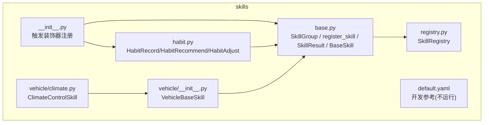
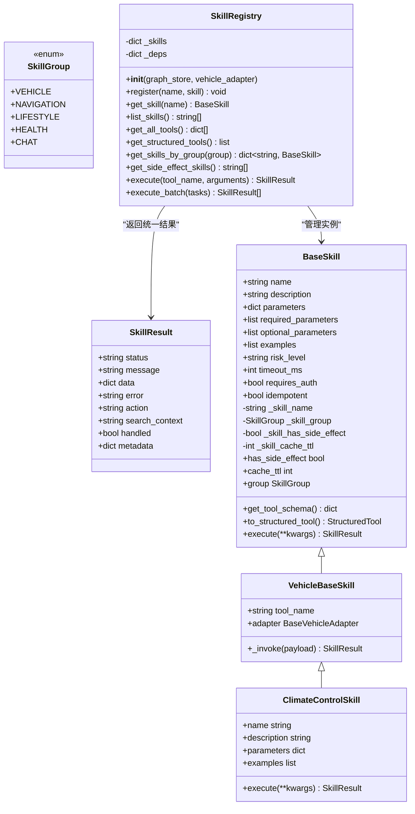
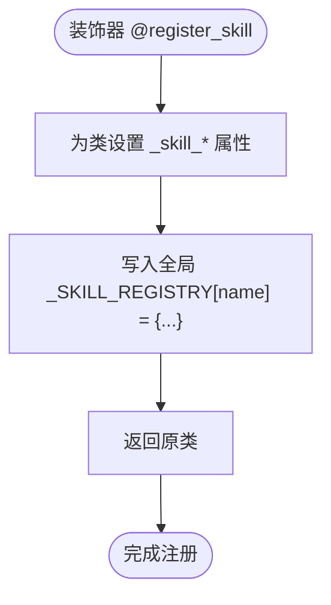
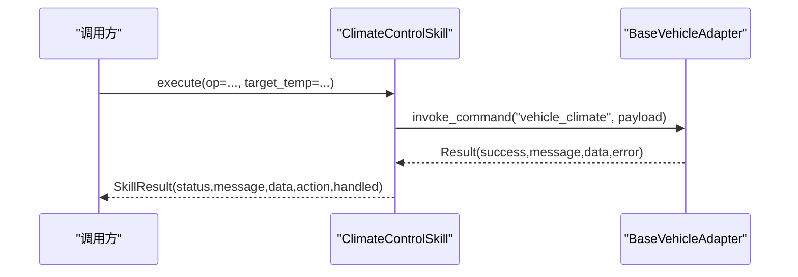
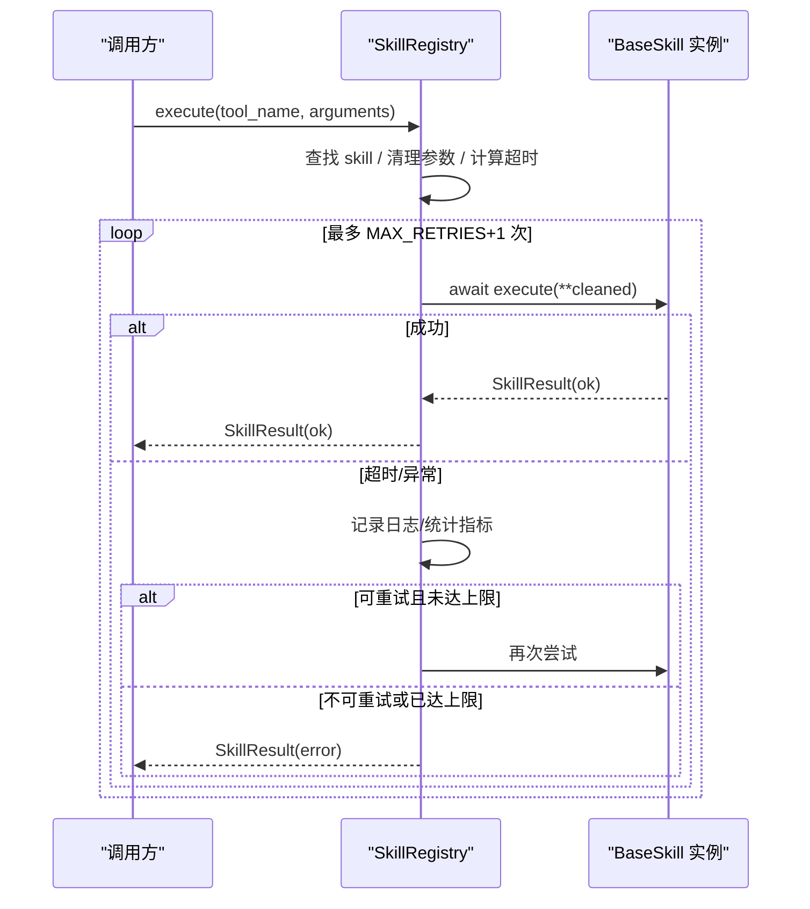
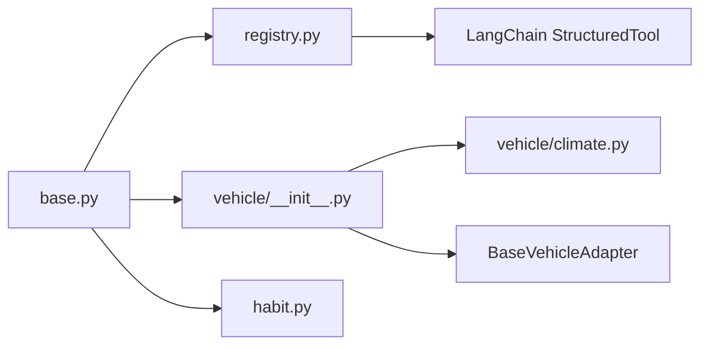

# 技能基类框架

<cite>
**本文引用的文件**   
- [backend_design/nexus/skills/base.py](file://backend_design/nexus/skills/base.py)
- [backend_design/nexus/skills/registry.py](file://backend_design/nexus/skills/registry.py)
- [backend_design/nexus/skills/__init__.py](file://backend_design/nexus/skills/__init__.py)
- [backend_design/nexus/skills/vehicle/__init__.py](file://backend_design/nexus/skills/vehicle/__init__.py)
- [backend_design/nexus/skills/vehicle/climate.py](file://backend_design/nexus/skills/vehicle/climate.py)
- [backend_design/nexus/skills/habit.py](file://backend_design/nexus/skills/habit.py)
- [backend_design/nexus/skills/default.yaml](file://backend_design/nexus/skills/default.yaml)
</cite>

## 目录
1. [简介](#简介)
2. [项目结构](#项目结构)
3. [核心组件](#核心组件)
4. [架构总览](#架构总览)
5. [详细组件分析](#详细组件分析)
6. [依赖关系分析](#依赖关系分析)
7. [性能与缓存策略](#性能与缓存策略)
8. [参数验证与错误处理](#参数验证与错误处理)
9. [自定义技能开发最佳实践](#自定义技能开发最佳实践)
10. [扩展指南](#扩展指南)
11. [故障排查](#故障排查)
12. [结论](#结论)

## 简介
本文件系统化梳理 NexusCockpit 的技能基类框架，围绕 BaseSkill 抽象基类、@register_skill 装饰器自动注册机制、SkillResult 统一结果封装、工具 Schema 生成与 LangChain StructuredTool 集成进行深度解析。同时覆盖技能生命周期管理、缓存控制（has_side_effect 与 cache_ttl）、参数验证机制与错误处理模式，并提供自定义技能开发的最佳实践、性能优化建议与扩展指南。

## 项目结构
技能框架位于 backend_design/nexus/skills 下，核心由以下模块组成：
- base.py：定义 SkillGroup、@register_skill、SkillResult、BaseSkill 及 to_structured_tool() 等核心能力
- registry.py：SkillRegistry 注册中心，负责自动发现、手动注册、分组查询、批量执行与重试/超时保护
- vehicle/__init__.py：VehicleBaseSkill，为车载技能提供统一的适配器调用封装
- vehicle/climate.py：示例车载技能（空调）
- habit.py：示例非车载技能（习惯画像），展示 @register_skill 的使用方式
- __init__.py：导入子模块以触发装饰器注册
- default.yaml：仅用于开发参考的 YAML 规格说明，不在运行时加载

图表来源
- [backend_design/nexus/skills/base.py:1-264](file://backend_design/nexus/skills/base.py#L1-L264)
- [backend_design/nexus/skills/registry.py:1-321](file://backend_design/nexus/skills/registry.py#L1-L321)
- [backend_design/nexus/skills/vehicle/__init__.py:1-55](file://backend_design/nexus/skills/vehicle/__init__.py#L1-L55)
- [backend_design/nexus/skills/vehicle/climate.py:1-37](file://backend_design/nexus/skills/vehicle/climate.py#L1-L37)
- [backend_design/nexus/skills/habit.py:1-200](file://backend_design/nexus/skills/habit.py#L1-L200)
- [backend_design/nexus/skills/__init__.py:1-28](file://backend_design/nexus/skills/__init__.py#L1-L28)
- [backend_design/nexus/skills/default.yaml:1-321](file://backend_design/nexus/skills/default.yaml#L1-L321)

章节来源
- [backend_design/nexus/skills/base.py:1-264](file://backend_design/nexus/skills/base.py#L1-L264)
- [backend_design/nexus/skills/registry.py:1-321](file://backend_design/nexus/skills/registry.py#L1-L321)
- [backend_design/nexus/skills/__init__.py:1-28](file://backend_design/nexus/skills/__init__.py#L1-L28)

## 核心组件
- SkillGroup：技能分组枚举，对应不同专家 Agent（如 VEHICLE、NAVIGATION、LIFESTYLE、HEALTH、CHAT）
- @register_skill：装饰器，标记技能类并写入全局注册表，支持 has_side_effect 与 cache_ttl 配置
- SkillResult：统一结果封装，包含 status、message、data、error、action、search_context、handled、metadata 等字段
- BaseSkill：抽象基类，定义 name/description/parameters/required_parameters/optional_parameters/examples 等元信息，以及 get_tool_schema()、to_structured_tool()、属性 has_side_effect/cache_ttl/group
- VehicleBaseSkill：车载技能基类，通过 adapter 调用车控总线，屏蔽多座舱隔离细节
- SkillRegistry：注册中心，自动扫描装饰器注册 + 手动注册，提供 execute/execute_batch/get_all_tools/get_structured_tools 等接口

章节来源
- [backend_design/nexus/skills/base.py:35-114](file://backend_design/nexus/skills/base.py#L35-L114)
- [backend_design/nexus/skills/base.py:116-264](file://backend_design/nexus/skills/base.py#L116-L264)
- [backend_design/nexus/skills/vehicle/__init__.py:21-55](file://backend_design/nexus/skills/vehicle/__init__.py#L21-L55)
- [backend_design/nexus/skills/registry.py:36-321](file://backend_design/nexus/skills/registry.py#L36-L321)

## 架构总览
技能框架采用“装饰器自动注册 + 注册中心统一管理”的模式，将技能实现与调度解耦，并通过结构化 Tool Schema 与 LangChain 集成，便于 LLM 路由与编排。

图表来源
- [backend_design/nexus/skills/base.py:35-114](file://backend_design/nexus/skills/base.py#L35-L114)
- [backend_design/nexus/skills/base.py:116-264](file://backend_design/nexus/skills/base.py#L116-L264)
- [backend_design/nexus/skills/vehicle/__init__.py:21-55](file://backend_design/nexus/skills/vehicle/__init__.py#L21-L55)
- [backend_design/nexus/skills/vehicle/climate.py:15-37](file://backend_design/nexus/skills/vehicle/climate.py#L15-L37)
- [backend_design/nexus/skills/registry.py:36-321](file://backend_design/nexus/skills/registry.py#L36-L321)

## 详细组件分析

### BaseSkill 抽象基类与装饰器
- 设计要点
  - 使用 ABC 抽象基类约束子类必须实现 execute()
  - 通过类属性描述技能元数据（名称、描述、参数、示例、风险等级、超时、鉴权、幂等性）
  - 装饰器 @register_skill 在类上注入 _skill_name/_skill_group/_skill_has_side_effect/_skill_cache_ttl，并写入全局注册表
  - get_tool_schema() 输出 OpenAI Function Calling 格式，供 LLM 识别
  - to_structured_tool() 动态创建 Pydantic args_schema，包装 execute() 为 StructuredTool 的异步/同步调用

图表来源
- [backend_design/nexus/skills/base.py:50-89](file://backend_design/nexus/skills/base.py#L50-L89)

章节来源
- [backend_design/nexus/skills/base.py:35-114](file://backend_design/nexus/skills/base.py#L35-L114)
- [backend_design/nexus/skills/base.py:116-264](file://backend_design/nexus/skills/base.py#L116-L264)

### SkillResult 统一结果封装
- 字段说明
  - status：ok/error
  - message：人类可读消息
  - data：结构化数据
  - error：错误详情
  - action：动作标识（技能名）
  - search_context：搜索类技能的检索上下文
  - handled：是否被技能处理（False 表示无匹配）
  - metadata：扩展元数据（如时间戳、来源等）

章节来源
- [backend_design/nexus/skills/base.py:92-114](file://backend_design/nexus/skills/base.py#L92-L114)

### VehicleBaseSkill 与车载技能
- VehicleBaseSkill 通过 adapter 调用车控总线，屏蔽多座舱隔离细节
- 示例 ClimateControlSkill 继承 VehicleBaseSkill，定义参数与示例，execute() 委托给 _invoke()

图表来源
- [backend_design/nexus/skills/vehicle/__init__.py:44-55](file://backend_design/nexus/skills/vehicle/__init__.py#L44-L55)
- [backend_design/nexus/skills/vehicle/climate.py:35-37](file://backend_design/nexus/skills/vehicle/climate.py#L35-L37)

章节来源
- [backend_design/nexus/skills/vehicle/__init__.py:21-55](file://backend_design/nexus/skills/vehicle/__init__.py#L21-L55)
- [backend_design/nexus/skills/vehicle/climate.py:15-37](file://backend_design/nexus/skills/vehicle/climate.py#L15-L37)

### SkillRegistry 注册中心
- 自动发现：扫描全局 _SKILL_REGISTRY，按装饰器信息实例化技能
- 手动注册：对需要依赖注入（如 graph_store、vehicle_adapter）的技能进行集中注册
- 分组查询：按 SkillGroup 获取技能集合
- 执行入口：execute() 提供超时保护与瞬时故障重试；execute_batch() 并行批量执行
- 工具导出：get_all_tools()/get_structured_tools() 导出 Tool Schema 或 StructuredTool

图表来源
- [backend_design/nexus/skills/registry.py:222-286](file://backend_design/nexus/skills/registry.py#L222-L286)

章节来源
- [backend_design/nexus/skills/registry.py:36-321](file://backend_design/nexus/skills/registry.py#L36-L321)

### 示例技能：习惯画像（habit.py）
- 展示 @register_skill 的使用：name、group、description、cache_ttl、has_side_effect
- 演示 SkillResult 的多种用法：ok/error、search_context、metadata
- 体现依赖注入：graph_store、vehicle_adapter

章节来源
- [backend_design/nexus/skills/habit.py:26-75](file://backend_design/nexus/skills/habit.py#L26-L75)
- [backend_design/nexus/skills/habit.py:78-139](file://backend_design/nexus/skills/habit.py#L78-L139)
- [backend_design/nexus/skills/habit.py:141-200](file://backend_design/nexus/skills/habit.py#L141-L200)

## 依赖关系分析
- 模块耦合
  - base.py 提供核心类型与装饰器，registry.py 依赖其全局注册表与类型
  - vehicle/__init__.py 依赖 base.py 与车控适配器接口
  - 具体技能（如 climate.py、habit.py）依赖 base.py 与各自外部依赖（如 graph_store、vehicle_adapter）
- 外部集成
  - LangChain StructuredTool：通过 BaseSkill.to_structured_tool() 动态生成 args_schema 并包装 execute()
  - 车控适配器：VehicleBaseSkill 通过 adapter.invoke_command() 发送指令
  - 观测指标：SkillRegistry.execute() 中调用 SKILL_EXECUTIONS 指标计数

图表来源
- [backend_design/nexus/skills/base.py:1-264](file://backend_design/nexus/skills/base.py#L1-L264)
- [backend_design/nexus/skills/registry.py:1-321](file://backend_design/nexus/skills/registry.py#L1-L321)
- [backend_design/nexus/skills/vehicle/__init__.py:1-55](file://backend_design/nexus/skills/vehicle/__init__.py#L1-L55)
- [backend_design/nexus/skills/vehicle/climate.py:1-37](file://backend_design/nexus/skills/vehicle/climate.py#L1-L37)
- [backend_design/nexus/skills/habit.py:1-200](file://backend_design/nexus/skills/habit.py#L1-L200)

章节来源
- [backend_design/nexus/skills/base.py:1-264](file://backend_design/nexus/skills/base.py#L1-L264)
- [backend_design/nexus/skills/registry.py:1-321](file://backend_design/nexus/skills/registry.py#L1-L321)

## 性能与缓存策略
- 缓存控制
  - has_side_effect：有副作用的技能（如车控）禁止缓存，避免状态不一致
  - cache_ttl：缓存过期时间（秒），0 表示不缓存
  - SkillRegistry.get_side_effect_skills() 暴露副作用技能列表，供上层缓存层决策
- 超时与重试
  - execute() 默认最小超时 3s，读取技能 timeout_ms（默认 3000ms）
  - 最大重试次数 _MAX_RETRIES=2，结合 idempotent 标志决定是否重试
- 批量执行
  - execute_batch() 并发执行多个任务，提升组合指令响应速度

章节来源
- [backend_design/nexus/skills/base.py:176-184](file://backend_design/nexus/skills/base.py#L176-L184)
- [backend_design/nexus/skills/registry.py:218-286](file://backend_design/nexus/skills/registry.py#L218-L286)
- [backend_design/nexus/skills/registry.py:288-321](file://backend_design/nexus/skills/registry.py#L288-L321)

## 参数验证与错误处理
- 参数验证
  - BaseSkill.parameters 定义 OpenAPI 风格参数 schema
  - to_structured_tool() 将 type 映射为 Python 类型，必填参数使用 ... 作为默认值，可选参数默认 None
  - SkillRegistry.execute() 在执行前过滤 None 值，减少无效参数传递
- 错误处理
  - 未知技能：返回 status="error"，error="skill_not_found:{tool_name}"，handled=False
  - 超时：记录警告日志，累计失败指标，最终返回错误结果
  - 异常捕获：批量执行时捕获异常并转换为 SkillResult
  - 业务错误：各技能内部 try/except 捕获异常，返回结构化错误消息

章节来源
- [backend_design/nexus/skills/base.py:191-258](file://backend_design/nexus/skills/base.py#L191-L258)
- [backend_design/nexus/skills/registry.py:222-286](file://backend_design/nexus/skills/registry.py#L222-L286)
- [backend_design/nexus/skills/registry.py:288-321](file://backend_design/nexus/skills/registry.py#L288-L321)

## 自定义技能开发最佳实践
- 命名与分组
  - 使用 @register_skill(name, group, description, has_side_effect, cache_ttl) 明确标注
  - 车控类技能设置 has_side_effect=True、cache_ttl=0；只读查询可设置合理 TTL
- 参数设计
  - 在 parameters 中定义 OpenAPI 风格的参数 schema，区分 required/optional
  - 提供 examples 帮助 LLM 理解输入意图
- 结果封装
  - 始终返回 SkillResult，status 使用 ok/error，message 清晰表达结果
  - 对于搜索类技能，填充 search_context；对于需要追踪的场景，填充 metadata
- 错误处理
  - 捕获外部依赖异常，返回结构化错误消息，避免抛出未处理异常
  - 对于幂等性不确定的操作，谨慎设置 idempotent=False 以避免重复重试
- 依赖注入
  - 通过 __init__ 声明依赖（如 graph_store、vehicle_adapter），由 SkillRegistry._instantiate() 自动注入
- 超时与重试
  - 根据外部 API 特性设置 timeout_ms；对外部不稳定服务启用重试

章节来源
- [backend_design/nexus/skills/habit.py:26-75](file://backend_design/nexus/skills/habit.py#L26-L75)
- [backend_design/nexus/skills/base.py:151-174](file://backend_design/nexus/skills/base.py#L151-L174)
- [backend_design/nexus/skills/registry.py:73-91](file://backend_design/nexus/skills/registry.py#L73-L91)

## 扩展指南
- 新增技能
  - 在 skills 目录下新建模块，定义继承 BaseSkill/VehicleBaseSkill 的类
  - 使用 @register_skill 装饰器注册，或在 SkillRegistry._register_manual_skills() 中补充手动注册
- 接入新工具
  - 通过 BaseSkill.to_structured_tool() 自动生成 StructuredTool，无需修改调用方
- 扩展分组
  - 在 SkillGroup 中添加新的分组枚举，并在注册逻辑中映射到相应专家 Agent
- 观测与指标
  - 利用 SKILL_EXECUTIONS 指标监控执行成功率与耗时，结合日志定位问题

章节来源
- [backend_design/nexus/skills/registry.py:93-167](file://backend_design/nexus/skills/registry.py#L93-L167)
- [backend_design/nexus/skills/base.py:191-258](file://backend_design/nexus/skills/base.py#L191-L258)

## 故障排查
- 症状：技能未生效
  - 检查是否通过 @register_skill 装饰器注册，或是否在 SkillRegistry._register_manual_skills() 中手动注册
  - 确认模块已导入（__init__.py 中导入子模块以触发装饰器）
- 症状：参数校验失败
  - 检查 parameters 中的 type 映射是否正确，必填参数是否缺失
  - 查看 SkillRegistry.execute() 的参数清理逻辑
- 症状：执行超时或频繁失败
  - 调整 timeout_ms 与 _MAX_RETRIES
  - 检查外部依赖可用性（如 Tavily/QWeather/车控适配器）
- 症状：缓存命中导致状态不一致
  - 确认 has_side_effect 与 cache_ttl 设置是否符合预期

章节来源
- [backend_design/nexus/skills/__init__.py:22-28](file://backend_design/nexus/skills/__init__.py#L22-L28)
- [backend_design/nexus/skills/registry.py:222-286](file://backend_design/nexus/skills/registry.py#L222-L286)

## 结论
NexusCockpit 的技能基类框架通过 BaseSkill 抽象、@register_skill 装饰器与 SkillRegistry 注册中心，构建了高内聚、低耦合、可扩展的技能体系。统一的结果封装与结构化 Tool Schema 使得 LLM 路由与 LangChain 集成更加顺畅。通过 has_side_effect 与 cache_ttl 的缓存控制、超时与重试机制，以及完善的错误处理模式，系统在稳定性与性能方面具备良好保障。遵循本文的最佳实践与扩展指南，可快速开发高质量技能并融入现有生态。