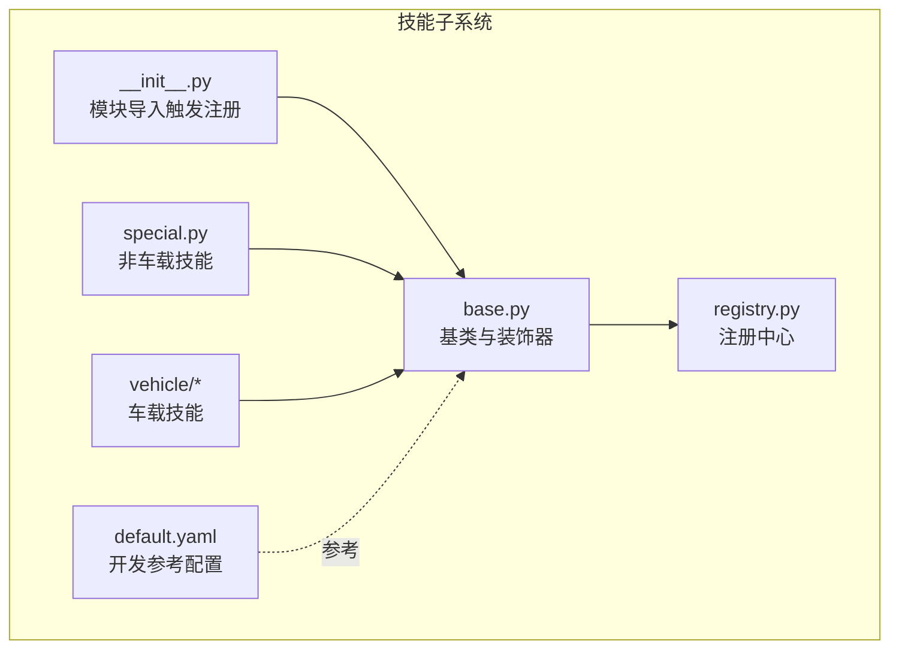
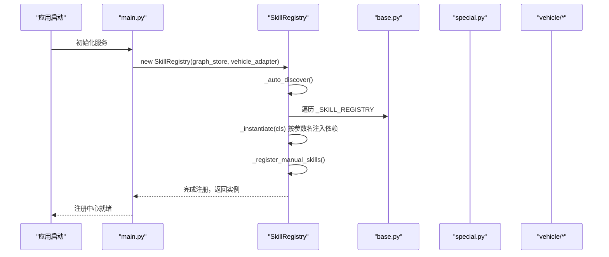
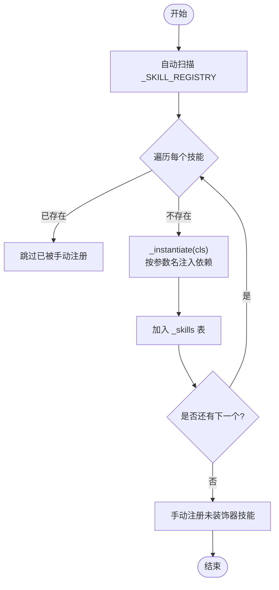
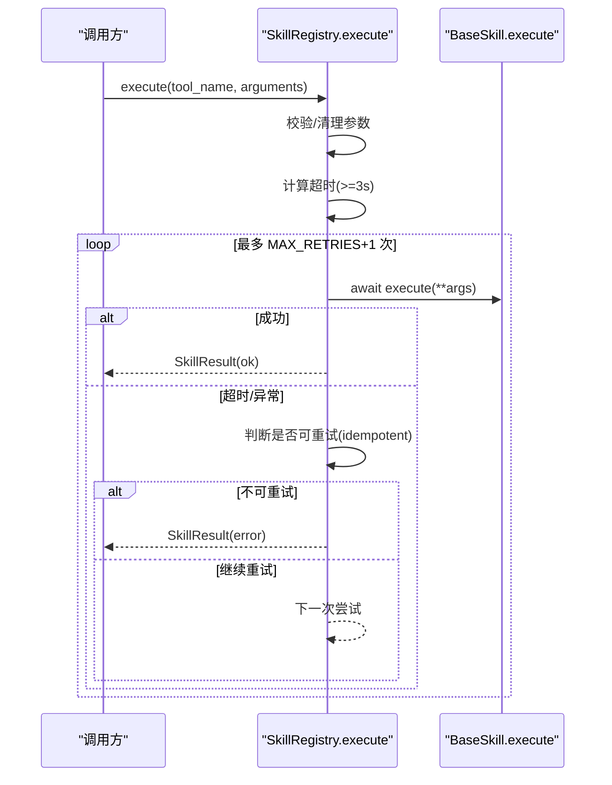
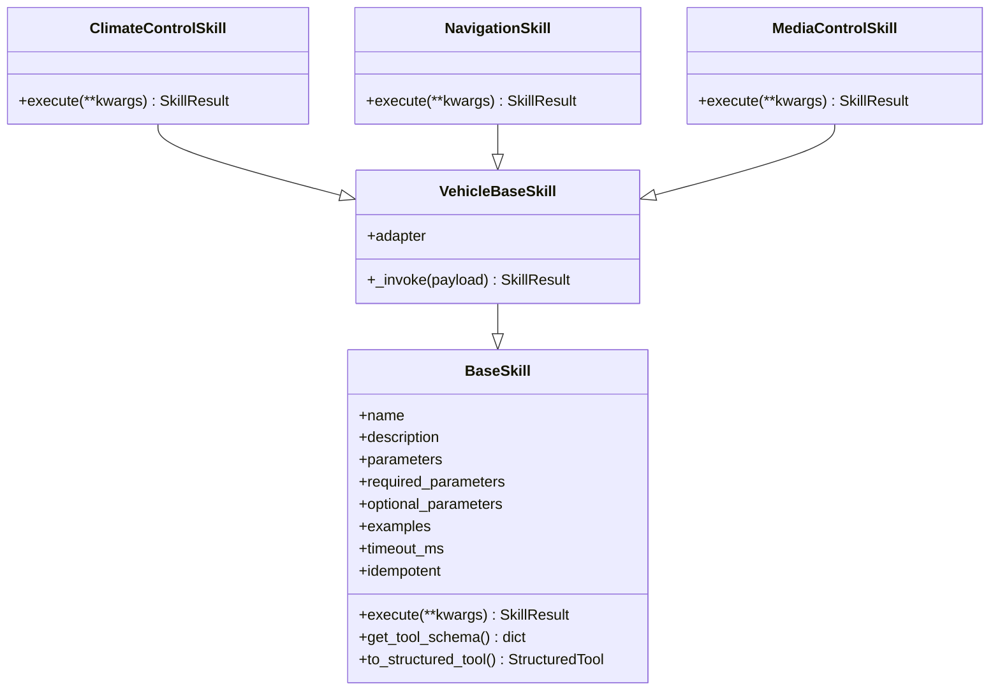
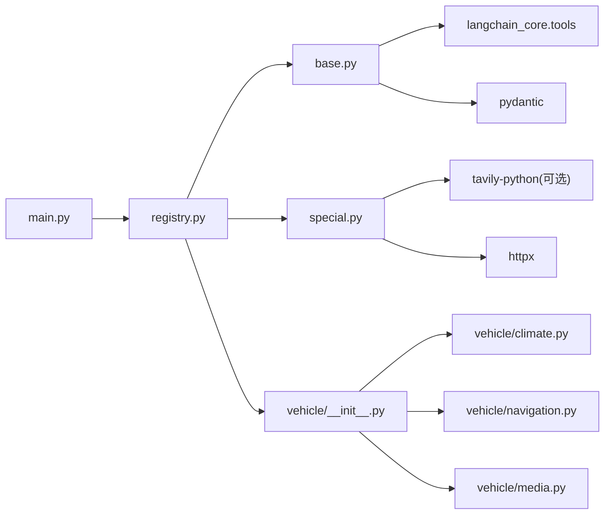

# 技能注册中心

<cite>
**本文引用的文件**   
- [backend_design/nexus/skills/base.py](file://backend_design/nexus/skills/base.py)
- [backend_design/nexus/skills/registry.py](file://backend_design/nexus/skills/registry.py)
- [backend_design/nexus/skills/__init__.py](file://backend_design/nexus/skills/__init__.py)
- [backend_design/nexus/skills/default.yaml](file://backend_design/nexus/skills/default.yaml)
- [backend_design/nexus/skills/special.py](file://backend_design/nexus/skills/special.py)
- [backend_design/nexus/skills/vehicle/__init__.py](file://backend_design/nexus/skills/vehicle/__init__.py)
- [backend_design/nexus/skills/vehicle/climate.py](file://backend_design/nexus/skills/vehicle/climate.py)
- [backend_design/nexus/skills/vehicle/navigation.py](file://backend_design/nexus/skills/vehicle/navigation.py)
- [backend_design/nexus/skills/vehicle/media.py](file://backend_design/nexus/skills/vehicle/media.py)
- [backend_design/nexus/main.py](file://backend_design/nexus/main.py)
</cite>

## 目录
1. [简介](#简介)
2. [项目结构](#项目结构)
3. [核心组件](#核心组件)
4. [架构总览](#架构总览)
5. [详细组件分析](#详细组件分析)
6. [依赖关系分析](#依赖关系分析)
7. [性能与可靠性](#性能与可靠性)
8. [故障排查指南](#故障排查指南)
9. [结论](#结论)
10. [附录](#附录)

## 简介
本文件面向 NexusCockpit 的“技能注册中心”，系统性阐述动态技能加载机制、配置参考规范、依赖注入与版本兼容策略，并详细说明 SkillRegistry 的工作流程、技能发现算法、冲突解决策略。同时文档化 default.yaml 的语法约定（开发参考）、环境变量注入方式以及运行时热重载能力的设计建议。最后覆盖技能包管理、插件化架构设计与扩展点规范，帮助开发者快速理解与扩展技能体系。

## 项目结构
技能子系统位于 backend_design/nexus/skills 目录下，采用“基类 + 装饰器自动注册 + 手动依赖注入”的组合模式：
- base.py：定义 BaseSkill、SkillResult、SkillGroup、register_skill 装饰器与全局注册表 _SKILL_REGISTRY。
- registry.py：实现 SkillRegistry，负责自动扫描与手动注册、依赖注入、执行编排（超时/重试/批量）。
- __init__.py：导入各技能模块以触发装饰器注册。
- special.py：非车载技能（联网搜索、天气、外卖、POI 等）的具体实现。
- vehicle/*：车载技能（空调、导航、媒体等），通过 VehicleBaseSkill 统一调用车控适配器。
- default.yaml：技能开发参考配置（不在运行时加载）。

**图表来源** 
- [backend_design/nexus/skills/base.py:1-264](file://backend_design/nexus/skills/base.py#L1-L264)
- [backend_design/nexus/skills/registry.py:1-321](file://backend_design/nexus/skills/registry.py#L1-L321)
- [backend_design/nexus/skills/__init__.py:1-28](file://backend_design/nexus/skills/__init__.py#L1-L28)
- [backend_design/nexus/skills/special.py:1-800](file://backend_design/nexus/skills/special.py#L1-L800)
- [backend_design/nexus/skills/vehicle/__init__.py:1-55](file://backend_design/nexus/skills/vehicle/__init__.py#L1-L55)
- [backend_design/nexus/skills/default.yaml:1-321](file://backend_design/nexus/skills/default.yaml#L1-L321)

**章节来源**
- [backend_design/nexus/skills/base.py:1-264](file://backend_design/nexus/skills/base.py#L1-L264)
- [backend_design/nexus/skills/registry.py:1-321](file://backend_design/nexus/skills/registry.py#L1-L321)
- [backend_design/nexus/skills/__init__.py:1-28](file://backend_design/nexus/skills/__init__.py#L1-L28)
- [backend_design/nexus/skills/default.yaml:1-321](file://backend_design/nexus/skills/default.yaml#L1-L321)

## 核心组件
- BaseSkill 与 SkillResult：定义技能抽象、元数据描述、工具 Schema 生成、LangChain StructuredTool 转换、副作用与缓存 TTL 控制。
- register_skill 装饰器：将技能类标记并写入全局 _SKILL_REGISTRY，供注册中心自动发现。
- SkillRegistry：初始化时自动扫描装饰器注册的技能，并对需要依赖注入的技能进行手动注册；提供按组查询、副作用查询、结构化工具导出、执行入口（含超时与重试）、批量并行执行等能力。
- VehicleBaseSkill：车载技能基类，统一通过车控适配器调用，支持多座舱隔离。
- 具体技能实现：special.py 中的 WebSearchSkill、WeatherSkill、FoodDeliverySkill、AmapPoiSearchSkill；vehicle/* 中的 ClimateControlSkill、NavigationSkill、MediaControlSkill 等。

**章节来源**
- [backend_design/nexus/skills/base.py:1-264](file://backend_design/nexus/skills/base.py#L1-L264)
- [backend_design/nexus/skills/registry.py:1-321](file://backend_design/nexus/skills/registry.py#L1-L321)
- [backend_design/nexus/skills/vehicle/__init__.py:1-55](file://backend_design/nexus/skills/vehicle/__init__.py#L1-L55)
- [backend_design/nexus/skills/special.py:1-800](file://backend_design/nexus/skills/special.py#L1-L800)

## 架构总览
技能注册中心在应用启动时被实例化，完成以下关键步骤：
- 自动发现：遍历 _SKILL_REGISTRY，按类签名智能注入依赖，实例化并注册。
- 手动注册：对未使用装饰器的技能（如车载技能、点餐技能）根据名称映射进行依赖注入与分组设置。
- 暴露接口：提供 get_all_tools、get_structured_tools、get_skills_by_group、execute、execute_batch 等。

**图表来源** 
- [backend_design/nexus/main.py:188-191](file://backend_design/nexus/main.py#L188-L191)
- [backend_design/nexus/skills/registry.py:44-58](file://backend_design/nexus/skills/registry.py#L44-L58)
- [backend_design/nexus/skills/base.py:44-87](file://backend_design/nexus/skills/base.py#L44-L87)

**章节来源**
- [backend_design/nexus/main.py:188-191](file://backend_design/nexus/main.py#L188-L191)
- [backend_design/nexus/skills/registry.py:44-58](file://backend_design/nexus/skills/registry.py#L44-L58)

## 详细组件分析

### SkillRegistry 工作流程与技能发现算法
- 自动发现：读取 _SKILL_REGISTRY，跳过已手动注册的名称，按类签名匹配依赖（仅按参数名匹配），默认值参数跳过，缺失必填参数由 Python 抛出 TypeError。
- 手动注册：维护一个 name -> (cls, kwargs) 的映射，为未装饰器的技能注入依赖（如 graph_store、vehicle_adapter），并按命名规则或显式逻辑设置分组与副作用标志。
- 冲突解决：若同一名称既被装饰器注册又被手动注册，优先保留装饰器注册结果（_auto_discover 先执行且会跳过已存在项）。

**图表来源** 
- [backend_design/nexus/skills/registry.py:59-91](file://backend_design/nexus/skills/registry.py#L59-L91)
- [backend_design/nexus/skills/registry.py:93-167](file://backend_design/nexus/skills/registry.py#L93-L167)

**章节来源**
- [backend_design/nexus/skills/registry.py:59-91](file://backend_design/nexus/skills/registry.py#L59-L91)
- [backend_design/nexus/skills/registry.py:93-167](file://backend_design/nexus/skills/registry.py#L93-L167)

### 依赖注入与版本兼容性处理
- 依赖注入：基于 inspect.signature 解析 __init__ 参数名，与 self._deps 键名匹配注入；无默认值且无法注入的参数将导致构造失败，便于早期发现问题。
- 版本兼容：
  - 装饰器属性（_skill_name/_skill_group/_skill_has_side_effect/_skill_cache_ttl）作为向后兼容字段，未设置时使用默认值。
  - to_structured_tool 动态构建 Pydantic args_schema，从 parameters 字典推导类型，兼容不同参数的新增与可选化。
  - execute 入口统一超时与重试，屏蔽外部 API 波动。

**章节来源**
- [backend_design/nexus/skills/base.py:116-146](file://backend_design/nexus/skills/base.py#L116-L146)
- [backend_design/nexus/skills/base.py:191-258](file://backend_design/nexus/skills/base.py#L191-L258)
- [backend_design/nexus/skills/registry.py:73-91](file://backend_design/nexus/skills/registry.py#L73-L91)

### 执行编排：超时、重试与批量并行
- execute：获取 skill 实例，清理 None 参数，按 skill.timeout_ms 计算超时（最小 3s），最多尝试 1+MAX_RETRIES 次；对 idempotent=False 的技能不重试；记录指标。
- execute_batch：并发执行多个任务，异常封装为 SkillResult 并返回与输入顺序一致的结果列表。

**图表来源** 
- [backend_design/nexus/skills/registry.py:222-286](file://backend_design/nexus/skills/registry.py#L222-L286)

**章节来源**
- [backend_design/nexus/skills/registry.py:222-286](file://backend_design/nexus/skills/registry.py#L222-L286)
- [backend_design/nexus/skills/registry.py:288-321](file://backend_design/nexus/skills/registry.py#L288-L321)

### 技能分组与结构化工具导出
- 分组查询：get_skills_by_group 按 SkillGroup 过滤，供专家 Agent 使用。
- 结构化工具：get_structured_tools 将每个技能转换为 LangChain StructuredTool，动态创建 Pydantic 模型作为参数校验 schema。

**章节来源**
- [backend_design/nexus/skills/registry.py:181-208](file://backend_design/nexus/skills/registry.py#L181-L208)
- [backend_design/nexus/skills/base.py:151-174](file://backend_design/nexus/skills/base.py#L151-L174)
- [backend_design/nexus/skills/base.py:191-258](file://backend_design/nexus/skills/base.py#L191-L258)

### 车载技能与适配器隔离
- VehicleBaseSkill：统一通过 adapter.invoke_command 调用车控总线，支持多座舱隔离（按 cockpit_id 获取独立适配器）。
- 典型车载技能：ClimateControlSkill、NavigationSkill、MediaControlSkill 等，均继承 VehicleBaseSkill，简化参数到命令的映射。

**图表来源** 
- [backend_design/nexus/skills/base.py:116-146](file://backend_design/nexus/skills/base.py#L116-L146)
- [backend_design/nexus/skills/vehicle/__init__.py:21-55](file://backend_design/nexus/skills/vehicle/__init__.py#L21-L55)
- [backend_design/nexus/skills/vehicle/climate.py:15-37](file://backend_design/nexus/skills/vehicle/climate.py#L15-L37)
- [backend_design/nexus/skills/vehicle/navigation.py:15-39](file://backend_design/nexus/skills/vehicle/navigation.py#L15-L39)
- [backend_design/nexus/skills/vehicle/media.py:15-36](file://backend_design/nexus/skills/vehicle/media.py#L15-L36)

**章节来源**
- [backend_design/nexus/skills/vehicle/__init__.py:21-55](file://backend_design/nexus/skills/vehicle/__init__.py#L21-L55)
- [backend_design/nexus/skills/vehicle/climate.py:15-37](file://backend_design/nexus/skills/vehicle/climate.py#L15-L37)
- [backend_design/nexus/skills/vehicle/navigation.py:15-39](file://backend_design/nexus/skills/vehicle/navigation.py#L15-L39)
- [backend_design/nexus/skills/vehicle/media.py:15-36](file://backend_design/nexus/skills/vehicle/media.py#L15-L36)

### 非车载技能与环境变量注入
- WebSearchSkill：通过配置或环境变量 TAVILY_API_KEY 初始化客户端，未配置则返回错误提示。
- WeatherSkill：通过配置 QWEATHER_APIKEY 与 host，支持 GeoAPI 新旧版回退，GPS 坐标回退。
- FoodDeliverySkill/AmapPoiSearchSkill：分别依赖 graph_store 与高德地图 Key，具备位置上下文注入与 POI 分类映射。

**章节来源**
- [backend_design/nexus/skills/special.py:29-135](file://backend_design/nexus/skills/special.py#L29-L135)
- [backend_design/nexus/skills/special.py:137-312](file://backend_design/nexus/skills/special.py#L137-L312)
- [backend_design/nexus/skills/special.py:651-692](file://backend_design/nexus/skills/special.py#L651-L692)
- [backend_design/nexus/skills/special.py:694-800](file://backend_design/nexus/skills/special.py#L694-L800)

### default.yaml 配置语法规范（开发参考）
- 用途：技能开发参考文档，不在运行时加载；用于新技能开发时的参数定义示例、技能清单核对与文档生成。
- 结构：skills 数组，每项包含 name、category、description、version、parameters（name/type/required/description/enum）、examples（input/parsed）。
- 语义：
  - name：技能唯一标识
  - category：技能分类（vehicle/entertainment/information/lifestyle/communication/system）
  - parameters：OpenAPI-like 参数定义，type 支持 string/number/integer/boolean/array/object
  - examples：用户输入与解析后的参数映射示例

注意：实际运行中技能通过 @register_skill 装饰器在 Python 类中定义，default.yaml 仅作为参考。

**章节来源**
- [backend_design/nexus/skills/default.yaml:1-321](file://backend_design/nexus/skills/default.yaml#L1-L321)
- [backend_design/nexus/skills/__init__.py:18-20](file://backend_design/nexus/skills/__init__.py#L18-L20)

### 运行时热重载设计建议
当前代码库未在注册中心内实现 YAML 热重载或动态模块热更新。建议方案：
- 监听配置文件变更事件（如文件系统 watcher），重新加载对应模块或刷新 _SKILL_REGISTRY。
- 提供 reload_registry() 方法，安全地重建实例并替换旧引用，确保并发访问线程安全。
- 对车载技能与外部依赖（如网络客户端）进行优雅重启与连接池重建。

[本节为概念性设计建议，不直接分析具体文件]

## 依赖关系分析
- 模块耦合：
  - registry.py 依赖 base.py 的全局注册表与基类。
  - special.py 与 vehicle/* 依赖 base.py 的基类与装饰器。
  - main.py 在应用启动时实例化 SkillRegistry，并传入 graph_store 与 vehicle_adapter。
- 外部依赖：
  - tavily-python（可选，WebSearchSkill）
  - httpx（异步 HTTP 客户端，WeatherSkill、AmapPoiSearchSkill）
  - langchain_core.tools.StructuredTool（结构化工具包装）
  - pydantic（动态参数模型）

**图表来源** 
- [backend_design/nexus/main.py:188-191](file://backend_design/nexus/main.py#L188-L191)
- [backend_design/nexus/skills/registry.py:1-321](file://backend_design/nexus/skills/registry.py#L1-L321)
- [backend_design/nexus/skills/base.py:1-264](file://backend_design/nexus/skills/base.py#L1-L264)
- [backend_design/nexus/skills/special.py:1-800](file://backend_design/nexus/skills/special.py#L1-L800)
- [backend_design/nexus/skills/vehicle/__init__.py:1-55](file://backend_design/nexus/skills/vehicle/__init__.py#L1-L55)

**章节来源**
- [backend_design/nexus/main.py:188-191](file://backend_design/nexus/main.py#L188-L191)
- [backend_design/nexus/skills/registry.py:1-321](file://backend_design/nexus/skills/registry.py#L1-L321)
- [backend_design/nexus/skills/base.py:1-264](file://backend_design/nexus/skills/base.py#L1-L264)
- [backend_design/nexus/skills/special.py:1-800](file://backend_design/nexus/skills/special.py#L1-L800)
- [backend_design/nexus/skills/vehicle/__init__.py:1-55](file://backend_design/nexus/skills/vehicle/__init__.py#L1-L55)

## 性能与可靠性
- 超时保护：所有技能执行受 timeout_ms 约束，最小 3s，避免外部 API 慢响应阻塞。
- 瞬时故障重试：对 idempotent=True 的技能最多重试 2 次，降低偶发网络抖动影响。
- 批量并行：execute_batch 使用 asyncio.gather 并发执行，提升组合指令吞吐。
- 指标上报：执行成功/失败计数通过 SKILL_EXECUTIONS 指标上报，便于监控与告警。

**章节来源**
- [backend_design/nexus/skills/registry.py:217-286](file://backend_design/nexus/skills/registry.py#L217-L286)
- [backend_design/nexus/skills/registry.py:288-321](file://backend_design/nexus/skills/registry.py#L288-L321)

## 故障排查指南
- 未知技能错误：execute 返回 status=error 且 message 包含“未知技能”，检查 tool_name 是否正确注册。
- 超时错误：日志输出“timed out after X s”，检查技能 timeout_ms 与外部服务延迟。
- 依赖缺失：如 WebSearchSkill 未配置密钥，返回“未配置联网搜索密钥”；WeatherSkill 未配置 QWEATHER_APIKEY 返回相应提示。
- GPS 不可用：AmapPoiSearchSkill/WeatherSkill 无法获取坐标时返回定位相关错误，需确认座舱定位权限与数据源。
- 手动注册失败：_register_manual_skills 捕获异常并记录日志，检查依赖注入参数是否为 None 或类型不匹配。

**章节来源**
- [backend_design/nexus/skills/registry.py:222-286](file://backend_design/nexus/skills/registry.py#L222-L286)
- [backend_design/nexus/skills/special.py:29-135](file://backend_design/nexus/skills/special.py#L29-L135)
- [backend_design/nexus/skills/special.py:137-312](file://backend_design/nexus/skills/special.py#L137-L312)
- [backend_design/nexus/skills/special.py:694-800](file://backend_design/nexus/skills/special.py#L694-L800)

## 结论
NexusCockpit 的技能注册中心通过装饰器自动注册与手动依赖注入相结合，实现了高内聚、低耦合的技能生态。SkillRegistry 提供了统一的执行入口、超时与重试保障、批量并行能力，并支持与 LangChain 的结构化工具集成。default.yaml 作为开发参考，规范了技能参数与示例，便于文档生成与维护。未来可在注册中心引入配置热重载与模块热更新，进一步提升系统弹性与可运维性。

## 附录
- 插件化架构设计要点：
  - 以 BaseSkill 为扩展点，子类仅需实现 execute 与参数描述。
  - 通过 @register_skill 声明技能元数据，自动进入全局注册表。
  - 车载技能通过 VehicleBaseSkill 统一接入车控适配器，支持多座舱隔离。
- 技能包管理建议：
  - 按功能域拆分模块（如 vehicle/*、special.py），在 __init__.py 集中导入以触发注册。
  - 对外部依赖进行可选导入与降级处理，保证服务可用性。
- 扩展点设计规范：
  - 参数描述遵循 OpenAPI-like 类型，便于动态生成 Pydantic 模型。
  - 副作用与缓存 TTL 通过装饰器属性控制，确保缓存安全。
  - 超时与幂等性通过类属性统一配置，便于编排层决策。

[本节为概念性总结与建议，不直接分析具体文件]