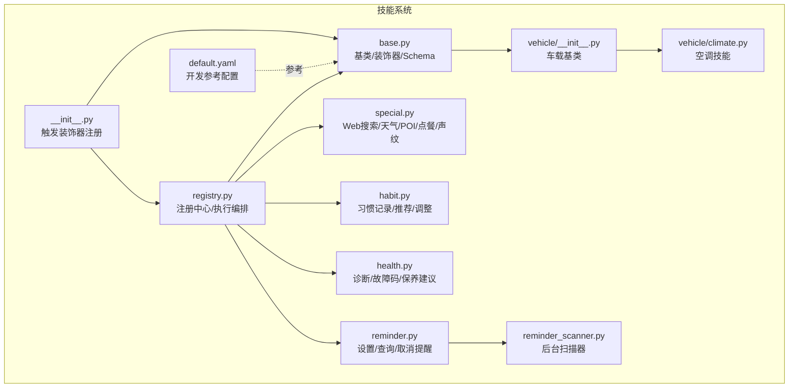
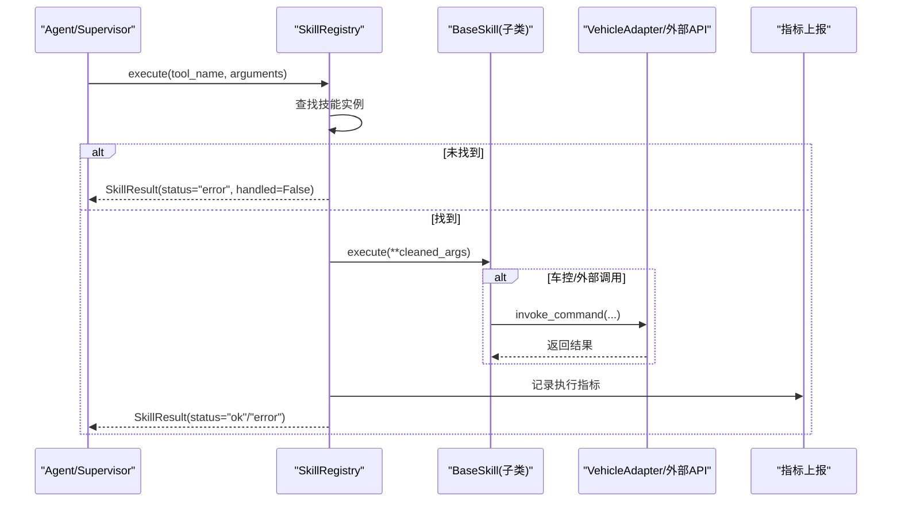
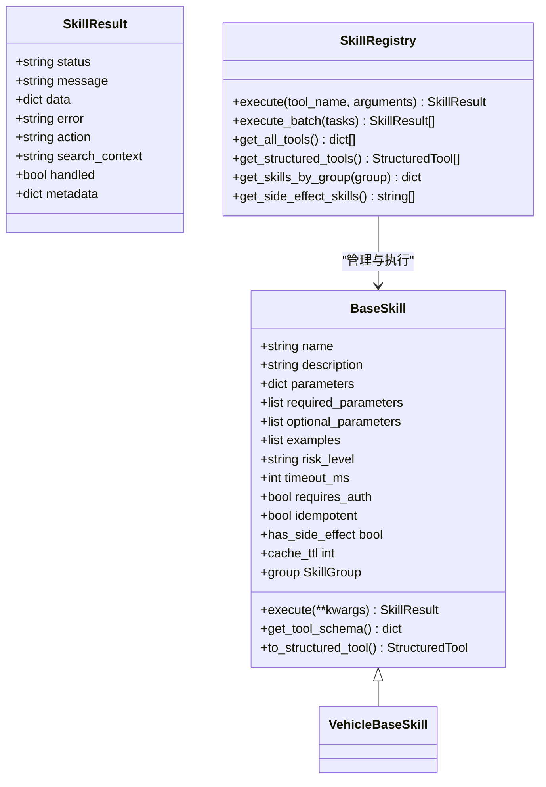
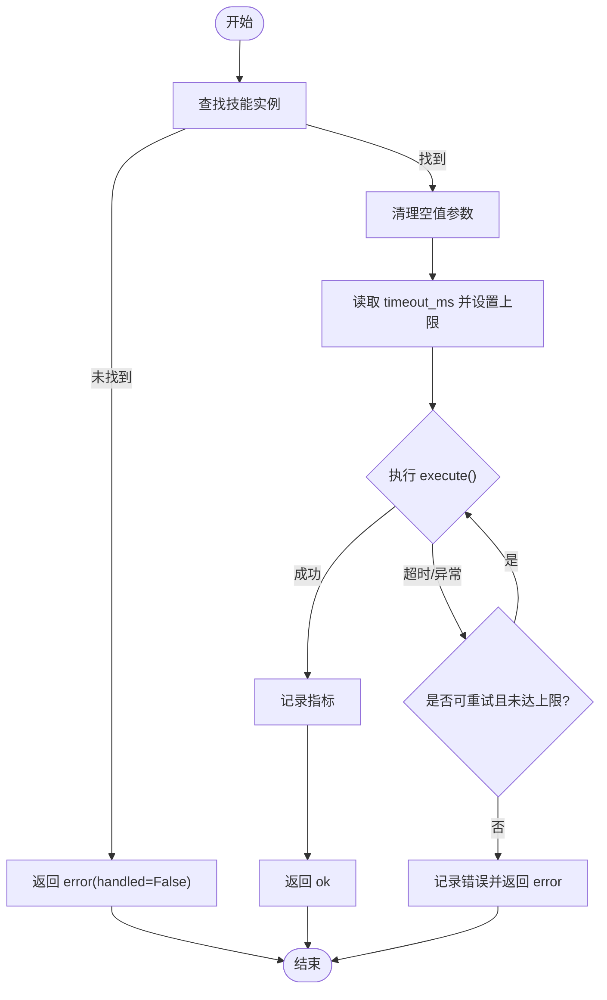
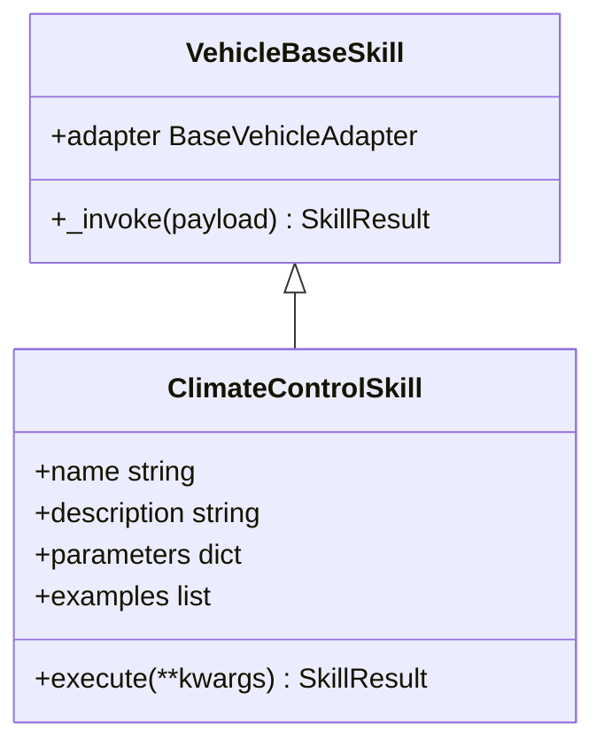
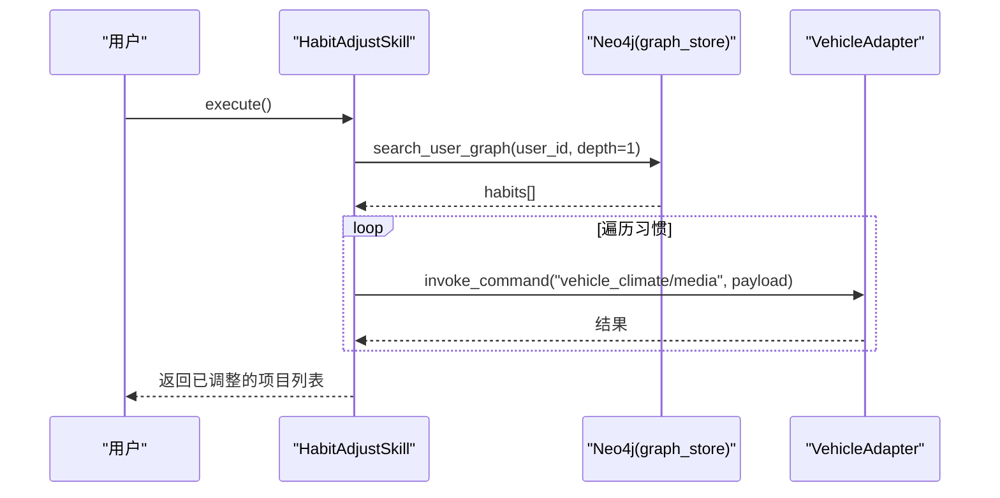
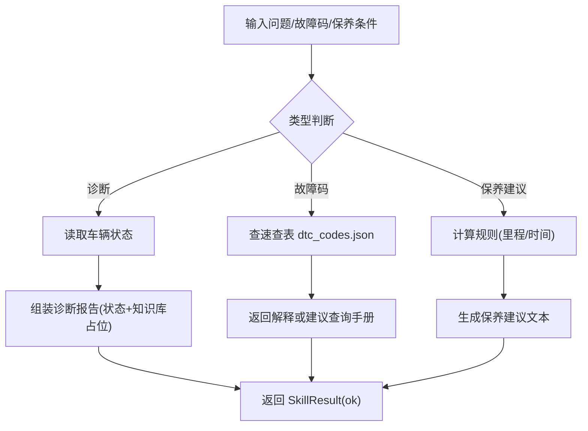
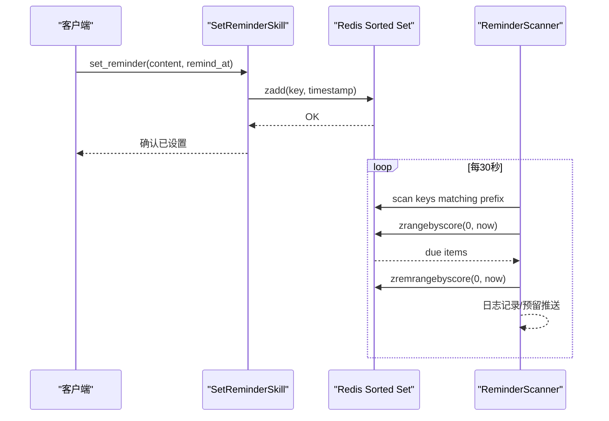
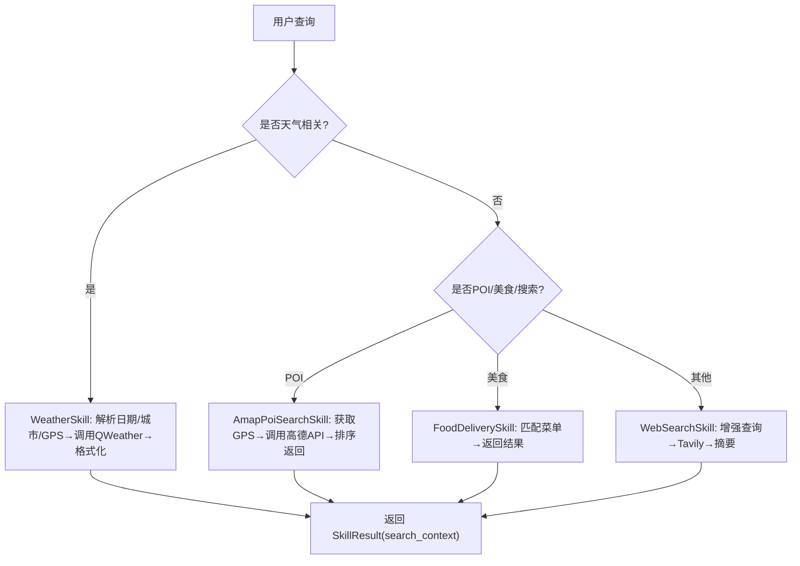
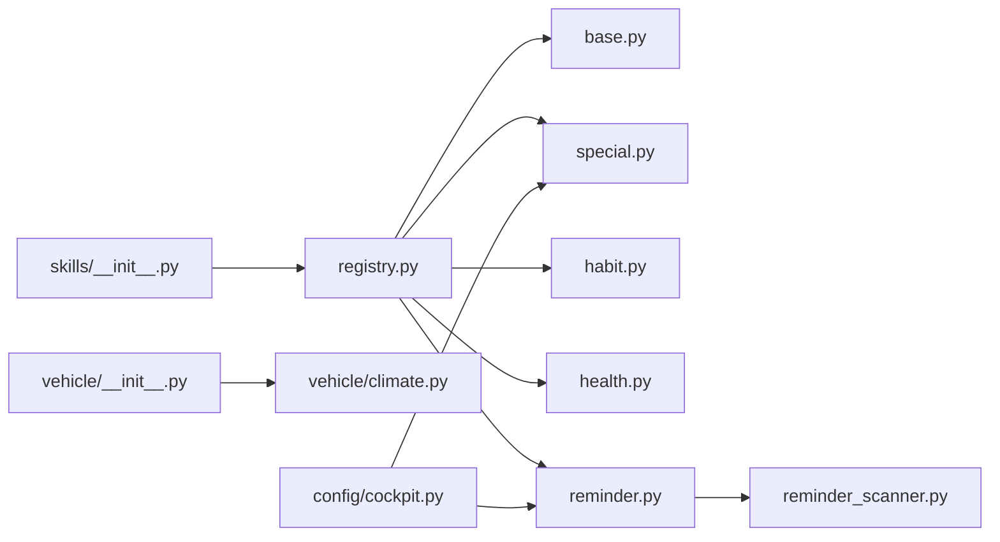

# 技能系统

<cite>
**本文引用的文件**   
- [backend_design/nexus/skills/__init__.py](file://backend_design/nexus/skills/__init__.py)
- [backend_design/nexus/skills/base.py](file://backend_design/nexus/skills/base.py)
- [backend_design/nexus/skills/registry.py](file://backend_design/nexus/skills/registry.py)
- [backend_design/nexus/skills/default.yaml](file://backend_design/nexus/skills/default.yaml)
- [backend_design/nexus/skills/vehicle/__init__.py](file://backend_design/nexus/skills/vehicle/__init__.py)
- [backend_design/nexus/skills/vehicle/climate.py](file://backend_design/nexus/skills/vehicle/climate.py)
- [backend_design/nexus/skills/habit.py](file://backend_design/nexus/skills/habit.py)
- [backend_design/nexus/skills/health.py](file://backend_design/nexus/skills/health.py)
- [backend_design/nexus/skills/reminder.py](file://backend_design/nexus/skills/reminder.py)
- [backend_design/nexus/skills/reminder_scanner.py](file://backend_design/nexus/skills/reminder_scanner.py)
- [backend_design/nexus/skills/special.py](file://backend_design/nexus/skills/special.py)
- [backend_design/nexus/config/cockpit.py](file://backend_design/nexus/config/cockpit.py)
</cite>

## 目录
1. [简介](#简介)
2. [项目结构](#项目结构)
3. [核心组件](#核心组件)
4. [架构总览](#架构总览)
5. [详细组件分析](#详细组件分析)
6. [依赖关系分析](#依赖关系分析)
7. [性能考量](#性能考量)
8. [故障排查指南](#故障排查指南)
9. [结论](#结论)
10. [附录：自定义技能开发指南与最佳实践](#附录自定义技能开发指南与最佳实践)

## 简介
本文件为 NexusCockpit 的“技能系统”技术文档，聚焦插件化架构、技能注册中心、基类抽象、动态加载机制与生命周期管理；并详细说明内置技能（车辆控制、习惯管理、健康管理、提醒服务等）的实现模式与扩展方法。同时文档化技能配置参考格式、参数传递机制、错误处理策略，以及自定义技能开发指南、最佳实践与性能优化建议。

## 项目结构
技能系统位于 backend_design/nexus/skills 目录下，采用“按能力域组织”的结构：
- base.py：定义技能基类、统一结果模型、装饰器与工具 Schema 生成
- registry.py：技能注册中心，负责自动发现、手动注册、分组查询、执行编排（超时/重试/批量）
- vehicle/*：车载技能（空调、车窗、座椅、导航、媒体、状态等），通过 VehicleBaseSkill 统一调用车控适配器
- habit.py / health.py / reminder.py：非车载领域技能（习惯画像、健康诊断、日程提醒）
- special.py：通用联网服务（Web 搜索、天气、POI 周边、点餐、声纹注册等）
- default.yaml：技能开发参考配置（仅用于参考，不在运行时加载）
- __init__.py：导入各技能模块以触发装饰器自动注册

**图表来源** 
- [backend_design/nexus/skills/__init__.py:1-28](file://backend_design/nexus/skills/__init__.py#L1-L28)
- [backend_design/nexus/skills/base.py:1-264](file://backend_design/nexus/skills/base.py#L1-L264)
- [backend_design/nexus/skills/registry.py:1-321](file://backend_design/nexus/skills/registry.py#L1-L321)
- [backend_design/nexus/skills/vehicle/__init__.py:1-55](file://backend_design/nexus/skills/vehicle/__init__.py#L1-L55)
- [backend_design/nexus/skills/vehicle/climate.py:1-37](file://backend_design/nexus/skills/vehicle/climate.py#L1-L37)
- [backend_design/nexus/skills/habit.py:1-215](file://backend_design/nexus/skills/habit.py#L1-L215)
- [backend_design/nexus/skills/health.py:1-228](file://backend_design/nexus/skills/health.py#L1-L228)
- [backend_design/nexus/skills/reminder.py:1-296](file://backend_design/nexus/skills/reminder.py#L1-L296)
- [backend_design/nexus/skills/reminder_scanner.py:1-136](file://backend_design/nexus/skills/reminder_scanner.py#L1-L136)
- [backend_design/nexus/skills/special.py:1-800](file://backend_design/nexus/skills/special.py#L1-L800)
- [backend_design/nexus/skills/default.yaml:1-321](file://backend_design/nexus/skills/default.yaml#L1-L321)

**章节来源**
- [backend_design/nexus/skills/__init__.py:1-28](file://backend_design/nexus/skills/__init__.py#L1-L28)
- [backend_design/nexus/skills/default.yaml:1-321](file://backend_design/nexus/skills/default.yaml#L1-L321)

## 核心组件
- 技能基类与统一结果
  - BaseSkill：定义 name/description/parameters/required_parameters/optional_parameters/examples/risk_level/timeout_ms/requires_auth/idempotent 等元信息，提供 get_tool_schema() 与 to_structured_tool()，将技能适配为 LangChain StructuredTool，支持异步执行包装。
  - SkillResult：统一返回结构，包含 status/message/data/error/action/search_context/handled/metadata。
  - register_skill 装饰器：标记技能类并写入全局 _SKILL_REGISTRY，供注册中心自动发现。
- 技能注册中心
  - SkillRegistry：初始化时自动扫描 _SKILL_REGISTRY，实例化所有装饰器标记的技能；同时支持手动注册需要依赖注入的技能（如车载技能需 vehicle_adapter）。
  - 提供按组查询、副作用查询、获取 Tool Schema、转换为 StructuredTool、执行（含超时保护与瞬时故障重试）、批量并行执行等能力。
- 车载技能基类
  - VehicleBaseSkill：封装对车控适配器的调用，支持多座舱隔离（通过 tenant_context 获取当前座舱适配器），统一 _invoke 返回 SkillResult。

**章节来源**
- [backend_design/nexus/skills/base.py:1-264](file://backend_design/nexus/skills/base.py#L1-L264)
- [backend_design/nexus/skills/registry.py:1-321](file://backend_design/nexus/skills/registry.py#L1-L321)
- [backend_design/nexus/skills/vehicle/__init__.py:1-55](file://backend_design/nexus/skills/vehicle/__init__.py#L1-L55)

## 架构总览
技能系统采用“装饰器自动注册 + 注册中心集中编排”的插件化架构。Agent/Supervisor 在初始化时构建 SkillRegistry，自动发现并实例化所有已注册技能，随后将每个技能转换为 LangChain StructuredTool，供 Agent 框架调用。执行入口集中在 SkillRegistry.execute()，统一处理超时、重试、指标上报与异常归一化。

**图表来源** 
- [backend_design/nexus/skills/registry.py:222-286](file://backend_design/nexus/skills/registry.py#L222-L286)
- [backend_design/nexus/skills/base.py:191-258](file://backend_design/nexus/skills/base.py#L191-L258)
- [backend_design/nexus/skills/vehicle/__init__.py:44-55](file://backend_design/nexus/skills/vehicle/__init__.py#L44-L55)

## 详细组件分析

### 技能基类与装饰器（BaseSkill & register_skill）
- 设计要点
  - 通过 @register_skill(name, group, description, has_side_effect, cache_ttl) 标记技能类，写入全局表，便于自动发现。
  - get_tool_schema() 输出 OpenAI Function Calling 兼容的 schema，to_structured_tool() 动态创建 Pydantic args_schema 并包装 execute() 为 StructuredTool 的协程接口。
  - has_side_effect/cache_ttl/group 属性由装饰器注入，供缓存层与分组路由使用。
- 复杂度与性能
  - to_structured_tool() 每次调用会动态构建 Pydantic 模型，建议在注册阶段一次性转换并缓存。
  - 同步包装在非 async 上下文下创建新事件循环，应避免频繁调用。

**图表来源** 
- [backend_design/nexus/skills/base.py:116-264](file://backend_design/nexus/skills/base.py#L116-L264)
- [backend_design/nexus/skills/registry.py:36-108](file://backend_design/nexus/skills/registry.py#L36-L108)

**章节来源**
- [backend_design/nexus/skills/base.py:1-264](file://backend_design/nexus/skills/base.py#L1-L264)

### 技能注册中心（SkillRegistry）
- 自动发现与手动注册
  - 自动发现：遍历 _SKILL_REGISTRY，按类签名智能注入依赖（如 graph_store、vehicle_adapter）。
  - 手动注册：为未用装饰器标记但需要依赖注入的技能（车载技能、点餐等）提供映射表进行实例化。
- 执行编排
  - 统一超时保护（基于 skill.timeout_ms，最小 3s），瞬时故障重试（默认最多 2 次重试），不可幂等技能不重试。
  - 批量执行：并发 gather 多个任务，异常包裹为 SkillResult。
  - 指标上报：成功/失败计数。

**图表来源** 
- [backend_design/nexus/skills/registry.py:222-286](file://backend_design/nexus/skills/registry.py#L222-L286)

**章节来源**
- [backend_design/nexus/skills/registry.py:1-321](file://backend_design/nexus/skills/registry.py#L1-L321)

### 车载技能（VehicleBaseSkill 与示例）
- VehicleBaseSkill
  - 通过 build_vehicle_adapter() 或 get_cockpit_vehicle_adapter(cockpit_id) 获取当前座舱适配器，实现多座舱隔离。
  - _invoke(payload) 统一调用车控总线，返回 SkillResult。
- 示例：ClimateControlSkill
  - 名称 vehicle_climate，描述空调操作，参数包括 op/target_temp/delta/fan_speed/mode。
  - execute() 委托给 _invoke() 完成实际调用。

**图表来源** 
- [backend_design/nexus/skills/vehicle/__init__.py:21-55](file://backend_design/nexus/skills/vehicle/__init__.py#L21-L55)
- [backend_design/nexus/skills/vehicle/climate.py:15-37](file://backend_design/nexus/skills/vehicle/climate.py#L15-L37)

**章节来源**
- [backend_design/nexus/skills/vehicle/__init__.py:1-55](file://backend_design/nexus/skills/vehicle/__init__.py#L1-L55)
- [backend_design/nexus/skills/vehicle/climate.py:1-37](file://backend_design/nexus/skills/vehicle/climate.py#L1-L37)

### 习惯管理技能（habit.py）
- HabitRecordSkill：记录用户偏好到 Neo4j HABIT 关系（若可用），返回确认消息。
- HabitRecommendSkill：根据触发场景（morning_start/nav_start/evening_start）从图谱检索并生成推荐话术。
- HabitAdjustSkill：读取画像后批量下发车控指令（如空调、媒体），标记 has_side_effect=True。

**图表来源** 
- [backend_design/nexus/skills/habit.py:141-215](file://backend_design/nexus/skills/habit.py#L141-L215)

**章节来源**
- [backend_design/nexus/skills/habit.py:1-215](file://backend_design/nexus/skills/habit.py#L1-L215)

### 健康管理技能（health.py）
- DiagnoseVehicleSkill：结合车辆实时状态与知识库（预留 Cherry KB 集成点）生成诊断报告。
- DecodeDtcSkill：解析 OBD-II 故障码，优先查速查表（data/knowledge/dtc_codes.json），未命中则提示专业手册。
- MaintenanceAdviceSkill：根据里程/时间生成保养建议，支持从车辆状态中拉取里程。

**图表来源** 
- [backend_design/nexus/skills/health.py:47-113](file://backend_design/nexus/skills/health.py#L47-L113)
- [backend_design/nexus/skills/health.py:115-163](file://backend_design/nexus/skills/health.py#L115-L163)
- [backend_design/nexus/skills/health.py:165-228](file://backend_design/nexus/skills/health.py#L165-L228)

**章节来源**
- [backend_design/nexus/skills/health.py:1-228](file://backend_design/nexus/skills/health.py#L1-L228)

### 提醒服务技能（reminder.py 与 reminder_scanner.py）
- SetReminderSkill：解析 ISO 或 relative:秒数时间，存入 Redis Sorted Set（nexus:reminders:{user_id}），失败降级为本地记忆提示。
- QueryReminderSkill：查询当前未过期提醒，格式化展示。
- CancelReminderSkill：按内容关键词删除匹配项。
- ReminderScanner：后台定时扫描到期提醒（每 30s），通过 SCAN 遍历用户 key，删除已到期项，预留 WebSocket 推送。

**图表来源** 
- [backend_design/nexus/skills/reminder.py:51-122](file://backend_design/nexus/skills/reminder.py#L51-L122)
- [backend_design/nexus/skills/reminder.py:147-218](file://backend_design/nexus/skills/reminder.py#L147-L218)
- [backend_design/nexus/skills/reminder.py:220-296](file://backend_design/nexus/skills/reminder.py#L220-L296)
- [backend_design/nexus/skills/reminder_scanner.py:28-136](file://backend_design/nexus/skills/reminder_scanner.py#L28-L136)

**章节来源**
- [backend_design/nexus/skills/reminder.py:1-296](file://backend_design/nexus/skills/reminder.py#L1-L296)
- [backend_design/nexus/skills/reminder_scanner.py:1-136](file://backend_design/nexus/skills/reminder_scanner.py#L1-L136)

### 通用联网服务（special.py）
- WebSearchSkill：Tavily 搜索，增强查询注入位置与时间，返回结构化摘要。
- WeatherSkill：和风天气 API，支持今天/明天/后天/未来三天，城市名提取与 GPS 回退，统一格式化输出。
- FoodDeliverySkill：菜单匹配（依赖 graph_store.search_food）。
- AmapPoiSearchSkill：高德 POI 周边搜索，支持多种分类与半径，GPS 坐标从 vehicle adapter 获取。

**图表来源** 
- [backend_design/nexus/skills/special.py:29-135](file://backend_design/nexus/skills/special.py#L29-L135)
- [backend_design/nexus/skills/special.py:137-312](file://backend_design/nexus/skills/special.py#L137-L312)
- [backend_design/nexus/skills/special.py:651-692](file://backend_design/nexus/skills/special.py#L651-L692)
- [backend_design/nexus/skills/special.py:694-800](file://backend_design/nexus/skills/special.py#L694-L800)

**章节来源**
- [backend_design/nexus/skills/special.py:1-800](file://backend_design/nexus/skills/special.py#L1-L800)

## 依赖关系分析
- 内部依赖
  - skills.__init__.py 导入 habit/health/reminder 模块，触发装饰器注册。
  - registry.py 依赖 base.py 的全局注册表与基类，并在 _register_manual_skills 中引入特殊技能与车载技能。
  - vehicle/* 依赖 vehicle.base.BaseVehicleAdapter 与工厂函数，通过 tenant_context 实现多座舱隔离。
  - reminder.py 依赖 Redis（aioredis）与配置；reminder_scanner.py 独立运行后台任务。
- 外部依赖
  - WebSearchSkill：Tavily（可选，未配置则禁用）
  - WeatherSkill：QWeather API（HTTPX 异步请求）
  - AmapPoiSearchSkill：高德地图 API
  - Habit/Order：Neo4j graph_store（可选，未提供则降级）
- 配置来源
  - cockpit.py 中的 TavilyConfig/AmapConfig/QWeatherConfig 提供第三方密钥与环境变量映射。

**图表来源** 
- [backend_design/nexus/skills/__init__.py:22-28](file://backend_design/nexus/skills/__init__.py#L22-L28)
- [backend_design/nexus/skills/registry.py:93-168](file://backend_design/nexus/skills/registry.py#L93-L168)
- [backend_design/nexus/skills/vehicle/__init__.py:21-55](file://backend_design/nexus/skills/vehicle/__init__.py#L21-L55)
- [backend_design/nexus/config/cockpit.py:38-83](file://backend_design/nexus/config/cockpit.py#L38-L83)

**章节来源**
- [backend_design/nexus/skills/__init__.py:1-28](file://backend_design/nexus/skills/__init__.py#L1-L28)
- [backend_design/nexus/skills/registry.py:1-321](file://backend_design/nexus/skills/registry.py#L1-L321)
- [backend_design/nexus/config/cockpit.py:1-83](file://backend_design/nexus/config/cockpit.py#L1-L83)

## 性能考量
- 超时与重试
  - 所有技能执行受 SkillRegistry.execute() 统一超时保护（最小 3s），网络类技能支持瞬时故障重试（默认 2 次），幂等性控制避免重复副作用。
- 并发与批处理
  - execute_batch() 使用 asyncio.gather 并发执行无冲突任务，适合组合指令（如“打开车窗同时调到24度”）。
- 动态 Schema 生成
  - to_structured_tool() 动态创建 Pydantic 模型，建议在注册阶段一次性转换并复用，避免重复开销。
- 外部 API 限流与降级
  - WebSearch/Weather/POI 等外部调用具备超时与异常捕获，未配置密钥或失败时返回友好降级消息。
- 缓存策略
  - 通过 has_side_effect 与 cache_ttl 控制缓存安全；车控类通常 has_side_effect=True 且 cache_ttl=0。

[本节为通用指导，无需特定文件引用]

## 故障排查指南
- 未知技能
  - 现象：execute() 返回 skill_not_found
  - 排查：确认技能是否被装饰器标记或手动注册；检查 __init__.py 是否正确导入模块以触发注册。
- 超时与重试
  - 现象：多次警告超时/失败
  - 排查：检查 skill.timeout_ms 设置；对外部 API 增加超时或重试次数；查看网络连通性与密钥配置。
- Redis 不可用
  - 现象：提醒服务降级为本地记忆提示
  - 排查：确认 Redis 连接配置（host/port/password/db）；检查 scanner 启动日志。
- 第三方服务未配置
  - 现象：WebSearch/Weather/POI 返回未配置密钥
  - 排查：检查 cockpit.py 对应配置（TAVILY_API_KEY/AMAP_KEY/QWEATHER_APIKEY）环境变量。
- 车控适配器异常
  - 现象：车载技能调用失败
  - 排查：确认 vehicle_adapter 是否可用；检查多座舱隔离上下文（cockpit_id）是否正确。

**章节来源**
- [backend_design/nexus/skills/registry.py:222-286](file://backend_design/nexus/skills/registry.py#L222-L286)
- [backend_design/nexus/skills/reminder.py:32-49](file://backend_design/nexus/skills/reminder.py#L32-L49)
- [backend_design/nexus/skills/special.py:47-57](file://backend_design/nexus/skills/special.py#L47-L57)
- [backend_design/nexus/config/cockpit.py:38-83](file://backend_design/nexus/config/cockpit.py#L38-L83)

## 结论
NexusCockpit 技能系统通过装饰器驱动的插件化架构与注册中心的集中编排，实现了高内聚、低耦合的可扩展能力。统一的基类与结果模型简化了技能实现，注册中心提供超时、重试、并发与指标等横切关注点。内置技能覆盖车控、习惯、健康、提醒与通用联网服务，具备良好的扩展性与容错性。建议在新技能开发中遵循本文档的最佳实践，确保参数校验、错误处理与性能优化到位。

[本节为总结，无需特定文件引用]

## 附录：自定义技能开发指南与最佳实践
- 开发步骤
  1. 新建技能类继承 BaseSkill，定义 name/description/parameters/required_parameters/optional_parameters/examples。
  2. 使用 @register_skill(name, group, description, has_side_effect, cache_ttl) 装饰器标记。
  3. 实现 async def execute(**kwargs) -> SkillResult，返回统一结果。
  4. 如需依赖注入（如 vehicle_adapter/graph_store），在 __init__ 中声明参数，注册中心将自动注入。
  5. 在 skills/__init__.py 中导入模块以触发装饰器注册（若未使用装饰器，需在 registry._register_manual_skills 中添加映射）。
- 参数传递机制
  - 通过 BaseSkill.parameters 描述参数类型与说明，to_structured_tool() 自动生成 Pydantic 模型与 OpenAI Function Calling schema。
  - 支持从 kwargs 注入上下文（如 user_id/location/key_context），便于 LLM 工作流传递。
- 错误处理策略
  - 始终返回 SkillResult，status 为 ok/error，message 提供人类可读信息，metadata 携带结构化数据。
  - 对外部依赖失败进行降级处理（如 Redis 不可用时返回友好提示）。
- 最佳实践
  - 合理设置 has_side_effect 与 cache_ttl，避免副作用技能被缓存。
  - 设置合适的 timeout_ms，避免长尾请求阻塞。
  - 幂等性：对可重试的外部调用设置 idempotent=True，避免重复副作用。
  - 日志与指标：记录关键路径日志，利用注册中心指标统计成功率与耗时。
- 性能优化建议
  - 在注册阶段转换 StructuredTool 并缓存，减少重复构建开销。
  - 批量执行无冲突技能，提升吞吐。
  - 外部 API 调用使用异步客户端（httpx/aioredis），避免阻塞事件循环。
- 配置参考
  - default.yaml 提供技能参数与示例参考，便于维护与文档生成。
  - cockpit.py 提供第三方服务密钥与环境变量映射，确保部署环境正确配置。

**章节来源**
- [backend_design/nexus/skills/base.py:116-264](file://backend_design/nexus/skills/base.py#L116-L264)
- [backend_design/nexus/skills/registry.py:93-168](file://backend_design/nexus/skills/registry.py#L93-L168)
- [backend_design/nexus/skills/default.yaml:1-321](file://backend_design/nexus/skills/default.yaml#L1-L321)
- [backend_design/nexus/config/cockpit.py:38-83](file://backend_design/nexus/config/cockpit.py#L38-L83)