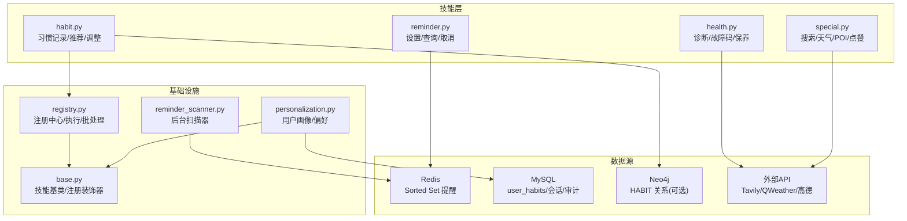
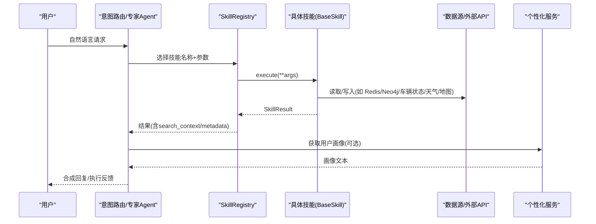
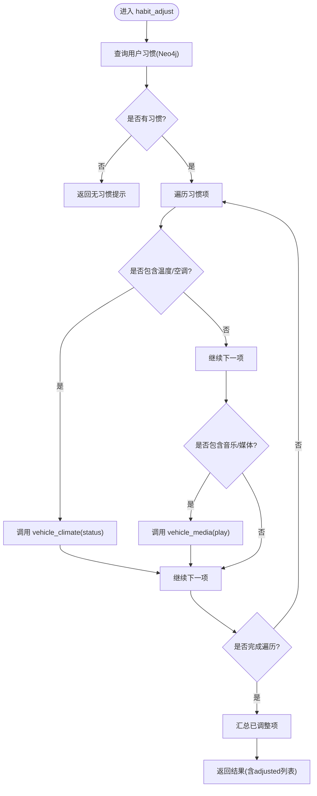
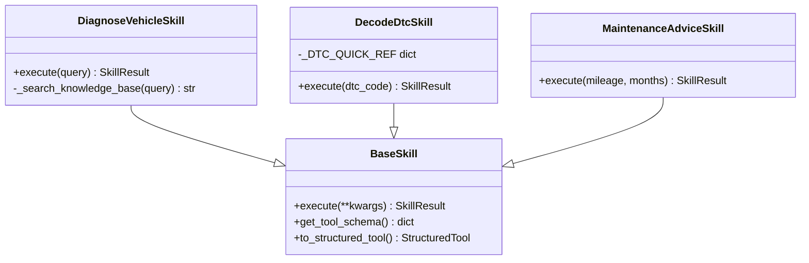
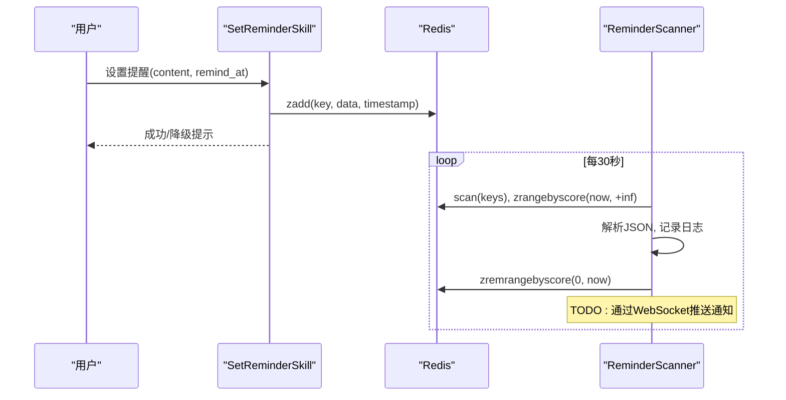
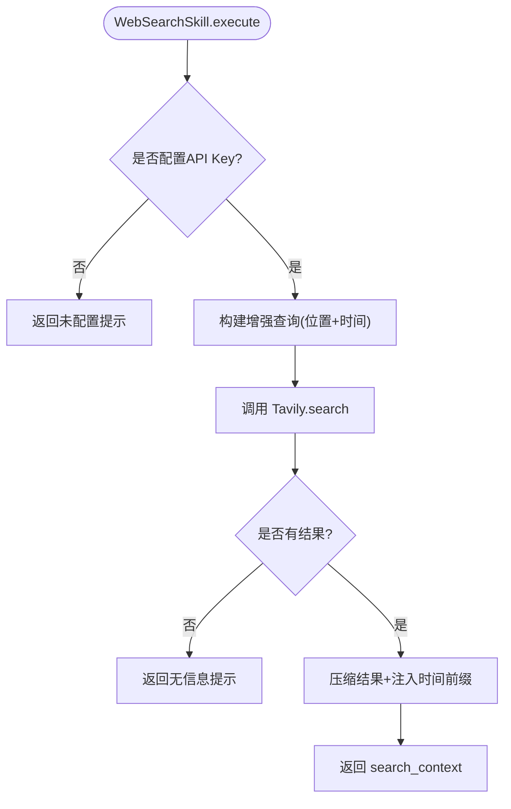
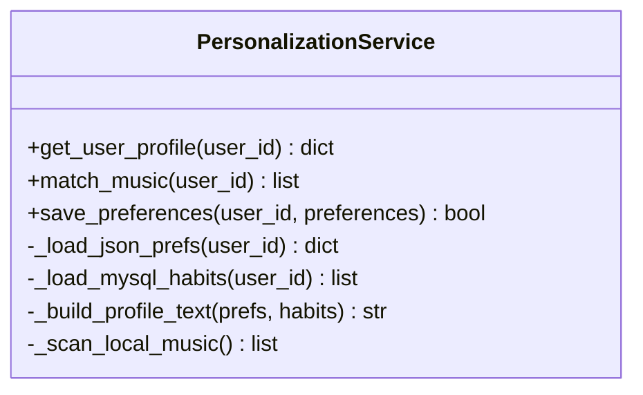
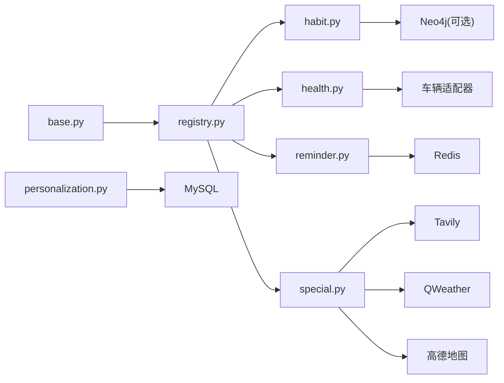

# 生活服务技能

<cite>
**本文引用的文件**   
- [habit.py](file://backend_design/nexus/skills/habit.py)
- [health.py](file://backend_design/nexus/skills/health.py)
- [reminder.py](file://backend_design/nexus/skills/reminder.py)
- [special.py](file://backend_design/nexus/skills/special.py)
- [base.py](file://backend_design/nexus/skills/base.py)
- [registry.py](file://backend_design/nexus/skills/registry.py)
- [reminder_scanner.py](file://backend_design/nexus/skills/reminder_scanner.py)
- [personalization.py](file://backend_design/nexus/core/personalization.py)
- [default_user.json](file://data/preferences/default_user.json)
- [v2.1_migration.sql](file://backend_design/scripts/v2.1_migration.sql)
</cite>

## 目录
1. [引言](#引言)
2. [项目结构](#项目结构)
3. [核心组件](#核心组件)
4. [架构总览](#架构总览)
5. [详细组件分析](#详细组件分析)
6. [依赖关系分析](#依赖关系分析)
7. [性能考量](#性能考量)
8. [故障排查指南](#故障排查指南)
9. [结论](#结论)
10. [附录](#附录)

## 引言
本文件面向 NexusCockpit 的“生活服务技能集”，围绕习惯管理、健康监控、提醒服务与特殊功能四大场景，系统阐述其实现原理与数据流。重点覆盖：
- 用户画像构建：基于声纹识别的用户ID，结合 JSON 偏好与 MySQL 频次记录生成画像文本，注入 Prompt。
- 健康数据收集：通过车辆状态适配器获取实时状态，结合本地故障码速查表提供诊断建议。
- 定时任务调度：Redis Sorted Set 存储提醒，后台扫描器周期性到期推送（预留 WebSocket）。
- 个性化推荐算法：基于图谱习惯与触发场景的推荐策略；天气/POI 等外部服务的增强查询与时区处理。
- 数据存储结构与隐私保护：JSON 偏好文件、MySQL 多租户隔离、审计日志与权限控制。
- 数据安全与合规性：最小化采集、可配置密钥、超时重试与降级策略。
- 用户体验优化：缓存 TTL、错误提示、时区一致性、位置上下文注入。

## 项目结构
生活服务技能位于 backend_design/nexus/skills 下，按能力域划分：
- 习惯管理：habit.py（记录/推荐/调整）
- 健康监控：health.py（诊断/故障码/保养建议）
- 提醒服务：reminder.py（设置/查询/取消）+ reminder_scanner.py（后台扫描）
- 特殊功能：special.py（联网搜索、和风天气、高德 POI、点餐等）
- 基础框架：base.py（技能基类、注册装饰器、结构化工具转换）、registry.py（注册中心、执行入口、批量执行）
- 个性化：core/personalization.py（用户画像、音乐匹配、偏好保存）
- 数据与配置：data/preferences/default_user.json（默认偏好），scripts/v2.1_migration.sql（数据库迁移）

**图表来源** 
- [habit.py:1-215](file://backend_design/nexus/skills/habit.py#L1-L215)
- [health.py:1-228](file://backend_design/nexus/skills/health.py#L1-L228)
- [reminder.py:1-296](file://backend_design/nexus/skills/reminder.py#L1-L296)
- [special.py:1-800](file://backend_design/nexus/skills/special.py#L1-L800)
- [base.py:1-264](file://backend_design/nexus/skills/base.py#L1-L264)
- [registry.py:1-321](file://backend_design/nexus/skills/registry.py#L1-L321)
- [reminder_scanner.py:1-136](file://backend_design/nexus/skills/reminder_scanner.py#L1-L136)
- [personalization.py:1-349](file://backend_design/nexus/core/personalization.py#L1-L349)

**章节来源**
- [habit.py:1-215](file://backend_design/nexus/skills/habit.py#L1-L215)
- [health.py:1-228](file://backend_design/nexus/skills/health.py#L1-L228)
- [reminder.py:1-296](file://backend_design/nexus/skills/reminder.py#L1-L296)
- [special.py:1-800](file://backend_design/nexus/skills/special.py#L1-L800)
- [base.py:1-264](file://backend_design/nexus/skills/base.py#L1-L264)
- [registry.py:1-321](file://backend_design/nexus/skills/registry.py#L1-L321)
- [reminder_scanner.py:1-136](file://backend_design/nexus/skills/reminder_scanner.py#L1-L136)
- [personalization.py:1-349](file://backend_design/nexus/core/personalization.py#L1-L349)

## 核心组件
- 技能基类与注册机制：统一参数描述、副作用标记、缓存 TTL、结构化 Tool 转换与执行入口。
- 注册中心：自动发现 + 手动注册，分组查询、副作用与缓存属性暴露、超时与重试、并行批处理。
- 习惯管理：记录偏好到 Neo4j HABIT 关系；按触发场景主动推荐；读取画像批量下发车控指令。
- 健康监控：调用车辆状态适配器获取实时状态；本地 DTC 速查表解析；里程/时间规则生成保养建议。
- 提醒服务：Redis Sorted Set 持久化提醒；后台扫描器周期到期清理并推送（预留 WebSocket）。
- 特殊功能：联网搜索（Tavily）、和风天气（QWeather）、高德 POI 周边搜索、点餐匹配。
- 个性化服务：声纹识别 user_id → 读取 JSON 偏好 + MySQL 习惯频次 → 构建画像文本注入 Prompt；本地音乐匹配。

**章节来源**
- [base.py:1-264](file://backend_design/nexus/skills/base.py#L1-L264)
- [registry.py:1-321](file://backend_design/nexus/skills/registry.py#L1-L321)
- [habit.py:1-215](file://backend_design/nexus/skills/habit.py#L1-L215)
- [health.py:1-228](file://backend_design/nexus/skills/health.py#L1-L228)
- [reminder.py:1-296](file://backend_design/nexus/skills/reminder.py#L1-L296)
- [special.py:1-800](file://backend_design/nexus/skills/special.py#L1-L800)
- [personalization.py:1-349](file://backend_design/nexus/core/personalization.py#L1-L349)

## 架构总览
下图展示从用户输入到技能执行的端到端流程，以及关键数据源与外部 API 的交互。

**图表来源** 
- [registry.py:222-286](file://backend_design/nexus/skills/registry.py#L222-L286)
- [base.py:147-184](file://backend_design/nexus/skills/base.py#L147-L184)
- [personalization.py:46-70](file://backend_design/nexus/core/personalization.py#L46-L70)

## 详细组件分析

### 习惯管理（habit.py）
- habit_record：提取用户偏好并写入 Neo4j HABIT 关系（若可用），返回确认消息与元数据。
- habit_recommend：根据触发场景（morning_start/nav_start/evening_start）查询用户习惯，构建推荐话术。
- habit_adjust：读取画像后批量下发车控指令（空调/媒体等），支持失败回退与结果汇总。

**图表来源** 
- [habit.py:163-214](file://backend_design/nexus/skills/habit.py#L163-L214)

**章节来源**
- [habit.py:1-215](file://backend_design/nexus/skills/habit.py#L1-L215)

### 健康监控（health.py）
- diagnose_vehicle：调取车辆状态 + 知识库检索（当前为 STUB），组装诊断报告。
- decode_dtc：加载本地 DTC 速查表，翻译故障码；未命中时给出建议。
- maintenance_advice：根据里程/时间规则生成保养建议，支持从车辆状态获取里程。

**图表来源** 
- [health.py:47-112](file://backend_design/nexus/skills/health.py#L47-L112)
- [health.py:115-163](file://backend_design/nexus/skills/health.py#L115-L163)
- [health.py:165-228](file://backend_design/nexus/skills/health.py#L165-L228)
- [base.py:116-184](file://backend_design/nexus/skills/base.py#L116-L184)

**章节来源**
- [health.py:1-228](file://backend_design/nexus/skills/health.py#L1-L228)

### 提醒服务（reminder.py + reminder_scanner.py）
- set_reminder：解析时间（ISO 或 relative:秒数），存入 Redis Sorted Set，失败降级提示。
- query_reminder：读取未过期提醒，格式化输出。
- cancel_reminder：模糊匹配内容删除提醒。
- ReminderScanner：后台循环扫描到期提醒，清理并预留 WebSocket 推送。

**图表来源** 
- [reminder.py:72-144](file://backend_design/nexus/skills/reminder.py#L72-L144)
- [reminder.py:165-217](file://backend_design/nexus/skills/reminder.py#L165-L217)
- [reminder.py:240-295](file://backend_design/nexus/skills/reminder.py#L240-L295)
- [reminder_scanner.py:78-124](file://backend_design/nexus/skills/reminder_scanner.py#L78-L124)

**章节来源**
- [reminder.py:1-296](file://backend_design/nexus/skills/reminder.py#L1-L296)
- [reminder_scanner.py:1-136](file://backend_design/nexus/skills/reminder_scanner.py#L1-L136)

### 特殊功能（special.py）
- WebSearchSkill：Tavily 联网搜索，注入当前位置与东八区时间，提升时效性与准确性。
- WeatherSkill：和风天气 QWeather API，解析日期意图、城市名（支持 key_context/GPS 回退），格式化实况/预报。
- AmapPoiSearchSkill：高德地图 POI 周边搜索，按距离排序，支持多种类型映射。
- FoodDeliverySkill：点餐匹配，优先从图谱库匹配菜单。

**图表来源** 
- [special.py:58-134](file://backend_design/nexus/skills/special.py#L58-L134)

**章节来源**
- [special.py:1-800](file://backend_design/nexus/skills/special.py#L1-L800)

### 个性化服务（personalization.py）
- get_user_profile：合并 JSON 偏好与 MySQL 习惯频次，构建画像文本注入 Prompt。
- match_music：扫描本地音乐目录，按偏好模糊匹配歌曲。
- save_preferences：增量更新 JSON 偏好文件，维护 created_at/updated_at。

**图表来源** 
- [personalization.py:32-70](file://backend_design/nexus/core/personalization.py#L32-L70)
- [personalization.py:199-236](file://backend_design/nexus/core/personalization.py#L199-L236)
- [personalization.py:297-336](file://backend_design/nexus/core/personalization.py#L297-L336)

**章节来源**
- [personalization.py:1-349](file://backend_design/nexus/core/personalization.py#L1-L349)

## 依赖关系分析
- 技能基类与注册：所有技能继承 BaseSkill，使用 @register_skill 装饰器自动注册；SkillRegistry 负责实例化、分组、执行与批处理。
- 外部依赖：
  - Redis：提醒服务与扫描器使用 Sorted Set 存储与扫描。
  - Neo4j：习惯记录与查询（可选，需 graph_store 注入）。
  - 车辆适配器：健康诊断与习惯调整调用 vehicle_status/climate/media 等命令。
  - 外部 API：Tavily（搜索）、QWeather（天气）、高德（POI）。
- 数据模型：MySQL 多租户隔离（cockpit_id/user_id），用户习惯表 user_habits 支持频次加权。

**图表来源** 
- [base.py:1-264](file://backend_design/nexus/skills/base.py#L1-L264)
- [registry.py:1-321](file://backend_design/nexus/skills/registry.py#L1-L321)
- [habit.py:1-215](file://backend_design/nexus/skills/habit.py#L1-L215)
- [health.py:1-228](file://backend_design/nexus/skills/health.py#L1-L228)
- [reminder.py:1-296](file://backend_design/nexus/skills/reminder.py#L1-L296)
- [special.py:1-800](file://backend_design/nexus/skills/special.py#L1-L800)
- [personalization.py:1-349](file://backend_design/nexus/core/personalization.py#L1-L349)

**章节来源**
- [registry.py:1-321](file://backend_design/nexus/skills/registry.py#L1-L321)
- [v2.1_migration.sql:289-301](file://backend_design/scripts/v2.1_migration.sql#L289-L301)

## 性能考量
- 缓存策略：技能级 cache_ttl 控制（如 habit_recommend=3600s，decode_dtc=86400s），副作用技能禁用缓存。
- 超时与重试：SkillRegistry.execute 统一超时保护（默认 3s~10s，按技能 timeout_ms），瞬时故障最多重试 2 次。
- 并发执行：execute_batch 并行执行多个无冲突技能，降低组合指令延迟。
- I/O 优化：Redis SCAN 分页遍历提醒键；天气/地图 API 超时与回退（GPS 坐标）；本地 DTC 表内存加载。
- 资源隔离：多座舱 cockpits 与用户 user_id 隔离，避免跨租户数据泄露。

[本节为通用指导，不直接分析具体文件]

## 故障排查指南
- 技能执行失败：检查 SkillRegistry 日志中的 error/status，确认 tool_name 与参数；查看 has_side_effect 与 idempotent 标志。
- Redis 不可用：提醒服务降级提示；扫描器启动失败会记录警告并禁用；确保 redis.host/port/password/db 配置正确。
- Neo4j 写入失败：habit_record 捕获异常并记录 warning；确认 graph_store 注入与 add_habit 方法可用性。
- 外部 API 失败：天气/地图/搜索均具备超时与回退逻辑；检查 API Key 配置与环境变量（TAVILY_API_KEY、QWEATHER_APIKEY、AMAP_KEY）。
- 用户画像为空：personalization.get_user_profile 返回空画像时，检查 data/preferences/{user_id}.json 是否存在且格式正确。

**章节来源**
- [registry.py:222-286](file://backend_design/nexus/skills/registry.py#L222-L286)
- [reminder.py:95-121](file://backend_design/nexus/skills/reminder.py#L95-L121)
- [reminder_scanner.py:44-76](file://backend_design/nexus/skills/reminder_scanner.py#L44-L76)
- [habit.py:61-75](file://backend_design/nexus/skills/habit.py#L61-L75)
- [special.py:193-200](file://backend_design/nexus/skills/special.py#L193-L200)
- [personalization.py:72-101](file://backend_design/nexus/core/personalization.py#L72-L101)

## 结论
NexusCockpit 的生活服务技能集以统一的技能基类与注册中心为核心，结合 Redis、Neo4j、MySQL 与外部 API，实现了习惯管理、健康监控、提醒服务与特殊功能的完整闭环。通过个性化服务注入用户画像，系统在保障数据安全与合规性的前提下，提供了高可用、可扩展、低延迟的车载生活体验。未来可进一步集成 WebSocket 推送、Cherry 知识库与更丰富的推荐算法，以提升智能化水平与用户满意度。

[本节为总结性内容，不直接分析具体文件]

## 附录

### 数据存储结构
- 用户偏好：data/preferences/{user_id}.json（音乐/美食/位置/气候/导航等）
- 用户习惯：MySQL user_habits（user_id, cockpit_id, habit_key, habit_value, hit_count, last_used_at）
- 对话与会话：chat_history/chat_logs/chat_sessions（多租户隔离，审计追踪）
- 提醒存储：Redis Sorted Set（nexus:reminders:{user_id}，score=timestamp）

**章节来源**
- [default_user.json:1-46](file://data/preferences/default_user.json#L1-L46)
- [v2.1_migration.sql:289-301](file://backend_design/scripts/v2.1_migration.sql#L289-L301)
- [v2.1_migration.sql:321-332](file://backend_design/scripts/v2.1_migration.sql#L321-L332)
- [reminder.py:28-49](file://backend_design/nexus/skills/reminder.py#L28-L49)

### 隐私保护与合规性
- 最小化采集：仅采集必要偏好与习惯，支持过敏/禁忌字段。
- 多租户隔离：cockpit_id 与 user_id 强约束，审计日志记录操作轨迹。
- 密钥管理：外部 API Key 通过环境变量或配置文件注入，避免硬编码。
- 数据保留：聊天日志与审计日志可按策略归档，敏感字段脱敏。

**章节来源**
- [v2.1_migration.sql:121-131](file://backend_design/scripts/v2.1_migration.sql#L121-L131)
- [personalization.py:297-336](file://backend_design/nexus/core/personalization.py#L297-L336)

### 用户体验优化建议
- 时区一致性：特殊功能统一使用东八区时间，避免容器 UTC 偏差。
- 位置上下文：天气/搜索支持 key_context.location 注入，提升相关性。
- 降级与提示：Redis/Neo4j/API 失败时提供友好提示与替代方案。
- 缓存与响应：合理设置 cache_ttl，减少重复计算与外部调用。

**章节来源**
- [special.py:22-24](file://backend_design/nexus/skills/special.py#L22-L24)
- [special.py:74-96](file://backend_design/nexus/skills/special.py#L74-L96)
- [reminder.py:115-121](file://backend_design/nexus/skills/reminder.py#L115-L121)
- [registry.py:217-221](file://backend_design/nexus/skills/registry.py#L217-L221)