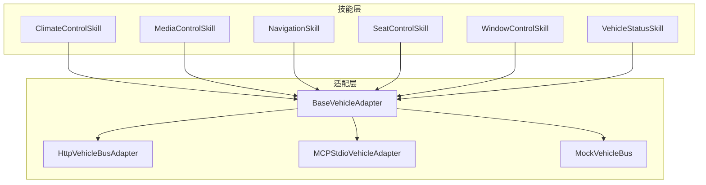
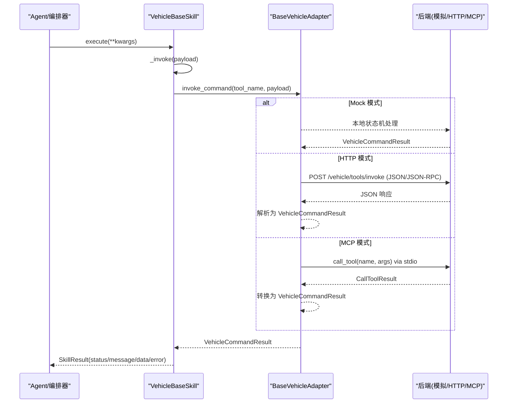
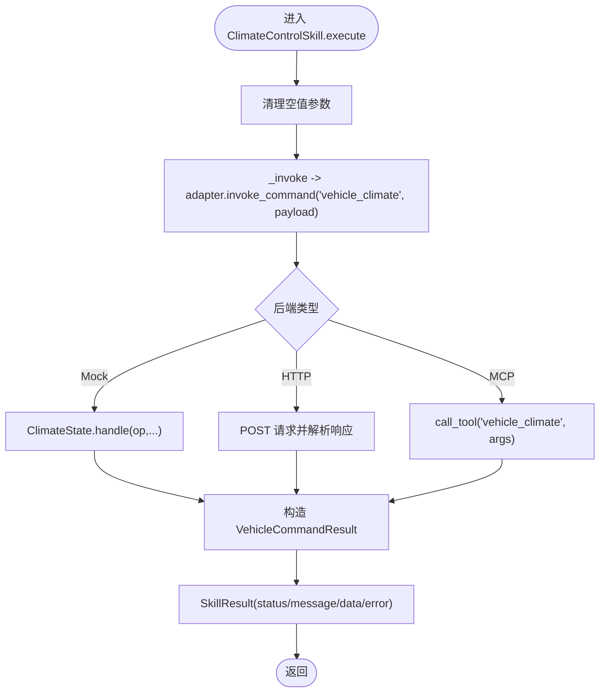
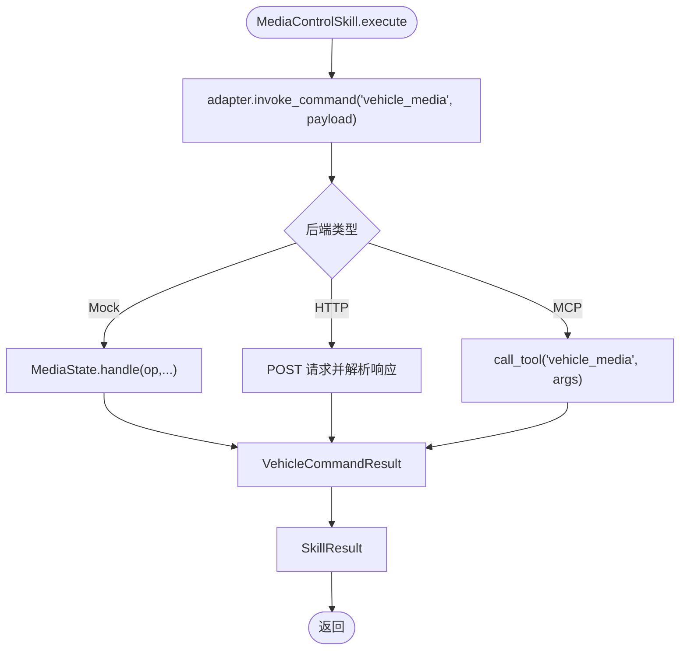
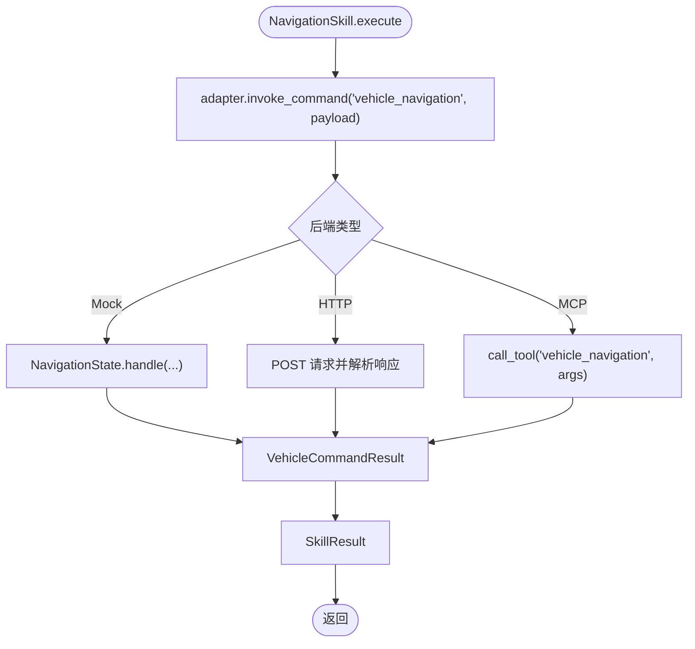
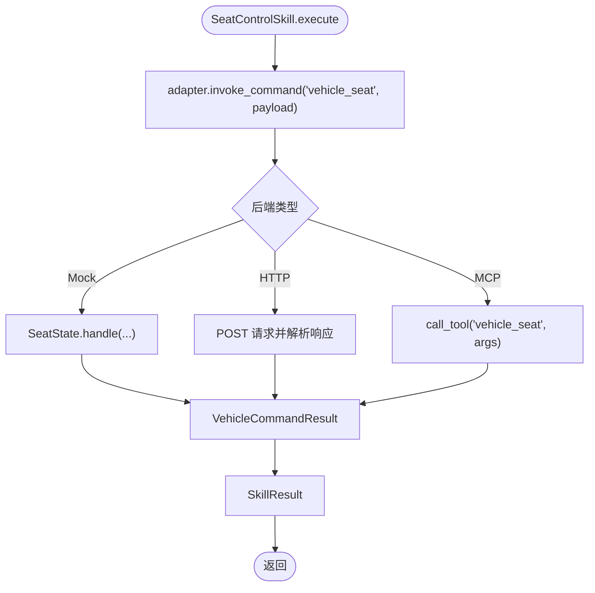
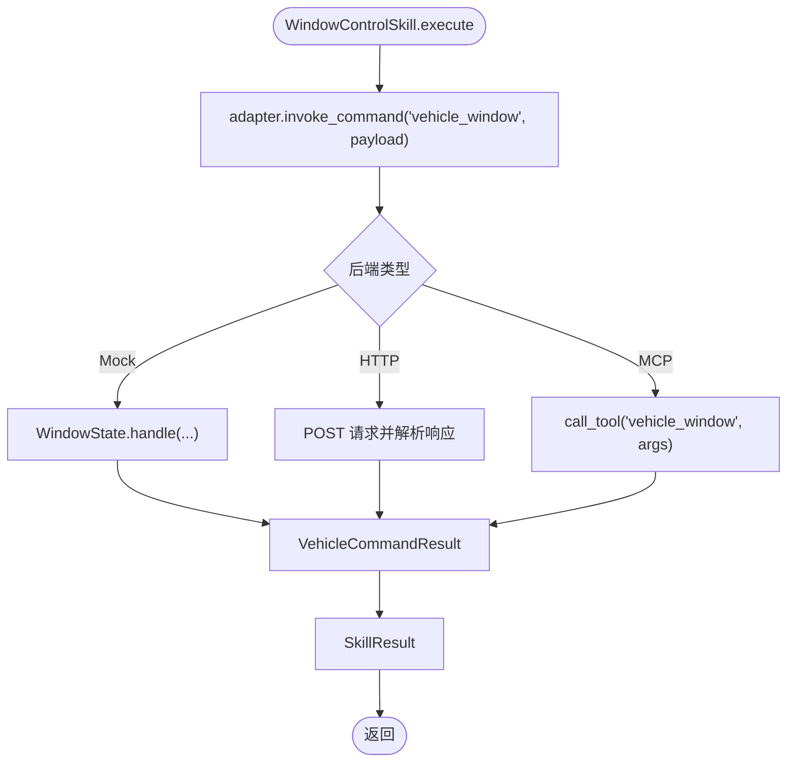
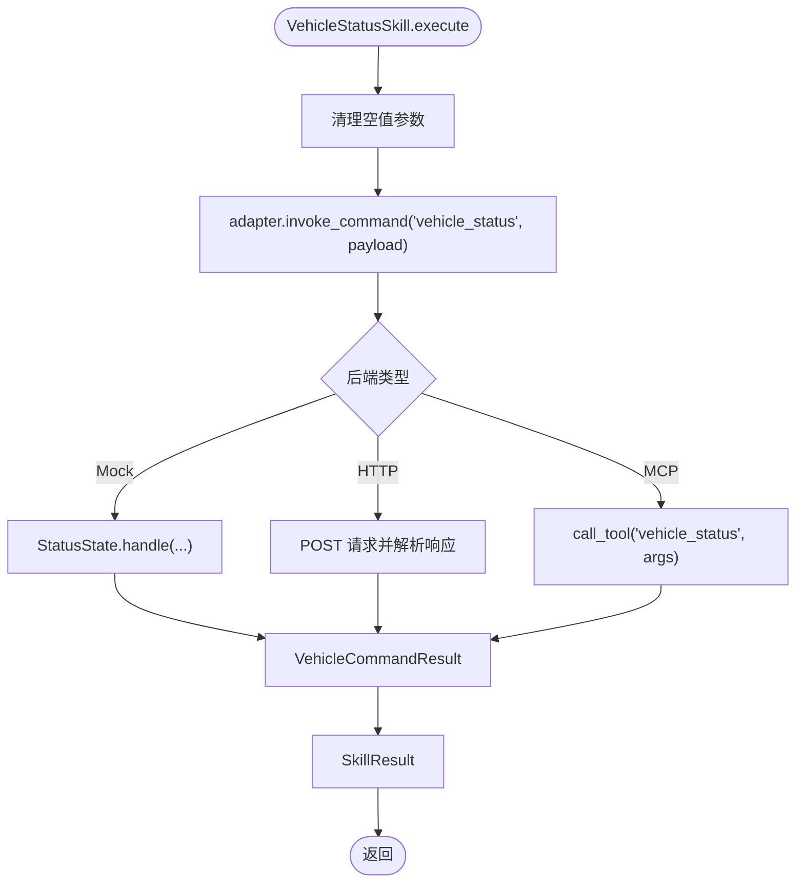
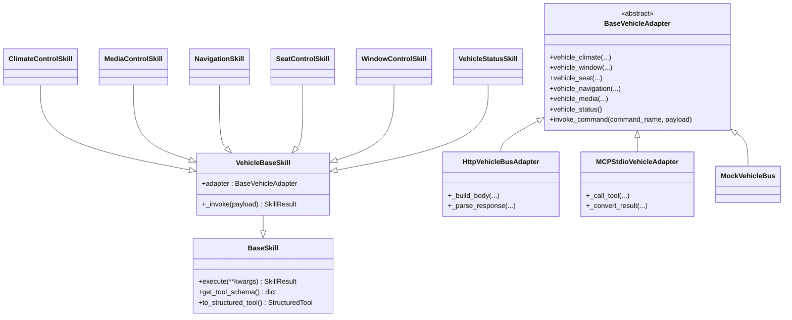

# 车辆控制技能

<cite>
**本文引用的文件**   
- [backend_design/nexus/skills/vehicle/__init__.py](file://backend_design/nexus/skills/vehicle/__init__.py)
- [backend_design/nexus/skills/vehicle/climate.py](file://backend_design/nexus/skills/vehicle/climate.py)
- [backend_design/nexus/skills/vehicle/media.py](file://backend_design/nexus/skills/vehicle/media.py)
- [backend_design/nexus/skills/vehicle/navigation.py](file://backend_design/nexus/skills/vehicle/navigation.py)
- [backend_design/nexus/skills/vehicle/seat.py](file://backend_design/nexus/skills/vehicle/seat.py)
- [backend_design/nexus/skills/vehicle/window.py](file://backend_design/nexus/skills/vehicle/window.py)
- [backend_design/nexus/skills/vehicle/status.py](file://backend_design/nexus/skills/vehicle/status.py)
- [backend_design/nexus/skills/base.py](file://backend_design/nexus/skills/base.py)
- [backend_design/nexus/vehicle/base.py](file://backend_design/nexus/vehicle/base.py)
- [backend_design/nexus/vehicle/factory.py](file://backend_design/nexus/vehicle/factory.py)
- [backend_design/nexus/vehicle/http.py](file://backend_design/nexus/vehicle/http.py)
- [backend_design/nexus/vehicle/mcp.py](file://backend_design/nexus/vehicle/mcp.py)
- [backend_design/nexus/vehicle/mock/climate_state.py](file://backend_design/nexus/vehicle/mock/climate_state.py)
- [backend_design/nexus/vehicle/mock/media_state.py](file://backend_design/nexus/vehicle/mock/media_state.py)
- [backend_design/nexus/vehicle/mock/navigation_state.py](file://backend_design/nexus/vehicle/mock/navigation_state.py)
- [backend_design/nexus/vehicle/mock/seat_state.py](file://backend_design/nexus/vehicle/mock/seat_state.py)
- [backend_design/nexus/vehicle/mock/window_state.py](file://backend_design/nexus/vehicle/mock/window_state.py)
- [backend_design/nexus/vehicle/mock/status_state.py](file://backend_design/nexus/vehicle/mock/status_state.py)
</cite>

## 目录
1. [简介](#简介)
2. [项目结构](#项目结构)
3. [核心组件](#核心组件)
4. [架构总览](#架构总览)
5. [详细组件分析](#详细组件分析)
6. [依赖关系分析](#依赖关系分析)
7. [性能考虑](#性能考虑)
8. [故障排查指南](#故障排查指南)
9. [结论](#结论)
10. [附录：命令与响应规范](#附录命令与响应规范)

## 简介
本文件为 NexusCockpit 的车辆控制技能集提供系统化文档，覆盖空调控制、媒体播放、导航设置、座椅调节、车窗控制与状态查询等核心车控功能。文档从技能定义、参数规范、执行流程、错误处理、状态同步机制到与车控总线的交互方式（HTTP/MCP/Mock）进行完整说明，并给出安全与权限建议及故障恢复策略。

## 项目结构
车辆控制能力由“技能层 + 适配层”组成：
- 技能层：每个车控域一个 Skill 类，声明名称、描述、参数与示例，统一通过基类调用适配器。
- 适配层：抽象接口 BaseVehicleAdapter，具体实现包括 Mock（开发测试）、HTTP（REST）、MCP（stdio）。
- 工厂：根据配置选择适配器，并提供多座舱隔离能力（Mock 模式每座舱独立实例）。

**图示来源** 
- [backend_design/nexus/skills/vehicle/__init__.py:21-55](file://backend_design/nexus/skills/vehicle/__init__.py#L21-L55)
- [backend_design/nexus/vehicle/base.py:35-92](file://backend_design/nexus/vehicle/base.py#L35-L92)
- [backend_design/nexus/vehicle/factory.py:38-123](file://backend_design/nexus/vehicle/factory.py#L38-L123)

**章节来源**
- [backend_design/nexus/skills/vehicle/__init__.py:1-55](file://backend_design/nexus/skills/vehicle/__init__.py#L1-L55)
- [backend_design/nexus/vehicle/base.py:1-92](file://backend_design/nexus/vehicle/base.py#L1-L92)
- [backend_design/nexus/vehicle/factory.py:1-147](file://backend_design/nexus/vehicle/factory.py#L1-L147)

## 核心组件
- VehicleBaseSkill：所有车控技能的基类，封装 tool_name 与 _invoke，统一通过 adapter.invoke_command 发送命令，返回 SkillResult。
- BaseVehicleAdapter：定义统一的六类方法（climate/window/seat/navigation/media/status）以及通用 invoke_command。
- HttpVehicleBusAdapter：通过 HTTP/REST 或 JSON-RPC 协议调用后端服务，支持超时、鉴权、错误解析。
- MCPStdioVehicleAdapter：通过 MCP SDK stdio 与外部服务通信，内部使用后台线程运行异步事件循环，暴露同步接口。
- MockVehicleBus：开发测试用，维护各子系统状态，支持多座舱隔离。

关键要点：
- 技能侧不关心底层通信细节，仅通过 tool_name 与 payload 下发指令。
- 适配器负责将工具名与参数序列化为协议格式，并解析响应为 VehicleCommandResult。
- 多座舱隔离：在 Mock 模式下，每个座舱拥有独立状态；HTTP/MCP 无状态，复用单例。

**章节来源**
- [backend_design/nexus/skills/vehicle/__init__.py:21-55](file://backend_design/nexus/skills/vehicle/__init__.py#L21-L55)
- [backend_design/nexus/vehicle/base.py:19-92](file://backend_design/nexus/vehicle/base.py#L19-L92)
- [backend_design/nexus/vehicle/http.py:23-127](file://backend_design/nexus/vehicle/http.py#L23-L127)
- [backend_design/nexus/vehicle/mcp.py:167-285](file://backend_design/nexus/vehicle/mcp.py#L167-L285)
- [backend_design/nexus/vehicle/factory.py:55-84](file://backend_design/nexus/vehicle/factory.py#L55-L84)

## 架构总览
下图展示一次典型的车控请求从技能到适配器的调用链，以及 Mock/HTTP/MCP 三种后端的差异。

**图示来源** 
- [backend_design/nexus/skills/vehicle/__init__.py:44-55](file://backend_design/nexus/skills/vehicle/__init__.py#L44-L55)
- [backend_design/nexus/vehicle/http.py:65-98](file://backend_design/nexus/vehicle/http.py#L65-L98)
- [backend_design/nexus/vehicle/mcp.py:222-237](file://backend_design/nexus/vehicle/mcp.py#L222-L237)

## 详细组件分析

### 空调控制（ClimateControlSkill）
- 功能：温度升降、设定目标温度、风量档位、模式切换、开关机。
- 参数：op、target_temp、delta、fan_speed、mode。
- 执行流程：
  - 技能 execute 直接调用 _invoke，传入 kwargs。
  - VehicleBaseSkill._invoke 调用 adapter.invoke_command("vehicle_climate", payload)。
  - 适配器将 payload 转为协议体并发送至后端（Mock/HTTP/MCP）。
  - 返回 VehicleCommandResult，被包装为 SkillResult。
- 错误处理：非法 op、越界值（如温度/风量范围）由后端状态机校验并返回错误信息。
- 状态同步：Mock 模式维护 climate 字典；HTTP/MCP 模式由后端维护，前端通过 status 查询同步。

**图示来源** 
- [backend_design/nexus/skills/vehicle/climate.py:35-37](file://backend_design/nexus/skills/vehicle/climate.py#L35-L37)
- [backend_design/nexus/skills/vehicle/__init__.py:44-55](file://backend_design/nexus/skills/vehicle/__init__.py#L44-L55)
- [backend_design/nexus/vehicle/mock/climate_state.py:41-143](file://backend_design/nexus/vehicle/mock/climate_state.py#L41-L143)
- [backend_design/nexus/vehicle/http.py:41-48](file://backend_design/nexus/vehicle/http.py#L41-L48)
- [backend_design/nexus/vehicle/mcp.py:198-205](file://backend_design/nexus/vehicle/mcp.py#L198-L205)

**章节来源**
- [backend_design/nexus/skills/vehicle/climate.py:15-37](file://backend_design/nexus/skills/vehicle/climate.py#L15-L37)
- [backend_design/nexus/vehicle/mock/climate_state.py:22-143](file://backend_design/nexus/vehicle/mock/climate_state.py#L22-L143)

### 媒体播放（MediaControlSkill）
- 功能：播放/暂停/下一首/上一首/切源/音量/播放模式/选曲。
- 参数：op、source、track、volume。
- 执行流程：同空调控制，tool_name="vehicle_media"。
- 错误处理：非法 op、不支持的播放模式会返回错误；音量范围限制 0-30。
- 状态同步：Mock 维护 media 字典与播放列表；HTTP/MCP 由后端管理。

**图示来源** 
- [backend_design/nexus/skills/vehicle/media.py:34-36](file://backend_design/nexus/skills/vehicle/media.py#L34-L36)
- [backend_design/nexus/vehicle/mock/media_state.py:91-226](file://backend_design/nexus/vehicle/mock/media_state.py#L91-L226)
- [backend_design/nexus/vehicle/http.py:59-61](file://backend_design/nexus/vehicle/http.py#L59-L61)
- [backend_design/nexus/vehicle/mcp.py:216-218](file://backend_design/nexus/vehicle/mcp.py#L216-L218)

**章节来源**
- [backend_design/nexus/skills/vehicle/media.py:15-36](file://backend_design/nexus/skills/vehicle/media.py#L15-L36)
- [backend_design/nexus/vehicle/mock/media_state.py:25-226](file://backend_design/nexus/vehicle/mock/media_state.py#L25-L226)

### 导航设置（NavigationSkill）
- 功能：发起导航（目的地/途经点/模式）、查询当前位置。
- 参数：destination、waypoint、mode、op。
- 执行流程：tool_name="vehicle_navigation"。
- 错误处理：非法 op 或定位失败时返回降级消息（坐标字符串）。
- 状态同步：Mock 维护 navigation 字典，包含当前地址、经纬度、速度、方向等。

**图示来源** 
- [backend_design/nexus/skills/vehicle/navigation.py:37-39](file://backend_design/nexus/skills/vehicle/navigation.py#L37-L39)
- [backend_design/nexus/vehicle/mock/navigation_state.py:33-66](file://backend_design/nexus/vehicle/mock/navigation_state.py#L33-L66)
- [backend_design/nexus/vehicle/http.py:56-58](file://backend_design/nexus/vehicle/http.py#L56-L58)
- [backend_design/nexus/vehicle/mcp.py:213-214](file://backend_design/nexus/vehicle/mcp.py#L213-L214)

**章节来源**
- [backend_design/nexus/skills/vehicle/navigation.py:15-39](file://backend_design/nexus/skills/vehicle/navigation.py#L15-L39)
- [backend_design/nexus/vehicle/mock/navigation_state.py:17-216](file://backend_design/nexus/vehicle/mock/navigation_state.py#L17-L216)

### 座椅调节（SeatControlSkill）
- 功能：加热/通风/按摩开关与档位、前后位置调整。
- 参数：op、position、level、direction。
- 执行流程：tool_name="vehicle_seat"。
- 错误处理：非法 op 或 position 回退默认；档位范围限制。
- 状态同步：Mock 维护 seats 字典，按座位维度记录状态。

**图示来源** 
- [backend_design/nexus/skills/vehicle/seat.py:33-35](file://backend_design/nexus/skills/vehicle/seat.py#L33-L35)
- [backend_design/nexus/vehicle/mock/seat_state.py:39-91](file://backend_design/nexus/vehicle/mock/seat_state.py#L39-L91)
- [backend_design/nexus/vehicle/http.py:53-55](file://backend_design/nexus/vehicle/http.py#L53-L55)
- [backend_design/nexus/vehicle/mcp.py:210-212](file://backend_design/nexus/vehicle/mcp.py#L210-L212)

**章节来源**
- [backend_design/nexus/skills/vehicle/seat.py:15-35](file://backend_design/nexus/skills/vehicle/seat.py#L15-L35)
- [backend_design/nexus/vehicle/mock/seat_state.py:14-91](file://backend_design/nexus/vehicle/mock/seat_state.py#L14-L91)

### 车窗控制（WindowControlSkill）
- 功能：开合、升降、百分比位置设置。
- 参数：op、position、percent。
- 执行流程：tool_name="vehicle_window"。
- 错误处理：非法 op 或 position 回退默认；percent 范围限制 0-100。
- 状态同步：Mock 维护 windows 字典，all 字段反映最大开合比例。

**图示来源** 
- [backend_design/nexus/skills/vehicle/window.py:32-34](file://backend_design/nexus/skills/vehicle/window.py#L32-L34)
- [backend_design/nexus/vehicle/mock/window_state.py:38-89](file://backend_design/nexus/vehicle/mock/window_state.py#L38-L89)
- [backend_design/nexus/vehicle/http.py:50-52](file://backend_design/nexus/vehicle/http.py#L50-L52)
- [backend_design/nexus/vehicle/mcp.py:207-209](file://backend_design/nexus/vehicle/mcp.py#L207-L209)

**章节来源**
- [backend_design/nexus/skills/vehicle/window.py:15-34](file://backend_design/nexus/skills/vehicle/window.py#L15-L34)
- [backend_design/nexus/vehicle/mock/window_state.py:12-89](file://backend_design/nexus/vehicle/mock/window_state.py#L12-L89)

### 状态查询（VehicleStatusSkill）
- 功能：查询车辆状态（胎压、续航、电量、油量、保养），也支持查询当前位置。
- 参数：op（location/status）。
- 执行流程：tool_name="vehicle_status"。
- 错误处理：非法 op 或后端不可用时返回错误信息。
- 状态同步：Mock 维护 status 字典；HTTP/MCP 由后端提供。

**图示来源** 
- [backend_design/nexus/skills/vehicle/status.py:30-33](file://backend_design/nexus/skills/vehicle/status.py#L30-L33)
- [backend_design/nexus/vehicle/mock/status_state.py:26-38](file://backend_design/nexus/vehicle/mock/status_state.py#L26-L38)
- [backend_design/nexus/vehicle/http.py:62-64](file://backend_design/nexus/vehicle/http.py#L62-L64)
- [backend_design/nexus/vehicle/mcp.py:219-221](file://backend_design/nexus/vehicle/mcp.py#L219-L221)

**章节来源**
- [backend_design/nexus/skills/vehicle/status.py:15-33](file://backend_design/nexus/skills/vehicle/status.py#L15-L33)
- [backend_design/nexus/vehicle/mock/status_state.py:14-38](file://backend_design/nexus/vehicle/mock/status_state.py#L14-L38)

## 依赖关系分析
- 技能层依赖 BaseSkill 与 VehicleBaseSkill，后者依赖 BaseVehicleAdapter。
- 适配器工厂根据配置选择 Mock/HTTP/MCP 实现。
- Mock 状态模块各自维护领域状态，互不耦合。
- HTTP/MCP 适配器分别依赖网络库与 MCP SDK。

**图示来源** 
- [backend_design/nexus/skills/base.py:116-264](file://backend_design/nexus/skills/base.py#L116-L264)
- [backend_design/nexus/skills/vehicle/__init__.py:21-55](file://backend_design/nexus/skills/vehicle/__init__.py#L21-L55)
- [backend_design/nexus/vehicle/base.py:35-92](file://backend_design/nexus/vehicle/base.py#L35-L92)
- [backend_design/nexus/vehicle/http.py:23-127](file://backend_design/nexus/vehicle/http.py#L23-L127)
- [backend_design/nexus/vehicle/mcp.py:167-285](file://backend_design/nexus/vehicle/mcp.py#L167-L285)

**章节来源**
- [backend_design/nexus/skills/base.py:1-264](file://backend_design/nexus/skills/base.py#L1-L264)
- [backend_design/nexus/vehicle/base.py:1-92](file://backend_design/nexus/vehicle/base.py#L1-L92)
- [backend_design/nexus/vehicle/factory.py:1-147](file://backend_design/nexus/vehicle/factory.py#L1-L147)

## 性能考虑
- 适配器单例与多座舱隔离：
  - build_vehicle_adapter 创建全局单例，避免重复初始化。
  - get_cockpit_vehicle_adapter 在 Mock 模式下为每座舱创建独立实例，HTTP/MCP 复用单例。
- 超时与重试：
  - HTTP 适配器支持 timeout 配置，连接失败与 HTTP 错误均捕获并返回结构化错误。
  - MCP 适配器通过后台事件循环与工具超时控制，避免阻塞主线程。
- 状态缓存与查询：
  - Mock 状态内存存储，查询 O(1)；HTTP/MCP 需网络往返，建议在前端或上层做短时缓存。
- 资源占用：
  - MCP 后台线程与事件循环常驻，注意进程生命周期管理与优雅关闭。

[本节为通用指导，不直接分析具体文件]

## 故障排查指南
- 常见错误码与原因：
  - invalid_op：操作符不在白名单（各状态机定义）。
  - invalid_play_mode：播放模式不支持。
  - connection_failed：无法连接真实车控服务（HTTP）。
  - invoke_failed：调用真实车控服务失败（HTTP）。
  - mcp_call_failed：MCP 调用异常。
  - tool_not_exposed：MCP 服务端未暴露对应工具。
- 排查步骤：
  - 检查 skill 参数是否合法（参考各 skill 的 parameters 定义）。
  - 确认 VEHICLE_ADAPTER 配置与后端可用性（HTTP base_url、MCP command）。
  - 查看日志输出（适配器与状态机打印的警告/错误）。
  - 对 Mock 模式，检查对应状态字典是否符合预期。
- 恢复策略：
  - 网络错误：重试+指数退避（上层实现）。
  - MCP 工具缺失：动态 list_tools 校验，必要时降级或提示用户。
  - 状态不一致：通过 vehicle_status 或各子系统的 status 查询刷新。

**章节来源**
- [backend_design/nexus/vehicle/http.py:86-93](file://backend_design/nexus/vehicle/http.py#L86-L93)
- [backend_design/nexus/vehicle/mcp.py:225-237](file://backend_design/nexus/vehicle/mcp.py#L225-L237)
- [backend_design/nexus/vehicle/mock/climate_state.py:60-66](file://backend_design/nexus/vehicle/mock/climate_state.py#L60-L66)
- [backend_design/nexus/vehicle/mock/media_state.py:99-106](file://backend_design/nexus/vehicle/mock/media_state.py#L99-L106)
- [backend_design/nexus/vehicle/mock/seat_state.py:46-52](file://backend_design/nexus/vehicle/mock/seat_state.py#L46-L52)
- [backend_design/nexus/vehicle/mock/window_state.py:41-47](file://backend_design/nexus/vehicle/mock/window_state.py#L41-L47)

## 结论
NexusCockpit 的车辆控制技能集通过清晰的“技能层 + 适配层”架构，实现了空调、媒体、导航、座椅、车窗与状态查询的统一接入。Mock/HTTP/MCP 三种后端满足开发与生产需求，配合多座舱隔离与结构化结果模型，确保可观测性与可维护性。建议在集成中严格遵循参数规范与错误处理约定，并结合上层缓存与重试策略提升稳定性。

[本节为总结性内容，不直接分析具体文件]

## 附录：命令与响应规范

### 车控总线交互方式
- 工具名（command_name）：
  - vehicle_climate、vehicle_window、vehicle_seat、vehicle_navigation、vehicle_media、vehicle_status
- 载荷（payload）：由各 skill 的 parameters 定义决定，键名与类型见各 skill 文件。
- 适配器协议：
  - HTTP：支持 REST（{"tool": name, "arguments": payload}）与 JSON-RPC（{"jsonrpc":"2.0","method":name,"params":payload}）。
  - MCP：通过 stdio 调用 call_tool(name, arguments)，返回 CallToolResult。
  - Mock：本地状态机处理，返回 VehicleCommandResult。

### 响应数据结构
- VehicleCommandResult：
  - success: bool
  - message: string
  - data: dict
  - error: string
- SkillResult：
  - status: "ok"/"error"
  - message: string
  - data: dict
  - error: string
  - action: string（工具名）
  - handled: bool

### 各技能参数定义（摘要）
- 空调（vehicle_climate）：op、target_temp、delta、fan_speed、mode
- 媒体（vehicle_media）：op、source、track、volume
- 导航（vehicle_navigation）：destination、waypoint、mode、op
- 座椅（vehicle_seat）：op、position、level、direction
- 车窗（vehicle_window）：op、position、percent
- 状态（vehicle_status）：op

**章节来源**
- [backend_design/nexus/skills/vehicle/climate.py:27-33](file://backend_design/nexus/skills/vehicle/climate.py#L27-L33)
- [backend_design/nexus/skills/vehicle/media.py:27-32](file://backend_design/nexus/skills/vehicle/media.py#L27-L32)
- [backend_design/nexus/skills/vehicle/navigation.py:30-35](file://backend_design/nexus/skills/vehicle/navigation.py#L30-L35)
- [backend_design/nexus/skills/vehicle/seat.py:26-31](file://backend_design/nexus/skills/vehicle/seat.py#L26-L31)
- [backend_design/nexus/skills/vehicle/window.py:26-30](file://backend_design/nexus/skills/vehicle/window.py#L26-L30)
- [backend_design/nexus/skills/vehicle/status.py:26-28](file://backend_design/nexus/skills/vehicle/status.py#L26-L28)
- [backend_design/nexus/vehicle/http.py:94-98](file://backend_design/nexus/vehicle/http.py#L94-L98)
- [backend_design/nexus/vehicle/base.py:19-33](file://backend_design/nexus/vehicle/base.py#L19-L33)
- [backend_design/nexus/skills/base.py:92-114](file://backend_design/nexus/skills/base.py#L92-L114)