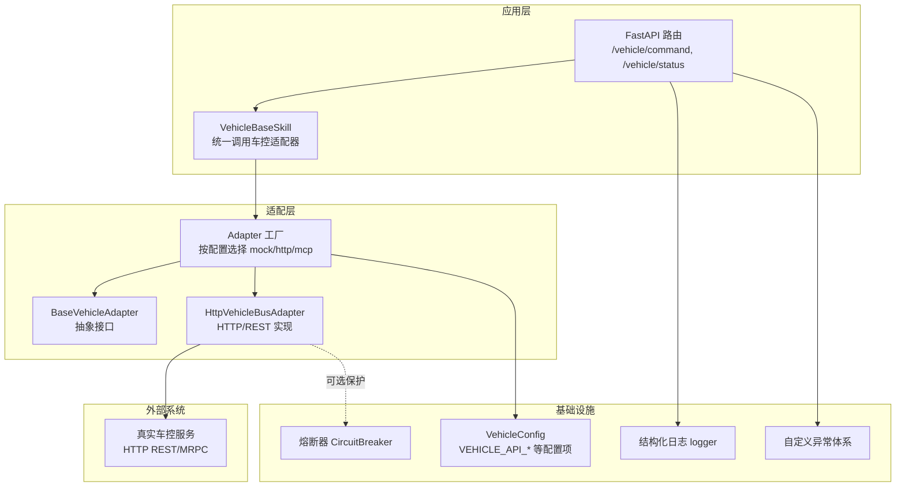
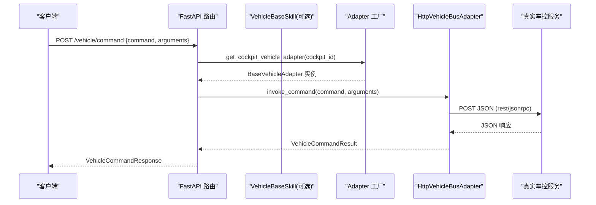
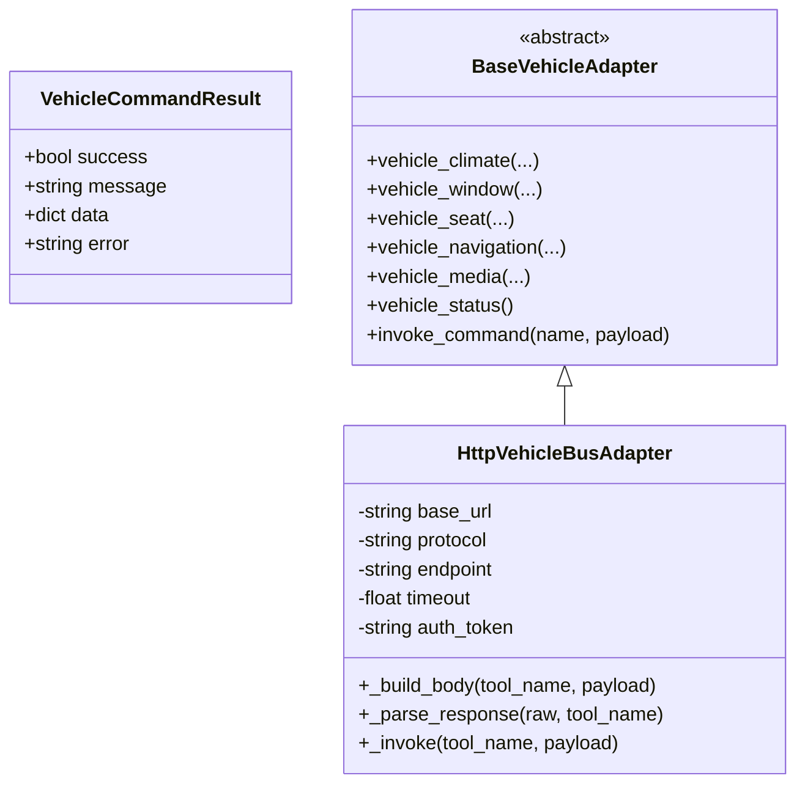
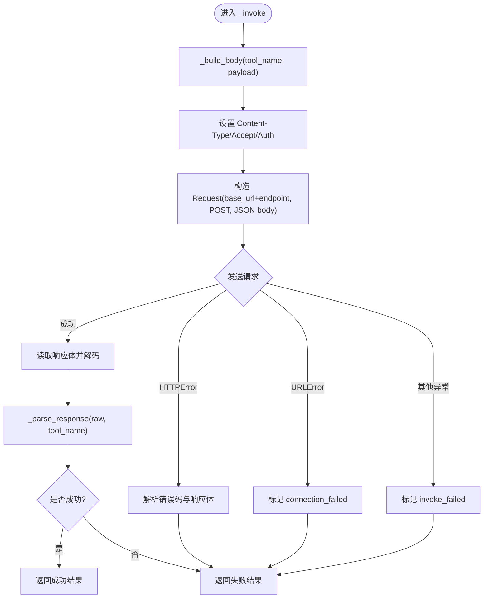
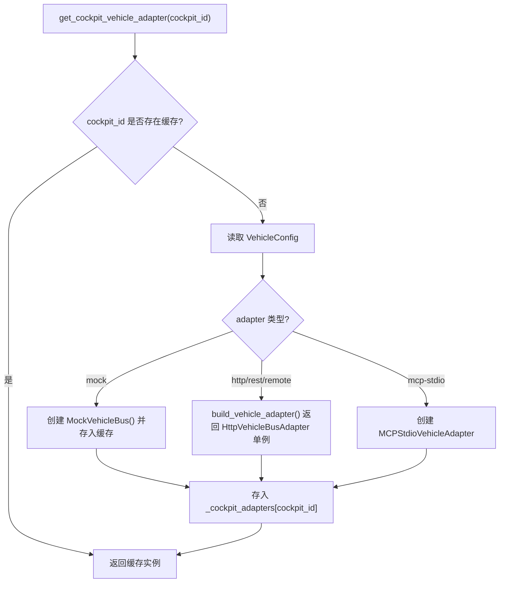
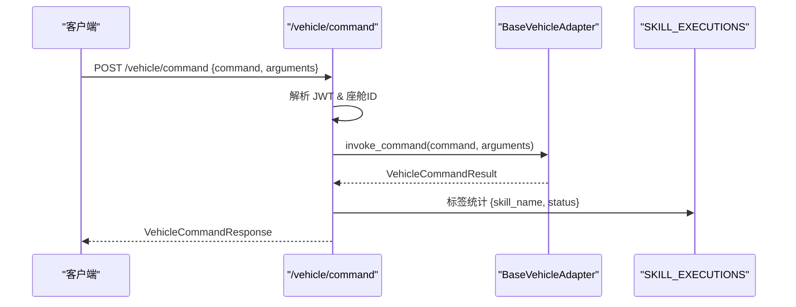
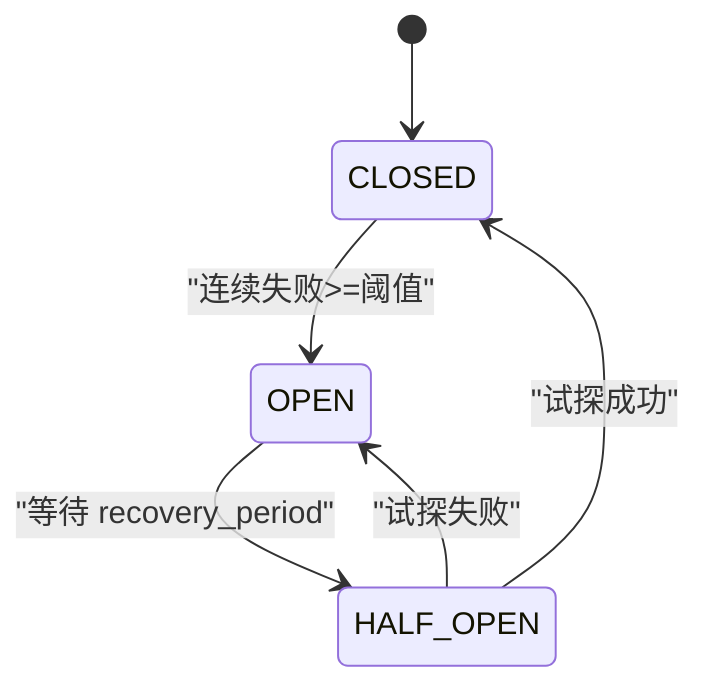
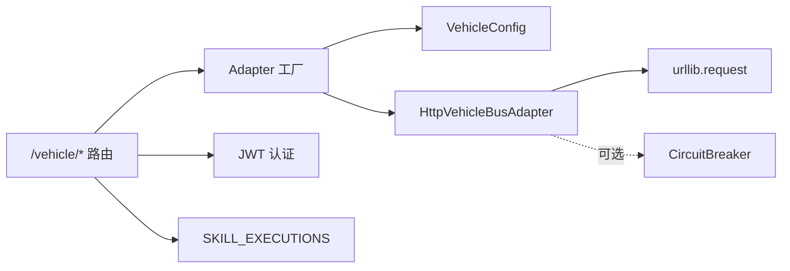

# HTTP适配器实现

<cite>
**本文引用的文件**   
- [http.py](file://backend_design/nexus/vehicle/http.py)
- [base.py](file://backend_design/nexus/vehicle/base.py)
- [factory.py](file://backend_design/nexus/vehicle/factory.py)
- [vehicle.py（路由）](file://backend_design/nexus/api/routes/vehicle.py)
- [schemas.py](file://backend_design/nexus/models/schemas.py)
- [vehicle.py（技能基类）](file://backend_design/nexus/skills/vehicle/__init__.py)
- [circuit_breaker.py](file://backend_design/nexus/core/circuit_breaker.py)
- [logger.py](file://backend_design/nexus/core/logger.py)
- [exceptions.py](file://backend_design/nexus/core/exceptions.py)
- [vehicle.py（配置）](file://backend_design/nexus/config/vehicle.py)
- [__init__.py（配置聚合）](file://backend_design/nexus/config/__init__.py)
</cite>

## 目录
1. [简介](#简介)
2. [项目结构](#项目结构)
3. [核心组件](#核心组件)
4. [架构总览](#架构总览)
5. [详细组件分析](#详细组件分析)
6. [依赖关系分析](#依赖关系分析)
7. [性能考量](#性能考量)
8. [故障排查指南](#故障排查指南)
9. [结论](#结论)
10. [附录：API端点与数据模型](#附录api端点与数据模型)

## 简介
本文件面向“基于HTTP协议的车控通信机制”的HTTP适配器实现，系统性阐述RESTful API调用、请求响应处理、错误恢复策略，以及连接池管理、超时配置、重试机制和熔断保护。文档同时覆盖API端点映射、数据序列化格式与安全认证方式，并给出网络异常处理、日志记录与性能监控的实现细节，最后提供HTTP适配器的配置方法与故障排查指南。

## 项目结构
HTTP车控适配器位于后端Python服务中，通过统一的适配器抽象层对外暴露车控能力；上层FastAPI路由负责鉴权、参数校验与指标上报；工厂模块根据环境变量选择具体适配器实现；配置模块集中管理HTTP相关参数。

**图表来源** 
- [vehicle.py（路由）:1-152](file://backend_design/nexus/api/routes/vehicle.py#L1-L152)
- [vehicle.py（技能基类）:1-55](file://backend_design/nexus/skills/vehicle/__init__.py#L1-L55)
- [factory.py:1-147](file://backend_design/nexus/vehicle/factory.py#L1-L147)
- [base.py:1-92](file://backend_design/nexus/vehicle/base.py#L1-L92)
- [http.py:1-127](file://backend_design/nexus/vehicle/http.py#L1-L127)
- [vehicle.py（配置）:1-50](file://backend_design/nexus/config/vehicle.py#L1-L50)
- [logger.py:1-249](file://backend_design/nexus/core/logger.py#L1-L249)
- [exceptions.py:1-128](file://backend_design/nexus/core/exceptions.py#L1-L128)
- [circuit_breaker.py:1-177](file://backend_design/nexus/core/circuit_breaker.py#L1-L177)

**章节来源**
- [vehicle.py（路由）:1-152](file://backend_design/nexus/api/routes/vehicle.py#L1-L152)
- [factory.py:1-147](file://backend_design/nexus/vehicle/factory.py#L1-L147)
- [vehicle.py（配置）:1-50](file://backend_design/nexus/config/vehicle.py#L1-L50)

## 核心组件
- 抽象接口与结果对象
  - BaseVehicleAdapter：定义空调、车窗、座椅、导航、媒体、状态查询与通用命令调用等统一接口。
  - VehicleCommandResult：封装执行成功与否、消息、结构化数据与错误信息。
- HTTP适配器实现
  - HttpVehicleBusAdapter：基于urllib.request发起POST请求，支持JSON-RPC或REST两种协议体格式，内置超时、认证头、异常捕获与响应解析。
- 工厂与多座舱隔离
  - build_vehicle_adapter/get_cockpit_vehicle_adapter：依据配置选择mock/http/mcp；Mock模式每座舱独立实例，HTTP/MCP复用无状态单例。
- 路由与认证
  - FastAPI路由提供直接执行命令与状态查询接口，集成JWT鉴权、座舱隔离、指标上报与异常转换。
- 配置中心
  - VehicleConfig：集中管理VEHICLE_ADAPTER、VEHICLE_API_BASE_URL、VEHICLE_API_PROTOCOL、VEHICLE_API_ENDPOINT、VEHICLE_API_TIMEOUT、VEHICLE_API_TOKEN等。
- 可观测性与稳定性
  - 结构化日志：统一输出JSON，敏感字段脱敏。
  - 熔断器：三态机（CLOSED/OPEN/HALF_OPEN），用于外部服务连续失败时的降级保护。

**章节来源**
- [base.py:1-92](file://backend_design/nexus/vehicle/base.py#L1-L92)
- [http.py:1-127](file://backend_design/nexus/vehicle/http.py#L1-L127)
- [factory.py:1-147](file://backend_design/nexus/vehicle/factory.py#L1-L147)
- [vehicle.py（路由）:1-152](file://backend_design/nexus/api/routes/vehicle.py#L1-L152)
- [vehicle.py（配置）:1-50](file://backend_design/nexus/config/vehicle.py#L1-L50)
- [logger.py:1-249](file://backend_design/nexus/core/logger.py#L1-L249)
- [circuit_breaker.py:1-177](file://backend_design/nexus/core/circuit_breaker.py#L1-L177)

## 架构总览
HTTP车控链路从FastAPI路由进入，经技能层或直接路由调用适配器工厂获取对应座舱的适配器实例，再由HTTP适配器将命令序列化为JSON并通过HTTP POST发送至真实车控服务。响应被统一解析为VehicleCommandResult，最终由路由返回标准JSON。

**图表来源** 
- [vehicle.py（路由）:48-86](file://backend_design/nexus/api/routes/vehicle.py#L48-L86)
- [vehicle.py（技能基类）:21-55](file://backend_design/nexus/skills/vehicle/__init__.py#L21-L55)
- [factory.py:55-84](file://backend_design/nexus/vehicle/factory.py#L55-L84)
- [http.py:65-93](file://backend_design/nexus/vehicle/http.py#L65-L93)

## 详细组件分析

### 抽象接口与结果对象（BaseVehicleAdapter 与 VehicleCommandResult）
- 职责
  - 定义所有车控子系统的统一方法签名，屏蔽底层差异。
  - 统一返回结构，便于上层一致化处理。
- 复杂度
  - 接口均为O(1)声明；实际复杂度取决于具体实现。
- 依赖链
  - 所有适配器均继承该抽象类，确保多态调用。

**图表来源** 
- [base.py:19-92](file://backend_design/nexus/vehicle/base.py#L19-L92)
- [http.py:23-93](file://backend_design/nexus/vehicle/http.py#L23-L93)

**章节来源**
- [base.py:1-92](file://backend_design/nexus/vehicle/base.py#L1-L92)

### HTTP适配器（HttpVehicleBusAdapter）
- 功能要点
  - 构造参数：base_url、protocol（rest/jsonrpc）、endpoint、timeout、auth_token。
  - 请求构建：统一设置Content-Type/Accept，附加Authorization Bearer（若配置）。
  - 协议体：jsonrpc时生成{"jsonrpc":"2.0","id":...,"method":tool_name,"params":payload}；否则{"tool":tool_name,"arguments":payload}。
  - 超时控制：urlopen使用timeout参数。
  - 异常处理：捕获HTTPError/URLError/通用异常，返回失败结果并附带错误码。
  - 响应解析：优先取result包裹，再识别success/message/data/error字段，兼容多种返回结构。
- 性能与扩展
  - 当前使用标准库urllib.request，未显式启用连接池；可通过替换为requests/urllib3或引入连接池管理器进行优化。
  - 可在_invoke外层接入熔断器与重试逻辑，提升鲁棒性。

**图表来源** 
- [http.py:69-127](file://backend_design/nexus/vehicle/http.py#L69-L127)

**章节来源**
- [http.py:23-127](file://backend_design/nexus/vehicle/http.py#L23-L127)

### 工厂与多座舱隔离（factory.py）
- 行为
  - 首次调用build_vehicle_adapter创建全局单例；后续复用。
  - get_cockpit_vehicle_adapter按cockpit_id返回实例：Mock模式每座舱独立实例；HTTP/MCP模式复用单例。
  - 根据VehicleConfig.adapter选择实现：http/rest/remote -> HttpVehicleBusAdapter；mcp-stdio -> MCPStdioVehicleAdapter；默认Mock。
- 设计优势
  - 避免重复初始化，降低开销。
  - Mock模式天然状态隔离，适合多座舱测试。

**图表来源** 
- [factory.py:55-84](file://backend_design/nexus/vehicle/factory.py#L55-L84)
- [factory.py:86-123](file://backend_design/nexus/vehicle/factory.py#L86-L123)

**章节来源**
- [factory.py:1-147](file://backend_design/nexus/vehicle/factory.py#L1-L147)

### 路由与认证（FastAPI /vehicle/*）
- 端点
  - POST /vehicle/command：直接执行车控命令，需要JWT认证，返回标准化响应。
  - GET /vehicle/status：获取车辆状态，需要JWT认证，返回扁平化数据结构。
  - POST /vehicle/location：更新浏览器GPS坐标（仅存储，不触发逆地理编码）。
- 座舱隔离
  - 通过X-Cockpit-Id或tenant_context获取cockpit_id，选择对应适配器实例。
- 指标与异常
  - 成功/失败计数通过SKILL_EXECUTIONS上报。
  - 异常转换为VehicleError，包含code与details。

**图表来源** 
- [vehicle.py（路由）:48-86](file://backend_design/nexus/api/routes/vehicle.py#L48-L86)
- [schemas.py:55-68](file://backend_design/nexus/models/schemas.py#L55-L68)

**章节来源**
- [vehicle.py（路由）:1-152](file://backend_design/nexus/api/routes/vehicle.py#L1-L152)
- [schemas.py:55-68](file://backend_design/nexus/models/schemas.py#L55-L68)

### 技能层集成（VehicleBaseSkill）
- 作用
  - 在Agent工作流中统一通过vehicle adapter访问车控总线，自动按座舱隔离。
- 调用路径
  - 内部调用adapter.invoke_command(tool_name, payload)，并将结果包装为SkillResult。

**章节来源**
- [vehicle.py（技能基类）:1-55](file://backend_design/nexus/skills/vehicle/__init__.py#L1-L55)

### 配置与环境变量（VehicleConfig）
- 关键配置项
  - VEHICLE_ADAPTER：适配器类型（mock/http/mcp）
  - VEHICLE_API_BASE_URL：HTTP API基础地址
  - VEHICLE_API_PROTOCOL：协议类型（rest/jsonrpc）
  - VEHICLE_API_ENDPOINT：接口路径
  - VEHICLE_API_TIMEOUT：超时秒数
  - VEHICLE_API_TOKEN：Bearer Token
- 加载策略
  - 通过pydantic-settings从.env/.env.local加载，支持覆盖。

**章节来源**
- [vehicle.py（配置）:15-49](file://backend_design/nexus/config/vehicle.py#L15-L49)
- [__init__.py（配置聚合）:84-132](file://backend_design/nexus/config/__init__.py#L84-L132)

### 日志与可观测性（logger.py）
- 特点
  - 结构化JSON输出，生产环境友好；开发环境彩色控制台。
  - 敏感字段自动脱敏（API Key、Token、密码等）。
  - 为uvicorn添加共享FileHandler，确保访问日志落盘。
- 使用建议
  - 在HTTP适配器与路由中记录关键节点耗时与错误上下文，便于定位问题。

**章节来源**
- [logger.py:1-249](file://backend_design/nexus/core/logger.py#L1-L249)

### 熔断保护（circuit_breaker.py）
- 状态机
  - CLOSED：正常放行，累计失败次数。
  - OPEN：拒绝请求，等待recovery_period后进入HALF_OPEN。
  - HALF_OPEN：限制并发试探请求，成功则恢复至CLOSED，失败则回到OPEN。
- 适用场景
  - 车控服务连续超时/不可用时快速失败，避免雪崩。

**图表来源** 
- [circuit_breaker.py:34-96](file://backend_design/nexus/core/circuit_breaker.py#L34-L96)

**章节来源**
- [circuit_breaker.py:1-177](file://backend_design/nexus/core/circuit_breaker.py#L1-L177)

## 依赖关系分析
- 模块耦合
  - 路由依赖适配器工厂与认证中间件；适配器工厂依赖配置中心；HTTP适配器依赖标准库urllib与日志。
- 外部依赖
  - 真实车控服务（HTTP REST/MRPC）；可选熔断器与指标系统。
- 潜在循环
  - 通过延迟导入与工厂解耦，避免循环依赖。

**图表来源** 
- [vehicle.py（路由）:1-152](file://backend_design/nexus/api/routes/vehicle.py#L1-L152)
- [factory.py:1-147](file://backend_design/nexus/vehicle/factory.py#L1-L147)
- [http.py:1-127](file://backend_design/nexus/vehicle/http.py#L1-L127)
- [vehicle.py（配置）:1-50](file://backend_design/nexus/config/vehicle.py#L1-L50)
- [circuit_breaker.py:1-177](file://backend_design/nexus/core/circuit_breaker.py#L1-L177)

**章节来源**
- [vehicle.py（路由）:1-152](file://backend_design/nexus/api/routes/vehicle.py#L1-L152)
- [factory.py:1-147](file://backend_design/nexus/vehicle/factory.py#L1-L147)
- [http.py:1-127](file://backend_design/nexus/vehicle/http.py#L1-L127)

## 性能考量
- 连接池
  - 当前HTTP实现未显式启用连接池；建议替换为requests.Session或urllib3.PoolManager，复用TCP连接，减少握手开销。
- 超时与重试
  - 已实现单次超时；建议在_invoke外层增加指数退避重试（限最大次数与退避上限），对幂等操作安全。
- 熔断与降级
  - 结合CircuitBreaker对车控服务调用进行保护；失败时快速失败或降级到Mock模式。
- 序列化与I/O
  - JSON序列化开销较小；大负载时可考虑二进制协议或压缩传输。
- 指标与追踪
  - 通过SKILL_EXECUTIONS统计成功率；建议补充请求耗时直方图与P95/P99分位。

[本节为通用指导，无需代码引用]

## 故障排查指南
- 常见问题
  - 无法连接车控服务：检查VEHICLE_API_BASE_URL、网络连通性、防火墙与代理设置。
  - 认证失败：确认VEHICLE_API_TOKEN正确且有效，Authorization头是否正确注入。
  - 非JSON响应：检查车控服务返回格式，确保_parse_response能兼容。
  - 超时频繁：适当增大VEHICLE_API_TIMEOUT，或优化车控服务性能。
- 诊断步骤
  - 查看结构化日志（backend_logs/*.log），关注HTTPError/URLError与invoke_failed标记。
  - 开启DEBUG级别观察请求体与响应体（注意脱敏）。
  - 使用熔断器状态判断是否处于OPEN/HALF_OPEN，必要时调整failure_threshold与recovery_period。
- 恢复策略
  - 临时切换VEHICLE_ADAPTER=mock进行验证。
  - 逐步恢复：先半开试探，成功后闭合；失败则继续断开。

**章节来源**
- [logger.py:1-249](file://backend_design/nexus/core/logger.py#L1-L249)
- [http.py:82-93](file://backend_design/nexus/vehicle/http.py#L82-L93)
- [circuit_breaker.py:97-134](file://backend_design/nexus/core/circuit_breaker.py#L97-L134)

## 结论
HTTP适配器以简洁清晰的抽象接口与工厂模式实现了车控服务的统一接入，具备超时控制、认证注入与健壮的错误处理。结合结构化日志、熔断器与指标上报，形成完整的可观测性与稳定性保障。未来可在连接池、重试与熔断策略上进一步增强，以提升在高并发与不稳定网络下的鲁棒性。

[本节为总结，无需代码引用]

## 附录：API端点与数据模型
- 端点
  - POST /vehicle/command：执行车控命令
    - 请求体：{ command: string, arguments: object, user_id?: string }
    - 响应体：{ success: bool, message: string, data: object, error: string }
  - GET /vehicle/status：获取车辆状态
    - 响应体：扁平化的各子系统状态对象
  - POST /vehicle/location：更新GPS坐标
    - 请求体：{ latitude: number, longitude: number }
    - 响应体：{ success: bool, location: string, latitude: number, longitude: number, message: string }
- 数据模型
  - VehicleCommandRequest/VehicleCommandResponse：见schemas.py
  - VehicleCommandResult：适配器内部结果对象，见base.py

**章节来源**
- [vehicle.py（路由）:48-108](file://backend_design/nexus/api/routes/vehicle.py#L48-L108)
- [schemas.py:55-68](file://backend_design/nexus/models/schemas.py#L55-L68)
- [base.py:19-33](file://backend_design/nexus/vehicle/base.py#L19-L33)