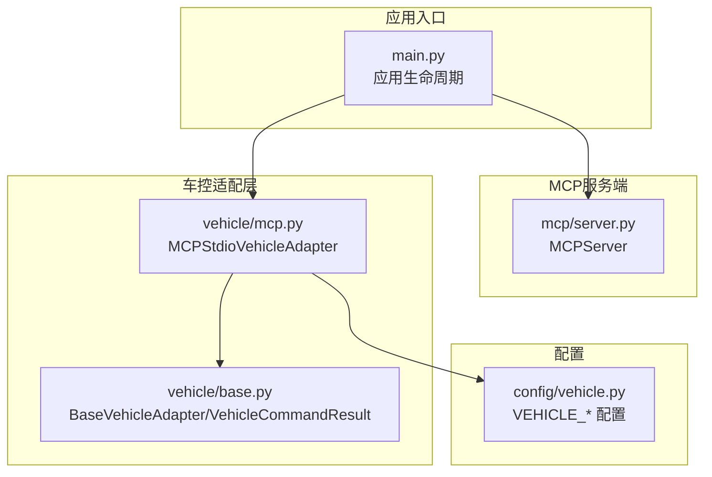
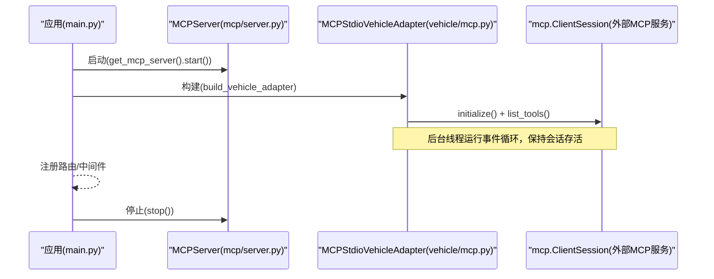
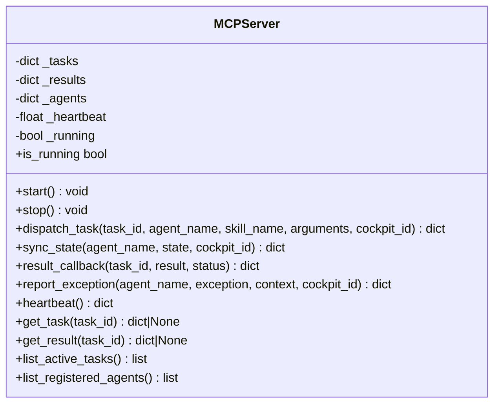
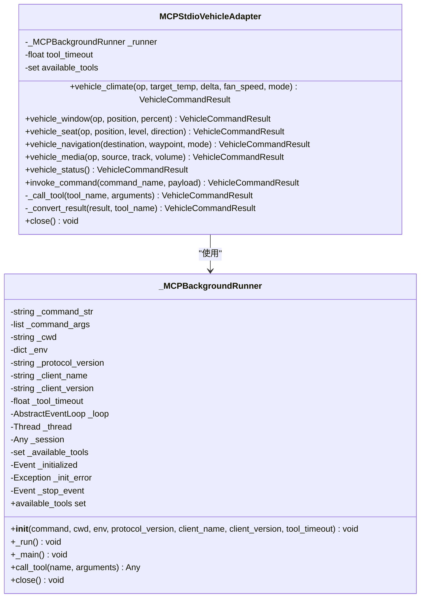
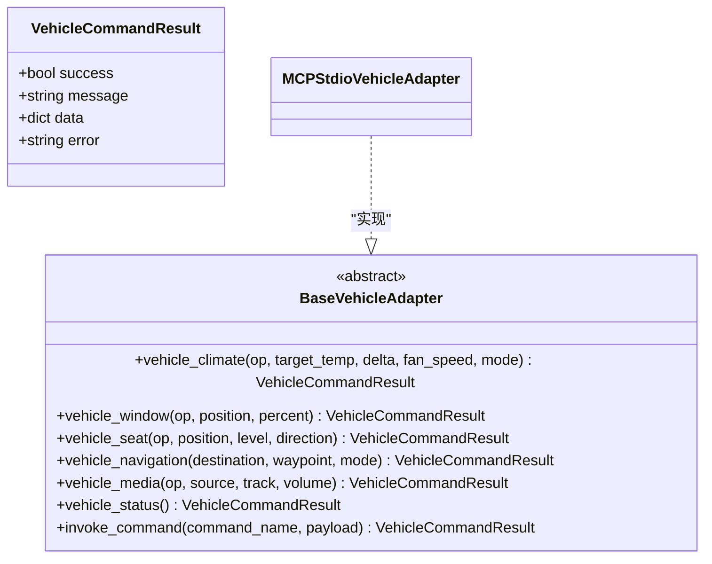
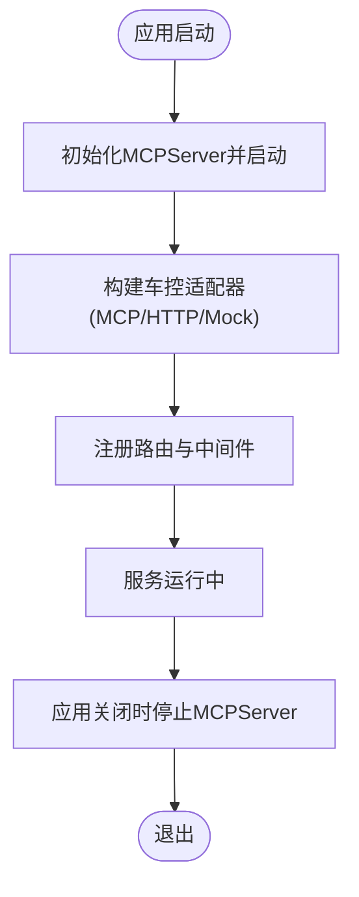
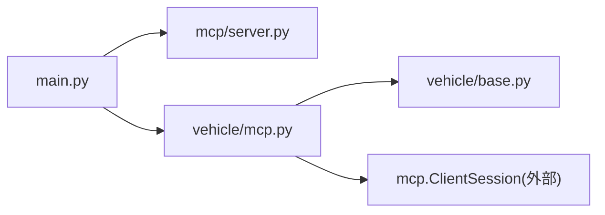
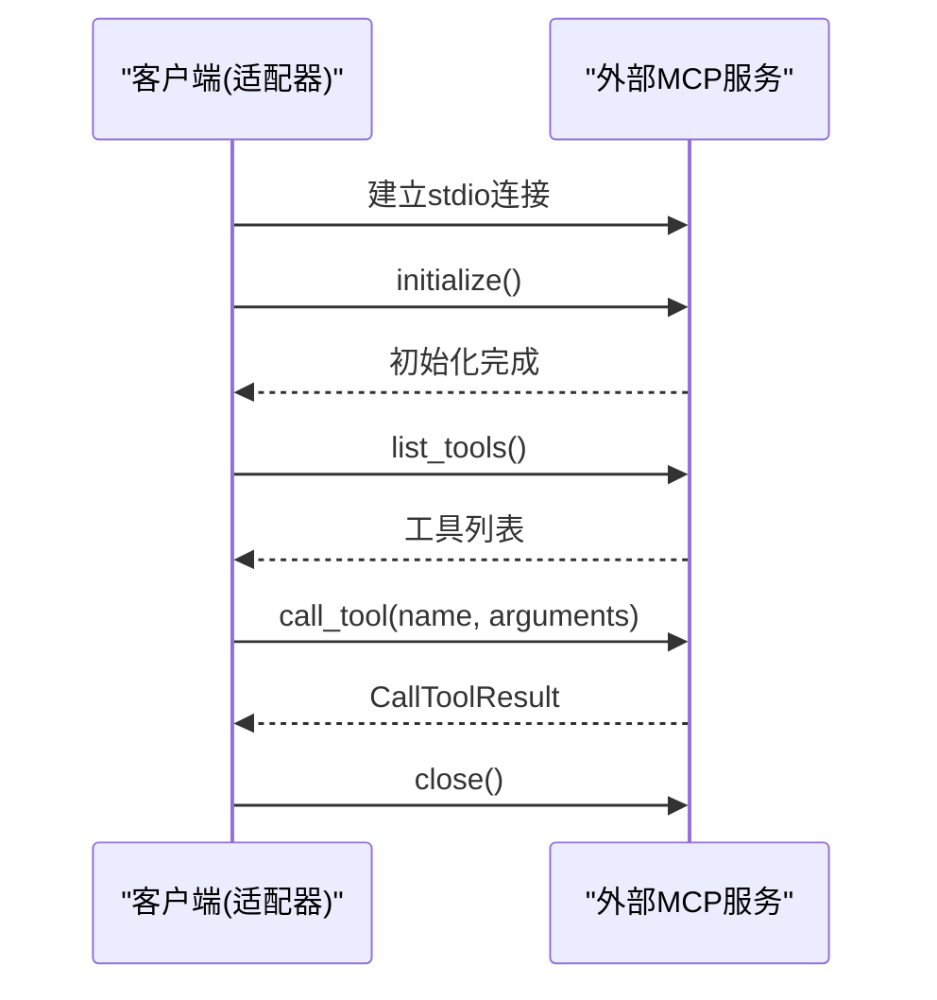

# MCP适配器实现

<cite>
**本文引用的文件**
- [backend_design/nexus/mcp/server.py](file://backend_design/nexus/mcp/server.py)
- [backend_design/nexus/vehicle/mcp.py](file://backend_design/nexus/vehicle/mcp.py)
- [backend_design/nexus/vehicle/base.py](file://backend_design/nexus/vehicle/base.py)
- [backend_design/nexus/main.py](file://backend_design/nexus/main.py)
- [backend_design/nexus/config/vehicle.py](file://backend_design/nexus/config/vehicle.py)
- [docs/交付版文档包/03-API接口协议文档.md](file://docs/交付版文档包/03-API接口协议文档.md)
</cite>

## 目录
1. [简介](#简介)
2. [项目结构](#项目结构)
3. [核心组件](#核心组件)
4. [架构总览](#架构总览)
5. [详细组件分析](#详细组件分析)
6. [依赖关系分析](#依赖关系分析)
7. [性能考虑](#性能考虑)
8. [故障排查指南](#故障排查指南)
9. [结论](#结论)
10. [附录](#附录)

## 简介
本文件面向MCP（Model Context Protocol）适配器的实现与集成，系统性阐述：
- 标准化通信机制：消息格式、会话管理、双向通信
- 握手流程、命令路由与结果回调
- 与标准MCP服务器的集成方法、协议版本兼容性与扩展点设计
- 配置选项、调试工具与性能优化建议
- 实际集成示例与常见问题解决方案

本项目包含两类MCP相关能力：
- MCP服务端（MCPServer）：提供任务分发、状态同步、结果回调、异常上报、心跳保活等标准化协同接口
- MCP车控适配器（MCPStdioVehicleAdapter）：通过mcp.ClientSession与外部MCP服务进行stdio通信，将异步SDK调用桥接为同步API供上层使用

## 项目结构
与MCP相关的代码主要分布在以下模块：
- MCP服务端：nexus/mcp/server.py
- 车控适配器（MCP stdio）：nexus/vehicle/mcp.py
- 车控抽象基类：nexus/vehicle/base.py
- 应用启动与生命周期：nexus/main.py
- 车控配置项（含MCP模式开关与参数）：nexus/config/vehicle.py
- API参考文档（用于理解整体HTTP/SSE/WebSocket上下文）：docs/交付版文档包/03-API接口协议文档.md

图表来源
- [backend_design/nexus/main.py:339-400](file://backend_design/nexus/main.py#L339-L400)
- [backend_design/nexus/mcp/server.py:36-255](file://backend_design/nexus/mcp/server.py#L36-L255)
- [backend_design/nexus/vehicle/mcp.py:167-285](file://backend_design/nexus/vehicle/mcp.py#L167-L285)
- [backend_design/nexus/vehicle/base.py:19-92](file://backend_design/nexus/vehicle/base.py#L19-L92)
- [backend_design/nexus/config/vehicle.py:21-46](file://backend_design/nexus/config/vehicle.py#L21-L46)

章节来源
- [backend_design/nexus/main.py:339-400](file://backend_design/nexus/main.py#L339-L400)
- [backend_design/nexus/mcp/server.py:36-255](file://backend_design/nexus/mcp/server.py#L36-L255)
- [backend_design/nexus/vehicle/mcp.py:167-285](file://backend_design/nexus/vehicle/mcp.py#L167-L285)
- [backend_design/nexus/vehicle/base.py:19-92](file://backend_design/nexus/vehicle/base.py#L19-L92)
- [backend_design/nexus/config/vehicle.py:21-46](file://backend_design/nexus/config/vehicle.py#L21-L46)

## 核心组件
- MCPServer：提供标准化的任务分发、状态同步、结果回调、异常上报、心跳保活等能力，作为FastAPI子路由或独立服务运行。
- MCPStdioVehicleAdapter：基于mcp.ClientSession与外部MCP服务通信，暴露统一的车辆控制接口（空调、车窗、座椅、导航、媒体、状态查询），并将MCP SDK的异步调用桥接为同步接口。
- BaseVehicleAdapter与VehicleCommandResult：定义统一的车控抽象接口与结果数据结构，屏蔽底层通信差异。

章节来源
- [backend_design/nexus/mcp/server.py:36-255](file://backend_design/nexus/mcp/server.py#L36-L255)
- [backend_design/nexus/vehicle/mcp.py:167-285](file://backend_design/nexus/vehicle/mcp.py#L167-L285)
- [backend_design/nexus/vehicle/base.py:19-92](file://backend_design/nexus/vehicle/base.py#L19-L92)

## 架构总览
下图展示MCP服务端与车控适配器在应用中的协作关系，以及与应用生命周期的集成方式。

图表来源
- [backend_design/nexus/main.py:339-400](file://backend_design/nexus/main.py#L339-L400)
- [backend_design/nexus/mcp/server.py:56-71](file://backend_design/nexus/mcp/server.py#L56-L71)
- [backend_design/nexus/vehicle/mcp.py:96-136](file://backend_design/nexus/vehicle/mcp.py#L96-L136)

## 详细组件分析

### MCPServer（MCP服务端）
职责与能力：
- 任务分发：接收task_id、agent_name、skill_name、arguments、cockpit_id，记录任务并返回分发状态
- 状态同步：按cockpit_id与agent_name聚合Agent状态，支持多Agent间状态共享
- 结果回调：异步任务完成后回调，更新任务状态与结果存储
- 异常上报：记录异常信息到日志，便于监控与排障
- 心跳保活：返回服务运行状态、活跃任务数、活跃Agent数等指标

关键方法与数据：
- start/stop/is_running：生命周期管理
- dispatch_task/sync_state/result_callback/report_exception/heartbeat：核心业务方法
- get_task/get_result/list_active_tasks/list_registered_agents：查询接口

图表来源
- [backend_design/nexus/mcp/server.py:36-255](file://backend_design/nexus/mcp/server.py#L36-L255)

章节来源
- [backend_design/nexus/mcp/server.py:36-255](file://backend_design/nexus/mcp/server.py#L36-L255)

### MCPStdioVehicleAdapter（MCP车控适配器）
职责与能力：
- 通过mcp.ClientSession与外部MCP服务建立stdio连接
- 在后台daemon线程中运行独立的asyncio事件循环，避免阻塞主进程
- 初始化会话后列出可用工具，校验工具可用性
- 将MCP SDK的异步call_tool封装为同步调用，向上层暴露统一接口
- 将MCP SDK的CallToolResult转换为VehicleCommandResult，屏蔽差异

关键方法与数据：
- _MCPBackgroundRunner：后台事件循环与会话管理
- vehicle_climate/vehicle_window/vehicle_seat/vehicle_navigation/vehicle_media/vehicle_status/invoke_command：统一车控接口
- _call_tool/_convert_result：工具调用与结果转换

图表来源
- [backend_design/nexus/vehicle/mcp.py:25-165](file://backend_design/nexus/vehicle/mcp.py#L25-L165)
- [backend_design/nexus/vehicle/mcp.py:167-285](file://backend_design/nexus/vehicle/mcp.py#L167-L285)

章节来源
- [backend_design/nexus/vehicle/mcp.py:25-165](file://backend_design/nexus/vehicle/mcp.py#L25-L165)
- [backend_design/nexus/vehicle/mcp.py:167-285](file://backend_design/nexus/vehicle/mcp.py#L167-L285)

### BaseVehicleAdapter与VehicleCommandResult（车控抽象）
- BaseVehicleAdapter：定义统一车控接口，所有适配器必须实现空调、车窗、座椅、导航、媒体、状态查询与通用命令调用
- VehicleCommandResult：统一的结果数据结构，包含success、message、data、error字段

图表来源
- [backend_design/nexus/vehicle/base.py:19-92](file://backend_design/nexus/vehicle/base.py#L19-L92)
- [backend_design/nexus/vehicle/mcp.py:167-285](file://backend_design/nexus/vehicle/mcp.py#L167-L285)

章节来源
- [backend_design/nexus/vehicle/base.py:19-92](file://backend_design/nexus/vehicle/base.py#L19-L92)

### 应用生命周期集成（main.py）
- 启动阶段：创建并启动MCPServer单例，将其挂载到app.state；构建车控适配器（支持mock/http/mcp）
- 关闭阶段：停止MCPServer，释放资源

图表来源
- [backend_design/nexus/main.py:339-400](file://backend_design/nexus/main.py#L339-L400)

章节来源
- [backend_design/nexus/main.py:339-400](file://backend_design/nexus/main.py#L339-L400)

## 依赖关系分析
- MCPServer无外部库依赖，仅使用内置时间与日志模块
- MCPStdioVehicleAdapter依赖mcp.ClientSession与mcp.StdioServerParameters，通过stdio与外部MCP服务通信
- BaseVehicleAdapter为抽象基类，被MCPStdioVehicleAdapter实现
- main.py负责组装MCPServer与车控适配器，并在生命周期中管理其启动与停止

图表来源
- [backend_design/nexus/main.py:339-400](file://backend_design/nexus/main.py#L339-L400)
- [backend_design/nexus/mcp/server.py:36-255](file://backend_design/nexus/mcp/server.py#L36-L255)
- [backend_design/nexus/vehicle/mcp.py:167-285](file://backend_design/nexus/vehicle/mcp.py#L167-L285)
- [backend_design/nexus/vehicle/base.py:19-92](file://backend_design/nexus/vehicle/base.py#L19-L92)

章节来源
- [backend_design/nexus/main.py:339-400](file://backend_design/nexus/main.py#L339-L400)
- [backend_design/nexus/mcp/server.py:36-255](file://backend_design/nexus/mcp/server.py#L36-L255)
- [backend_design/nexus/vehicle/mcp.py:167-285](file://backend_design/nexus/vehicle/mcp.py#L167-L285)
- [backend_design/nexus/vehicle/base.py:19-92](file://backend_design/nexus/vehicle/base.py#L19-L92)

## 性能考虑
- 后台事件循环隔离：MCP SDK的异步调用在独立线程的事件循环中执行，避免阻塞主进程请求处理
- 工具超时控制：通过tool_timeout限制单次工具调用耗时，防止长时间阻塞
- 会话复用：_MCPBackgroundRunner维护一个长期存活的ClientSession，减少重复握手开销
- 任务与状态内存存储：MCPServer使用内存字典存储任务与状态，适合单机部署；生产环境可替换为持久化存储以提升可靠性
- 心跳与健康检查：通过heartbeat接口快速评估服务负载与活跃度

[本节为通用性能建议，不直接分析具体文件]

## 故障排查指南
- MCP SDK初始化超时：若初始化等待超过阈值（默认30s），将抛出TimeoutError；检查外部MCP服务是否可正常启动与响应
- 工具不可用：若validate_tools为True且工具未暴露，调用将返回失败并提示tool_not_exposed；确认外部MCP服务暴露的工具名称与参数
- 调用失败：捕获mcp_call_failed错误，检查stdio通道、命令参数与环境变量是否正确
- 结果解析异常：_convert_result对结构化内容与文本内容进行兼容处理，若仍失败，检查外部MCP服务的返回格式是否符合预期
- 服务健康：通过MCPServer.heartbeat接口查看running状态、活跃任务数与活跃Agent数，辅助定位问题

章节来源
- [backend_design/nexus/vehicle/mcp.py:77-81](file://backend_design/nexus/vehicle/mcp.py#L77-L81)
- [backend_design/nexus/vehicle/mcp.py:225-237](file://backend_design/nexus/vehicle/mcp.py#L225-L237)
- [backend_design/nexus/vehicle/mcp.py:239-280](file://backend_design/nexus/vehicle/mcp.py#L239-L280)
- [backend_design/nexus/mcp/server.py:209-223](file://backend_design/nexus/mcp/server.py#L209-L223)

## 结论
本项目实现了MCP协议的两种关键能力：
- MCPServer提供标准化的任务分发、状态同步、结果回调、异常上报与心跳保活接口，便于跨进程/跨服务协同
- MCPStdioVehicleAdapter通过stdio与外部MCP服务通信，将异步SDK调用桥接为同步接口，统一了车控控制的抽象层

通过合理的生命周期管理与配置项，系统具备良好的可扩展性与可观测性。生产环境中建议结合持久化存储与更严格的超时策略，进一步提升稳定性与性能。

[本节为总结性内容，不直接分析具体文件]

## 附录

### MCP协议握手与通信流程（概念图）

[此图为概念性流程图，不映射具体源码文件]

### 配置选项说明（MCP相关）
- VEHICLE_MCP_COMMAND：MCP模式的启动命令（如python vehicle_mcp_server.py）
- VEHICLE_MCP_ARGS：MCP启动参数（字符串形式）
- VEHICLE_MCP_WORKDIR：MCP工作目录
- VEHICLE_MCP_VALIDATE_TOOLS：是否验证MCP工具列表（默认True）

章节来源
- [backend_design/nexus/config/vehicle.py:21-46](file://backend_design/nexus/config/vehicle.py#L21-L46)

### API参考（HTTP/SSE/WebSocket）
- 基础URL、认证方式、Content-Type、交互式文档地址等详见API接口协议文档
- 该文档有助于理解整体HTTP/SSE/WebSocket上下文，便于与MCP服务端进行集成测试

章节来源
- [docs/交付版文档包/03-API接口协议文档.md:1-196](file://docs/交付版文档包/03-API接口协议文档.md#L1-L196)