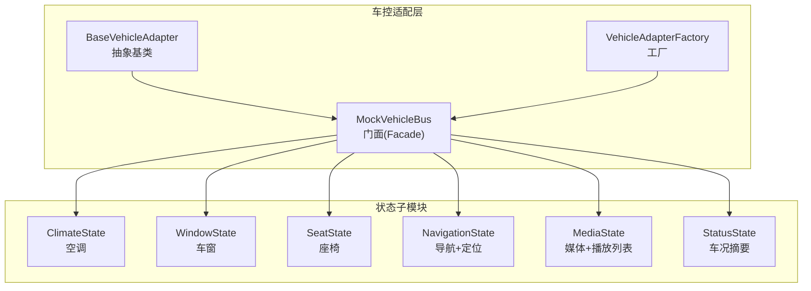
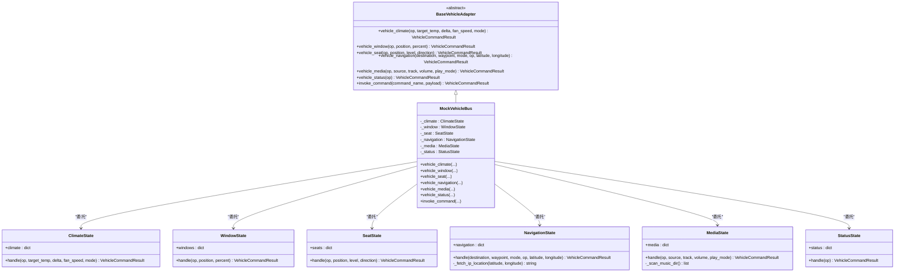
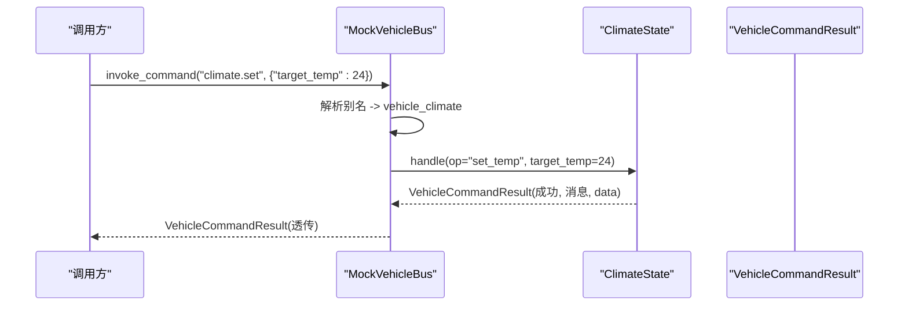
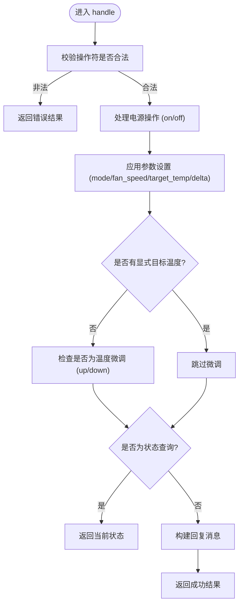
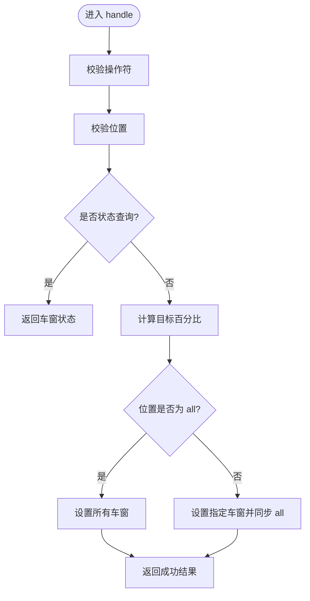
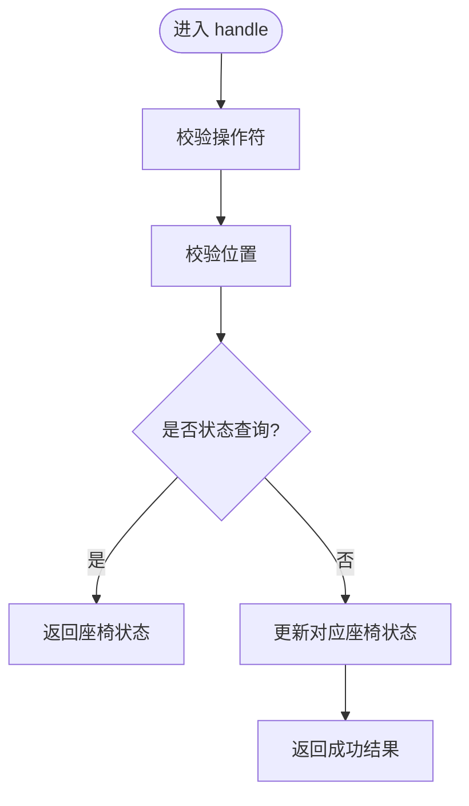
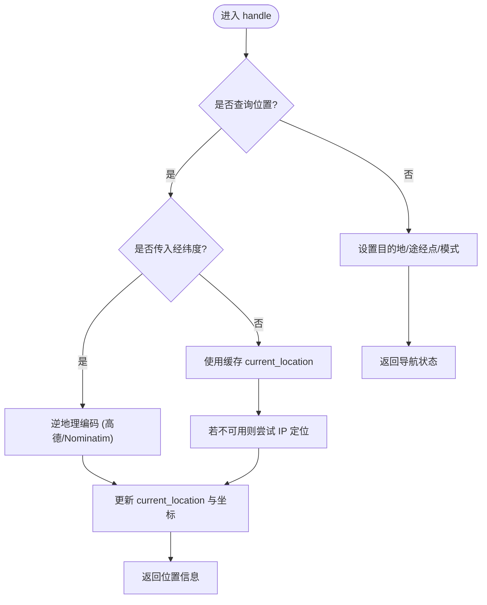
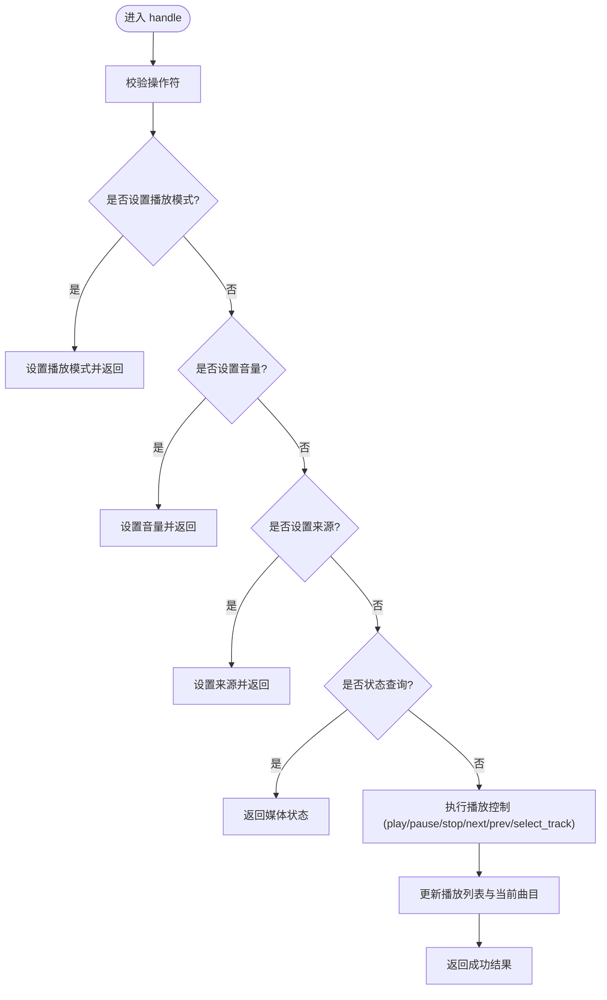
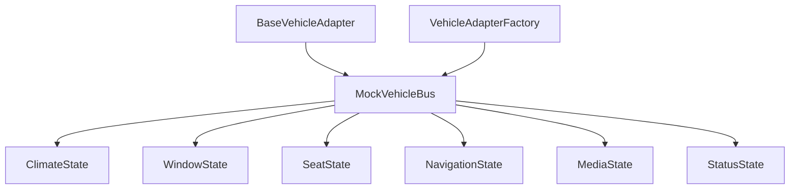

# Mock适配器实现

<cite>
**本文引用的文件**
- [backend_design/nexus/vehicle/mock/__init__.py](file://backend_design/nexus/vehicle/mock/__init__.py)
- [backend_design/nexus/vehicle/base.py](file://backend_design/nexus/vehicle/base.py)
- [backend_design/nexus/vehicle/factory.py](file://backend_design/nexus/vehicle/factory.py)
- [backend_design/nexus/vehicle/mock/climate_state.py](file://backend_design/nexus/vehicle/mock/climate_state.py)
- [backend_design/nexus/vehicle/mock/window_state.py](file://backend_design/nexus/vehicle/mock/window_state.py)
- [backend_design/nexus/vehicle/mock/seat_state.py](file://backend_design/nexus/vehicle/mock/seat_state.py)
- [backend_design/nexus/vehicle/mock/navigation_state.py](file://backend_design/nexus/vehicle/mock/navigation_state.py)
- [backend_design/nexus/vehicle/mock/media_state.py](file://backend_design/nexus/vehicle/mock/media_state.py)
- [backend_design/nexus/vehicle/mock/status_state.py](file://backend_design/nexus/vehicle/mock/status_state.py)
- [backend_design/nexus/config/vehicle.py](file://backend_design/nexus/config/vehicle.py)
- [backend_design/tests/test_core.py](file://backend_design/tests/test_core.py)
</cite>

## 目录
1. [简介](#简介)
2. [项目结构](#项目结构)
3. [核心组件](#核心组件)
4. [架构总览](#架构总览)
5. [详细组件分析](#详细组件分析)
6. [依赖关系分析](#依赖关系分析)
7. [性能考量](#性能考量)
8. [故障排查指南](#故障排查指南)
9. [结论](#结论)
10. [附录](#附录)

## 简介
本文件为“Mock适配器实现”的完整技术文档，聚焦于模拟车控总线（MockVehicleBus）及其各子系统状态管理（空调、媒体、导航、座椅、状态、车窗）。内容涵盖：
- 设计理念与架构模式（门面模式、适配器模式、工厂模式）
- 模拟数据生成逻辑与状态同步机制
- 事件驱动式命令处理流程
- 调试模式使用、测试场景构建与基准测试建议
- 配置选项说明、自定义模拟数据方法与集成测试最佳实践

## 项目结构
Mock适配器采用按职责拆分的模块化设计，将原单文件实现拆分为多个状态子模块，并通过门面类统一对外暴露接口。

**图表来源**
- [backend_design/nexus/vehicle/base.py](file://backend_design/nexus/vehicle/base.py)
- [backend_design/nexus/vehicle/factory.py](file://backend_design/nexus/vehicle/factory.py)
- [backend_design/nexus/vehicle/mock/__init__.py](file://backend_design/nexus/vehicle/mock/__init__.py)

**章节来源**
- [backend_design/nexus/vehicle/mock/__init__.py:1-220](file://backend_design/nexus/vehicle/mock/__init__.py#L1-L220)
- [backend_design/nexus/vehicle/base.py:1-92](file://backend_design/nexus/vehicle/base.py#L1-L92)
- [backend_design/nexus/vehicle/factory.py:1-147](file://backend_design/nexus/vehicle/factory.py#L1-L147)

## 核心组件
- 抽象基类 BaseVehicleAdapter：定义统一的车辆控制接口（空调、车窗、座椅、导航、媒体、状态查询、通用命令调用），确保多态与可替换性。
- 工厂 VehicleAdapterFactory：根据配置选择具体适配器（mock/http/mcp），并提供每座舱隔离的实例获取方法。
- 门面 MockVehicleBus：对外保持与抽象基类一致的接口，内部委托到各状态子模块；提供命令别名映射与统一入口 invoke_command。
- 状态子模块：各自维护独立的状态字典与 handle() 方法，负责参数校验、状态更新与结果封装。

**章节来源**
- [backend_design/nexus/vehicle/base.py:19-92](file://backend_design/nexus/vehicle/base.py#L19-L92)
- [backend_design/nexus/vehicle/factory.py:38-84](file://backend_design/nexus/vehicle/factory.py#L38-L84)
- [backend_design/nexus/vehicle/mock/__init__.py:39-220](file://backend_design/nexus/vehicle/mock/__init__.py#L39-L220)

## 架构总览
Mock适配器通过“适配器+门面+工厂”的组合模式，屏蔽底层差异并简化上层调用。

**图表来源**
- [backend_design/nexus/vehicle/base.py:19-92](file://backend_design/nexus/vehicle/base.py#L19-L92)
- [backend_design/nexus/vehicle/mock/__init__.py:39-220](file://backend_design/nexus/vehicle/mock/__init__.py#L39-L220)
- [backend_design/nexus/vehicle/mock/climate_state.py:22-143](file://backend_design/nexus/vehicle/mock/climate_state.py#L22-L143)
- [backend_design/nexus/vehicle/mock/window_state.py:12-89](file://backend_design/nexus/vehicle/mock/window_state.py#L12-L89)
- [backend_design/nexus/vehicle/mock/seat_state.py:14-91](file://backend_design/nexus/vehicle/mock/seat_state.py#L14-L91)
- [backend_design/nexus/vehicle/mock/navigation_state.py:17-216](file://backend_design/nexus/vehicle/mock/navigation_state.py#L17-L216)
- [backend_design/nexus/vehicle/mock/media_state.py:25-226](file://backend_design/nexus/vehicle/mock/media_state.py#L25-L226)
- [backend_design/nexus/vehicle/mock/status_state.py:14-38](file://backend_design/nexus/vehicle/mock/status_state.py#L14-L38)

## 详细组件分析

### 门面与命令路由（MockVehicleBus）
- 对外接口与 BaseVehicleAdapter 保持一致，内部通过属性访问各子模块状态字典，保证与原 mock.py 兼容。
- COMMAND_ALIASES 支持多种命令别名映射到统一处理方法，提升易用性与兼容性。
- invoke_command 统一入口，自动清理 None 值并容错处理参数不匹配的情况。

**图表来源**
- [backend_design/nexus/vehicle/mock/__init__.py:194-220](file://backend_design/nexus/vehicle/mock/__init__.py#L194-L220)
- [backend_design/nexus/vehicle/mock/climate_state.py:41-143](file://backend_design/nexus/vehicle/mock/climate_state.py#L41-L143)

**章节来源**
- [backend_design/nexus/vehicle/mock/__init__.py:39-220](file://backend_design/nexus/vehicle/mock/__init__.py#L39-L220)

### 空调状态（ClimateState）
- 合法操作符集合包含开关、温度调节、风量设置、模式切换与状态查询。
- 执行顺序：电源操作 → 参数设置 → 温度微调 → 状态查询，确保复合指令（如“打开空调温度22度风速1”）能同时生效。
- 返回结构化数据与人类可读消息，便于前端展示与日志记录。

**图表来源**
- [backend_design/nexus/vehicle/mock/climate_state.py:41-143](file://backend_design/nexus/vehicle/mock/climate_state.py#L41-L143)

**章节来源**
- [backend_design/nexus/vehicle/mock/climate_state.py:22-143](file://backend_design/nexus/vehicle/mock/climate_state.py#L22-L143)

### 车窗状态（WindowState）
- 支持 open/close/set_position 等操作，位置包括 all/front_left/front_right/rear_left/rear_right/sunroof。
- 当对单个车窗设置时，all 字段会同步为所有车窗的最大值，保持整体一致性。

**图表来源**
- [backend_design/nexus/vehicle/mock/window_state.py:38-89](file://backend_design/nexus/vehicle/mock/window_state.py#L38-L89)

**章节来源**
- [backend_design/nexus/vehicle/mock/window_state.py:12-89](file://backend_design/nexus/vehicle/mock/window_state.py#L12-L89)

### 座椅状态（SeatState）
- 支持加热、制冷、按摩、前后调节等操作，位置包括 driver/passenger/rear_left/rear_right。
- 操作符与位置均进行合法性校验，非法位置回退到 driver。

**图表来源**
- [backend_design/nexus/vehicle/mock/seat_state.py:39-91](file://backend_design/nexus/vehicle/mock/seat_state.py#L39-L91)

**章节来源**
- [backend_design/nexus/vehicle/mock/seat_state.py:14-91](file://backend_design/nexus/vehicle/mock/seat_state.py#L14-L91)

### 导航状态（NavigationState）
- 支持设置目的地、途经点、驾驶模式与查询当前位置。
- 定位优先级：浏览器 GPS 坐标逆地理编码（高德优先，Nominatim备选）→ IP 定位（高德优先，ip-api.com备选）→ 降级返回坐标字符串。
- 客户端 IP 用于避免服务器位置偏差导致的定位错误。

**图表来源**
- [backend_design/nexus/vehicle/mock/navigation_state.py:33-216](file://backend_design/nexus/vehicle/mock/navigation_state.py#L33-L216)

**章节来源**
- [backend_design/nexus/vehicle/mock/navigation_state.py:17-216](file://backend_design/nexus/vehicle/mock/navigation_state.py#L17-L216)

### 媒体状态（MediaState）
- 启动时扫描 assets/audio/music/ 目录，构建播放列表（支持 .mp3/.wav）。
- 支持播放/暂停/停止/下一首/上一首/音量/来源/播放模式/选曲等操作。
- 播放模式支持顺序、单曲循环、随机播放。

**图表来源**
- [backend_design/nexus/vehicle/mock/media_state.py:91-226](file://backend_design/nexus/vehicle/mock/media_state.py#L91-L226)

**章节来源**
- [backend_design/nexus/vehicle/mock/media_state.py:25-226](file://backend_design/nexus/vehicle/mock/media_state.py#L25-L226)

### 车况状态（StatusState）
- 返回胎压、续航、油量、电量、保养状态等摘要信息。
- 简单直接，适合快速健康检查与仪表盘展示。

**章节来源**
- [backend_design/nexus/vehicle/mock/status_state.py:14-38](file://backend_design/nexus/vehicle/mock/status_state.py#L14-L38)

## 依赖关系分析
- BaseVehicleAdapter 定义了统一接口，MockVehicleBus 继承并实现。
- VehicleAdapterFactory 根据配置创建 MockVehicleBus 或 HTTP/MCP 适配器，并提供每座舱隔离的实例。
- 各状态子模块仅依赖 VehicleCommandResult 与日志工具，低耦合高内聚。

**图表来源**
- [backend_design/nexus/vehicle/base.py:19-92](file://backend_design/nexus/vehicle/base.py#L19-L92)
- [backend_design/nexus/vehicle/factory.py:38-84](file://backend_design/nexus/vehicle/factory.py#L38-L84)
- [backend_design/nexus/vehicle/mock/__init__.py:39-220](file://backend_design/nexus/vehicle/mock/__init__.py#L39-L220)

**章节来源**
- [backend_design/nexus/vehicle/base.py:19-92](file://backend_design/nexus/vehicle/base.py#L19-L92)
- [backend_design/nexus/vehicle/factory.py:38-84](file://backend_design/nexus/vehicle/factory.py#L38-L84)
- [backend_design/nexus/vehicle/mock/__init__.py:39-220](file://backend_design/nexus/vehicle/mock/__init__.py#L39-L220)

## 性能考量
- 状态更新均为内存操作，时间复杂度 O(1)，无外部 I/O 阻塞。
- 媒体播放列表在初始化时一次性扫描，后续操作无需重复 IO。
- 导航定位涉及网络请求，存在超时与失败重试风险，应合理设置超时与降级策略。
- 多座舱隔离通过工厂为每个座舱创建独立 MockVehicleBus 实例，避免状态污染。

[本节为通用指导，不直接分析具体文件]

## 故障排查指南
- 命令不支持：检查操作符是否在 _VALID_OPS 中，或 COMMAND_ALIASES 映射是否正确。
- 参数越界：温度范围 16-30，风量 1-7，音量 0-30，百分比 0-100，超出将被裁剪。
- 定位失败：确认 Amap API Key 配置与网络连通性，或启用浏览器 GPS 定位。
- 媒体播放列表为空：检查 assets/audio/music/ 目录是否存在 .mp3/.wav 文件。
- 未知命令：通过 invoke_command 返回 error="command_not_found"，检查命令名与别名映射。

**章节来源**
- [backend_design/nexus/vehicle/mock/climate_state.py:60-66](file://backend_design/nexus/vehicle/mock/climate_state.py#L60-L66)
- [backend_design/nexus/vehicle/mock/media_state.py:100-106](file://backend_design/nexus/vehicle/mock/media_state.py#L100-L106)
- [backend_design/nexus/vehicle/mock/navigation_state.py:177-215](file://backend_design/nexus/vehicle/mock/navigation_state.py#L177-L215)
- [backend_design/nexus/vehicle/mock/__init__.py:194-220](file://backend_design/nexus/vehicle/mock/__init__.py#L194-L220)

## 结论
Mock适配器通过清晰的模块化设计与门面模式，提供了稳定、易用的模拟车控环境。各子系统状态独立管理，命令处理流程清晰，支持丰富的操作与灵活的配置。结合工厂模式与多座舱隔离，能够满足开发、测试与演示的多重需求。

[本节为总结性内容，不直接分析具体文件]

## 附录

### 配置选项说明
- VEHICLE_ADAPTER：适配器类型（mock/http/mcp）
- VEHICLE_API_BASE_URL：HTTP 模式的车机 API 地址
- VEHICLE_API_PROTOCOL：HTTP 协议类型（rest）
- VEHICLE_API_ENDPOINT：HTTP 接口路径（/vehicle/tools/invoke）
- VEHICLE_API_TIMEOUT：HTTP 调用超时（秒）
- VEHICLE_API_TOKEN：HTTP 认证 Token
- VEHICLE_MCP_COMMAND：MCP 启动命令
- VEHICLE_MCP_ARGS：MCP 启动参数
- VEHICLE_MCP_WORKDIR：MCP 工作目录
- VEHICLE_MCP_VALIDATE_TOOLS：是否验证 MCP 工具列表

**章节来源**
- [backend_design/nexus/config/vehicle.py:15-50](file://backend_design/nexus/config/vehicle.py#L15-L50)

### 调试模式使用方法
- 使用 pytest 运行测试用例，覆盖空调、车窗、座椅、导航、媒体、状态查询与命令调用。
- 通过 MockVehicleBus 的属性直接访问状态字典，验证状态变更是否符合预期。
- 利用 invoke_command 进行统一命令测试，支持别名映射与错误处理。

**章节来源**
- [backend_design/tests/test_core.py:11-68](file://backend_design/tests/test_core.py#L11-L68)

### 测试场景构建建议
- 边界值测试：温度极值、风量极值、音量极值、百分比边界。
- 异常路径测试：非法操作符、非法位置、未知命令、网络超时。
- 组合指令测试：复合操作（如“打开空调温度22度风速1”）的原子性与一致性。
- 多座舱隔离测试：验证不同座舱间的状态独立性。

**章节来源**
- [backend_design/tests/test_core.py:18-68](file://backend_design/tests/test_core.py#L18-L68)

### 性能基准测试建议
- 单次命令响应时间：测量各子系统 handle() 方法的平均耗时。
- 并发压力测试：模拟多用户同时操作同一座舱或不同座舱。
- 资源占用监控：观察内存与 CPU 使用情况，特别是媒体播放列表扫描与网络请求。
- 降级性能评估：在网络不可用时，验证定位与媒体功能的降级表现。

[本节为通用指导，不直接分析具体文件]

### 自定义模拟数据最佳实践
- 扩展状态模型：在各状态子模块中添加新的状态字段与操作方法。
- 动态数据源：参考 MediaState 的播放列表扫描，实现其他子模块的动态数据加载。
- 配置化默认值：通过配置文件或环境变量注入初始状态，便于不同环境部署。
- 事件驱动扩展：在状态变更后触发事件回调，供其他模块订阅与响应。

[本节为通用指导，不直接分析具体文件]