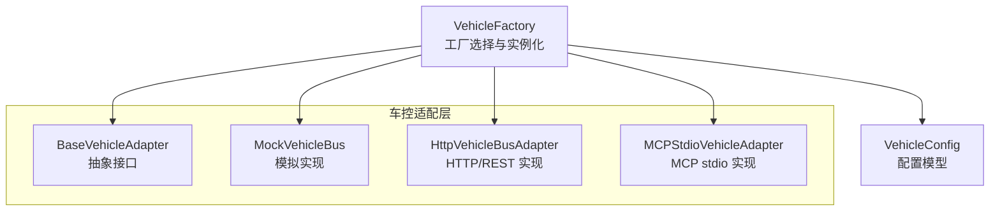
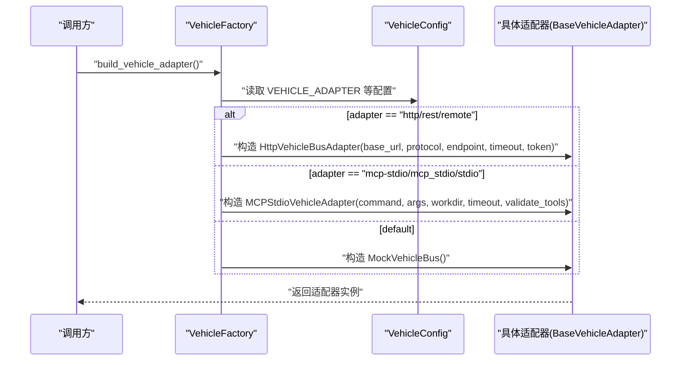
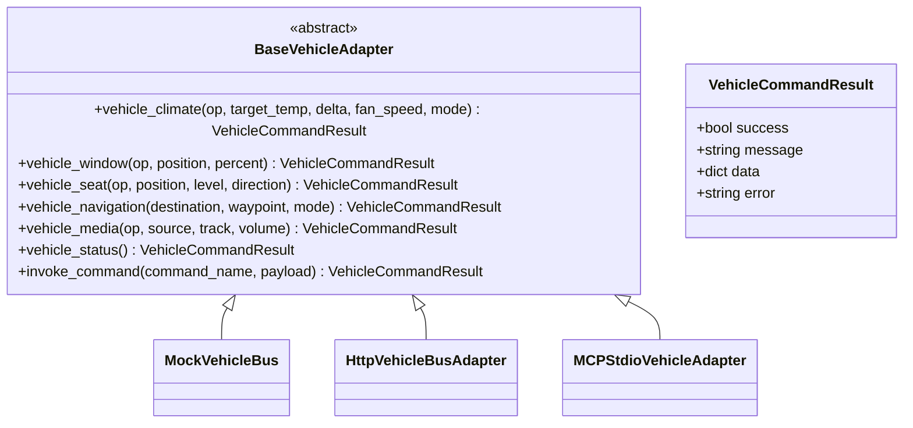
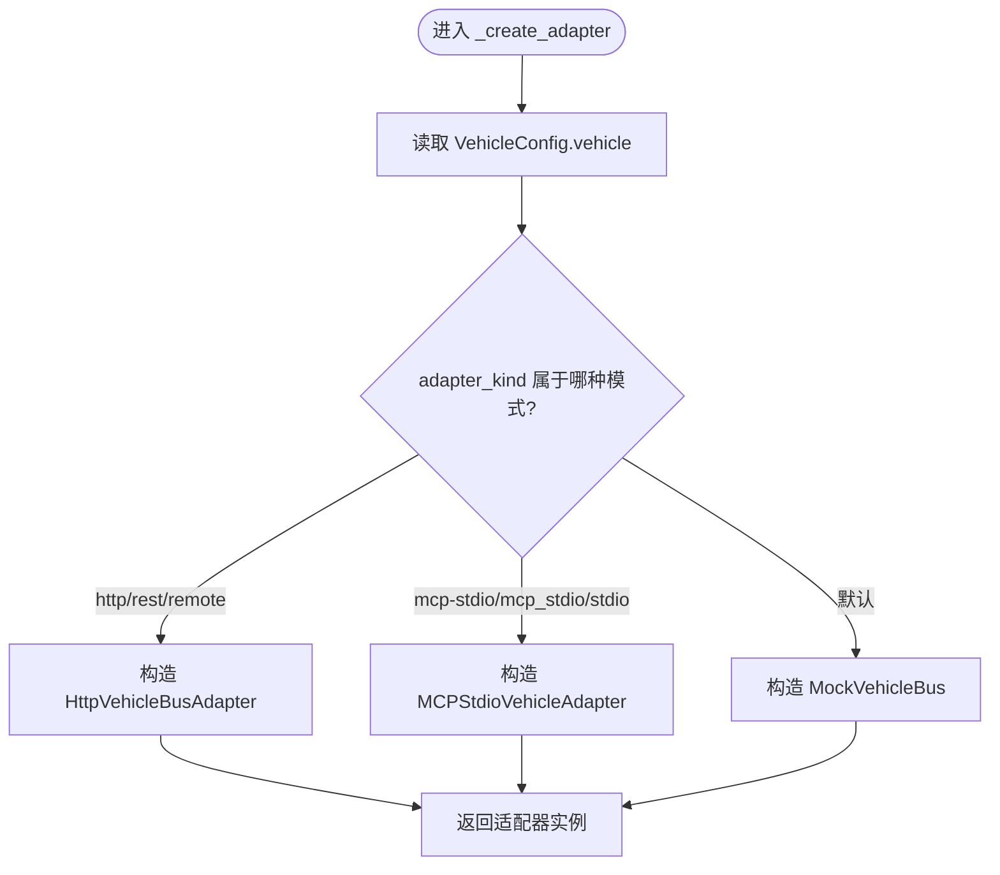
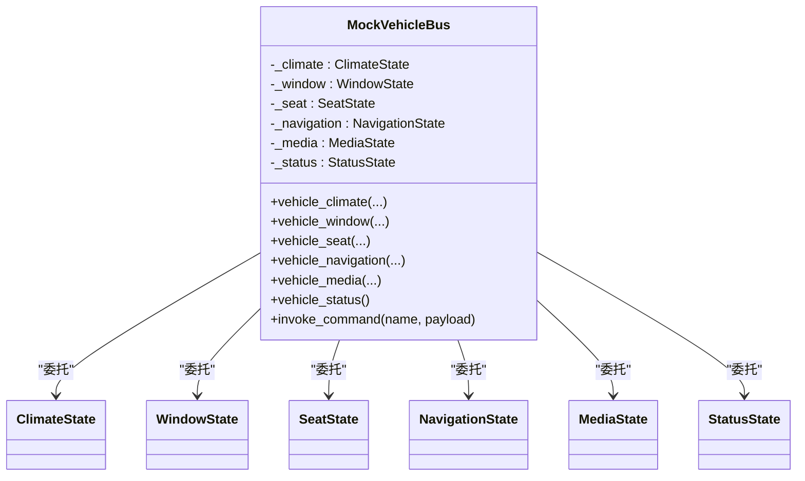
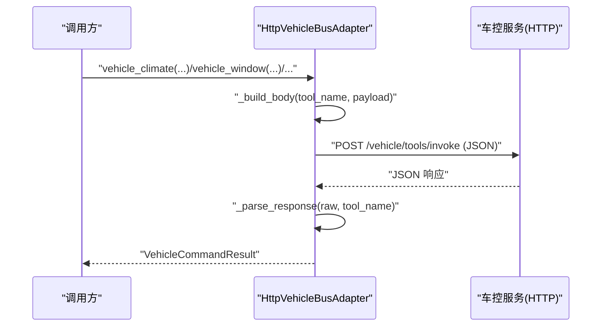
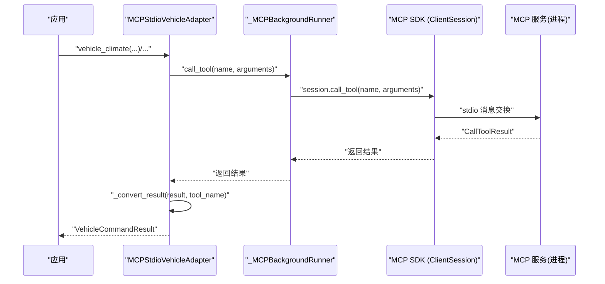
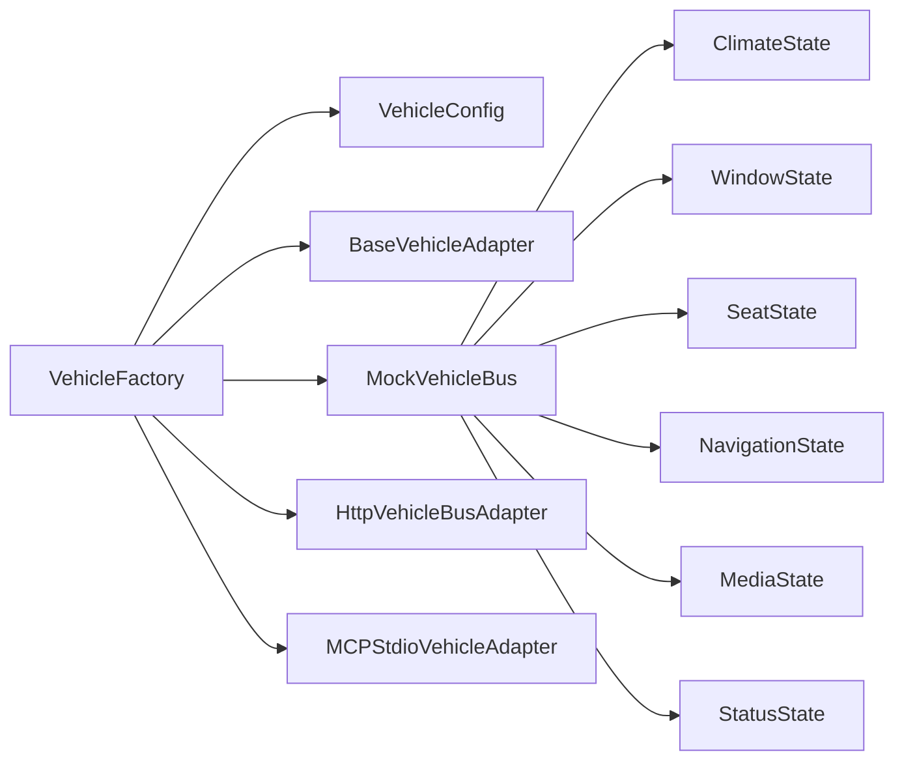

# 工厂模式实现

<cite>
**本文引用的文件**
- [factory.py](file://backend_design/nexus/vehicle/factory.py)
- [base.py](file://backend_design/nexus/vehicle/base.py)
- [http.py](file://backend_design/nexus/vehicle/http.py)
- [mcp.py](file://backend_design/nexus/vehicle/mcp.py)
- [__init__.py](file://backend_design/nexus/vehicle/mock/__init__.py)
- [climate_state.py](file://backend_design/nexus/vehicle/mock/climate_state.py)
- [vehicle.py](file://backend_design/nexus/config/vehicle.py)
- [config_init.py](file://backend_design/nexus/config/__init__.py)
</cite>

## 目录
1. [简介](#简介)
2. [项目结构](#项目结构)
3. [核心组件](#核心组件)
4. [架构总览](#架构总览)
5. [详细组件分析](#详细组件分析)
6. [依赖关系分析](#依赖关系分析)
7. [性能考量](#性能考量)
8. [故障排查指南](#故障排查指南)
9. [结论](#结论)
10. [附录](#附录)

## 简介
本文件围绕“车控适配器工厂类”的实现进行系统化文档化，重点说明：
- 工厂模式的实现原理与注册机制
- 配置驱动的选择逻辑（mock / http / mcp）
- 多座舱隔离与实例生命周期管理
- 错误处理策略与可观测性
- 新适配器类型的扩展方法、配置参数说明与使用示例

该设计通过统一的抽象接口 BaseVehicleAdapter，屏蔽底层通信差异（本地模拟、HTTP REST、MCP stdio），由工厂根据配置动态创建具体适配器实例，并在不同场景下提供单例或按座舱隔离的实例。

## 项目结构
车控子系统采用“抽象基类 + 多种适配器 + 工厂选择”的分层组织方式：
- 抽象基类定义统一接口
- 三种适配器分别实现 Mock、HTTP、MCP 三种后端
- 工厂模块依据配置决定实例化策略，并提供单例与多座舱隔离访问

图表来源
- [factory.py:1-147](file://backend_design/nexus/vehicle/factory.py#L1-L147)
- [base.py:1-92](file://backend_design/nexus/vehicle/base.py#L1-L92)
- [http.py:1-127](file://backend_design/nexus/vehicle/http.py#L1-L127)
- [mcp.py:1-285](file://backend_design/nexus/vehicle/mcp.py#L1-L285)
- [vehicle.py:1-50](file://backend_design/nexus/config/vehicle.py#L1-L50)

章节来源
- [factory.py:1-147](file://backend_design/nexus/vehicle/factory.py#L1-L147)
- [base.py:1-92](file://backend_design/nexus/vehicle/base.py#L1-L92)
- [http.py:1-127](file://backend_design/nexus/vehicle/http.py#L1-L127)
- [mcp.py:1-285](file://backend_design/nexus/vehicle/mcp.py#L1-L285)
- [vehicle.py:1-50](file://backend_design/nexus/config/vehicle.py#L1-L50)

## 核心组件
- 抽象接口 BaseVehicleAdapter：定义空调、车窗、座椅、导航、媒体、状态查询与通用命令调用等统一方法。
- MockVehicleBus：面向开发与测试的模拟实现，内部按职责拆分为多个状态子模块，支持命令别名映射与聚合状态返回。
- HttpVehicleBusAdapter：通过 HTTP/REST 或 JSON-RPC 协议与真实车控服务通信，封装请求构建、响应解析与异常处理。
- MCPStdioVehicleAdapter：基于 MCP SDK 的 stdio 通道与外部服务交互，内部通过后台线程运行异步事件循环，对外暴露同步接口。
- VehicleFactory：根据配置动态选择并创建适配器实例，提供全局单例与按座舱隔离的获取方法。

章节来源
- [base.py:1-92](file://backend_design/nexus/vehicle/base.py#L1-L92)
- [__init__.py:1-220](file://backend_design/nexus/vehicle/mock/__init__.py#L1-L220)
- [http.py:1-127](file://backend_design/nexus/vehicle/http.py#L1-L127)
- [mcp.py:1-285](file://backend_design/nexus/vehicle/mcp.py#L1-L285)
- [factory.py:1-147](file://backend_design/nexus/vehicle/factory.py#L1-L147)

## 架构总览
下图展示了从配置到适配器实例化的完整流程，以及各组件之间的依赖关系。

图表来源
- [factory.py:38-123](file://backend_design/nexus/vehicle/factory.py#L38-L123)
- [vehicle.py:15-49](file://backend_design/nexus/config/vehicle.py#L15-L49)

章节来源
- [factory.py:38-123](file://backend_design/nexus/vehicle/factory.py#L38-L123)
- [vehicle.py:15-49](file://backend_design/nexus/config/vehicle.py#L15-L49)

## 详细组件分析

### 抽象接口 BaseVehicleAdapter
- 作用：定义所有车控适配器的统一方法签名，确保上层业务无需关心具体实现。
- 关键方法：
  - vehicle_climate / vehicle_window / vehicle_seat / vehicle_navigation / vehicle_media / vehicle_status
  - invoke_command：通用命令入口，便于扩展新的工具或命令集
- 数据结构：VehicleCommandResult 标准化返回结果，包含 success、message、data、error 字段

图表来源
- [base.py:19-92](file://backend_design/nexus/vehicle/base.py#L19-L92)

章节来源
- [base.py:19-92](file://backend_design/nexus/vehicle/base.py#L19-L92)

### 工厂模块 VehicleFactory
- 功能：
  - build_vehicle_adapter：全局单例，首次创建后复用，避免重复初始化
  - get_cockpit_vehicle_adapter：按座舱 ID 获取适配器实例；Mock 模式下每座舱独立实例，HTTP/MCP 模式复用单例
  - _create_adapter：根据配置选择具体适配器类型并构造实例
  - _parse_command_line / _parse_args_list：安全解析 MCP 启动命令与参数（支持 JSON 数组或空格分隔）
- 配置驱动：
  - 读取 VehicleConfig.vehicle.adapter 决定模式
  - HTTP 模式需要 base_url、protocol、endpoint、timeout、token
  - MCP 模式需要 mcp_command、可选 mcp_args、mcp_workdir、mcp_validate_tools

图表来源
- [factory.py:86-123](file://backend_design/nexus/vehicle/factory.py#L86-L123)

章节来源
- [factory.py:38-123](file://backend_design/nexus/vehicle/factory.py#L38-L123)
- [factory.py:125-147](file://backend_design/nexus/vehicle/factory.py#L125-L147)

### MockVehicleBus（模拟实现）
- 特点：
  - 门面模式：对外保持与 BaseVehicleAdapter 一致的接口，内部委托给各状态子模块
  - 命令别名：COMMAND_ALIASES 将多种命令名映射到统一方法，提升兼容性
  - 多座舱隔离：每个座舱独立实例，状态互不影响
- 子模块：
  - climate_state：空调状态与操作（温度、风量、模式、开关）
  - window_state：车窗状态与开合控制
  - seat_state：座椅位置、加热、按摩等功能
  - navigation_state：导航与定位（含 IP 定位）
  - media_state：媒体播放控制与列表扫描
  - status_state：车况摘要

图表来源
- [__init__.py:39-220](file://backend_design/nexus/vehicle/mock/__init__.py#L39-L220)

章节来源
- [__init__.py:39-220](file://backend_design/nexus/vehicle/mock/__init__.py#L39-L220)
- [climate_state.py:22-143](file://backend_design/nexus/vehicle/mock/climate_state.py#L22-L143)

### HttpVehicleBusAdapter（HTTP/REST 实现）
- 功能：
  - 统一封装 tool_name 与 payload 为请求体，支持 rest 与 jsonrpc 两种协议
  - 自动附加 Authorization 头（Bearer Token）
  - 解析服务端响应，兼容多种返回格式（result/data/error 等）
  - 捕获 HTTPError、URLError 与通用异常，统一转换为 VehicleCommandResult
- 超时与认证：
  - timeout：单次调用超时时间
  - auth_token：可选的认证令牌

图表来源
- [http.py:23-127](file://backend_design/nexus/vehicle/http.py#L23-L127)

章节来源
- [http.py:23-127](file://backend_design/nexus/vehicle/http.py#L23-L127)

### MCPStdioVehicleAdapter（MCP stdio 实现）
- 功能：
  - 通过 MCP SDK 的 stdio_client 与外部服务建立会话
  - 在后台线程中运行 asyncio 事件循环，桥接同步调用与异步 SDK
  - 初始化时列出可用工具，支持可选的工具白名单校验
  - 将 CallToolResult 转换为 VehicleCommandResult，提取文本内容与结构化数据
- 生命周期：
  - 后台线程启动、会话初始化、工具列表获取
  - close() 关闭会话与线程，保证资源释放

图表来源
- [mcp.py:25-285](file://backend_design/nexus/vehicle/mcp.py#L25-L285)

章节来源
- [mcp.py:25-285](file://backend_design/nexus/vehicle/mcp.py#L25-L285)

### 配置模型 VehicleConfig
- 字段说明：
  - adapter：适配器类型（mock / http / mcp）
  - api_base_url / api_protocol / api_endpoint / api_timeout / api_token：HTTP 模式相关
  - mcp_command / mcp_args / mcp_workdir / mcp_validate_tools：MCP 模式相关
- 加载方式：
  - 通过 pydantic_settings 从 .env 文件与环境变量加载
  - AppConfig 聚合所有子系统配置，get_config() 提供全局单例

章节来源
- [vehicle.py:15-49](file://backend_design/nexus/config/vehicle.py#L15-L49)
- [config_init.py:84-151](file://backend_design/nexus/config/__init__.py#L84-L151)

## 依赖关系分析
- 工厂模块依赖配置中心与具体适配器实现
- 各适配器均依赖抽象基类以保持一致接口
- Mock 实现依赖多个状态子模块，形成内聚的职责划分
- HTTP 与 MCP 适配器分别依赖网络库与 MCP SDK

图表来源
- [factory.py:1-147](file://backend_design/nexus/vehicle/factory.py#L1-L147)
- [base.py:1-92](file://backend_design/nexus/vehicle/base.py#L1-L92)
- [__init__.py:1-220](file://backend_design/nexus/vehicle/mock/__init__.py#L1-L220)

章节来源
- [factory.py:1-147](file://backend_design/nexus/vehicle/factory.py#L1-L147)
- [base.py:1-92](file://backend_design/nexus/vehicle/base.py#L1-L92)
- [__init__.py:1-220](file://backend_design/nexus/vehicle/mock/__init__.py#L1-L220)

## 性能考量
- 单例与缓存：
  - build_vehicle_adapter 使用模块级单例，避免重复初始化
  - get_config 使用 lru_cache 保证全局配置只创建一次
- 多座舱隔离：
  - Mock 模式为每个座舱创建独立实例，避免状态污染
  - HTTP/MCP 模式无状态，复用单例减少资源占用
- 超时与重试：
  - HTTP 与 MCP 均支持超时配置，防止阻塞
  - 建议在调用层增加重试与熔断策略（当前未内置）
- I/O 与并发：
  - MCP 通过后台线程与异步事件循环解耦，避免主线程阻塞
  - HTTP 使用标准库 urllib，适合轻量调用；高并发场景建议替换为 aiohttp/httpx

[本节为通用指导，不直接分析具体文件]

## 故障排查指南
- 常见错误与定位：
  - 无法连接真实车控服务（HTTP）：检查 api_base_url、api_endpoint、网络连通性与防火墙设置
  - MCP 初始化超时：确认 mcp_command 正确、工作目录与权限、环境变量是否齐全
  - 工具未暴露（MCP）：检查 mcp_validate_tools 与服务端工具列表
  - 非 JSON 响应（HTTP）：确认服务端返回格式是否符合预期
- 日志与调试：
  - 工厂与适配器均记录关键步骤日志，便于定位问题
  - 可通过 VehicleCommandResult.error 字段快速识别失败原因
- 恢复策略：
  - 降级到 Mock 模式进行开发测试
  - 对 HTTP 调用增加超时与重试，必要时引入熔断器

章节来源
- [http.py:82-92](file://backend_design/nexus/vehicle/http.py#L82-L92)
- [mcp.py:77-81](file://backend_design/nexus/vehicle/mcp.py#L77-L81)
- [mcp.py:225-237](file://backend_design/nexus/vehicle/mcp.py#L225-L237)

## 结论
车控适配器工厂通过清晰的抽象接口与配置驱动机制，实现了 Mock、HTTP、MCP 三种后端的无缝切换与统一管理。其单例与多座舱隔离策略兼顾了性能与隔离性，错误处理与日志输出提升了可维护性与可观测性。未来可扩展更多适配器类型，并通过统一的 invoke_command 接口保持向后兼容。

[本节为总结性内容，不直接分析具体文件]

## 附录

### 配置参数说明
- 适配器类型
  - VEHICLE_ADAPTER：mock / http / mcp-stdio
- HTTP 模式
  - VEHICLE_API_BASE_URL：车控服务基础地址
  - VEHICLE_API_PROTOCOL：rest 或 jsonrpc
  - VEHICLE_API_ENDPOINT：API 路径（默认 /vehicle/tools/invoke）
  - VEHICLE_API_TIMEOUT：调用超时（秒）
  - VEHICLE_API_TOKEN：认证令牌（Bearer）
- MCP 模式
  - VEHICLE_MCP_COMMAND：启动命令（支持 JSON 数组或空格分隔）
  - VEHICLE_MCP_ARGS：额外参数（支持 JSON 数组或空格分隔）
  - VEHICLE_MCP_WORKDIR：工作目录
  - VEHICLE_MCP_VALIDATE_TOOLS：是否校验工具列表

章节来源
- [vehicle.py:24-49](file://backend_design/nexus/config/vehicle.py#L24-L49)

### 新适配器类型的注册与扩展指南
- 步骤：
  - 新建适配器类继承 BaseVehicleAdapter，实现所有抽象方法
  - 在 factory._create_adapter 中添加新的分支逻辑，根据配置选择新适配器
  - 如需新增配置项，在 VehicleConfig 中补充字段并绑定环境变量
- 注意事项：
  - 保持 VehicleCommandResult 语义一致
  - 合理处理超时、异常与日志
  - 对于有状态适配器，考虑多座舱隔离策略

章节来源
- [base.py:35-92](file://backend_design/nexus/vehicle/base.py#L35-L92)
- [factory.py:86-123](file://backend_design/nexus/vehicle/factory.py#L86-L123)
- [vehicle.py:15-49](file://backend_design/nexus/config/vehicle.py#L15-L49)

### 使用示例（概念性）
- 获取全局单例适配器：
  - 调用 build_vehicle_adapter()，根据 VEHICLE_ADAPTER 返回对应实现
- 获取指定座舱适配器：
  - 调用 get_cockpit_vehicle_adapter(cockpit_id)，Mock 模式返回独立实例，其他模式返回单例
- 调用车控命令：
  - 使用 vehicle_climate / vehicle_window / vehicle_seat / vehicle_navigation / vehicle_media / vehicle_status
  - 或通过 invoke_command 调用自定义工具

[本节为概念性说明，不直接分析具体文件]