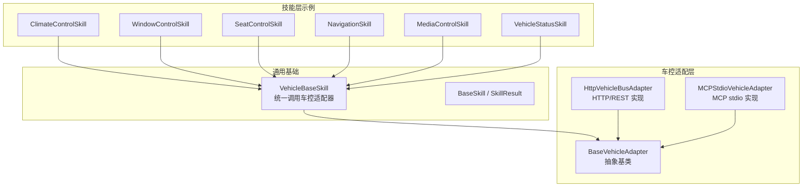
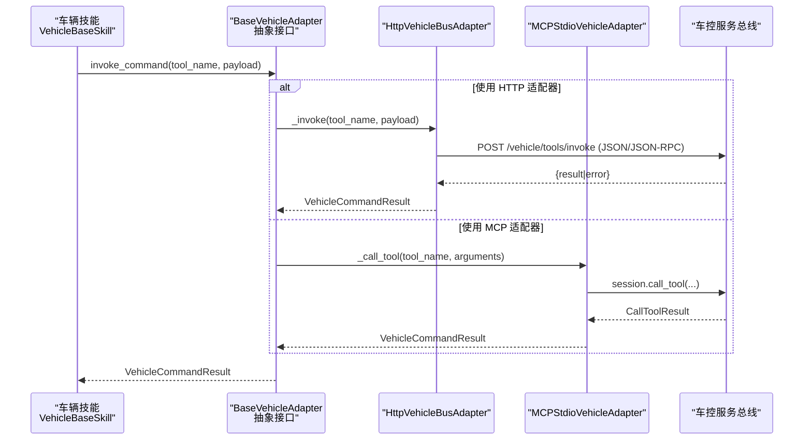
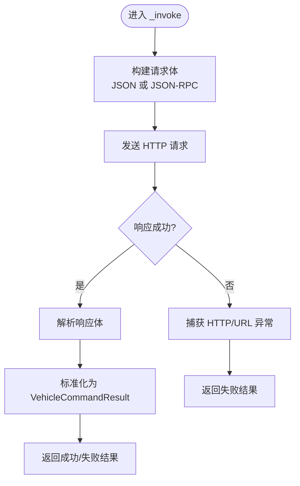
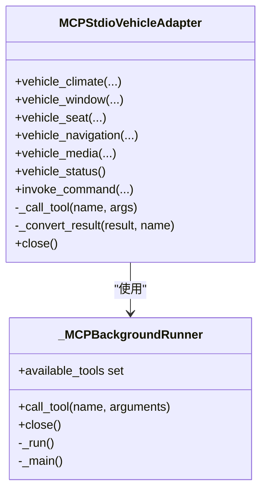
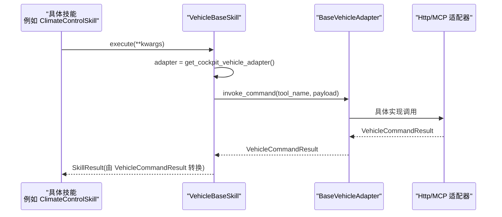
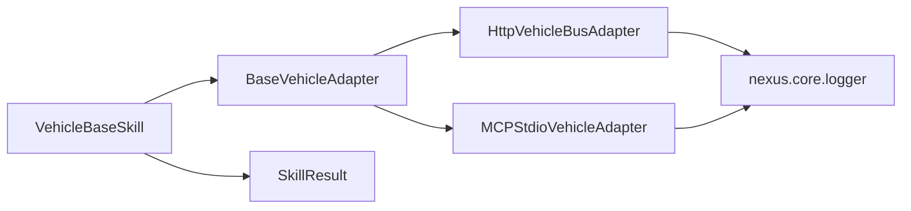

# 抽象基类设计

<cite>
**本文引用的文件**   
- [backend_design/nexus/vehicle/base.py](file://backend_design/nexus/vehicle/base.py)
- [backend_design/nexus/vehicle/http.py](file://backend_design/nexus/vehicle/http.py)
- [backend_design/nexus/vehicle/mcp.py](file://backend_design/nexus/vehicle/mcp.py)
- [backend_design/nexus/skills/vehicle/__init__.py](file://backend_design/nexus/skills/vehicle/__init__.py)
- [backend_design/nexus/skills/base.py](file://backend_design/nexus/skills/base.py)
- [backend_design/nexus/skills/vehicle/climate.py](file://backend_design/nexus/skills/vehicle/climate.py)
- [backend_design/nexus/skills/vehicle/window.py](file://backend_design/nexus/skills/vehicle/window.py)
- [backend_design/nexus/skills/vehicle/seat.py](file://backend_design/nexus/skills/vehicle/seat.py)
- [backend_design/nexus/skills/vehicle/navigation.py](file://backend_design/nexus/skills/vehicle/navigation.py)
- [backend_design/nexus/skills/vehicle/media.py](file://backend_design/nexus/skills/vehicle/media.py)
- [backend_design/nexus/skills/vehicle/status.py](file://backend_design/nexus/skills/vehicle/status.py)
</cite>

## 目录
1. [简介](#简介)
2. [项目结构](#项目结构)
3. [核心组件](#核心组件)
4. [架构总览](#架构总览)
5. [详细组件分析](#详细组件分析)
6. [依赖关系分析](#依赖关系分析)
7. [性能考量](#性能考量)
8. [故障排查指南](#故障排查指南)
9. [结论](#结论)
10. [附录：新适配器开发清单与最佳实践](#附录新适配器开发清单与最佳实践)

## 简介
本文件围绕车控适配层抽象基类 BaseVehicleAdapter 的设计与规范进行系统化说明，重点包括：
- VehicleCommandResult 数据模型的定义、字段语义与使用方式
- 所有抽象方法的职责、参数约定与返回值格式
- 空调控制、车窗控制、座椅控制、导航、媒体播放、状态查询等统一契约
- 通过 HTTP/MCP 两种典型实现，展示如何以同一接口对接不同车控通信协议
- 面向新适配器开发的实现清单与最佳实践建议

## 项目结构
车控适配层位于 backend_design/nexus/vehicle 目录，包含抽象基类与多种具体适配器；技能层位于 backend_design/nexus/skills/vehicle，将上层意图转化为对适配器的调用。

图表来源
- [backend_design/nexus/vehicle/base.py:35-92](file://backend_design/nexus/vehicle/base.py#L35-L92)
- [backend_design/nexus/vehicle/http.py:23-68](file://backend_design/nexus/vehicle/http.py#L23-L68)
- [backend_design/nexus/vehicle/mcp.py:167-224](file://backend_design/nexus/vehicle/mcp.py#L167-L224)
- [backend_design/nexus/skills/vehicle/__init__.py:21-55](file://backend_design/nexus/skills/vehicle/__init__.py#L21-L55)
- [backend_design/nexus/skills/base.py:92-114](file://backend_design/nexus/skills/base.py#L92-L114)

章节来源
- [backend_design/nexus/vehicle/base.py:1-92](file://backend_design/nexus/vehicle/base.py#L1-L92)
- [backend_design/nexus/vehicle/http.py:1-127](file://backend_design/nexus/vehicle/http.py#L1-L127)
- [backend_design/nexus/vehicle/mcp.py:1-285](file://backend_design/nexus/vehicle/mcp.py#L1-L285)
- [backend_design/nexus/skills/vehicle/__init__.py:1-55](file://backend_design/nexus/skills/vehicle/__init__.py#L1-L55)
- [backend_design/nexus/skills/base.py:1-264](file://backend_design/nexus/skills/base.py#L1-L264)

## 核心组件
- BaseVehicleAdapter：定义车控适配器的统一抽象接口，屏蔽底层通信差异（HTTP/MCP/其他）。
- VehicleCommandResult：统一的命令执行结果模型，承载成功标志、人类可读消息、结构化数据与错误信息。
- HttpVehicleBusAdapter：基于 HTTP/REST 的适配器，支持 JSON-RPC 或自定义 JSON 协议。
- MCPStdioVehicleAdapter：基于 MCP SDK 的适配器，通过后台事件循环桥接异步 SDK 到同步接口。
- VehicleBaseSkill：技能层统一入口，按座舱隔离获取适配器实例并调用 invoke_command。

章节来源
- [backend_design/nexus/vehicle/base.py:19-92](file://backend_design/nexus/vehicle/base.py#L19-L92)
- [backend_design/nexus/vehicle/http.py:23-68](file://backend_design/nexus/vehicle/http.py#L23-L68)
- [backend_design/nexus/vehicle/mcp.py:167-224](file://backend_design/nexus/vehicle/mcp.py#L167-L224)
- [backend_design/nexus/skills/vehicle/__init__.py:21-55](file://backend_design/nexus/skills/vehicle/__init__.py#L21-L55)

## 架构总览
下图展示了从“技能”到“适配器”的调用路径，以及两种典型适配器（HTTP/MCP）如何统一暴露相同的抽象方法。

图表来源
- [backend_design/nexus/skills/vehicle/__init__.py:44-55](file://backend_design/nexus/skills/vehicle/__init__.py#L44-L55)
- [backend_design/nexus/vehicle/http.py:69-127](file://backend_design/nexus/vehicle/http.py#L69-L127)
- [backend_design/nexus/vehicle/mcp.py:225-280](file://backend_design/nexus/vehicle/mcp.py#L225-L280)

## 详细组件分析

### VehicleCommandResult 数据模型
- success: 布尔值，表示命令是否执行成功
- message: 字符串，人类可读的结果描述
- data: 字典，结构化结果数据（如当前温度、位置、媒体信息等）
- error: 字符串，失败时的错误码或错误详情

该模型在 HTTP 和 MCP 适配器中均作为统一返回类型，确保上层无需关心底层协议差异。

章节来源
- [backend_design/nexus/vehicle/base.py:19-33](file://backend_design/nexus/vehicle/base.py#L19-L33)
- [backend_design/nexus/vehicle/http.py:99-127](file://backend_design/nexus/vehicle/http.py#L99-L127)
- [backend_design/nexus/vehicle/mcp.py:239-280](file://backend_design/nexus/vehicle/mcp.py#L239-L280)

### BaseVehicleAdapter 抽象接口
以下方法为必须实现的统一契约，所有子类需保证一致的参数命名、默认值与返回类型。

- vehicle_climate(op, target_temp, delta, fan_speed, mode) -> VehicleCommandResult
  - 用途：空调控制（设置温度、风量、模式、相对调节幅度等）
  - 参数：op 操作类型；target_temp 目标温度；delta 相对调节；fan_speed 风量档位；mode 模式
  - 返回：统一结果对象

- vehicle_window(op, position, percent) -> VehicleCommandResult
  - 用途：车窗/天窗控制（开合、升降、百分比位置）
  - 参数：op 操作类型；position 位置（all/front_left/sunroof 等）；percent 百分比

- vehicle_seat(op, position, level, direction) -> VehicleCommandResult
  - 用途：座椅控制（加热、通风、按摩、位置调整）
  - 参数：op 操作类型；position 座椅位置；level 档位；direction 方向

- vehicle_navigation(destination, waypoint, mode) -> VehicleCommandResult
  - 用途：导航（目的地、可选途经点、模式）

- vehicle_media(op, source, track, volume) -> VehicleCommandResult
  - 用途：媒体控制（播放、暂停、切歌、音量、来源切换）

- vehicle_status() -> VehicleCommandResult
  - 用途：车辆状态查询（胎压、续航、电量、油量、保养、位置等）

- invoke_command(command_name, payload) -> VehicleCommandResult
  - 用途：通用命令调用，供技能层直接透传工具名与参数

章节来源
- [backend_design/nexus/vehicle/base.py:35-92](file://backend_design/nexus/vehicle/base.py#L35-L92)

### HttpVehicleBusAdapter 实现要点
- 构造参数：base_url、protocol（rest/jsonrpc）、endpoint、timeout、auth_token
- 请求体构建：根据 protocol 选择 JSON 或 JSON-RPC 格式
- 响应解析：兼容 result/error/data 等多种返回结构，统一转换为 VehicleCommandResult
- 异常处理：HTTPError/URLError/通用异常分别映射为失败结果

图表来源
- [backend_design/nexus/vehicle/http.py:69-127](file://backend_design/nexus/vehicle/http.py#L69-L127)

章节来源
- [backend_design/nexus/vehicle/http.py:23-68](file://backend_design/nexus/vehicle/http.py#L23-L68)
- [backend_design/nexus/vehicle/http.py:69-127](file://backend_design/nexus/vehicle/http.py#L69-L127)

### MCPStdioVehicleAdapter 实现要点
- 后台事件循环：_MCPBackgroundRunner 在独立线程运行 MCP SDK 异步上下文
- 工具发现：初始化后列出可用工具集合，用于校验工具是否暴露
- 调用桥接：同步接口通过 run_coroutine_threadsafe 调用异步 session.call_tool
- 结果转换：将 MCP CallToolResult 转换为 VehicleCommandResult，提取文本与结构化内容

图表来源
- [backend_design/nexus/vehicle/mcp.py:167-224](file://backend_design/nexus/vehicle/mcp.py#L167-L224)
- [backend_design/nexus/vehicle/mcp.py:25-165](file://backend_design/nexus/vehicle/mcp.py#L25-L165)
- [backend_design/nexus/vehicle/mcp.py:225-285](file://backend_design/nexus/vehicle/mcp.py#L225-L285)

章节来源
- [backend_design/nexus/vehicle/mcp.py:167-224](file://backend_design/nexus/vehicle/mcp.py#L167-L224)
- [backend_design/nexus/vehicle/mcp.py:225-285](file://backend_design/nexus/vehicle/mcp.py#L225-L285)

### 技能层统一调用流程
- VehicleBaseSkill 负责按座舱隔离获取适配器实例，并通过 invoke_command 调用对应工具
- 各具体技能（空调/车窗/座椅/导航/媒体/状态）仅声明 tool_name 与参数元信息，execute 统一委托给 _invoke

图表来源
- [backend_design/nexus/skills/vehicle/__init__.py:21-55](file://backend_design/nexus/skills/vehicle/__init__.py#L21-L55)
- [backend_design/nexus/skills/base.py:92-114](file://backend_design/nexus/skills/base.py#L92-L114)

章节来源
- [backend_design/nexus/skills/vehicle/climate.py:15-37](file://backend_design/nexus/skills/vehicle/climate.py#L15-L37)
- [backend_design/nexus/skills/vehicle/window.py:15-34](file://backend_design/nexus/skills/vehicle/window.py#L15-L34)
- [backend_design/nexus/skills/vehicle/seat.py:15-35](file://backend_design/nexus/skills/vehicle/seat.py#L15-L35)
- [backend_design/nexus/skills/vehicle/navigation.py:15-39](file://backend_design/nexus/skills/vehicle/navigation.py#L15-L39)
- [backend_design/nexus/skills/vehicle/media.py:15-36](file://backend_design/nexus/skills/vehicle/media.py#L15-L36)
- [backend_design/nexus/skills/vehicle/status.py:15-33](file://backend_design/nexus/skills/vehicle/status.py#L15-L33)

## 依赖关系分析
- 抽象基类不依赖具体实现，保持高内聚低耦合
- HTTP/MCP 适配器均依赖日志模块与标准库网络/并发能力
- 技能层依赖 VehicleBaseSkill 与 BaseSkill/SkillResult，统一封装调用与结果

图表来源
- [backend_design/nexus/vehicle/base.py:35-92](file://backend_design/nexus/vehicle/base.py#L35-L92)
- [backend_design/nexus/vehicle/http.py:17-20](file://backend_design/nexus/vehicle/http.py#L17-L20)
- [backend_design/nexus/vehicle/mcp.py:19-22](file://backend_design/nexus/vehicle/mcp.py#L19-L22)
- [backend_design/nexus/skills/vehicle/__init__.py:17-18](file://backend_design/nexus/skills/vehicle/__init__.py#L17-L18)
- [backend_design/nexus/skills/base.py:92-114](file://backend_design/nexus/skills/base.py#L92-L114)

章节来源
- [backend_design/nexus/vehicle/base.py:1-92](file://backend_design/nexus/vehicle/base.py#L1-L92)
- [backend_design/nexus/vehicle/http.py:1-127](file://backend_design/nexus/vehicle/http.py#L1-L127)
- [backend_design/nexus/vehicle/mcp.py:1-285](file://backend_design/nexus/vehicle/mcp.py#L1-L285)
- [backend_design/nexus/skills/vehicle/__init__.py:1-55](file://backend_design/nexus/skills/vehicle/__init__.py#L1-L55)
- [backend_design/nexus/skills/base.py:1-264](file://backend_design/nexus/skills/base.py#L1-L264)

## 性能考量
- HTTP 适配器超时与重试：合理设置 timeout，避免阻塞主线程；在网络抖动时考虑重试策略
- MCP 适配器后台事件循环：避免在主线程创建事件循环，减少阻塞；tool_timeout 需与后端处理能力匹配
- 结果解析开销：HTTP/MCP 响应结构可能多样，尽量在解析阶段尽早归一化，减少上层分支判断
- 资源管理：MCP 适配器需在应用退出时关闭会话与线程，防止资源泄漏

[本节为通用指导，不直接分析具体文件]

## 故障排查指南
- HTTP 连接失败：检查 base_url、endpoint、网络连通性与鉴权 token；查看 URLError 原因
- HTTP 响应非 JSON：确认服务端返回格式；解析失败会返回 invalid_response 错误码
- MCP 工具未暴露：adapter.available_tools 不包含目标工具名，需检查服务端工具注册
- MCP 调用超时：增大 tool_timeout 或优化后端处理时间；关注后台事件循环是否正常运行
- 通用异常：记录 exc 信息，定位具体失败环节（网络、序列化、权限等）

章节来源
- [backend_design/nexus/vehicle/http.py:86-92](file://backend_design/nexus/vehicle/http.py#L86-L92)
- [backend_design/nexus/vehicle/http.py:99-104](file://backend_design/nexus/vehicle/http.py#L99-L104)
- [backend_design/nexus/vehicle/mcp.py:225-237](file://backend_design/nexus/vehicle/mcp.py#L225-L237)
- [backend_design/nexus/vehicle/mcp.py:239-280](file://backend_design/nexus/vehicle/mcp.py#L239-L280)

## 结论
BaseVehicleAdapter 通过统一的抽象接口与结果模型，屏蔽了 HTTP/MCP 等不同车控通信协议的差异，使技能层可以稳定地调用车控能力。遵循本文档的参数规范与返回约定，可快速扩展新的适配器并保持系统一致性。

[本节为总结性内容，不直接分析具体文件]

## 附录：新适配器开发清单与最佳实践
- 必须实现的接口清单
  - vehicle_climate(op, target_temp, delta, fan_speed, mode) -> VehicleCommandResult
  - vehicle_window(op, position, percent) -> VehicleCommandResult
  - vehicle_seat(op, position, level, direction) -> VehicleCommandResult
  - vehicle_navigation(destination, waypoint, mode) -> VehicleCommandResult
  - vehicle_media(op, source, track, volume) -> VehicleCommandResult
  - vehicle_status() -> VehicleCommandResult
  - invoke_command(command_name, payload) -> VehicleCommandResult

- 参数与返回值规范
  - 参数命名与默认值应与抽象基类保持一致，便于上层调用
  - 返回值必须为 VehicleCommandResult，success/message/data/error 字段语义明确
  - data 应为字典，包含结构化数据；失败时 error 提供错误码或详情

- 最佳实践
  - 输入校验：对必填参数进行前置校验，返回明确的错误信息
  - 错误分类：区分网络错误、协议错误、业务错误，便于上层处理
  - 超时与重试：合理配置超时，必要时实现幂等重试
  - 日志与可观测性：记录关键步骤与异常，便于问题定位
  - 资源清理：确保在应用退出时释放连接与会话（如 MCP）

章节来源
- [backend_design/nexus/vehicle/base.py:35-92](file://backend_design/nexus/vehicle/base.py#L35-L92)
- [backend_design/nexus/vehicle/http.py:23-68](file://backend_design/nexus/vehicle/http.py#L23-L68)
- [backend_design/nexus/vehicle/mcp.py:167-224](file://backend_design/nexus/vehicle/mcp.py#L167-L224)
- [backend_design/nexus/skills/vehicle/__init__.py:21-55](file://backend_design/nexus/skills/vehicle/__init__.py#L21-L55)