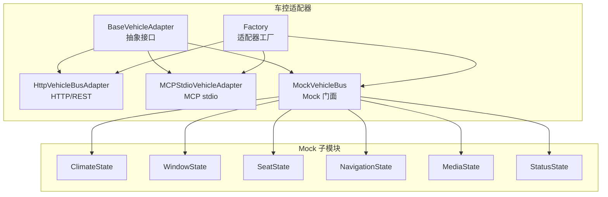
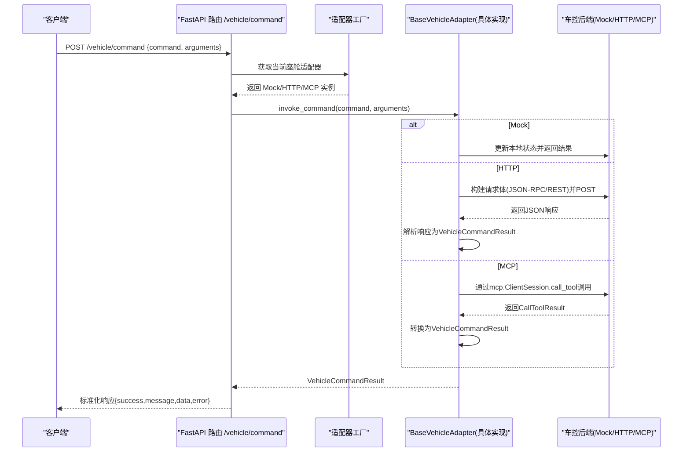
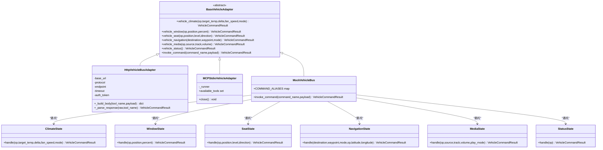
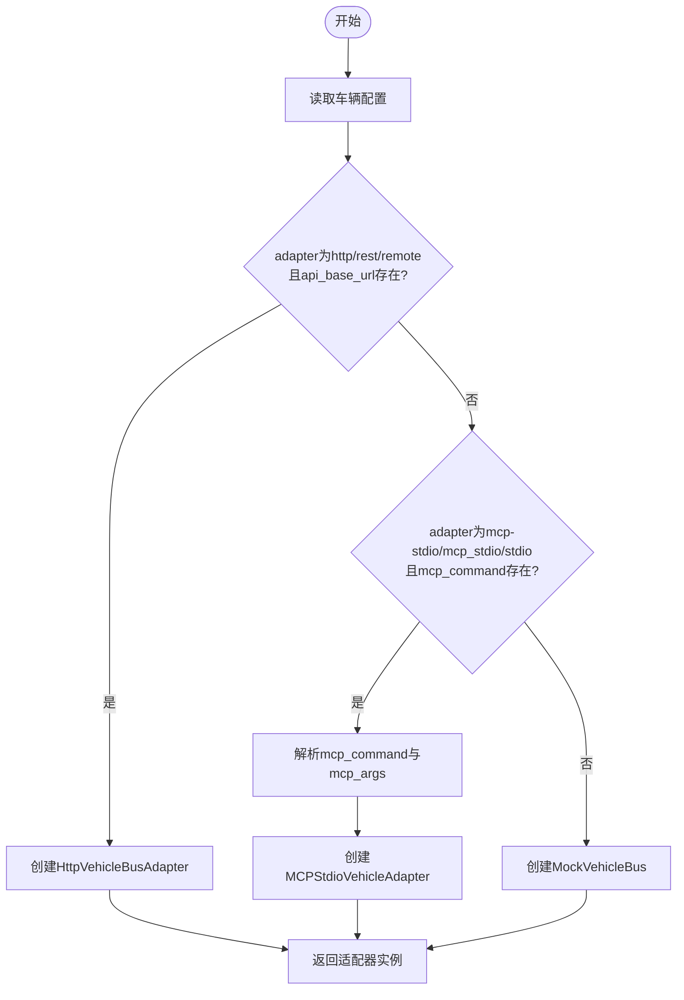
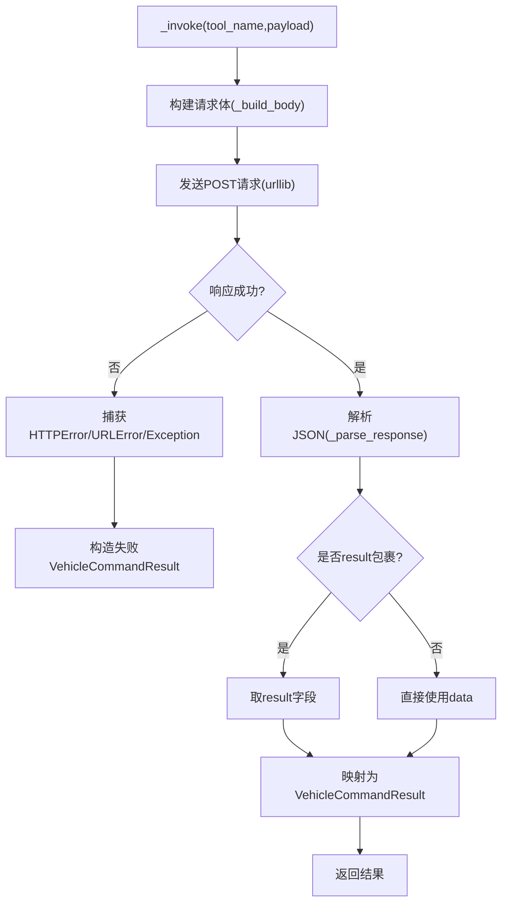
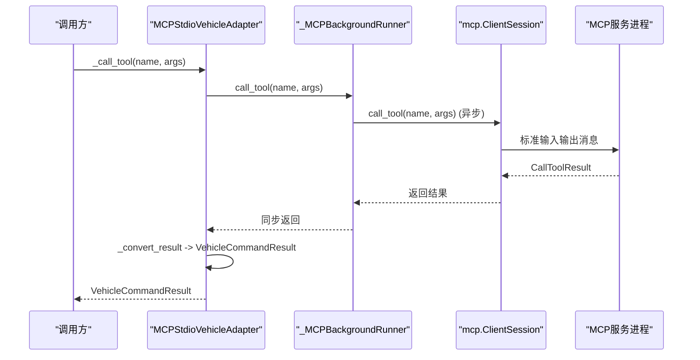
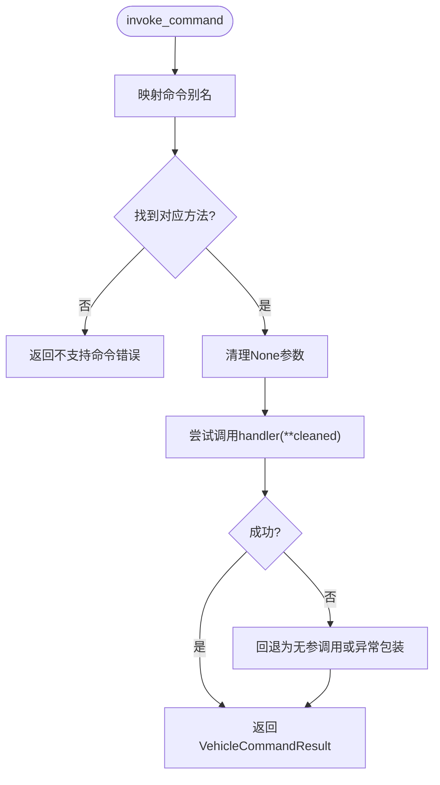
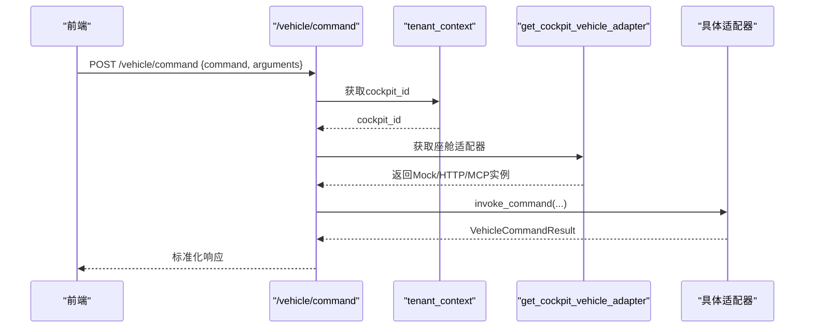
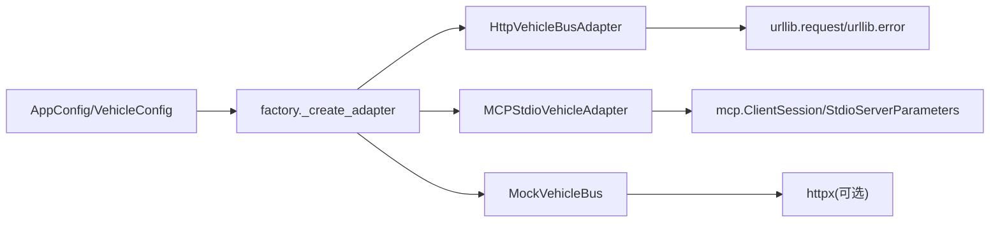

# 车控适配器

<cite>
**本文引用的文件**   
- [backend_design/nexus/vehicle/base.py](file://backend_design/nexus/vehicle/base.py)
- [backend_design/nexus/vehicle/factory.py](file://backend_design/nexus/vehicle/factory.py)
- [backend_design/nexus/vehicle/http.py](file://backend_design/nexus/vehicle/http.py)
- [backend_design/nexus/vehicle/mcp.py](file://backend_design/nexus/vehicle/mcp.py)
- [backend_design/nexus/vehicle/mock/__init__.py](file://backend_design/nexus/vehicle/mock/__init__.py)
- [backend_design/nexus/vehicle/mock/climate_state.py](file://backend_design/nexus/vehicle/mock/climate_state.py)
- [backend_design/nexus/vehicle/mock/window_state.py](file://backend_design/nexus/vehicle/mock/window_state.py)
- [backend_design/nexus/vehicle/mock/seat_state.py](file://backend_design/nexus/vehicle/mock/seat_state.py)
- [backend_design/nexus/vehicle/mock/navigation_state.py](file://backend_design/nexus/vehicle/mock/navigation_state.py)
- [backend_design/nexus/vehicle/mock/media_state.py](file://backend_design/nexus/vehicle/mock/media_state.py)
- [backend_design/nexus/vehicle/mock/status_state.py](file://backend_design/nexus/vehicle/mock/status_state.py)
- [backend_design/nexus/config/vehicle.py](file://backend_design/nexus/config/vehicle.py)
- [backend_design/nexus/api/routes/vehicle.py](file://backend_design/nexus/api/routes/vehicle.py)
</cite>

## 目录
1. [简介](#简介)
2. [项目结构](#项目结构)
3. [核心组件](#核心组件)
4. [架构总览](#架构总览)
5. [详细组件分析](#详细组件分析)
6. [依赖关系分析](#依赖关系分析)
7. [性能考量](#性能考量)
8. [故障排查指南](#故障排查指南)
9. [结论](#结论)
10. [附录：新适配器开发与集成测试](#附录：新适配器开发与集成测试)

## 简介
本文件为 NexusCockpit 车控适配器系统的权威技术文档，围绕三模式适配架构（Mock/HTTP/MCP）展开，系统阐述抽象基类设计、工厂模式实现与协议转换机制；对比各模式的特性、适用场景与配置方法；并完整文档化车控命令执行流程、状态同步机制与错误恢复策略。同时提供新适配器开发指南、模拟环境搭建与集成测试方法，帮助开发者快速扩展与维护车控子系统。

## 项目结构
车控适配器位于 backend_design/nexus/vehicle 目录下，采用“抽象接口 + 多实现 + 工厂”的分层组织方式：
- base.py：定义统一抽象接口 BaseVehicleAdapter 与结果模型 VehicleCommandResult
- factory.py：根据配置选择 Mock/HTTP/MCP 适配器，并提供多座舱隔离能力
- http.py：HTTP REST/JSON-RPC 适配器
- mcp.py：MCP stdio 适配器（后台异步事件循环桥接）
- mock/*：Mock 门面与各子系统状态模块（空调、车窗、座椅、导航、媒体、车况）

图表来源
- [backend_design/nexus/vehicle/base.py](file://backend_design/nexus/vehicle/base.py)
- [backend_design/nexus/vehicle/factory.py](file://backend_design/nexus/vehicle/factory.py)
- [backend_design/nexus/vehicle/http.py](file://backend_design/nexus/vehicle/http.py)
- [backend_design/nexus/vehicle/mcp.py](file://backend_design/nexus/vehicle/mcp.py)
- [backend_design/nexus/vehicle/mock/__init__.py](file://backend_design/nexus/vehicle/mock/__init__.py)
- [backend_design/nexus/vehicle/mock/climate_state.py](file://backend_design/nexus/vehicle/mock/climate_state.py)
- [backend_design/nexus/vehicle/mock/window_state.py](file://backend_design/nexus/vehicle/mock/window_state.py)
- [backend_design/nexus/vehicle/mock/seat_state.py](file://backend_design/nexus/vehicle/mock/seat_state.py)
- [backend_design/nexus/vehicle/mock/navigation_state.py](file://backend_design/nexus/vehicle/mock/navigation_state.py)
- [backend_design/nexus/vehicle/mock/media_state.py](file://backend_design/nexus/vehicle/mock/media_state.py)
- [backend_design/nexus/vehicle/mock/status_state.py](file://backend_design/nexus/vehicle/mock/status_state.py)

章节来源
- [backend_design/nexus/vehicle/base.py](file://backend_design/nexus/vehicle/base.py)
- [backend_design/nexus/vehicle/factory.py](file://backend_design/nexus/vehicle/factory.py)
- [backend_design/nexus/vehicle/mock/__init__.py](file://backend_design/nexus/vehicle/mock/__init__.py)

## 核心组件
- 抽象接口与结果模型
  - BaseVehicleAdapter：定义空调、车窗、座椅、导航、媒体、状态查询与通用命令调用等统一方法签名
  - VehicleCommandResult：标准化返回结构（success/message/data/error），屏蔽底层差异
- 适配器工厂
  - build_vehicle_adapter：全局单例创建，避免重复初始化
  - get_cockpit_vehicle_adapter：按座舱 ID 获取独立实例（Mock 状态隔离，HTTP/MCP 复用无状态单例）
  - _create_adapter：依据配置选择具体实现（mock/http/mcp-stdio）
- HTTP 适配器
  - 支持 REST 与 JSON-RPC 两种协议体构造与响应解析
  - 统一异常捕获与错误码映射
- MCP 适配器
  - 通过后台线程运行 asyncio 事件循环，桥接异步 MCP SDK 到同步接口
  - 工具白名单校验与结构化内容提取
- Mock 门面与各状态模块
  - MockVehicleBus：对外暴露统一接口，内部委托至各状态模块
  - 各状态模块维护自身状态字典，处理操作符校验、参数归一化与结果封装

章节来源
- [backend_design/nexus/vehicle/base.py](file://backend_design/nexus/vehicle/base.py)
- [backend_design/nexus/vehicle/factory.py](file://backend_design/nexus/vehicle/factory.py)
- [backend_design/nexus/vehicle/http.py](file://backend_design/nexus/vehicle/http.py)
- [backend_design/nexus/vehicle/mcp.py](file://backend_design/nexus/vehicle/mcp.py)
- [backend_design/nexus/vehicle/mock/__init__.py](file://backend_design/nexus/vehicle/mock/__init__.py)

## 架构总览
下图展示从 API 路由到具体适配器的调用链路与数据流向，体现多座舱隔离与协议转换。

图表来源
- [backend_design/nexus/api/routes/vehicle.py](file://backend_design/nexus/api/routes/vehicle.py)
- [backend_design/nexus/vehicle/factory.py](file://backend_design/nexus/vehicle/factory.py)
- [backend_design/nexus/vehicle/http.py](file://backend_design/nexus/vehicle/http.py)
- [backend_design/nexus/vehicle/mcp.py](file://backend_design/nexus/vehicle/mcp.py)
- [backend_design/nexus/vehicle/mock/__init__.py](file://backend_design/nexus/vehicle/mock/__init__.py)

## 详细组件分析

### 抽象基类与结果模型
- BaseVehicleAdapter 定义了统一的控制方法族与通用命令入口，确保上层无需感知具体通信协议
- VehicleCommandResult 作为跨模式统一的结果载体，便于前端与上层逻辑一致消费

图表来源
- [backend_design/nexus/vehicle/base.py](file://backend_design/nexus/vehicle/base.py)
- [backend_design/nexus/vehicle/http.py](file://backend_design/nexus/vehicle/http.py)
- [backend_design/nexus/vehicle/mcp.py](file://backend_design/nexus/vehicle/mcp.py)
- [backend_design/nexus/vehicle/mock/__init__.py](file://backend_design/nexus/vehicle/mock/__init__.py)
- [backend_design/nexus/vehicle/mock/climate_state.py](file://backend_design/nexus/vehicle/mock/climate_state.py)
- [backend_design/nexus/vehicle/mock/window_state.py](file://backend_design/nexus/vehicle/mock/window_state.py)
- [backend_design/nexus/vehicle/mock/seat_state.py](file://backend_design/nexus/vehicle/mock/seat_state.py)
- [backend_design/nexus/vehicle/mock/navigation_state.py](file://backend_design/nexus/vehicle/mock/navigation_state.py)
- [backend_design/nexus/vehicle/mock/media_state.py](file://backend_design/nexus/vehicle/mock/media_state.py)
- [backend_design/nexus/vehicle/mock/status_state.py](file://backend_design/nexus/vehicle/mock/status_state.py)

章节来源
- [backend_design/nexus/vehicle/base.py](file://backend_design/nexus/vehicle/base.py)

### 工厂模式与多座舱隔离
- 单例与缓存
  - build_vehicle_adapter：首次创建后缓存，避免重复初始化
  - get_cockpit_vehicle_adapter：按座舱ID缓存适配器实例（Mock 状态隔离）
- 适配器选择策略
  - 若 adapter 为 http/rest/remote 且存在 api_base_url，则创建 HTTP 适配器
  - 若 adapter 为 mcp-stdio/mcp_stdio/stdio 且存在 mcp_command，则创建 MCP 适配器
  - 否则回退到 Mock 适配器
- 命令行解析
  - _parse_command_line/_parse_args_list：支持 JSON 数组或 shlex 解析，兼容复杂启动命令与参数

图表来源
- [backend_design/nexus/vehicle/factory.py](file://backend_design/nexus/vehicle/factory.py)
- [backend_design/nexus/config/vehicle.py](file://backend_design/nexus/config/vehicle.py)

章节来源
- [backend_design/nexus/vehicle/factory.py](file://backend_design/nexus/vehicle/factory.py)
- [backend_design/nexus/config/vehicle.py](file://backend_design/nexus/config/vehicle.py)

### HTTP 适配器与协议转换
- 协议支持
  - REST：body 包含 tool 与 arguments
  - JSON-RPC：body 包含 jsonrpc、id、method、params
- 响应解析
  - 优先识别 result 包裹结构
  - 支持 success/message/data 或 error 块
  - 非 JSON 响应降级为 raw 文本
- 错误处理
  - HTTPError/URLError/通用异常均被捕获并转为 VehicleCommandResult

图表来源
- [backend_design/nexus/vehicle/http.py](file://backend_design/nexus/vehicle/http.py)

章节来源
- [backend_design/nexus/vehicle/http.py](file://backend_design/nexus/vehicle/http.py)

### MCP 适配器与异步桥接
- 后台事件循环
  - _MCPBackgroundRunner：在 daemon 线程中运行 asyncio 事件循环，管理 stdio_client 与 ClientSession 生命周期
  - call_tool：通过 run_coroutine_threadsafe 将同步调用桥接到异步 session.call_tool
- 工具白名单
  - 初始化时 list_tools，后续调用前校验工具是否存在
- 结果转换
  - 将 CallToolResult 的 content/structuredContent/isError 映射为 VehicleCommandResult

图表来源
- [backend_design/nexus/vehicle/mcp.py](file://backend_design/nexus/vehicle/mcp.py)

章节来源
- [backend_design/nexus/vehicle/mcp.py](file://backend_design/nexus/vehicle/mcp.py)

### Mock 门面与状态模块
- MockVehicleBus
  - COMMAND_ALIASES：将多种自然语言风格命令映射到统一方法
  - invoke_command：统一入口，参数清理与异常兜底
  - vehicle_status：聚合所有子系统状态，支持位置查询特殊分支
- 状态模块
  - ClimateState：电源开关与温度/风量/模式设置，复合指令顺序执行
  - WindowState：开合/定位与 all 同步逻辑
  - SeatState：加热/制冷/按摩与位置调整
  - NavigationState：目的地/航点/模式设置，IP/GPS 逆地理编码与降级
  - MediaState：播放列表扫描、播放模式、音量与曲目切换
  - StatusState：车况摘要

图表来源
- [backend_design/nexus/vehicle/mock/__init__.py](file://backend_design/nexus/vehicle/mock/__init__.py)
- [backend_design/nexus/vehicle/mock/climate_state.py](file://backend_design/nexus/vehicle/mock/climate_state.py)
- [backend_design/nexus/vehicle/mock/window_state.py](file://backend_design/nexus/vehicle/mock/window_state.py)
- [backend_design/nexus/vehicle/mock/seat_state.py](file://backend_design/nexus/vehicle/mock/seat_state.py)
- [backend_design/nexus/vehicle/mock/navigation_state.py](file://backend_design/nexus/vehicle/mock/navigation_state.py)
- [backend_design/nexus/vehicle/mock/media_state.py](file://backend_design/nexus/vehicle/mock/media_state.py)
- [backend_design/nexus/vehicle/mock/status_state.py](file://backend_design/nexus/vehicle/mock/status_state.py)

章节来源
- [backend_design/nexus/vehicle/mock/__init__.py](file://backend_design/nexus/vehicle/mock/__init__.py)

### API 路由与多座舱隔离
- /vehicle/command：直接执行车控命令，绕过 Agent 工作流，需要 JWT 认证
- /vehicle/status：获取车辆当前状态（聚合各子系统）
- /vehicle/location：接收浏览器 GPS 坐标，存储到导航状态并清除旧地址缓存
- 座舱隔离：通过 X-Cockpit-Id 头或 tenant_context 注入 cockpit_id，使用 get_cockpit_vehicle_adapter 获取对应适配器

图表来源
- [backend_design/nexus/api/routes/vehicle.py](file://backend_design/nexus/api/routes/vehicle.py)
- [backend_design/nexus/vehicle/factory.py](file://backend_design/nexus/vehicle/factory.py)

章节来源
- [backend_design/nexus/api/routes/vehicle.py](file://backend_design/nexus/api/routes/vehicle.py)

## 依赖关系分析
- 配置中心
  - AppConfig 聚合 VehicleConfig，通过 get_config() 全局单例访问
  - VehicleConfig 定义 VEHICLE_* 环境变量映射
- 运行时依赖
  - HTTP 适配器依赖 urllib.request/urllib.error
  - MCP 适配器依赖 mcp.ClientSession/StdioServerParameters
  - Mock 导航依赖 httpx（可选）进行逆地理编码

图表来源
- [backend_design/nexus/config/__init__.py](file://backend_design/nexus/config/__init__.py)
- [backend_design/nexus/config/vehicle.py](file://backend_design/nexus/config/vehicle.py)
- [backend_design/nexus/vehicle/factory.py](file://backend_design/nexus/vehicle/factory.py)
- [backend_design/nexus/vehicle/http.py](file://backend_design/nexus/vehicle/http.py)
- [backend_design/nexus/vehicle/mcp.py](file://backend_design/nexus/vehicle/mcp.py)
- [backend_design/nexus/vehicle/mock/navigation_state.py](file://backend_design/nexus/vehicle/mock/navigation_state.py)

章节来源
- [backend_design/nexus/config/__init__.py](file://backend_design/nexus/config/__init__.py)
- [backend_design/nexus/config/vehicle.py](file://backend_design/nexus/config/vehicle.py)
- [backend_design/nexus/vehicle/factory.py](file://backend_design/nexus/vehicle/factory.py)

## 性能考量
- 单例与缓存
  - 全局适配器单例减少重复初始化开销
  - 每座舱适配器缓存避免频繁查找
- 网络与超时
  - HTTP 适配器可配置超时时间，降低阻塞风险
  - MCP 工具调用具备超时保护
- 状态聚合
  - Mock 模式下 status 聚合各子系统状态，注意数据量增长对序列化影响
- 并发与线程
  - MCP 后台线程与事件循环隔离，避免阻塞主线程

[本节为通用指导，不直接分析具体文件]

## 故障排查指南
- 常见错误类型
  - 连接失败：HTTP URLError 或 MCP 初始化超时
  - 协议不匹配：JSON 解析失败或非 JSON 响应
  - 工具未暴露：MCP server 未声明目标工具
  - 参数非法：操作符或位置不在白名单
- 定位建议
  - 检查 VEHICLE_ADAPTER 与相关 URL/命令配置
  - 查看日志中的错误码与 message
  - 使用 /vehicle/status 验证状态一致性
  - 对于 MCP，确认 mcp_command 与 mcp_args 解析正确

章节来源
- [backend_design/nexus/vehicle/http.py](file://backend_design/nexus/vehicle/http.py)
- [backend_design/nexus/vehicle/mcp.py](file://backend_design/nexus/vehicle/mcp.py)
- [backend_design/nexus/vehicle/mock/climate_state.py](file://backend_design/nexus/vehicle/mock/climate_state.py)
- [backend_design/nexus/vehicle/mock/window_state.py](file://backend_design/nexus/vehicle/mock/window_state.py)
- [backend_design/nexus/vehicle/mock/seat_state.py](file://backend_design/nexus/vehicle/mock/seat_state.py)
- [backend_design/nexus/vehicle/mock/navigation_state.py](file://backend_design/nexus/vehicle/mock/navigation_state.py)
- [backend_design/nexus/vehicle/mock/media_state.py](file://backend_design/nexus/vehicle/mock/media_state.py)

## 结论
NexusCockpit 车控适配器通过抽象基类与工厂模式实现了 Mock/HTTP/MCP 三模式无缝切换，既满足开发调试需求，又支撑生产环境的真实车控通信。其清晰的职责划分、统一的返回结构与完善的错误处理，为上层技能与 API 提供了稳定可靠的抽象。配合多座舱隔离与丰富的 Mock 状态模块，开发者可高效扩展新的适配器与业务逻辑。

[本节为总结性内容，不直接分析具体文件]

## 附录：新适配器开发与集成测试

### 新适配器开发步骤
- 继承 BaseVehicleAdapter，实现所有抽象方法
- 如需自定义协议，参考 HTTP 适配器的 _build_body/_parse_response 模式
- 如使用外部进程通信，参考 MCP 适配器的后台事件循环桥接模式
- 在 factory._create_adapter 中添加选择分支，并完善配置项

章节来源
- [backend_design/nexus/vehicle/base.py](file://backend_design/nexus/vehicle/base.py)
- [backend_design/nexus/vehicle/factory.py](file://backend_design/nexus/vehicle/factory.py)
- [backend_design/nexus/vehicle/http.py](file://backend_design/nexus/vehicle/http.py)
- [backend_design/nexus/vehicle/mcp.py](file://backend_design/nexus/vehicle/mcp.py)

### 模拟环境搭建（Mock）
- 启用 Mock 模式：设置 VEHICLE_ADAPTER=mock
- 通过 /vehicle/command 与 /vehicle/status 验证空调、车窗、座椅、媒体、导航、车况等行为
- 使用 /vehicle/location 注入 GPS 坐标，观察导航状态变化

章节来源
- [backend_design/nexus/api/routes/vehicle.py](file://backend_design/nexus/api/routes/vehicle.py)
- [backend_design/nexus/vehicle/mock/__init__.py](file://backend_design/nexus/vehicle/mock/__init__.py)
- [backend_design/nexus/vehicle/mock/navigation_state.py](file://backend_design/nexus/vehicle/mock/navigation_state.py)

### 集成测试方法
- 单元测试
  - 针对各状态模块的 handle 方法编写用例，覆盖合法/非法操作符与边界值
- 端到端测试
  - 启动后端服务，调用 /vehicle/command 与 /vehicle/status，断言返回结构与状态一致性
- 协议测试
  - HTTP 模式：构造不同协议体（REST/JSON-RPC），验证响应解析
  - MCP 模式：准备最小可用 MCP 服务，验证工具白名单与结果转换

章节来源
- [backend_design/nexus/vehicle/mock/climate_state.py](file://backend_design/nexus/vehicle/mock/climate_state.py)
- [backend_design/nexus/vehicle/mock/window_state.py](file://backend_design/nexus/vehicle/mock/window_state.py)
- [backend_design/nexus/vehicle/mock/seat_state.py](file://backend_design/nexus/vehicle/mock/seat_state.py)
- [backend_design/nexus/vehicle/mock/media_state.py](file://backend_design/nexus/vehicle/mock/media_state.py)
- [backend_design/nexus/vehicle/http.py](file://backend_design/nexus/vehicle/http.py)
- [backend_design/nexus/vehicle/mcp.py](file://backend_design/nexus/vehicle/mcp.py)