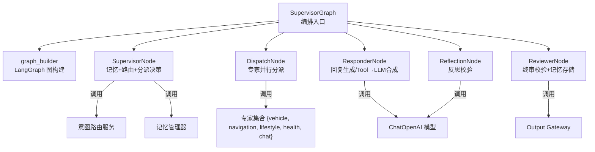
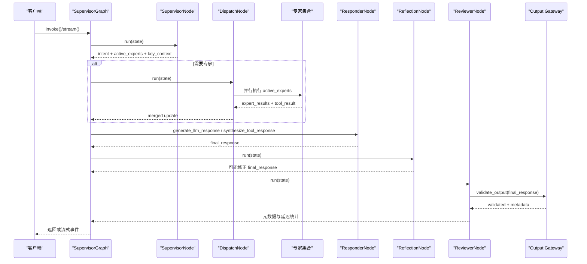
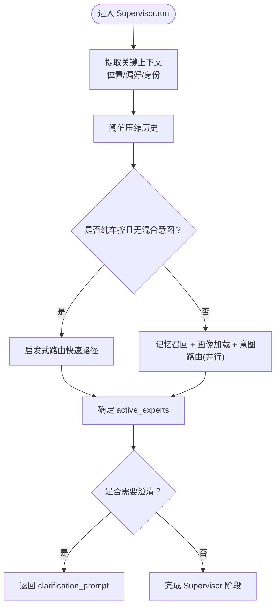
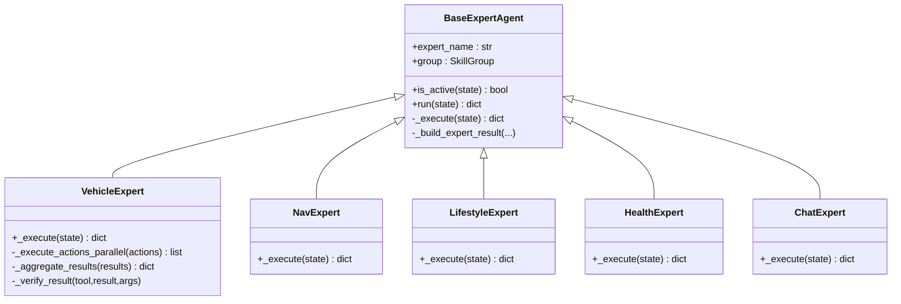
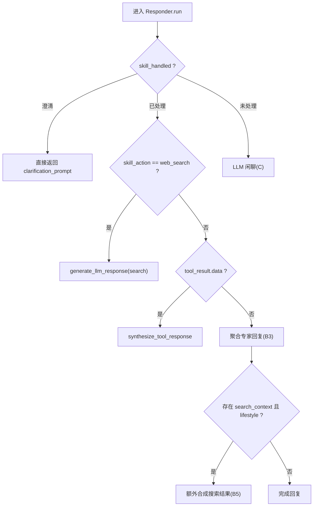
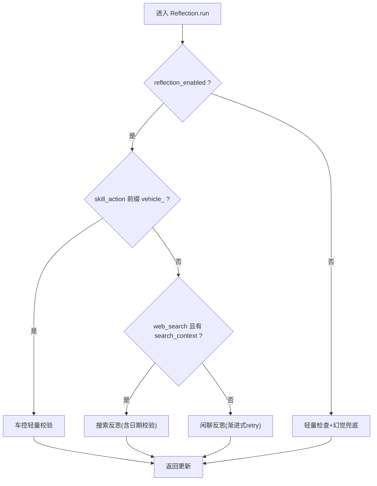
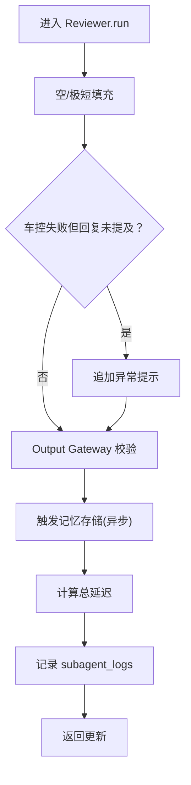
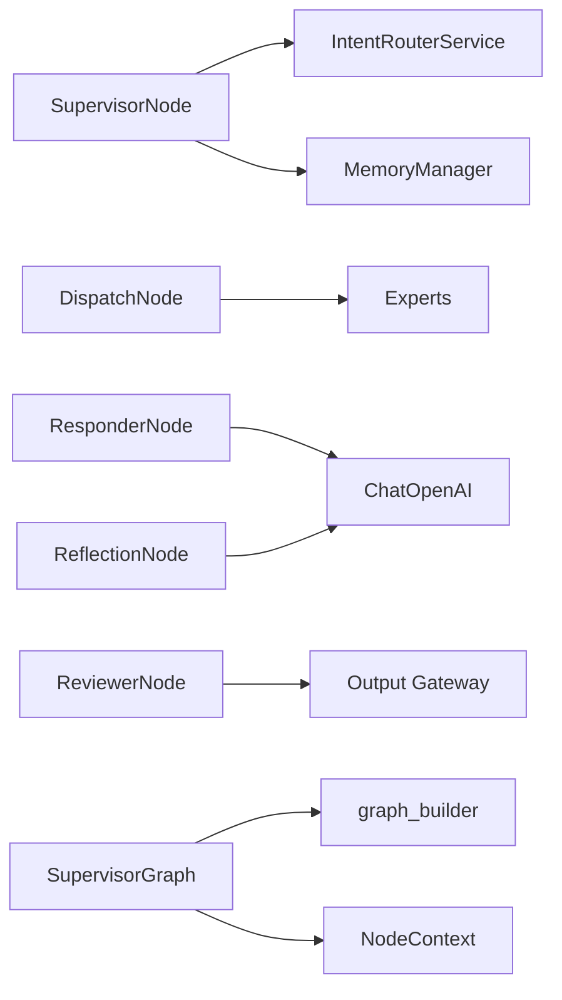

# L4 Agent层

<cite>
**本文引用的文件**   
- [supervisor_graph.py](file://backend_design/nexus/agent/supervisor_graph.py)
- [graph_builder.py](file://backend_design/nexus/agent/graph_builder.py)
- [generation_task_pool.py](file://backend_design/nexus/agent/generation_task_pool.py)
- [output_gateway.py](file://backend_design/nexus/agent/output_gateway.py)
- [base.py](file://backend_design/nexus/agent/experts/base.py)
- [chat_expert.py](file://backend_design/nexus/agent/experts/chat_expert.py)
- [vehicle_expert.py](file://backend_design/nexus/agent/experts/vehicle_expert.py)
- [nav_expert.py](file://backend_design/nexus/agent/experts/nav_expert.py)
- [lifestyle_expert.py](file://backend_design/nexus/agent/experts/lifestyle_expert.py)
- [health_expert.py](file://backend_design/nexus/agent/experts/health_expert.py)
- [supervisor_node.py](file://backend_design/nexus/agent/nodes/supervisor_node.py)
- [dispatch_node.py](file://backend_design/nexus/agent/nodes/dispatch_node.py)
- [responder_node.py](file://backend_design/nexus/agent/nodes/responder_node.py)
- [reflection_node.py](file://backend_design/nexus/agent/nodes/reflection_node.py)
- [reviewer_node.py](file://backend_design/nexus/agent/nodes/reviewer_node.py)
- [context.py](file://backend_design/nexus/agent/nodes/context.py)
</cite>

## 目录
1. [引言](#引言)
2. [项目结构](#项目结构)
3. [核心组件](#核心组件)
4. [架构总览](#架构总览)
5. [详细组件分析](#详细组件分析)
6. [依赖关系分析](#依赖关系分析)
7. [性能考量](#性能考量)
8. [故障排查指南](#故障排查指南)
9. [结论](#结论)
10. [附录：Agent开发指南与调试建议](#附录agent开发指南与调试建议)

## 引言
本文件面向 NexusCockpit 的 L4 Agent 层，系统性阐述 Multi-Agent 协作架构与 LangGraph 工作流编排。重点覆盖 Supervisor 调度器、五大专家（聊天、车辆、导航、生活、健康）的职责分工与执行流程；说明 Responder 响应器、Reflection 反思器、Reviewer 审查器的协同机制；并给出消息传递协议、并行处理策略、状态管理、输出网关校验、任务池托管以及开发与调试优化建议。

## 项目结构
L4 Agent 层以“编排入口 + 节点化实现”的方式组织：
- 编排入口：SupervisorGraph 负责初始化、构建图、暴露 invoke/stream/stream_with_events 接口
- 图构建：graph_builder 注册节点与边，编译为 LangGraph 可执行图
- 节点：Supervisor、Dispatch、Responder、Reflection、Reviewer
- 专家：BaseExpertAgent 及五个具体专家
- 支撑能力：NodeContext 共享依赖容器、Output Gateway 全局输出校验、GenerationTaskPool 后台任务池

**图表来源** 
- [supervisor_graph.py:93-179](file://backend_design/nexus/agent/supervisor_graph.py#L93-L179)
- [graph_builder.py:40-119](file://backend_design/nexus/agent/graph_builder.py#L40-L119)
- [supervisor_node.py:40-110](file://backend_design/nexus/agent/nodes/supervisor_node.py#L40-L110)
- [dispatch_node.py:25-62](file://backend_design/nexus/agent/nodes/dispatch_node.py#L25-L62)
- [responder_node.py:34-74](file://backend_design/nexus/agent/nodes/responder_node.py#L34-L74)
- [reflection_node.py:46-90](file://backend_design/nexus/agent/nodes/reflection_node.py#L46-L90)
- [reviewer_node.py:26-50](file://backend_design/nexus/agent/nodes/reviewer_node.py#L26-L50)

**章节来源**
- [supervisor_graph.py:93-179](file://backend_design/nexus/agent/supervisor_graph.py#L93-L179)
- [graph_builder.py:40-119](file://backend_design/nexus/agent/graph_builder.py#L40-L119)

## 核心组件
- SupervisorGraph：统一编排入口，提供同步 invoke 与流式 stream/stream_with_events，维护 NodeContext 与专家实例，构建并运行 LangGraph 图
- graph_builder：注册五类核心节点与专家节点，设置条件边与入口，编译 CompiledGraph
- SupervisorNode：记忆召回、用户画像加载、意图路由、快速路径（纯车控）、专家选择与澄清判断
- DispatchNode：基于 active_experts 使用 asyncio.gather 并行执行专家，合并 partial updates
- ResponderNode：按分支生成回复（澄清/搜索/工具合成/车控聚合/闲聊），构建系统提示词，注入位置/画像/习惯/关键上下文
- ReflectionNode：对工具/搜索/车控/闲聊四类场景进行反思校验，含确定性日期修正与渐进式 retry
- ReviewerNode：终审强校验、Output Gateway 合规检查、记忆异步存储、延迟统计与活动日志
- Output Gateway：非空/敏感/幻觉/长度/车控完整性等全局校验，确保所有对外输出安全
- GenerationTaskPool：将 pipeline 生命周期脱离 SSE 连接，事件缓冲队列解耦生产消费，支持查询/取消/过期清理

**章节来源**
- [supervisor_graph.py:93-179](file://backend_design/nexus/agent/supervisor_graph.py#L93-L179)
- [graph_builder.py:40-119](file://backend_design/nexus/agent/graph_builder.py#L40-L119)
- [supervisor_node.py:40-110](file://backend_design/nexus/agent/nodes/supervisor_node.py#L40-L110)
- [dispatch_node.py:25-62](file://backend_design/nexus/agent/nodes/dispatch_node.py#L25-L62)
- [responder_node.py:34-74](file://backend_design/nexus/agent/nodes/responder_node.py#L34-L74)
- [reflection_node.py:46-90](file://backend_design/nexus/agent/nodes/reflection_node.py#L46-L90)
- [reviewer_node.py:26-50](file://backend_design/nexus/agent/nodes/reviewer_node.py#L26-L50)
- [output_gateway.py:64-195](file://backend_design/nexus/agent/output_gateway.py#L64-L195)
- [generation_task_pool.py:68-145](file://backend_design/nexus/agent/generation_task_pool.py#L68-L145)

## 架构总览
下图展示从请求进入至最终输出的完整链路，包括五层闭环校验与事件流。

**图表来源** 
- [supervisor_graph.py:183-384](file://backend_design/nexus/agent/supervisor_graph.py#L183-L384)
- [supervisor_node.py:64-110](file://backend_design/nexus/agent/nodes/supervisor_node.py#L64-L110)
- [dispatch_node.py:38-62](file://backend_design/nexus/agent/nodes/dispatch_node.py#L38-L62)
- [responder_node.py:58-174](file://backend_design/nexus/agent/nodes/responder_node.py#L58-L174)
- [reflection_node.py:82-116](file://backend_design/nexus/agent/nodes/reflection_node.py#L82-L116)
- [reviewer_node.py:39-101](file://backend_design/nexus/agent/nodes/reviewer_node.py#L39-L101)
- [output_gateway.py:64-195](file://backend_design/nexus/agent/output_gateway.py#L64-L195)

## 详细组件分析

### Supervisor 调度器与 LangGraph 工作流
- 职责：记忆召回（增强查询）、用户画像加载、意图路由（启发式+LLM）、快速路径（纯车控 <100ms）、专家选择、澄清判断
- 图构建：注册 supervisor → dispatch → responder → reflection → reviewer → END，条件边由 route 函数决定
- 状态管理：SupervisorState 作为 LangGraph 状态，包含 history、intent、active_experts、expert_results、tool_result、search_context、running_summary、key_context 等
- 流式模式：stream_with_events 输出 thinking/intent/experts/action/chunk/done 事件，全链路强制闭环

**图表来源** 
- [supervisor_node.py:64-110](file://backend_design/nexus/agent/nodes/supervisor_node.py#L64-L110)
- [supervisor_node.py:170-259](file://backend_design/nexus/agent/nodes/supervisor_node.py#L170-L259)
- [graph_builder.py:94-110](file://backend_design/nexus/agent/graph_builder.py#L94-L110)

**章节来源**
- [supervisor_graph.py:183-384](file://backend_design/nexus/agent/supervisor_graph.py#L183-L384)
- [supervisor_node.py:64-110](file://backend_design/nexus/agent/nodes/supervisor_node.py#L64-L110)
- [graph_builder.py:40-119](file://backend_design/nexus/agent/graph_builder.py#L40-L119)

### 专家体系与并行执行
- BaseExpertAgent：定义 is_active/run/_execute/_build_expert_result，统一返回 partial update，封装 skill_action/handled/search_context/tool_result/metadata
- VehicleExpert：多动作并行执行，互斥组内串行，沙箱审查与结果验证，聚合多条回复
- NavExpert：导航技能，缓存 GPS 坐标注入避免 IP 定位超时
- LifestyleExpert：POI/天气/搜索/点餐/提醒多原子任务并行，天气与搜索互斥
- HealthExpert：诊断/故障码翻译/保养建议，按 skill 路由
- ChatExpert：声纹注册与纯闲聊（不标记 handled，交由 Responder 走 LLM）
- DispatchNode：通过 asyncio.gather 并行执行 active_experts，合并 expert_results/tool_results/metadata

**图表来源** 
- [base.py:26-87](file://backend_design/nexus/agent/experts/base.py#L26-L87)
- [vehicle_expert.py:43-116](file://backend_design/nexus/agent/experts/vehicle_expert.py#L43-L116)
- [nav_expert.py:26-82](file://backend_design/nexus/agent/experts/nav_expert.py#L26-L82)
- [lifestyle_expert.py:24-172](file://backend_design/nexus/agent/experts/lifestyle_expert.py#L24-L172)
- [health_expert.py:24-74](file://backend_design/nexus/agent/experts/health_expert.py#L24-L74)
- [chat_expert.py:24-71](file://backend_design/nexus/agent/experts/chat_expert.py#L24-L71)

**章节来源**
- [base.py:26-87](file://backend_design/nexus/agent/experts/base.py#L26-L87)
- [vehicle_expert.py:43-116](file://backend_design/nexus/agent/experts/vehicle_expert.py#L43-L116)
- [dispatch_node.py:38-62](file://backend_design/nexus/agent/nodes/dispatch_node.py#L38-L62)

### Responder 响应器
- 分支策略：A 澄清、B1 搜索专用提示词、B2 Tool→LLM 合成、B3 车控聚合、B5 复合查询拼接、C 闲聊兜底
- System Prompt：动态注入时间、位置状态、用户画像/习惯、关键上下文、搜索上下文
- 预/后校验：与 ReflectionNode 协作，拦截无历史的历史查询与幻觉模式
- 滚动摘要：保存 running_summary，保证跨轮次持久化

**图表来源** 
- [responder_node.py:58-174](file://backend_design/nexus/agent/nodes/responder_node.py#L58-L174)
- [responder_node.py:181-310](file://backend_design/nexus/agent/nodes/responder_node.py#L181-L310)
- [responder_node.py:316-394](file://backend_design/nexus/agent/nodes/responder_node.py#L316-L394)

**章节来源**
- [responder_node.py:58-174](file://backend_design/nexus/agent/nodes/responder_node.py#L58-L174)
- [responder_node.py:181-310](file://backend_design/nexus/agent/nodes/responder_node.py#L181-L310)
- [responder_node.py:316-394](file://backend_design/nexus/agent/nodes/responder_node.py#L316-L394)

### Reflection 反思器
- 四类分支：工具反思、搜索反思、车控轻量校验、闲聊渐进式 retry
- 确定性日期校验：正则检测并自动修正“今天/明天/后天”错误
- 快速跳过：短回复+短工具消息/失败关键词时跳过 LLM 反思，仍做幻觉兜底
- 带反馈重试：当反思不通过且无修正建议时，使用压缩历史+反馈重新生成

**图表来源** 
- [reflection_node.py:82-116](file://backend_design/nexus/agent/nodes/reflection_node.py#L82-L116)
- [reflection_node.py:254-308](file://backend_design/nexus/agent/nodes/reflection_node.py#L254-L308)
- [reflection_node.py:382-485](file://backend_design/nexus/agent/nodes/reflection_node.py#L382-L485)
- [reflection_node.py:512-656](file://backend_design/nexus/agent/nodes/reflection_node.py#L512-L656)

**章节来源**
- [reflection_node.py:82-116](file://backend_design/nexus/agent/nodes/reflection_node.py#L82-L116)
- [reflection_node.py:254-308](file://backend_design/nexus/agent/nodes/reflection_node.py#L254-L308)
- [reflection_node.py:382-485](file://backend_design/nexus/agent/nodes/reflection_node.py#L382-L485)
- [reflection_node.py:512-656](file://backend_design/nexus/agent/nodes/reflection_node.py#L512-L656)

### Reviewer 审查器与 Output Gateway
- Reviewer：质量检查（空/极短填充）、车控失败告警、Output Gateway 合规校验、记忆异步存储、延迟统计、活动日志
- Output Gateway：非空/敏感/幻觉/长度/车控完整性校验，返回 validated 文本与 metadata

**图表来源** 
- [reviewer_node.py:39-101](file://backend_design/nexus/agent/nodes/reviewer_node.py#L39-L101)
- [output_gateway.py:64-195](file://backend_design/nexus/agent/output_gateway.py#L64-L195)

**章节来源**
- [reviewer_node.py:39-101](file://backend_design/nexus/agent/nodes/reviewer_node.py#L39-L101)
- [output_gateway.py:64-195](file://backend_design/nexus/agent/output_gateway.py#L64-L195)

### 消息传递协议与状态管理
- 状态字段（SupervisorState）：user_input、history、intent、active_experts、expert_results、tool_result、search_context、final_response、running_summary、key_context、metadata、latency_ms 等
- 节点间通信：通过 partial update 字典合并，expert_results 列表累加，tool_results 收集，metadata 透传
- 事件协议（stream_with_events）：thinking/intent/experts/action/chunk/done/error，统一结构化事件

**章节来源**
- [supervisor_graph.py:183-384](file://backend_design/nexus/agent/supervisor_graph.py#L183-L384)
- [dispatch_node.py:62-139](file://backend_design/nexus/agent/nodes/dispatch_node.py#L62-L139)
- [responder_node.py:58-174](file://backend_design/nexus/agent/nodes/responder_node.py#L58-L174)

### 并行处理能力
- 专家并行：DispatchNode 使用 asyncio.gather 并行执行 active_experts
- 内部并行：VehicleExpert 独立动作并行、互斥组串行；LifestyleExpert 多原子任务 gather
- 后台任务池：GenerationTaskPool 将 pipeline 置于后台 Task，事件写入队列，SSE 消费，支持取消/查询/过期清理

**章节来源**
- [dispatch_node.py:38-62](file://backend_design/nexus/agent/nodes/dispatch_node.py#L38-L62)
- [vehicle_expert.py:117-177](file://backend_design/nexus/agent/experts/vehicle_expert.py#L117-L177)
- [lifestyle_expert.py:174-184](file://backend_design/nexus/agent/experts/lifestyle_expert.py#L174-L184)
- [generation_task_pool.py:146-189](file://backend_design/nexus/agent/generation_task_pool.py#L146-L189)

## 依赖关系分析
- 耦合与内聚：各节点通过 NodeContext 注入依赖，避免循环引用；专家与技能注册中心松耦合
- 外部依赖：IntentRouterService、MemoryManager、SkillRegistry、ChatOpenAI、PromptManager、LangGraph StateGraph
- 潜在风险：LLM 调用超时/失败需降级；车控指令需严格沙箱审查与结果验证

**图表来源** 
- [supervisor_node.py:40-110](file://backend_design/nexus/agent/nodes/supervisor_node.py#L40-L110)
- [dispatch_node.py:25-62](file://backend_design/nexus/agent/nodes/dispatch_node.py#L25-L62)
- [responder_node.py:34-74](file://backend_design/nexus/agent/nodes/responder_node.py#L34-L74)
- [reflection_node.py:46-90](file://backend_design/nexus/agent/nodes/reflection_node.py#L46-L90)
- [reviewer_node.py:26-50](file://backend_design/nexus/agent/nodes/reviewer_node.py#L26-L50)
- [supervisor_graph.py:93-179](file://backend_design/nexus/agent/supervisor_graph.py#L93-L179)
- [graph_builder.py:40-119](file://backend_design/nexus/agent/graph_builder.py#L40-L119)
- [context.py:31-64](file://backend_design/nexus/agent/nodes/context.py#L31-L64)

**章节来源**
- [context.py:31-64](file://backend_design/nexus/agent/nodes/context.py#L31-L64)

## 性能考量
- 快速路径：纯车控指令跳过记忆召回与 RAG，Supervisor 延迟 <100ms
- 并行化：专家并行、原子任务 gather、后台任务池解耦 SSE
- 压缩历史：阈值压缩减少 LLM 输入长度，降低 Token 成本
- 反射优化：短回复/短工具消息快速跳过，确定性日期校验零 LLM 开销
- 指标埋点：Prometheus 指标（AGENT_LATENCY/RAG_RETRIEVALS/LLM_CALLS/LLM_LATENCY）与 Langfuse 追踪

[本节为通用指导，无需特定文件来源]

## 故障排查指南
- LLM 不可用：stream 中检测到 LLM_Error，走 fallback 并通过完整 Reviewer + Output Gateway 输出
- 车控失败：Reviewer 追加异常提示；VehicleExpert 结果验证失败会返回 error 状态
- 幻觉防护：Output Gateway 与 Reflection 双重拦截，新对话首轮历史查询被预/后校验拦截
- 任务中断：GenerationTaskPool 支持 cancel_task，SSE 断连不终止 pipeline，重连可查询结果

**章节来源**
- [supervisor_graph.py:231-244](file://backend_design/nexus/agent/supervisor_graph.py#L231-L244)
- [reviewer_node.py:63-101](file://backend_design/nexus/agent/nodes/reviewer_node.py#L63-L101)
- [output_gateway.py:124-141](file://backend_design/nexus/agent/output_gateway.py#L124-L141)
- [reflection_node.py:753-789](file://backend_design/nexus/agent/nodes/reflection_node.py#L753-L789)
- [generation_task_pool.py:240-257](file://backend_design/nexus/agent/generation_task_pool.py#L240-L257)

## 结论
L4 Agent 层以 SupervisorGraph 为核心编排，结合 LangGraph 状态机与节点化设计，实现了高内聚、低耦合的 Multi-Agent 协作。五大专家各司其职，Dispatcher 保障并行效率，Responder/Reflection/Reviewer 形成全链路质量闭环，Output Gateway 确保输出安全。配合 GenerationTaskPool 与完善的指标观测，系统在车载语音交互场景中具备高可用性与可扩展性。

[本节为总结性内容，无需特定文件来源]

## 附录：Agent开发指南与调试建议
- 新增专家
  - 继承 BaseExpertAgent，实现 _execute(state) 返回 partial update
  - 在 SupervisorGraph.__init__ 中注册到 experts 字典
  - 在 SupervisorNode._determine_experts 中添加路由规则
- 调试方法
  - 启用 Langfuse 观察节点耗时与 Token 用量
  - 查看 Prometheus 指标（AGENT_LATENCY/RAG_RETRIEVALS/LLM_CALLS/LLM_LATENCY）
  - 使用 stream_with_events 事件流定位瓶颈（thinking/intent/experts/action/chunk/done）
- 性能优化
  - 优先使用快速路径（纯车控）
  - 合理设置阈值压缩与温度参数
  - 利用反射快速跳过与确定性校验减少 LLM 调用
  - 控制并发任务数（GenerationTaskPool._MAX_CONCURRENT）

**章节来源**
- [base.py:85-87](file://backend_design/nexus/agent/experts/base.py#L85-L87)
- [supervisor_graph.py:121-128](file://backend_design/nexus/agent/supervisor_graph.py#L121-L128)
- [supervisor_node.py:333-422](file://backend_design/nexus/agent/nodes/supervisor_node.py#L333-L422)
- [supervisor_graph.py:386-617](file://backend_design/nexus/agent/supervisor_graph.py#L386-L617)
- [generation_task_pool.py:86-89](file://backend_design/nexus/agent/generation_task_pool.py#L86-L89)