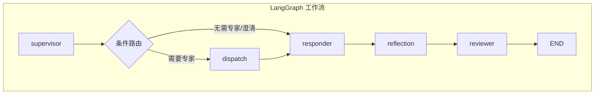
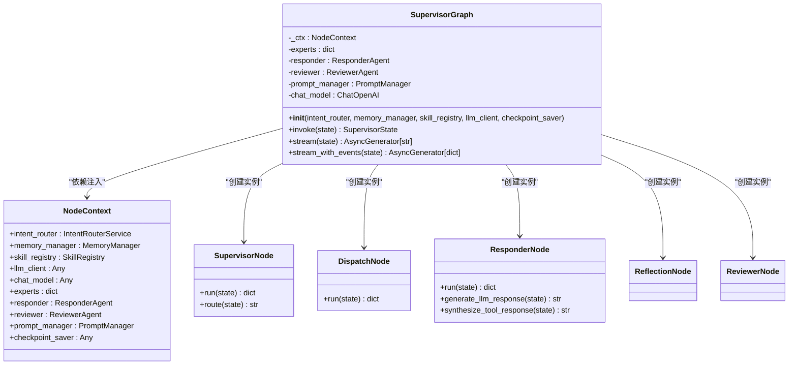
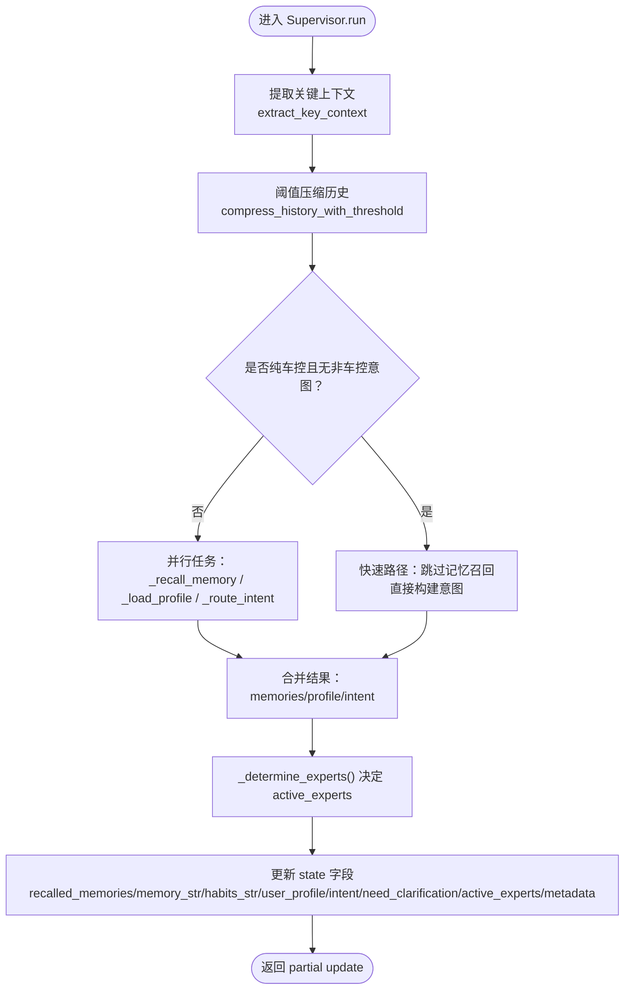
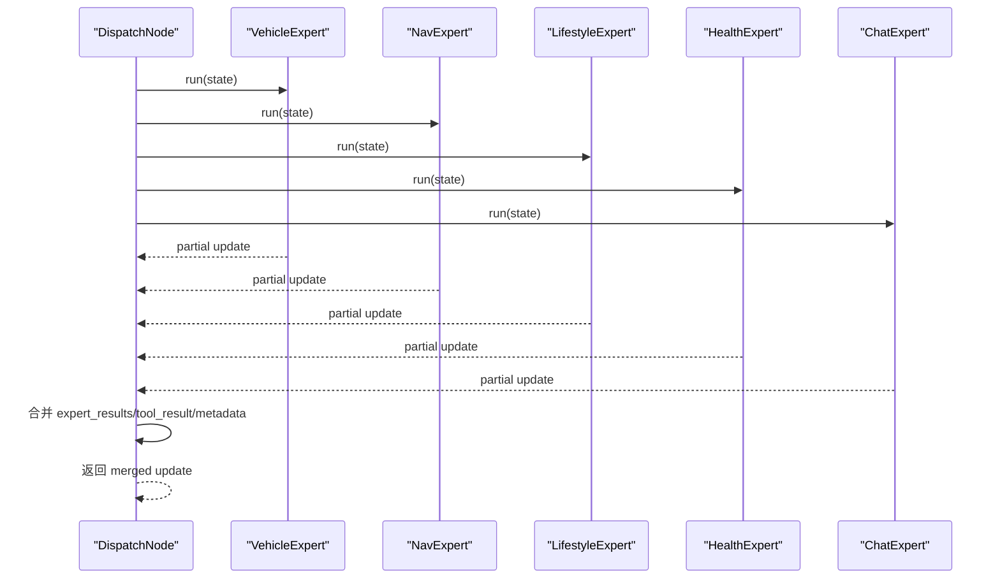
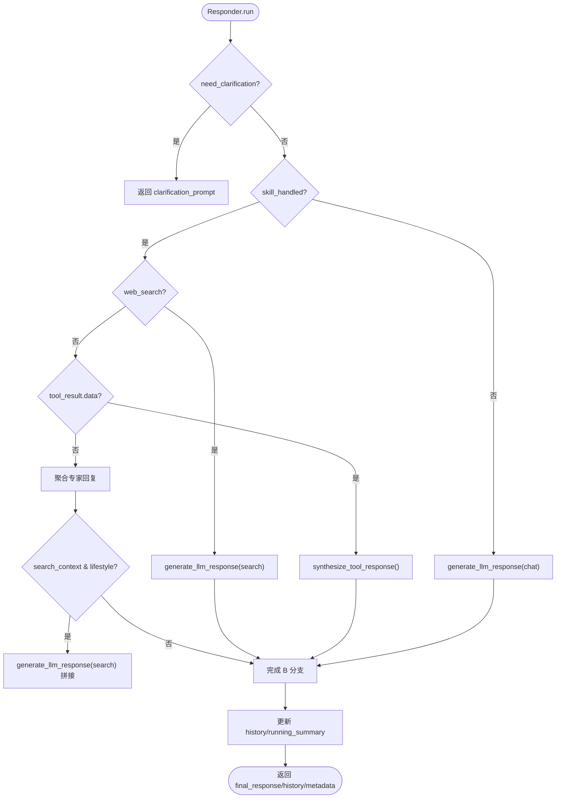
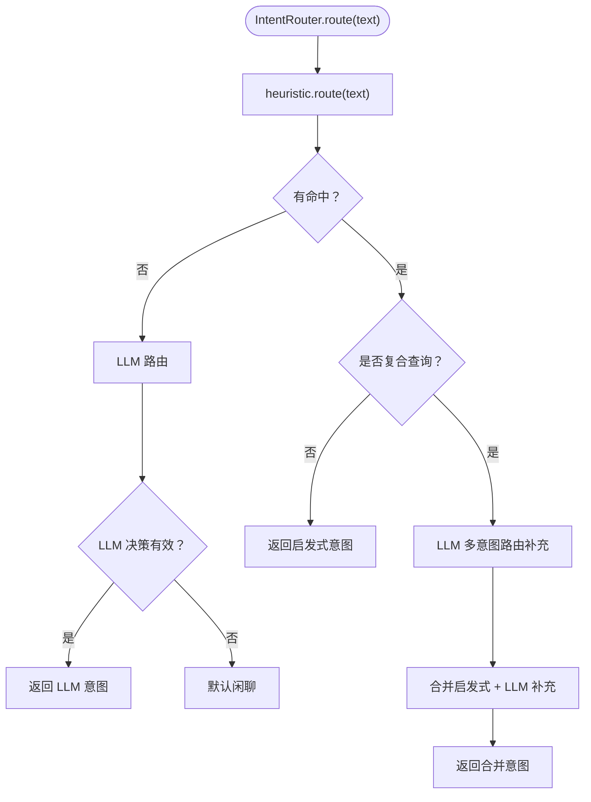
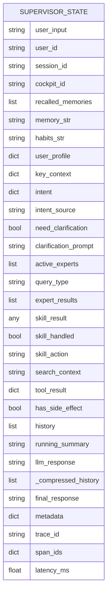
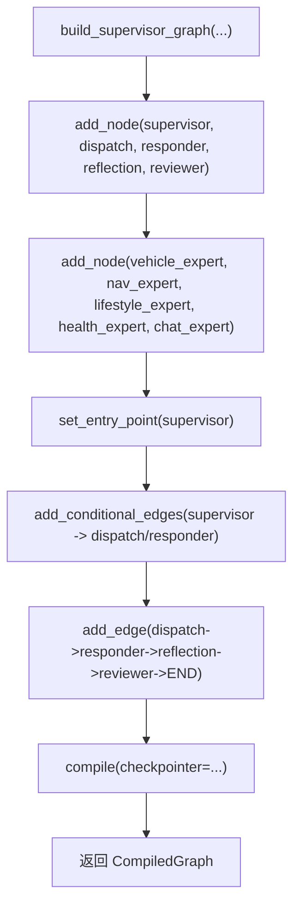
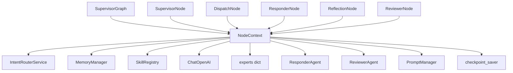

# Supervisor调度器

<cite>
**本文引用的文件**   
- [supervisor_node.py](file://backend_design/nexus/agent/nodes/supervisor_node.py)
- [graph_builder.py](file://backend_design/nexus/agent/graph_builder.py)
- [supervisor_graph.py](file://backend_design/nexus/agent/supervisor_graph.py)
- [state.py](file://backend_design/nexus/models/state.py)
- [dispatch_node.py](file://backend_design/nexus/agent/nodes/dispatch_node.py)
- [responder_node.py](file://backend_design/nexus/agent/nodes/responder_node.py)
- [context.py](file://backend_design/nexus/agent/nodes/context.py)
- [router.py](file://backend_design/nexus/intent/router.py)
- [constants.py](file://backend_design/nexus/intent/constants.py)
- [base.py](file://backend_design/nexus/agent/experts/base.py)
</cite>

## 目录
1. [简介](#简介)
2. [项目结构](#项目结构)
3. [核心组件](#核心组件)
4. [架构总览](#架构总览)
5. [详细组件分析](#详细组件分析)
6. [依赖关系分析](#依赖关系分析)
7. [性能考量](#性能考量)
8. [故障排查指南](#故障排查指南)
9. [结论](#结论)
10. [附录：扩展指南与调试方法](#附录扩展指南与调试方法)

## 简介
本文件面向 NexusCockpit 的 Supervisor 调度器，聚焦以下目标：
- 深入解释 SupervisorNode 的核心职责：记忆召回、意图路由与专家分派决策机制。
- 详细说明 LangGraph StateGraph 工作流编排原理：状态管理、节点间消息传递协议与并行处理能力。
- 文档化 graph_builder 中的图构建逻辑：节点注册、边连接与编译过程。
- 定义 SupervisorState 状态模型、路由策略配置与工作流调试方法。
- 提供具体代码示例路径，展示如何扩展新的专家 Agent 和自定义路由规则。

## 项目结构
Supervisor 调度器位于 backend_design/nexus/agent 目录下，围绕 LangGraph StateGraph 构建“五层链路”：
- supervisor（记忆+路由+分派）
- dispatch（专家并行执行）
- responder（汇总回复生成）
- reflection（反思校验）
- reviewer（终审校验）

图表来源
- [graph_builder.py:70-119](file://backend_design/nexus/agent/graph_builder.py#L70-L119)
- [supervisor_graph.py:169-179](file://backend_design/nexus/agent/supervisor_graph.py#L169-L179)

章节来源
- [supervisor_graph.py:1-180](file://backend_design/nexus/agent/supervisor_graph.py#L1-L180)
- [graph_builder.py:1-120](file://backend_design/nexus/agent/graph_builder.py#L1-L120)

## 核心组件
- SupervisorNode：记忆召回 + 用户画像加载 + 意图路由 + 专家分派决策。
- DispatchNode：基于 asyncio.gather 并行调用活跃专家，合并 partial updates。
- ResponderNode：按分支选择回复策略（澄清/工具合成/LLM闲聊），注入画像/记忆/习惯/位置/关键上下文。
- ReflectionNode：三种反思分支 + 日期校验 + 幻觉检查（预/后校验）。
- ReviewerNode：质量检查 + 记忆存储 + 延迟统计。
- NodeContext：共享依赖容器，解耦节点与 SupervisorGraph。
- IntentRouterService：三级路由（启发式 → LLM → 默认闲聊），支持复合查询增强。
- SupervisorState：TypedDict 状态模型，使用 reducer（add/merge_dict）实现多节点并行写入安全合并。

章节来源
- [supervisor_node.py:40-331](file://backend_design/nexus/agent/nodes/supervisor_node.py#L40-L331)
- [dispatch_node.py:25-140](file://backend_design/nexus/agent/nodes/dispatch_node.py#L25-L140)
- [responder_node.py:34-175](file://backend_design/nexus/agent/nodes/responder_node.py#L34-L175)
- [context.py:31-64](file://backend_design/nexus/agent/nodes/context.py#L31-L64)
- [router.py:32-218](file://backend_design/nexus/intent/router.py#L32-L218)
- [state.py:38-165](file://backend_design/nexus/models/state.py#L38-L165)

## 架构总览
SupervisorGraph 作为编排入口，负责初始化各节点、构建图并暴露 invoke/stream/stream_with_events 接口。其内部通过 NodeContext 将共享服务注入到各节点，避免循环依赖。

图表来源
- [supervisor_graph.py:93-179](file://backend_design/nexus/agent/supervisor_graph.py#L93-L179)
- [context.py:31-64](file://backend_design/nexus/agent/nodes/context.py#L31-L64)

章节来源
- [supervisor_graph.py:93-179](file://backend_design/nexus/agent/supervisor_graph.py#L93-L179)

## 详细组件分析

### SupervisorNode：记忆召回 + 意图路由 + 专家分派
- 记忆召回：使用 GraphRAG 三路融合 + Rerank；当用户查询模糊时，用 extract_key_context 增强召回查询；阈值压缩自动压缩旧对话为滚动摘要。
- 用户画像加载：从 Neo4j 加载用户画像，MySQL 加载习惯记忆，注入 state 供 prompt 使用。
- 意图路由：三级策略（启发式快速路径 <1ms，LLM 语义理解 1-3s，默认闲聊兜底）；支持复合查询增强（部分命中时由 LLM 补充未识别意图）。
- 快速路径：纯车控指令跳过记忆召回和用户画像加载，将 supervisor 延迟降至 <100ms。
- 专家分派：根据意图字段决定 active_experts，包含防漂移机制（车控强制路由 vehicle，导航误匹配检测等）。

图表来源
- [supervisor_node.py:64-331](file://backend_design/nexus/agent/nodes/supervisor_node.py#L64-L331)
- [constants.py:12-31](file://backend_design/nexus/intent/constants.py#L12-L31)

章节来源
- [supervisor_node.py:40-422](file://backend_design/nexus/agent/nodes/supervisor_node.py#L40-L422)
- [router.py:103-218](file://backend_design/nexus/intent/router.py#L103-L218)
- [constants.py:12-31](file://backend_design/nexus/intent/constants.py#L12-L31)

### DispatchNode：专家并行分派
- 使用 asyncio.gather 并行调用所有活跃专家的 run() 方法。
- 合并 expert_results（reducer add）、skill_action/skill_handled/search_context、tool_result、metadata。
- 记录多动作日志与错误信息，确保 has_side_effect 标记正确传递（车控指令禁止缓存）。

图表来源
- [dispatch_node.py:38-140](file://backend_design/nexus/agent/nodes/dispatch_node.py#L38-L140)

章节来源
- [dispatch_node.py:25-140](file://backend_design/nexus/agent/nodes/dispatch_node.py#L25-L140)

### ResponderNode：回复生成与 Tool→LLM 合成
- 分支策略：
  - A：需要澄清 → 直接返回 clarification_prompt。
  - B1：搜索类技能 → LLM 用 search 提示词生成。
  - B2：工具返回结构化数据 → Tool→LLM 合成（低温度保证事实准确性）。
  - B3：简单车控指令 → 聚合所有专家回复。
  - B5：复合查询混合 → 车控回复 + LLM 合成搜索结果拼接。
  - C：LLM 闲聊兜底。
- System Prompt 构建：注入用户画像、记忆、习惯、位置状态、关键上下文；搜索类提示词注入时间/日期约束。
- 预/后校验：ReflectionNode 预校验拦截明显问题，后校验防止编造对话历史。

图表来源
- [responder_node.py:58-175](file://backend_design/nexus/agent/nodes/responder_node.py#L58-L175)

章节来源
- [responder_node.py:34-681](file://backend_design/nexus/agent/nodes/responder_node.py#L34-L681)

### IntentRouterService：三级路由与复合查询增强
- Level 1：启发式规则（关键词匹配，<1ms），覆盖常见车控指令。
- Level 1.5：复合查询增强（文本含多个子句但仅部分被识别时，LLM 多意图路由补充未识别意图）。
- Level 2：LLM 路由（语义理解，1-3s），处理复杂/模糊意图。
- Level 3：默认闲聊（安全兜底）。
- 结构化路由日志：记录路由源、命中字段、用于调试路由匹配。

图表来源
- [router.py:103-218](file://backend_design/nexus/intent/router.py#L103-L218)
- [router.py:228-276](file://backend_design/nexus/intent/router.py#L228-L276)

章节来源
- [router.py:32-218](file://backend_design/nexus/intent/router.py#L32-L218)

### SupervisorState：状态模型与 Reducer
- TypedDict 定义，使用 Annotated[list, add] 与 Annotated[dict, merge_dict] 实现多节点并行写入安全合并。
- 关键字段分组：输入、记忆召回、意图路由/Supervisor 分派、专家输出、对话、最终输出、可观测性。
- create_initial_state：推荐入口，确保带 reducer 的字段有正确的初始值。

图表来源
- [state.py:38-165](file://backend_design/nexus/models/state.py#L38-L165)

章节来源
- [state.py:38-165](file://backend_design/nexus/models/state.py#L38-L165)

### graph_builder：图构建逻辑
- 节点注册：supervisor、dispatch、responder、reflection、reviewer，以及专家节点（vehicle/nav/lifestyle/health/chat）。
- 边连接：supervisor 条件边（route_fn）→ dispatch 或 responder；dispatch → responder → reflection → reviewer → END。
- 编译：可选 checkpoint_saver 持久化，返回 CompiledGraph。

图表来源
- [graph_builder.py:40-119](file://backend_design/nexus/agent/graph_builder.py#L40-L119)

章节来源
- [graph_builder.py:1-120](file://backend_design/nexus/agent/graph_builder.py#L1-L120)

## 依赖关系分析
- SupervisorGraph 依赖 NodeContext 注入共享服务（intent_router、memory_manager、skill_registry、llm_client、chat_model、experts、responder、reviewer、prompt_manager、checkpoint_saver）。
- 各节点通过 NodeContext 访问依赖，不持有 SupervisorGraph 引用，消除循环依赖。
- IntentRouterService 依赖 HeuristicRouter 与 LLMIntentRouter，支持复合查询增强。
- BaseExpertAgent 提供统一专家基类，封装 run() 与 _execute()，并通过 _build_expert_result() 构建 partial update。

图表来源
- [supervisor_graph.py:140-179](file://backend_design/nexus/agent/supervisor_graph.py#L140-L179)
- [context.py:31-64](file://backend_design/nexus/agent/nodes/context.py#L31-L64)

章节来源
- [supervisor_graph.py:140-179](file://backend_design/nexus/agent/supervisor_graph.py#L140-L179)
- [context.py:31-64](file://backend_design/nexus/agent/nodes/context.py#L31-L64)
- [base.py:26-140](file://backend_design/nexus/agent/experts/base.py#L26-L140)

## 性能考量
- 快速路径优化：纯车控指令跳过记忆召回和用户画像加载，将 supervisor 延迟从 ~7.5s 降至 <100ms。
- 并行能力：记忆召回、用户画像加载、意图路由三个任务并行执行（asyncio.gather）。
- Tool→LLM 合成快速路径：短工具消息（≤50字符）直接返回，避免不必要的 LLM 调用。
- 滚动摘要与阈值压缩：减少历史长度，降低 LLM 上下文成本。
- 指标埋点：AGENT_LATENCY、AGENT_INVOCATIONS、RAG_RETRIEVALS、RAG_LATENCY、LLM_CALLS、LLM_LATENCY。

章节来源
- [supervisor_node.py:170-260](file://backend_design/nexus/agent/nodes/supervisor_node.py#L170-L260)
- [responder_node.py:218-228](file://backend_design/nexus/agent/nodes/responder_node.py#L218-L228)
- [supervisor_node.py:311-318](file://backend_design/nexus/agent/nodes/supervisor_node.py#L311-L318)

## 故障排查指南
- 路由错配检测：车控意图未路由到 vehicle 专家时记录 CRITICAL 日志并自动修复。
- LLM 不可用降级：LLM_Error 标记触发 fallback_msg，仍走完整 Reviewer + Output Gateway。
- 专家异常处理：DispatchNode 捕获异常并记录 error 信息，确保流程继续。
- 位置逆地理编码失败：记录警告并使用坐标回退。
- 反射与输出网关：ReflectionNode 预/后校验拦截幻觉，OutputGateway 最终安全校验。

章节来源
- [supervisor_node.py:411-421](file://backend_design/nexus/agent/nodes/supervisor_node.py#L411-L421)
- [supervisor_graph.py:232-244](file://backend_design/nexus/agent/supervisor_graph.py#L232-L244)
- [dispatch_node.py:69-78](file://backend_design/nexus/agent/nodes/dispatch_node.py#L69-L78)
- [responder_node.py:667-669](file://backend_design/nexus/agent/nodes/responder_node.py#L667-L669)

## 结论
Supervisor 调度器通过 SupervisorNode、DispatchNode、ResponderNode、ReflectionNode、ReviewerNode 的协同，结合 LangGraph StateGraph 的状态管理与并行能力，实现了高效、可靠的车载语音交互工作流。快速路径优化、复合查询增强、Tool→LLM 合成与全链路校验确保了低延迟与高安全性。扩展新专家与自定义路由规则可通过 BaseExpertAgent 与 IntentRouterService 轻松实现。

## 附录：扩展指南与调试方法

### 扩展新的专家 Agent
步骤：
1. 继承 BaseExpertAgent，实现 _execute() 方法，返回 partial update（使用 _build_expert_result()）。
2. 在 SupervisorGraph.__init__() 中注册新专家到 experts 字典。
3. 在 graph_builder 中映射专家键到节点名（如 "new_expert": "new_expert_node"）。
4. 在 SupervisorNode._determine_experts() 中添加路由规则，决定何时激活新专家。

参考路径：
- [base.py:26-140](file://backend_design/nexus/agent/experts/base.py#L26-L140)
- [supervisor_graph.py:121-128](file://backend_design/nexus/agent/supervisor_graph.py#L121-L128)
- [graph_builder.py:80-92](file://backend_design/nexus/agent/graph_builder.py#L80-L92)
- [supervisor_node.py:333-421](file://backend_design/nexus/agent/nodes/supervisor_node.py#L333-L421)

### 自定义路由规则
步骤：
1. 在 IntentRouterService._DEFAULT_INTENT_TEMPLATE 中添加新意图字段。
2. 在 _tool_to_intent() 中映射工具名到新意图格式。
3. 在 SupervisorNode._determine_experts() 中添加对应路由逻辑。
4. 如需复合查询增强，调整 _is_potential_compound_query() 逻辑。

参考路径：
- [router.py:58-80](file://backend_design/nexus/intent/router.py#L58-L80)
- [router.py:354-577](file://backend_design/nexus/intent/router.py#L354-L577)
- [supervisor_node.py:333-421](file://backend_design/nexus/agent/nodes/supervisor_node.py#L333-L421)

### 工作流调试方法
- 启用 LangGraph checkpoint 持久化，查看中间状态。
- 观察结构化路由日志（Router LOG | level=...），定位意图匹配问题。
- 检查专家执行日志（Expert 'name' done/fail），确认并行执行结果。
- 使用 stream_with_events() 获取细粒度事件（thinking/intent/experts/action/chunk/done）。

参考路径：
- [supervisor_graph.py:169-179](file://backend_design/nexus/agent/supervisor_graph.py#L169-L179)
- [router.py:137-175](file://backend_design/nexus/intent/router.py#L137-L175)
- [dispatch_node.py:126-139](file://backend_design/nexus/agent/nodes/dispatch_node.py#L126-L139)
- [supervisor_graph.py:386-617](file://backend_design/nexus/agent/supervisor_graph.py#L386-L617)