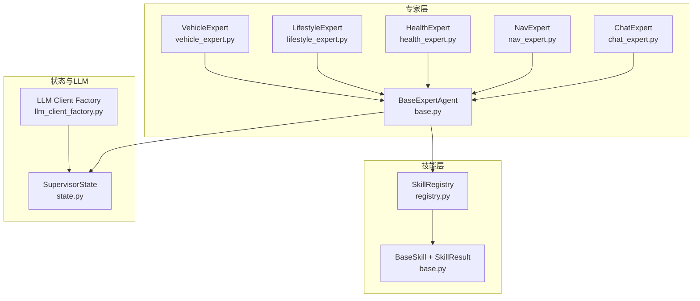
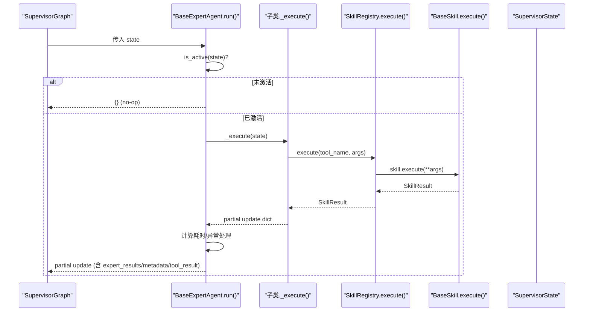
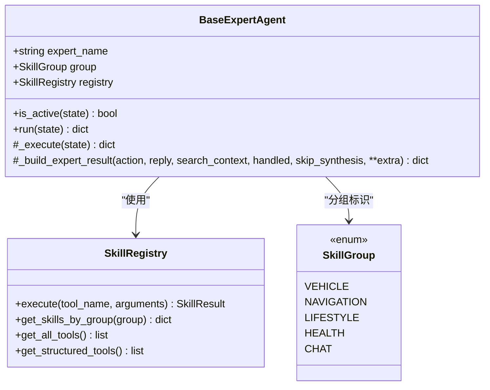
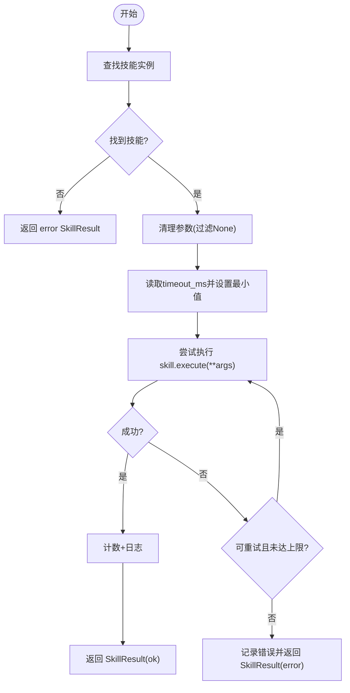
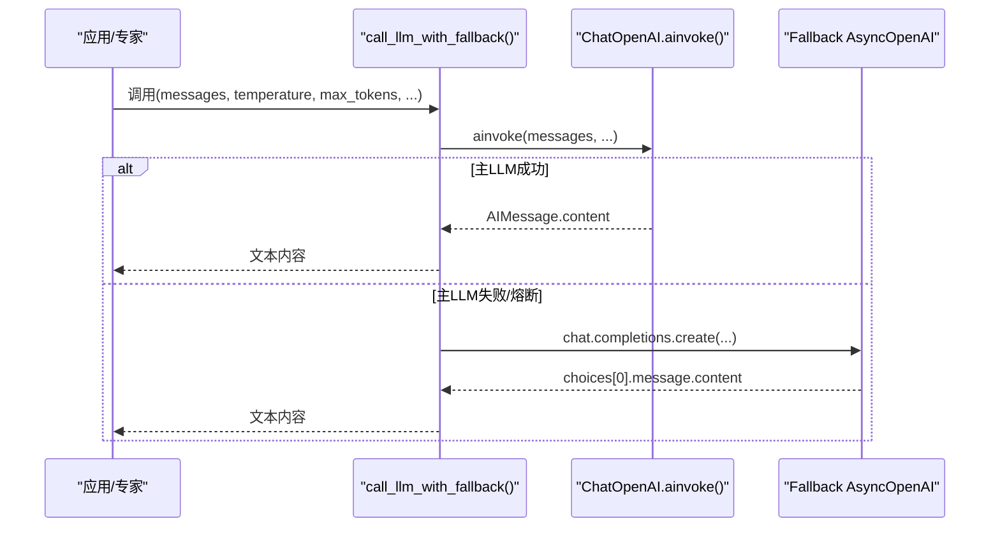
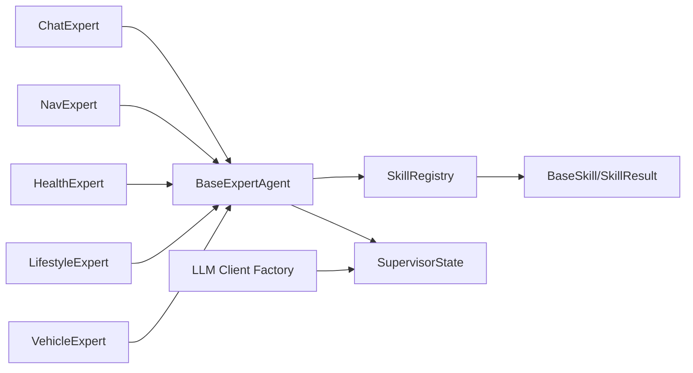

# BaseExpertAgent基类

<cite>
**本文引用的文件**   
- [backend_design/nexus/agent/experts/base.py](file://backend_design/nexus/agent/experts/base.py)
- [backend_design/nexus/skills/registry.py](file://backend_design/nexus/skills/registry.py)
- [backend_design/nexus/skills/base.py](file://backend_design/nexus/skills/base.py)
- [backend_design/nexus/models/state.py](file://backend_design/nexus/models/state.py)
- [backend_design/nexus/agent/llm_client_factory.py](file://backend_design/nexus/agent/llm_client_factory.py)
- [backend_design/nexus/agent/experts/chat_expert.py](file://backend_design/nexus/agent/experts/chat_expert.py)
- [backend_design/nexus/agent/experts/nav_expert.py](file://backend_design/nexus/agent/experts/nav_expert.py)
- [backend_design/nexus/agent/experts/health_expert.py](file://backend_design/nexus/agent/experts/health_expert.py)
- [backend_design/nexus/agent/experts/lifestyle_expert.py](file://backend_design/nexus/agent/experts/lifestyle_expert.py)
- [backend_design/nexus/agent/experts/vehicle_expert.py](file://backend_design/nexus/agent/experts/vehicle_expert.py)
- [backend_design/tests/test_agent.py](file://backend_design/tests/test_agent.py)
</cite>

## 目录
1. [简介](#简介)
2. [项目结构](#项目结构)
3. [核心组件](#核心组件)
4. [架构总览](#架构总览)
5. [详细组件分析](#详细组件分析)
6. [依赖关系分析](#依赖关系分析)
7. [性能考量](#性能考量)
8. [故障排查指南](#故障排查指南)
9. [结论](#结论)
10. [附录：自定义专家实现与测试示例](#附录自定义专家实现与测试示例)

## 简介
本文件围绕 BaseExpertAgent 抽象基类，系统化阐述专家 Agent 的统一接口设计、标准化处理流程、状态管理机制与错误处理模式；并详细说明与 SkillRegistry 的集成方式、LLM 客户端调用规范与响应格式约定。文档覆盖生命周期管理、上下文共享机制、异步处理模式，以及自定义专家开发的最佳实践、继承指南和测试方法，并提供完整代码示例路径以展示如何实现一个符合规范的专家 Agent。

## 项目结构
BaseExpertAgent 位于 agent/experts 模块，作为所有具体专家（聊天、导航、健康、生活方式、车控）的基类。其职责包括：
- 统一入口 run() 标准化执行流程（激活检查、计时、异常捕获、元数据注入）
- 结果构建 _build_expert_result() 统一 partial state update 结构
- 与 SkillRegistry 集成，按组获取技能并执行
- 与 SupervisorState 协作，通过 reducer 机制合并多专家输出

图表来源
- [backend_design/nexus/agent/experts/base.py:26-140](file://backend_design/nexus/agent/experts/base.py#L26-L140)
- [backend_design/nexus/skills/registry.py:36-321](file://backend_design/nexus/skills/registry.py#L36-L321)
- [backend_design/nexus/skills/base.py:35-264](file://backend_design/nexus/skills/base.py#L35-L264)
- [backend_design/nexus/models/state.py:38-165](file://backend_design/nexus/models/state.py#L38-L165)
- [backend_design/nexus/agent/llm_client_factory.py:59-207](file://backend_design/nexus/agent/llm_client_factory.py#L59-L207)

章节来源
- [backend_design/nexus/agent/experts/base.py:26-140](file://backend_design/nexus/agent/experts/base.py#L26-L140)
- [backend_design/nexus/skills/registry.py:36-321](file://backend_design/nexus/skills/registry.py#L36-L321)
- [backend_design/nexus/models/state.py:38-165](file://backend_design/nexus/models/state.py#L38-L165)

## 核心组件
- BaseExpertAgent：定义专家统一接口，封装 run() 标准流程与结果构建器。
- SkillRegistry：技能注册中心，提供自动发现、手动注册、分组查询、超时重试与批量执行能力。
- BaseSkill/SkillResult：技能基类与统一结果对象，支持 Tool Schema 生成与 LangChain StructuredTool 转换。
- SupervisorState：多智能体共享状态，使用 Annotated reducer 自动合并列表与字典字段。
- LLM Client Factory：统一 LLM 客户端创建与降级策略，推荐通过 ChatOpenAI 调用。

章节来源
- [backend_design/nexus/agent/experts/base.py:26-140](file://backend_design/nexus/agent/experts/base.py#L26-L140)
- [backend_design/nexus/skills/registry.py:36-321](file://backend_design/nexus/skills/registry.py#L36-L321)
- [backend_design/nexus/skills/base.py:92-264](file://backend_design/nexus/skills/base.py#L92-L264)
- [backend_design/nexus/models/state.py:38-165](file://backend_design/nexus/models/state.py#L38-L165)
- [backend_design/nexus/agent/llm_client_factory.py:59-207](file://backend_design/nexus/agent/llm_client_factory.py#L59-L207)

## 架构总览
BaseExpertAgent 在 SupervisorGraph 中作为节点函数运行，接收完整 SupervisorState，返回 partial update 字典。执行流程如下：
- is_active(state) 判断是否被分派到 active_experts
- run(state) 计时、调用 _execute(state)、记录延迟与日志、异常兜底
- _execute(state) 由子类实现，通常通过 registry.execute(skill_name, args) 调用技能
- _build_expert_result(...) 构造 expert_results、skill_action、skill_handled、search_context、metadata 等字段，并在条件满足时提升 tool_result 供 Responder 合成

图表来源
- [backend_design/nexus/agent/experts/base.py:44-87](file://backend_design/nexus/agent/experts/base.py#L44-L87)
- [backend_design/nexus/skills/registry.py:222-286](file://backend_design/nexus/skills/registry.py#L222-L286)
- [backend_design/nexus/skills/base.py:147-149](file://backend_design/nexus/skills/base.py#L147-L149)
- [backend_design/nexus/models/state.py:38-106](file://backend_design/nexus/models/state.py#L38-L106)

## 详细组件分析

### BaseExpertAgent 基类
- 属性：expert_name、group（SkillGroup）、registry（SkillRegistry）
- 方法：
  - is_active(state): 基于 active_experts 列表判断是否执行
  - run(state): 标准流程（激活检查、计时、_execute、异常捕获、元数据注入）
  - _execute(state): 子类必须实现
  - _build_expert_result(...): 统一 partial update 结构，包含 expert_results、skill_action、skill_handled、search_context、metadata，并在 handled 且存在 reply/skill_data 时设置 tool_result（可跳过合成）

图表来源
- [backend_design/nexus/agent/experts/base.py:26-140](file://backend_design/nexus/agent/experts/base.py#L26-L140)
- [backend_design/nexus/skills/registry.py:36-321](file://backend_design/nexus/skills/registry.py#L36-L321)
- [backend_design/nexus/skills/base.py:35-42](file://backend_design/nexus/skills/base.py#L35-L42)

章节来源
- [backend_design/nexus/agent/experts/base.py:26-140](file://backend_design/nexus/agent/experts/base.py#L26-L140)

### SkillRegistry 集成
- 自动发现与手动注册：装饰器 @register_skill 标记技能类，初始化时扫描全局表实例化；需要依赖注入的技能通过 _register_manual_skills 注册
- 分组查询：get_skills_by_group(SkillGroup.XXX) 供专家按组获取可用技能
- 执行保护：execute() 内置超时保护与瞬时故障重试（默认最大重试次数），统计指标 SKILL_EXECUTIONS
- 批量执行：execute_batch() 并行执行多个无冲突技能，用于复合指令场景

图表来源
- [backend_design/nexus/skills/registry.py:222-286](file://backend_design/nexus/skills/registry.py#L222-L286)

章节来源
- [backend_design/nexus/skills/registry.py:36-321](file://backend_design/nexus/skills/registry.py#L36-L321)

### LLM 客户端调用规范与响应格式
- 推荐使用 get_chat_model() 获取 ChatOpenAI 单例，通过 ainvoke() 调用
- 统一入口 call_llm_with_fallback() 提供熔断与降级（主 LLM 失败时回退到本地或备用 LLM）
- 返回纯文本内容，调用方无需处理响应对象差异

图表来源
- [backend_design/nexus/agent/llm_client_factory.py:149-207](file://backend_design/nexus/agent/llm_client_factory.py#L149-L207)

章节来源
- [backend_design/nexus/agent/llm_client_factory.py:59-207](file://backend_design/nexus/agent/llm_client_factory.py#L59-L207)

### 状态管理与上下文共享
- SupervisorState 使用 TypedDict + Annotated reducer：
  - list 字段（如 history、expert_results）使用 add 累加
  - dict 字段（如 metadata、span_ids）使用 merge_dict 合并
- 关键字段：
  - 输入：user_input、user_id、session_id、cockpit_id
  - 记忆：recalled_memories、memory_str、user_profile、key_context
  - 路由：intent、intent_source、need_clarification、active_experts、query_type
  - 专家输出：expert_results、search_context、tool_result、has_side_effect
  - 对话：history、running_summary、llm_response
  - 输出：final_response、metadata
  - 可观测性：trace_id、span_ids、latency_ms

章节来源
- [backend_design/nexus/models/state.py:38-165](file://backend_design/nexus/models/state.py#L38-L165)

### 异步处理模式
- BaseExpertAgent.run() 为 async，内部 await _execute()
- SkillRegistry.execute() 使用 asyncio.wait_for 控制超时，支持重试
- LifestyleExpert/VehicleExpert 使用 asyncio.gather 并行执行多个原子任务，互斥组内串行避免冲突

章节来源
- [backend_design/nexus/agent/experts/base.py:48-87](file://backend_design/nexus/agent/experts/base.py#L48-L87)
- [backend_design/nexus/skills/registry.py:222-286](file://backend_design/nexus/skills/registry.py#L222-L286)
- [backend_design/nexus/agent/experts/lifestyle_expert.py:174-184](file://backend_design/nexus/agent/experts/lifestyle_expert.py#L174-L184)
- [backend_design/nexus/agent/experts/vehicle_expert.py:117-177](file://backend_design/nexus/agent/experts/vehicle_expert.py#L117-L177)

### 错误处理模式
- BaseExpertAgent.run() 捕获异常，记录错误日志，返回包含 metadata 的错误信息（expert_name_error、expert_name_latency_ms）
- SkillRegistry.execute() 对超时与异常进行重试与统计，最终返回统一的 SkillResult(error)
- 各专家实现 _verify_result() 校验返回消息与状态，必要时修正回复

章节来源
- [backend_design/nexus/agent/experts/base.py:76-83](file://backend_design/nexus/agent/experts/base.py#L76-L83)
- [backend_design/nexus/skills/registry.py:261-286](file://backend_design/nexus/skills/registry.py#L261-L286)
- [backend_design/nexus/agent/experts/chat_expert.py:34-47](file://backend_design/nexus/agent/experts/chat_expert.py#L34-L47)
- [backend_design/nexus/agent/experts/nav_expert.py:84-97](file://backend_design/nexus/agent/experts/nav_expert.py#L84-L97)
- [backend_design/nexus/agent/experts/lifestyle_expert.py:30-43](file://backend_design/nexus/agent/experts/lifestyle_expert.py#L30-L43)
- [backend_design/nexus/agent/experts/vehicle_expert.py:327-427](file://backend_design/nexus/agent/experts/vehicle_expert.py#L327-L427)

## 依赖关系分析
- BaseExpertAgent 依赖 SkillRegistry 与 SupervisorState
- 具体专家（Chat/Nav/Health/Lifestyle/Vehicle）均继承 BaseExpertAgent，并通过 registry.execute() 调用对应技能
- SkillRegistry 依赖 BaseSkill 与 SkillResult，提供分组查询与执行保护
- LLM Client Factory 独立于专家层，提供统一 LLM 调用与降级

图表来源
- [backend_design/nexus/agent/experts/base.py:26-140](file://backend_design/nexus/agent/experts/base.py#L26-L140)
- [backend_design/nexus/skills/registry.py:36-321](file://backend_design/nexus/skills/registry.py#L36-L321)
- [backend_design/nexus/models/state.py:38-165](file://backend_design/nexus/models/state.py#L38-L165)
- [backend_design/nexus/agent/llm_client_factory.py:59-207](file://backend_design/nexus/agent/llm_client_factory.py#L59-L207)

章节来源
- [backend_design/nexus/agent/experts/base.py:26-140](file://backend_design/nexus/agent/experts/base.py#L26-L140)
- [backend_design/nexus/skills/registry.py:36-321](file://backend_design/nexus/skills/registry.py#L36-L321)

## 性能考量
- 并行执行：LifestyleExpert 与 VehicleExpert 使用 asyncio.gather 并行执行多个原子任务，显著降低端到端延迟
- 互斥组串行：同一硬件互斥组内的动作串行执行，避免资源冲突
- 超时与重试：SkillRegistry.execute() 内置超时与重试，防止外部 API 慢响应阻塞
- 连接池与回调：ChatOpenAI 自带连接池管理、自动重试、回调集成，减少重复开销
- 缓存与副作用：Skill.has_side_effect 控制语义缓存，避免车控指令被错误命中导致安全事故

章节来源
- [backend_design/nexus/agent/experts/lifestyle_expert.py:174-184](file://backend_design/nexus/agent/experts/lifestyle_expert.py#L174-L184)
- [backend_design/nexus/agent/experts/vehicle_expert.py:117-177](file://backend_design/nexus/agent/experts/vehicle_expert.py#L117-L177)
- [backend_design/nexus/skills/registry.py:222-286](file://backend_design/nexus/skills/registry.py#L222-L286)
- [backend_design/nexus/agent/llm_client_factory.py:59-85](file://backend_design/nexus/agent/llm_client_factory.py#L59-L85)
- [backend_design/nexus/skills/base.py:176-184](file://backend_design/nexus/skills/base.py#L176-L184)

## 故障排查指南
- 专家未执行：检查 active_experts 是否包含该专家名称；确认 is_active(state) 逻辑
- 技能未找到：SkillRegistry.get_skill(name) 返回 None，检查装饰器注册或手动注册是否正确
- 超时/重试：查看 SkillRegistry.execute() 日志，确认 timeout_ms 与重试策略
- LLM 调用失败：检查 call_llm_with_fallback() 降级路径与熔断器状态
- 状态合并异常：确认 SupervisorState 字段是否使用正确的 reducer（add/merge_dict）

章节来源
- [backend_design/nexus/agent/experts/base.py:44-87](file://backend_design/nexus/agent/experts/base.py#L44-L87)
- [backend_design/nexus/skills/registry.py:222-286](file://backend_design/nexus/skills/registry.py#L222-L286)
- [backend_design/nexus/agent/llm_client_factory.py:149-207](file://backend_design/nexus/agent/llm_client_factory.py#L149-L207)
- [backend_design/nexus/models/state.py:26-35](file://backend_design/nexus/models/state.py#L26-L35)

## 结论
BaseExpertAgent 为专家 Agent 提供了统一、可扩展的抽象基类，结合 SkillRegistry 与 SupervisorState 实现了标准化的执行流程、状态管理与错误处理。通过并行执行、互斥组串行、超时重试与 LLM 降级策略，系统在性能与稳定性方面具备良好保障。遵循本文档的最佳实践与继承指南，开发者可以快速实现符合规范的专家 Agent。

## 附录：自定义专家实现与测试示例

### 自定义专家最佳实践
- 继承 BaseExpertAgent，重写 _execute(state) 方法
- 使用 self.registry.execute(skill_name, args) 调用技能
- 使用 self._build_expert_result(...) 构造 partial update，确保 expert_results、skill_action、skill_handled、search_context、metadata 字段正确设置
- 对于需要直接返回自然语言消息的场景（如车控），设置 skip_synthesis=True 跳过 LLM 合成
- 实现 _verify_result(result, action) 校验返回消息与状态，必要时修正回复

### 继承指南
- 设置 expert_name 与 group（SkillGroup.XXX）
- 根据 intent 字段解析参数，调用对应技能
- 处理异常情况，返回友好的用户提示
- 利用 SupervisorState 中的 key_context、user_profile 等上下文信息优化回复

### 测试方法
- 单元测试：验证专家是否被正确分派、技能是否被调用、partial update 结构是否正确
- 集成测试：模拟 SupervisorState，端到端验证专家执行流程
- 回归测试：确保新增专家不影响现有专家行为

### 完整代码示例（路径引用）
- 闲聊专家示例：[backend_design/nexus/agent/experts/chat_expert.py](file://backend_design/nexus/agent/experts/chat_expert.py)
- 导航专家示例：[backend_design/nexus/agent/experts/nav_expert.py](file://backend_design/nexus/agent/experts/nav_expert.py)
- 健康专家示例：[backend_design/nexus/agent/experts/health_expert.py](file://backend_design/nexus/agent/experts/health_expert.py)
- 生活方式专家示例：[backend_design/nexus/agent/experts/lifestyle_expert.py](file://backend_design/nexus/agent/experts/lifestyle_expert.py)
- 车控专家示例：[backend_design/nexus/agent/experts/vehicle_expert.py](file://backend_design/nexus/agent/experts/vehicle_expert.py)
- 测试用例参考：[backend_design/tests/test_agent.py](file://backend_design/tests/test_agent.py)

章节来源
- [backend_design/nexus/agent/experts/chat_expert.py:24-71](file://backend_design/nexus/agent/experts/chat_expert.py#L24-L71)
- [backend_design/nexus/agent/experts/nav_expert.py:26-98](file://backend_design/nexus/agent/experts/nav_expert.py#L26-L98)
- [backend_design/nexus/agent/experts/health_expert.py:24-74](file://backend_design/nexus/agent/experts/health_expert.py#L24-L74)
- [backend_design/nexus/agent/experts/lifestyle_expert.py:24-256](file://backend_design/nexus/agent/experts/lifestyle_expert.py#L24-L256)
- [backend_design/nexus/agent/experts/vehicle_expert.py:43-428](file://backend_design/nexus/agent/experts/vehicle_expert.py#L43-L428)
- [backend_design/tests/test_agent.py:131-182](file://backend_design/tests/test_agent.py#L131-L182)