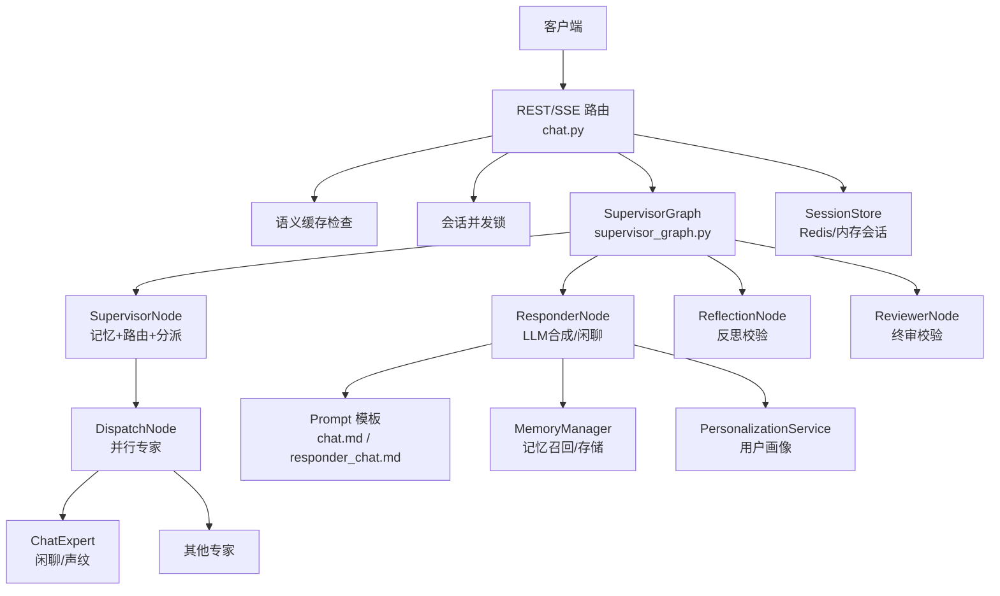
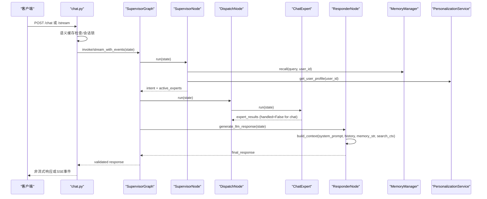
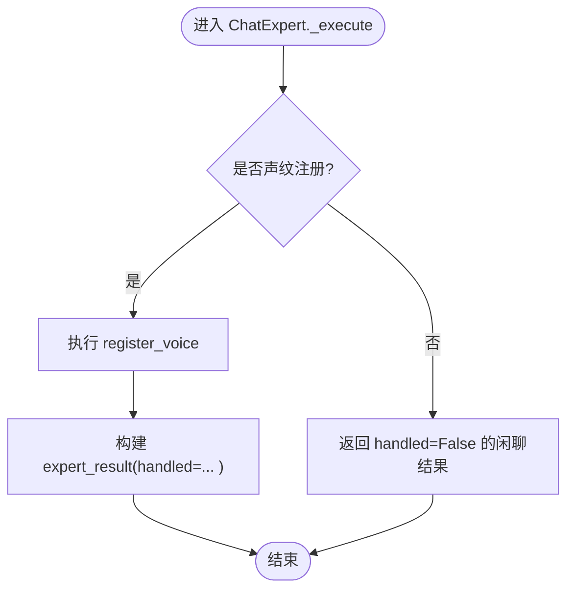
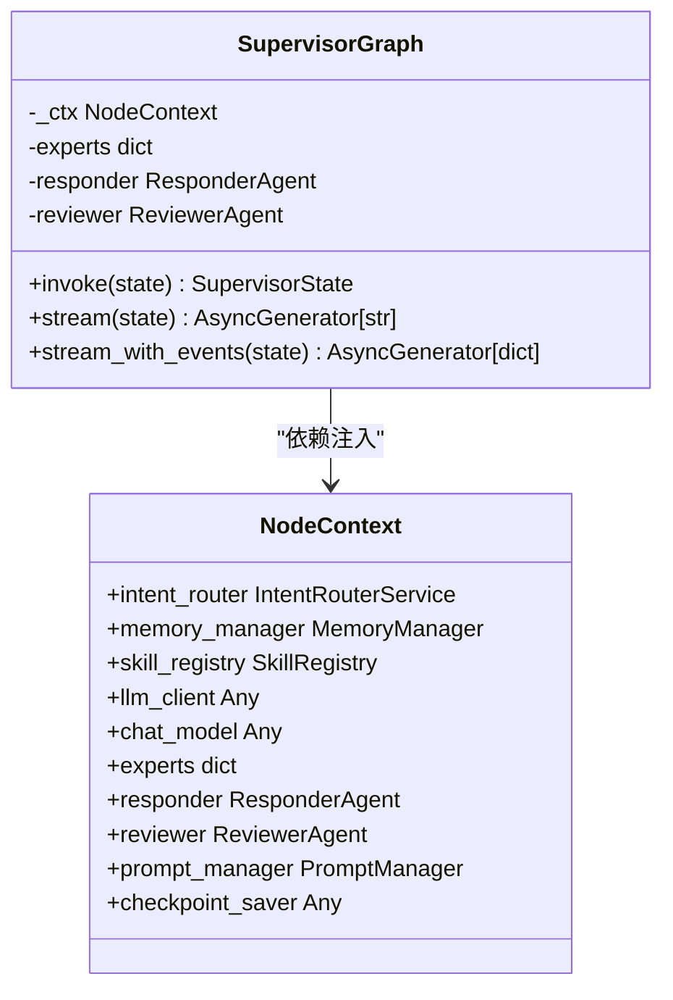
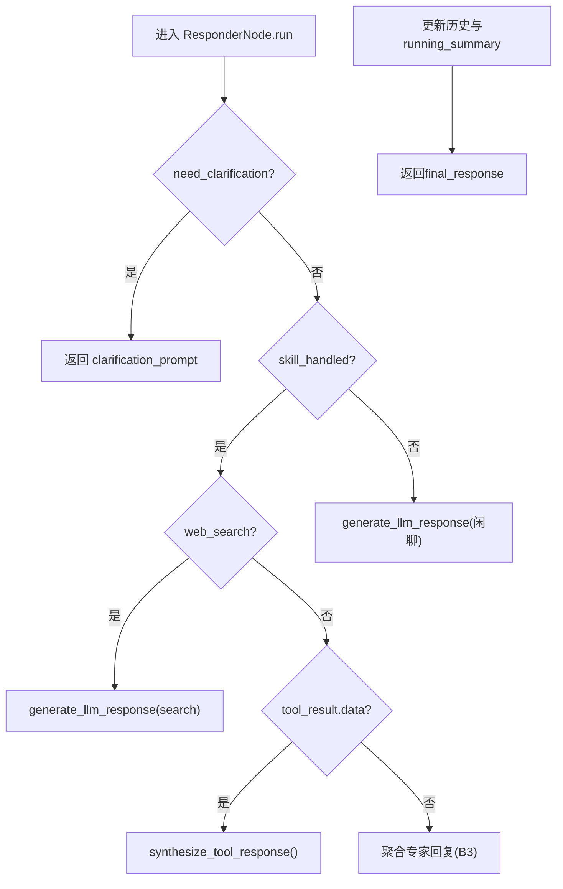
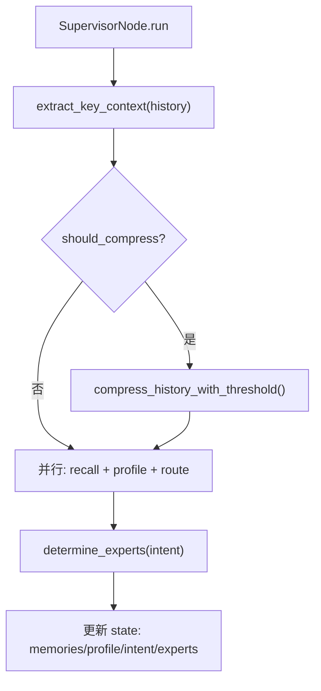
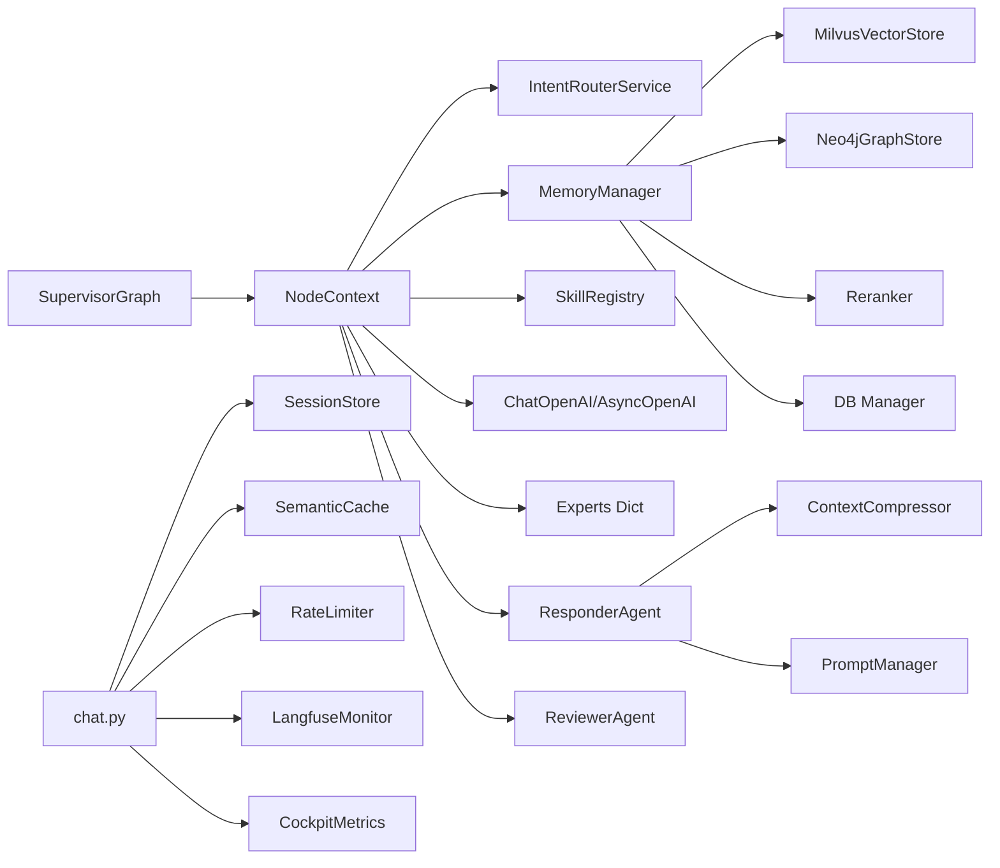

# ChatExpert聊天专家

<cite>
**本文引用的文件**   
- [chat_expert.py](file://backend_design/nexus/agent/experts/chat_expert.py)
- [supervisor_graph.py](file://backend_design/nexus/agent/supervisor_graph.py)
- [responder_node.py](file://backend_design/nexus/agent/nodes/responder_node.py)
- [supervisor_node.py](file://backend_design/nexus/agent/nodes/supervisor_node.py)
- [dispatch_node.py](file://backend_design/nexus/agent/nodes/dispatch_node.py)
- [context.py](file://backend_design/nexus/agent/nodes/context.py)
- [state.py](file://backend_design/nexus/models/state.py)
- [memory_manager.py](file://backend_design/nexus/memory/manager.py)
- [compressor.py](file://backend_design/nexus/memory/compressor.py)
- [personalization.py](file://backend_design/nexus/core/personalization.py)
- [chat.py](file://backend_design/nexus/api/routes/chat.py)
- [session_store.py](file://backend_design/nexus/middleware/session_store.py)
- [chat.md](file://backend_design/nexus/prompts/chat.md)
- [responder_chat.md](file://backend_design/nexus/prompts/responder_chat.md)
- [memory_extract.md](file://backend_design/nexus/prompts/memory_extract.md)
</cite>

## 目录
1. [简介](#简介)
2. [项目结构](#项目结构)
3. [核心组件](#核心组件)
4. [架构总览](#架构总览)
5. [详细组件分析](#详细组件分析)
6. [依赖关系分析](#依赖关系分析)
7. [性能考量](#性能考量)
8. [故障排查指南](#故障排查指南)
9. [结论](#结论)
10. [附录](#附录)

## 简介
本文件面向 ChatExpert 聊天专家，系统性阐述闲聊对话的处理逻辑与实现细节。内容覆盖：上下文理解、情感与个性化注入、与 LLM 的交互方式、Prompt 模板使用、响应优化策略；对话历史管理、记忆提取与长期记忆融合；多轮对话状态维护、话题延续处理与用户偏好学习机制。同时提供典型使用场景示例与性能调优建议，帮助开发者快速定位问题并优化系统表现。

## 项目结构
ChatExpert 作为“闲聊专家”Agent，嵌入到 Supervisor 多智能体工作流中，负责声纹注册与纯 LLM 闲聊分支。整体流程由 API 路由层接收请求，经语义缓存与会话锁保护后进入 SupervisorGraph 编排，SupervisorNode 完成记忆召回、意图路由与专家分派，DispatchNode 并行执行专家（含 ChatExpert），ResponderNode 汇总生成回复，ReflectionNode 与 ReviewerNode 进行质量校验与输出网关校验，最终通过 chat.py 的 REST/SSE 接口返回结果。

**图表来源** 
- [chat.py:319-464](file://backend_design/nexus/api/routes/chat.py#L319-L464)
- [supervisor_graph.py:93-179](file://backend_design/nexus/agent/supervisor_graph.py#L93-L179)
- [supervisor_node.py:64-331](file://backend_design/nexus/agent/nodes/supervisor_node.py#L64-L331)
- [dispatch_node.py:38-139](file://backend_design/nexus/agent/nodes/dispatch_node.py#L38-L139)
- [responder_node.py:57-174](file://backend_design/nexus/agent/nodes/responder_node.py#L57-L174)
- [memory_manager.py:98-150](file://backend_design/nexus/memory/manager.py#L98-L150)
- [personalization.py:46-70](file://backend_design/nexus/core/personalization.py#L46-L70)
- [session_store.py:91-114](file://backend_design/nexus/middleware/session_store.py#L91-L114)

**章节来源**
- [chat.py:319-464](file://backend_design/nexus/api/routes/chat.py#L319-L464)
- [supervisor_graph.py:93-179](file://backend_design/nexus/agent/supervisor_graph.py#L93-L179)

## 核心组件
- ChatExpert：闲聊与声纹注册的专家节点，不标记 handled=True 时交由 Responder 走 LLM 闲聊分支。
- SupervisorGraph：多智能体编排入口，统一 invoke/stream/stream_with_events 三种模式。
- ResponderNode：按分支选择回复策略（澄清/工具合成/车控聚合/LLM闲聊），构建 System Prompt 并调用 LLM。
- SupervisorNode：记忆召回、用户画像加载、意图路由与专家分派决策，支持快速路径与复合查询增强。
- DispatchNode：并行执行活跃专家，合并 expert_results 与 skill_action/search_context/tool_result 等字段。
- MemoryManager：三路召回（向量+图谱+BM25）+ Rerank，渐进式披露，习惯注入，对话向量化存储。
- ContextCompressor：阈值压缩、滚动摘要、关键上下文提取、查询增强、分级预算组装上下文。
- PersonalizationService：从 JSON 偏好与 MySQL 习惯构建用户画像文本，注入 Prompt。
- SessionStore：基于 Redis 的会话历史与滚动摘要持久化，支持内存降级。
- chat.py：REST/SSE 接口，语义缓存、会话锁、指标记录、日志持久化、取消任务。

**章节来源**
- [chat_expert.py:24-71](file://backend_design/nexus/agent/experts/chat_expert.py#L24-L71)
- [supervisor_graph.py:93-179](file://backend_design/nexus/agent/supervisor_graph.py#L93-L179)
- [responder_node.py:57-174](file://backend_design/nexus/agent/nodes/responder_node.py#L57-L174)
- [supervisor_node.py:64-331](file://backend_design/nexus/agent/nodes/supervisor_node.py#L64-L331)
- [dispatch_node.py:38-139](file://backend_design/nexus/agent/nodes/dispatch_node.py#L38-L139)
- [memory_manager.py:98-150](file://backend_design/nexus/memory/manager.py#L98-L150)
- [compressor.py:252-293](file://backend_design/nexus/memory/compressor.py#L252-L293)
- [personalization.py:46-70](file://backend_design/nexus/core/personalization.py#L46-L70)
- [session_store.py:91-114](file://backend_design/nexus/middleware/session_store.py#L91-L114)
- [chat.py:319-464](file://backend_design/nexus/api/routes/chat.py#L319-L464)

## 架构总览
ChatExpert 在闲聊场景下承担“纯 LLM 闲聊”和“声纹注册”两类职责。当意图未匹配任何技能或明确为闲聊时，Supervisor 将 active_experts 包含 "chat"，ChatExpert 返回 handled=False，随后 ResponderNode 根据系统提示词与上下文生成自然语言回复。整个链路经过 Reflection 与 Reviewer 双重校验，并通过 Output Gateway 确保输出安全。

**图表来源** 
- [chat.py:319-464](file://backend_design/nexus/api/routes/chat.py#L319-L464)
- [supervisor_graph.py:386-617](file://backend_design/nexus/agent/supervisor_graph.py#L386-L617)
- [supervisor_node.py:64-331](file://backend_design/nexus/agent/nodes/supervisor_node.py#L64-L331)
- [dispatch_node.py:38-139](file://backend_design/nexus/agent/nodes/dispatch_node.py#L38-L139)
- [chat_expert.py:24-71](file://backend_design/nexus/agent/experts/chat_expert.py#L24-L71)
- [responder_node.py:316-394](file://backend_design/nexus/agent/nodes/responder_node.py#L316-L394)
- [memory_manager.py:98-150](file://backend_design/nexus/memory/manager.py#L98-L150)
- [personalization.py:46-70](file://backend_design/nexus/core/personalization.py#L46-L70)

## 详细组件分析

### ChatExpert 闲聊与声纹注册
- 职责：处理声纹注册（返回 ACTION_REGISTER 指令供前端处理）与纯 LLM 闲聊（不标记 handled=True，交由 Responder）。
- 验证逻辑：若执行结果为 error 或消息为空，返回兜底文案；否则返回 result.message。
- 与 Responder 协作：闲聊分支不触发工具合成，直接走 LLM 生成。

**图表来源** 
- [chat_expert.py:49-71](file://backend_design/nexus/agent/experts/chat_expert.py#L49-L71)

**章节来源**
- [chat_expert.py:24-71](file://backend_design/nexus/agent/experts/chat_expert.py#L24-L71)

### SupervisorGraph 编排与流式事件
- 编排入口：提供 invoke、stream、stream_with_events 三种模式，保证全链路闭环（Supervisor → Experts → Responder → Reflection → Reviewer → Output Gateway）。
- 流式事件：thinking/intent/experts/action/chunk/done 结构化事件，便于前端展示思考过程与进度。
- 错误兜底：LLM 不可用时仍走完整链路，输出安全兜底回复。

**图表来源** 
- [supervisor_graph.py:93-179](file://backend_design/nexus/agent/supervisor_graph.py#L93-L179)
- [context.py:31-64](file://backend_design/nexus/agent/nodes/context.py#L31-L64)

**章节来源**
- [supervisor_graph.py:183-207](file://backend_design/nexus/agent/supervisor_graph.py#L183-L207)
- [supervisor_graph.py:386-617](file://backend_design/nexus/agent/supervisor_graph.py#L386-L617)

### ResponderNode 回复生成与 Prompt 构建
- 分支策略：澄清→搜索类技能→工具合成→车控聚合→LLM闲聊兜底。
- System Prompt 构建：动态选择 chat/search/vehicle 模板，注入用户画像、记忆、习惯、位置状态与关键上下文。
- 预/后校验：通过 ReflectionNode 拦截明显问题与检测编造历史，保障回复质量。

**图表来源** 
- [responder_node.py:57-174](file://backend_design/nexus/agent/nodes/responder_node.py#L57-L174)

**章节来源**
- [responder_node.py:316-394](file://backend_design/nexus/agent/nodes/responder_node.py#L316-L394)
- [responder_node.py:455-569](file://backend_design/nexus/agent/nodes/responder_node.py#L455-L569)

### SupervisorNode 记忆召回与意图路由
- 关键上下文提取：正则零 LLM 调用提取位置/偏好/身份，结合 GPS 逆地理编码补充。
- 阈值压缩：对话超阈值自动压缩旧对话为滚动摘要，保持上下文不丢失。
- 快速路径：纯车控指令跳过记忆召回与 RAG，显著降低延迟；混合意图与复合查询增强 LLM 多意图识别。

**图表来源** 
- [supervisor_node.py:64-331](file://backend_design/nexus/agent/nodes/supervisor_node.py#L64-L331)

**章节来源**
- [supervisor_node.py:102-146](file://backend_design/nexus/agent/nodes/supervisor_node.py#L102-L146)
- [supervisor_node.py:147-169](file://backend_design/nexus/agent/nodes/supervisor_node.py#L147-L169)
- [supervisor_node.py:170-259](file://backend_design/nexus/agent/nodes/supervisor_node.py#L170-L259)

### DispatchNode 专家并行与结果合并
- 并行执行：使用 asyncio.gather 并行调用所有活跃专家，异常捕获与日志记录。
- 结果合并：expert_results 累加，skill_action/search_context/tool_result 合并，has_side_effect 传递。

**章节来源**
- [dispatch_node.py:38-139](file://backend_design/nexus/agent/nodes/dispatch_node.py#L38-L139)

### MemoryManager 记忆召回与存储
- 三路召回：向量（Milvus）+ 图谱（Neo4j）+ BM25，RRF 融合 + Rerank 重排。
- 渐进式披露：简单指令 top_k=3，复杂查询 top_k=8。
- 习惯注入：从 MySQL user_habits 加载高频习惯，提升个性化。
- 对话向量化：store_conversation 将完整对话存入 Milvus，支持语义检索。
- 异步存储：fire-and-forget 任务，带重试与补偿回滚。

**章节来源**
- [memory_manager.py:98-150](file://backend_design/nexus/memory/manager.py#L98-L150)
- [memory_manager.py:152-181](file://backend_design/nexus/memory/manager.py#L152-L181)
- [memory_manager.py:183-210](file://backend_design/nexus/memory/manager.py#L183-L210)
- [memory_manager.py:212-300](file://backend_design/nexus/memory/manager.py#L212-L300)
- [memory_manager.py:302-335](file://backend_design/nexus/memory/manager.py#L302-L335)
- [memory_manager.py:336-387](file://backend_design/nexus/memory/manager.py#L336-L387)

### ContextCompressor 上下文压缩与预算控制
- 阈值压缩：对话轮数超过阈值时，旧对话压缩为滚动摘要，保留近期对话。
- 关键上下文提取：正则匹配位置/偏好/身份，零 LLM 调用。
- 查询增强：模糊查询自动补充位置/偏好关键词，提升召回质量。
- 分级预算：trim_messages 裁剪历史 + LLM 摘要，必要时压缩记忆上下文。

**章节来源**
- [compressor.py:252-293](file://backend_design/nexus/memory/compressor.py#L252-L293)
- [compressor.py:181-224](file://backend_design/nexus/memory/compressor.py#L181-L224)
- [compressor.py:226-244](file://backend_design/nexus/memory/compressor.py#L226-L244)
- [compressor.py:316-394](file://backend_design/nexus/memory/compressor.py#L316-L394)

### PersonalizationService 用户画像与偏好
- 数据来源：JSON 偏好文件 + MySQL user_habits 频次记录。
- 画像构建：音乐/美食/位置/空调偏好与高频习惯拼接为 profile_text，注入 Prompt。
- 本地音乐匹配：扫描 assets/audio/music/ 目录，按偏好匹配播放列表。

**章节来源**
- [personalization.py:46-70](file://backend_design/nexus/core/personalization.py#L46-L70)
- [personalization.py:144-197](file://backend_design/nexus/core/personalization.py#L144-L197)
- [personalization.py:199-236](file://backend_design/nexus/core/personalization.py#L199-L236)

### SessionStore 会话历史与滚动摘要
- Redis 优先，内存降级：连接失败自动降级为内存 dict，保证服务可用。
- 会话 TTL：活跃会话自动续期，过期清理。
- 滚动摘要：独立 key 存储 running_summary，与历史共享 TTL。

**章节来源**
- [session_store.py:91-114](file://backend_design/nexus/middleware/session_store.py#L91-L114)
- [session_store.py:232-288](file://backend_design/nexus/middleware/session_store.py#L232-L288)

### chat.py API 路由与语义缓存
- 语义缓存：车控指令与上下文敏感查询跳过缓存，避免副作用与错误上下文命中。
- 会话锁：同一 session 并发请求串行化，防止历史交叉污染。
- 指标与日志：Redis 实时指标 + MySQL 聊天日志持久化，管理员仅见聚合数据。
- SSE 流式：GenerationTaskPool 托管 pipeline，客户端断连不影响后台执行。

**章节来源**
- [chat.py:114-148](file://backend_design/nexus/api/routes/chat.py#L114-L148)
- [chat.py:224-245](file://backend_design/nexus/api/routes/chat.py#L224-L245)
- [chat.py:248-317](file://backend_design/nexus/api/routes/chat.py#L248-L317)
- [chat.py:319-464](file://backend_design/nexus/api/routes/chat.py#L319-L464)
- [chat.py:467-686](file://backend_design/nexus/api/routes/chat.py#L467-L686)

## 依赖关系分析
- SupervisorGraph 依赖 NodeContext 提供的共享服务（意图路由、记忆管理、技能注册、LLM 客户端、专家字典、Responder/Reviewer、Prompt 管理器）。
- ResponderNode 依赖 ContextCompressor 构建上下文与压缩历史，依赖 PromptManager 渲染模板。
- MemoryManager 依赖 MilvusVectorStore、Neo4jGraphStore、Reranker 与 DB Manager。
- chat.py 依赖 RateLimiter、SemanticCache、SessionStore、LangfuseMonitor、CockpitMetrics。

**图表来源** 
- [supervisor_graph.py:140-152](file://backend_design/nexus/agent/supervisor_graph.py#L140-L152)
- [context.py:31-64](file://backend_design/nexus/agent/nodes/context.py#L31-L64)
- [memory_manager.py:59-83](file://backend_design/nexus/memory/manager.py#L59-L83)
- [chat.py:22-41](file://backend_design/nexus/api/routes/chat.py#L22-L41)

**章节来源**
- [supervisor_graph.py:140-152](file://backend_design/nexus/agent/supervisor_graph.py#L140-L152)
- [context.py:31-64](file://backend_design/nexus/agent/nodes/context.py#L31-L64)
- [memory_manager.py:59-83](file://backend_design/nexus/memory/manager.py#L59-L83)
- [chat.py:22-41](file://backend_design/nexus/api/routes/chat.py#L22-L41)

## 性能考量
- 快速路径优化：纯车控指令跳过记忆召回与 RAG，Supervisor 延迟降至 <100ms。
- 渐进式披露：根据查询复杂度调整 top_k，平衡召回深度与延迟。
- 语义缓存：避免重复 LLM 调用，但车控与上下文敏感查询强制跳过。
- 会话锁与并发控制：防止同一 session 并发请求交叉污染，限制锁数量防内存泄漏。
- 异步任务池：SSE 流式通过 GenerationTaskPool 托管 pipeline，客户端断连不影响后台执行。
- 阈值压缩：长对话自动压缩旧历史为滚动摘要，减少上下文 token 占用。
- 三路召回 + Rerank：提升记忆召回精度，降低无关信息干扰。

**章节来源**
- [supervisor_node.py:170-259](file://backend_design/nexus/agent/nodes/supervisor_node.py#L170-L259)
- [memory_manager.py:98-150](file://backend_design/nexus/memory/manager.py#L98-L150)
- [chat.py:114-148](file://backend_design/nexus/api/routes/chat.py#L114-L148)
- [chat.py:224-245](file://backend_design/nexus/api/routes/chat.py#L224-L245)
- [chat.py:467-686](file://backend_design/nexus/api/routes/chat.py#L467-L686)
- [compressor.py:252-293](file://backend_design/nexus/memory/compressor.py#L252-L293)

## 故障排查指南
- LLM 不可用：SupervisorGraph 错误兜底，输出安全提示，仍走完整链路校验。
- 记忆召回失败：自动降级为向量-only 召回，记录警告日志。
- Neo4j/Milvus 写入失败：补偿回滚，确保一致性。
- 会话历史丢失：Redis 不可用时降级内存，TTL 自动续期。
- 流式中断：finally 块强制持久化 chat_logs，填充兜底话术。
- 缓存误命中：车控与上下文敏感查询跳过缓存，避免副作用。

**章节来源**
- [supervisor_graph.py:416-439](file://backend_design/nexus/agent/supervisor_graph.py#L416-L439)
- [memory_manager.py:120-127](file://backend_design/nexus/memory/manager.py#L120-L127)
- [memory_manager.py:278-296](file://backend_design/nexus/memory/manager.py#L278-L296)
- [session_store.py:69-80](file://backend_design/nexus/middleware/session_store.py#L69-L80)
- [chat.py:641-676](file://backend_design/nexus/api/routes/chat.py#L641-L676)
- [chat.py:114-148](file://backend_design/nexus/api/routes/chat.py#L114-L148)

## 结论
ChatExpert 作为闲聊专家，在多智能体工作流中与 Supervisor、Responder、Memory、Personalization 等组件协同，实现了上下文理解、个性化回复与高质量输出。通过快速路径、语义缓存、阈值压缩与三路召回等优化策略，系统在低延迟与高准确性之间取得平衡。建议在生产环境中关注 Redis/Milvus/Neo4j 可用性、LLM 限流与降级策略，以及会话锁与任务池的资源监控。

## 附录

### Prompt 模板与使用
- chat.md：闲聊主模板，注入当前时间、用户画像、长期记忆与用户习惯，强调简洁与安全。
- responder_chat.md：极简闲聊提示词，用于 Responder 快速生成。
- memory_extract.md：记忆提取模板，要求输出三元组格式。

**章节来源**
- [chat.md:1-39](file://backend_design/nexus/prompts/chat.md#L1-L39)
- [responder_chat.md:1-3](file://backend_design/nexus/prompts/responder_chat.md#L1-L3)
- [memory_extract.md:1-14](file://backend_design/nexus/prompts/memory_extract.md#L1-L14)

### 使用场景示例
- 纯闲聊：“今天天气怎么样？” → SupervisorNode 快速判断非车控，走 LLM 闲聊，注入位置与时间。
- 复合查询：“帮我查酒旅服务，推荐一些美食，打开车窗” → 启发式识别部分意图，LLM 补充识别，车控与搜索分别处理，Responder 合并回复。
- 声纹注册：“我是小明” → ChatExpert 执行 register_voice，返回 ACTION_REGISTER 指令供前端处理。
- 对话历史查询：“我之前问了什么？” → SupervisorNode 检测到 History_Query_Action，调用 LLM 基于滚动摘要回答。

**章节来源**
- [supervisor_node.py:333-421](file://backend_design/nexus/agent/nodes/supervisor_node.py#L333-L421)
- [chat_expert.py:49-71](file://backend_design/nexus/agent/experts/chat_expert.py#L49-L71)
- [responder_node.py:455-569](file://backend_design/nexus/agent/nodes/responder_node.py#L455-L569)

### 状态模型与字段说明
- SupervisorState：TypedDict 定义多智能体共享状态，包含输入、记忆、意图、专家输出、对话、最终输出与可观测性字段。
- reducer 机制：list 用 add 累加，dict 用 merge_dict 合并，确保并行写入一致性。

**章节来源**
- [state.py:38-107](file://backend_design/nexus/models/state.py#L38-L107)
- [state.py:108-165](file://backend_design/nexus/models/state.py#L108-L165)