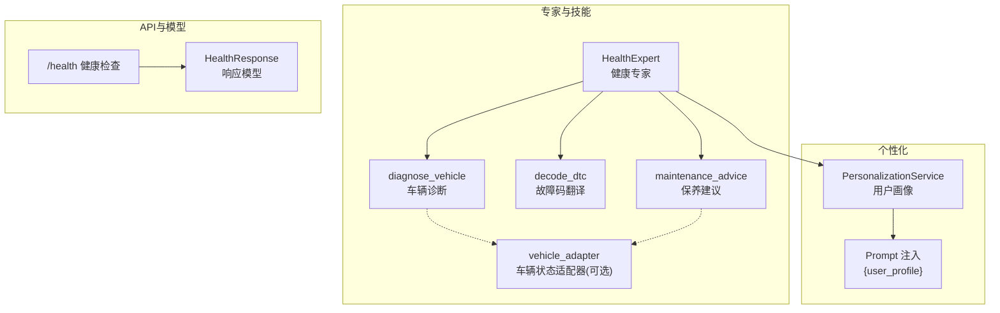
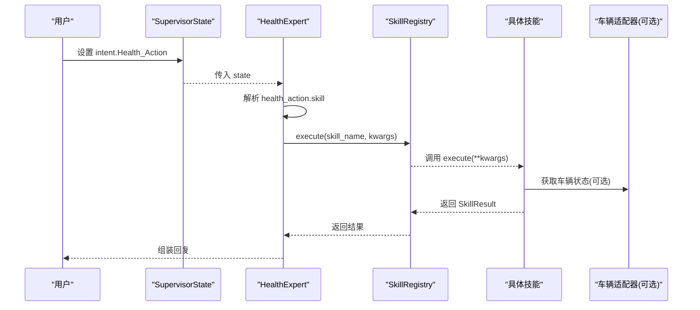
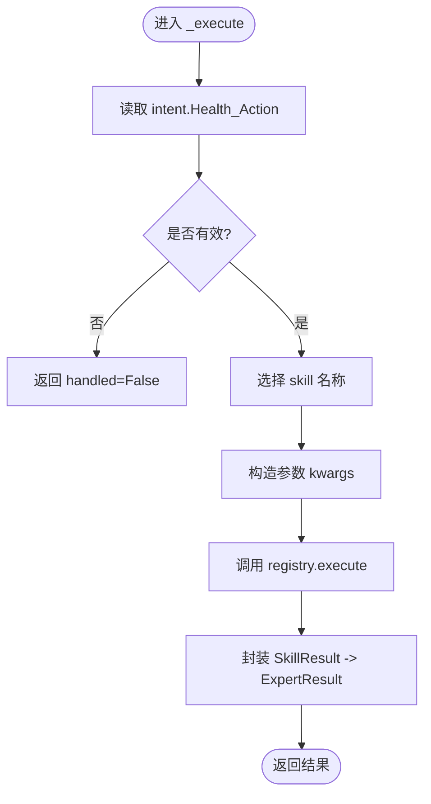
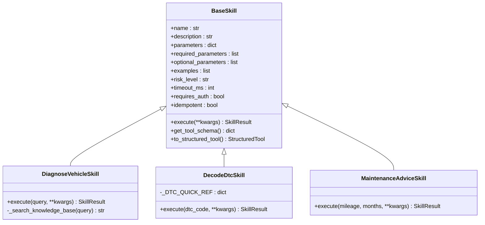
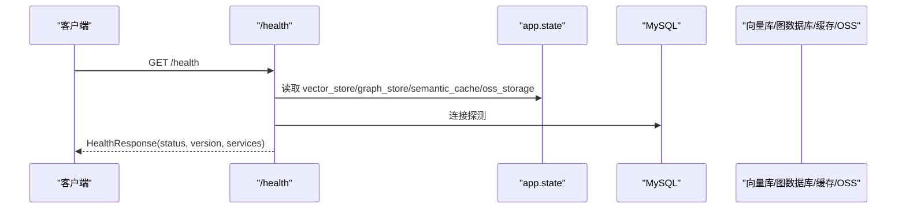
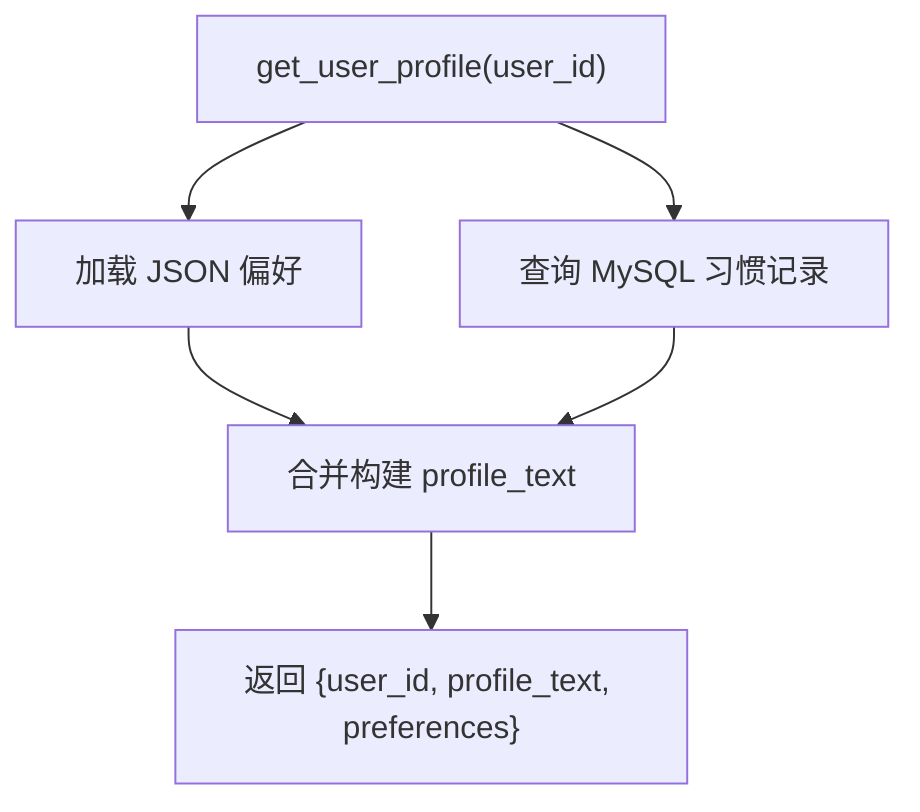
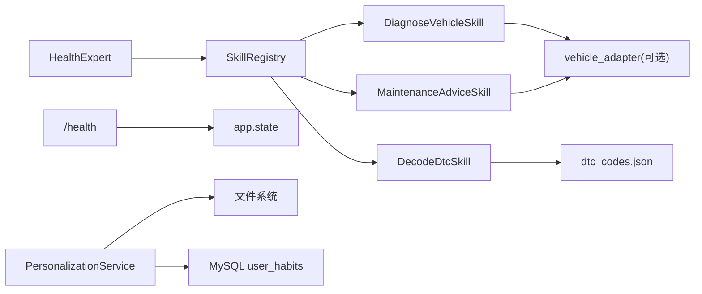

# HealthExpert健康专家

<cite>
**本文引用的文件**   
- [health_expert.py](file://backend_design/nexus/agent/experts/health_expert.py)
- [health.py](file://backend_design/nexus/skills/health.py)
- [base.py](file://backend_design/nexus/skills/base.py)
- [health.py](file://backend_design/nexus/api/routes/health.py)
- [schemas.py](file://backend_design/nexus/models/schemas.py)
- [personalization.py](file://backend_design/nexus/core/personalization.py)
- [default_user.json](file://data/preferences/default_user.json)
</cite>

## 目录
1. [引言](#引言)
2. [项目结构](#项目结构)
3. [核心组件](#核心组件)
4. [架构总览](#架构总览)
5. [详细组件分析](#详细组件分析)
6. [依赖关系分析](#依赖关系分析)
7. [性能考量](#性能考量)
8. [故障排查指南](#故障排查指南)
9. [结论](#结论)
10. [附录](#附录)

## 引言
本文件面向 HealthExpert 健康专家，系统化阐述健康数据的收集、分析与个性化建议生成逻辑，并说明与健康设备的集成方式、数据同步与健康指标监测机制。当前仓库中“健康”能力聚焦于车辆健康（故障诊断、故障码翻译、保养建议），同时提供系统级健康检查接口与用户个性化画像注入能力。文档将基于现有代码实现进行客观描述，并对未来扩展点给出指引。

## 项目结构
HealthExpert 相关能力分布在以下模块：
- 专家路由层：根据意图将请求路由到健康专家
- 技能层：具体健康技能（诊断、故障码翻译、保养建议）
- API 层：系统健康检查与基础信息返回
- 模型层：统一响应结构定义
- 个性化服务：用户偏好与习惯画像构建，用于提示词注入
- 数据与配置：默认用户偏好文件

图表来源
- [health_expert.py:24-74](file://backend_design/nexus/agent/experts/health_expert.py#L24-L74)
- [health.py:47-228](file://backend_design/nexus/skills/health.py#L47-L228)
- [health.py:26-95](file://backend_design/nexus/api/routes/health.py#L26-L95)
- [schemas.py:70-75](file://backend_design/nexus/models/schemas.py#L70-L75)
- [personalization.py:46-70](file://backend_design/nexus/core/personalization.py#L46-L70)

章节来源
- [health_expert.py:24-74](file://backend_design/nexus/agent/experts/health_expert.py#L24-L74)
- [health.py:47-228](file://backend_design/nexus/skills/health.py#L47-L228)
- [health.py:26-95](file://backend_design/nexus/api/routes/health.py#L26-L95)
- [schemas.py:70-75](file://backend_design/nexus/models/schemas.py#L70-L75)
- [personalization.py:46-70](file://backend_design/nexus/core/personalization.py#L46-L70)

## 核心组件
- 健康专家（HealthExpert）
  - 负责解析意图中的 Health_Action，按 skill 名称分发到对应技能执行
  - 支持 diagnose_vehicle、decode_dtc、maintenance_advice 三类动作
  - 通过 SkillRegistry 调用技能，封装统一结果返回

- 健康技能组（skills/health.py）
  - DiagnoseVehicleSkill：结合车辆实时状态与知识库检索（当前为占位）输出诊断建议
  - DecodeDtcSkill：从本地速查表或知识库解释 OBD-II 故障码
  - MaintenanceAdviceSkill：依据里程与时间规则生成保养建议，可自动读取车辆里程

- 技能基类与注册（skills/base.py）
  - BaseSkill：定义技能元数据、参数校验、结构化工具转换、缓存策略等
  - register_skill：装饰器自动注册技能到全局表，供专家调度

- 系统健康检查（api/routes/health.py）
  - /health 端点检查 Milvus、Neo4j、Redis、MySQL、OSS、Agent 等组件状态
  - 返回 HealthResponse 统一结构

- 个性化服务（core/personalization.py）
  - 加载用户偏好 JSON 与 MySQL 习惯记录，构建用户画像文本注入 Prompt
  - 提供音乐匹配、偏好保存等辅助能力

章节来源
- [health_expert.py:24-74](file://backend_design/nexus/agent/experts/health_expert.py#L24-L74)
- [health.py:47-228](file://backend_design/nexus/skills/health.py#L47-L228)
- [base.py:35-189](file://backend_design/nexus/skills/base.py#L35-L189)
- [health.py:26-95](file://backend_design/nexus/api/routes/health.py#L26-L95)
- [personalization.py:46-70](file://backend_design/nexus/core/personalization.py#L46-L70)

## 架构总览
HealthExpert 的调用链路如下：
- 上层意图识别后，将 Health_Action 写入 SupervisorState
- HealthExpert 解析意图并选择具体技能
- 技能执行可能访问车辆状态适配器、本地速查表或知识库（预留）
- 最终返回统一 SkillResult，由专家封装为回复

图表来源
- [health_expert.py:36-73](file://backend_design/nexus/agent/experts/health_expert.py#L36-L73)
- [health.py:70-102](file://backend_design/nexus/skills/health.py#L70-L102)
- [health.py:137-162](file://backend_design/nexus/skills/health.py#L137-L162)
- [health.py:189-227](file://backend_design/nexus/skills/health.py#L189-L227)

## 详细组件分析

### 健康专家（HealthExpert）
- 职责
  - 从 state 中提取 Health_Action，确定 skill 名称与参数
  - 对 decode_dtc 做必要参数校验（dtc_code）
  - 调用 SkillRegistry.execute 执行技能，封装统一结果

- 关键流程
  - 若未提供 Health_Action，直接返回 handled=False
  - 根据 skill 名称构造参数字典
  - 执行后返回 action、reply、search_context、handled、skill_status

图表来源
- [health_expert.py:36-73](file://backend_design/nexus/agent/experts/health_expert.py#L36-L73)

章节来源
- [health_expert.py:24-74](file://backend_design/nexus/agent/experts/health_expert.py#L24-L74)

### 健康技能组（skills/health.py）
- DiagnoseVehicleSkill
  - 输入：query（问题描述）、可选 user_id
  - 行为：尝试通过 vehicle_adapter 获取车辆状态；检索知识库（当前为占位）；组合诊断报告
  - 输出：包含状态与建议的文本，附带 search_context 与 metadata

- DecodeDtcSkill
  - 输入：dtc_code（OBD-II 故障码）
  - 行为：从本地速查表 dtc_codes.json 查找释义；未找到时给出引导性回复
  - 输出：故障码释义文本

- MaintenanceAdviceSkill
  - 输入：mileage（公里数）、months（月数）
  - 行为：优先从 vehicle_adapter 读取里程；按里程与时间规则生成保养建议
  - 输出：保养建议清单

图表来源
- [base.py:116-189](file://backend_design/nexus/skills/base.py#L116-L189)
- [health.py:53-112](file://backend_design/nexus/skills/health.py#L53-L112)
- [health.py:121-162](file://backend_design/nexus/skills/health.py#L121-L162)
- [health.py:171-227](file://backend_design/nexus/skills/health.py#L171-L227)

章节来源
- [health.py:47-228](file://backend_design/nexus/skills/health.py#L47-L228)
- [base.py:35-189](file://backend_design/nexus/skills/base.py#L35-L189)

### 系统健康检查（api/routes/health.py）
- 功能
  - 检测向量库（Milvus）、知识图谱（Neo4j）、缓存（Redis）、数据库（MySQL）、对象存储（OSS）、Agent 工作流就绪状态
  - 汇总各组件状态，返回 healthy/degraded 整体健康度

- 数据结构
  - HealthResponse：status、version、services

图表来源
- [health.py:26-95](file://backend_design/nexus/api/routes/health.py#L26-L95)
- [schemas.py:70-75](file://backend_design/nexus/models/schemas.py#L70-L75)

章节来源
- [health.py:26-95](file://backend_design/nexus/api/routes/health.py#L26-L95)
- [schemas.py:70-75](file://backend_design/nexus/models/schemas.py#L70-L75)

### 个性化服务（core/personalization.py）
- 功能
  - 读取 data/preferences/{user_id}.json 与 MySQL user_habits 表
  - 构建用户画像文本，注入到 Prompt 的 {user_profile} 占位符
  - 支持音乐匹配与偏好保存

- 数据源
  - 默认用户偏好：data/preferences/default_user.json
  - 用户习惯：MySQL user_habits（频次加权）

图表来源
- [personalization.py:46-70](file://backend_design/nexus/core/personalization.py#L46-L70)
- [personalization.py:103-142](file://backend_design/nexus/core/personalization.py#L103-L142)
- [personalization.py:144-197](file://backend_design/nexus/core/personalization.py#L144-L197)

章节来源
- [personalization.py:46-70](file://backend_design/nexus/core/personalization.py#L46-L70)
- [personalization.py:103-142](file://backend_design/nexus/core/personalization.py#L103-L142)
- [personalization.py:144-197](file://backend_design/nexus/core/personalization.py#L144-L197)
- [default_user.json:1-46](file://data/preferences/default_user.json#L1-L46)

## 依赖关系分析
- 健康专家依赖 SkillRegistry 与具体技能实现
- 技能实现依赖：
  - 车辆适配器（可选）：用于获取实时车辆状态与里程
  - 本地速查表：dtc_codes.json（故障码释义）
  - 知识库（预留）：Cherry KB（当前未集成）
- 系统健康检查依赖应用状态对象与各组件实例
- 个性化服务依赖文件系统与 MySQL 数据库

图表来源
- [health_expert.py:36-73](file://backend_design/nexus/agent/experts/health_expert.py#L36-L73)
- [health.py:47-228](file://backend_design/nexus/skills/health.py#L47-L228)
- [health.py:26-95](file://backend_design/nexus/api/routes/health.py#L26-L95)
- [personalization.py:103-142](file://backend_design/nexus/core/personalization.py#L103-L142)

章节来源
- [health_expert.py:36-73](file://backend_design/nexus/agent/experts/health_expert.py#L36-L73)
- [health.py:47-228](file://backend_design/nexus/skills/health.py#L47-L228)
- [health.py:26-95](file://backend_design/nexus/api/routes/health.py#L26-L95)
- [personalization.py:103-142](file://backend_design/nexus/core/personalization.py#L103-L142)

## 性能考量
- 技能缓存
  - 通过 @register_skill 的 cache_ttl 控制缓存有效期，减少重复计算与外部调用
  - 有副作用的技能应禁用缓存（has_side_effect=True）
- 异步执行
  - 技能 execute 方法为异步，避免阻塞主线程
- 外部依赖降级
  - 知识库检索与车辆状态获取失败时，仍返回可用建议或兜底文案
- 健康检查快速反馈
  - /health 使用短超时探测 MySQL，确保监控及时

[本节为通用指导，不直接分析具体文件]

## 故障排查指南
- 健康检查异常
  - 查看 /health 返回的 services 字段，定位具体组件状态（connected/disconnected/not_configured）
  - 检查 app.state 中相应实例是否正确初始化
- 技能执行失败
  - 确认 SkillRegistry 已正确扫描并注册技能
  - 检查参数校验（如 decode_dtc 缺少 dtc_code）
  - 查看日志中 vehicle_adapter 调用与知识库检索的警告/错误
- 个性化画像为空
  - 确认 data/preferences/{user_id}.json 是否存在且格式正确
  - 检查 MySQL 连接与 user_habits 表数据

章节来源
- [health.py:26-95](file://backend_design/nexus/api/routes/health.py#L26-L95)
- [health.py:137-162](file://backend_design/nexus/skills/health.py#L137-L162)
- [personalization.py:72-101](file://backend_design/nexus/core/personalization.py#L72-L101)

## 结论
当前 HealthExpert 聚焦于车辆健康领域，提供故障诊断、故障码翻译与保养建议三大技能，并通过 SkillRegistry 与 BaseSkill 体系实现可扩展的技能编排。系统健康检查接口保障基础设施可用性，个性化服务为用户画像注入提供支撑。未来可在知识库检索、设备集成、健康指标采集与分析方面进一步扩展。

[本节为总结性内容，不直接分析具体文件]

## 附录

### 健康数据收集与设备集成（现状与规划）
- 现状
  - 车辆健康技能可通过 vehicle_adapter 获取车辆状态与里程（可选）
  - 故障码释义依赖本地 dtc_codes.json 速查表
  - 知识库检索（Cherry KB）尚未集成，当前返回空
- 规划建议
  - 接入更多健康设备（可穿戴、体脂秤、血压计等）以采集运动、睡眠、饮食等指标
  - 建立数据同步通道（定时拉取/事件推送），统一数据模型与时间戳
  - 引入趋势分析与阈值预警，结合个性化画像生成健康建议

[本节为概念性内容，不直接分析具体文件]

### 隐私保护与合规性要求（建议）
- 数据最小化：仅收集必要的健康数据，明确用途与保留周期
- 加密传输与存储：TLS 传输、敏感字段加密存储
- 访问控制：基于用户 ID 的权限隔离，审计日志记录
- 合规遵循：遵循相关法律法规（如个人信息保护法），提供用户授权与删除机制

[本节为通用指导，不直接分析具体文件]