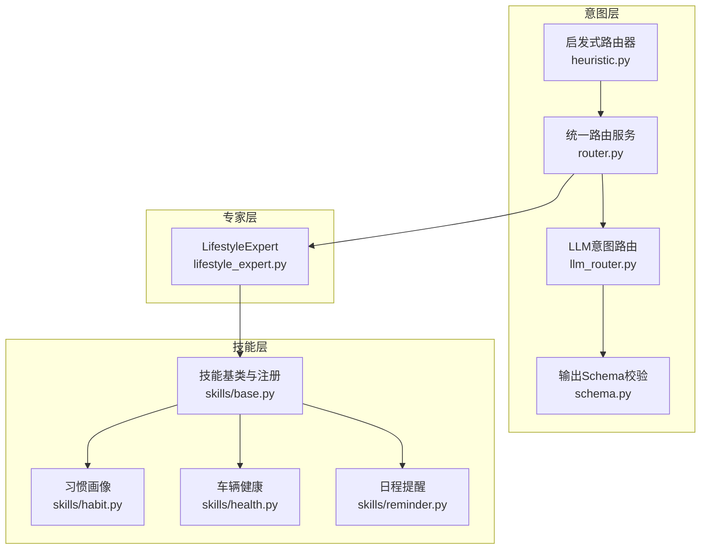
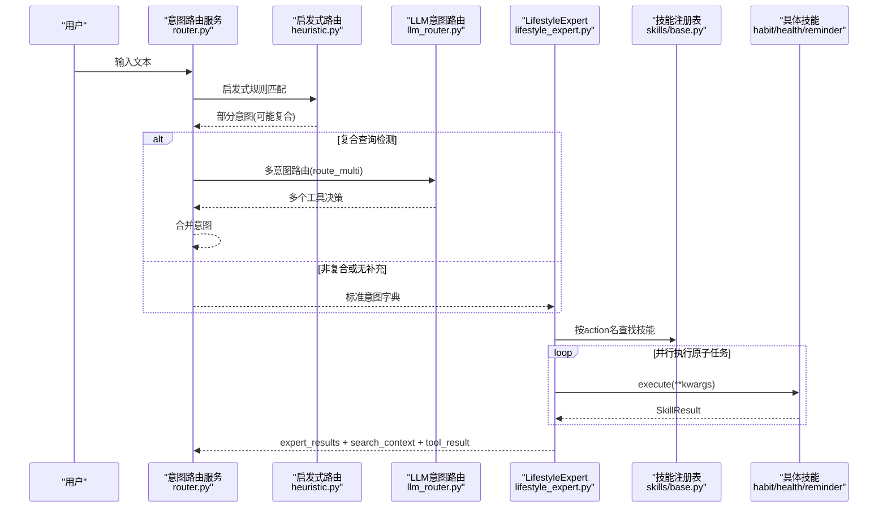
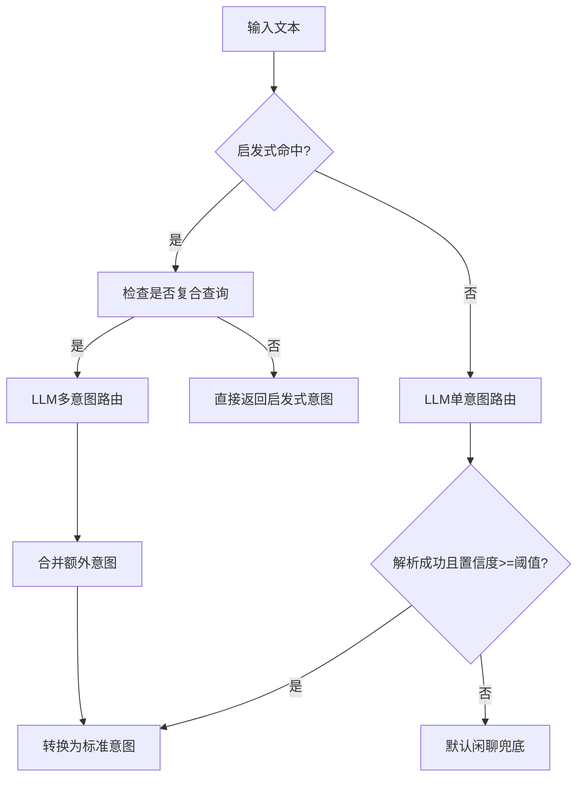
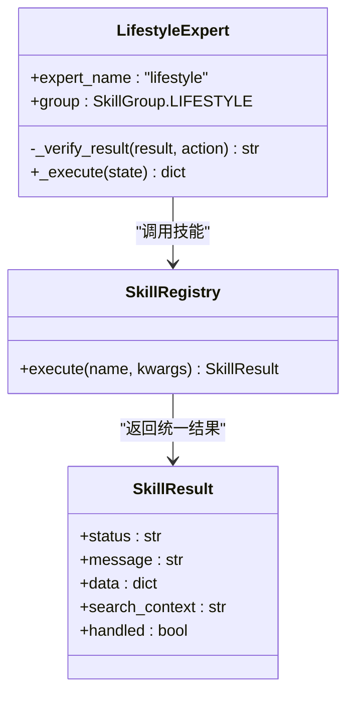
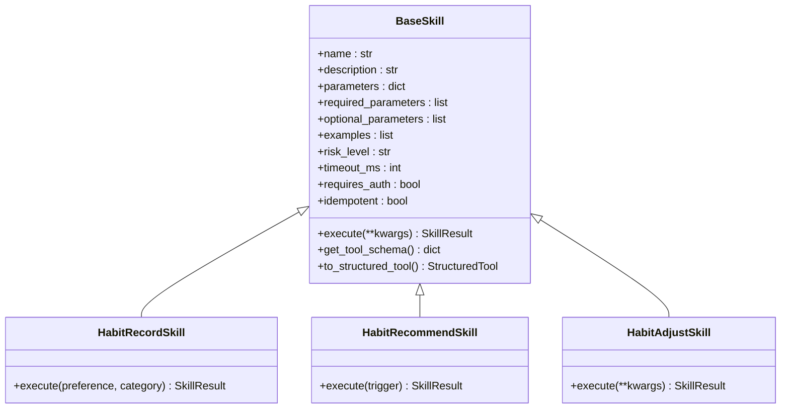
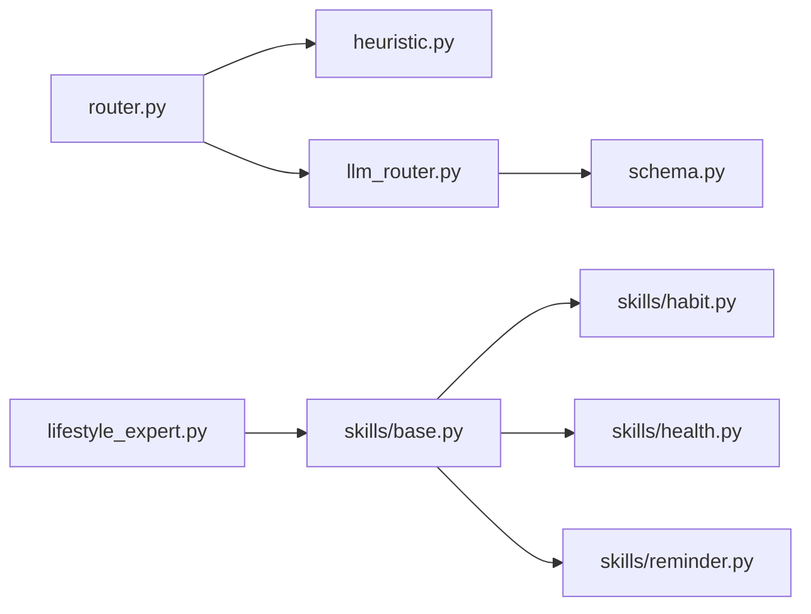

# LifestyleExpert生活专家

<cite>
**本文引用的文件**
- [lifestyle_expert.py](file://backend_design/nexus/agent/experts/lifestyle_expert.py)
- [base.py](file://backend_design/nexus/skills/base.py)
- [router.py](file://backend_design/nexus/intent/router.py)
- [llm_router.py](file://backend_design/nexus/intent/llm_router.py)
- [heuristic.py](file://backend_design/nexus/intent/heuristic.py)
- [schema.py](file://backend_design/nexus/intent/schema.py)
- [__init__.py](file://backend_design/nexus/skills/__init__.py)
- [habit.py](file://backend_design/nexus/skills/habit.py)
- [health.py](file://backend_design/nexus/skills/health.py)
- [reminder.py](file://backend_design/nexus/skills/reminder.py)
</cite>

## 目录
1. [简介](#简介)
2. [项目结构](#项目结构)
3. [核心组件](#核心组件)
4. [架构总览](#架构总览)
5. [详细组件分析](#详细组件分析)
6. [依赖关系分析](#依赖关系分析)
7. [性能考量](#性能考量)
8. [故障排查指南](#故障排查指南)
9. [结论](#结论)
10. [附录](#附录)

## 简介
本文件为 LifestyleExpert 生活专家的系统级文档，聚焦生活服务意图分类、Web搜索集成与结果聚合逻辑。内容覆盖搜索引擎API调用、结果过滤与智能排序、天气查询、新闻获取、餐厅推荐等生活技能的实现方式；并给出搜索结果质量评估、去重机制、用户偏好学习的方法论与扩展指南（数据源接入、技能注册、路由增强）。

## 项目结构
LifestyleExpert 位于 Agent 专家层，负责将“意图”转化为“多动作并行执行”，并通过统一技能注册表调度具体能力。关键路径：
- 意图路由：启发式规则 + LLM 多意图识别 → 标准意图字典
- 专家执行：LifestyleExpert 收集匹配动作，异步并发执行，聚合结果
- 技能体系：BaseSkill + @register_skill 装饰器自动注册，支持 Tool Schema 生成与 LangChain 集成

**图表来源**
- [router.py:103-217](file://backend_design/nexus/intent/router.py#L103-L217)
- [llm_router.py:102-168](file://backend_design/nexus/intent/llm_router.py#L102-L168)
- [schema.py:70-135](file://backend_design/nexus/intent/schema.py#L70-L135)
- [lifestyle_expert.py:45-256](file://backend_design/nexus/agent/experts/lifestyle_expert.py#L45-L256)
- [base.py:50-89](file://backend_design/nexus/skills/base.py#L50-L89)
- [habit.py:26-76](file://backend_design/nexus/skills/habit.py#L26-L76)
- [health.py:47-113](file://backend_design/nexus/skills/health.py#L47-L113)
- [reminder.py:51-122](file://backend_design/nexus/skills/reminder.py#L51-L122)

**章节来源**
- [router.py:103-217](file://backend_design/nexus/intent/router.py#L103-L217)
- [lifestyle_expert.py:45-256](file://backend_design/nexus/agent/experts/lifestyle_expert.py#L45-L256)
- [base.py:50-89](file://backend_design/nexus/skills/base.py#L50-L89)

## 核心组件
- 意图路由服务：三级路由策略（启发式→LLM→默认闲聊），支持复合查询增强与结构化日志。
- LLM意图路由：Function Calling 选择最合适的技能，支持单意图与多意图识别，带JSON解析重试。
- 启发式路由器：关键词规则快速命中，分段解析避免跨域误匹配，支持周边POI、天气、点餐、搜索等。
- LifestyleExpert：将意图映射为原子任务，并发执行并聚合结果，处理互斥与主结果选择。
- 技能基类与注册：@register_skill 自动注册，to_structured_tool() 生成 OpenAI Function Calling Schema，支持缓存TTL与副作用控制。
- 生活相关技能：习惯画像、车辆健康、日程提醒等示例实现，展示数据持久化与外部系统交互模式。

**章节来源**
- [router.py:103-217](file://backend_design/nexus/intent/router.py#L103-L217)
- [llm_router.py:38-100](file://backend_design/nexus/intent/llm_router.py#L38-L100)
- [heuristic.py:46-89](file://backend_design/nexus/intent/heuristic.py#L46-L89)
- [lifestyle_expert.py:45-256](file://backend_design/nexus/agent/experts/lifestyle_expert.py#L45-L256)
- [base.py:116-189](file://backend_design/nexus/skills/base.py#L116-L189)

## 架构总览
下图展示从用户输入到技能执行的端到端流程，包括意图识别、多意图合并、专家并行执行与结果聚合。

**图表来源**
- [router.py:103-217](file://backend_design/nexus/intent/router.py#L103-L217)
- [llm_router.py:102-168](file://backend_design/nexus/intent/llm_router.py#L102-L168)
- [lifestyle_expert.py:45-256](file://backend_design/nexus/agent/experts/lifestyle_expert.py#L45-L256)
- [base.py:191-258](file://backend_design/nexus/skills/base.py#L191-L258)

## 详细组件分析

### 意图分类与路由
- 启发式路由：对复合指令进行分段解析，避免跨领域动词误匹配；优先识别时间、周边POI、天气、点餐等，再回退通用搜索。
- LLM路由：提供单意图与多意图两种模式，严格约束JSON输出，失败时自动重试；通过Schema校验防止格式漂移。
- 统一路由：三级降级策略，记录结构化路由日志，支持置信度阈值与澄清问题返回。

**图表来源**
- [heuristic.py:46-89](file://backend_design/nexus/intent/heuristic.py#L46-L89)
- [llm_router.py:102-168](file://backend_design/nexus/intent/llm_router.py#L102-L168)
- [router.py:103-217](file://backend_design/nexus/intent/router.py#L103-L217)
- [schema.py:70-135](file://backend_design/nexus/intent/schema.py#L70-L135)

**章节来源**
- [heuristic.py:46-89](file://backend_design/nexus/intent/heuristic.py#L46-L89)
- [llm_router.py:38-100](file://backend_design/nexus/intent/llm_router.py#L38-L100)
- [router.py:103-217](file://backend_design/nexus/intent/router.py#L103-L217)
- [schema.py:70-135](file://backend_design/nexus/intent/schema.py#L70-L135)

### LifestyleExpert 执行与聚合
- 原子任务收集：根据意图字段收集 POI 搜索、天气查询、联网搜索、点餐、提醒等任务。
- 互斥策略：天气查询命中时跳过联网搜索，避免重复。
- 并发执行：单任务直接await，多任务使用 asyncio.gather 并行执行，异常捕获并记录。
- 结果聚合：合并 search_context，选择首个 handled=True 的结果为主结果，提升 tool_result 与 skill_action。

**图表来源**
- [lifestyle_expert.py:24-44](file://backend_design/nexus/agent/experts/lifestyle_expert.py#L24-L44)
- [lifestyle_expert.py:45-256](file://backend_design/nexus/agent/experts/lifestyle_expert.py#L45-L256)
- [base.py:92-114](file://backend_design/nexus/skills/base.py#L92-L114)

**章节来源**
- [lifestyle_expert.py:45-256](file://backend_design/nexus/agent/experts/lifestyle_expert.py#L45-L256)

### 技能基类与注册机制
- @register_skill：标记技能名称、分组、描述、副作用与缓存TTL，写入全局注册表。
- BaseSkill：定义 execute() 接口、Tool Schema 生成、LangChain StructuredTool 适配。
- to_structured_tool()：动态创建 Pydantic args_schema，包装异步执行，兼容同步调用。

**图表来源**
- [base.py:116-189](file://backend_design/nexus/skills/base.py#L116-L189)
- [base.py:191-258](file://backend_design/nexus/skills/base.py#L191-L258)
- [habit.py:26-76](file://backend_design/nexus/skills/habit.py#L26-L76)
- [habit.py:78-139](file://backend_design/nexus/skills/habit.py#L78-L139)
- [habit.py:141-215](file://backend_design/nexus/skills/habit.py#L141-L215)

**章节来源**
- [base.py:50-89](file://backend_design/nexus/skills/base.py#L50-L89)
- [base.py:116-189](file://backend_design/nexus/skills/base.py#L116-L189)
- [base.py:191-258](file://backend_design/nexus/skills/base.py#L191-L258)
- [habit.py:26-76](file://backend_design/nexus/skills/habit.py#L26-L76)

### 生活技能实现要点
- 天气查询：启发式识别 Weather_Action，LifestyleExpert 调用 weather_query 技能；避免与通用搜索冲突。
- 新闻获取：Need_Search 触发 web_search 技能；结合 LLM 多意图识别提高召回。
- 餐厅推荐：Poi_Search_Action 优先高德 POI 搜索，poi_type=restaurant；fallback 到通用搜索。
- 日程提醒：set/query/cancel_reminder 基于 Redis Sorted Set 存储与查询，支持相对时间与ISO格式。
- 习惯画像：habit_record/recommend/adjust 读取/写入 Neo4j 图谱，驱动个性化推荐与车控调整。

**章节来源**
- [heuristic.py:635-657](file://backend_design/nexus/intent/heuristic.py#L635-L657)
- [heuristic.py:566-633](file://backend_design/nexus/intent/heuristic.py#L566-L633)
- [reminder.py:51-122](file://backend_design/nexus/skills/reminder.py#L51-L122)
- [reminder.py:147-218](file://backend_design/nexus/skills/reminder.py#L147-L218)
- [reminder.py:220-296](file://backend_design/nexus/skills/reminder.py#L220-L296)
- [habit.py:26-76](file://backend_design/nexus/skills/habit.py#L26-L76)

## 依赖关系分析
- 意图层依赖：HeuristicRouter、LLMIntentRouter、Schema 校验。
- 专家层依赖：SkillRegistry（由 skills/base.py 维护）、各具体技能模块。
- 技能层依赖：Redis（提醒）、Neo4j（习惯）、车辆适配器（健康诊断）。

**图表来源**
- [router.py:103-217](file://backend_design/nexus/intent/router.py#L103-L217)
- [llm_router.py:102-168](file://backend_design/nexus/intent/llm_router.py#L102-L168)
- [schema.py:70-135](file://backend_design/nexus/intent/schema.py#L70-L135)
- [lifestyle_expert.py:45-256](file://backend_design/nexus/agent/experts/lifestyle_expert.py#L45-L256)
- [base.py:50-89](file://backend_design/nexus/skills/base.py#L50-L89)

**章节来源**
- [__init__.py:22-28](file://backend_design/nexus/skills/__init__.py#L22-L28)
- [base.py:50-89](file://backend_design/nexus/skills/base.py#L50-L89)

## 性能考量
- 启发式路由：<1ms，覆盖常见车控与基础生活指令，减少LLM调用开销。
- LLM路由：1-3s，支持重试与Schema校验，失败时降级至默认闲聊。
- 并发执行：LifestyleExpert 使用 asyncio.gather 并行执行原子任务，显著降低整体延迟。
- 缓存策略：BaseSkill.cache_ttl 控制可缓存技能，副作用技能禁止缓存。
- 互斥优化：天气查询命中时跳过联网搜索，避免重复请求。

[本节为通用指导，不直接分析具体文件]

## 故障排查指南
- 意图路由失败：检查启发式命中日志与LLM JSON解析重试；确认tool_catalog与min_confidence配置。
- 技能执行异常：查看LifestyleExpert聚合阶段的错误日志与metadata；确认SkillResult.status与message。
- Redis不可用：提醒技能降级提示“服务暂不可用”；检查连接参数与键前缀。
- Neo4j未集成：习惯技能写入/查询失败时记录警告；确认graph_store注入与方法存在性。

**章节来源**
- [lifestyle_expert.py:194-207](file://backend_design/nexus/agent/experts/lifestyle_expert.py#L194-L207)
- [reminder.py:95-122](file://backend_design/nexus/skills/reminder.py#L95-L122)
- [habit.py:61-76](file://backend_design/nexus/skills/habit.py#L61-L76)

## 结论
LifestyleExpert 以“意图分层+专家并行+技能注册”为核心，实现了高可用、可扩展的生活服务能力。通过启发式与LLM双通道路由、并发执行与结果聚合，系统在复杂复合指令下仍保持低延迟与高准确率。未来可进一步丰富数据源接入、强化结果质量评估与去重机制，并深化用户偏好学习与个性化推荐。

[本节为总结性内容，不直接分析具体文件]

## 附录

### Web搜索集成与结果聚合建议
- 搜索引擎API调用：在web_search技能中封装HTTP客户端，支持超时、重试与熔断；返回结构化条目列表。
- 结果过滤：按相关性、时效性、权威性打分；剔除广告与低质页面；支持地域与语言过滤。
- 智能排序算法：融合TF-IDF/向量相似度、点击率、用户历史偏好权重；引入多样性保障（MMR）。
- 质量评估：人工标注样本集，计算Precision/Recall/F1；A/B测试不同排序策略。
- 去重机制：基于标题与摘要的语义相似度聚类；URL规范化与去重索引。
- 用户偏好学习：记录点击、停留时长、收藏行为；更新偏好向量，影响后续排序权重。

[本节为方法论指导，不直接分析具体文件]

### 生活技能扩展方法与数据源接入指南
- 新增技能步骤：
  1) 继承BaseSkill，实现execute()；
  2) 使用@register_skill注册，声明name/group/description/parameters；
  3) 在skills/__init__.py导入模块触发装饰器；
  4) 在heuristic.py或llm_router.py添加意图识别与映射。
- 数据源接入：
  - HTTP API：封装客户端，处理鉴权、限流、错误码；
  - 数据库/图数据库：通过适配器注入，确保事务与一致性；
  - 缓存层：Redis/Memcached用于热点数据与中间结果。
- 安全与合规：敏感信息脱敏、访问审计、权限控制。

**章节来源**
- [base.py:50-89](file://backend_design/nexus/skills/base.py#L50-L89)
- [__init__.py:22-28](file://backend_design/nexus/skills/__init__.py#L22-L28)
- [heuristic.py:659-727](file://backend_design/nexus/intent/heuristic.py#L659-L727)
- [router.py:354-403](file://backend_design/nexus/intent/router.py#L354-L403)