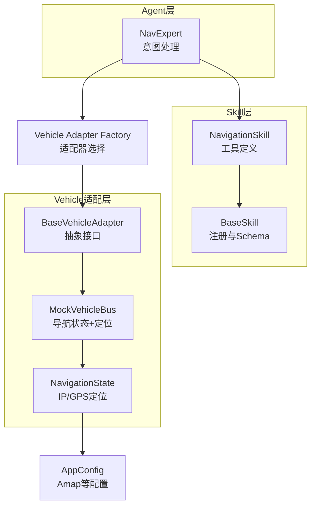
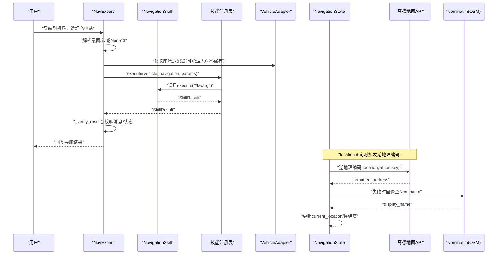
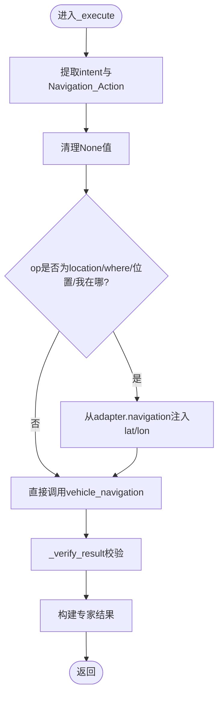
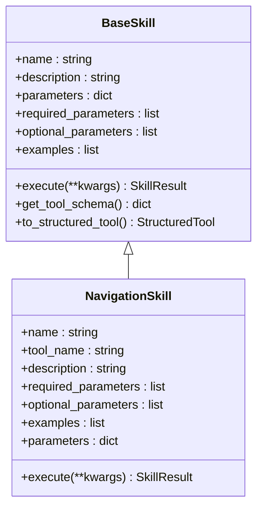
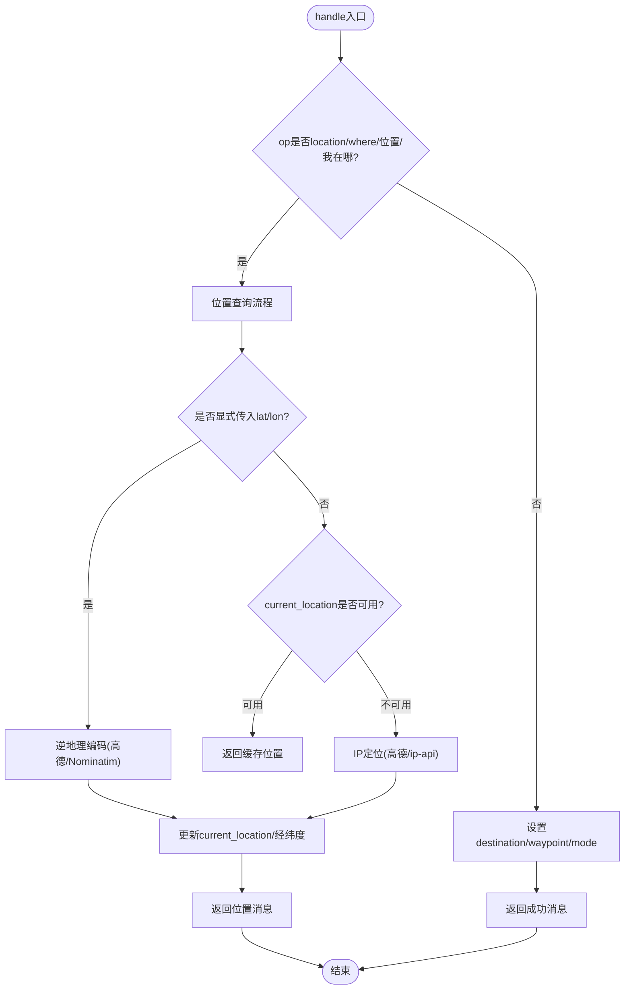
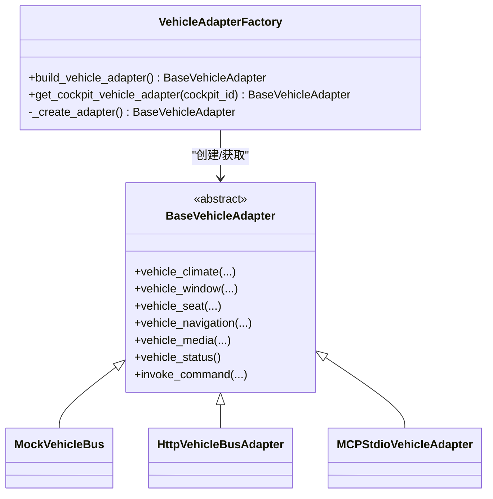
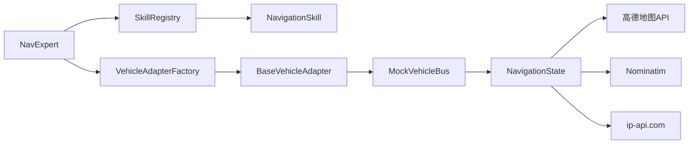

# NavExpert导航专家

<cite>
**本文引用的文件**   
- [nav_expert.py](file://backend_design/nexus/agent/experts/nav_expert.py)
- [navigation.py](file://backend_design/nexus/skills/vehicle/navigation.py)
- [base.py](file://backend_design/nexus/skills/base.py)
- [navigation_state.py](file://backend_design/nexus/vehicle/mock/navigation_state.py)
- [factory.py](file://backend_design/nexus/vehicle/factory.py)
- [base.py](file://backend_design/nexus/vehicle/base.py)
- [__init__.py](file://backend_design/nexus/config/__init__.py)
</cite>

## 目录
1. [简介](#简介)
2. [项目结构](#项目结构)
3. [核心组件](#核心组件)
4. [架构总览](#架构总览)
5. [详细组件分析](#详细组件分析)
6. [依赖关系分析](#依赖关系分析)
7. [性能考虑](#性能考虑)
8. [故障排查指南](#故障排查指南)
9. [结论](#结论)
10. [附录](#附录)

## 简介
本文件为 NavExpert（导航专家）的完整技术文档，聚焦以下能力与实现：
- 导航意图识别与路由：将用户自然语言转化为结构化导航操作。
- 路径规划与位置服务：目的地设置、途经点、当前位置查询与逆地理编码。
- 地图API集成：高德地图逆地理编码与IP定位、OpenStreetMap Nominatim备选。
- 实时交通信息、ETA预测与导航提醒：当前版本以状态管理与降级策略为主，预留扩展接口。
- 多目的地规划、途经点设置与导航状态监控：通过技能参数与状态模型支持。
- 定制开发与性能优化：基于Skill注册体系与适配器工厂，提供可扩展与可观测性建议。

## 项目结构
导航相关代码主要分布在以下模块：
- Agent层：导航专家负责意图处理与结果校验。
- Skill层：导航技能定义工具参数与执行入口。
- Vehicle适配层：抽象车控接口与Mock实现，包含导航状态与定位逻辑。
- 配置中心：聚合Amap等第三方服务配置。

图表来源
- [nav_expert.py:26-82](file://backend_design/nexus/agent/experts/nav_expert.py#L26-L82)
- [navigation.py:15-39](file://backend_design/nexus/skills/vehicle/navigation.py#L15-L39)
- [base.py:116-264](file://backend_design/nexus/skills/base.py#L116-L264)
- [base.py:35-92](file://backend_design/nexus/vehicle/base.py#L35-L92)
- [navigation_state.py:17-216](file://backend_design/nexus/vehicle/mock/navigation_state.py#L17-L216)
- [factory.py:38-123](file://backend_design/nexus/vehicle/factory.py#L38-L123)
- [__init__.py:84-131](file://backend_design/nexus/config/__init__.py#L84-L131)

章节来源
- [nav_expert.py:26-82](file://backend_design/nexus/agent/experts/nav_expert.py#L26-L82)
- [navigation.py:15-39](file://backend_design/nexus/skills/vehicle/navigation.py#L15-L39)
- [base.py:116-264](file://backend_design/nexus/skills/base.py#L116-L264)
- [base.py:35-92](file://backend_design/nexus/vehicle/base.py#L35-L92)
- [navigation_state.py:17-216](file://backend_design/nexus/vehicle/mock/navigation_state.py#L17-L216)
- [factory.py:38-123](file://backend_design/nexus/vehicle/factory.py#L38-L123)
- [__init__.py:84-131](file://backend_design/nexus/config/__init__.py#L84-L131)

## 核心组件
- 导航专家（NavExpert）
  - 职责：解析意图、注入GPS坐标缓存、调用导航技能、验证结果。
  - 关键点：当op为location/where/位置/我在哪时，优先从adapter缓存读取经纬度，避免IP定位超时导致“未知位置”。
- 导航技能（NavigationSkill）
  - 职责：声明工具名称、描述、参数与示例；统一返回SkillResult。
  - 关键点：支持destination、waypoint、mode、op等参数，便于多目的地与模式切换。
- 车控适配器抽象（BaseVehicleAdapter）
  - 职责：定义vehicle_navigation等统一方法，屏蔽Mock/HTTP/MCP差异。
- Mock导航状态（NavigationState）
  - 职责：维护导航上下文（目的地、途经点、模式、当前位置、经纬度），实现IP/GPS定位与逆地理编码。
- 适配器工厂（Vehicle Adapter Factory）
  - 职责：根据配置选择Mock/HTTP/MCP适配器，并支持多座舱隔离。
- 配置中心（AppConfig）
  - 职责：聚合Amap、QWeather、Tavily等第三方配置，供定位与天气等服务使用。

章节来源
- [nav_expert.py:26-82](file://backend_design/nexus/agent/experts/nav_expert.py#L26-L82)
- [navigation.py:15-39](file://backend_design/nexus/skills/vehicle/navigation.py#L15-L39)
- [base.py:35-92](file://backend_design/nexus/vehicle/base.py#L35-L92)
- [navigation_state.py:17-216](file://backend_design/nexus/vehicle/mock/navigation_state.py#L17-L216)
- [factory.py:38-123](file://backend_design/nexus/vehicle/factory.py#L38-L123)
- [__init__.py:84-131](file://backend_design/nexus/config/__init__.py#L84-L131)

## 架构总览
下图展示从用户意图到导航执行的端到端流程，包括GPS坐标注入、逆地理编码与结果校验。

图表来源
- [nav_expert.py:32-82](file://backend_design/nexus/agent/experts/nav_expert.py#L32-L82)
- [navigation.py:37-39](file://backend_design/nexus/skills/vehicle/navigation.py#L37-L39)
- [base.py:191-258](file://backend_design/nexus/skills/base.py#L191-L258)
- [navigation_state.py:33-65](file://backend_design/nexus/vehicle/mock/navigation_state.py#L33-L65)
- [navigation_state.py:67-216](file://backend_design/nexus/vehicle/mock/navigation_state.py#L67-L216)

## 详细组件分析

### 导航专家（NavExpert）
- 意图处理
  - 从SupervisorState提取intent，筛选Navigation_Action。
  - 对location/where/位置/我在哪等操作，尝试从adapter.navigation缓存注入latitude/longitude，提升定位精度。
- 执行与校验
  - 通过registry.execute("vehicle_navigation", cleaned)调用导航技能。
  - _verify_result确保status=ok且message非空，否则给出友好提示。

图表来源
- [nav_expert.py:32-82](file://backend_design/nexus/agent/experts/nav_expert.py#L32-L82)

章节来源
- [nav_expert.py:26-98](file://backend_design/nexus/agent/experts/nav_expert.py#L26-L98)

### 导航技能（NavigationSkill）
- 工具定义
  - name="vehicle_navigation"，description说明支持与用途。
  - parameters定义destination、waypoint、mode、op及类型与描述。
  - examples覆盖常见场景：单目的地、多途经点、位置查询。
- 执行入口
  - execute统一委托给_invoke，返回SkillResult。

图表来源
- [base.py:116-264](file://backend_design/nexus/skills/base.py#L116-L264)
- [navigation.py:15-39](file://backend_design/nexus/skills/vehicle/navigation.py#L15-L39)

章节来源
- [navigation.py:15-39](file://backend_design/nexus/skills/vehicle/navigation.py#L15-L39)
- [base.py:116-264](file://backend_design/nexus/skills/base.py#L116-L264)

### 车控适配器抽象与Mock实现
- 抽象接口（BaseVehicleAdapter）
  - 定义vehicle_navigation(destination, waypoint="", mode="drive")等方法，屏蔽后端差异。
- Mock导航状态（NavigationState）
  - handle(op, destination, waypoint, mode, latitude, longitude)：
    - op为location/where/位置/我在哪时，优先使用传入的经纬度进行逆地理编码，否则回退到IP定位。
    - 存储current_location、latitude、longitude，用于后续查询与展示。
  - _fetch_ip_location优先级：
    - 高德逆地理编码（国内首选，超时短）。
    - Nominatim（国际备选）。
    - 高德IP定位（优先使用客户端IP，避免服务器IP偏差）。
    - ip-api.com（国际备选）。
    - 降级：返回坐标字符串或“未知位置”。

图表来源
- [navigation_state.py:33-65](file://backend_design/nexus/vehicle/mock/navigation_state.py#L33-L65)
- [navigation_state.py:67-216](file://backend_design/nexus/vehicle/mock/navigation_state.py#L67-L216)

章节来源
- [base.py:35-92](file://backend_design/nexus/vehicle/base.py#L35-L92)
- [navigation_state.py:17-216](file://backend_design/nexus/vehicle/mock/navigation_state.py#L17-L216)

### 适配器工厂与多座舱隔离
- 工厂职责
  - 根据VEHICLE_ADAPTER环境变量选择Mock/HTTP/MCP适配器。
  - get_cockpit_vehicle_adapter(cockpit_id)为每个座舱提供独立Mock实例，保证状态隔离。
  - HTTP/MCP模式无状态，复用单例。
- 配置项
  - adapter、api_base_url、api_protocol、api_endpoint、api_timeout、api_token、mcp_command、mcp_args等。

图表来源
- [factory.py:38-123](file://backend_design/nexus/vehicle/factory.py#L38-L123)
- [base.py:35-92](file://backend_design/nexus/vehicle/base.py#L35-L92)

章节来源
- [factory.py:38-147](file://backend_design/nexus/vehicle/factory.py#L38-L147)

### 配置中心（Amap等）
- AppConfig聚合AmapConfig、QWeatherConfig、TavilyConfig等。
- 导航定位逻辑中通过get_config().amap.api_key获取高德Key。

章节来源
- [__init__.py:84-131](file://backend_design/nexus/config/__init__.py#L84-L131)
- [navigation_state.py:90-111](file://backend_design/nexus/vehicle/mock/navigation_state.py#L90-L111)
- [navigation_state.py:146-178](file://backend_design/nexus/vehicle/mock/navigation_state.py#L146-L178)

## 依赖关系分析
- 组件耦合
  - NavExpert依赖Skill注册表与VehicleAdapter工厂。
  - NavigationSkill继承BaseSkill，依赖Pydantic动态生成args_schema。
  - NavigationState依赖httpx与配置中心，调用高德/OSM API。
  - 工厂根据配置选择具体适配器，Mock模式提供状态隔离。
- 外部依赖
  - httpx用于HTTP请求。
  - 高德地图API（逆地理编码、IP定位）。
  - OpenStreetMap Nominatim（逆地理编码备选）。
  - ip-api.com（IP定位备选）。

图表来源
- [nav_expert.py:32-82](file://backend_design/nexus/agent/experts/nav_expert.py#L32-L82)
- [base.py:191-258](file://backend_design/nexus/skills/base.py#L191-L258)
- [factory.py:38-123](file://backend_design/nexus/vehicle/factory.py#L38-L123)
- [navigation_state.py:67-216](file://backend_design/nexus/vehicle/mock/navigation_state.py#L67-L216)

章节来源
- [nav_expert.py:32-82](file://backend_design/nexus/agent/experts/nav_expert.py#L32-L82)
- [base.py:191-258](file://backend_design/nexus/skills/base.py#L191-L258)
- [factory.py:38-123](file://backend_design/nexus/vehicle/factory.py#L38-L123)
- [navigation_state.py:67-216](file://backend_design/nexus/vehicle/mock/navigation_state.py#L67-L216)

## 性能考虑
- 定位链路优化
  - 优先使用浏览器GPS坐标进行逆地理编码，减少IP定位延迟与误差。
  - 高德逆地理编码超时设置为3秒，快速失败与回退。
  - 缓存current_location与经纬度，避免重复网络请求。
- 适配器选择
  - Mock模式按座舱隔离，避免跨座舱状态污染。
  - HTTP/MCP模式无状态，复用单例降低初始化开销。
- 技能执行
  - BaseSkill.to_structured_tool动态生成Pydantic模型，减少运行时反射成本。
  - 异步执行execute，避免阻塞事件循环。

[本节为通用性能建议，不直接分析具体文件]

## 故障排查指南
- 常见问题
  - “未知位置”：检查高德Key是否配置、客户端IP是否正确传递、浏览器定位权限是否开启。
  - 定位超时：确认网络连通性与高德/OSM服务可用性，查看日志中的异常堆栈。
  - 导航未生效：确认op参数正确、destination/waypoint非空、mode合法。
- 日志定位
  - NavExpert在注入GPS坐标失败时会记录警告。
  - NavigationState在逆地理编码/IP定位失败时记录warning，并在最终降级时输出坐标字符串。
- 调试建议
  - 在Mock模式下观察navigation状态字段变化（current_location、latitude、longitude）。
  - 临时关闭高德服务，验证Nominatim/ip-api回退是否正常工作。

章节来源
- [nav_expert.py:42-70](file://backend_design/nexus/agent/experts/nav_expert.py#L42-L70)
- [navigation_state.py:110-216](file://backend_design/nexus/vehicle/mock/navigation_state.py#L110-L216)

## 结论
NavExpert通过清晰的意图处理、健壮的定位链路和灵活的适配器架构，实现了可靠的导航能力。当前版本已支持目的地设置、途经点、当前位置查询与逆地理编码，并为实时交通、ETA预测与导航提醒预留了扩展空间。建议在后续迭代中：
- 引入实时交通数据源与ETA算法，结合历史行程与路况预测。
- 增强多目的地规划能力，支持动态插入/删除途经点与重算路线。
- 完善导航状态监控与提醒机制，提供语音播报与界面反馈。
- 优化定位链路的容错与缓存策略，提升用户体验与系统稳定性。

[本节为总结性内容，不直接分析具体文件]

## 附录
- 关键参数说明
  - destination：目的地名称或地址。
  - waypoint：途经点，支持多个。
  - mode：导航模式（如drive、walk）。
  - op：操作类型（navigate、location、current_location、where、位置、我在哪）。
- 扩展建议
  - 新增技能：遵循BaseSkill规范，定义parameters与examples，并通过register_skill自动注册。
  - 新增适配器：实现BaseVehicleAdapter接口，支持vehicle_navigation等方法。
  - 配置管理：在AppConfig中新增子配置类，统一管理环境变量与默认值。

[本节为概念性内容，不直接分析具体文件]