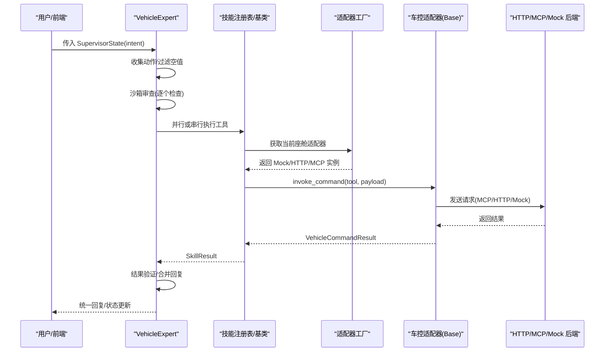
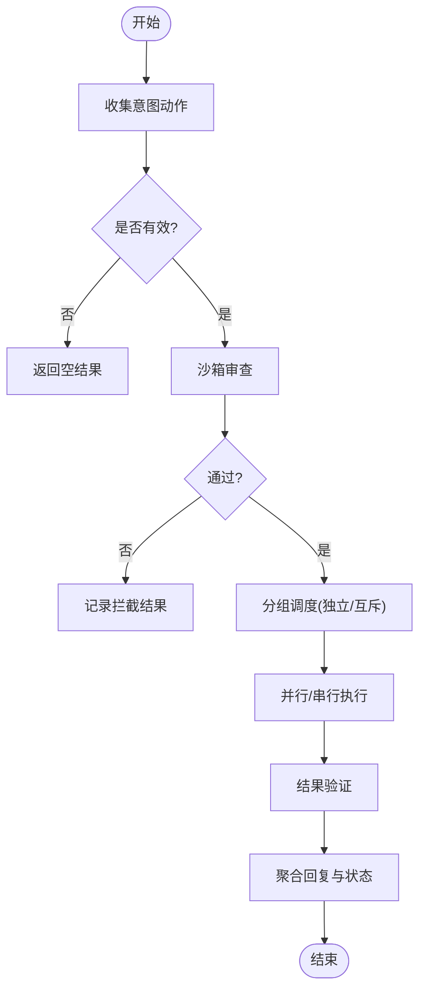
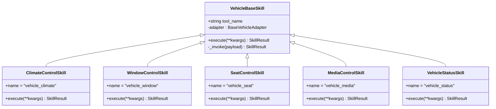
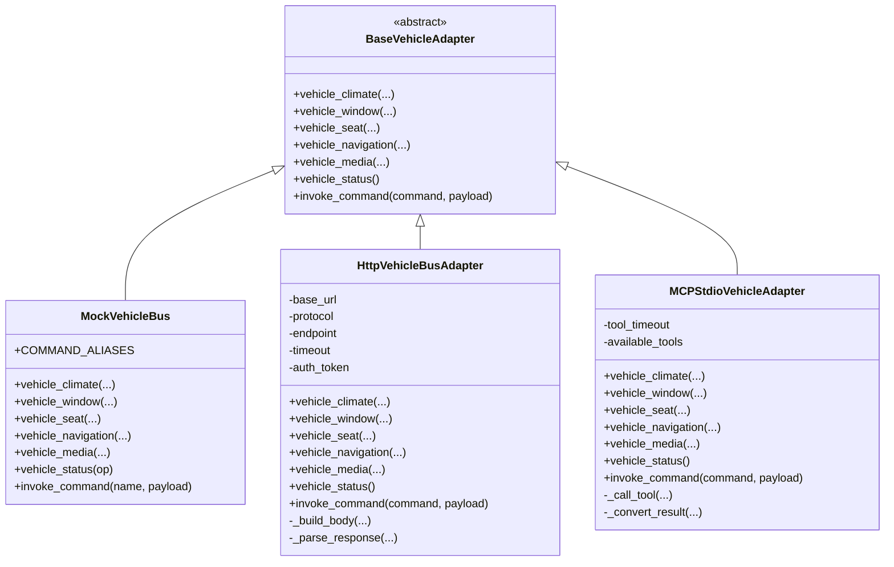
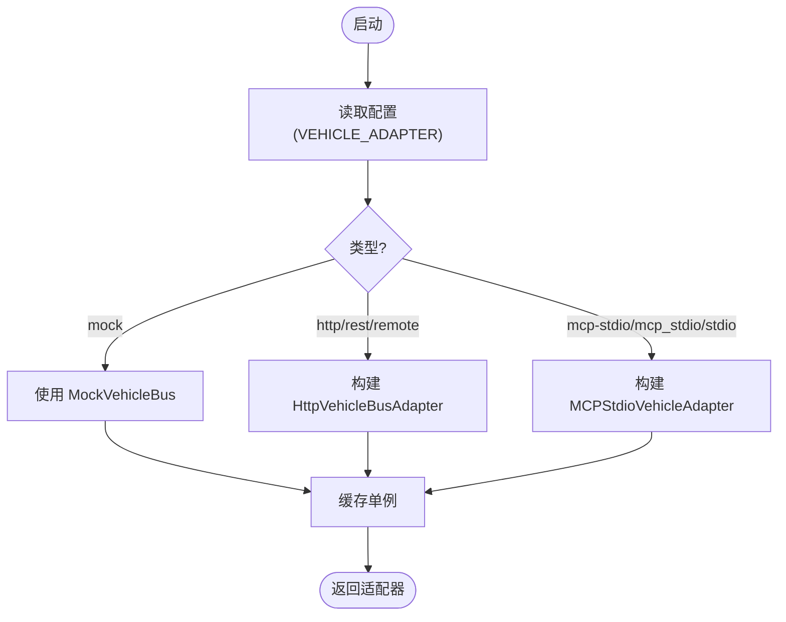
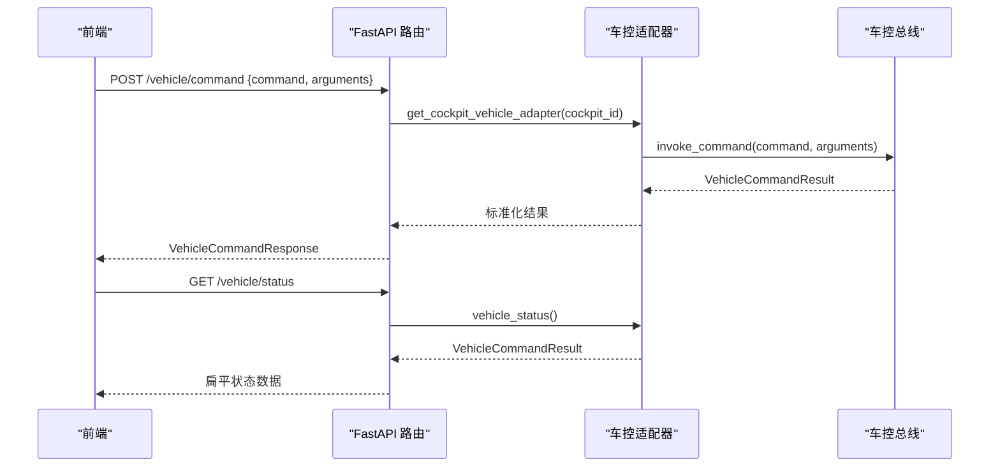
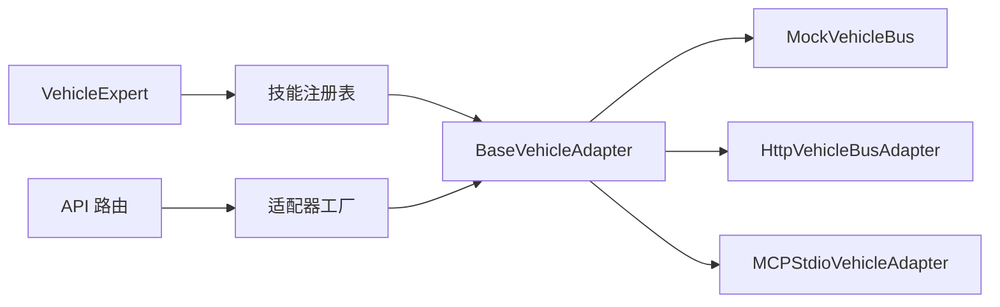

# VehicleExpert车辆专家

<cite>
**本文引用的文件**   
- [vehicle_expert.py](file://backend_design/nexus/agent/experts/vehicle_expert.py)
- [__init__.py（技能基类）](file://backend_design/nexus/skills/vehicle/__init__.py)
- [climate.py](file://backend_design/nexus/skills/vehicle/climate.py)
- [window.py](file://backend_design/nexus/skills/vehicle/window.py)
- [seat.py](file://backend_design/nexus/skills/vehicle/seat.py)
- [media.py](file://backend_design/nexus/skills/vehicle/media.py)
- [status.py](file://backend_design/nexus/skills/vehicle/status.py)
- [base.py（适配器抽象）](file://backend_design/nexus/vehicle/base.py)
- [factory.py（适配器工厂）](file://backend_design/nexus/vehicle/factory.py)
- [http.py（HTTP 适配器）](file://backend_design/nexus/vehicle/http.py)
- [mcp.py（MCP 适配器）](file://backend_design/nexus/vehicle/mcp.py)
- [mock/__init__.py（Mock 门面）](file://backend_design/nexus/vehicle/mock/__init__.py)
- [vehicle.py（API 路由）](file://backend_design/nexus/api/routes/vehicle.py)
- [vehicle.py（配置）](file://backend_design/nexus/config/vehicle.py)
</cite>

## 目录
1. [简介](#简介)
2. [项目结构](#项目结构)
3. [核心组件](#核心组件)
4. [架构总览](#架构总览)
5. [详细组件分析](#详细组件分析)
6. [依赖关系分析](#依赖关系分析)
7. [性能考量](#性能考量)
8. [故障排查指南](#故障排查指南)
9. [结论](#结论)
10. [附录](#附录)

## 简介
本文件为 VehicleExpert 车辆专家的完整技术文档，聚焦以下目标：
- 解释意图解析到命令转换与执行的端到端流程
- 说明与车控系统的集成方式（Mock/HTTP/MCP 三种模式）及适配逻辑
- 文档化空调、车窗、座椅、媒体等子系统的控制接口与状态同步机制
- 覆盖复杂指令的多步骤处理、安全校验与异常恢复策略
- 提供扩展方法与故障排查指南

## 项目结构
VehicleExpert 位于 Agent 专家层，负责将上层意图转化为具体车控技能调用，并通过统一的“车控总线适配器”对接不同后端。

```mermaid
graph TB
subgraph "Agent 专家层"
VE["VehicleExpert<br/>意图聚合/并行执行"]
end
subgraph "技能层"
SB["VehicleBaseSkill<br/>统一调用车控适配器"]
CL["ClimateControlSkill"]
WN["WindowControlSkill"]
ST["SeatControlSkill"]
MD["MediaControlSkill"]
VS["VehicleStatusSkill"]
end
subgraph "车控适配器层"
BA["BaseVehicleAdapter<br/>抽象接口"]
MK["MockVehicleBus<br/>模拟实现"]
HT["HttpVehicleBusAdapter<br/>HTTP REST"]
MC["MCPStdioVehicleAdapter<br/>MCP stdio"]
end
subgraph "外部系统"
HC["真实车机服务(HTTP)"]
MCP["MCP 服务端(stdio)"]
end
VE --> SB
SB --> BA
BA --> MK
BA --> HT
BA --> MC
HT --> HC
MC --> MCP
```

图表来源
- [vehicle_expert.py:43-116](file://backend_design/nexus/agent/experts/vehicle_expert.py#L43-L116)
- [__init__.py（技能基类）:21-55](file://backend_design/nexus/skills/vehicle/__init__.py#L21-L55)
- [base.py:35-92](file://backend_design/nexus/vehicle/base.py#L35-L92)
- [mock/__init__.py:39-220](file://backend_design/nexus/vehicle/mock/__init__.py#L39-L220)
- [http.py:23-127](file://backend_design/nexus/vehicle/http.py#L23-L127)
- [mcp.py:167-285](file://backend_design/nexus/vehicle/mcp.py#L167-L285)

章节来源
- [vehicle_expert.py:1-116](file://backend_design/nexus/agent/experts/vehicle_expert.py#L1-L116)
- [__init__.py（技能基类）:1-55](file://backend_design/nexus/skills/vehicle/__init__.py#L1-L55)
- [base.py:1-92](file://backend_design/nexus/vehicle/base.py#L1-L92)

## 核心组件
- VehicleExpert：车控专家，负责收集意图、沙箱审查、并行/串行执行、结果聚合与回复生成。
- VehicleBaseSkill：技能基类，封装对 BaseVehicleAdapter 的统一调用，支持多座舱隔离。
- 车控适配器（BaseVehicleAdapter 及其 Mock/HTTP/MCP 实现）：屏蔽通信差异，暴露统一方法族。
- API 路由：提供直接执行车控命令与查询状态的 HTTP 接口，支持座舱隔离。

章节来源
- [vehicle_expert.py:43-116](file://backend_design/nexus/agent/experts/vehicle_expert.py#L43-L116)
- [__init__.py（技能基类）:21-55](file://backend_design/nexus/skills/vehicle/__init__.py#L21-L55)
- [vehicle.py（API 路由）:35-108](file://backend_design/nexus/api/routes/vehicle.py#L35-L108)

## 架构总览
下图展示从用户指令到车控执行的完整链路，包括意图映射、沙箱审查、并行/串行调度、适配器选择与结果验证。

图表来源
- [vehicle_expert.py:49-116](file://backend_design/nexus/agent/experts/vehicle_expert.py#L49-L116)
- [factory.py:38-84](file://backend_design/nexus/vehicle/factory.py#L38-L84)
- [http.py:65-98](file://backend_design/nexus/vehicle/http.py#L65-L98)
- [mcp.py:222-238](file://backend_design/nexus/vehicle/mcp.py#L222-L238)
- [mock/__init__.py:194-220](file://backend_design/nexus/vehicle/mock/__init__.py#L194-L220)

## 详细组件分析

### VehicleExpert 执行流程
- 意图收集：根据 _VEHICLE_ACTION_MAP 将 intent 字段映射到具体工具名。
- 沙箱审查：对每个动作进行安全检查，被拦截的动作标记失败并记录原因。
- 并行/串行调度：无冲突动作并发执行；同一互斥组内动作按序执行，避免硬件冲突。
- 结果验证：对空调温度、车窗位置、媒体播放状态等进行一致性校验。
- 聚合回复：合并各动作的回复与状态，输出统一的 partial state update。

图表来源
- [vehicle_expert.py:49-116](file://backend_design/nexus/agent/experts/vehicle_expert.py#L49-L116)
- [vehicle_expert.py:117-178](file://backend_design/nexus/agent/experts/vehicle_expert.py#L117-L178)
- [vehicle_expert.py:246-326](file://backend_design/nexus/agent/experts/vehicle_expert.py#L246-L326)
- [vehicle_expert.py:327-428](file://backend_design/nexus/agent/experts/vehicle_expert.py#L327-L428)

章节来源
- [vehicle_expert.py:43-116](file://backend_design/nexus/agent/experts/vehicle_expert.py#L43-L116)
- [vehicle_expert.py:117-178](file://backend_design/nexus/agent/experts/vehicle_expert.py#L117-L178)
- [vehicle_expert.py:246-326](file://backend_design/nexus/agent/experts/vehicle_expert.py#L246-L326)
- [vehicle_expert.py:327-428](file://backend_design/nexus/agent/experts/vehicle_expert.py#L327-L428)

### 技能层与子系统接口
- ClimateControlSkill：支持温度调节、风量设置、模式切换等。
- WindowControlSkill：支持开合、百分比定位、天窗控制等。
- SeatControlSkill：支持加热、通风、按摩、位置调整等。
- MediaControlSkill：支持播放、暂停、切歌、音量、音源切换等。
- VehicleStatusSkill：支持车况摘要与当前位置查询。

所有技能均继承 VehicleBaseSkill，通过 adapter.invoke_command 统一调用车控适配器。

图表来源
- [__init__.py（技能基类）:21-55](file://backend_design/nexus/skills/vehicle/__init__.py#L21-L55)
- [climate.py:15-37](file://backend_design/nexus/skills/vehicle/climate.py#L15-L37)
- [window.py:15-34](file://backend_design/nexus/skills/vehicle/window.py#L15-L34)
- [seat.py:15-35](file://backend_design/nexus/skills/vehicle/seat.py#L15-L35)
- [media.py:15-36](file://backend_design/nexus/skills/vehicle/media.py#L15-L36)
- [status.py:15-33](file://backend_design/nexus/skills/vehicle/status.py#L15-L33)

章节来源
- [__init__.py（技能基类）:21-55](file://backend_design/nexus/skills/vehicle/__init__.py#L21-L55)
- [climate.py:15-37](file://backend_design/nexus/skills/vehicle/climate.py#L15-L37)
- [window.py:15-34](file://backend_design/nexus/skills/vehicle/window.py#L15-L34)
- [seat.py:15-35](file://backend_design/nexus/skills/vehicle/seat.py#L15-L35)
- [media.py:15-36](file://backend_design/nexus/skills/vehicle/media.py#L15-L36)
- [status.py:15-33](file://backend_design/nexus/skills/vehicle/status.py#L15-L33)

### 车控适配器与三种模式
- BaseVehicleAdapter：定义统一接口（空调/车窗/座椅/导航/媒体/状态/通用调用）。
- MockVehicleBus：开发测试用，内存状态隔离，支持命令别名映射。
- HttpVehicleBusAdapter：通过 HTTP REST 或 JSON-RPC 与真实车机服务通信。
- MCPStdioVehicleAdapter：通过 MCP SDK stdio 与外部服务通信，后台线程驱动异步会话。

图表来源
- [base.py:35-92](file://backend_design/nexus/vehicle/base.py#L35-L92)
- [mock/__init__.py:39-220](file://backend_design/nexus/vehicle/mock/__init__.py#L39-L220)
- [http.py:23-127](file://backend_design/nexus/vehicle/http.py#L23-L127)
- [mcp.py:167-285](file://backend_design/nexus/vehicle/mcp.py#L167-L285)

章节来源
- [base.py:1-92](file://backend_design/nexus/vehicle/base.py#L1-L92)
- [mock/__init__.py:1-220](file://backend_design/nexus/vehicle/mock/__init__.py#L1-L220)
- [http.py:1-127](file://backend_design/nexus/vehicle/http.py#L1-L127)
- [mcp.py:1-285](file://backend_design/nexus/vehicle/mcp.py#L1-L285)

### 适配器工厂与座舱隔离
- build_vehicle_adapter：根据环境变量选择 Mock/HTTP/MCP 单例。
- get_cockpit_vehicle_adapter：按座舱 ID 返回独立实例（Mock 模式状态隔离；HTTP/MCP 复用单例）。
- _create_adapter：依据配置创建具体适配器实例，支持 JSON 或 shlex 解析命令与参数。

图表来源
- [factory.py:38-123](file://backend_design/nexus/vehicle/factory.py#L38-L123)
- [factory.py:125-147](file://backend_design/nexus/vehicle/factory.py#L125-L147)

章节来源
- [factory.py:1-147](file://backend_design/nexus/vehicle/factory.py#L1-L147)

### API 路由与状态同步
- /vehicle/command：直接执行车控命令（绕过 Agent），需要 JWT 认证，支持座舱隔离。
- /vehicle/status：获取车辆当前状态（空调、车窗、座椅、媒体、导航、车况），返回扁平结构。
- /vehicle/location：更新浏览器 GPS 坐标，存储到适配器导航状态中。

图表来源
- [vehicle.py（API 路由）:48-108](file://backend_design/nexus/api/routes/vehicle.py#L48-L108)
- [vehicle.py（API 路由）:117-152](file://backend_design/nexus/api/routes/vehicle.py#L117-L152)
- [factory.py:55-84](file://backend_design/nexus/vehicle/factory.py#L55-L84)

章节来源
- [vehicle.py（API 路由）:35-152](file://backend_design/nexus/api/routes/vehicle.py#L35-L152)

### 配置与环境变量
- VEHICLE_ADAPTER：选择 mock/http/mcp-stdio 模式
- VEHICLE_API_BASE_URL/PROTOCOL/ENDPOINT/TIMEOUT/TOKEN：HTTP 模式连接与超时、鉴权
- VEHICLE_MCP_COMMAND/ARGS/WORKDIR/VALIDATE_TOOLS：MCP 模式启动命令、参数与工作目录

章节来源
- [vehicle.py（配置）:15-50](file://backend_design/nexus/config/vehicle.py#L15-L50)

## 依赖关系分析
- VehicleExpert 依赖技能注册表执行工具，并通过沙箱进行安全审查。
- 技能层依赖 BaseVehicleAdapter，由工厂根据配置与座舱上下文选择具体实现。
- HTTP/MCP 适配器分别依赖网络库与 MCP SDK，Mock 适配器依赖内存状态模块。
- API 路由依赖认证中间件与座舱上下文，确保多租户隔离。

图表来源
- [vehicle_expert.py:49-116](file://backend_design/nexus/agent/experts/vehicle_expert.py#L49-L116)
- [factory.py:38-84](file://backend_design/nexus/vehicle/factory.py#L38-L84)
- [vehicle.py（API 路由）:35-108](file://backend_design/nexus/api/routes/vehicle.py#L35-L108)

章节来源
- [vehicle_expert.py:49-116](file://backend_design/nexus/agent/experts/vehicle_expert.py#L49-L116)
- [factory.py:38-84](file://backend_design/nexus/vehicle/factory.py#L38-L84)
- [vehicle.py（API 路由）:35-108](file://backend_design/nexus/api/routes/vehicle.py#L35-L108)

## 性能考量
- 并行执行：无冲突动作通过 asyncio.gather 并发执行，提升吞吐。
- 互斥串行：同一互斥组内动作顺序执行，避免硬件竞争。
- 超时保护：单个动作执行设置超时，防止阻塞整体流程。
- 适配器选择：Mock 模式适合本地调试；HTTP/MCP 模式用于生产环境，注意网络延迟与重试策略。
- 结果验证：在关键操作后进行一致性校验，减少无效成功响应。

[本节为通用指导，不直接分析具体文件]

## 故障排查指南
- 沙箱拦截：检查 sandbox.inspect 返回的原因，确认权限与参数合法性。
- 超时错误：查看日志中的 timeout 信息，确认设备在线与服务响应时间。
- 验证失败：核对空调温度、车窗位置、媒体播放状态是否与预期一致。
- 适配器初始化：确认 VEHICLE_ADAPTER 与相关环境变量配置正确。
- HTTP 错误：检查 base_url、endpoint、协议与鉴权 Token。
- MCP 初始化：确认 mcp_command 与 mcp_args 解析正确，服务可启动。

章节来源
- [vehicle_expert.py:76-116](file://backend_design/nexus/agent/experts/vehicle_expert.py#L76-L116)
- [vehicle_expert.py:180-233](file://backend_design/nexus/agent/experts/vehicle_expert.py#L180-L233)
- [vehicle_expert.py:327-428](file://backend_design/nexus/agent/experts/vehicle_expert.py#L327-L428)
- [http.py:69-98](file://backend_design/nexus/vehicle/http.py#L69-L98)
- [mcp.py:167-238](file://backend_design/nexus/vehicle/mcp.py#L167-L238)

## 结论
VehicleExpert 通过清晰的意图映射、严格的安全审查与高效的并行/串行调度，实现了稳定可靠的车控能力。借助统一的适配器抽象，系统可在 Mock/HTTP/MCP 之间灵活切换，满足开发与生产需求。配合完善的验证与异常处理机制，确保了用户体验与系统健壮性。

[本节为总结性内容，不直接分析具体文件]

## 附录

### 扩展方法
- 新增子系统技能：
  - 在 skills/vehicle 下新建技能类，继承 VehicleBaseSkill，定义 tool_name 与 execute。
  - 在 VehicleExpert 的 _VEHICLE_ACTION_MAP 中添加意图键到工具名的映射。
  - 如需互斥，更新 _MUTEX_GROUPS 以限制并发。
- 新增适配器：
  - 实现 BaseVehicleAdapter 的所有抽象方法。
  - 在 factory._create_adapter 中增加新的适配器分支。
- 扩展 API：
  - 在 api/routes/vehicle.py 中新增路由，遵循座舱隔离与认证规范。

章节来源
- [climate.py:15-37](file://backend_design/nexus/skills/vehicle/climate.py#L15-L37)
- [vehicle_expert.py:25-41](file://backend_design/nexus/agent/experts/vehicle_expert.py#L25-L41)
- [factory.py:86-123](file://backend_design/nexus/vehicle/factory.py#L86-L123)
- [vehicle.py（API 路由）:48-108](file://backend_design/nexus/api/routes/vehicle.py#L48-L108)