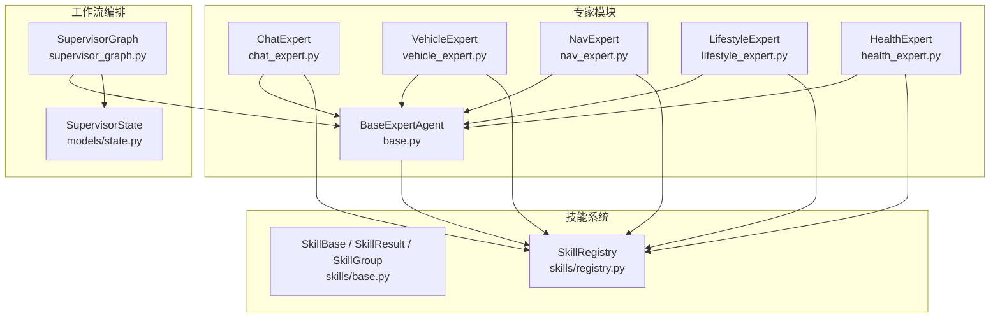
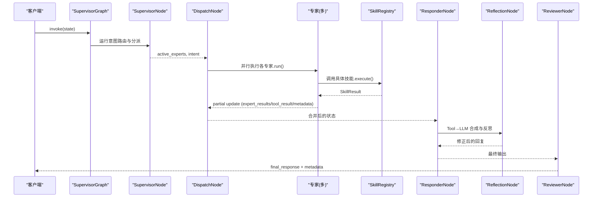
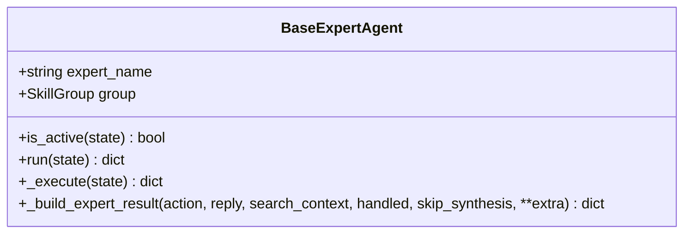
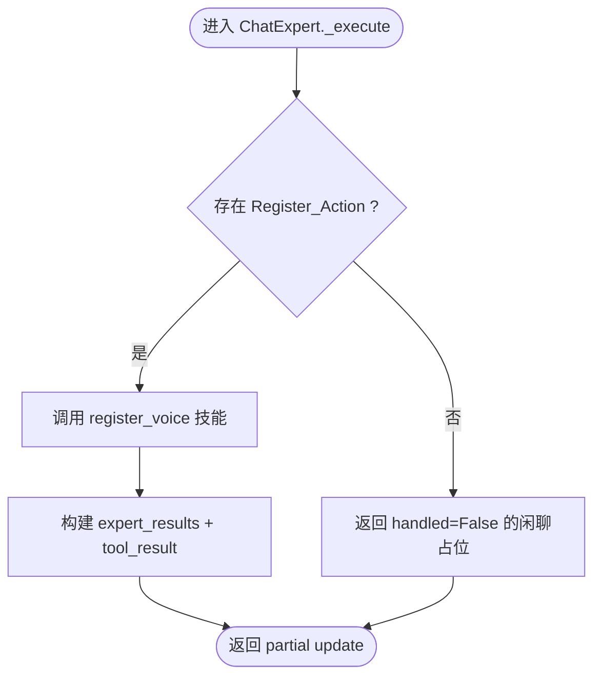
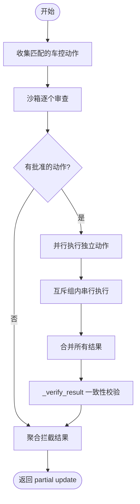
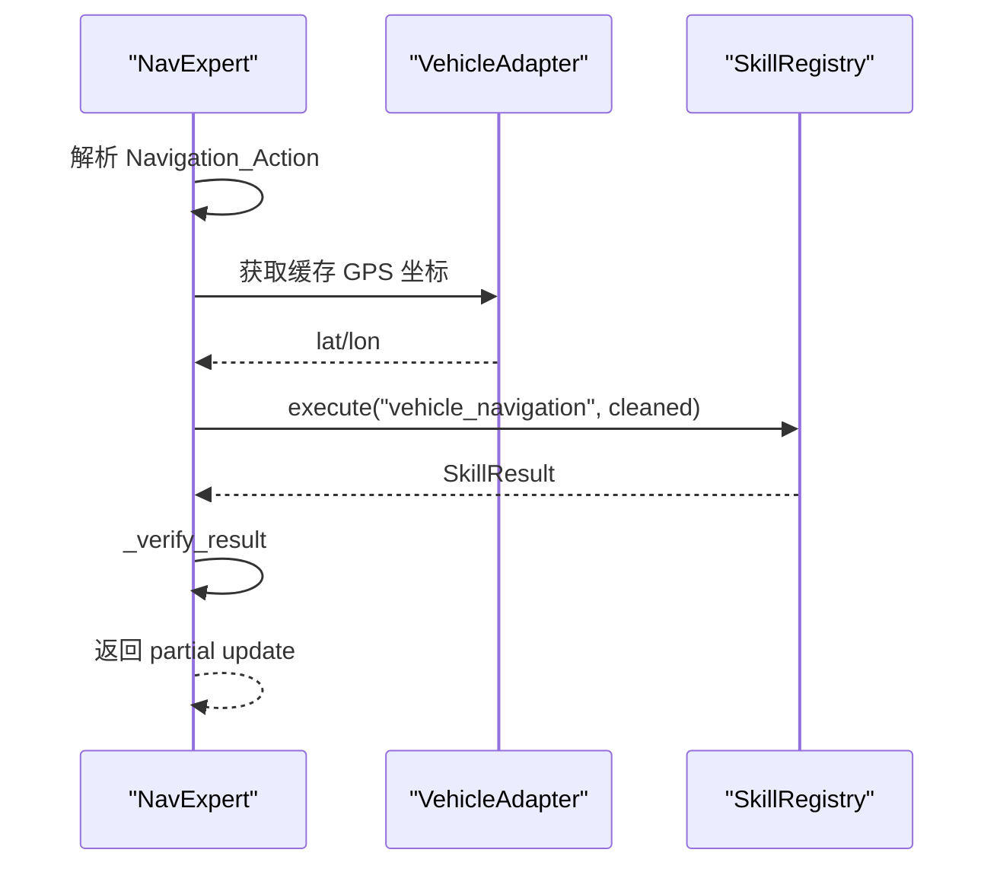
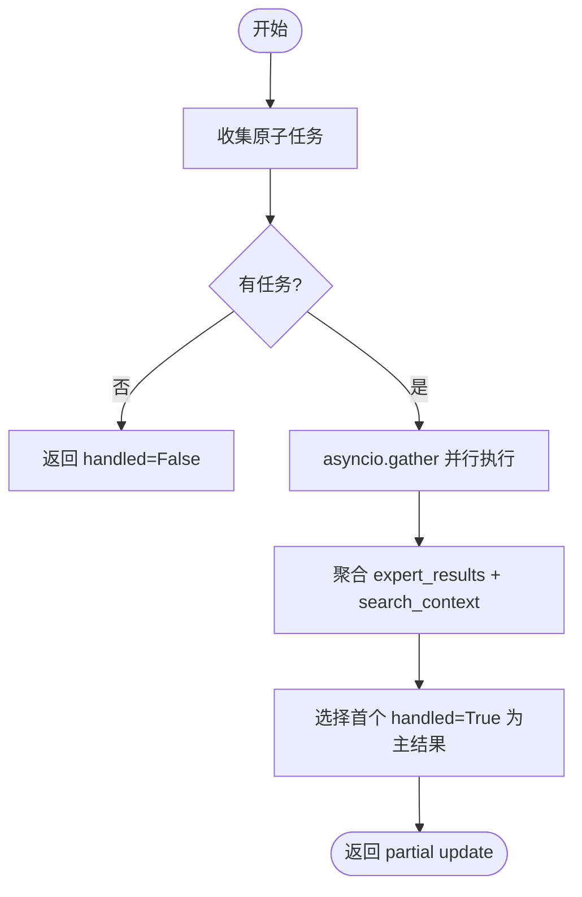
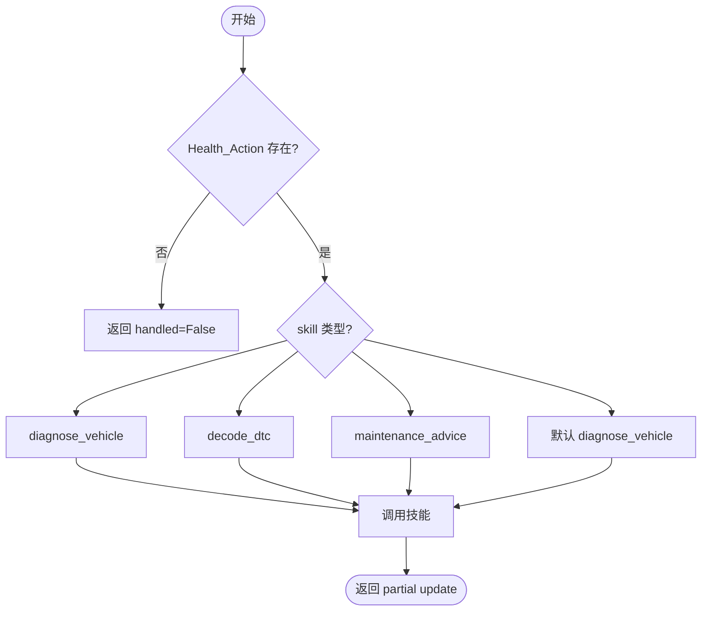
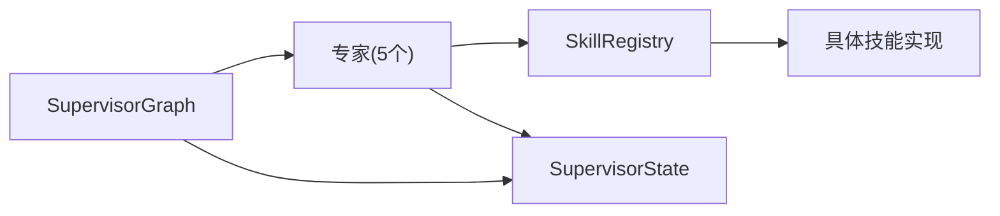

# 专家Agent系统

<cite>
**本文引用的文件**   
- [base.py](file://backend_design/nexus/agent/experts/base.py)
- [chat_expert.py](file://backend_design/nexus/agent/experts/chat_expert.py)
- [vehicle_expert.py](file://backend_design/nexus/agent/experts/vehicle_expert.py)
- [nav_expert.py](file://backend_design/nexus/agent/experts/nav_expert.py)
- [lifestyle_expert.py](file://backend_design/nexus/agent/experts/lifestyle_expert.py)
- [health_expert.py](file://backend_design/nexus/agent/experts/health_expert.py)
- [state.py](file://backend_design/nexus/models/state.py)
- [base.py](file://backend_design/nexus/skills/base.py)
- [registry.py](file://backend_design/nexus/skills/registry.py)
- [__init__.py](file://backend_design/nexus/agent/experts/__init__.py)
- [supervisor_graph.py](file://backend_design/nexus/agent/supervisor_graph.py)
</cite>

## 目录
1. [简介](#简介)
2. [项目结构](#项目结构)
3. [核心组件](#核心组件)
4. [架构总览](#架构总览)
5. [详细组件分析](#详细组件分析)
6. [依赖关系分析](#依赖关系分析)
7. [性能考量](#性能考量)
8. [故障排查指南](#故障排查指南)
9. [结论](#结论)
10. [附录：开发指南与最佳实践](#附录开发指南与最佳实践)

## 简介
本文件面向 NexusCockpit 的专家 Agent 系统，系统性阐述 BaseExpertAgent 抽象基类的设计模式与接口规范，并详解五个具体专家的职责分工、实现细节、技能调用方式与响应生成逻辑。同时提供自定义专家开发指南、新技能注册方法、领域特定处理逻辑的实现建议，以及性能优化与调试技巧，帮助开发者快速扩展与维护专家体系。

## 项目结构
专家 Agent 系统位于 backend_design/nexus/agent/experts 目录，围绕统一的基类与五个专业领域专家组织代码；状态模型定义在 models/state.py；技能系统与注册中心在 skills/base.py 与 skills/registry.py；编排入口在 agent/supervisor_graph.py。

图表来源
- [supervisor_graph.py:120-179](file://backend_design/nexus/agent/supervisor_graph.py#L120-L179)
- [base.py:26-87](file://backend_design/nexus/agent/experts/base.py#L26-L87)
- [state.py:38-106](file://backend_design/nexus/models/state.py#L38-L106)
- [base.py:35-42](file://backend_design/nexus/skills/base.py#L35-L42)
- [registry.py:36-57](file://backend_design/nexus/skills/registry.py#L36-L57)

章节来源
- [__init__.py:1-37](file://backend_design/nexus/agent/experts/__init__.py#L1-L37)
- [state.py:38-106](file://backend_design/nexus/models/state.py#L38-L106)

## 核心组件
- BaseExpertAgent（抽象基类）
  - 统一 run() 生命周期：检查 active_experts、计时、异常捕获、元数据注入。
  - 统一结果构建：_build_expert_result 输出 expert_results、skill_action、skill_handled、search_context、metadata，并在条件满足时提升 tool_result 供 Responder 合成。
  - 子类仅实现 _execute(state)，返回 partial update。
- SupervisorState（共享状态）
  - 使用 TypedDict + Annotated reducer，支持 expert_results/history/metadata 等字段的自动合并或累加。
  - 关键字段包括 intent、active_experts、expert_results、tool_result、has_side_effect、metadata、latency_ms 等。
- SkillSystem（技能基类与注册中心）
  - SkillGroup 枚举将技能分组到对应专家。
  - @register_skill 装饰器自动注册；SkillRegistry 自动扫描与手动注册结合，提供 execute、execute_batch、get_skills_by_group 等能力。
  - SkillResult 统一执行结果结构，包含 status/message/data/error/action/search_context/handled/metadata。

章节来源
- [base.py:26-87](file://backend_design/nexus/agent/experts/base.py#L26-L87)
- [base.py:89-140](file://backend_design/nexus/agent/experts/base.py#L89-L140)
- [state.py:38-106](file://backend_design/nexus/models/state.py#L38-L106)
- [base.py:35-42](file://backend_design/nexus/skills/base.py#L35-L42)
- [base.py:92-114](file://backend_design/nexus/skills/base.py#L92-L114)
- [registry.py:36-57](file://backend_design/nexus/skills/registry.py#L36-L57)
- [registry.py:222-286](file://backend_design/nexus/skills/registry.py#L222-L286)

## 架构总览
SupervisorGraph 负责编排整个工作流：Supervisor 节点进行意图路由与专家分派，DispatchNode 并行调度多个专家，各专家通过 SkillRegistry 调用具体技能，Responder 汇总工具结果并进行 LLM 合成与反思校验，Reviewer 进行质量审查与记忆存储。

图表来源
- [supervisor_graph.py:120-179](file://backend_design/nexus/agent/supervisor_graph.py#L120-L179)
- [registry.py:222-286](file://backend_design/nexus/skills/registry.py#L222-L286)

章节来源
- [supervisor_graph.py:120-179](file://backend_design/nexus/agent/supervisor_graph.py#L120-L179)

## 详细组件分析

### BaseExpertAgent 抽象基类
- 设计要点
  - is_active(state) 判断是否被 Supervisor 分派。
  - run(state) 统一生命周期：计时、异常捕获、写入 latency_ms 与错误元数据。
  - _execute(state) 由子类实现，返回 partial update。
  - _build_expert_result(...) 标准化输出字段，必要时提升 tool_result 给 Responder。
- 关键行为
  - 未激活直接返回空字典（no-op）。
  - 异常路径记录错误信息并返回带元数据的 partial update。
  - handled=False 时不设置 tool_result，交由 Responder 走 LLM 分支。

图表来源
- [base.py:26-87](file://backend_design/nexus/agent/experts/base.py#L26-L87)
- [base.py:89-140](file://backend_design/nexus/agent/experts/base.py#L89-L140)

章节来源
- [base.py:26-87](file://backend_design/nexus/agent/experts/base.py#L26-L87)
- [base.py:89-140](file://backend_design/nexus/agent/experts/base.py#L89-L140)

### ChatExpert（闲聊对话）
- 职责
  - 纯 LLM 闲聊：handled=False，让 Responder 走 LLM 分支。
  - 声纹注册：调用 register_voice 技能，返回 ACTION_REGISTER 指令供前端处理。
- 实现要点
  - _verify_result(result, action) 校验 error 状态与消息长度。
  - _execute(state) 根据 intent.Register_Action 触发注册，否则返回闲聊占位。

图表来源
- [chat_expert.py:49-71](file://backend_design/nexus/agent/experts/chat_expert.py#L49-L71)

章节来源
- [chat_expert.py:24-71](file://backend_design/nexus/agent/experts/chat_expert.py#L24-L71)

### VehicleExpert（车辆控制）
- 职责
  - 处理空调/车窗/座椅/媒体/状态查询等多动作组合指令。
  - 沙箱安全审查、互斥组串行、无冲突并行执行、结果聚合与验证。
- 实现要点
  - _VEHICLE_ACTION_MAP 映射 intent 字段到技能名。
  - _MUTEX_GROUPS 定义互斥组，同组内串行避免硬件冲突。
  - _execute_actions_parallel 按独立与互斥分组并行执行。
  - _aggregate_results 合并多条 expert_results，拼接回复文本，标记 has_side_effect。
  - _verify_result 对温度/车窗位置/媒体播放状态进行一致性校验。

图表来源
- [vehicle_expert.py:49-116](file://backend_design/nexus/agent/experts/vehicle_expert.py#L49-L116)
- [vehicle_expert.py:117-177](file://backend_design/nexus/agent/experts/vehicle_expert.py#L117-L177)
- [vehicle_expert.py:246-325](file://backend_design/nexus/agent/experts/vehicle_expert.py#L246-L325)
- [vehicle_expert.py:327-427](file://backend_design/nexus/agent/experts/vehicle_expert.py#L327-L427)

章节来源
- [vehicle_expert.py:43-427](file://backend_design/nexus/agent/experts/vehicle_expert.py#L43-L427)

### NavExpert（导航服务）
- 职责
  - 目的地设置、路线规划、途经点、当前位置查询。
  - 查询位置时从适配器缓存读取 GPS 坐标，避免 IP 定位超时导致“未知位置”。
- 实现要点
  - _execute(state) 过滤 None 值，针对 location 相关操作注入缓存坐标。
  - 调用 vehicle_navigation 技能，结果经 _verify_result 校验后返回。

图表来源
- [nav_expert.py:32-82](file://backend_design/nexus/agent/experts/nav_expert.py#L32-L82)

章节来源
- [nav_expert.py:26-98](file://backend_design/nexus/agent/experts/nav_expert.py#L26-L98)

### LifestyleExpert（生活服务）
- 职责
  - 联网搜索、外卖点餐、本地生活推荐、天气查询、日程提醒。
  - 多动作并行执行，天气与搜索互斥避免重复。
- 实现要点
  - 原子任务列表：POI 搜索、天气、搜索、点餐、提醒。
  - asyncio.gather 并行执行，异常捕获并记录。
  - 聚合 expert_results，合并 search_context，选择第一个 handled=True 的结果作为主结果。

图表来源
- [lifestyle_expert.py:45-172](file://backend_design/nexus/agent/experts/lifestyle_expert.py#L45-L172)
- [lifestyle_expert.py:174-256](file://backend_design/nexus/agent/experts/lifestyle_expert.py#L174-L256)

章节来源
- [lifestyle_expert.py:24-256](file://backend_design/nexus/agent/experts/lifestyle_expert.py#L24-L256)

### HealthExpert（健康管理）
- 职责
  - 车辆健康诊断、故障码翻译、保养建议。
  - 根据 Health_Action.skill 路由到不同技能。
- 实现要点
  - _execute(state) 构造参数并调用对应技能，返回标准 partial update。

图表来源
- [health_expert.py:36-74](file://backend_design/nexus/agent/experts/health_expert.py#L36-L74)

章节来源
- [health_expert.py:24-74](file://backend_design/nexus/agent/experts/health_expert.py#L24-L74)

## 依赖关系分析
- 专家与技能注册中心的耦合
  - 所有专家通过 SkillRegistry.execute 调用技能，解耦具体实现。
  - SkillRegistry 提供超时保护、重试、批量执行与按组查询能力。
- 状态管理与合并策略
  - SupervisorState 使用 Annotated reducer，expert_results/history/metadata 自动合并或累加，避免并发覆盖。
- 编排与工作流
  - SupervisorGraph 初始化专家实例并构建图，DispatchNode 并行调度，Responder 汇总与合成。

图表来源
- [registry.py:222-286](file://backend_design/nexus/skills/registry.py#L222-L286)
- [state.py:38-106](file://backend_design/nexus/models/state.py#L38-L106)
- [supervisor_graph.py:120-179](file://backend_design/nexus/agent/supervisor_graph.py#L120-L179)

章节来源
- [registry.py:36-57](file://backend_design/nexus/skills/registry.py#L36-L57)
- [state.py:38-106](file://backend_design/nexus/models/state.py#L38-L106)
- [supervisor_graph.py:120-179](file://backend_design/nexus/agent/supervisor_graph.py#L120-L179)

## 性能考量
- 并行与串行策略
  - VehicleExpert 将无冲突动作并行执行，互斥组内串行，减少硬件冲突与等待时间。
  - LifestyleExpert 使用 asyncio.gather 并行执行原子任务，单任务直接 await 降低开销。
- 超时与重试
  - SkillRegistry.execute 内置超时保护与瞬时故障重试，防止外部 API 慢响应阻塞。
  - VehicleExpert 单个动作执行设置超时，避免长时间挂起。
- 状态合并开销
  - SupervisorState 的 reducer 自动合并，注意避免过大 expert_results 列表影响序列化与传输。
- 缓存与副作用
  - 车控类技能 has_side_effect=True 且 cache_ttl=0，禁止缓存，确保安全性。
  - 非车控技能可合理设置 TTL，提高命中率。

[本节为通用指导，不直接分析具体文件]

## 故障排查指南
- 专家执行失败
  - BaseExpertAgent.run 捕获异常并记录错误信息，返回含 expert_name_error 与 latency_ms 的元数据。
  - 检查 active_experts 是否正确设置，确认专家未被跳过。
- 技能执行失败
  - SkillRegistry.execute 返回 SkillResult.status="error"，查看 message 与 error 字段定位原因。
  - 关注超时与重试日志，确认网络与外部服务可用性。
- 车控指令不一致
  - VehicleExpert._verify_result 会校验温度/车窗位置/媒体状态，若不一致返回错误提示。
  - 检查沙箱审查警告与参数合法性。
- 导航定位问题
  - NavExpert 优先使用缓存 GPS 坐标，若无缓存则回退 IP 定位，检查适配器与缓存状态。
- 多动作聚合异常
  - LifestyleExpert 并行执行可能抛出异常，检查 return_exceptions 处理与 expert_results 中的 error 字段。

章节来源
- [base.py:63-83](file://backend_design/nexus/agent/experts/base.py#L63-L83)
- [registry.py:222-286](file://backend_design/nexus/skills/registry.py#L222-L286)
- [vehicle_expert.py:327-427](file://backend_design/nexus/agent/experts/vehicle_expert.py#L327-L427)
- [nav_expert.py:42-70](file://backend_design/nexus/agent/experts/nav_expert.py#L42-L70)
- [lifestyle_expert.py:174-256](file://backend_design/nexus/agent/experts/lifestyle_expert.py#L174-L256)

## 结论
NexusCockpit 的专家 Agent 系统以 BaseExpertAgent 为核心，配合 SupervisorState 与 SkillRegistry 实现了高内聚、低耦合的多智能体协作架构。五大专家各司其职，通过统一的接口与标准化的结果结构，支撑了复杂车载场景下的意图路由、技能调用与响应合成。系统在并行执行、超时重试、副作用控制等方面具备完善的工程化保障，适合持续扩展与维护。

[本节为总结性内容，不直接分析具体文件]

## 附录：开发指南与最佳实践

### 如何创建自定义专家
- 继承 BaseExpertAgent，设置 expert_name 与 group。
- 实现 _execute(state)：
  - 从 state.intent 解析意图。
  - 调用 self.registry.execute(skill_name, args)。
  - 使用 self._build_expert_result(...) 返回 partial update。
- 在 SupervisorGraph 中注册专家实例（已在 __init__ 中完成）。

章节来源
- [base.py:26-87](file://backend_design/nexus/agent/experts/base.py#L26-L87)
- [base.py:89-140](file://backend_design/nexus/agent/experts/base.py#L89-L140)
- [supervisor_graph.py:120-128](file://backend_design/nexus/agent/supervisor_graph.py#L120-L128)

### 如何注册新技能
- 使用 @register_skill(name, group, description, has_side_effect, cache_ttl) 装饰器标记技能类。
- 或通过 SkillRegistry 手动注册需要依赖注入的技能（如 vehicle_adapter、graph_store）。
- 确保 SkillResult 正确设置 status、message、data、action、handled、search_context。

章节来源
- [base.py:50-89](file://backend_design/nexus/skills/base.py#L50-L89)
- [registry.py:93-168](file://backend_design/nexus/skills/registry.py#L93-L168)
- [base.py:92-114](file://backend_design/nexus/skills/base.py#L92-L114)

### 如何实现领域特定的处理逻辑
- 在专家 _execute 中解析领域意图，构造参数并调用对应技能。
- 对于多动作场景，采用并行执行与互斥检测（参考 VehicleExpert/LifestyleExpert）。
- 使用 _verify_result 进行结果一致性校验，确保用户体验与安全。

章节来源
- [vehicle_expert.py:49-116](file://backend_design/nexus/agent/experts/vehicle_expert.py#L49-L116)
- [lifestyle_expert.py:45-172](file://backend_design/nexus/agent/experts/lifestyle_expert.py#L45-L172)
- [health_expert.py:36-74](file://backend_design/nexus/agent/experts/health_expert.py#L36-L74)

### 性能优化建议
- 合理使用并行与串行：无冲突动作并行，互斥组内串行。
- 设置合理的超时与重试策略，避免外部依赖阻塞。
- 控制 expert_results 大小，避免过度累积影响序列化与传输。
- 对读多写少的技能设置合适的 cache_ttl，提升命中率。

[本节为通用指导，不直接分析具体文件]

### 调试技巧
- 启用日志：BaseExpertAgent.run 与 SkillRegistry.execute 均记录关键日志。
- 检查 SupervisorState 的 metadata 字段，定位延迟与错误信息。
- 使用沙箱审计日志（VehicleExpert）追踪命令执行与拦截原因。
- 在 Responder 阶段观察 tool_result 与 llm_response，确认合成效果。

章节来源
- [base.py:63-83](file://backend_design/nexus/agent/experts/base.py#L63-L83)
- [registry.py:222-286](file://backend_design/nexus/skills/registry.py#L222-L286)
- [vehicle_expert.py:210-213](file://backend_design/nexus/agent/experts/vehicle_expert.py#L210-L213)