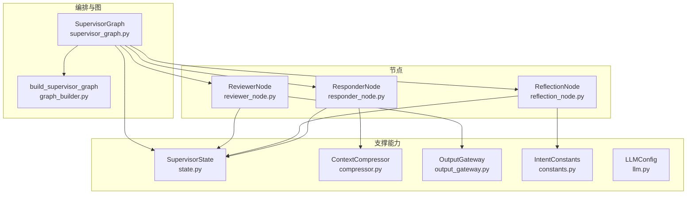
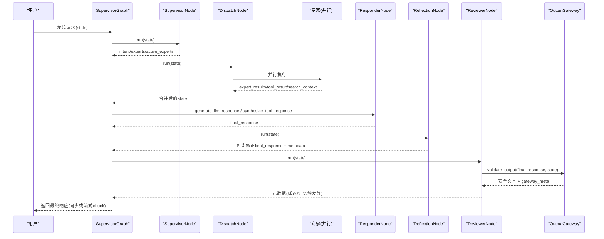
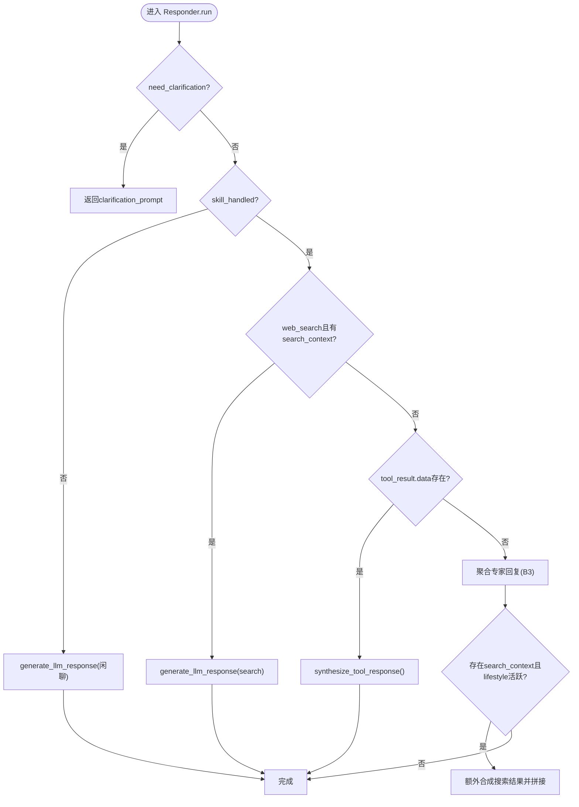
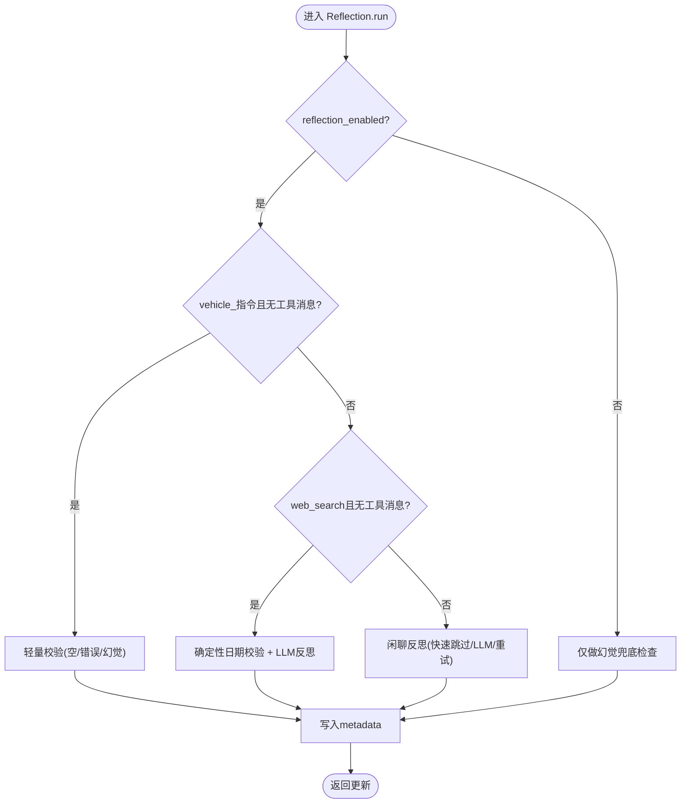
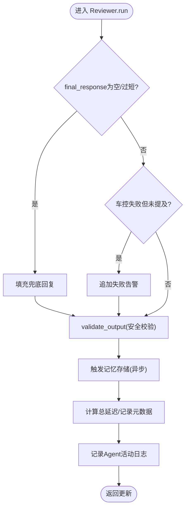
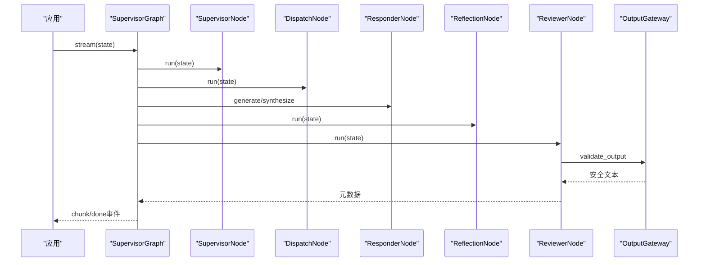
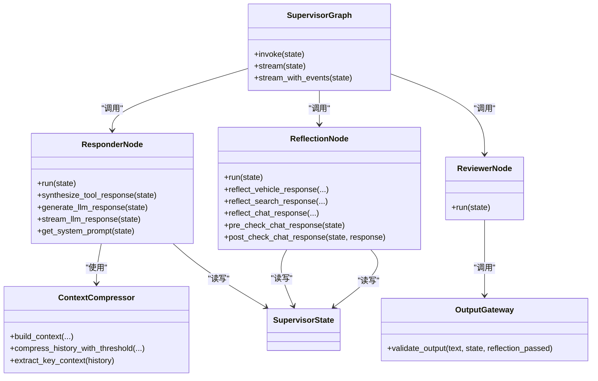

# 响应反思审查系统

<cite>
**本文引用的文件**   
- [responder_node.py](file://backend_design/nexus/agent/nodes/responder_node.py)
- [reflection_node.py](file://backend_design/nexus/agent/nodes/reflection_node.py)
- [reviewer_node.py](file://backend_design/nexus/agent/nodes/reviewer_node.py)
- [supervisor_graph.py](file://backend_design/nexus/agent/supervisor_graph.py)
- [graph_builder.py](file://backend_design/nexus/agent/graph_builder.py)
- [state.py](file://backend_design/nexus/models/state.py)
- [compressor.py](file://backend_design/nexus/memory/compressor.py)
- [output_gateway.py](file://backend_design/nexus/agent/output_gateway.py)
- [constants.py](file://backend_design/nexus/intent/constants.py)
- [llm.py](file://backend_design/nexus/config/llm.py)
</cite>

## 目录
1. [引言](#引言)
2. [项目结构](#项目结构)
3. [核心组件](#核心组件)
4. [架构总览](#架构总览)
5. [详细组件分析](#详细组件分析)
6. [依赖关系分析](#依赖关系分析)
7. [性能考量](#性能考量)
8. [故障排查指南](#故障排查指南)
9. [结论](#结论)

## 引言
本文件面向 NexusCockpit 的“响应—反思—审查”三阶段工作流，系统性说明 ResponderAgent（ResponderNode）的回复生成机制、ReflectionNode 的反思校验逻辑与 ReviewerNode 的终审流程。重点覆盖：
- 多源信息整合（专家结果、工具数据、搜索上下文、用户画像/记忆/习惯、位置状态）
- Tool→LLM 合成策略与流式输出处理
- 事实性检查、一致性验证与幻觉检测
- 质量评估、安全检查与记忆存储
- 三者协作机制、状态传递与数据流转
- 调试方法、性能优化与故障排查

## 项目结构
该子系统位于 backend_design/nexus/agent 与相关模型/配置模块中，采用 LangGraph 编排五层链路：Supervisor → Dispatch → Responder → Reflection → Reviewer → END。关键文件职责如下：
- 编排入口与图构建：supervisor_graph.py、graph_builder.py
- 节点实现：responder_node.py、reflection_node.py、reviewer_node.py
- 共享状态定义：state.py
- 上下文压缩器：compressor.py
- 全局输出网关：output_gateway.py
- 意图常量与模式：constants.py
- LLM 配置：llm.py

**图表来源** 
- [supervisor_graph.py:93-179](file://backend_design/nexus/agent/supervisor_graph.py#L93-L179)
- [graph_builder.py:40-119](file://backend_design/nexus/agent/graph_builder.py#L40-L119)
- [state.py:38-106](file://backend_design/nexus/models/state.py#L38-L106)

**章节来源**
- [supervisor_graph.py:93-179](file://backend_design/nexus/agent/supervisor_graph.py#L93-L179)
- [graph_builder.py:40-119](file://backend_design/nexus/agent/graph_builder.py#L40-L119)
- [state.py:38-106](file://backend_design/nexus/models/state.py#L38-L106)

## 核心组件
- ResponderNode：汇总专家输出，按分支选择策略（澄清/搜索/Tool→LLM合成/车控聚合/闲聊），构建 System Prompt，执行预/后校验，支持非流式与流式输出。
- ReflectionNode：对 LLM 输出进行事实性、一致性、无幻觉与车载合规性检查；含确定性日期校验、快速跳过与渐进式 retry。
- ReviewerNode：终审强校验（空内容兜底、车控失败告警、Output Gateway 合规）、触发记忆存储与对话向量化、延迟统计与 Agent 活动日志。

**章节来源**
- [responder_node.py:34-174](file://backend_design/nexus/agent/nodes/responder_node.py#L34-L174)
- [reflection_node.py:46-248](file://backend_design/nexus/agent/nodes/reflection_node.py#L46-L248)
- [reviewer_node.py:26-184](file://backend_design/nexus/agent/nodes/reviewer_node.py#L26-L184)

## 架构总览
五层链路的调用顺序与数据流向如下：

**图表来源** 
- [supervisor_graph.py:183-207](file://backend_design/nexus/agent/supervisor_graph.py#L183-L207)
- [supervisor_graph.py:209-384](file://backend_design/nexus/agent/supervisor_graph.py#L209-L384)
- [graph_builder.py:96-119](file://backend_design/nexus/agent/graph_builder.py#L96-L119)

**章节来源**
- [supervisor_graph.py:183-384](file://backend_design/nexus/agent/supervisor_graph.py#L183-L384)
- [graph_builder.py:96-119](file://backend_design/nexus/agent/graph_builder.py#L96-L119)

## 详细组件分析

### ResponderNode：回复生成与多源整合
- 分支策略
  - A：需要澄清 → 直接返回 clarification_prompt
  - B1：搜索类技能 → 使用 search 提示词生成
  - B2：工具结构化数据 → Tool→LLM 合成
  - B3：简单车控指令 → 聚合所有专家回复
  - B5：复合查询混合 → 车控回复 + LLM 合成搜索结果拼接
  - C：LLM 闲聊兜底
- Tool→LLM 合成
  - 失败/未知结果快速回退原始消息
  - 短消息快速路径（≤50字符）避免不必要 LLM 调用
  - 导航类特殊约束，禁止编造路线/距离/时间
  - 不注入记忆与习惯，降低幻觉风险
- System Prompt 构建
  - 动态模板（chat/search/vehicle）
  - 注入用户画像、记忆、习惯、当前位置状态、关键上下文
  - 历史摘要引导（当用户询问历史时）
- 流式输出
  - stream_llm_response 逐块产出，异常时回退为搜索结果或兜底话术
- 指标与可观测
  - LLM_CALLS、LLM_LATENCY、Langfuse span 记录模型名与 Token 用量

**图表来源** 
- [responder_node.py:58-174](file://backend_design/nexus/agent/nodes/responder_node.py#L58-L174)
- [responder_node.py:180-310](file://backend_design/nexus/agent/nodes/responder_node.py#L180-L310)
- [responder_node.py:316-450](file://backend_design/nexus/agent/nodes/responder_node.py#L316-L450)

**章节来源**
- [responder_node.py:58-174](file://backend_design/nexus/agent/nodes/responder_node.py#L58-L174)
- [responder_node.py:180-310](file://backend_design/nexus/agent/nodes/responder_node.py#L180-L310)
- [responder_node.py:316-450](file://backend_design/nexus/agent/nodes/responder_node.py#L316-L450)
- [responder_node.py:455-570](file://backend_design/nexus/agent/nodes/responder_node.py#L455-L570)
- [responder_node.py:597-670](file://backend_design/nexus/agent/nodes/responder_node.py#L597-L670)

### ReflectionNode：反思校验与幻觉检测
- 运行分支
  - 车控轻量校验：确定性检查（空回复、错误提及、幻觉兜底）
  - 搜索类反思：确定性日期校验 + LLM 反思（基于搜索结果）
  - 通用闲聊反思：快速跳过阈值 + 渐进式 retry
- 确定性日期校验
  - 正则检测“今天/明天/后天”日期错误并自动修正
- 幻觉检测
  - 预校验：无历史+用户问历史 → 拦截并返回安全回复
  - 后校验：无历史但出现编造历史模式 → 替换为安全回复
- 渐进式重试
  - 反思不通过且无建议 → 带反馈重新生成一次
- 元数据记录
  - reflection_result、reflection_reason、latency_ms、original_response 等

**图表来源** 
- [reflection_node.py:82-248](file://backend_design/nexus/agent/nodes/reflection_node.py#L82-L248)
- [reflection_node.py:254-308](file://backend_design/nexus/agent/nodes/reflection_node.py#L254-L308)
- [reflection_node.py:314-376](file://backend_design/nexus/agent/nodes/reflection_node.py#L314-L376)
- [reflection_node.py:382-485](file://backend_design/nexus/agent/nodes/reflection_node.py#L382-L485)
- [reflection_node.py:512-656](file://backend_design/nexus/agent/nodes/reflection_node.py#L512-L656)
- [reflection_node.py:753-788](file://backend_design/nexus/agent/nodes/reflection_node.py#L753-L788)

**章节来源**
- [reflection_node.py:82-248](file://backend_design/nexus/agent/nodes/reflection_node.py#L82-L248)
- [reflection_node.py:254-308](file://backend_design/nexus/agent/nodes/reflection_node.py#L254-L308)
- [reflection_node.py:314-376](file://backend_design/nexus/agent/nodes/reflection_node.py#L314-L376)
- [reflection_node.py:382-485](file://backend_design/nexus/agent/nodes/reflection_node.py#L382-L485)
- [reflection_node.py:512-656](file://backend_design/nexus/agent/nodes/reflection_node.py#L512-L656)
- [reflection_node.py:753-788](file://backend_design/nexus/agent/nodes/reflection_node.py#L753-L788)

### ReviewerNode：终审审查与记忆存储
- 质量检查
  - 空/极短内容填充兜底
  - 车控失败告警：若专家标记 error 而回复未提及失败，追加警告
- 合规性校验
  - 通过 Output Gateway 统一校验（敏感/长度/幻觉/车控完整性）
- 记忆存储
  - 异步触发三元组提取与对话向量化
- 延迟统计与日志
  - 累计各阶段 latency_ms，记录 Agent 活动到 MySQL subagent_logs

**图表来源** 
- [reviewer_node.py:39-184](file://backend_design/nexus/agent/nodes/reviewer_node.py#L39-L184)
- [output_gateway.py:64-195](file://backend_design/nexus/agent/output_gateway.py#L64-L195)

**章节来源**
- [reviewer_node.py:39-184](file://backend_design/nexus/agent/nodes/reviewer_node.py#L39-L184)
- [output_gateway.py:64-195](file://backend_design/nexus/agent/output_gateway.py#L64-L195)

### SupervisorGraph：编排与流式事件
- 同步 invoke：执行完整链路，并在阈值压缩后用 _compressed_history 替换 history 供持久化
- 流式 stream：全链路强制闭环（Supervisor → Dispatch → Responder → Reflection → Reviewer → Output Gateway），中间发送 thinking/experts/action 等事件
- 错误短路消除：即使 LLM 不可用，仍走 Reviewer + Output Gateway 保证安全输出

**图表来源** 
- [supervisor_graph.py:209-384](file://backend_design/nexus/agent/supervisor_graph.py#L209-L384)
- [supervisor_graph.py:386-617](file://backend_design/nexus/agent/supervisor_graph.py#L386-L617)

**章节来源**
- [supervisor_graph.py:183-207](file://backend_design/nexus/agent/supervisor_graph.py#L183-L207)
- [supervisor_graph.py:209-384](file://backend_design/nexus/agent/supervisor_graph.py#L209-L384)
- [supervisor_graph.py:386-617](file://backend_design/nexus/agent/supervisor_graph.py#L386-L617)

### ContextCompressor：上下文压缩与滚动摘要
- 分级预算组装：Level0 直接返回；Level1 压缩检索上下文；Level2 trim_messages裁剪历史+LLM摘要；Level3 压缩记忆
- 阈值压缩：超阈值将旧对话压缩为滚动摘要，保持最近若干轮
- 关键上下文提取：正则零 LLM 调用提取位置/偏好/身份
- 查询增强：模糊查询自动补充位置/偏好

**章节来源**
- [compressor.py:36-112](file://backend_design/nexus/memory/compressor.py#L36-L112)
- [compressor.py:155-179](file://backend_design/nexus/memory/compressor.py#L155-L179)
- [compressor.py:181-244](file://backend_design/nexus/memory/compressor.py#L181-L244)
- [compressor.py:246-294](file://backend_design/nexus/memory/compressor.py#L246-L294)
- [compressor.py:316-395](file://backend_design/nexus/memory/compressor.py#L316-L395)

### SupervisorState：共享状态与Reducer
- TypedDict 定义，支持 Annotated reducer：list 累加、dict 合并
- 关键字段：expert_results、active_experts、history、running_summary、tool_result、_compressed_history、metadata 等
- create_initial_state：确保 reducer 字段初始值正确

**章节来源**
- [state.py:38-106](file://backend_design/nexus/models/state.py#L38-L106)
- [state.py:108-165](file://backend_design/nexus/models/state.py#L108-L165)

## 依赖关系分析
- ResponderNode 依赖 NodeContext（LLM、PromptManager、Compressor、Experts）
- ReflectionNode 依赖 NodeContext（LLM）与 IntentConstants（幻觉模式）
- ReviewerNode 依赖 NodeContext（MemoryManager）与 OutputGateway
- SupervisorGraph 编排上述节点，并通过 graph_builder 注册边与编译图

**图表来源** 
- [supervisor_graph.py:93-179](file://backend_design/nexus/agent/supervisor_graph.py#L93-L179)
- [responder_node.py:34-174](file://backend_design/nexus/agent/nodes/responder_node.py#L34-L174)
- [reflection_node.py:46-248](file://backend_design/nexus/agent/nodes/reflection_node.py#L46-L248)
- [reviewer_node.py:26-184](file://backend_design/nexus/agent/nodes/reviewer_node.py#L26-L184)
- [compressor.py:316-395](file://backend_design/nexus/memory/compressor.py#L316-L395)
- [output_gateway.py:64-195](file://backend_design/nexus/agent/output_gateway.py#L64-L195)
- [state.py:38-106](file://backend_design/nexus/models/state.py#L38-L106)

**章节来源**
- [supervisor_graph.py:93-179](file://backend_design/nexus/agent/supervisor_graph.py#L93-L179)
- [responder_node.py:34-174](file://backend_design/nexus/agent/nodes/responder_node.py#L34-L174)
- [reflection_node.py:46-248](file://backend_design/nexus/agent/nodes/reflection_node.py#L46-L248)
- [reviewer_node.py:26-184](file://backend_design/nexus/agent/nodes/reviewer_node.py#L26-L184)
- [compressor.py:316-395](file://backend_design/nexus/memory/compressor.py#L316-L395)
- [output_gateway.py:64-195](file://backend_design/nexus/agent/output_gateway.py#L64-L195)
- [state.py:38-106](file://backend_design/nexus/models/state.py#L38-L106)

## 性能考量
- 快速路径与阈值控制
  - Responder：Tool→LLM 合成的短消息快速跳过（≤50字符）
  - Reflection：短回复+失败关键词快速跳过（≤100字符）
  - ContextCompressor：trim_messages 裁剪历史，阈值压缩滚动摘要
- LLM 调用开销
  - 低温度用于事实性场景（Tool→LLM 合成 temperature=0.3；闲聊 0.7）
  - 反射反思设置超时（15s），失败降级
- 指标与可观测
  - LLM_CALLS、LLM_LATENCY、Langfuse span 记录模型名与 Token 用量
  - Reviewer 累计 total_latency_ms，便于瓶颈定位

[本节为通用指导，无需特定文件引用]

## 故障排查指南
- 常见问题定位
  - 空/过短输出：检查 Reviewer 兜底逻辑与 Output Gateway 非空校验
  - 车控失败未提示：检查 Reviewer 车控失败告警与 Output Gateway 车控完整性校验
  - 幻觉历史：检查 Reflection 预/后校验与 Output Gateway 幻觉模式检测
  - 日期错误：检查 Reflection 确定性日期校验
  - LLM 不可用：检查 SupervisorGraph 错误短路处理与兜底输出
- 调试建议
  - 启用 reflection_enabled=false 仅保留轻量检查，缩短排障时间
  - 观察 metadata 中的 reflection_result、gateway_result、latency_ms
  - 查看日志中的“FAST-SKIPPED”“TIMEOUT”“fallback”等关键字
- 配置要点
  - LLM 配置（provider、model、timeout、reflection_enabled）
  - 记忆压缩阈值（compress_threshold_turns、keep_recent_turns、max_summary_chars）

**章节来源**
- [reviewer_node.py:39-184](file://backend_design/nexus/agent/nodes/reviewer_node.py#L39-L184)
- [output_gateway.py:64-195](file://backend_design/nexus/agent/output_gateway.py#L64-L195)
- [reflection_node.py:82-248](file://backend_design/nexus/agent/nodes/reflection_node.py#L82-L248)
- [reflection_node.py:314-376](file://backend_design/nexus/agent/nodes/reflection_node.py#L314-L376)
- [supervisor_graph.py:209-384](file://backend_design/nexus/agent/supervisor_graph.py#L209-L384)
- [llm.py:15-72](file://backend_design/nexus/config/llm.py#L15-L72)
- [compressor.py:246-294](file://backend_design/nexus/memory/compressor.py#L246-L294)

## 结论
本系统通过 ResponderNode 的多分支回复生成、ReflectionNode 的全链路反思校验与 ReviewerNode 的终审把关，构建了高可靠、低幻觉、可观测的车载语音助手响应流水线。配合 ContextCompressor 的上下文压缩与滚动摘要、OutputGateway 的统一安全校验，以及 SupervisorGraph 的编排与流式事件，实现了端到端的质量保障与用户体验优化。建议在上线前充分调优阈值与温度参数，结合指标与日志持续监控，确保在复杂交互场景下的稳定性与准确性。