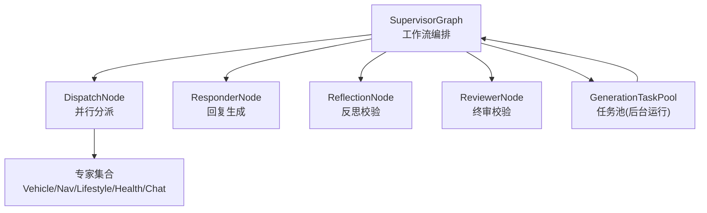
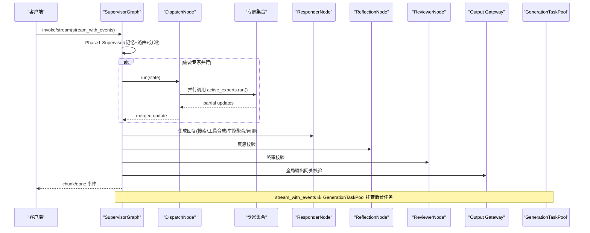
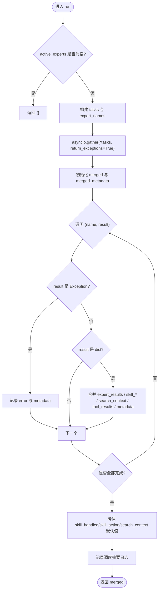
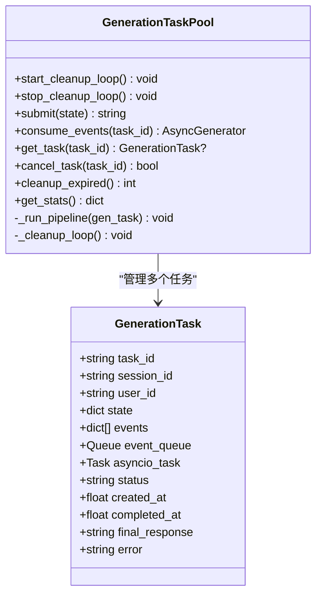
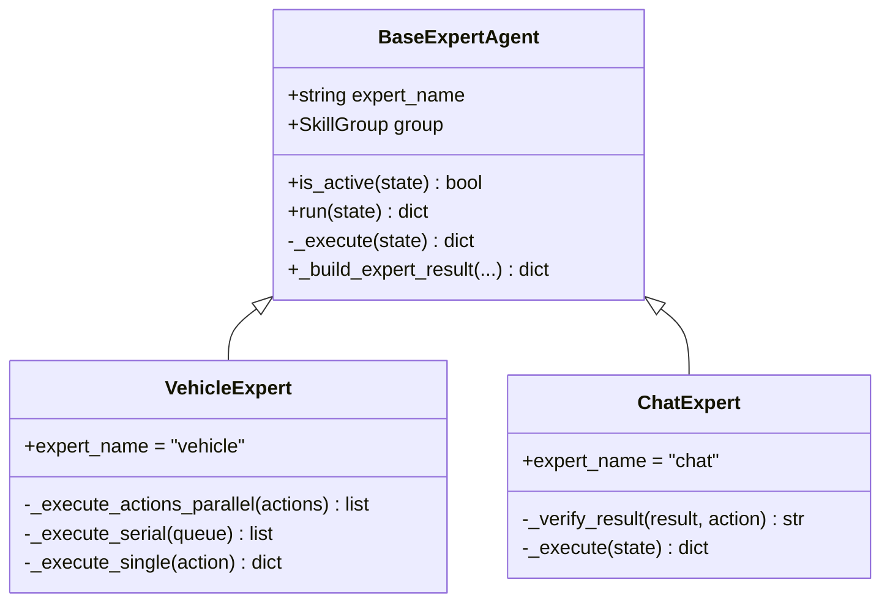
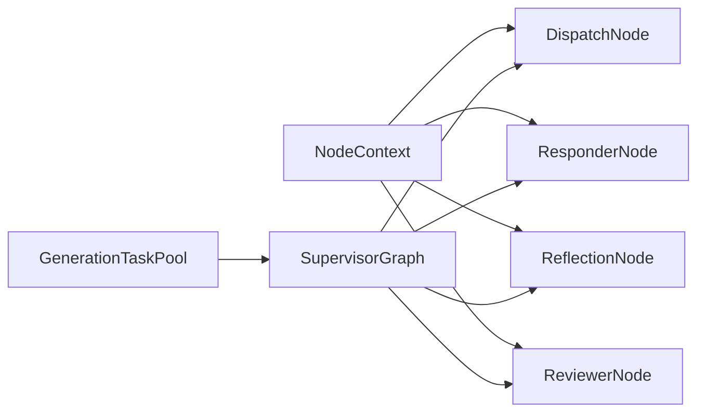

# 并行分发执行器

<cite>
**本文引用的文件**   
- [dispatch_node.py](file://backend_design/nexus/agent/nodes/dispatch_node.py)
- [generation_task_pool.py](file://backend_design/nexus/agent/generation_task_pool.py)
- [supervisor_graph.py](file://backend_design/nexus/agent/supervisor_graph.py)
- [context.py](file://backend_design/nexus/agent/nodes/context.py)
- [base.py](file://backend_design/nexus/agent/experts/base.py)
- [vehicle_expert.py](file://backend_design/nexus/agent/experts/vehicle_expert.py)
- [chat_expert.py](file://backend_design/nexus/agent/experts/chat_expert.py)
- [metrics.py](file://backend_design/nexus/observability/metrics.py)
- [logger.py](file://backend_design/nexus/core/logger.py)
- [langfuse.py](file://backend_design/nexus/observability/langfuse.py)
</cite>

## 目录
1. [简介](#简介)
2. [项目结构](#项目结构)
3. [核心组件](#核心组件)
4. [架构总览](#架构总览)
5. [详细组件分析](#详细组件分析)
6. [依赖关系分析](#依赖关系分析)
7. [性能考量与优化建议](#性能考量与优化建议)
8. [故障排查指南](#故障排查指南)
9. [结论](#结论)
10. [附录：扩展并行处理能力的示例](#附录：扩展并行处理能力的示例)

## 简介
本文件面向 NexusCockpit 的“并行分发执行器”，聚焦以下目标：
- 深入解释 DispatchNode 的并行执行机制（基于 asyncio.gather）、任务池管理与结果合并策略。
- 详细说明 GenerationTaskPool 的任务调度算法、负载均衡与错误处理机制。
- 文档化专家 Agent 的并发调用、超时控制与资源管理。
- 提供性能监控、瓶颈分析与优化建议，并给出可扩展的并行能力实践示例。

## 项目结构
与并行分发执行相关的关键模块位于 agent 子系统中：
- 工作流编排入口：SupervisorGraph（编排 Supervisor → 专家并行 → Responder → Reflection → Reviewer）
- 并行分派节点：DispatchNode（使用 asyncio.gather 并行执行活跃专家）
- 生成任务池：GenerationTaskPool（独立托管 AI 生成任务，解耦 SSE 连接）
- 共享依赖容器：NodeContext（注入专家、Responder、Reviewer、LLM 等）
- 专家基类与具体实现：BaseExpertAgent、VehicleExpert、ChatExpert 等
- 可观测性：Langfuse 追踪、Prometheus 指标、结构化日志

图表来源
- [supervisor_graph.py:93-179](file://backend_design/nexus/agent/supervisor_graph.py#L93-L179)
- [dispatch_node.py:25-62](file://backend_design/nexus/agent/nodes/dispatch_node.py#L25-L62)
- [generation_task_pool.py:68-144](file://backend_design/nexus/agent/generation_task_pool.py#L68-L144)

章节来源
- [supervisor_graph.py:93-179](file://backend_design/nexus/agent/supervisor_graph.py#L93-L179)
- [context.py:31-64](file://backend_design/nexus/agent/nodes/context.py#L31-L64)

## 核心组件
- DispatchNode：从 NodeContext 获取活跃专家列表，使用 asyncio.gather 并行执行所有专家的 run()，并将 partial updates 合并为最终 update。
- GenerationTaskPool：将 pipeline 的执行放入后台 asyncio.Task，事件通过 asyncio.Queue 缓冲；支持并发限制、取消、过期清理与统计。
- BaseExpertAgent：统一专家接口，封装 _execute 抽象方法，自动记录耗时与错误元数据，并提供 _build_expert_result 构建标准返回结构。
- VehicleExpert：车控专家内部对多动作进行分组（互斥组串行、非互斥组并行），并对每个动作设置超时保护。
- ChatExpert：闲聊专家，根据意图分支决定直接返回或交由 Responder 走 LLM 分支。

章节来源
- [dispatch_node.py:25-140](file://backend_design/nexus/agent/nodes/dispatch_node.py#L25-L140)
- [generation_task_pool.py:68-304](file://backend_design/nexus/agent/generation_task_pool.py#L68-L304)
- [base.py:26-140](file://backend_design/nexus/agent/experts/base.py#L26-L140)
- [vehicle_expert.py:43-200](file://backend_design/nexus/agent/experts/vehicle_expert.py#L43-L200)
- [chat_expert.py:24-71](file://backend_design/nexus/agent/experts/chat_expert.py#L24-L71)

## 架构总览
下图展示一次典型请求在 SupervisorGraph 中的流转，以及 DispatchNode 与 GenerationTaskPool 的协作关系。

图表来源
- [supervisor_graph.py:183-384](file://backend_design/nexus/agent/supervisor_graph.py#L183-L384)
- [supervisor_graph.py:386-617](file://backend_design/nexus/agent/supervisor_graph.py#L386-L617)
- [dispatch_node.py:38-140](file://backend_design/nexus/agent/nodes/dispatch_node.py#L38-L140)
- [generation_task_pool.py:113-189](file://backend_design/nexus/agent/generation_task_pool.py#L113-L189)

## 详细组件分析

### DispatchNode 并行分派与结果合并
- 并行执行：遍历 active_experts，收集 expert.run(state) 协程，使用 asyncio.gather(*tasks, return_exceptions=True) 并行执行。
- 结果合并策略：
  - 累加 expert_results 列表
  - 合并 skill_action、skill_handled、search_context
  - 传递 has_side_effect 标记（车控指令禁止缓存）
  - 收集 tool_result 到顶层 tool_results 列表，保留首个作为主结果（向后兼容）
  - 合并 metadata，记录 multi_actions 用于调试
- 错误处理：若某专家抛出异常，记录 error 字段并继续合并其他结果，保证整体流程不中断。

图表来源
- [dispatch_node.py:38-140](file://backend_design/nexus/agent/nodes/dispatch_node.py#L38-L140)

章节来源
- [dispatch_node.py:38-140](file://backend_design/nexus/agent/nodes/dispatch_node.py#L38-L140)

### GenerationTaskPool 任务调度与生命周期
- 任务提交：submit() 检查并发上限（_MAX_CONCURRENT），创建 GenerationTask，启动后台 asyncio.Task 执行 pipeline。
- 事件缓冲：pipeline 产生的事件写入 event_queue 与 events 列表，SSE 消费者通过 consume_events() 读取。
- 状态机：pending → running → completed/failed/cancelled，支持用户主动 cancel_task()。
- 清理机制：后台循环定期清理已完成超过 _EXPIRE_SECONDS 的任务，防止内存泄漏。
- 统计信息：get_stats() 暴露 total/running/completed/failed/max_concurrent。

图表来源
- [generation_task_pool.py:36-66](file://backend_design/nexus/agent/generation_task_pool.py#L36-L66)
- [generation_task_pool.py:68-304](file://backend_design/nexus/agent/generation_task_pool.py#L68-L304)

章节来源
- [generation_task_pool.py:113-189](file://backend_design/nexus/agent/generation_task_pool.py#L113-L189)
- [generation_task_pool.py:190-258](file://backend_design/nexus/agent/generation_task_pool.py#L190-L258)
- [generation_task_pool.py:259-304](file://backend_design/nexus/agent/generation_task_pool.py#L259-L304)

### 专家 Agent 的并发调用、超时控制与资源管理
- BaseExpertAgent：
  - is_active(state) 判断是否在 active_experts 中
  - run(state) 包装 _execute()，自动记录 latency_ms 与错误元数据
  - _build_expert_result() 标准化返回结构，可选 skip_synthesis 跳过 Tool→LLM 合成
- VehicleExpert：
  - 按互斥组分组，组内串行、组间并行，避免硬件冲突
  - 单个动作执行设置超时（如 10s），失败时返回标准化 SkillResult
- ChatExpert：
  - 声纹注册直接返回自然语言消息；纯闲聊不标记 handled，交由 Responder 走 LLM 分支

图表来源
- [base.py:26-140](file://backend_design/nexus/agent/experts/base.py#L26-L140)
- [vehicle_expert.py:43-200](file://backend_design/nexus/agent/experts/vehicle_expert.py#L43-L200)
- [chat_expert.py:24-71](file://backend_design/nexus/agent/experts/chat_expert.py#L24-L71)

章节来源
- [base.py:44-87](file://backend_design/nexus/agent/experts/base.py#L44-L87)
- [vehicle_expert.py:117-200](file://backend_design/nexus/agent/experts/vehicle_expert.py#L117-L200)
- [chat_expert.py:49-71](file://backend_design/nexus/agent/experts/chat_expert.py#L49-L71)

### SupervisorGraph 流式事件与全链路闭环
- stream_with_events() 强制闭环：Supervisor → Dispatch → Responder → Reflection → Reviewer → Output Gateway
- 立即发送 thinking 事件，提升前端加载体验
- 针对 LLM 不可用、澄清分支、复合请求（车控+历史查询/搜索）等场景分别处理
- done 事件携带 response、latency_ms、intent、action 等元数据

章节来源
- [supervisor_graph.py:386-617](file://backend_design/nexus/agent/supervisor_graph.py#L386-L617)

## 依赖关系分析
- NodeContext 作为共享依赖容器，向各节点注入 IntentRouter、MemoryManager、SkillRegistry、LLM、Experts、Responder、Reviewer、PromptManager、CheckpointSaver。
- DispatchNode 仅依赖 NodeContext.experts，不持有 SupervisorGraph 引用，降低耦合。
- GenerationTaskPool 依赖 SupervisorGraph.stream_with_events，但通过事件队列解耦 SSE 消费与 pipeline 执行。

图表来源
- [context.py:31-64](file://backend_design/nexus/agent/nodes/context.py#L31-L64)
- [supervisor_graph.py:140-179](file://backend_design/nexus/agent/supervisor_graph.py#L140-L179)
- [generation_task_pool.py:90-144](file://backend_design/nexus/agent/generation_task_pool.py#L90-L144)

章节来源
- [context.py:31-64](file://backend_design/nexus/agent/nodes/context.py#L31-L64)
- [supervisor_graph.py:140-179](file://backend_design/nexus/agent/supervisor_graph.py#L140-L179)

## 性能考量与优化建议
- 并发控制
  - GenerationTaskPool._MAX_CONCURRENT 限制最大并发任务数，避免过载。
  - 建议根据 CPU/IO 特性与外部服务 QPS 调整该值，并通过 get_stats() 监控。
- 超时与熔断
  - VehicleExpert 对单个动作设置超时（如 10s），避免长时间阻塞。
  - 建议在更高层引入熔断/降级策略（例如 LLM 不可用时走兜底响应）。
- 结果合并开销
  - DispatchNode 合并 expert_results、tool_results、metadata 等，注意大对象拼接的性能影响。
  - 建议对 search_context 等大文本采用增量拼接或延迟合并。
- 资源管理
  - GenerationTaskPool 后台清理循环定期释放已完成任务，避免内存泄漏。
  - 建议结合 Prometheus 指标（nexus_agent_latency_seconds、nexus_requests_total）与 Langfuse 追踪定位热点。
- 监控与可观测性
  - 使用 metrics.py 暴露 Prometheus 指标，结合 Grafana 可视化。
  - 使用 langfuse.py 的 @observe 装饰器埋点关键函数，便于端到端追踪。
  - 使用 logger.py 的结构化日志（JSON）采集与分析。

[本节为通用指导，无需特定文件引用]

## 故障排查指南
- 专家执行异常
  - 现象：DispatchNode 记录 Expert 'xxx' raised: ...，merged 中包含 error 字段。
  - 排查：查看对应专家 _execute 实现与技能执行日志，确认参数合法性与外部服务可用性。
- 任务池满
  - 现象：submit() 抛出 RuntimeError("Task pool full: ...")。
  - 排查：提高 _MAX_CONCURRENT 或优化下游服务吞吐；观察 get_stats() 的 running 计数。
- 生成失败
  - 现象：consume_events() 收到 error 事件，status=failed，error 包含异常信息。
  - 排查：检查 pipeline 异常路径与日志，必要时启用 Langfuse 追踪定位。
- 超时问题
  - 现象：VehicleExpert 记录 timeout，返回标准化错误消息。
  - 排查：检查设备在线状态与网络延迟，适当调整超时阈值。

章节来源
- [dispatch_node.py:68-78](file://backend_design/nexus/agent/nodes/dispatch_node.py#L68-L78)
- [generation_task_pool.py:122-126](file://backend_design/nexus/agent/generation_task_pool.py#L122-L126)
- [generation_task_pool.py:177-189](file://backend_design/nexus/agent/generation_task_pool.py#L177-L189)
- [vehicle_expert.py:187-200](file://backend_design/nexus/agent/experts/vehicle_expert.py#L187-L200)

## 结论
NexusCockpit 的并行分发执行器通过 DispatchNode 的 asyncio.gather 并行执行与 GenerationTaskPool 的后台任务托管，实现了高吞吐、低耦合、强可观测的多 Agent 工作流。结合专家基类的统一接口与车控专家的互斥组串行策略，系统在复杂车载场景中具备良好稳定性与可扩展性。配合 Prometheus、Langfuse 与结构化日志，可实现全面的性能监控与问题定位。

[本节为总结，无需特定文件引用]

## 附录：扩展并行处理能力的示例
- 新增专家
  - 继承 BaseExpertAgent，实现 _execute(state)，返回 _build_expert_result(...)。
  - 在 SupervisorGraph.__init__ 中注册新专家到 self.experts。
  - 在 SupervisorNode 的分派逻辑中将新专家加入 active_experts。
- 调整并发上限
  - 修改 GenerationTaskPool._MAX_CONCURRENT，并结合 get_stats() 监控 running 数量。
- 增加超时控制
  - 在专家 _execute 中对 IO 操作使用 asyncio.wait_for(..., timeout=...) 包裹。
- 增强结果合并
  - 在 DispatchNode 合并逻辑中扩展 key（如新增字段），确保默认值与去重策略合理。
- 接入监控
  - 在关键函数上使用 @observe(name="...") 装饰器，导出 Langfuse 追踪。
  - 在 FastAPI 层暴露 /metrics 端点，使用 prometheus_client 指标。

章节来源
- [base.py:85-140](file://backend_design/nexus/agent/experts/base.py#L85-L140)
- [supervisor_graph.py:121-128](file://backend_design/nexus/agent/supervisor_graph.py#L121-L128)
- [generation_task_pool.py:86-89](file://backend_design/nexus/agent/generation_task_pool.py#L86-L89)
- [vehicle_expert.py:187-200](file://backend_design/nexus/agent/experts/vehicle_expert.py#L187-L200)
- [dispatch_node.py:84-116](file://backend_design/nexus/agent/nodes/dispatch_node.py#L84-L116)
- [langfuse.py:44-86](file://backend_design/nexus/observability/langfuse.py#L44-L86)
- [metrics.py:1-108](file://backend_design/nexus/observability/metrics.py#L1-L108)