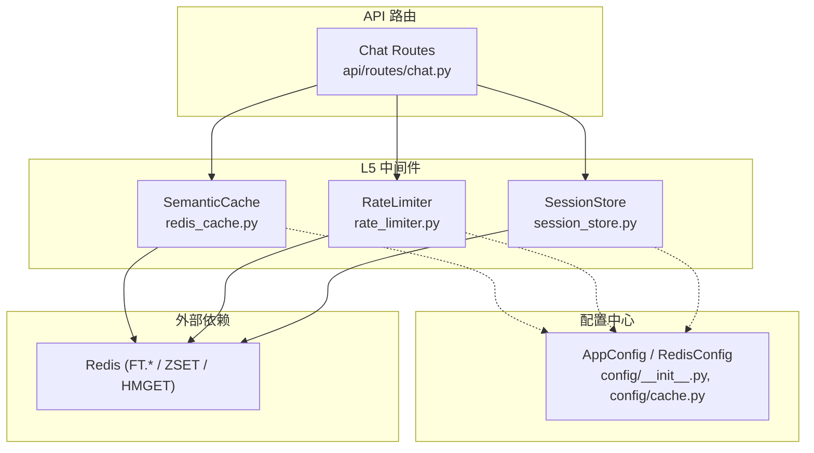
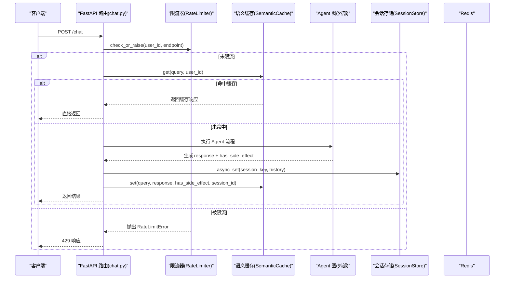
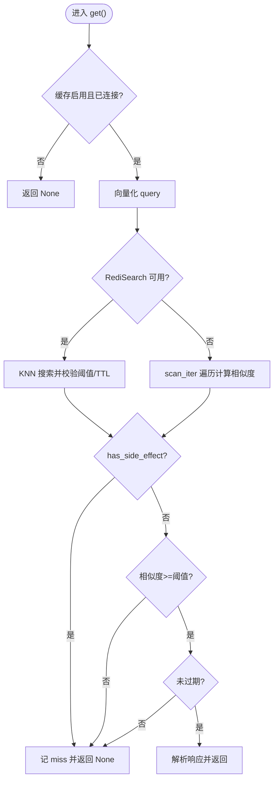
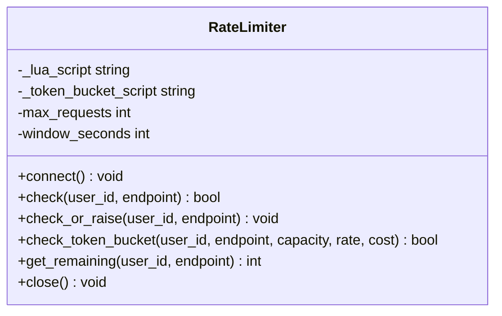
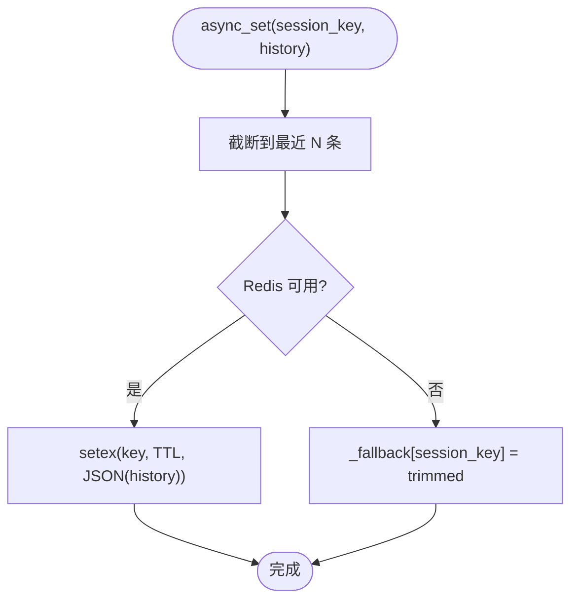
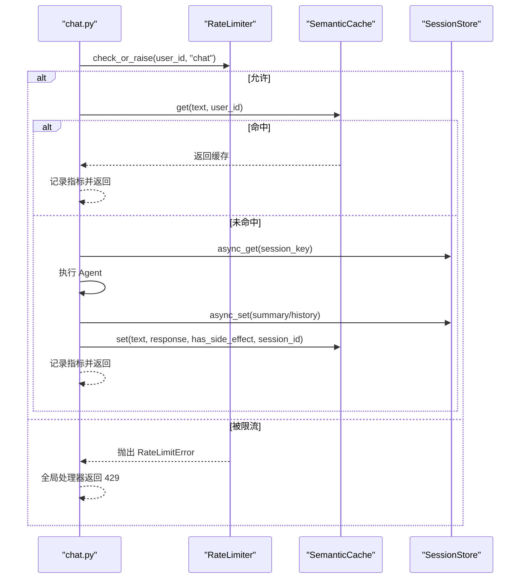
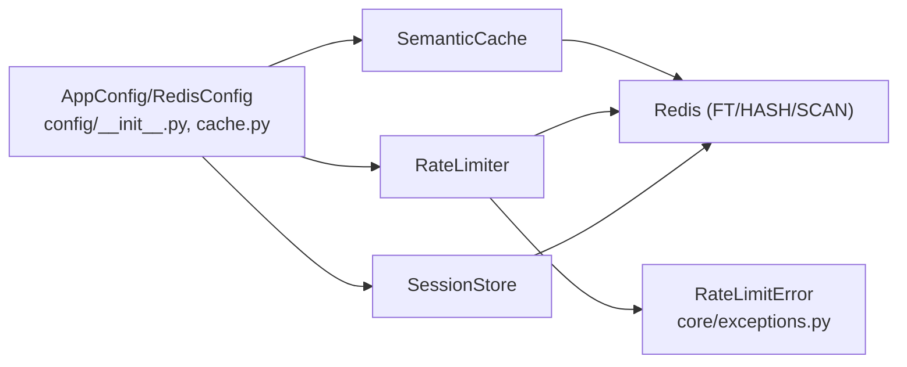

# L5 中间件层

<cite>
**本文引用的文件**   
- [redis_cache.py](file://backend_design/nexus/middleware/redis_cache.py)
- [rate_limiter.py](file://backend_design/nexus/middleware/rate_limiter.py)
- [session_store.py](file://backend_design/nexus/middleware/session_store.py)
- [cache.py](file://backend_design/nexus/config/cache.py)
- [__init__.py](file://backend_design/nexus/config/__init__.py)
- [chat.py](file://backend_design/nexus/api/routes/chat.py)
- [exceptions.py](file://backend_design/nexus/core/exceptions.py)
</cite>

## 目录
1. [引言](#引言)
2. [项目结构](#项目结构)
3. [核心组件](#核心组件)
4. [架构总览](#架构总览)
5. [详细组件分析](#详细组件分析)
6. [依赖关系分析](#依赖关系分析)
7. [性能考量与调优](#性能考量与调优)
8. [故障排查指南](#故障排查指南)
9. [结论](#结论)
10. [附录：配置项速查](#附录配置项速查)

## 引言
本文件面向 NexusCockpit 的 L5 中间件层，聚焦以下能力：
- Redis 语义缓存：向量相似度检索、TTL 分级、车控指令安全隔离、分布式锁防击穿（通过上层调用方实现）、扫描降级兼容。
- 限流器：滑动窗口与令牌桶两种算法，均基于 Redis Lua 脚本保证原子性与分布式一致性。
- 会话存储：Redis 持久化 + 内存降级，支持滚动摘要持久化与会话生命周期管理。
- 配置与集成：统一配置入口、环境变量映射、运行时开关与阈值。
- 性能与可靠性：命中率统计、指标上报、异常降级与恢复策略。

## 项目结构
L5 中间件层位于 backend_design/nexus/middleware，包含三大模块：
- redis_cache.py：基于 Redis 8 RediSearch 的语义缓存（KNN 向量检索）与 O(n) 扫描降级。
- rate_limiter.py：基于 Redis Lua 的滑动窗口与令牌桶分布式限流。
- session_store.py：基于 Redis 的会话历史与滚动摘要持久化，具备内存降级。

图表来源
- [redis_cache.py:1-120](file://backend_design/nexus/middleware/redis_cache.py#L1-L120)
- [rate_limiter.py:1-120](file://backend_design/nexus/middleware/rate_limiter.py#L1-L120)
- [session_store.py:1-80](file://backend_design/nexus/middleware/session_store.py#L1-L80)
- [cache.py:1-41](file://backend_design/nexus/config/cache.py#L1-L41)
- [__init__.py:84-167](file://backend_design/nexus/config/__init__.py#L84-L167)
- [chat.py:319-465](file://backend_design/nexus/api/routes/chat.py#L319-L465)

章节来源
- [redis_cache.py:1-120](file://backend_design/nexus/middleware/redis_cache.py#L1-L120)
- [rate_limiter.py:1-120](file://backend_design/nexus/middleware/rate_limiter.py#L1-L120)
- [session_store.py:1-80](file://backend_design/nexus/middleware/session_store.py#L1-L80)
- [cache.py:1-41](file://backend_design/nexus/config/cache.py#L1-L41)
- [__init__.py:84-167](file://backend_design/nexus/config/__init__.py#L84-L167)
- [chat.py:319-465](file://backend_design/nexus/api/routes/chat.py#L319-L465)

## 核心组件
- 语义缓存（SemanticCache）
  - 使用 RediSearch VECTOR 索引进行 KNN 向量检索；不支持 FT.* 时回退到 scan_iter 遍历。
  - 按 user_id 分片过滤；TTL 分级控制过期；车控指令 has_side_effect=True 禁止写入与命中。
  - 提供 stats/size/is_enabled 等可观测接口。
- 限流器（RateLimiter）
  - 滑动窗口：ZSET 记录请求时间戳，Lua 原子清理+计数+添加，超限不污染计数器。
  - 令牌桶：HMGET/HMSET 维护 tokens 与 last_refill，Lua 原子补充与扣减。
  - 支持 EVALSHA 预加载脚本，失败回退 EVAL；异常时放行降级。
- 会话存储（SessionStore）
  - Redis 模式：setex 保存会话历史与滚动摘要，读取自动续期 TTL。
  - 内存降级：Redis 不可用时使用 dict 保持服务可用。
  - 删除接口同时清理短期记忆与滚动摘要。

章节来源
- [redis_cache.py:57-128](file://backend_design/nexus/middleware/redis_cache.py#L57-L128)
- [rate_limiter.py:117-203](file://backend_design/nexus/middleware/rate_limiter.py#L117-L203)
- [session_store.py:43-114](file://backend_design/nexus/middleware/session_store.py#L43-L114)

## 架构总览
中间件在 API 层的典型调用顺序如下：

图表来源
- [chat.py:319-465](file://backend_design/nexus/api/routes/chat.py#L319-L465)
- [rate_limiter.py:156-211](file://backend_design/nexus/middleware/rate_limiter.py#L156-L211)
- [redis_cache.py:213-301](file://backend_design/nexus/middleware/redis_cache.py#L213-L301)
- [session_store.py:152-177](file://backend_design/nexus/middleware/session_store.py#L152-L177)

## 详细组件分析

### 语义缓存（Redis 语义缓存）
- 向量相似度检索
  - 优先使用 RediSearch KNN 查询（COSINE 距离），相似度=1-distance，默认阈值 0.92。
  - 不支持 FT.* 时回退为 scan_iter 全量遍历计算余弦相似度。
- 用户分片与安全性
  - user_id 作为 TAG 字段过滤；has_side_effect=True 的条目禁止写入与命中，防止车控指令被缓存后不执行。
- TTL 与失效
  - 写入时设置 TTL；查询时校验 timestamp 是否超过 cache_ttl。
  - 提供 delete_by_user、delete_by_session、clear、purge_vehicle_command_cache 等清理接口。
- 可观测性
  - hit_count/miss_count/stats/size/is_enabled 暴露运行态指标。

图表来源
- [redis_cache.py:213-301](file://backend_design/nexus/middleware/redis_cache.py#L213-L301)
- [redis_cache.py:303-365](file://backend_design/nexus/middleware/redis_cache.py#L303-L365)

章节来源
- [redis_cache.py:57-128](file://backend_design/nexus/middleware/redis_cache.py#L57-L128)
- [redis_cache.py:213-301](file://backend_design/nexus/middleware/redis_cache.py#L213-L301)
- [redis_cache.py:303-365](file://backend_design/nexus/middleware/redis_cache.py#L303-L365)
- [redis_cache.py:367-436](file://backend_design/nexus/middleware/redis_cache.py#L367-L436)
- [redis_cache.py:437-514](file://backend_design/nexus/middleware/redis_cache.py#L437-L514)
- [redis_cache.py:516-561](file://backend_design/nexus/middleware/redis_cache.py#L516-L561)
- [redis_cache.py:568-615](file://backend_design/nexus/middleware/redis_cache.py#L568-L615)

### 限流器（滑动窗口与令牌桶）
- 滑动窗口限流
  - 使用 ZSET 记录请求时间戳；Lua 原子执行：清理窗口外旧条目 → 统计当前数量 → 超限则拒绝且不写入 → 未超限则添加并设置过期。
  - key 命名：nexus:ratelimit:{user_id}:{endpoint}。
- 令牌桶限流
  - 使用 Hash 维护 tokens 与 last_refill；Lua 原子执行：计算 elapsed*rate 补充令牌 → 检查是否足够 → 扣减或更新状态。
  - key 命名：nexus:tokenbucket:{user_id}:{endpoint}。
- 脚本加载与降级
  - 启动时 script_load 预加载，后续 EVALSHA 调用；失败回退 EVAL。
  - Redis 不可用或异常时放行（降级策略）。

图表来源
- [rate_limiter.py:117-203](file://backend_design/nexus/middleware/rate_limiter.py#L117-L203)
- [rate_limiter.py:212-277](file://backend_design/nexus/middleware/rate_limiter.py#L212-L277)

章节来源
- [rate_limiter.py:28-115](file://backend_design/nexus/middleware/rate_limiter.py#L28-L115)
- [rate_limiter.py:117-203](file://backend_design/nexus/middleware/rate_limiter.py#L117-L203)
- [rate_limiter.py:212-277](file://backend_design/nexus/middleware/rate_limiter.py#L212-L277)
- [exceptions.py:112-117](file://backend_design/nexus/core/exceptions.py#L112-L117)

### 会话存储（会话历史与滚动摘要）
- 数据结构与键空间
  - 会话历史：nexus:session:{session_key}，JSON 数组，setex 带 TTL。
  - 滚动摘要：nexus:summary:{session_key}，字符串，相同 TTL。
- 生命周期
  - 读取时自动续期 TTL；删除时同时清理历史与摘要。
  - 支持列出活跃会话（用于管理接口）。
- 并发与降级
  - Redis 模式下异步读写；不可用时回退内存 dict，保证可用性。
  - 每次写入截断至 max_history_len 条，避免无限增长。

图表来源
- [session_store.py:152-177](file://backend_design/nexus/middleware/session_store.py#L152-L177)

章节来源
- [session_store.py:43-114](file://backend_design/nexus/middleware/session_store.py#L43-L114)
- [session_store.py:152-177](file://backend_design/nexus/middleware/session_store.py#L152-L177)
- [session_store.py:232-289](file://backend_design/nexus/middleware/session_store.py#L232-L289)

### API 层集成（chat 路由）
- 限流：在请求入口处调用 check_or_raise，超限抛 RateLimitError（429）。
- 语义缓存：对非车控、非上下文敏感查询进行缓存命中；命中则直接返回。
- 会话：读取历史与滚动摘要，执行 Agent 后保存历史与摘要。
- 缓存写入：有副作用（has_side_effect=True）或上下文敏感响应禁止写入。

图表来源
- [chat.py:319-465](file://backend_design/nexus/api/routes/chat.py#L319-L465)
- [chat.py:467-686](file://backend_design/nexus/api/routes/chat.py#L467-L686)
- [rate_limiter.py:204-211](file://backend_design/nexus/middleware/rate_limiter.py#L204-L211)
- [redis_cache.py:367-436](file://backend_design/nexus/middleware/redis_cache.py#L367-L436)
- [session_store.py:152-177](file://backend_design/nexus/middleware/session_store.py#L152-L177)

章节来源
- [chat.py:319-465](file://backend_design/nexus/api/routes/chat.py#L319-L465)
- [chat.py:467-686](file://backend_design/nexus/api/routes/chat.py#L467-L686)

## 依赖关系分析
- 配置依赖
  - AppConfig 聚合 RedisConfig；RedisConfig 提供 url 与缓存参数（阈值、TTL、开关）。
- 运行时依赖
  - SemanticCache 依赖 EmbeddingService 进行文本向量化；依赖 Redis 的 FT.*（可选）与 HASH/SCAN。
  - RateLimiter 依赖 Redis 的 ZSET/HMGET/HMSET 及 Lua 脚本。
  - SessionStore 依赖 Redis 的 GET/SET/EXPIRE/DELETE。
- 异常体系
  - RateLimitError 由限流器抛出，被全局异常处理器映射为 HTTP 429。

图表来源
- [__init__.py:84-167](file://backend_design/nexus/config/__init__.py#L84-L167)
- [cache.py:15-41](file://backend_design/nexus/config/cache.py#L15-L41)
- [redis_cache.py:57-128](file://backend_design/nexus/middleware/redis_cache.py#L57-L128)
- [rate_limiter.py:117-203](file://backend_design/nexus/middleware/rate_limiter.py#L117-L203)
- [session_store.py:43-114](file://backend_design/nexus/middleware/session_store.py#L43-L114)
- [exceptions.py:112-117](file://backend_design/nexus/core/exceptions.py#L112-L117)

章节来源
- [__init__.py:84-167](file://backend_design/nexus/config/__init__.py#L84-L167)
- [cache.py:15-41](file://backend_design/nexus/config/cache.py#L15-L41)
- [exceptions.py:112-117](file://backend_design/nexus/core/exceptions.py#L112-L117)

## 性能考量与调优
- 语义缓存
  - 优先使用 RediSearch KNN（O(log n)），若环境不支持将回退到 O(n) 扫描，建议升级 Redis 8 或使用 redis-stack-server。
  - 调整 cache_similarity_threshold 与 cache_ttl 平衡命中率与新鲜度。
  - 车控指令强制跳过缓存，避免副作用风险。
- 限流器
  - 滑动窗口适合稳定速率限制；令牌桶适合突发流量场景（如 LLM API 调用）。
  - 使用 EVALSHA 减少网络开销；Redis 不可用时放行降级。
- 会话存储
  - 合理设置 SESSION_TTL_SECONDS，避免长尾占用；读取自动续期保障活跃会话。
  - 限制 max_history_len 控制内存与存储大小。
- 可观测性
  - 关注缓存命中率、限流触发率、会话数与消息数；结合日志定位问题。

[本节为通用指导，不直接分析具体文件]

## 故障排查指南
- 语义缓存
  - 现象：命中率低或无命中
    - 检查 Redis 是否支持 FT.*（MODULE LIST 或 FT._LIST 探测）；确认索引创建成功。
    - 检查 embedding 维度是否与配置一致；确认 user_id 过滤条件。
  - 现象：车控指令未执行
    - 确认 has_side_effect=True 的响应未被缓存；必要时执行 purge_vehicle_command_cache 清理旧数据。
- 限流器
  - 现象：频繁 429
    - 检查 max_requests 与 window_seconds 配置；评估是否需要令牌桶替代。
    - 查看 Redis 连接与 Lua 脚本加载日志。
- 会话存储
  - 现象：会话丢失
    - 检查 Redis 连接与 TTL；确认读取路径是否触发了自动续期。
    - 若降级到内存，重启后会话会丢失属预期行为。
- 异常处理
  - RateLimitError 会被全局处理器转换为 429；检查日志中的错误码与详情。

章节来源
- [redis_cache.py:129-162](file://backend_design/nexus/middleware/redis_cache.py#L129-L162)
- [redis_cache.py:516-561](file://backend_design/nexus/middleware/redis_cache.py#L516-L561)
- [rate_limiter.py:142-155](file://backend_design/nexus/middleware/rate_limiter.py#L142-L155)
- [session_store.py:69-81](file://backend_design/nexus/middleware/session_store.py#L69-L81)
- [exceptions.py:112-117](file://backend_design/nexus/core/exceptions.py#L112-L117)

## 结论
L5 中间件层以 Redis 为核心，构建了高可用的语义缓存、分布式限流与会话持久化能力。通过向量相似度检索、Lua 原子脚本与内存降级策略，系统在性能、一致性与可用性之间取得良好平衡。配合统一的配置管理与可观测性接口，便于在生产环境中进行调优与排障。

[本节为总结性内容，不直接分析具体文件]

## 附录：配置项速查
- Redis 连接与缓存参数（RedisConfig）
  - host/port/password/db：连接信息
  - cache_enabled：语义缓存开关
  - cache_similarity_threshold：相似度阈值（默认 0.92）
  - cache_ttl：缓存过期秒数（默认 3600）
  - url：动态生成的连接 URL
- 会话 TTL
  - SESSION_TTL_SECONDS：会话过期秒数（默认 86400）
- 应用配置聚合
  - AppConfig 聚合所有子系统配置，提供 get_config()/get_redis_config() 快捷访问

章节来源
- [cache.py:15-41](file://backend_design/nexus/config/cache.py#L15-L41)
- [session_store.py:38-41](file://backend_design/nexus/middleware/session_store.py#L38-L41)
- [__init__.py:84-167](file://backend_design/nexus/config/__init__.py#L84-L167)