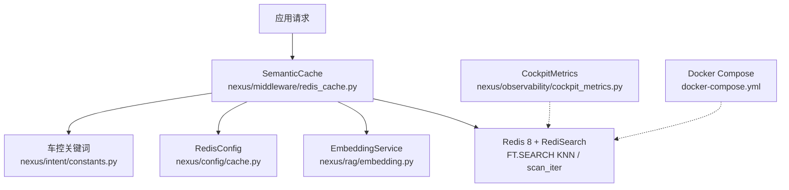
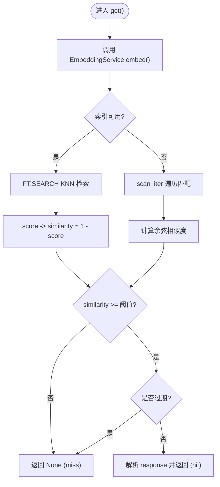
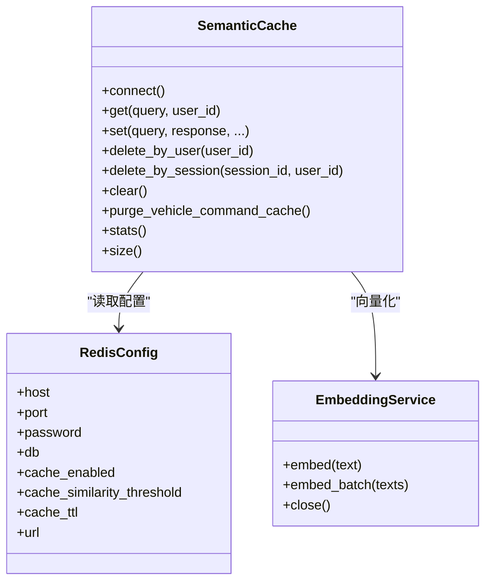
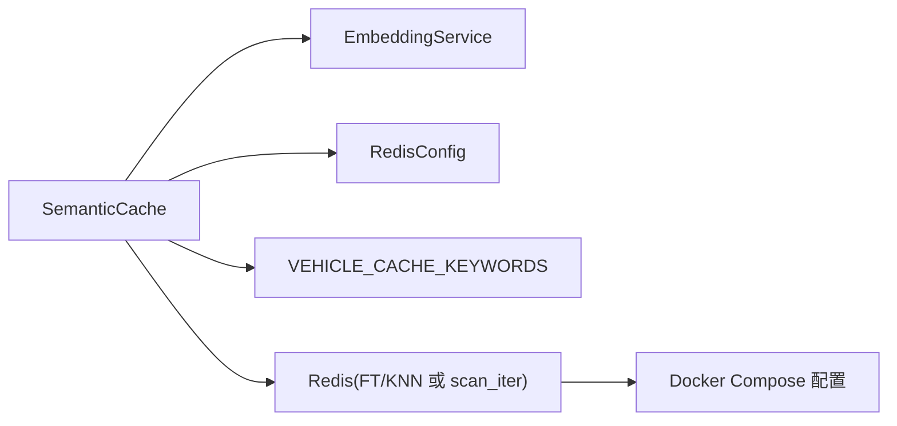

# Redis 语义缓存

<cite>
**本文引用的文件**   
- [redis_cache.py](file://backend_design/nexus/middleware/redis_cache.py)
- [cache.py](file://backend_design/nexus/config/cache.py)
- [embedding.py](file://backend_design/nexus/rag/embedding.py)
- [constants.py](file://backend_design/nexus/intent/constants.py)
- [__init__.py](file://backend_design/nexus/config/__init__.py)
- [cockpit_metrics.py](file://backend_design/nexus/observability/cockpit_metrics.py)
- [docker-compose.yml](file://docker-compose.yml)
</cite>

## 目录
1. [简介](#简介)
2. [项目结构](#项目结构)
3. [核心组件](#核心组件)
4. [架构总览](#架构总览)
5. [详细组件分析](#详细组件分析)
6. [依赖关系分析](#依赖关系分析)
7. [性能与容量规划](#性能与容量规划)
8. [故障排查指南](#故障排查指南)
9. [结论](#结论)
10. [附录](#附录)

## 简介
本文件面向 NexusCockpit 的 Redis 语义缓存系统，系统性阐述其向量相似度缓存机制、存储格式、相似度计算与阈值策略、LRU 淘汰与内存控制、失效与一致性保证、命中率优化、分布式部署要点以及监控指标。该缓存基于 Redis 8 内置 Query Engine（RediSearch）实现 KNN 向量检索，支持按用户分片、TTL 分级与安全隔离（车控指令不缓存），并提供降级扫描模式以兼容不支持 FT.* 命令的环境。

## 项目结构
Redis 语义缓存相关代码主要位于后端中间件层与配置层：
- 中间件实现：nexus/middleware/redis_cache.py
- 配置定义：nexus/config/cache.py（RedisConfig）
- 嵌入服务：nexus/rag/embedding.py（EmbeddingService）
- 车控关键词常量：nexus/intent/constants.py
- 全局配置聚合：nexus/config/__init__.py
- 座舱级指标采集：nexus/observability/cockpit_metrics.py
- 基础设施编排：docker-compose.yml（Redis 容器参数）



图表来源
- [redis_cache.py:1-120](file://backend_design/nexus/middleware/redis_cache.py#L1-L120)
- [embedding.py:1-63](file://backend_design/nexus/rag/embedding.py#L1-L63)
- [cache.py:1-41](file://backend_design/nexus/config/cache.py#L1-L41)
- [constants.py:1-53](file://backend_design/nexus/intent/constants.py#L1-L53)
- [cockpit_metrics.py:1-180](file://backend_design/nexus/observability/cockpit_metrics.py#L1-L180)
- [docker-compose.yml:160-186](file://docker-compose.yml#L160-L186)

章节来源
- [redis_cache.py:1-120](file://backend_design/nexus/middleware/redis_cache.py#L1-L120)
- [cache.py:1-41](file://backend_design/nexus/config/cache.py#L1-L41)

## 核心组件
- SemanticCache：封装 Redis 连接、索引管理、KNN 检索、Fallback 扫描、写入与清理、统计等能力。
- EmbeddingService：统一文本向量化接口，供缓存读写使用。
- RedisConfig：提供 Redis 连接 URL、开关、相似度阈值、TTL 等配置项。
- CockpitMetrics：记录会话延迟、错误、缓存命中/未命中等指标，便于观测。

章节来源
- [redis_cache.py:57-128](file://backend_design/nexus/middleware/redis_cache.py#L57-L128)
- [embedding.py:23-63](file://backend_design/nexus/rag/embedding.py#L23-L63)
- [cache.py:15-41](file://backend_design/nexus/config/cache.py#L15-L41)
- [cockpit_metrics.py:24-180](file://backend_design/nexus/observability/cockpit_metrics.py#L24-L180)

## 架构总览
语义缓存整体流程如下：
- 写路径：请求响应经副作用检查后，生成或复用 embedding，写入 Redis HASH，并建立/更新 RediSearch VECTOR 索引；设置 TTL。
- 读路径：对查询文本进行向量化，优先通过 RediSearch KNN 检索最近邻，校验相似度阈值与 TTL，返回命中结果；否则回退到 O(n) 扫描模式。
- 安全隔离：has_side_effect=True 的响应永不写入缓存，避免车控指令被缓存导致不执行。
- 降级兼容：当 FT.* 不可用或索引创建失败时，自动回退到 scan_iter 遍历模式。

```mermaid
sequenceDiagram
participant App as "应用"
participant Cache as "SemanticCache"
participant Emb as "EmbeddingService"
participant RS as "Redis(FT/KNN)"
participant Scan as "Redis(scan_iter)"
App->>Cache : get(query, user_id)
Cache->>Emb : embed(query)
Emb-->>Cache : vector
alt 索引可用
Cache->>RS : FT.SEARCH KNN @embedding $vec
RS-->>Cache : 候选文档(含score/timestamp/has_side_effect)
Cache->>Cache : 相似度=1-score; 阈值/TTL校验
Cache-->>App : 命中结果 or None
else 降级扫描
Cache->>Scan : scan_iter(match=nexus : cache : entry : *)
Scan-->>Cache : 键列表
Cache->>Cache : 计算余弦相似度; 阈值/TTL校验
Cache-->>App : 命中结果 or None
end
```

图表来源
- [redis_cache.py:213-366](file://backend_design/nexus/middleware/redis_cache.py#L213-L366)
- [embedding.py:36-48](file://backend_design/nexus/rag/embedding.py#L36-L48)

章节来源
- [redis_cache.py:164-212](file://backend_design/nexus/middleware/redis_cache.py#L164-L212)
- [redis_cache.py:213-366](file://backend_design/nexus/middleware/redis_cache.py#L213-L366)

## 详细组件分析

### 向量相似度缓存机制
- 存储格式
  - RediSearch 模式：embedding 字段以 numpy float32 bytes 形式存储，配合 VECTOR FLAT/HNSW 索引（当前实现为 FLAT）。
  - 降级模式：embedding 字段以 JSON 字符串存储，便于无 FT.* 环境兼容。
  - 其他字段：query、response、user_id、session_id、timestamp、has_side_effect。
- 相似度计算
  - RediSearch 模式：使用 COSINE 距离，相似度 = 1 - distance。
  - 降级模式：自定义余弦相似度函数计算。
- 阈值与 TTL
  - 相似度阈值默认 0.92，可通过配置覆盖。
  - TTL 默认 3600s，可按业务场景调整。



图表来源
- [redis_cache.py:235-301](file://backend_design/nexus/middleware/redis_cache.py#L235-L301)
- [redis_cache.py:303-366](file://backend_design/nexus/middleware/redis_cache.py#L303-L366)
- [redis_cache.py:568-578](file://backend_design/nexus/middleware/redis_cache.py#L568-L578)

章节来源
- [redis_cache.py:164-212](file://backend_design/nexus/middleware/redis_cache.py#L164-L212)
- [redis_cache.py:213-366](file://backend_design/nexus/middleware/redis_cache.py#L213-L366)
- [redis_cache.py:568-578](file://backend_design/nexus/middleware/redis_cache.py#L568-L578)

### LRU 淘汰策略与内存控制
- 服务端 LRU
  - Redis 容器启用 allkeys-lru 策略，结合 maxmemory 限制内存上限，自动淘汰最少使用的键。
- 客户端侧生命周期
  - 每个缓存条目包含 timestamp，读取时校验 TTL；过期即视为 miss。
  - 支持按用户/会话/全量清理，释放内存。
- 自动清理
  - 提供 purge_vehicle_command_cache() 用于清理旧的车控指令缓存条目，保障一致性。



图表来源
- [redis_cache.py:57-128](file://backend_design/nexus/middleware/redis_cache.py#L57-L128)
- [cache.py:15-41](file://backend_design/nexus/config/cache.py#L15-L41)
- [embedding.py:23-63](file://backend_design/nexus/rag/embedding.py#L23-L63)

章节来源
- [docker-compose.yml:166-186](file://docker-compose.yml#L166-L186)
- [redis_cache.py:437-514](file://backend_design/nexus/middleware/redis_cache.py#L437-L514)
- [redis_cache.py:516-561](file://backend_design/nexus/middleware/redis_cache.py#L516-L561)

### 缓存失效策略与一致性保证
- TTL 失效：写入时设置 expire，读取时校验时间戳，过期即 miss。
- 主动失效：
  - delete_by_user：删除指定用户的所有语义缓存条目。
  - delete_by_session：精确删除某会话的条目，兜底按 user_id 匹配旧条目。
  - clear：清空所有缓存。
  - purge_vehicle_command_cache：清理旧车控指令缓存条目，确保一致性。
- 一致性：
  - has_side_effect=True 的响应禁止写入缓存，避免车控指令命中旧缓存导致不执行。
  - 车控关键词兜底清理，防止历史数据绕过安全检查。

章节来源
- [redis_cache.py:367-436](file://backend_design/nexus/middleware/redis_cache.py#L367-L436)
- [redis_cache.py:437-514](file://backend_design/nexus/middleware/redis_cache.py#L437-L514)
- [redis_cache.py:516-561](file://backend_design/nexus/middleware/redis_cache.py#L516-L561)
- [constants.py:33-41](file://backend_design/nexus/intent/constants.py#L33-L41)

### 相似度算法与阈值配置
- 算法
  - RediSearch：COSINE 距离，相似度 = 1 - distance。
  - 降级模式：自定义余弦相似度实现。
- 阈值
  - 默认 0.92，可通过 SEMANTIC_CACHE_SIMILARITY_THRESHOLD 覆盖。
- 维度
  - 动态从 LLM 配置的 embedding_dim 获取，确保与 EmbeddingService 输出一致。

章节来源
- [redis_cache.py:235-301](file://backend_design/nexus/middleware/redis_cache.py#L235-L301)
- [redis_cache.py:568-578](file://backend_design/nexus/middleware/redis_cache.py#L568-L578)
- [cache.py:27-31](file://backend_design/nexus/config/cache.py#L27-L31)
- [redis_cache.py:52-55](file://backend_design/nexus/middleware/redis_cache.py#L52-L55)

### 分布式部署与高可用
- 单实例 Redis 8：默认部署，开启密码保护、AOF、maxmemory=allkeys-lru。
- 多实例/集群：可通过环境变量注入不同 REDIS_HOST/REDIS_PORT/REDIS_PASSWORD/REDIS_DB，或使用 Redis Cluster 模式（需适配客户端连接方式）。
- 网络与端口：容器映射宿主机 16379:6379，避开 Windows Hyper-V 保留端口。

章节来源
- [docker-compose.yml:166-186](file://docker-compose.yml#L166-L186)
- [cache.py:21-41](file://backend_design/nexus/config/cache.py#L21-L41)

### 监控指标与可观测性
- 内部统计：SemanticCache.stats() 返回 hits、misses、hit_rate、size、index_ready。
- 座舱指标：CockpitMetrics.record_chat() 记录 cache_hits/cache_misses、延迟、错误等，并计算平均延迟与命中率。
- 可视化：Prometheus + Grafana 可接入指标，展示缓存命中率、延迟分布、错误率等。

章节来源
- [redis_cache.py:604-615](file://backend_design/nexus/middleware/redis_cache.py#L604-L615)
- [cockpit_metrics.py:38-157](file://backend_design/nexus/observability/cockpit_metrics.py#L38-L157)

## 依赖关系分析
- SemanticCache 依赖：
  - EmbeddingService：文本向量化。
  - RedisConfig：连接与行为参数。
  - 车控关键词常量：用于一致性清理。
- 外部依赖：
  - Redis 8 内置 Query Engine（FT.* 命令）；若不可用则回退 scan_iter。
  - Docker Compose 提供的 Redis 容器参数（内存、LRU、AOF、密码）。



图表来源
- [redis_cache.py:57-128](file://backend_design/nexus/middleware/redis_cache.py#L57-L128)
- [embedding.py:23-63](file://backend_design/nexus/rag/embedding.py#L23-L63)
- [cache.py:15-41](file://backend_design/nexus/config/cache.py#L15-L41)
- [constants.py:33-41](file://backend_design/nexus/intent/constants.py#L33-L41)
- [docker-compose.yml:166-186](file://docker-compose.yml#L166-L186)

章节来源
- [redis_cache.py:129-212](file://backend_design/nexus/middleware/redis_cache.py#L129-L212)
- [docker-compose.yml:166-186](file://docker-compose.yml#L166-L186)

## 性能与容量规划
- 索引选择
  - 当前实现使用 FLAT 索引；在大规模向量下可考虑 HNSW 以提升检索性能（需评估内存占用与构建成本）。
- 相似度阈值调优
  - 默认 0.92，可根据业务召回质量与命中率权衡调整。
- 向量维度
  - 与 LLM embedding_dim 保持一致，避免维度不匹配导致的计算异常。
- 内存与淘汰
  - Redis maxmemory=allkeys-lru，合理设置 maxmemory 上限，避免 OOM。
- 并发与 IO
  - Redis 容器启用 io-threads，提升吞吐；建议根据 CPU 核数调整。
- 降级模式
  - 当 FT.* 不可用时，scan_iter 模式复杂度 O(n)，应尽量避免在生产环境出现。

[本节为通用指导，不直接分析具体文件]

## 故障排查指南
- 连接失败
  - 现象：connect() 捕获异常，缓存禁用。
  - 排查：检查 REDIS_HOST/PORT/PASSWORD/DB 是否正确，网络连通性与健康检查。
- 索引不可用
  - 现象：_ensure_index() 失败，回退 scan 模式。
  - 排查：确认 Redis 版本与模块支持（Redis 8 内置 FT.*；Redis 7 需 redis-stack-server）。
- 车控指令未执行
  - 现象：命中旧缓存导致不执行。
  - 排查：运行 purge_vehicle_command_cache() 清理旧条目，确保 has_side_effect 标记正确。
- 命中率低
  - 现象：大量 miss。
  - 排查：调整相似度阈值、检查 embedding 维度一致性、观察 TTL 是否过短。
- 内存增长
  - 现象：Redis 内存持续上升。
  - 排查：检查 maxmemory 与 LRU 策略，定期清理用户/会话缓存。

章节来源
- [redis_cache.py:90-128](file://backend_design/nexus/middleware/redis_cache.py#L90-L128)
- [redis_cache.py:164-212](file://backend_design/nexus/middleware/redis_cache.py#L164-L212)
- [redis_cache.py:516-561](file://backend_design/nexus/middleware/redis_cache.py#L516-L561)
- [docker-compose.yml:166-186](file://docker-compose.yml#L166-L186)

## 结论
NexusCockpit 的 Redis 语义缓存系统以 RediSearch KNN 为核心，结合严格的副作用隔离、灵活的阈值与 TTL 策略、完善的清理与降级机制，实现了高效且安全的语义级缓存。通过合理的索引与内存配置、持续的监控与调优，可在复杂车载场景中稳定提升响应速度与资源利用率。

[本节为总结性内容，不直接分析具体文件]

## 附录
- 关键配置项
  - SEMANTIC_CACHE_ENABLED：是否启用语义缓存。
  - SEMANTIC_CACHE_SIMILARITY_THRESHOLD：相似度阈值（默认 0.92）。
  - SEMANTIC_CACHE_TTL_SECONDS：TTL（默认 3600s）。
  - REDIS_HOST/PORT/PASSWORD/DB：Redis 连接参数。
- 常用操作
  - 查询：get(query, user_id)
  - 写入：set(query, response, user_id, session_id, ttl, has_side_effect)
  - 清理：delete_by_user、delete_by_session、clear、purge_vehicle_command_cache
  - 统计：stats()、size()

章节来源
- [cache.py:27-31](file://backend_design/nexus/config/cache.py#L27-L31)
- [redis_cache.py:367-436](file://backend_design/nexus/middleware/redis_cache.py#L367-L436)
- [redis_cache.py:437-514](file://backend_design/nexus/middleware/redis_cache.py#L437-L514)
- [redis_cache.py:516-561](file://backend_design/nexus/middleware/redis_cache.py#L516-L561)
- [redis_cache.py:604-615](file://backend_design/nexus/middleware/redis_cache.py#L604-L615)