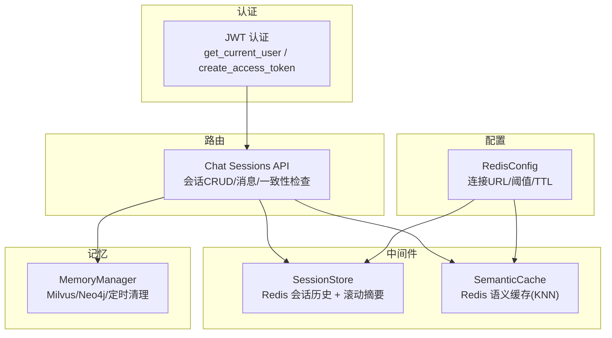
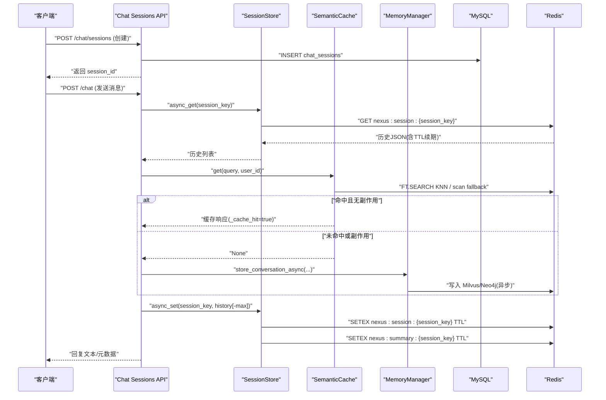
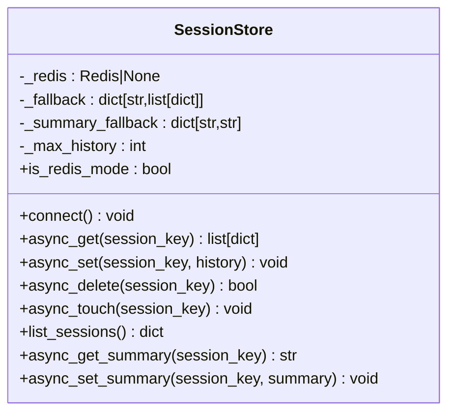
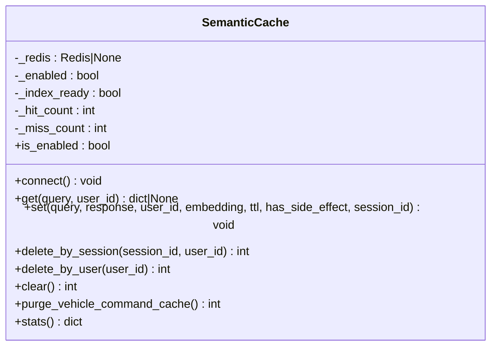
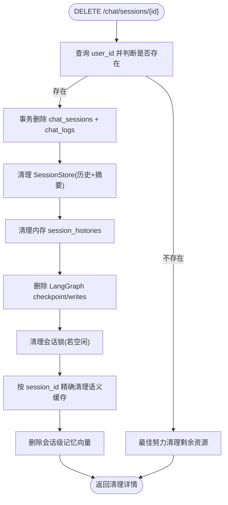
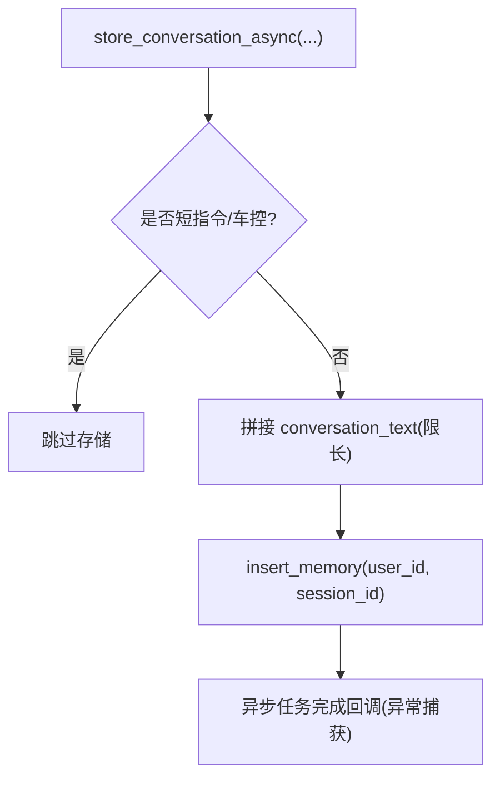
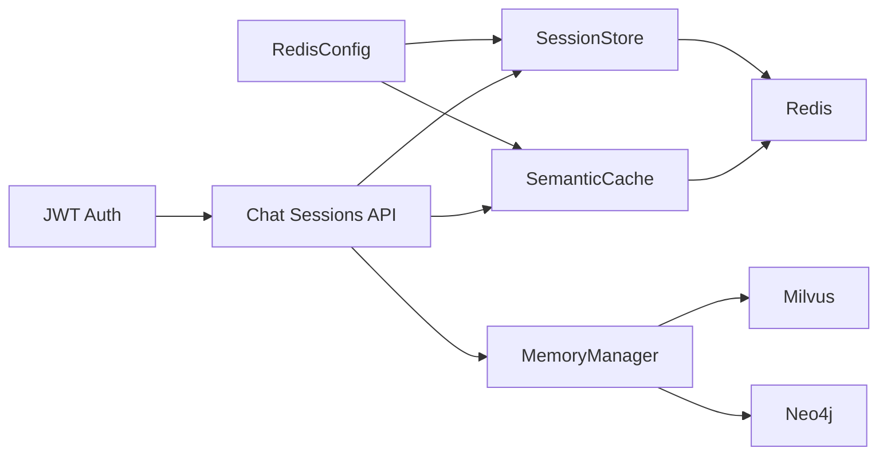

# 会话存储管理器

<cite>
**本文引用的文件**   
- [session_store.py](file://backend_design/nexus/middleware/session_store.py)
- [redis_cache.py](file://backend_design/nexus/middleware/redis_cache.py)
- [chat_sessions.py](file://backend_design/nexus/api/routes/chat_sessions.py)
- [auth.py](file://backend_design/nexus/core/auth.py)
- [schemas.py](file://backend_design/nexus/models/schemas.py)
- [cache.py](file://backend_design/nexus/config/cache.py)
- [manager.py](file://backend_design/nexus/memory/manager.py)
</cite>

## 目录
1. [简介](#简介)
2. [项目结构](#项目结构)
3. [核心组件](#核心组件)
4. [架构总览](#架构总览)
5. [详细组件分析](#详细组件分析)
6. [依赖关系分析](#依赖关系分析)
7. [性能考量](#性能考量)
8. [故障排查指南](#故障排查指南)
9. [结论](#结论)
10. [附录：API 与使用示例](#附录api-与使用示例)

## 简介
本文件为 NexusCockpit 的“会话存储管理器”提供系统化、可操作的文档。重点覆盖：
- 会话生命周期管理：创建、更新、过期与清理
- 数据同步策略：本地缓存与 Redis 的一致性保证、并发访问控制、数据持久化
- 会话数据结构设计：用户信息、权限状态、上下文数据与扩展字段
- 安全机制：防重放攻击、CSRF 保护思路（结合 JWT）
- 性能优化：TTL、向量检索、降级与回退
- 故障恢复：降级到内存、幂等删除、一致性自检
- API 接口与使用示例：会话 CRUD、消息查询、一致性检查

## 项目结构
围绕会话存储的关键代码分布在以下模块：
- 中间件层：SessionStore（Redis + 内存降级）、SemanticCache（语义缓存）
- 路由层：多会话管理 REST 接口（创建、删除、列表、消息）
- 认证层：JWT 签发与校验，用于鉴权与会话绑定
- 配置层：Redis 连接与语义缓存参数
- 记忆层：Milvus/Neo4j 长期记忆与定时清理

**图表来源**
- [session_store.py:43-294](file://backend_design/nexus/middleware/session_store.py#L43-L294)
- [redis_cache.py:57-615](file://backend_design/nexus/middleware/redis_cache.py#L57-L615)
- [chat_sessions.py:58-534](file://backend_design/nexus/api/routes/chat_sessions.py#L58-L534)
- [auth.py:35-140](file://backend_design/nexus/core/auth.py#L35-L140)
- [cache.py:15-41](file://backend_design/nexus/config/cache.py#L15-L41)
- [manager.py:38-583](file://backend_design/nexus/memory/manager.py#L38-L583)

**章节来源**
- [session_store.py:43-294](file://backend_design/nexus/middleware/session_store.py#L43-L294)
- [redis_cache.py:57-615](file://backend_design/nexus/middleware/redis_cache.py#L57-L615)
- [chat_sessions.py:58-534](file://backend_design/nexus/api/routes/chat_sessions.py#L58-L534)
- [auth.py:35-140](file://backend_design/nexus/core/auth.py#L35-L140)
- [cache.py:15-41](file://backend_design/nexus/config/cache.py#L15-L41)
- [manager.py:38-583](file://backend_design/nexus/memory/manager.py#L38-L583)

## 核心组件
- SessionStore：基于 Redis 的会话历史与滚动摘要存储，具备内存降级能力；支持 TTL 自动续期、按 max_history_len 截断、会话级删除与列表。
- SemanticCache：基于 Redis 8 RediSearch KNN 的语义缓存，按 user_id/session_id 分片，TTL 分级，副作用响应禁止缓存，支持 O(log n) 检索与 O(n) 扫描回退。
- Chat Sessions API：提供会话创建、删除、列表、消息获取、标题更新以及跨存储一致性自检接口。
- MemoryManager：统一记忆管理，负责 Milvus/Neo4j 写入、冲突检测、对话向量化存储与后台定时清理。

**章节来源**
- [session_store.py:43-294](file://backend_design/nexus/middleware/session_store.py#L43-L294)
- [redis_cache.py:57-615](file://backend_design/nexus/middleware/redis_cache.py#L57-L615)
- [chat_sessions.py:58-534](file://backend_design/nexus/api/routes/chat_sessions.py#L58-L534)
- [manager.py:38-583](file://backend_design/nexus/memory/manager.py#L38-L583)

## 架构总览
下图展示一次典型“聊天请求”在会话存储与缓存中的流转路径，包括会话历史读写、滚动摘要更新、语义缓存命中与失效、以及长期记忆的异步落库。

**图表来源**
- [chat_sessions.py:107-135](file://backend_design/nexus/api/routes/chat_sessions.py#L107-L135)
- [session_store.py:91-177](file://backend_design/nexus/middleware/session_store.py#L91-L177)
- [redis_cache.py:213-301](file://backend_design/nexus/middleware/redis_cache.py#L213-L301)
- [manager.py:302-335](file://backend_design/nexus/memory/manager.py#L302-L335)

## 详细组件分析

### SessionStore 组件
- 功能要点
  - 会话历史：按 max_history_len 截断并持久化至 Redis，键前缀 nexus:session:
  - 滚动摘要：独立键前缀 nexus:summary:，与历史共享 TTL，压缩后不丢失上下文
  - 降级策略：Redis 不可用时回退到内存 dict，保证可用性
  - 活跃续期：读取时 expire 续期，避免活跃会话被 TTL 回收
  - 会话删除：同时清理短期记忆与滚动摘要，并清理内存降级残留
  - 会话列表：支持列出所有活跃会话（Redis keys 扫描）

- 数据结构
  - 会话历史：list[dict]，元素包含 role/content 等字段
  - 滚动摘要：str，跨轮次保存的压缩摘要

- 复杂度与性能
  - 读/写均为 O(1) Redis 操作；列表扫描为 O(N)
  - 截断取最近 N 条，时间复杂度 O(N)

**图表来源**
- [session_store.py:43-294](file://backend_design/nexus/middleware/session_store.py#L43-L294)

**章节来源**
- [session_store.py:43-294](file://backend_design/nexus/middleware/session_store.py#L43-L294)

### SemanticCache 组件
- 功能要点
  - KNN 向量检索：RediSearch VECTOR FLAT/HNSW，O(log n)
  - 分片隔离：user_id/session_id TAG 过滤
  - 安全策略：has_side_effect=True 的响应永不写入/返回缓存
  - TTL 分级：默认 3600s，可按场景调整
  - 兼容模式：不支持 FT.* 命令时回退 O(n) scan

- 数据结构
  - HASH 条目：query/response/user_id/session_id/embedding/timestamp/has_side_effect
  - 索引：VECTOR(embedding) + TAG(user_id, session_id) + NUM(timestamp)

**图表来源**
- [redis_cache.py:57-615](file://backend_design/nexus/middleware/redis_cache.py#L57-L615)

**章节来源**
- [redis_cache.py:57-615](file://backend_design/nexus/middleware/redis_cache.py#L57-L615)

### Chat Sessions API 组件
- 功能要点
  - 会话创建：生成 session_id，写入 MySQL chat_sessions
  - 会话删除：事务性删除 MySQL 记录，联动清理 Redis/内存/LangGraph checkpoint/语义缓存/Milvus 会话级记忆
  - 会话列表：按 last_message_at 倒序，最多 50 条
  - 消息获取：按 created_at 正序返回 user/assistant 双角色消息
  - 标题更新：限制长度，幂等更新
  - 一致性检查：扫描孤立日志、僵尸缓存、僵尸快照、孤儿向量

**图表来源**
- [chat_sessions.py:138-324](file://backend_design/nexus/api/routes/chat_sessions.py#L138-L324)

**章节来源**
- [chat_sessions.py:58-534](file://backend_design/nexus/api/routes/chat_sessions.py#L58-L534)

### MemoryManager 组件（与会话相关部分）
- 功能要点
  - 对话向量化存储：将完整对话上下文存入 Milvus，支持后续语义检索
  - 会话级清理：删除指定 session_id 的对话向量，不影响用户级记忆
  - 后台清理：定期清理过期的会话级向量（保留用户级记忆）

**图表来源**
- [manager.py:302-335](file://backend_design/nexus/memory/manager.py#L302-L335)
- [manager.py:359-387](file://backend_design/nexus/memory/manager.py#L359-L387)
- [manager.py:514-583](file://backend_design/nexus/memory/manager.py#L514-L583)

**章节来源**
- [manager.py:302-335](file://backend_design/nexus/memory/manager.py#L302-L335)
- [manager.py:359-387](file://backend_design/nexus/memory/manager.py#L359-L387)
- [manager.py:514-583](file://backend_design/nexus/memory/manager.py#L514-L583)

## 依赖关系分析
- SessionStore 依赖 Redis 配置（url、TTL），通过 get_config().redis 获取
- SemanticCache 依赖 EmbeddingService 进行向量化，依赖 Redis 8 RediSearch
- Chat Sessions API 依赖数据库管理器、SessionStore、SemanticCache、MemoryManager
- MemoryManager 依赖 Milvus/Neo4j/LLM 客户端，并调用 DB 获取有效 session_id

**图表来源**
- [cache.py:15-41](file://backend_design/nexus/config/cache.py#L15-L41)
- [session_store.py:43-294](file://backend_design/nexus/middleware/session_store.py#L43-L294)
- [redis_cache.py:57-615](file://backend_design/nexus/middleware/redis_cache.py#L57-L615)
- [chat_sessions.py:58-534](file://backend_design/nexus/api/routes/chat_sessions.py#L58-L534)
- [manager.py:38-583](file://backend_design/nexus/memory/manager.py#L38-L583)

**章节来源**
- [cache.py:15-41](file://backend_design/nexus/config/cache.py#L15-L41)
- [session_store.py:43-294](file://backend_design/nexus/middleware/session_store.py#L43-L294)
- [redis_cache.py:57-615](file://backend_design/nexus/middleware/redis_cache.py#L57-L615)
- [chat_sessions.py:58-534](file://backend_design/nexus/api/routes/chat_sessions.py#L58-L534)
- [manager.py:38-583](file://backend_design/nexus/memory/manager.py#L38-L583)

## 性能考量
- 会话历史
  - 每次写入仅保留最近 max_history_len 条，降低存储与序列化开销
  - 读取时自动续期 TTL，减少主动维护成本
- 语义缓存
  - KNN 向量检索 O(log n)，相似度阈值过滤，TTL 分级
  - 副作用响应禁止缓存，避免误命中导致的安全问题
  - 不支持 FT.* 命令时回退 O(n) scan，确保兼容性
- 记忆存储
  - 异步 fire-and-forget 写入 Milvus/Neo4j，不阻塞主流程
  - 后台定时清理过期会话级向量，释放空间

**章节来源**
- [session_store.py:152-177](file://backend_design/nexus/middleware/session_store.py#L152-L177)
- [redis_cache.py:213-301](file://backend_design/nexus/middleware/redis_cache.py#L213-L301)
- [manager.py:359-387](file://backend_design/nexus/memory/manager.py#L359-L387)

## 故障排查指南
- Redis 不可用
  - SessionStore 自动降级到内存 dict，服务可用但会话不共享
  - SemanticCache 禁用或回退 O(n) scan，性能下降但功能可用
- 会话删除不一致
  - 使用 DELETE /chat/sessions/{id} 的事务性删除与多存储联动清理
  - 使用 /chat/sessions/consistency-check 扫描孤立数据与僵尸缓存
- 语义缓存误命中
  - 确认 has_side_effect 标记正确，必要时调用 purge_vehicle_command_cache 清理旧条目
- 记忆清理异常
  - 检查 MemoryManager 后台清理任务是否启动，查看日志定位失败点

**章节来源**
- [session_store.py:69-81](file://backend_design/nexus/middleware/session_store.py#L69-L81)
- [redis_cache.py:129-162](file://backend_design/nexus/middleware/redis_cache.py#L129-L162)
- [chat_sessions.py:404-534](file://backend_design/nexus/api/routes/chat_sessions.py#L404-L534)
- [manager.py:473-513](file://backend_design/nexus/memory/manager.py#L473-L513)

## 结论
NexusCockpit 的会话存储管理器以 Redis 为核心，结合内存降级、语义缓存与长期记忆，实现了高可用、高性能、可扩展的会话生命周期管理。通过严格的 TTL、副作用隔离、事务性删除与一致性自检，保障了数据一致性与安全性。建议在生产环境启用 Redis 8 RediSearch，合理设置 TTL 与阈值，并定期执行一致性检查与记忆清理任务。

## 附录：API 与使用示例
- 会话管理接口
  - GET /chat/sessions — 获取当前座舱的会话列表
  - POST /chat/sessions — 创建新会话
  - DELETE /chat/sessions/{id} — 删除会话及关联资源
  - GET /chat/sessions/{id}/messages — 获取会话消息记录
  - PATCH /chat/sessions/{id}/title — 更新会话标题
  - GET /chat/sessions/consistency-check — 存储一致性自检

- 请求/响应模型（节选）
  - CreateSessionRequest：title、user_id
  - SessionResponse：session_id、cockpit_id、user_id、title、message_count、created_at、last_message_at
  - ChatRequest：text、user_id、session_id、stream
  - ChatResponse：response、user_id、session_id、latency_ms、metadata、cache_hit、intent、action、trace_id

- 使用示例（描述）
  - 创建会话：调用 POST /chat/sessions，返回 session_id
  - 发送消息：携带 session_id 与 text，后端读取 SessionStore 历史，尝试语义缓存命中，未命中则调用 LLM 并异步写入记忆
  - 删除会话：调用 DELETE /chat/sessions/{id}，系统会清理 MySQL、Redis、LangGraph、语义缓存与 Milvus 会话级记忆
  - 一致性检查：调用 GET /chat/sessions/consistency-check，获取各存储层健康报告

**章节来源**
- [chat_sessions.py:58-135](file://backend_design/nexus/api/routes/chat_sessions.py#L58-L135)
- [chat_sessions.py:138-324](file://backend_design/nexus/api/routes/chat_sessions.py#L138-L324)
- [chat_sessions.py:327-401](file://backend_design/nexus/api/routes/chat_sessions.py#L327-L401)
- [chat_sessions.py:404-534](file://backend_design/nexus/api/routes/chat_sessions.py#L404-L534)
- [schemas.py:19-88](file://backend_design/nexus/models/schemas.py#L19-L88)