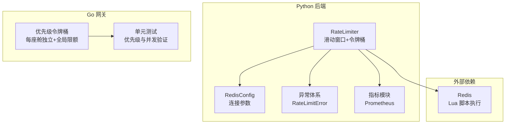
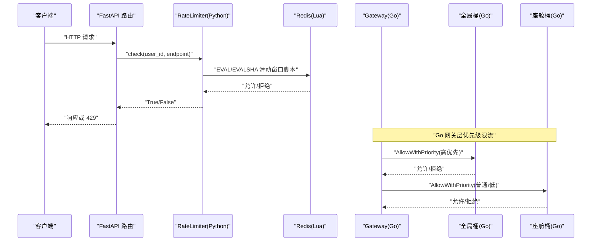
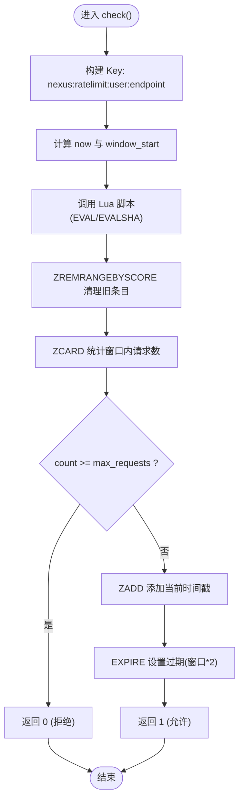
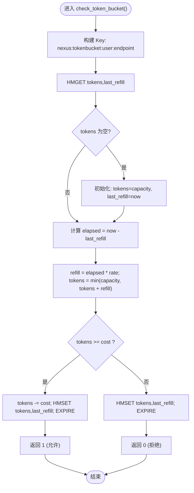
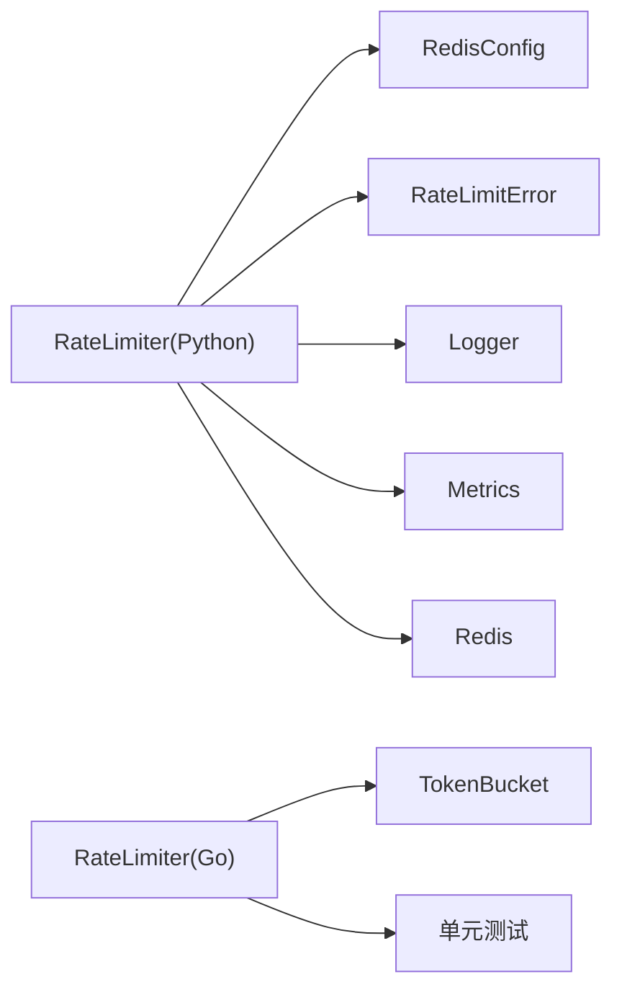

# 分布式限流器

<cite>
**本文引用的文件**   
- [rate_limiter.py](file://backend_design/nexus/middleware/rate_limiter.py)
- [ratelimit.go](file://backend_design/nexus_gate/internal/ratelimit/ratelimit.go)
- [ratelimit_test.go](file://backend_design/nexus_gate/internal/ratelimit/ratelimit_test.go)
- [cache.py](file://backend_design/nexus/config/cache.py)
- [exceptions.py](file://backend_design/nexus/core/exceptions.py)
- [metrics.py](file://backend_design/nexus/observability/metrics.py)
</cite>

## 目录
1. [引言](#引言)
2. [项目结构](#项目结构)
3. [核心组件](#核心组件)
4. [架构总览](#架构总览)
5. [详细组件分析](#详细组件分析)
6. [依赖关系分析](#依赖关系分析)
7. [性能考量与调优](#性能考量与调优)
8. [故障降级策略](#故障降级策略)
9. [监控指标与可观测性](#监控指标与可观测性)
10. [常见问题排查指南](#常见问题排查指南)
11. [结论](#结论)

## 引言
本文件为 NexusCockpit 的分布式限流器提供系统化、可落地的技术文档。内容覆盖：
- 基于 Redis Lua 脚本的原子性滑动窗口算法实现，重点解释 ZREMRANGEBYSCORE、ZADD、ZCARD 的原子性保证与“超限不污染”的设计。
- 令牌桶算法的实现机制，包括令牌补充逻辑、突发流量处理与分布式一致性保证。
- 限流器的配置项（max_requests、window_seconds、capacity、rate）及使用示例。
- 性能调优建议、故障降级策略、监控指标与常见问题排查。

## 项目结构
NexusCockpit 在 Python 后端与 Go 网关两侧均提供了限流能力：
- Python 侧：基于 Redis 的分布式限流（滑动窗口 + 令牌桶），通过 Lua 脚本保证原子性与一致性。
- Go 侧：进程内优先级令牌桶限流，支持按座舱隔离与全局上限控制。



图表来源
- [rate_limiter.py:117-297](file://backend_design/nexus/middleware/rate_limiter.py#L117-L297)
- [cache.py:15-41](file://backend_design/nexus/config/cache.py#L15-L41)
- [exceptions.py:112-117](file://backend_design/nexus/core/exceptions.py#L112-L117)
- [metrics.py:1-108](file://backend_design/nexus/observability/metrics.py#L1-L108)
- [ratelimit.go:1-178](file://backend_design/nexus_gate/internal/ratelimit/ratelimit.go#L1-L178)
- [ratelimit_test.go:1-169](file://backend_design/nexus_gate/internal/ratelimit/ratelimit_test.go#L1-L169)

章节来源
- [rate_limiter.py:1-297](file://backend_design/nexus/middleware/rate_limiter.py#L1-L297)
- [ratelimit.go:1-178](file://backend_design/nexus_gate/internal/ratelimit/ratelimit.go#L1-L178)
- [cache.py:15-41](file://backend_design/nexus/config/cache.py#L15-L41)
- [exceptions.py:112-117](file://backend_design/nexus/core/exceptions.py#L112-L117)
- [metrics.py:1-108](file://backend_design/nexus/observability/metrics.py#L1-L108)

## 核心组件
- Python 分布式限流器 RateLimiter
  - 滑动窗口限流：使用 Redis Sorted Set 记录请求时间戳，Lua 脚本原子完成清理、计数、写入与过期设置。
  - 令牌桶限流：使用 Redis Hash 存储剩余令牌与上次补充时间，Lua 脚本原子完成补充、扣减与过期设置。
  - 关键方法：check、check_or_raise、check_token_bucket、get_remaining、connect/close。
- Go 优先级令牌桶限流器
  - 每座舱独立令牌桶，支持高/普通/低三级优先级配额比例；全局桶限制系统总量。
  - 关键类型：TokenBucket、RateLimiter；关键方法：AllowWithPriority、GetStats。

章节来源
- [rate_limiter.py:117-297](file://backend_design/nexus/middleware/rate_limiter.py#L117-L297)
- [ratelimit.go:42-178](file://backend_design/nexus_gate/internal/ratelimit/ratelimit.go#L42-L178)

## 架构总览
下图展示 Python 端限流器与 Redis 的交互流程，以及 Go 端进程内限流器的调用路径。



图表来源
- [rate_limiter.py:156-202](file://backend_design/nexus/middleware/rate_limiter.py#L156-L202)
- [ratelimit.go:131-157](file://backend_design/nexus_gate/internal/ratelimit/ratelimit.go#L131-L157)

## 详细组件分析

### 滑动窗口限流（Redis Lua）
- 设计要点
  - 原子性：在一个 Lua 脚本中顺序执行清理旧条目、统计当前窗口数量、判断是否超限、写入新条目与设置过期，避免竞态条件。
  - 防污染：当 count >= max_requests 时直接返回拒绝，不会执行 ZADD，确保超限请求不污染后续合法请求的判断。
  - Key 命名：nexus:ratelimit:{user_id}:{endpoint}，便于按用户与接口维度限流。
  - 过期策略：key 过期时间为窗口大小的 2 倍，确保窗口外数据被清理。
- 关键操作
  - ZREMRANGEBYSCORE：清理窗口外的旧记录。
  - ZCARD：统计当前窗口内请求数。
  - ZADD：添加当前请求时间戳作为成员与分数。
  - EXPIRE：设置 key 过期时间。
- 返回值
  - 1：允许通过；0：被限流。



图表来源
- [rate_limiter.py:40-59](file://backend_design/nexus/middleware/rate_limiter.py#L40-L59)
- [rate_limiter.py:156-202](file://backend_design/nexus/middleware/rate_limiter.py#L156-L202)

章节来源
- [rate_limiter.py:40-59](file://backend_design/nexus/middleware/rate_limiter.py#L40-L59)
- [rate_limiter.py:156-202](file://backend_design/nexus/middleware/rate_limiter.py#L156-L202)

### 令牌桶限流（Redis Lua）
- 设计要点
  - 状态存储：使用 Hash 字段 tokens（剩余令牌）、last_refill（上次补充时间）。
  - 补充逻辑：根据 elapsed = now - last_refill 计算 refill = elapsed * rate，并限制不超过 capacity。
  - 扣减逻辑：若 tokens >= cost，则扣减并更新 last_refill，否则仅更新时间但不消耗令牌。
  - 过期策略：固定 TTL（例如 1 小时），避免长期占用内存。
  - 适用场景：LLM API 调用限流，允许突发但受平均速率约束。
- 返回值
  - 1：允许通过；0：被限流。



图表来源
- [rate_limiter.py:79-114](file://backend_design/nexus/middleware/rate_limiter.py#L79-L114)
- [rate_limiter.py:212-277](file://backend_design/nexus/middleware/rate_limiter.py#L212-L277)

章节来源
- [rate_limiter.py:79-114](file://backend_design/nexus/middleware/rate_limiter.py#L79-L114)
- [rate_limiter.py:212-277](file://backend_design/nexus/middleware/rate_limiter.py#L212-L277)

### Go 优先级令牌桶（进程内）
- 设计要点
  - 优先级阈值：高优先级可用全部令牌，普通优先级最多 80%，低优先级最多 50%。
  - 每座舱独立桶：cockpit_id → TokenBucket，互不影响。
  - 全局限额：全局桶容量与速率为单座舱的 3 倍，防止单实例过载。
  - 补充逻辑：按时间差计算补充令牌，上限为 capacity。
- 关键方法
  - AllowWithPriority(cockpitID, p)：先检查全局桶，再检查座舱桶。
  - GetStats()：暴露各座舱与全局可用令牌数。

```mermaid
classDiagram
class TokenBucket {
-int capacity
-int tokens
-time.Duration rate
-time.Time lastRefill
+Allow() bool
+AllowWithPriority(p) bool
+AvailableTokens() int
-refill() void
}
class RateLimiter {
-map[string]*TokenBucket buckets
-TokenBucket globalBucket
-int capacity
-int rate
+Allow(cockpitID) bool
+AllowWithPriority(cockpitID, p) bool
+GetStats() map[string]interface{}
}
RateLimiter --> TokenBucket : "管理多个座舱桶"
RateLimiter --> TokenBucket : "全局桶"
```

图表来源
- [ratelimit.go:42-109](file://backend_design/nexus_gate/internal/ratelimit/ratelimit.go#L42-L109)
- [ratelimit.go:111-178](file://backend_design/nexus_gate/internal/ratelimit/ratelimit.go#L111-L178)

章节来源
- [ratelimit.go:42-109](file://backend_design/nexus_gate/internal/ratelimit/ratelimit.go#L42-L109)
- [ratelimit.go:111-178](file://backend_design/nexus_gate/internal/ratelimit/ratelimit.go#L111-L178)

## 依赖关系分析
- Python 限流器依赖
  - Redis 异步客户端：用于连接与执行 Lua 脚本。
  - 配置模块：读取 Redis 连接 URL。
  - 异常体系：抛出 RateLimitError 以统一错误处理。
  - 日志与指标：记录限流事件与系统指标。
- Go 限流器依赖
  - 标准库：sync.Mutex/RWMutex 保证并发安全。
  - 测试套件：验证优先级抢占、并发与补充逻辑。



图表来源
- [rate_limiter.py:117-297](file://backend_design/nexus/middleware/rate_limiter.py#L117-L297)
- [cache.py:15-41](file://backend_design/nexus/config/cache.py#L15-L41)
- [exceptions.py:112-117](file://backend_design/nexus/core/exceptions.py#L112-L117)
- [metrics.py:1-108](file://backend_design/nexus/observability/metrics.py#L1-L108)
- [ratelimit.go:1-178](file://backend_design/nexus_gate/internal/ratelimit/ratelimit.go#L1-L178)
- [ratelimit_test.go:1-169](file://backend_design/nexus_gate/internal/ratelimit/ratelimit_test.go#L1-L169)

章节来源
- [rate_limiter.py:117-297](file://backend_design/nexus/middleware/rate_limiter.py#L117-L297)
- [ratelimit.go:1-178](file://backend_design/nexus_gate/internal/ratelimit/ratelimit.go#L1-L178)

## 性能考量与调优
- Redis 连接与脚本加载
  - 使用 EVALSHA 预加载 Lua 脚本，减少网络开销与脚本解析成本。
  - 连接池与超时：合理设置连接池大小与读写超时，避免阻塞。
- 滑动窗口优化
  - 窗口大小与频率：增大 window_seconds 可降低频繁清理压力，但会增加内存占用。
  - ZREMRANGEBYSCORE 范围：确保只清理窗口外数据，避免全量扫描。
- 令牌桶优化
  - 补充粒度：rate 越大，补充越平滑；过小可能导致抖动。
  - TTL 设置：合理设置过期时间，避免长期占用内存。
- Go 限流器优化
  - 优先级阈值：根据业务调整高/普通/低优先级配额比例。
  - 全局桶容量：根据实例数与单机承载能力调整。

[本节为通用指导，不直接分析具体文件]

## 故障降级策略
- Redis 不可用
  - Python 限流器在连接失败或脚本执行异常时放行请求（默认降级），避免雪崩。
  - 建议在监控中记录 Redis 健康状态与限流失败次数。
- Lua 脚本执行失败
  - 回退到 EVAL 模式（未预加载脚本时），但仍可能因网络问题失败，最终仍放行。
- Go 限流器
  - 进程内限流不受外部依赖影响，但在多实例部署时需配合 Redis 分布式限流。

章节来源
- [rate_limiter.py:142-155](file://backend_design/nexus/middleware/rate_limiter.py#L142-L155)
- [rate_limiter.py:200-202](file://backend_design/nexus/middleware/rate_limiter.py#L200-L202)
- [rate_limiter.py:240-241](file://backend_design/nexus/middleware/rate_limiter.py#L240-L241)
- [rate_limiter.py:275-277](file://backend_design/nexus/middleware/rate_limiter.py#L275-L277)

## 监控指标与可观测性
- Prometheus 指标
  - 请求总数与延迟：nexus_requests_total、nexus_request_latency_seconds。
  - Agent/技能/缓存/RAG/LLM 相关指标：便于定位瓶颈。
- 限流相关指标建议
  - 限流拒绝次数：按 user_id、endpoint 维度统计。
  - Redis 连接与健康：连接成功/失败次数、脚本加载状态。
  - 令牌桶状态：剩余令牌、补充速率、TTL 命中情况。

章节来源
- [metrics.py:20-108](file://backend_design/nexus/observability/metrics.py#L20-L108)

## 常见问题排查指南
- 限流过于严格
  - 检查 max_requests 与 window_seconds 配置是否过小。
  - 观察 Redis 中 key 的 ZRANGE 结果，确认窗口内请求数。
- 令牌桶补充缓慢
  - 检查 rate 配置是否过低，elapsed 计算是否正确。
  - 确认 last_refill 更新时间是否准确。
- Redis 连接失败
  - 检查 RedisConfig 中的 host/port/password/db 配置。
  - 查看连接日志与 ping 结果。
- Go 限流器优先级异常
  - 验证 priorityThreshold 配置是否符合预期。
  - 检查全局桶与座舱桶的容量与速率设置。

章节来源
- [cache.py:15-41](file://backend_design/nexus/config/cache.py#L15-L41)
- [ratelimit_test.go:13-169](file://backend_design/nexus_gate/internal/ratelimit/ratelimit_test.go#L13-L169)

## 结论
NexusCockpit 的分布式限流器通过 Redis Lua 脚本实现了原子性的滑动窗口与令牌桶算法，结合 Go 端的优先级令牌桶，形成了多层次、可扩展的限流体系。在生产环境中，建议结合监控指标与日志进行持续调优，并根据业务特性调整限流参数与降级策略，以确保系统的稳定性与用户体验。