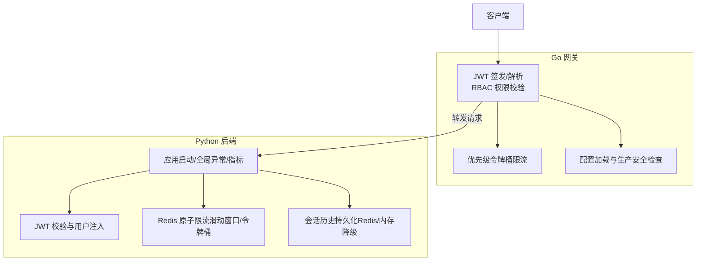
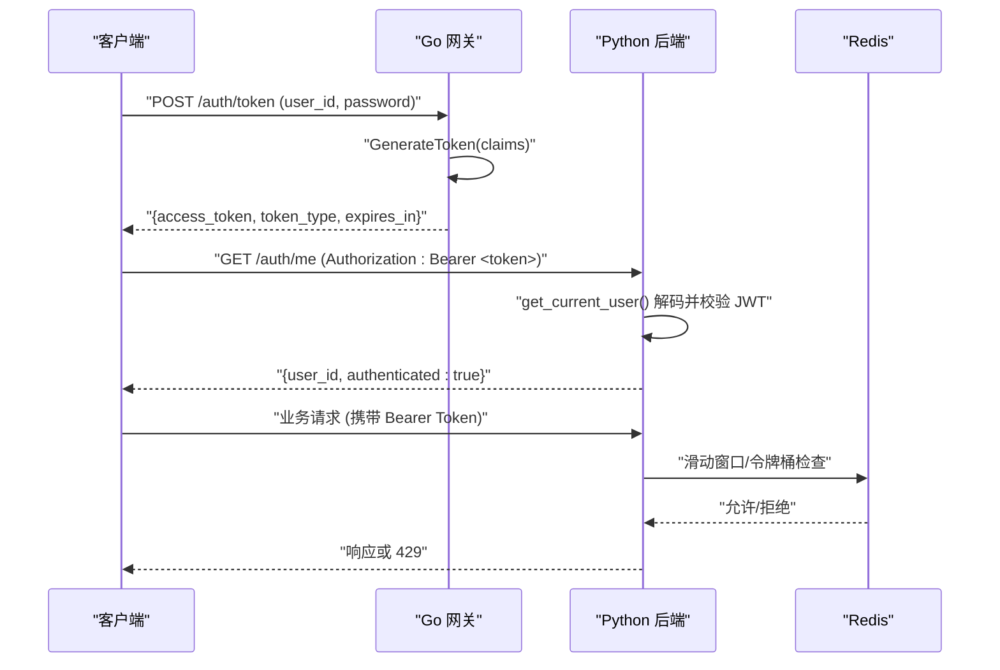
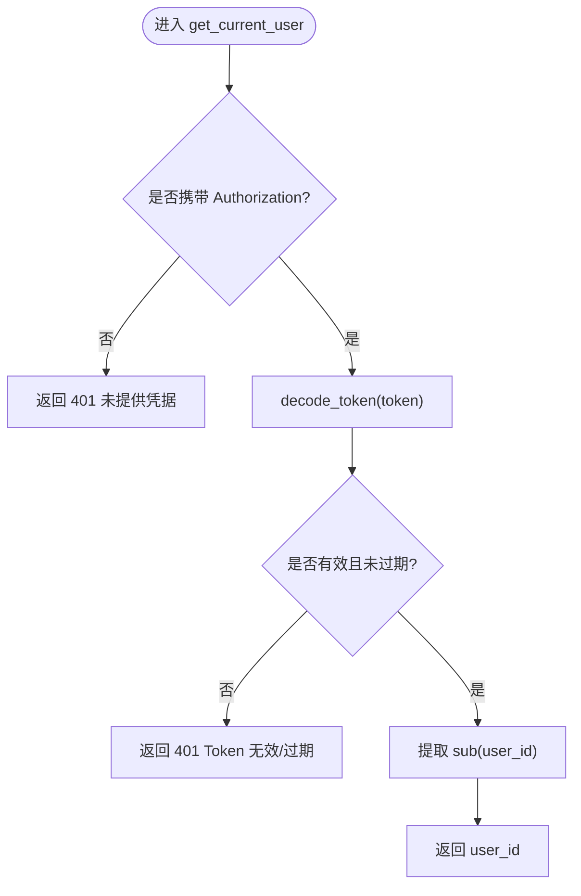
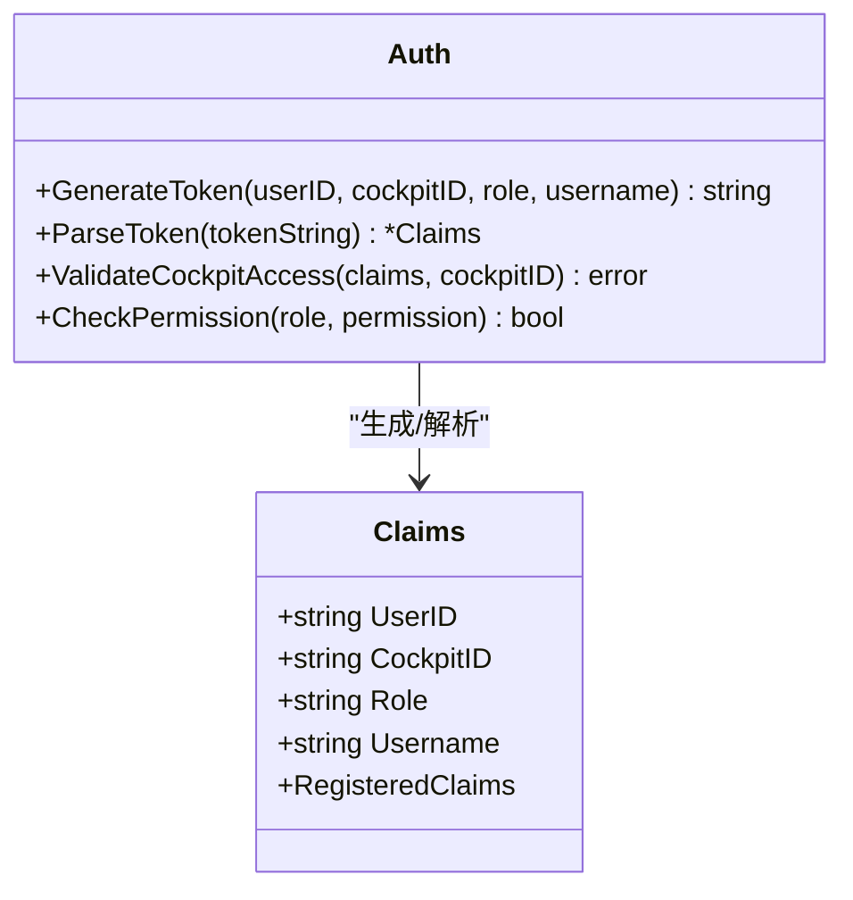
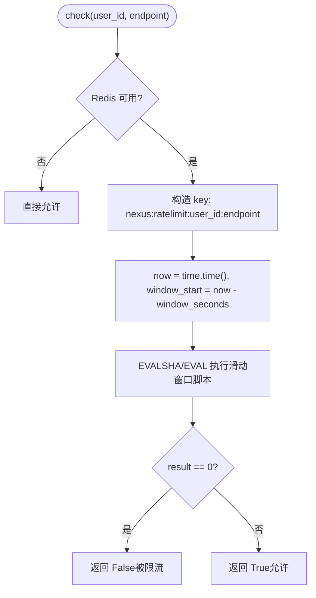
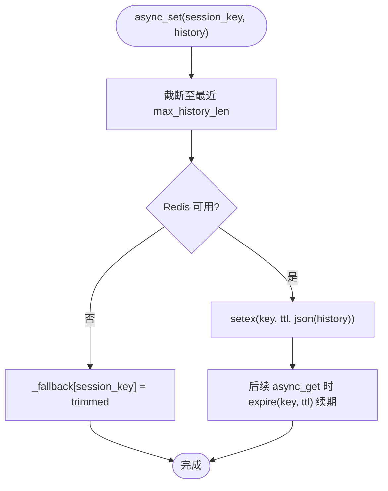
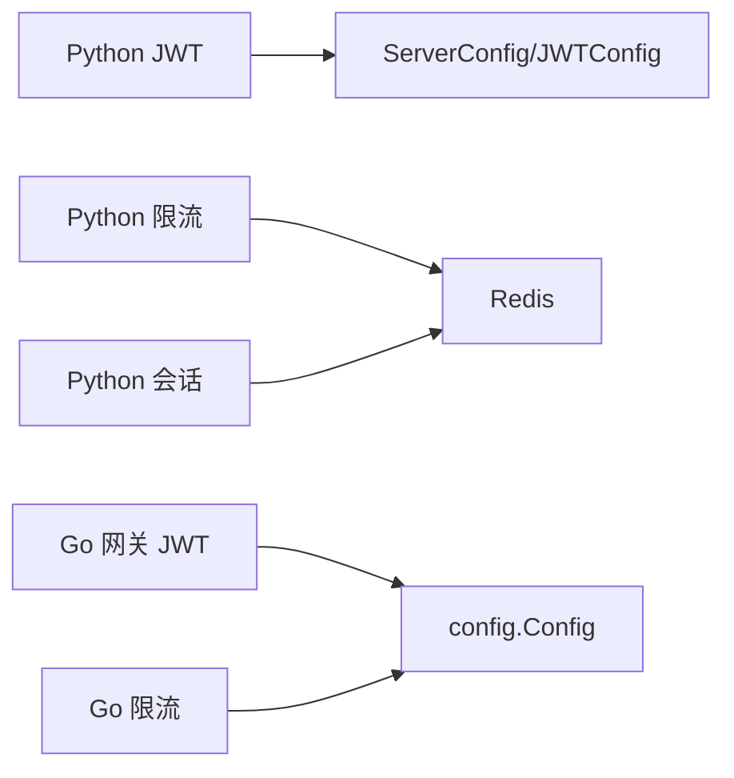

# API安全与认证

<cite>
**本文引用的文件**   
- [backend_design/nexus/core/auth.py](file://backend_design/nexus/core/auth.py)
- [backend_design/nexus/api/routes/auth.py](file://backend_design/nexus/api/routes/auth.py)
- [backend_design/nexus/middleware/rate_limiter.py](file://backend_design/nexus/middleware/rate_limiter.py)
- [backend_design/nexus_gate/internal/auth/jwt.go](file://backend_design/nexus_gate/internal/auth/jwt.go)
- [backend_design/nexus_gate/internal/ratelimit/ratelimit.go](file://backend_design/nexus_gate/internal/ratelimit/ratelimit.go)
- [backend_design/nexus/config/server.py](file://backend_design/nexus/config/server.py)
- [backend_design/nexus/core/exceptions.py](file://backend_design/nexus/core/exceptions.py)
- [backend_design/nexus/middleware/session_store.py](file://backend_design/nexus/middleware/session_store.py)
- [backend_design/nexus/main.py](file://backend_design/nexus/main.py)
- [backend_design/nexus_gate/internal/config/config.go](file://backend_design/nexus_gate/internal/config/config.go)
</cite>

## 目录
1. [简介](#简介)
2. [项目结构](#项目结构)
3. [核心组件](#核心组件)
4. [架构总览](#架构总览)
5. [详细组件分析](#详细组件分析)
6. [依赖关系分析](#依赖关系分析)
7. [性能考量](#性能考量)
8. [故障排查指南](#故障排查指南)
9. [结论](#结论)
10. [附录](#附录)

## 简介
本文件面向 NexusCockpit 的 API 安全与认证体系，系统性说明以下方面：
- JWT 令牌签发与验证机制（Python 后端与 Go 网关双端一致性）
- 权限验证流程（RBAC、座舱访问控制）
- 会话管理策略（Redis 持久化与降级）
- 限流中间件实现原理（滑动窗口与令牌桶、优先级限流）
- API 访问控制、数据加密传输与安全头设置
- 安全配置最佳实践、常见攻击防护与审计日志记录
- 安全测试方法与漏洞扫描工具推荐

## 项目结构
NexusCockpit 的安全相关能力分布在 Python 后端与 Go 网关两个子系统中：
- Python 后端（FastAPI）：负责 JWT 校验、限流中间件、会话存储、异常处理与指标采集
- Go 网关（nexus_gate）：负责统一鉴权、RBAC 权限校验、优先级限流与跨域配置



**图表来源** 
- [backend_design/nexus_gate/internal/auth/jwt.go](file://backend_design/nexus_gate/internal/auth/jwt.go)
- [backend_design/nexus_gate/internal/ratelimit/ratelimit.go](file://backend_design/nexus_gate/internal/ratelimit/ratelimit.go)
- [backend_design/nexus_gate/internal/config/config.go](file://backend_design/nexus_gate/internal/config/config.go)
- [backend_design/nexus/core/auth.py](file://backend_design/nexus/core/auth.py)
- [backend_design/nexus/middleware/rate_limiter.py](file://backend_design/nexus/middleware/rate_limiter.py)
- [backend_design/nexus/middleware/session_store.py](file://backend_design/nexus/middleware/session_store.py)
- [backend_design/nexus/main.py](file://backend_design/nexus/main.py)

**章节来源**
- [backend_design/nexus/main.py:436-654](file://backend_design/nexus/main.py#L436-L654)
- [backend_design/nexus_gate/internal/config/config.go:80-142](file://backend_design/nexus_gate/internal/config/config.go#L80-L142)

## 核心组件
- JWT 认证（Python）：提供 Token 签发、解码与 FastAPI 依赖注入，支持可选认证
- JWT 认证（Go 网关）：统一签发与解析，携带角色与座舱信息，进行 RBAC 校验
- 限流中间件（Python）：基于 Redis Lua 的原子滑动窗口与令牌桶算法
- 优先级限流（Go 网关）：按座舱与优先级分配令牌，保护高优业务
- 会话存储（Python）：Redis 持久化会话历史与滚动摘要，具备内存降级
- 全局异常与指标：统一错误格式、状态码映射与 Prometheus 指标采集

**章节来源**
- [backend_design/nexus/core/auth.py:35-140](file://backend_design/nexus/core/auth.py#L35-L140)
- [backend_design/nexus_gate/internal/auth/jwt.go:28-88](file://backend_design/nexus_gate/internal/auth/jwt.go#L28-L88)
- [backend_design/nexus/middleware/rate_limiter.py:117-297](file://backend_design/nexus/middleware/rate_limiter.py#L117-L297)
- [backend_design/nexus_gate/internal/ratelimit/ratelimit.go:111-178](file://backend_design/nexus_gate/internal/ratelimit/ratelimit.go#L111-L178)
- [backend_design/nexus/middleware/session_store.py:43-294](file://backend_design/nexus/middleware/session_store.py#L43-L294)
- [backend_design/nexus/main.py:503-596](file://backend_design/nexus/main.py#L503-L596)

## 架构总览
下图展示从客户端到网关再到后端的完整认证与限流路径。



**图表来源** 
- [backend_design/nexus_gate/internal/auth/jwt.go:28-50](file://backend_design/nexus_gate/internal/auth/jwt.go#L28-L50)
- [backend_design/nexus/core/auth.py:85-122](file://backend_design/nexus/core/auth.py#L85-L122)
- [backend_design/nexus/middleware/rate_limiter.py:156-203](file://backend_design/nexus/middleware/rate_limiter.py#L156-L203)

## 详细组件分析

### JWT 认证（Python）
- 签发 Access Token：包含 subject、exp、iat，支持额外 claims（如 role、cockpit_id）
- 解码与校验：HS256 算法，密钥来自配置；过期或无效抛出 AuthError
- FastAPI 依赖注入：get_current_user 强制认证，get_optional_user 可选认证
- 路由示例：/auth/token 签发 Token，/auth/me 验证 Token 有效性



**图表来源** 
- [backend_design/nexus/core/auth.py:85-122](file://backend_design/nexus/core/auth.py#L85-L122)

**章节来源**
- [backend_design/nexus/core/auth.py:35-140](file://backend_design/nexus/core/auth.py#L35-L140)
- [backend_design/nexus/api/routes/auth.py:48-84](file://backend_design/nexus/api/routes/auth.py#L48-L84)

### JWT 认证（Go 网关）
- Claims 结构：包含 user_id、cockpit_id、role、username 及标准字段
- GenerateToken：使用 HS256 签名，设置 Issuer、Subject、ExpireAt、IssuedAt
- ParseToken：去除 Bearer 前缀，校验签名方法，返回 Claims
- ValidateCockpitAccess：super_admin 可访问所有座舱，其他角色需匹配 cockpit_id
- CheckPermission：基于角色的权限列表判断



**图表来源** 
- [backend_design/nexus_gate/internal/auth/jwt.go:19-88](file://backend_design/nexus_gate/internal/auth/jwt.go#L19-L88)

**章节来源**
- [backend_design/nexus_gate/internal/auth/jwt.go:28-128](file://backend_design/nexus_gate/internal/auth/jwt.go#L28-L128)

### 限流中间件（Python）
- 滑动窗口算法：基于 Redis ZSET，Lua 脚本原子清理旧条目、统计计数、添加新条目
- 令牌桶算法：基于 Redis Hash，Lua 脚本计算补充令牌、检查消耗
- 降级策略：Redis 不可用时放行，避免服务不可用
- 监控指标：剩余次数查询、超限告警日志



**图表来源** 
- [backend_design/nexus/middleware/rate_limiter.py:156-203](file://backend_design/nexus/middleware/rate_limiter.py#L156-L203)

**章节来源**
- [backend_design/nexus/middleware/rate_limiter.py:28-114](file://backend_design/nexus/middleware/rate_limiter.py#L28-L114)
- [backend_design/nexus/middleware/rate_limiter.py:117-297](file://backend_design/nexus/middleware/rate_limiter.py#L117-L297)

### 优先级限流（Go 网关）
- 三级优先级：高（车控指令、ASR/TTS）、普通（对话）、低（状态查询）
- 令牌桶容量与速率：每个座舱独立桶，全局限桶为座舱上限×3
- 优先级配额：高优先可用全部令牌，普通最多 80%，低最多 50%
- 统计接口：暴露各座舱可用令牌数与全局容量

```mermaid
classDiagram
class TokenBucket {
-int capacity
-int tokens
-time.Duration rate
-time.Time lastRefill
+Allow() bool
+AllowWithPriority(p) bool
+AvailableTokens() int
}
class RateLimiter {
-map[string]*TokenBucket buckets
-*TokenBucket globalBucket
+Allow(cockpitID) bool
+AllowWithPriority(cockpitID, p) bool
+GetStats() map[string]interface{}
}
RateLimiter --> TokenBucket : "每座舱一个桶"
```

**图表来源** 
- [backend_design/nexus_gate/internal/ratelimit/ratelimit.go:42-109](file://backend_design/nexus_gate/internal/ratelimit/ratelimit.go#L42-L109)
- [backend_design/nexus_gate/internal/ratelimit/ratelimit.go:111-178](file://backend_design/nexus_gate/internal/ratelimit/ratelimit.go#L111-L178)

**章节来源**
- [backend_design/nexus_gate/internal/ratelimit/ratelimit.go:1-178](file://backend_design/nexus_gate/internal/ratelimit/ratelimit.go#L1-L178)

### 会话管理（Python）
- Redis 持久化：会话历史与滚动摘要分别存储，共享 TTL
- 降级策略：Redis 不可用时回退到内存 dict
- 自动续期：活跃会话读取时更新 TTL，防止过期丢失
- 删除与清理：同时清理短期记忆与滚动摘要



**图表来源** 
- [backend_design/nexus/middleware/session_store.py:152-194](file://backend_design/nexus/middleware/session_store.py#L152-L194)

**章节来源**
- [backend_design/nexus/middleware/session_store.py:43-294](file://backend_design/nexus/middleware/session_store.py#L43-L294)

### 全局异常与指标（Python）
- 限流异常：RateLimitError → 429，附带 Retry-After
- 认证异常：AuthError → 401，附带 WWW-Authenticate
- 统一错误格式：{error, message, details}
- Prometheus 指标：请求计数、延迟、响应时间头注入

**章节来源**
- [backend_design/nexus/main.py:503-596](file://backend_design/nexus/main.py#L503-L596)
- [backend_design/nexus/core/exceptions.py:105-117](file://backend_design/nexus/core/exceptions.py#L105-L117)

## 依赖关系分析
- Python 后端依赖：
  - JWT 配置（secret_key、algorithm、expire_minutes）
  - Redis（限流与会话存储）
  - FastAPI（中间件、异常处理器、指标）
- Go 网关依赖：
  - JWT 密钥与过期时间（与 Python 侧保持一致）
  - RBAC 角色与权限映射
  - 限流参数（QPS、优先级阈值）



**图表来源** 
- [backend_design/nexus/config/server.py:44-61](file://backend_design/nexus/config/server.py#L44-L61)
- [backend_design/nexus_gate/internal/config/config.go:80-142](file://backend_design/nexus_gate/internal/config/config.go#L80-L142)

**章节来源**
- [backend_design/nexus/config/server.py:15-61](file://backend_design/nexus/config/server.py#L15-L61)
- [backend_design/nexus_gate/internal/config/config.go:80-142](file://backend_design/nexus_gate/internal/config/config.go#L80-L142)

## 性能考量
- 滑动窗口与令牌桶均通过 Redis Lua 脚本保证原子性，减少竞争条件
- EVALSHA 预加载脚本提升调用效率
- 限流失败时快速返回，避免阻塞主流程
- 会话存储采用 setex 与 expire 组合，降低内存占用
- Prometheus 指标采集排除自身端点，避免自引用开销

**章节来源**
- [backend_design/nexus/middleware/rate_limiter.py:142-155](file://backend_design/nexus/middleware/rate_limiter.py#L142-L155)
- [backend_design/nexus/main.py:486-502](file://backend_design/nexus/main.py#L486-L502)

## 故障排查指南
- 认证失败（401）：
  - 检查 Authorization 头是否携带 Bearer Token
  - 确认 Token 未过期且密钥一致
  - 查看 AuthError 日志定位具体原因
- 限流触发（429）：
  - 检查 Redis 连接与 Lua 脚本加载
  - 调整窗口大小与最大请求数
  - 观察限流日志中的 user_id 与 endpoint
- 会话丢失：
  - 确认 Redis 模式与 TTL 配置
  - 检查降级到内存后的数据一致性
- 生产环境启动失败：
  - 检查 JWT_SECRET、RBAC_ADMIN_PASSWORD、CORS_ORIGINS 等强安全配置

**章节来源**
- [backend_design/nexus/main.py:503-596](file://backend_design/nexus/main.py#L503-L596)
- [backend_design/nexus_gate/internal/config/config.go:120-142](file://backend_design/nexus_gate/internal/config/config.go#L120-L142)

## 结论
NexusCockpit 的安全与认证体系在 Python 后端与 Go 网关之间形成闭环：
- JWT 双端一致，支持 RBAC 与座舱级访问控制
- 限流策略兼顾突发与稳定速率，保障高优业务
- 会话持久化与降级确保稳定性与可用性
- 统一的异常与指标便于监控与排障

建议在生产环境中严格遵循安全配置最佳实践，定期开展安全测试与漏洞扫描。

## 附录

### 安全配置最佳实践
- 使用强随机 JWT_SECRET，禁止默认值
- 生产环境禁用通配 CORS，指定明确域名
- 设置 RBAC_USER_PASSWORD，限制普通用户 Token 签发
- 合理配置 JWT 过期时间与会话 TTL
- 启用 HTTPS 与 HSTS，限制不安全头

### 常见攻击防护
- 防暴力破解：结合限流与验证码机制
- 防重放攻击：使用 nonce 与时间戳校验
- 防越权访问：严格校验 cockpit_id 与角色权限
- 防敏感信息泄露：统一错误格式，隐藏内部堆栈

### 审计日志记录
- 登录与 Token 签发记录
- 权限校验失败与座舱访问拒绝
- 限流触发与 Redis 异常
- 会话创建、更新与删除

### 安全测试方法与工具推荐
- 单元测试：覆盖 JWT 签发/解析、RBAC 权限判断
- 集成测试：模拟多实例并发下的限流与会话一致性
- 渗透测试：OWASP ZAP、Burp Suite 扫描常见漏洞
- 代码扫描：Semgrep、SonarQube 检测硬编码密钥与弱配置